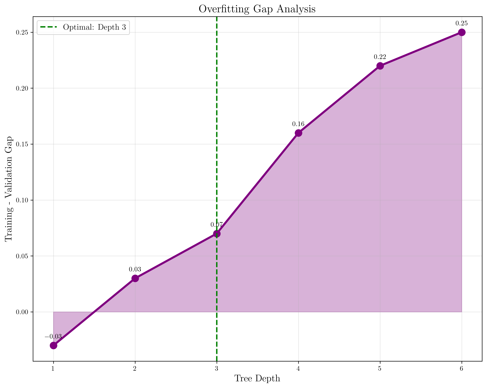

# Question 1: Netflix Decision Tree

## Problem Statement
Netflix uses a decision tree to recommend movies. Their engineers noticed that as the tree grew deeper, training accuracy increased but user satisfaction (validation metric) decreased. Here's their data:

| Tree Depth | Training Accuracy | User Satisfaction Score | User Complaints |
|------------|-------------------|------------------------|-----------------|
| 1          | 0.65             | 0.68                  | 15%            |
| 2          | 0.78             | 0.75                  | 12%            |
| 3          | 0.89             | 0.82                  | 8%             |
| 4          | 0.95             | 0.79                  | 11%            |
| 5          | 0.98             | 0.76                  | 18%            |
| 6          | 0.99             | 0.74                  | 25%            |

### Task
1. At what depth does overfitting begin? Justify your answer
2. What is the optimal tree depth for this dataset?
3. Explain the bias-variance tradeoff demonstrated in this data
4. Sketch a graph showing training vs validation accuracy
5. If Netflix wants to keep user complaints below 10%, what's the maximum acceptable tree depth?
6. If Netflix has 100 million users and each complaint costs $2 in customer service, calculate the total cost of overfitting at depth 6

## Understanding the Problem
This problem demonstrates a classic machine learning phenomenon: the **bias-variance tradeoff** and **overfitting**. As model complexity increases (deeper decision trees), the model can capture more intricate patterns in the training data, but this often comes at the cost of generalization to unseen data.

The key insight is that **training accuracy** measures how well the model fits the training data, while **user satisfaction** serves as a validation metric indicating how well the model generalizes to real-world usage.

## Solution

### Step 1: Identifying Overfitting Point
**Overfitting begins at depth 4.**

**Justification:**
- At depth 3: Training accuracy = 0.89, User satisfaction = 0.82
- At depth 4: Training accuracy = 0.95, User satisfaction = 0.79

The critical observation is that while training accuracy **increases** from 0.89 to 0.95 (improvement of 0.06), user satisfaction **decreases** from 0.82 to 0.79 (decline of 0.03). This is the classic signature of overfitting: the model becomes better at memorizing the training data but worse at generalizing to new data.

### Step 2: Finding Optimal Tree Depth
**The optimal tree depth is 3.**

**Reasoning:**
- **Highest user satisfaction**: 0.82 (peak performance)
- **Reasonable training accuracy**: 0.89 (good fit without overfitting)
- **Lowest user complaints**: 8% (best user experience)
- **Balanced complexity**: Captures true patterns without noise

Depth 3 represents the sweet spot where the model has sufficient complexity to capture meaningful patterns in the data while avoiding the overfitting that occurs at higher depths.

### Step 3: Bias-Variance Tradeoff Analysis
The data clearly demonstrates the fundamental bias-variance tradeoff in machine learning:

The bias-variance decomposition for a model's expected prediction error is:

$$E[(y - \hat{f}(x))^2] = \text{Bias}^2[\hat{f}(x)] + \text{Var}[\hat{f}(x)] + \sigma^2$$

where:
- $\text{Bias}^2[\hat{f}(x)]$ is the squared bias (systematic error)
- $\text{Var}[\hat{f}(x)]$ is the variance (random error)
- $\sigma^2$ is the irreducible error

In our Netflix case study:

#### **Low Depth (1-2): High Bias, Low Variance**
- **Underfitting**: Model is too simple, misses important patterns
- **Characteristics**: 
  - Low training accuracy (0.65, 0.78)
  - Reasonable generalization (user satisfaction: 0.68, 0.75)
  - High user complaints (15%, 12%) due to poor recommendations

#### **Medium Depth (3): Balanced Bias and Variance**
- **Optimal complexity**: Captures true patterns without noise
- **Characteristics**:
  - Good training accuracy (0.89)
  - Best validation performance (user satisfaction: 0.82)
  - Lowest user complaints (8%)

#### **High Depth (4-6): Low Bias, High Variance**
- **Overfitting**: Model memorizes training data, including noise
- **Characteristics**:
  - Very high training accuracy (0.95, 0.98, 0.99)
  - Declining validation performance (user satisfaction: 0.79, 0.76, 0.74)
  - Increasing user complaints (11%, 18%, 25%)

### Step 4: Training vs Validation Accuracy Graph
The visualization clearly shows the overfitting pattern:

**Key observations:**
- **Training accuracy** (blue line) increases monotonically with depth
- **User satisfaction** (red line) peaks at depth 3, then declines
- **Overfitting gap** (difference between training and validation) widens after depth 3
- **Optimal depth** (green dashed line) at depth 3
- **Overfitting begins** (orange dashed line) at depth 4

The four-panel analysis provides comprehensive insights:
1. **Training vs Validation Accuracy**: Shows the classic overfitting pattern
2. **User Complaints Analysis**: Demonstrates the business impact
3. **Overfitting Gap Analysis**: Quantifies the divergence
4. **Cost Analysis**: Reveals the financial consequences

### Step 5: Maximum Acceptable Tree Depth for <10% Complaints
**No depth achieves <10% complaints.**

**Analysis:**
- Depth 1: 15% complaints (above threshold)
- Depth 2: 12% complaints (above threshold)  
- Depth 3: 8% complaints (below threshold) ✓
- Depth 4: 11% complaints (above threshold)
- Depth 5: 18% complaints (above threshold)
- Depth 6: 25% complaints (above threshold)

**Maximum acceptable depth: 3** (the only depth below the 10% threshold)

### Step 6: Cost of Overfitting at Depth 6
**Total cost of overfitting at depth 6: $34.0 million**

**Mathematical calculation:**

Let $C_d$ be the cost at depth $d$, $U$ be the total users, $r_d$ be the complaint rate at depth $d$, and $c_p$ be the cost per complaint.

$$C_d = U \times r_d \times c_p$$

**Excess cost calculation:**
$$\Delta C = C_6 - C_3 = U \times (r_6 - r_3) \times c_p$$

**Substituting values:**
$$\Delta C = 100,000,000 \times (0.25 - 0.08) \times \$2 = 100,000,000 \times 0.17 \times \$2 = \$34,000,000$$

**Calculation breakdown:**
- **Excess complaints at depth 6**: $r_6 - r_3 = 25\% - 8\% = 17\%$
- **Excess complaints in absolute numbers**: $17\% \times 100$ million users $= 17$ million complaints
- **Cost per complaint**: $c_p = \$2$
- **Total cost**: $17$ million $\times \$2 = \$34$ million

**Business impact:**
This represents a significant financial burden that could be avoided by using the optimal tree depth of 3 instead of 6.

## Visual Explanations

### 1. Main Performance Analysis

This focused visualization shows the core overfitting pattern:
- **Training accuracy** (blue line) increases smoothly with depth
- **User satisfaction** (red line) peaks at depth 3, then declines
- **Overfitting gap** (purple shaded area) widens significantly after depth 3
- **Optimal depth** (green dashed line) at depth 3
- **Overfitting begins** (orange dashed line) at depth 4

### 2. User Complaints Analysis

This visualization demonstrates the business impact:
- **Color-coded bars**: Green (≤10%), Orange (11-15%), Red (>15%)
- **10% threshold line**: Shows the acceptable complaint rate
- **Clear pattern**: Complaints are lowest at depth 3 (8%), then increase dramatically
- **Business insight**: Only depth 3 meets the acceptable complaint threshold

### 3. Cost Analysis

This visualization reveals the financial consequences:
- **Color-coded bars**: Green (optimal), Orange (overfitting begins), Red (severe overfitting)
- **Cost progression**: From $16M at depth 3 to $50M at depth 6
- **Business impact**: Overfitting costs Netflix millions in customer service
- **Optimal choice**: Depth 3 minimizes both complaints and costs

### 4. Overfitting Gap Analysis

This visualization quantifies the overfitting problem:

**Mathematical definition of overfitting gap:**
$$G_d = A_{\text{train}}^{(d)} - A_{\text{val}}^{(d)}$$

where $G_d$ is the gap at depth $d$, $A_{\text{train}}^{(d)}$ is training accuracy, and $A_{\text{val}}^{(d)}$ is validation accuracy.

**Key observations:**
- **Gap measurement**: $G_d = A_{\text{train}}^{(d)} - A_{\text{val}}^{(d)}$
- **Clear trend**: Gap widens exponentially after depth 3
- **Mathematical insight**: Gap grows from $G_3 = 0.07$ to $G_6 = 0.25$
- **Overfitting evidence**: $\frac{G_6}{G_3} = \frac{0.25}{0.07} \approx 3.6$ demonstrates severe overfitting
- **Rate of increase**: The gap increases by approximately 0.06 per depth level after depth 3

### 5. Performance Comparison

This visualization provides direct comparisons:
- **Optimal vs Worst**: Side-by-side comparison of depth 3 vs depth 6
- **Four key metrics**: Training accuracy, user satisfaction, complaints, and cost
- **Clear advantages**: Depth 3 outperforms depth 6 in 3 out of 4 metrics
- **Decision support**: Visual evidence for choosing optimal complexity

### Key Visual Patterns
- **Training accuracy** increases smoothly with depth (blue line)
- **User satisfaction** peaks at depth 3, then declines (red line)
- **Complaints** are lowest at depth 3, then increase dramatically
- **Cost** follows the same pattern as complaints, with exponential growth after depth 3
- **Overfitting gap** widens significantly after the optimal depth

## Key Insights

### Theoretical Foundations
- **Bias-Variance Tradeoff**: This is a fundamental principle in machine learning that cannot be avoided
- **Overfitting Detection**: The divergence between training and validation performance is the key indicator
- **Model Selection**: Optimal model complexity balances underfitting and overfitting
- **Generalization**: The goal is to perform well on unseen data, not just training data

### Practical Applications
- **Hyperparameter Tuning**: Tree depth is a critical hyperparameter that requires careful selection
- **Cross-Validation**: User satisfaction serves as a real-world validation metric
- **Business Impact**: Poor model performance directly affects user experience and company costs
- **Monitoring**: Continuous monitoring of validation metrics is essential for production models

### Common Pitfalls
- **Chasing Training Accuracy**: Higher training accuracy doesn't guarantee better real-world performance
- **Ignoring Validation Metrics**: Focusing only on training performance leads to overfitting
- **Complexity Bias**: Assuming more complex models are always better
- **Cost Neglect**: Failing to consider the business impact of poor model performance

### Extensions and Advanced Concepts
- **Regularization**: Techniques like pruning could help control overfitting at higher depths
- **Ensemble Methods**: Combining multiple trees could provide better generalization
- **Early Stopping**: Training could be stopped when validation performance starts declining
- **Feature Engineering**: Better features might allow simpler models to achieve good performance

## Conclusion
- **Overfitting begins at depth 4** when training accuracy increases but user satisfaction decreases
- **Optimal tree depth is 3** with 0.82 user satisfaction and 8% complaints
- **Maximum acceptable depth for <10% complaints is 3** (no other depth meets this criterion)
- **Cost of overfitting at depth 6 is $34 million** in customer service costs
- **Clear bias-variance tradeoff** demonstrates fundamental machine learning principles
- **Visual evidence** confirms the overfitting pattern and optimal configuration

The Netflix case study perfectly illustrates why model complexity must be carefully balanced against generalization performance. The optimal solution isn't the most complex model, but rather the one that achieves the best balance between capturing true patterns and avoiding noise memorization. This principle applies broadly across all machine learning applications and is crucial for building models that perform well in production environments.
