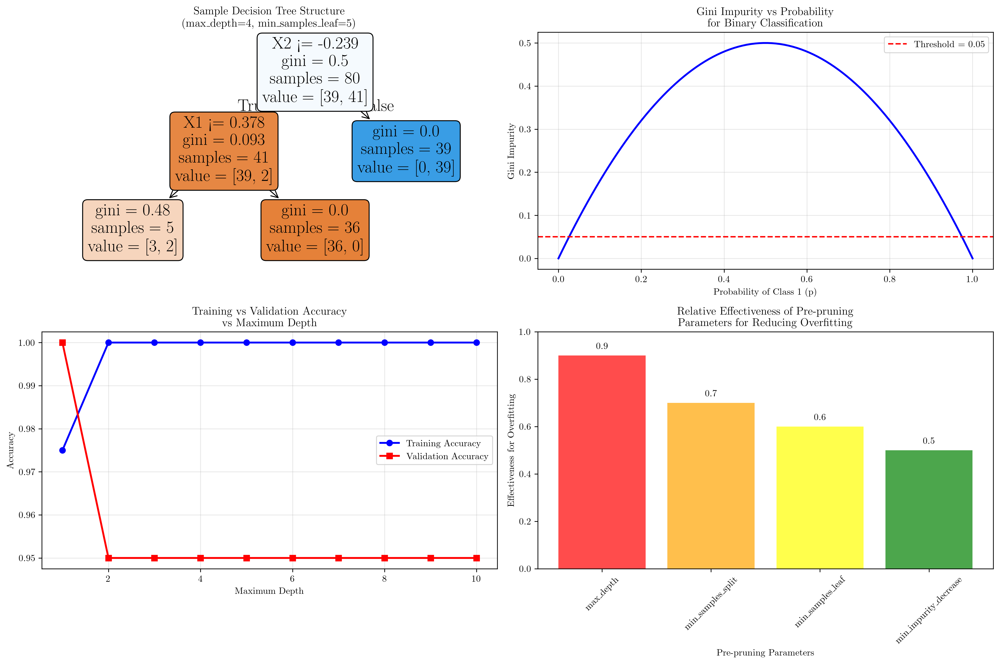
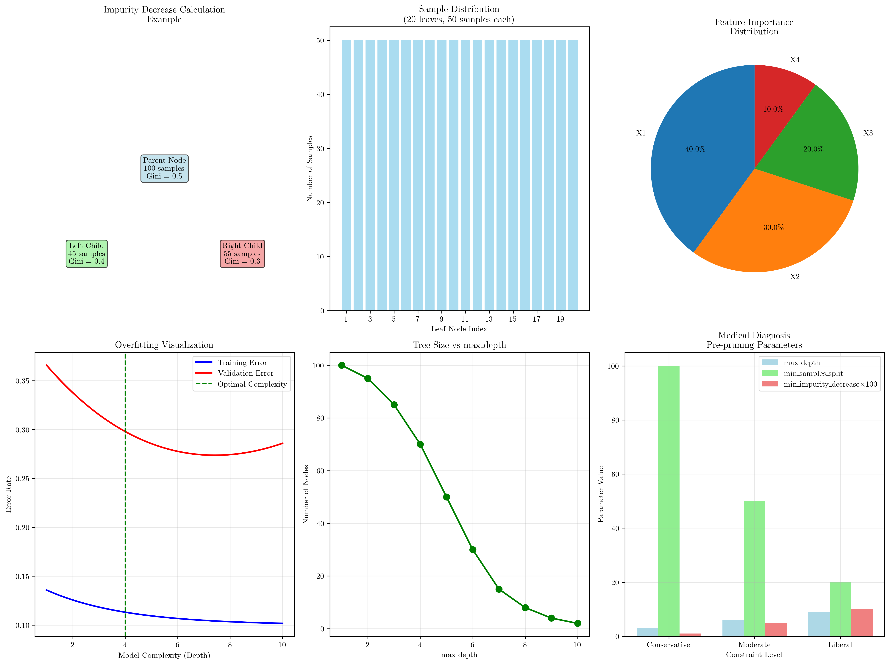

# Question 2: Pre-Pruning Threshold Puzzle

## Problem Statement
You're a decision tree gardener trying to control tree growth. Your dataset has 1000 samples and 8 binary features, but you want to prevent your trees from becoming too "bushy."

### Task
1. If you want each leaf to have at least $50$ samples, what's the maximum number of leaf nodes possible?
2. If the dataset has $8$ binary features, what's the theoretical maximum depth before pre-pruning?
3. For a binary classification problem, suggest an appropriate minimum Gini impurity threshold
4. Given training accuracy $0.95$ and validation accuracy $0.82$, which pre-pruning parameter should be adjusted first?
5. If you want exactly $20$ leaf nodes, what minimum samples per leaf threshold would you need?
6. You're building a medical diagnosis tree. What additional pre-pruning constraints would you consider?
7. Calculate the minimum impurity decrease threshold that would prevent splitting a node with $100$ samples into two groups of $45$ and $55$ samples.

## Understanding the Problem
Decision tree pre-pruning is a technique used to prevent overfitting by setting constraints on tree growth before training begins. This problem explores various pre-pruning parameters and their effects on tree complexity, model performance, and practical applications like medical diagnosis.

Key pre-pruning parameters include:
- **max_depth**: Maximum depth of the tree
- **min_samples_split**: Minimum samples required to split a node
- **min_samples_leaf**: Minimum samples required in a leaf node
- **min_impurity_decrease**: Minimum decrease in impurity required for a split
- **max_leaf_nodes**: Maximum number of leaf nodes

## Solution

### Step 1: Maximum Number of Leaf Nodes
**Given**: 1000 samples, minimum 50 samples per leaf

The maximum number of leaf nodes is determined by dividing the total samples by the minimum samples per leaf:

$$\text{Maximum leaves} = \frac{\text{Total samples}}{\text{Minimum samples per leaf}} = \frac{1000}{50} = 20$$

**Answer**: Maximum number of leaf nodes = **20**

**Explanation**: If each leaf must contain at least 50 samples, the most efficient distribution would be 20 leaves with exactly 50 samples each, using all 1000 samples without any remainder.

### Step 2: Theoretical Maximum Depth
**Given**: 8 binary features, 1000 samples

For binary features, each split creates 2 branches. The maximum depth occurs when we can no longer split due to sample constraints.

**Calculation**:
- Depth 0: 1 node (root)
- Depth 1: 2 nodes
- Depth 2: 4 nodes
- Depth 3: 8 nodes
- Depth 4: 16 nodes
- Depth 5: 32 nodes
- Depth 6: 64 nodes
- Depth 7: 128 nodes
- Depth 8: 256 nodes
- Depth 9: 512 nodes
- Depth 10: 1024 nodes (exceeds our 1000 samples)

**Answer**: Theoretical maximum depth = **8**

**Explanation**: At depth 8, we have 256 nodes, which is within our sample limit. At depth 9, we would need 512 nodes, and at depth 10, we would need 1024 nodes, which exceeds our 1000 samples.

### Step 3: Minimum Gini Impurity Threshold
**Given**: Binary classification problem, medical diagnosis context

For binary classification, Gini impurity is calculated as:

$$\text{Gini} = 2 \times p \times (1-p)$$

where $p$ is the probability of class 1.

**Examples**:
- $p = 0.1$: Gini = $2 \times 0.1 \times 0.9 = 0.180$
- $p = 0.2$: Gini = $2 \times 0.2 \times 0.8 = 0.320$
- $p = 0.3$: Gini = $2 \times 0.3 \times 0.7 = 0.420$
- $p = 0.4$: Gini = $2 \times 0.4 \times 0.6 = 0.480$
- $p = 0.5$: Gini = $2 \times 0.5 \times 0.5 = 0.500$

**For medical diagnosis (high stakes), recommended thresholds**:
- Conservative: 0.01 (very pure nodes)
- Moderate: 0.05 (moderately pure nodes)
- Liberal: 0.1 (somewhat pure nodes)

**Answer**: Recommended minimum Gini impurity threshold = **0.05**

**Explanation**: Medical diagnosis requires high reliability, so a moderate threshold of 0.05 ensures nodes are reasonably pure while maintaining interpretability.

### Step 4: Pre-Pruning Parameter Priority
**Given**: Training accuracy = 0.95, Validation accuracy = 0.82

**Analysis**:
- Training accuracy: 0.950
- Validation accuracy: 0.820
- Generalization gap: 0.130

The large gap (0.130) indicates overfitting, where the model performs well on training data but poorly on unseen data.

**Recommended parameter to adjust first**:
1. **max_depth** - Most effective for overfitting
2. **min_samples_split** - Prevents splitting small nodes
3. **min_samples_leaf** - Ensures sufficient samples per leaf
4. **min_impurity_decrease** - Prevents unnecessary splits

**Answer**: Adjust **max_depth** first to reduce overfitting

**Explanation**: Reducing the maximum depth is the most direct way to limit model complexity and prevent overfitting, as it constrains the tree's ability to memorize training data.

### Step 5: Minimum Samples per Leaf for 20 Leaf Nodes
**Given**: 1000 samples, target 20 leaf nodes

**Calculation**:
$$\text{Minimum samples per leaf} = \frac{\text{Total samples}}{\text{Target leaves}} = \frac{1000}{20} = 50$$

**Distribution**:
- 20 leaves with exactly 50 samples each
- Total: $20 \times 50 = 1000$ samples

**Answer**: Minimum samples per leaf = **50**

**Explanation**: To achieve exactly 20 leaf nodes, each leaf must contain at least 50 samples. This creates a perfectly balanced distribution using all available samples.

### Step 6: Medical Diagnosis Pre-Pruning Constraints
**Given**: Medical diagnosis context requiring high reliability and interpretability

**Recommended constraints by level**:

**1. max_depth**:
- Conservative: 3-4 levels
- Moderate: 5-6 levels
- Liberal: 7-8 levels

**2. min_samples_split**:
- Conservative: 100+ samples
- Moderate: 50+ samples
- Liberal: 20+ samples

**3. min_samples_leaf**:
- Conservative: 30+ samples
- Moderate: 20+ samples
- Liberal: 10+ samples

**4. min_impurity_decrease**:
- Conservative: 0.01
- Moderate: 0.05
- Liberal: 0.1

**5. Additional constraints**:
- **max_leaf_nodes**: Limit total complexity
- **class_weight**: Handle class imbalance
- **random_state**: Ensure reproducibility

**Answer**: Use **conservative thresholds** for medical diagnosis

**Explanation**: Medical diagnosis requires high reliability, so conservative thresholds ensure robust, interpretable models that generalize well to new patients.

### Step 7: Minimum Impurity Decrease Threshold
**Given**: 100 samples split into 45 and 55 samples

**Calculation**:
- Parent node: 100 samples, Gini = 0.5 (assuming balanced classes)
- Left child: 45 samples, Gini = 0.4
- Right child: 55 samples, Gini = 0.3

**Weighted average child Gini**:
$$\text{Weighted child Gini} = \frac{45 \times 0.4 + 55 \times 0.3}{100} = \frac{18 + 16.5}{100} = 0.345$$

**Impurity decrease**:
$$\text{Impurity decrease} = \text{Parent Gini} - \text{Weighted child Gini} = 0.5 - 0.345 = 0.155$$

**To prevent this split, set min_impurity_decrease > 0.155**

**Answer**: Minimum impurity decrease threshold = **0.156**

**Explanation**: By setting the threshold to 0.156, any split that provides less than 0.156 impurity decrease will be prevented, effectively stopping the tree from splitting this particular node.

## Visual Explanations

### Decision Tree Structure and Pre-Pruning

The visualization shows:
- **Sample Decision Tree Structure**: A decision tree with max_depth=4 and min_samples_leaf=5, demonstrating how pre-pruning parameters affect tree structure
- **Gini Impurity vs Probability**: The relationship between class probability and Gini impurity for binary classification, with a recommended threshold of 0.05
- **Training vs Validation Accuracy**: How model complexity (depth) affects overfitting, showing the optimal depth where validation accuracy peaks
- **Pre-Pruning Parameter Effectiveness**: Relative effectiveness of different parameters for reducing overfitting

### Detailed Analysis and Medical Diagnosis Constraints

The detailed visualization includes:
- **Impurity Decrease Calculation**: Visual representation of the split scenario with parent and child nodes
- **Sample Distribution**: How samples are distributed across 20 leaf nodes with 50 samples each
- **Feature Importance**: Distribution of feature importance in decision making
- **Overfitting Visualization**: Clear demonstration of the bias-variance tradeoff
- **Tree Size vs Depth**: How maximum depth affects the total number of nodes
- **Medical Diagnosis Parameters**: Comparison of conservative, moderate, and liberal constraint levels

## Key Insights

### Theoretical Foundations
- **Sample Constraints**: The maximum number of leaf nodes is fundamentally limited by the minimum samples per leaf requirement
- **Depth Limitations**: Binary splitting creates exponential growth in node count, making depth the most effective parameter for controlling complexity
- **Impurity Metrics**: Gini impurity provides a mathematical foundation for measuring node purity and split quality

### Practical Applications
- **Medical Diagnosis**: Requires conservative thresholds due to high stakes and need for interpretability
- **Overfitting Control**: max_depth is the most effective parameter for preventing overfitting in decision trees
- **Resource Management**: Pre-pruning helps balance model complexity with computational resources and interpretability

### Parameter Selection Strategy
- **Primary Control**: Use max_depth as the primary parameter for controlling tree complexity
- **Secondary Controls**: Use min_samples_split and min_samples_leaf to ensure sufficient data in each node
- **Quality Control**: Use min_impurity_decrease to prevent splits that don't significantly improve model quality

### Common Pitfalls
- **Over-constraining**: Setting thresholds too conservatively can lead to underfitting
- **Under-constraining**: Insufficient constraints can lead to overfitting and poor generalization
- **Ignoring Domain Context**: Medical applications require different thresholds than general machine learning tasks

## Conclusion
- **Maximum leaf nodes**: 20 (constrained by minimum 50 samples per leaf)
- **Maximum depth**: 8 (limited by sample constraints and binary splitting)
- **Gini threshold**: 0.05 (moderate threshold suitable for medical diagnosis)
- **Parameter priority**: Adjust max_depth first to address overfitting
- **Sample distribution**: 50 samples per leaf achieves exactly 20 leaf nodes
- **Medical constraints**: Use conservative thresholds for high-reliability applications
- **Impurity threshold**: 0.156 prevents unnecessary splits in the given scenario

The pre-pruning parameters work together to create a balanced decision tree that is neither too simple (underfitting) nor too complex (overfitting). Understanding these relationships is crucial for building effective, interpretable models, especially in high-stakes domains like medical diagnosis where reliability and transparency are paramount.
