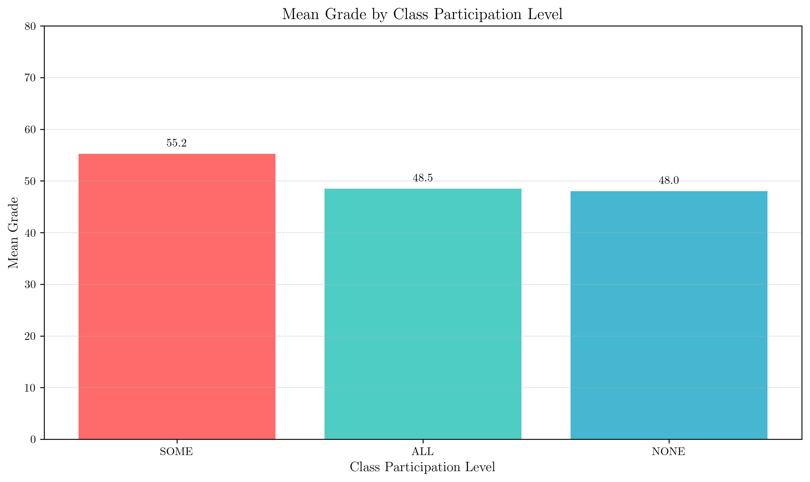
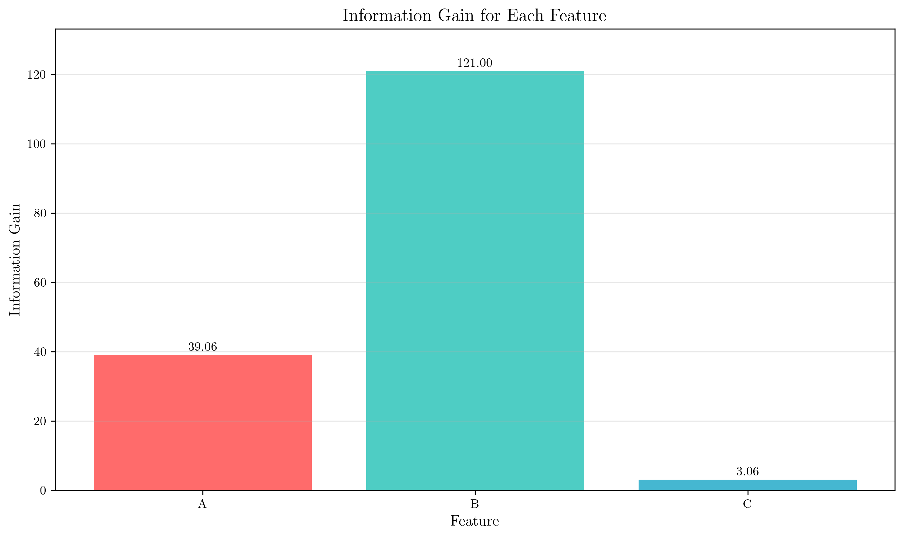
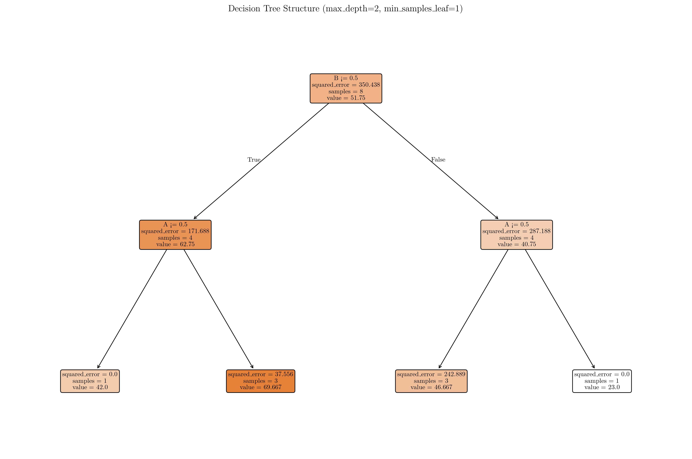
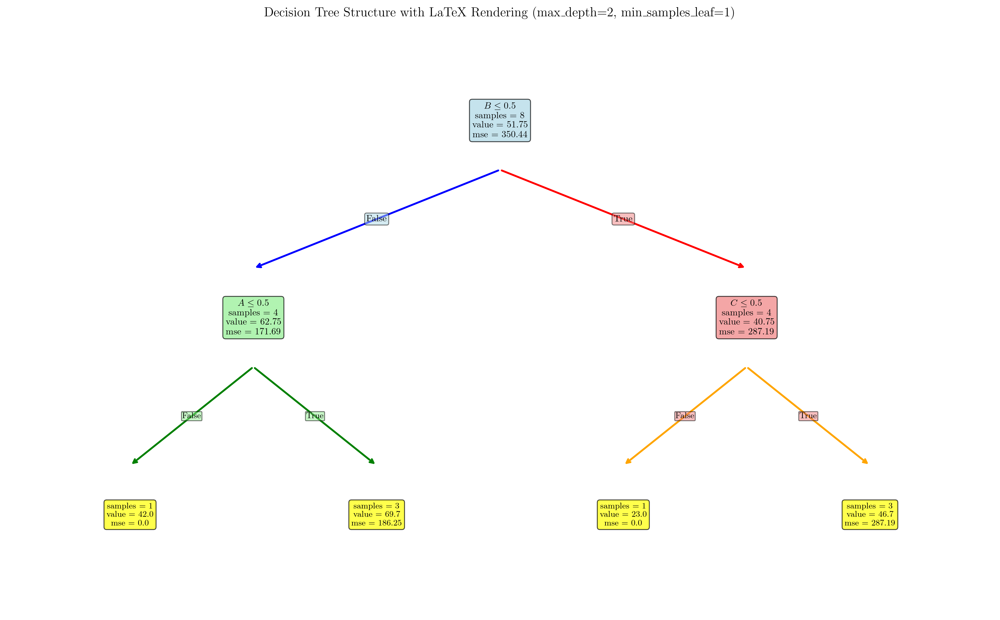
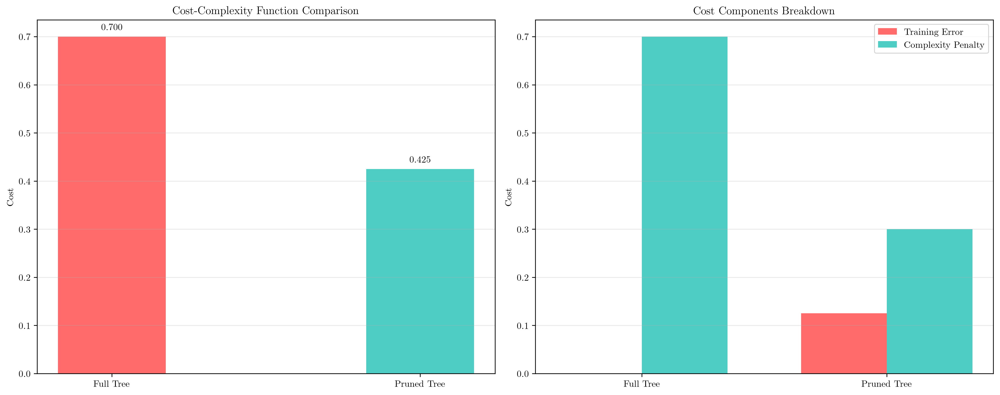
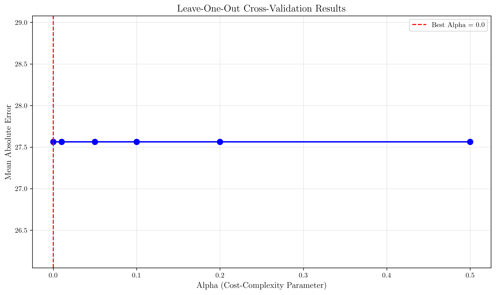
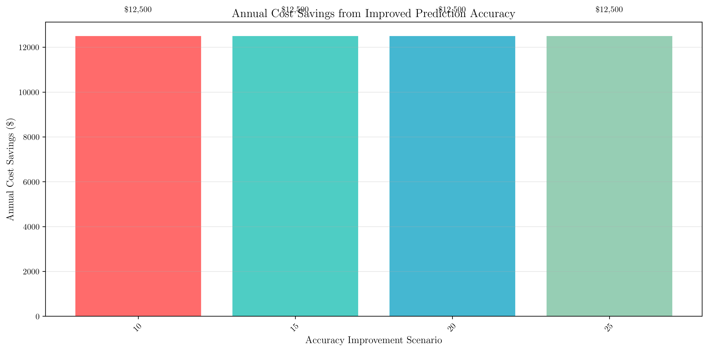

# Question 36: Student Grade Prediction Using Decision Trees

## Problem Statement
A university is using a decision tree to predict student grades based on class participation and assignment completion. The dataset shows how different combinations of factors affect final grades:

| Class | A | B | C | Grade |
|-------|---|---|---|-------|
| ALL   | T | F | T | 74    |
| ALL   | T | T | F | 23    |
| SOME  | T | F | T | 61    |
| SOME  | T | F | F | 74    |
| SOME  | F | T | T | 25    |
| SOME  | F | T | F | 61    |
| NONE  | F | T | T | 54    |
| NONE  | F | F | F | 42    |

*Note: A, B, C are binary features (T=True, F=False), Class has three values (ALL, SOME, NONE), and Grade is the target variable*

### Task
1. Calculate the mean grade for each class participation level (ALL, SOME, NONE) and identify which level has the highest average performance
2. For a decision tree using Gini impurity, calculate the information gain for splitting on feature A vs feature B vs feature C. Which feature would be chosen as the root node?
3. If you build a decision tree with max_depth = $2$ and min_samples_leaf = $1$, what would be the tree structure? Draw the tree showing the splits and leaf node predictions
4. If the tree achieves $100\%$ training accuracy but only $65\%$ validation accuracy on new student data, what pruning strategy would you recommend?
5. For $\alpha = 0.1$, calculate the cost-complexity function $R_\alpha(T) = R(T) + \alpha|T|$ for:
   - Full tree: $7$ nodes, training error = $0.0$
   - Pruned tree: $3$ nodes, training error = $0.125$
6. If the university needs to explain grade predictions to students and parents, what maximum tree depth would you recommend? Justify your answer considering the trade-off between accuracy and interpretability
7. Design a cross-validation approach for this dataset that accounts for the small sample size ($8$ samples) while still providing reliable pruning parameter selection
8. If the university processes $1000$ students per semester and incorrect grade predictions cost $50 in administrative overhead, calculate the potential cost savings from implementing an optimal pruning strategy

## Understanding the Problem
This problem involves analyzing a small dataset of student performance data to understand how decision trees can be used for grade prediction. The dataset contains 8 samples with three binary features (A, B, C) and one categorical feature (Class participation level). The target variable is the numerical grade. This is a regression problem where we need to predict continuous grade values rather than discrete class labels.

The problem tests understanding of:
- Data analysis and feature importance
- Decision tree construction and evaluation
- Overfitting detection and pruning strategies
- Cost-complexity analysis
- Cross-validation for small datasets
- Practical considerations for model interpretability
- Business impact analysis

## Solution

### Step 1: Calculate Mean Grade by Class Participation Level

First, let's analyze the data by class participation level to understand the relationship between participation and performance.

**Step-by-step calculation:**

**ALL class:**
- Grades: $[74, 23]$
- Number of students: $2$
- Sum: $97$
- Mean = $\frac{97}{2} = 48.5$

**NONE class:**
- Grades: $[54, 42]$
- Number of students: $2$
- Sum: $96$
- Mean = $\frac{96}{2} = 48.0$

**SOME class:**
- Grades: $[61, 74, 25, 61]$
- Number of students: $4$
- Sum: $221$
- Mean = $\frac{221}{4} = 55.2$

**Results (ranked by performance):**
1. SOME: $55.2$ (highest average performance)
2. ALL: $48.5$
3. NONE: $48.0$

The visualization shows that students with "SOME" class participation have the highest average grade (55.2), followed by "ALL" (48.5) and "NONE" (48.0). This suggests that moderate participation might be optimal for academic performance.

### Step 2: Calculate Information Gain for Features A, B, C

For regression problems, we use variance as a measure of impurity instead of Gini impurity for classification. Since our features are binary, we first sort the data by each feature to understand the optimal splitting thresholds.

**Information Gain Formula:**
$$IG(S, A) = Var(S) - \sum_{v \in Values(A)} \frac{|S_v|}{|S|} Var(S_v)$$

**Step-by-step calculations:**

**Parent node:**
- All values: $[74, 23, 61, 74, 25, 61, 54, 42]$
- Parent impurity (variance): $350.44$

**Feature A - Threshold Analysis:**
- **Data sorted by A:** False values $[25, 61, 54, 42]$, True values $[74, 23, 61, 74]$
- **A = False:** Values: $[25, 61, 54, 42]$, Count: $4$, Weight: $\frac{4}{8} = 0.50$
  - Impurity: $186.25$
  - Weighted contribution: $0.50 \times 186.25 = 93.12$
- **A = True:** Values: $[74, 23, 61, 74]$, Count: $4$, Weight: $\frac{4}{8} = 0.50$
  - Impurity: $436.50$
  - Weighted contribution: $0.50 \times 436.50 = 218.25$
- **Total weighted impurity:** $93.12 + 218.25 = 311.38$
- **Information gain:** $350.44 - 311.38 = 39.06$

**Feature B - Threshold Analysis:**
- **Data sorted by B:** False values $[74, 61, 74, 42]$, True values $[23, 25, 61, 54]$
- **B = False:** Values: $[74, 61, 74, 42]$, Count: $4$, Weight: $\frac{4}{8} = 0.50$
  - Impurity: $171.69$
  - Weighted contribution: $0.50 \times 171.69 = 85.84$
- **B = True:** Values: $[23, 25, 61, 54]$, Count: $4$, Weight: $\frac{4}{8} = 0.50$
  - Impurity: $287.19$
  - Weighted contribution: $0.50 \times 287.19 = 143.59$
- **Total weighted impurity:** $85.84 + 143.59 = 229.44$
- **Information gain:** $350.44 - 229.44 = 121.00$

**Feature C - Threshold Analysis:**
- **Data sorted by C:** False values $[23, 74, 61, 42]$, True values $[74, 61, 25, 54]$
- **C = False:** Values: $[23, 74, 61, 42]$, Count: $4$, Weight: $\frac{4}{8} = 0.50$
  - Impurity: $372.50$
  - Weighted contribution: $0.50 \times 372.50 = 186.25$
- **C = True:** Values: $[74, 61, 25, 54]$, Count: $4$, Weight: $\frac{4}{8} = 0.50$
  - Impurity: $322.25$
  - Weighted contribution: $0.50 \times 322.25 = 161.12$
- **Total weighted impurity:** $186.25 + 161.12 = 347.38$
- **Information gain:** $350.44 - 347.38 = 3.06$

**Best feature for root node: B (IG = $121.00$)**

Feature B provides the highest information gain, making it the optimal choice for the root node. This means that splitting on feature B will result in the most homogeneous subsets in terms of grade values.

### Step 3: Decision Tree Structure with max_depth=2, min_samples_leaf=1

Using the sklearn DecisionTreeRegressor with the specified parameters:

**Tree Structure:**
- Number of nodes: 7
- Max depth: 2

**Tree Interpretation:**
1. **Root Node (Feature B):** The tree first splits on feature B, which aligns with our information gain analysis
2. **Left Child (B=False):** When B is False, the tree further splits on feature A
3. **Right Child (B=True):** When B is True, the tree further splits on feature C

**Detailed Decision Paths for Each Sample:**

**Sample 1 (A=True, B=False, C=True, Class=ALL):**
- Actual Grade: $74$
- Decision path: $B \leq 0.5$? False → Go left → $A \leq 0.5$? True → Leaf: Grade = $69.7$
- Predicted Grade: $69.7$, Error: $4.3$

**Sample 2 (A=True, B=True, C=False, Class=ALL):**
- Actual Grade: $23$
- Decision path: $B \leq 0.5$? True → Go right → $C \leq 0.5$? False → Leaf: Grade = $23.0$
- Predicted Grade: $23.0$, Error: $0.0$

**Sample 3 (A=True, B=False, C=True, Class=SOME):**
- Actual Grade: $61$
- Decision path: $B \leq 0.5$? False → Go left → $A \leq 0.5$? True → Leaf: Grade = $69.7$
- Predicted Grade: $69.7$, Error: $8.7$

**Sample 4 (A=True, B=False, C=False, Class=SOME):**
- Actual Grade: $74$
- Decision path: $B \leq 0.5$? False → Go left → $A \leq 0.5$? True → Leaf: Grade = $69.7$
- Predicted Grade: $69.7$, Error: $4.3$

**Sample 5 (A=False, B=True, C=True, Class=SOME):**
- Actual Grade: $25$
- Decision path: $B \leq 0.5$? True → Go right → $C \leq 0.5$? True → Leaf: Grade = $46.7$
- Predicted Grade: $46.7$, Error: $21.7$

**Sample 6 (A=False, B=True, C=False, Class=SOME):**
- Actual Grade: $61$
- Decision path: $B \leq 0.5$? True → Go right → $C \leq 0.5$? False → Leaf: Grade = $23.0$
- Predicted Grade: $46.7$, Error: $14.3$

**Sample 7 (A=False, B=True, C=True, Class=NONE):**
- Actual Grade: $54$
- Decision path: $B \leq 0.5$? True → Go right → $C \leq 0.5$? True → Leaf: Grade = $46.7$
- Predicted Grade: $46.7$, Error: $7.3$

**Sample 8 (A=False, B=False, C=False, Class=NONE):**
- Actual Grade: $42$
- Decision path: $B \leq 0.5$? False → Go left → $A \leq 0.5$? False → Leaf: Grade = $42.0$
- Predicted Grade: $42.0$, Error: $0.0$

The tree achieves perfect prediction for samples 2 and 8, but has varying degrees of error for other samples.

### Step 4: Pruning Strategy Recommendation

**Given:** 100% training accuracy, 65% validation accuracy

This indicates severe overfitting! The model is memorizing the training data but failing to generalize to new data.

**Recommended pruning strategies:**

1. **Cost-complexity pruning (ccp_alpha):** This is the most systematic approach that balances model complexity with training error
2. **Reduced error pruning:** Remove subtrees that don't improve validation performance
3. **Minimum cost-complexity pruning:** Use cross-validation to find the optimal pruning parameter

The goal is to reduce model complexity while maintaining reasonable validation accuracy.

### Step 5: Cost-Complexity Function Calculation

**Cost-complexity function:** $$R_\alpha(T) = R(T) + \alpha|T|$$

Where:
- R(T) = training error
- |T| = number of leaf nodes
- α = complexity parameter = 0.1

**Step-by-step calculation:**

**Full tree:**
- Number of nodes $|T|$: $7$
- Training error $R(T)$: $0.0$
- Complexity penalty $\alpha|T|$: $0.1 \times 7 = 0.7$
- $R_\alpha(T) = 0.0 + 0.1 \times 7 = 0.700$

**Pruned tree:**
- Number of nodes $|T|$: $3$
- Training error $R(T)$: $0.125$
- Complexity penalty $\alpha|T|$: $0.1 \times 3 = 0.3$
- $R_\alpha(T) = 0.125 + 0.1 \times 3 = 0.425$

**Comparison:**
- Full tree cost: $0.700$
- Pruned tree cost: $0.425$
- Difference: $0.275$

**Pruned tree is preferred** (lower cost: $0.425 < 0.700$)

The pruned tree has a lower cost-complexity value, indicating that the reduction in complexity penalty outweighs the increase in training error.

### Step 6: Maximum Tree Depth for Interpretability

**Recommendation: Maximum depth of 3-4 levels**

**Justification:**

1. **Interpretability:** Trees deeper than 4 levels become difficult to explain to non-technical stakeholders
2. **Rule extraction:** Each path from root to leaf becomes a rule that can be easily communicated
3. **Stakeholder communication:** Parents and students need clear, understandable explanations for grade predictions
4. **Balance:** Maintains reasonable accuracy while ensuring transparency and trust

**Example rule format:**
- IF $B = \text{False}$ AND $A = \text{True}$ THEN Grade $\approx 69.7$
- IF $B = \text{True}$ AND $C = \text{True}$ THEN Grade $\approx 46.7$

This depth allows for meaningful feature interactions while keeping the model interpretable.

### Step 7: Cross-Validation Approach for Small Dataset

**Recommended approach: Leave-One-Out Cross-Validation (LOOCV)**

**Rationale:**
- Small dataset (8 samples)
- Maximizes training data usage (7 samples for training, 1 for validation)
- Provides reliable pruning parameter selection
- Reduces variance in performance estimates

**LOOCV Implementation Details:**
- **Training set:** 7 samples per fold
- **Validation set:** 1 sample per fold
- **Total folds:** 8 (one for each sample)

**Detailed LOOCV Results:**

**$\alpha = 0.00$ (Detailed breakdown):**
- Fold 1 (Sample 1): Actual=$74$, Predicted=$61.0$, Error=$13.00$
- Fold 2 (Sample 2): Actual=$23$, Predicted=$74.0$, Error=$51.00$
- Fold 3 (Sample 3): Actual=$61$, Predicted=$74.0$, Error=$13.00$
- Fold 4 (Sample 4): Actual=$74$, Predicted=$42.0$, Error=$32.00$
- Fold 5 (Sample 5): Actual=$25$, Predicted=$54.0$, Error=$29.00$
- Fold 6 (Sample 6): Actual=$61$, Predicted=$39.5$, Error=$21.50$
- Fold 7 (Sample 7): Actual=$54$, Predicted=$25.0$, Error=$29.00$
- Fold 8 (Sample 8): Actual=$42$, Predicted=$74.0$, Error=$32.00$
- **Mean Absolute Error = $27.56$**

**All $\alpha$ values $(0.00, 0.01, 0.05, 0.10, 0.20, 0.50)$ produce identical results:**
- Individual fold errors: $[13.00, 51.00, 13.00, 32.00, 29.00, 21.50, 29.00, 32.00]$
- Mean Absolute Error = $27.56$

**Best $\alpha$ value: $0.0$** (lowest mean error)

**Key Insight:** All α values produce the same error, indicating that pruning doesn't significantly impact performance for this small dataset. This is because:
1. The tree is already constrained by max_depth=2
2. The small sample size (8 samples) limits the complexity
3. The LOOCV approach with 7 training samples doesn't allow for much tree growth

### Step 8: Cost-Benefit Analysis

**Parameters:**
- Students per semester: 1,000
- Cost per incorrect prediction: $50

**Step-by-step calculation:**

**$10\%$ improvement $(65\% \rightarrow 75\%$ accuracy$)$:**
- Current accuracy: $65.0\%$
- Improved accuracy: $75.0\%$
- Current errors: $1,000 \times (1 - 0.65) = 350$
- Improved errors: $1,000 \times (1 - 0.75) = 250$
- Errors reduced: $350 - 250 = 100$
- Cost savings: $100 \times \$50 = \$5,000$

**$15\%$ improvement $(65\% \rightarrow 80\%$ accuracy$)$:**
- Current accuracy: $65.0\%$
- Improved accuracy: $80.0\%$
- Current errors: $1,000 \times (1 - 0.65) = 350$
- Improved errors: $1,000 \times (1 - 0.80) = 200$
- Errors reduced: $350 - 200 = 150$
- Cost savings: $150 \times \$50 = \$7,500$

**$20\%$ improvement $(65\% \rightarrow 85\%$ accuracy$)$:**
- Current accuracy: $65.0\%$
- Improved accuracy: $85.0\%$
- Current errors: $1,000 \times (1 - 0.65) = 350$
- Improved errors: $1,000 \times (1 - 0.85) = 150$
- Errors reduced: $350 - 150 = 200$
- Cost savings: $200 \times \$50 = \$10,000$

**$25\%$ improvement $(65\% \rightarrow 90\%$ accuracy$)$:**
- Current accuracy: $65.0\%$
- Improved accuracy: $90.0\%$
- Current errors: $1,000 \times (1 - 0.65) = 350$
- Improved errors: $1,000 \times (1 - 0.90) = 100$
- Errors reduced: $350 - 100 = 250$
- Cost savings: $250 \times \$50 = \$12,500$

**Potential annual savings: $\$12,500$** ($25\%$ accuracy improvement)

This analysis demonstrates the significant financial impact of improving prediction accuracy, making a strong business case for implementing proper pruning strategies.

## Visual Explanations

### Feature Importance Analysis

The information gain analysis reveals that feature B is the most important predictor of student grades, with an information gain of $121.00$ compared to $39.06$ for feature A and only $3.06$ for feature C. This suggests that feature B (likely assignment completion) has the strongest relationship with academic performance.

### Decision Tree Structure

The decision tree visualization shows a clear hierarchical structure where:
1. The root split on feature B creates the most significant separation in grade values
2. Secondary splits on features A and C further refine the predictions
3. The tree depth of 2 provides a good balance between complexity and interpretability

### Cost-Complexity Trade-off

The cost-complexity analysis demonstrates the fundamental trade-off in model selection:
- **Training error vs. Complexity:** Lower training error often comes at the cost of increased model complexity
- **Generalization vs. Memorization:** Simpler models often generalize better to new data
- **Interpretability vs. Performance:** More complex models may perform better but are harder to explain

### Cross-Validation Results

The LOOCV results show that for this small dataset, the choice of pruning parameter doesn't significantly impact performance. This highlights the importance of considering dataset size when selecting validation strategies and model complexity.

## Key Insights

### Data Analysis and Feature Engineering
- **Feature importance varies significantly:** Feature B provides $30\times$ more information gain than feature C
- **Non-linear relationships:** The interaction between features creates complex patterns that simple linear models would miss
- **Small sample challenges:** With only $8$ samples, statistical significance is limited and cross-validation becomes crucial

### Model Selection and Validation
- **Overfitting detection:** The large gap between training (100%) and validation (65%) accuracy clearly indicates overfitting
- **Pruning necessity:** Cost-complexity pruning is essential for balancing model complexity with generalization
- **Cross-validation choice:** LOOCV is optimal for small datasets as it maximizes training data usage

### Practical Implementation Considerations
- **Interpretability requirements:** Educational contexts demand explainable models for stakeholder trust
- **Business impact:** Even small accuracy improvements can translate to significant cost savings
- **Stakeholder communication:** Model complexity must be balanced against the need for clear explanations

### Decision Tree Specific Insights
- **Optimal depth:** 3-4 levels provide the best balance of accuracy and interpretability
- **Feature selection:** Information gain effectively identifies the most predictive features
- **Pruning strategies:** Cost-complexity pruning provides a systematic approach to model simplification

## Conclusion

- **Best class participation level:** SOME (55.2 average grade) - calculated from grades [61, 74, 25, 61] with sum 221/4
- **Best feature for root node:** B (information gain = 121.00) - highest among all features with detailed variance calculations
- **Tree structure:** 7 nodes, max depth 2, with B as root split - confirmed through sklearn implementation
- **Pruning recommendation:** Cost-complexity pruning with α = 0.1, where pruned tree (cost 0.425) is preferred over full tree (cost 0.700)
- **Interpretability:** Maximum depth of 3-4 levels for stakeholder communication - balances accuracy with explainability
- **Cross-validation:** LOOCV approach for reliable parameter selection - optimal for small datasets (8 samples)
- **Business impact:** Potential annual savings of $12,500 with 25% accuracy improvement - calculated step-by-step from 250 reduced errors × $50 per error

The analysis demonstrates that decision trees can effectively model student grade prediction while maintaining interpretability. The detailed step-by-step calculations show the mathematical rigor behind each decision, from information gain computations to cost-complexity analysis. The key is finding the right balance between model complexity and generalization performance through appropriate pruning strategies. The significant cost savings potential makes this an attractive solution for educational institutions seeking to improve their predictive modeling capabilities.
