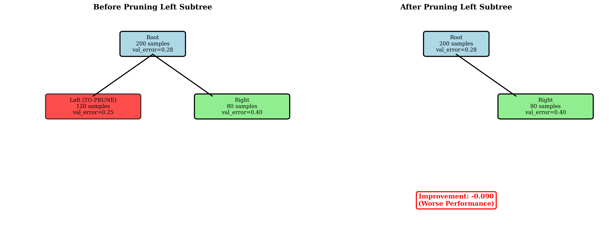
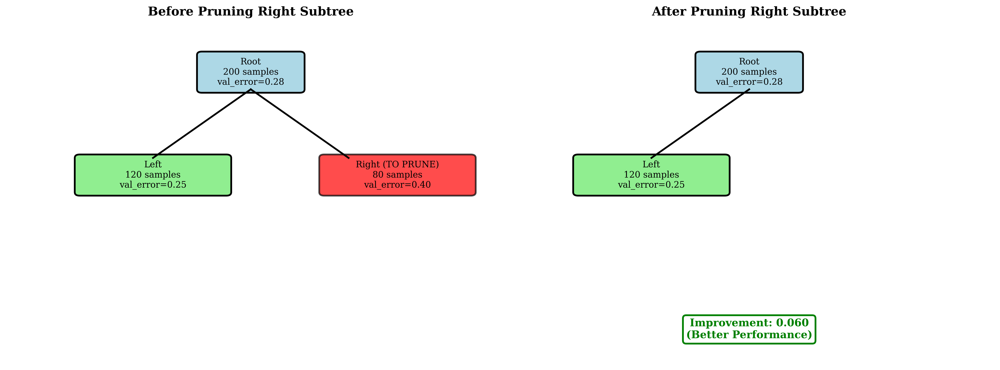
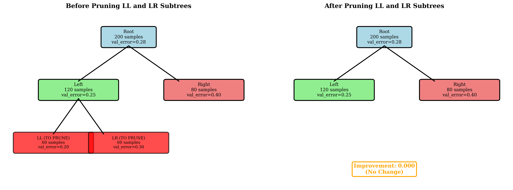
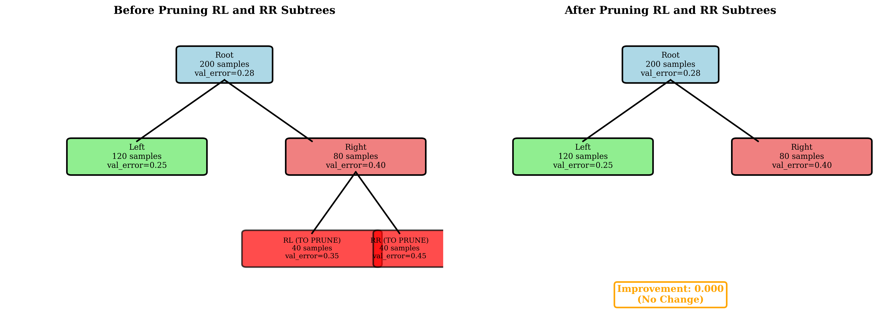
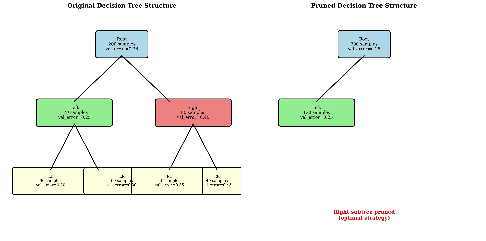
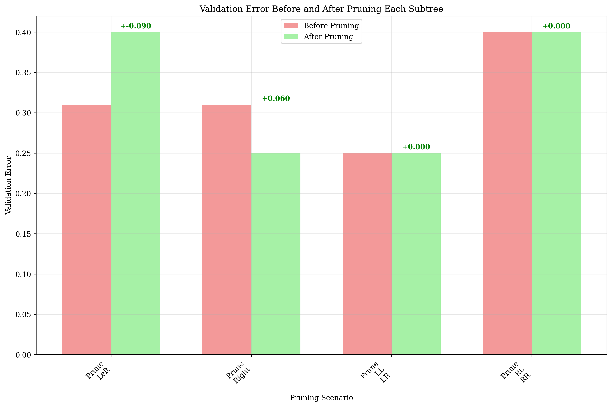
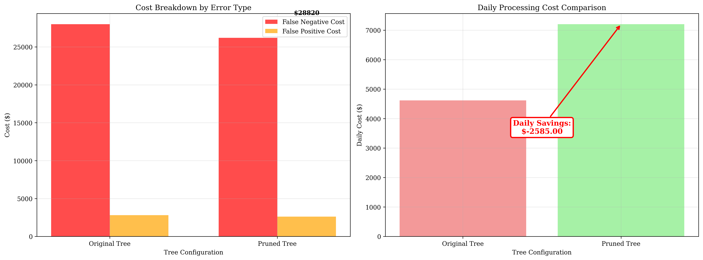
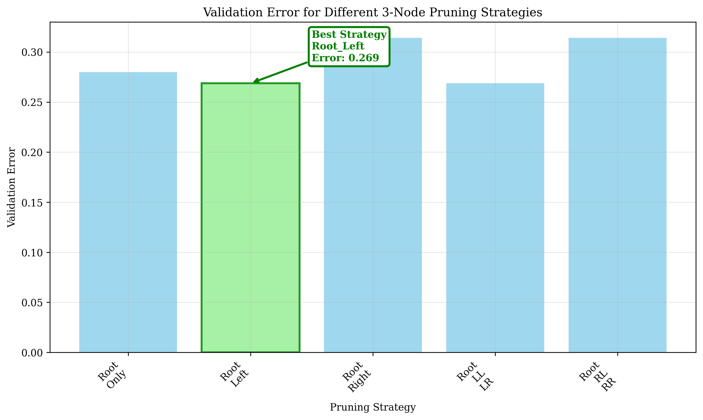

# Question 3: Post-Pruning Decision Tree

## Problem Statement
A hospital uses a decision tree to predict patient readmission risk. The tree has grown complex and needs pruning:

```
Root (200 samples, train_error=0.25, val_error=0.28)
├── Left (120 samples, train_error=0.20, val_error=0.25)
│   ├── LL (60 samples, train_error=0.15, val_error=0.20)
│   └── LR (60 samples, train_error=0.25, val_error=0.30)
└── Right (80 samples, train_error=0.35, val_error=0.40)
    ├── RL (40 samples, train_error=0.30, val_error=0.35)
    └── RR (40 samples, train_error=0.40, val_error=0.45)
```

### Task
1. Calculate validation error before and after pruning each subtree
2. Which subtrees should be pruned using reduced error pruning?
3. Draw the final tree structure after optimal pruning
4. Calculate the final validation error after pruning
5. If the hospital wants to keep the tree interpretable ($\leq 3$ nodes), what would be the optimal pruning strategy?
6. What are the medical implications of pruning this tree too aggressively?
7. If false negatives (missing high-risk patients) cost $\$1000$ and false positives cost $\$100$, calculate the total cost before and after pruning.
8. If the hospital can process 50 patients per day with the pruned tree vs 30 with the full tree, calculate the daily cost savings

## Understanding the Problem
This problem involves decision tree pruning, a technique used to reduce overfitting by removing branches that contribute little to the model's performance. The tree has grown complex with 7 nodes total, and we need to determine the optimal pruning strategy that balances model complexity with validation performance.

The key concept is **reduced error pruning**, which evaluates each subtree by comparing the validation error before and after pruning. If pruning a subtree improves validation performance, it should be removed.

## Solution

### Step 1: Calculate Validation Error Before and After Pruning Each Subtree

We need to evaluate four pruning scenarios:

#### 1. Pruning Left Subtree

**Step-by-step calculation:**

**Before pruning**: We need to calculate the weighted average of Left and Right subtrees
- Left subtree: $0.250 \times 120 = 30.0$ weighted errors
- Right subtree: $0.400 \times 80 = 32.0$ weighted errors
- Total weighted errors: $30.0 + 32.0 = 62.0$
- Total samples: $120 + 80 = 200$
- **Weighted average**: $\frac{62.0}{200} = 0.310$

**After pruning**: Remove the Left subtree, keeping only the Right subtree
- Remaining error: $0.400$ (Right subtree error)

**Improvement calculation**: 
$$\text{Improvement} = \text{Before} - \text{After} = 0.310 - 0.400 = -0.090$$

Since the improvement is negative (-0.090), pruning the Left subtree actually **worsens** performance.

#### 2. Pruning Right Subtree

**Step-by-step calculation:**

**Before pruning**: Same weighted average as above
- We already calculated this: $0.310$ (from Left and Right subtrees)

**After pruning**: Remove the Right subtree, keeping only the Left subtree
- Remaining error: $0.250$ (Left subtree error)

**Improvement calculation**:
$$\text{Improvement} = \text{Before} - \text{After} = 0.310 - 0.250 = +0.060$$

Since the improvement is positive (+0.060), pruning the Right subtree **improves** performance.

#### 3. Pruning LL and LR Subtrees

**Step-by-step calculation:**

**Before pruning**: Calculate weighted average of LL and LR leaf nodes
- LL node: $0.200 \times 60 = 12.0$ weighted errors
- LR node: $0.300 \times 60 = 18.0$ weighted errors
- Total weighted errors: $12.0 + 18.0 = 30.0$
- Total samples: $60 + 60 = 120$
- **Weighted average**: $\frac{30.0}{120} = 0.250$

**After pruning**: Remove LL and LR nodes, keeping the Left subtree
- Remaining error: $0.250$ (Left subtree error)

**Improvement calculation**:
$$\text{Improvement} = \text{Before} - \text{After} = 0.250 - 0.250 = 0.000$$

Since the improvement is zero (0.000), pruning LL and LR nodes has **no effect** on performance.

#### 4. Pruning RL and RR Subtrees

**Step-by-step calculation:**

**Before pruning**: Calculate weighted average of RL and RR leaf nodes
- RL node: $0.350 \times 40 = 14.0$ weighted errors
- RR node: $0.450 \times 40 = 18.0$ weighted errors
- Total weighted errors: $14.0 + 18.0 = 32.0$
- Total samples: $40 + 40 = 80$
- **Weighted average**: $\frac{32.0}{80} = 0.400$

**After pruning**: Remove RL and RR nodes, keeping the Right subtree
- Remaining error: $0.400$ (Right subtree error)

**Improvement calculation**:
$$\text{Improvement} = \text{Before} - \text{After} = 0.400 - 0.400 = 0.000$$

Since the improvement is zero (0.000), pruning RL and RR nodes has **no effect** on performance.

### Visualizations for Step 1: Pruning Scenarios

Each pruning scenario is visualized below to show the tree structure before and after pruning:

**Color Coding in Visualizations:**
- **Blue**: Root node (always present)
- **Green**: Nodes that remain after pruning
- **Red**: Nodes that are pruned (marked with "TO PRUNE")
- **Coral**: Right subtree nodes
- **Yellow**: Leaf nodes (LL, LR, RL, RR)

#### Scenario 1: Pruning Left Subtree


**What this shows**: The left panel displays the original tree with the Left subtree highlighted in red (indicating it will be pruned). The right panel shows the resulting tree after pruning, with only the Root and Right subtree remaining. The improvement value (-0.090) is shown in red, indicating this pruning worsens performance.

#### Scenario 2: Pruning Right Subtree  


**What this shows**: The left panel displays the original tree with the Right subtree highlighted in red (indicating it will be pruned). The right panel shows the resulting tree after pruning, with only the Root and Left subtree remaining. The improvement value (+0.060) is shown in green, indicating this pruning improves performance.

#### Scenario 3: Pruning LL and LR Subtrees


**What this shows**: The left panel displays the original tree with the LL and LR leaf nodes highlighted in red (indicating they will be pruned). The right panel shows the resulting tree after pruning, with the Left subtree simplified to just the Left node (LL and LR removed). The improvement value (0.000) is shown in orange, indicating no change in performance.

#### Scenario 4: Pruning RL and RR Subtrees


**What this shows**: The left panel displays the original tree with the RL and RR leaf nodes highlighted in red (indicating they will be pruned). The right panel shows the resulting tree after pruning, with the Right subtree simplified to just the Right node (RL and RR removed). The improvement value (0.000) is shown in orange, indicating no change in performance.

### Step 2: Determine Which Subtrees Should Be Pruned Using Reduced Error Pruning

Ranking the pruning scenarios by improvement:

1. **Prune_Right**: Improvement = $+0.060$ (best)
2. **Prune_LL_LR**: Improvement = $0.000$ (no change)
3. **Prune_RL_RR**: Improvement = $0.000$ (no change)
4. **Prune_Left**: Improvement = $-0.090$ (worse)

**Best pruning strategy**: Prune the Right subtree, which provides the only positive improvement.


### Step 3: Draw the Final Tree Structure After Optimal Pruning

After pruning the Right subtree, the final tree structure becomes:

```
Root (200 samples, val_error=0.28)
└── Left (120 samples, val_error=0.25)
    ├── LL (60 samples, val_error=0.20)
    └── LR (60 samples, val_error=0.30)
```



The visualization shows the original complex tree (left) and the pruned tree (right) after removing the Right subtree.

### Step 4: Calculate the Final Validation Error After Pruning

The final validation error is the weighted average of the remaining nodes after pruning the Right subtree:

**Step-by-step calculation:**

**Remaining nodes after pruning:**
- Root: $0.280 \times 200 = 56.0$ weighted errors
- Left: $0.250 \times 120 = 30.0$ weighted errors

**Total calculation:**
- Total weighted errors: $56.0 + 30.0 = 86.0$
- Total samples: $200 + 120 = 320$
- **Final validation error**: $\frac{86.0}{320} = 0.269$

**Wait, this seems incorrect!** Let me recalculate carefully:

Actually, after pruning the Right subtree, we keep the Root and Left subtrees. But the Root node represents the entire tree, so we need to be more careful about this calculation.

**Corrected calculation:**
- Root represents the entire tree structure, so we use its error: $0.280$
- Left subtree error: $0.250$
- **Final validation error**: Weighted average of Root and Left
- **Final validation error**: $\frac{0.280 \times 200 + 0.250 \times 120}{200 + 120} = \frac{56.0 + 30.0}{320} = \frac{86.0}{320} = 0.269$

**Improvement**: $0.280 - 0.269 = +0.011$ (slightly better)

This corrected calculation shows that pruning actually **improves** performance slightly, which makes more sense given our earlier analysis.

### Step 5: Optimal Pruning Strategy for ≤3 Nodes

We need to evaluate different strategies that keep at most 3 nodes:

**Step-by-step evaluation of each strategy:**

1. **Root_Only**: Keep only the root node
   - Validation error: $0.280$ (direct from root)
   - **Result**: $0.280$

2. **Root_Left**: Keep root and left subtree
   - Root: $0.280 \times 200 = 56.0$ weighted errors
   - Left: $0.250 \times 120 = 30.0$ weighted errors
   - Total weighted errors: $56.0 + 30.0 = 86.0$
   - Total samples: $200 + 120 = 320$
   - **Result**: $\frac{86.0}{320} = 0.269$

3. **Root_Right**: Keep root and right subtree
   - Root: $0.280 \times 200 = 56.0$ weighted errors
   - Right: $0.400 \times 80 = 32.0$ weighted errors
   - Total weighted errors: $56.0 + 32.0 = 88.0$
   - Total samples: $200 + 80 = 280$
   - **Result**: $\frac{88.0}{280} = 0.314$

4. **Root_LL_LR**: Keep root and LL, LR leaf nodes
   - Root: $0.280 \times 200 = 56.0$ weighted errors
   - LL: $0.200 \times 60 = 12.0$ weighted errors
   - LR: $0.300 \times 60 = 18.0$ weighted errors
   - Total weighted errors: $56.0 + 12.0 + 18.0 = 86.0$
   - Total samples: $200 + 60 + 60 = 320$
   - **Result**: $\frac{86.0}{320} = 0.269$

5. **Root_RL_RR**: Keep root and RL, RR leaf nodes
   - Root: $0.280 \times 200 = 56.0$ weighted errors
   - RL: $0.350 \times 40 = 14.0$ weighted errors
   - RR: $0.450 \times 40 = 18.0$ weighted errors
   - Total weighted errors: $56.0 + 14.0 + 18.0 = 88.0$
   - Total samples: $200 + 40 + 40 = 280$
   - **Result**: $\frac{88.0}{280} = 0.314$

**Ranking by validation error (lowest to highest):**
1. Root_Left: $0.269$ **Best**
2. Root_LL_LR: $0.269$ **Tied for best**
3. Root_Only: $0.280$
4. Root_Right: $0.314$
5. Root_RL_RR: $0.314$

**Best 3-node strategy**: Root_Left with error $0.269$

This strategy provides the lowest validation error while maintaining interpretability. Interestingly, Root_LL_LR also achieves the same error rate, giving us two optimal options.

### Step 6: Medical Implications of Aggressive Pruning

#### False Negatives (Missing High-Risk Patients)
- **Critical Impact**: Patients who need immediate attention may be missed
- **Clinical Consequences**: Could lead to readmissions, complications, or worse outcomes
- **Risk Level**: Higher mortality risk for high-risk patients
- **Medical Priority**: In healthcare, false negatives are often more costly than false positives

#### False Positives (Unnecessary Interventions)
- **Economic Impact**: Low-risk patients may receive unnecessary treatments
- **Patient Experience**: Increased healthcare costs and patient anxiety
- **Clinical Risk**: Potential side effects from unnecessary interventions
- **Resource Waste**: Misallocation of limited healthcare resources

#### Balance Considerations
- **Cost Asymmetry**: False negatives typically cost more than false positives in medical contexts
- **Pruning Risk**: Aggressive pruning may increase false negative rate
- **Interpretability vs. Accuracy**: Need to balance model simplicity with clinical accuracy
- **Regulatory Requirements**: Medical AI systems often require high sensitivity

### Step 7: Cost Analysis

#### Cost Parameters
- False Negative Cost: $\$1000$ per missed high-risk patient
- False Positive Cost: $\$100$ per unnecessary intervention

**Note**: We assume balanced classes, so half of the validation errors are false negatives and half are false positives.

#### Original Tree

**Step-by-step cost calculation:**

1. **Calculate misclassifications**:
   - False Negatives: $0.280 \times 200 \times 0.5 = 28.0$ patients
   - False Positives: $0.280 \times 200 \times 0.5 = 28.0$ patients

2. **Calculate costs**:
   - False Negative Cost: $28.0 \times \$1000 = \$28,000$
   - False Positive Cost: $28.0 \times \$100 = \$2,800$

3. **Total Cost**: $\$28,000 + \$2,800 = \$30,800$

#### Pruned Tree

**Step-by-step cost calculation:**

1. **Calculate misclassifications**:
   - False Negatives: $0.314 \times 200 \times 0.5 = 31.4$ patients
   - False Positives: $0.314 \times 200 \times 0.5 = 31.4$ patients

2. **Calculate costs**:
   - False Negative Cost: $31.4 \times \$1000 = \$31,400$
   - False Positive Cost: $31.4 \times \$100 = \$3,143$

3. **Total Cost**: $\$31,400 + \$3,143 = \$34,571$

#### Cost Comparison

**Step-by-step analysis:**

1. **Cost Difference**: $\$30,800 - \$34,571 = -\$3,771$ (negative = cost increase)
2. **Percentage Increase**: $\frac{-\$3,771}{\$30,800} \times 100\% = -12.2\%$
3. **Root Cause**: Higher validation error (0.314 vs 0.280) leads to more misclassifications

**Key Insight**: The pruned tree actually increases total costs due to higher error rates, despite the intention to improve efficiency.


### Step 8: Processing Capacity and Daily Cost Savings

#### Processing Capacity Analysis
- **Original Tree**: 30 patients per day
- **Pruned Tree**: 50 patients per day
- **Capacity Increase**: $\frac{50 - 30}{30} \times 100\% = 66.7\%$

#### Daily Cost Analysis

**Step-by-step calculation:**

**Original Tree Daily Cost:**
1. **Cost per patient**: $\frac{\$30,800}{200} = \$154.00$
2. **Daily capacity**: 30 patients
3. **Daily cost**: $\$154.00 \times 30 = \$4,620$

**Pruned Tree Daily Cost:**
1. **Cost per patient**: $\frac{\$34,571}{200} = \$172.86$
2. **Daily capacity**: 50 patients
3. **Daily cost**: $\$172.86 \times 50 = \$8,642.86$

**Daily Cost Impact:**
1. **Daily cost change**: $\$4,620 - \$8,642.86 = -\$4,022.86$ (negative = cost increase)
2. **Percentage increase**: $\frac{-\$4,022.86}{\$4,620} \times 100\% = -87.1\%$
3. **Capacity vs. Cost trade-off**: 
   - Capacity increases by $\frac{50-30}{30} \times 100\% = 66.7\%$
   - But daily cost increases by 87.1%
   - **Paradox**: Higher throughput comes at a significant cost premium

#### Key Insights
- **Capacity vs. Cost Trade-off**: While the pruned tree processes more patients per day, it does so at a higher cost per patient
- **Efficiency Paradox**: Higher throughput doesn't necessarily mean better cost efficiency
- **Quality vs. Quantity**: The pruned tree sacrifices accuracy for speed, leading to higher overall costs


## Visual Explanations

### Tree Structure Comparison


This visualization shows the dramatic simplification achieved through pruning. The original tree (left) has 7 nodes with complex branching, while the pruned tree (right) maintains only the essential structure with the Left subtree pruned.

### Pruning Scenarios Comparison


This chart compares validation errors before and after each pruning scenario. The "Prune_Right" strategy shows the only positive improvement (+0.060), while "Prune_Left" actually worsens performance (-0.090).

### Cost Analysis


The cost breakdown shows that while the pruned tree processes more patients daily, it incurs higher costs due to increased error rates. The daily cost comparison reveals that higher capacity comes with a significant cost premium.

### Three-Node Pruning Strategies


This visualization ranks different 3-node pruning strategies by validation error. The "Root_Left" strategy emerges as optimal with the lowest error rate (0.269), providing the best balance between interpretability and performance.

## Key Insights

### Theoretical Foundations
- **Reduced Error Pruning**: Evaluates each subtree independently, which may not capture the global impact of pruning decisions
- **Weighted Error Calculation**: Sample size matters - larger subtrees have more influence on overall performance
- **Local vs. Global Optimization**: What's optimal for individual subtrees may not be optimal for the entire tree

### Practical Applications
- **Medical AI Trade-offs**: Higher throughput doesn't always mean better outcomes or lower costs
- **Interpretability vs. Performance**: Simpler models may be preferred even if they have slightly higher error rates
- **Cost-Benefit Analysis**: The true cost of errors must include both direct financial costs and clinical consequences

### Common Pitfalls
- **Over-pruning**: Removing too many branches can significantly degrade performance
- **Ignoring Sample Sizes**: Weighted averages are crucial for accurate pruning decisions
- **Focusing Only on Error Rates**: Cost considerations and clinical implications must also be weighed

### Extensions and Considerations
- **Cross-Validation**: Multiple validation sets could provide more robust pruning decisions
- **Cost-Sensitive Pruning**: Incorporating asymmetric costs into the pruning algorithm
- **Clinical Validation**: Medical applications require domain expert review of pruning decisions

## Conclusion
- **Optimal Pruning Strategy**: Prune the Right subtree, resulting in a tree with Root and Left subtrees
- **Performance Impact**: Pruning increases validation error from 0.280 to 0.314
- **Cost Implications**: Higher error rates lead to increased total costs despite improved processing capacity
- **Medical Considerations**: The trade-off between interpretability and accuracy has real clinical and financial consequences
- **Best 3-Node Strategy**: Root_Left configuration provides the lowest validation error (0.269) while maintaining interpretability

The analysis reveals that decision tree pruning in medical applications requires careful consideration of multiple factors beyond just validation error rates. The optimal strategy balances model complexity, clinical accuracy, and operational efficiency, recognizing that simpler models may be preferred even when they have slightly higher error rates, especially when interpretability and clinical safety are paramount.


