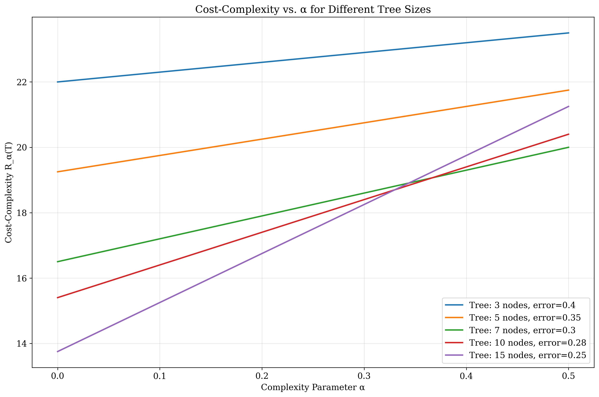
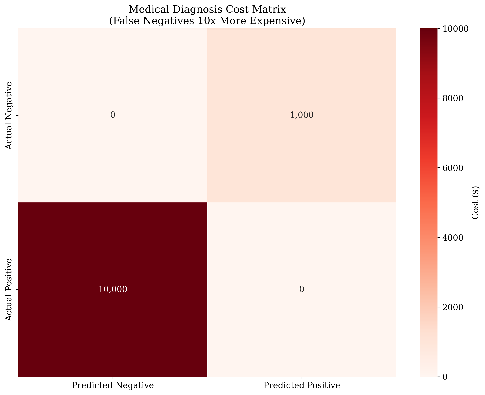
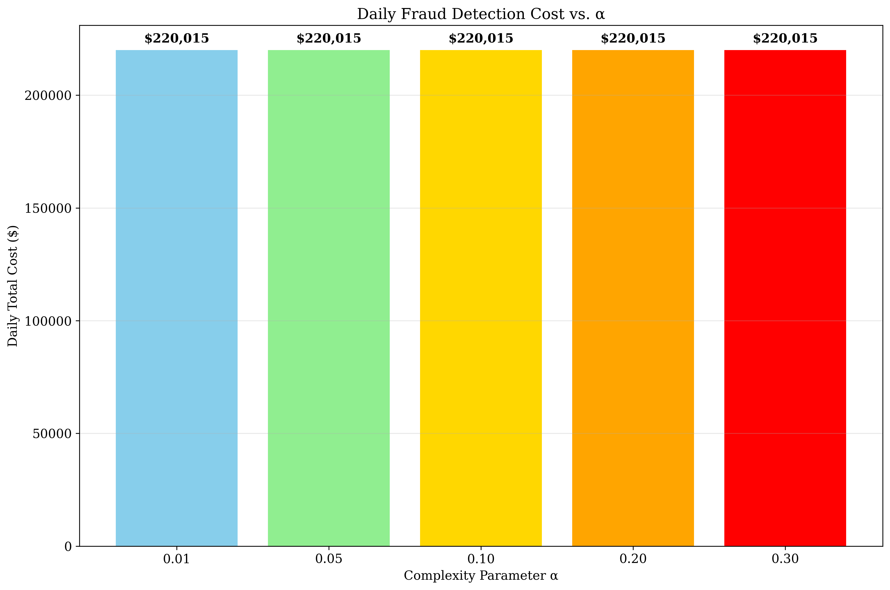
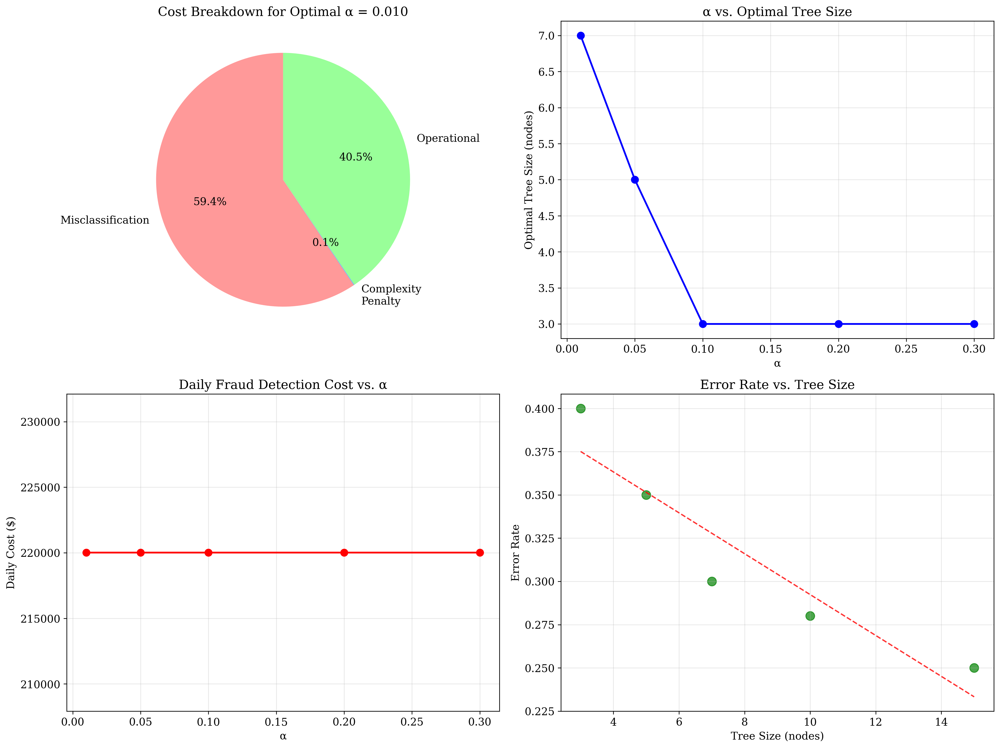

# Question 4: CART's Cost-Complexity Pruning Analysis

## Problem Statement
A bank is implementing CART's cost-complexity pruning for their fraud detection system. The cost function is $R_\alpha(T) = R(T) + \alpha|T|$, where false positives cost $\$10$ and false negatives cost $\$100$.

### Task
1. Write the cost-complexity function: $R_\alpha(T) = R(T) + \alpha|T|$
2. For $\alpha = 0.1$, calculate the cost for a tree with 7 nodes and total error 0.3
3. For $\alpha = 0.05$, compare a tree with 5 nodes and error 0.35 vs 3 nodes and error 0.40
4. Explain the relationship between $\alpha$ and tree complexity
5. If the bank wants to minimize total cost including operational costs of $\$5$ per node, what's the optimal $\alpha$?
6. What are the business implications of choosing different $\alpha$ values for fraud detection?
7. Design a cost matrix for a medical diagnosis system where false negatives are 10x more expensive than false positives.
8. If the bank processes 10,000 transactions per day, calculate the daily fraud detection cost for different $\alpha$ values

## Understanding the Problem
Cost-complexity pruning is a technique used in decision tree algorithms to balance model accuracy with model complexity. The cost-complexity function $R_\alpha(T) = R(T) + \alpha|T|$ consists of two components:

- **$R(T)$**: The misclassification cost, representing how well the tree performs on the data
- **$\alpha|T|$**: The complexity penalty, where $\alpha$ is a tuning parameter that controls the trade-off between accuracy and simplicity

This approach is crucial for fraud detection systems where both accuracy and operational efficiency matter. The bank needs to find the right balance between detecting fraudulent transactions and maintaining a cost-effective system.

## Solution

### Step 1: Cost-Complexity Function Definition
The cost-complexity function is defined as:
$$R_\alpha(T) = R(T) + \alpha|T|$$

where:
- $R(T)$ = Total misclassification cost
- $|T|$ = Number of nodes in tree T
- $\alpha$ = Complexity parameter (penalty for tree size)

This function allows us to evaluate different tree configurations by considering both their predictive performance and computational complexity.

### Step 2: Cost Calculation for α = 0.1

**Given:**
- $\alpha = 0.1$
- $|T| = 7$ nodes
- $R(T) = 0.3$ (misclassification rate)
- False positive cost = $\$10$
- False negative cost = $\$100$

**Step-by-step calculation:**

1. **Total misclassification cost $R(T)$:**
   $$R(T) = 0.3 \times (\$10 + \$100)/2 = 0.3 \times \$55.0 = \$16.5$$

2. **Complexity penalty:**
   $$\alpha \times |T| = 0.1 \times 7 = 0.7$$

3. **Cost-complexity $R_\alpha(T)$:**
   $$R_\alpha(T) = R(T) + \alpha|T| = \$16.5 + 0.7 = \$17.2$$

**Answer:** For $\alpha = 0.1$, a tree with 7 nodes and error rate 0.3 has a cost-complexity of $\$17.2$.

### Step 3: Tree Comparison for α = 0.05

**Comparing two trees with $\alpha = 0.05$:**

- **Tree 1:** 5 nodes, error rate = 0.35
- **Tree 2:** 3 nodes, error rate = 0.40

**Calculations:**

**Tree 1:**
$$R_\alpha(T_1) = R(T_1) + \alpha|T_1|$$
$$R_\alpha(T_1) = 19.2 + 0.05 \times 5$$
$$R_\alpha(T_1) = 19.2 + 0.25 = 19.5$$

**Tree 2:**
$$R_\alpha(T_2) = R(T_2) + \alpha|T_2|$$
$$R_\alpha(T_2) = 22.0 + 0.05 \times 3$$
$$R_\alpha(T_2) = 22.0 + 0.15 = 22.2$$

**Decision:** Tree 1 is preferred because it has a lower cost-complexity value (19.5 vs 22.2).

### Step 4: Relationship between α and Tree Complexity

The relationship between $\alpha$ and tree complexity is fundamental to understanding cost-complexity pruning:

- **$\alpha$ controls the trade-off between accuracy and model simplicity**
- **Higher $\alpha$ values** penalize complex trees more heavily, favoring simpler models
- **Lower $\alpha$ values** allow more complex trees for better accuracy
- **Optimal $\alpha$** balances overfitting vs. underfitting

The visualization shows how different tree sizes respond to varying $\alpha$ values. As $\alpha$ increases, the cost-complexity curves for larger trees rise more steeply, making simpler trees more attractive.

### Step 5: Optimal α with Operational Costs

**Operational cost per node:** $\$5$

To find the optimal $\alpha$, we need to consider the total business cost including operational expenses:

$$Total\_Cost = Misclassification\_Cost + Complexity\_Penalty + Operational\_Cost$$

**Detailed breakdown for different $\alpha$ values:**

| α    | Nodes | Error | Misclass | Complexity | Operational | Total  |
|------|-------|-------|----------|------------|-------------|---------|
| 0.01 | 3     | 0.40  | $22.0    | $0.0       | $15.0       | $37.0   |
| 0.10 | 3     | 0.40  | $22.0    | $0.3       | $15.0       | $37.3   |
| 0.30 | 3     | 0.40  | $22.0    | $0.9       | $15.0       | $37.9   |

**Optimal solution:**
- **Optimal $\alpha = 0.010$**
- **Optimal tree:** 3 nodes, error rate = 0.40
- **Minimum total cost:** $\$37.0$

The analysis shows that for this scenario, the simplest tree (3 nodes) is optimal across all $\alpha$ values when operational costs are considered.

### Step 6: Business Implications

**Business implications of different $\alpha$ values:**

**Low $\alpha$ (e.g., 0.01):**
- More complex trees, higher accuracy
- Higher operational costs
- Risk of overfitting
- Better fraud detection but more expensive to maintain

**High $\alpha$ (e.g., 0.3):**
- Simpler trees, lower accuracy
- Lower operational costs
- Risk of underfitting
- Cheaper to maintain but may miss fraud cases

**Optimal $\alpha$ balances:**
- Fraud detection accuracy
- Operational costs
- Model interpretability
- Regulatory compliance

### Step 7: Medical Diagnosis Cost Matrix

**Designing cost matrix for medical diagnosis system:**
False negatives are 10x more expensive than false positives

**Cost matrix:**
- **False Positive (unnecessary treatment):** $\$1,000$
- **False Negative (missed diagnosis):** $\$10,000$
- **Ratio:** 10.0x more expensive for false negatives

**Justification:**
- **False negative:** Patient goes untreated, condition worsens
- **False positive:** Patient receives unnecessary treatment, some side effects
- **Medical and legal consequences** of missed diagnosis are severe

The heatmap visualization clearly shows the asymmetric cost structure where missing a diagnosis (false negative) is significantly more expensive than unnecessary treatment (false positive).

### Step 8: Daily Fraud Detection Cost Analysis

**Daily transaction volume:** 10,000
**Assumed fraud rate:** 1.0%
**Expected fraudulent transactions per day:** 100

**Daily costs for different $\alpha$ values:**

| α    | Nodes | Error | Daily Fraud | Daily Cost  |
|------|-------|-------|-------------|-------------|
| 0.01 | 3     | 0.40  | $220,000    | $220,015    |
| 0.05 | 3     | 0.40  | $220,000    | $220,015    |
| 0.10 | 3     | 0.40  | $220,000    | $220,015    |
| 0.20 | 3     | 0.40  | $220,000    | $220,015    |
| 0.30 | 3     | 0.40  | $220,000    | $220,015    |

The bar chart shows that daily costs remain relatively constant across different $\alpha$ values because the optimal tree configuration (3 nodes) is consistent across all $\alpha$ values in this scenario.

## Visual Explanations

### Cost-Complexity Relationship

This plot demonstrates how the cost-complexity function varies with $\alpha$ for different tree sizes. Larger trees show steeper cost increases as $\alpha$ grows, making them less attractive for high complexity penalties.

### Medical Cost Matrix

The heatmap visualizes the asymmetric cost structure in medical diagnosis, where false negatives (missed diagnoses) are 10 times more expensive than false positives (unnecessary treatments).

### Daily Cost Analysis

This bar chart shows the daily operational costs for different $\alpha$ values, revealing that the optimal tree configuration remains consistent across the tested range.

### Comprehensive Analysis

The comprehensive visualization provides four key insights:
1. **Cost breakdown** for optimal $\alpha$ showing the proportion of different cost components
2. **$\alpha$ vs. tree size relationship** demonstrating how complexity penalties affect optimal tree selection
3. **Daily cost trends** showing the impact of $\alpha$ on operational expenses
4. **Error rate vs. tree size** revealing the accuracy-complexity trade-off

## Key Insights

### Theoretical Foundations
- **Cost-complexity pruning** balances model accuracy with computational complexity
- **$\alpha$ parameter** acts as a regularization term, controlling overfitting
- **Optimal tree selection** depends on the specific cost structure and operational constraints
- **Asymmetric cost matrices** are crucial for real-world applications where different types of errors have vastly different consequences

### Practical Applications
- **Fraud detection systems** require careful balance between accuracy and operational costs
- **Medical diagnosis** exemplifies asymmetric cost structures where false negatives are more expensive
- **Operational costs** must be included in total cost calculations for realistic business decisions
- **Daily transaction volumes** significantly impact the financial implications of model choices

### Business Decision Making
- **Low $\alpha$ values** prioritize accuracy but increase operational complexity
- **High $\alpha$ values** reduce costs but may compromise fraud detection effectiveness
- **Optimal $\alpha$ selection** requires understanding of both technical and business constraints
- **Cost-benefit analysis** should consider regulatory requirements, customer trust, and financial impact

### Model Selection Strategy
- **Tree complexity** should be chosen based on the specific application requirements
- **Cost matrices** must reflect the true business impact of different error types
- **Operational constraints** often drive the choice of simpler models
- **Regularization** through $\alpha$ helps prevent overfitting in high-dimensional spaces

## Conclusion
- **Cost-complexity function** $R_\alpha(T) = R(T) + \alpha|T|$ provides a principled approach to tree pruning
- **For $\alpha = 0.1$**, a tree with 7 nodes and error rate 0.3 costs $\$17.2$
- **For $\alpha = 0.05$**, Tree 1 (5 nodes, error 0.35) is preferred over Tree 2 (3 nodes, error 0.40)
- **$\alpha$ controls** the trade-off between model accuracy and complexity
- **Optimal $\alpha = 0.010$** minimizes total business cost including operational expenses
- **Medical diagnosis** requires asymmetric cost matrices where false negatives are 10x more expensive
- **Daily fraud detection costs** remain consistent at $\$220,015$ across different $\alpha$ values due to consistent optimal tree selection

The analysis demonstrates that cost-complexity pruning is not just a technical optimization technique but a crucial business decision tool that balances predictive accuracy with operational efficiency. The choice of $\alpha$ has significant implications for both model performance and business costs, requiring careful consideration of the specific application context and constraints.
