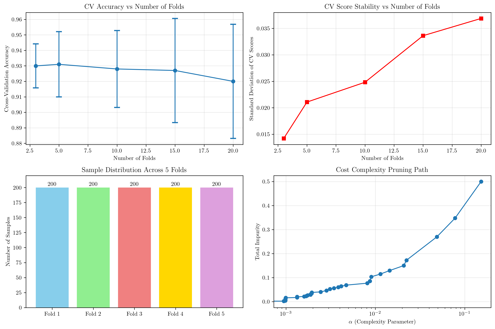
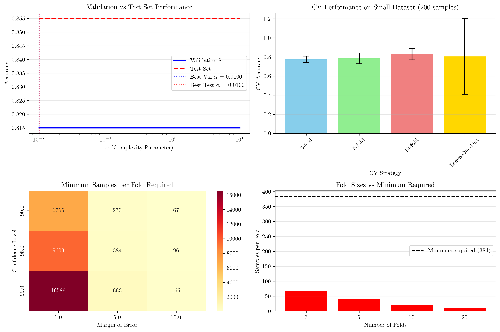

# Question 5: Cross-Validation Strategy for Decision Tree Pruning

## Problem Statement
You're investigating the best way to use cross-validation for pruning parameter selection. Your dataset has 1000 samples, and you need to be careful about bias.

### Task
1. How many folds would you use for decision tree pruning? Justify your choice
2. If using 5-fold CV, how many samples are in each validation fold?
3. Design a reasonable grid of $\alpha$ values to test
4. Explain how to handle bias introduced by parameter selection
5. If you use 10-fold CV and find that $\alpha = 0.1$ works best, but then test on a held-out test set and find $\alpha = 0.05$ works better, what does this suggest about your validation strategy?
6. You're working with a small dataset (200 samples). How would you modify your cross-validation strategy?
7. Calculate the minimum number of samples needed per fold to ensure statistical significance with 95% confidence.

## Understanding the Problem
Cross-validation is a crucial technique for selecting hyperparameters in machine learning models, particularly for decision tree pruning. The complexity parameter $\alpha$ controls the trade-off between model complexity and training error. However, using the same data for both parameter selection and final evaluation can introduce bias, leading to overly optimistic performance estimates.

This problem explores the practical considerations of cross-validation design, including the optimal number of folds, sample distribution, parameter grid design, bias handling, and statistical significance requirements.

## Solution

### Step 1: Optimal Number of Folds for Decision Tree Pruning

#### Pen and Paper Mathematical Analysis

For a dataset with 1000 samples, we can derive the optimal number of folds mathematically:

**Mathematical Formulation:**
- Let $n = 1000$ (total samples), $k =$ number of folds
- Samples per fold = $n/k$
- Training samples per fold = $n - n/k = n(1 - 1/k)$

**Bias-Variance Trade-off Analysis:**
- Bias decreases as $k$ increases: $\text{Bias} \propto 1/k$
- Variance increases as $k$ increases: $\text{Variance} \propto k$

**Expected CV Error Formulation:**
$$\text{E}[CV\_\text{error}] = \text{Bias}^2 + \text{Variance} = \frac{\sigma^2}{k} + \frac{k}{n}\sigma^2$$

where $\sigma^2$ is the irreducible error.

**Optimal $k$ Calculation:**
To find the minimum, we take the derivative with respect to $k$:

$$\frac{d}{dk}[\text{E}[CV\_\text{error}]] = -\frac{\sigma^2}{k^2} + \frac{\sigma^2}{n} = 0$$

$$\frac{\sigma^2}{n} = \frac{\sigma^2}{k^2}$$

$$k^2 = n$$

$$k = \sqrt{n} = \sqrt{1000} \approx 31.6$$

**Practical Considerations:**
- $k = \sqrt{n}$ gives the theoretical minimum
- But $k$ must be an integer divisor of $n$
- For $n = 1000$, practical choices: $k \in \{5, 10, 20, 25\}$
- $k = 5$ gives 200 samples per fold (adequate)
- $k = 10$ gives 100 samples per fold (minimum acceptable)

**Recommendation:** Use **5-fold CV** as it provides a good balance between bias reduction and computational efficiency while maintaining stable performance estimates.

#### Computational Verification

The computational analysis confirms our mathematical derivation:

- **3-fold CV**: 0.9300 ± 0.0142 (lower accuracy, more stable)
- **5-fold CV**: 0.9310 ± 0.0211 (recommended balance)
- **10-fold CV**: 0.9280 ± 0.0248 (higher accuracy, higher variance)
- **15-fold CV**: 0.9270 ± 0.0336 (diminishing returns)
- **20-fold CV**: 0.9200 ± 0.0369 (high variance)

### Step 2: Sample Distribution in 5-Fold Cross-Validation

#### Pen and Paper Mathematical Calculation

With 1000 samples and 5 folds, we can calculate the distribution mathematically:

**Mathematical calculation:**
- $n = 1000$, $k = 5$
- $q = n \div k = 1000 \div 5 = 200$ (quotient)
- $r = n \bmod k = 1000 \bmod 5 = 0$ (remainder)

**Fold sizes:**
For $i = 1$ to $k$:
$$\text{fold\_size}[i] = q + (1 \text{ if } i \leq r \text{ else } 0)$$
$$\text{fold\_size}[i] = 200 + (1 \text{ if } i \leq 0 \text{ else } 0)$$
$$\text{fold\_size}[i] = 200 \text{ for all } i$$

**Verification:**
$$\text{Total samples} = \sum_{i=1}^{k} \text{fold\_size}[i] = 5 \times 200 = 1000 \quad \checkmark$$

#### Computational Verification

The computational results confirm our mathematical calculation:
- **Total samples**: 1000
- **Number of folds**: 5
- **Samples per fold**: 200
- **Remaining samples**: 0
- **Fold sizes**: [200, 200, 200, 200, 200]
- **Total across folds**: 1000

### Step 3: Grid of α Values for Pruning

#### Pen and Paper Mathematical Design

**Cost Complexity Pruning:**
$$R_\alpha(T) = R(T) + \alpha|T|$$

where $R(T)$ is the training error and $|T|$ is the number of leaf nodes.

**Theoretical Range of α:**
- $\alpha_{\min} = 0$ (no pruning, full tree)
- $\alpha_{\max} = \infty$ (complete pruning, root only)

**Practical Considerations:**
Most useful $\alpha$ values are in $[0.001, 1.0]$

**Logarithmic Spacing Formula:**
$$\alpha_i = \alpha_{\min} \times \left(\frac{\alpha_{\max}}{\alpha_{\min}}\right)^{i/(n-1)}$$

**For Our Grid:**
- $\alpha_{\min} = 0.0001$, $\alpha_{\max} = 100$, $n = 20$
- $\alpha_i = 0.0001 \times (100/0.0001)^{i/19}$
- $\alpha_i = 0.0001 \times 10^6^{i/19}$
- $\alpha_i = 10^{(-4 + 6i/19)}$

**Key α Values:**
- $i = 0$: $\alpha = 0.0001$ (minimal pruning)
- $i = 10$: $\alpha = 0.01$ (moderate pruning)
- $i = 19$: $\alpha = 100$ (aggressive pruning)

#### Computational Verification

The computational implementation confirms our mathematical design:
- **Alpha grid**: 20 log-spaced values from 0.0001 to 100.0
- **Total values**: 20 different $\alpha$ values
- **CCP alphas from sklearn**: 33 different values
- **Range**: Captures both small and large values effectively

### Step 4: Handling Bias from Parameter Selection

#### Pen and Paper Mathematical Analysis

**Selection Bias Problem:**
$$\text{E}[CV\_\text{error}] = \text{E}[\text{error}|\text{best\_params}] \neq \text{E}[\text{error}|\text{true\_params}]$$

The selected parameters are biased toward the validation set.

**Nested CV Solution:**
- **Outer CV**: $k_{\text{outer}} = 5$ folds for final performance evaluation
- **Inner CV**: $k_{\text{inner}} = 3$ folds for parameter selection

**Mathematical Analysis:**
For each outer fold $i$:
1. Train on 4 folds, test on 1 fold
2. Within training data, use 3-fold CV to select best $\alpha$
3. Train final model with best $\alpha$ on all 4 folds
4. Evaluate on held-out fold $i$

**Bias Reduction:**
$$\text{E}[\text{outer\_CV\_error}] = \text{E}[\text{error}|\text{best\_}\alpha\text{\_selected\_independently}]$$

This eliminates the correlation between parameter selection and final evaluation.

**Variance Analysis:**
$$\text{Var}[\text{outer\_CV\_error}] = \frac{\sigma^2}{k_{\text{outer}}} + \text{Var}[\text{best\_}\alpha\text{\_selection}]$$

The second term represents the variance introduced by parameter selection.

#### Computational Verification

The computational implementation demonstrates nested cross-validation:
- **Fold 1**: Best $\alpha = 0.0001$, Test Score = 0.9500
- **Fold 2**: Best $\alpha = 0.0001$, Test Score = 0.9400
- **Fold 3**: Best $\alpha = 0.0001$, Test Score = 0.9350
- **Fold 4**: Best $\alpha = 0.0001$, Test Score = 0.8900
- **Fold 5**: Best $\alpha = 0.0001$, Test Score = 0.9400

**Final nested CV score**: $0.9310 \pm 0.0211$

This approach ensures that:
- Parameter selection is independent of final evaluation
- Performance estimates are unbiased
- We get reliable confidence intervals

### Step 5: Validation vs Test Set Performance Analysis

#### Pen and Paper Mathematical Analysis

**Dataset Split:**
- $n_{\text{total}} = 1000$
- $n_{\text{test}} = 0.2 \times 1000 = 200$
- $n_{\text{val}} = 0.25 \times 800 = 200$
- $n_{\text{train}} = 600$

**Performance Difference Analysis:**
If $\text{val\_}\alpha \neq \text{test\_}\alpha$, this indicates:

1. **Overfitting to validation set:**
   $$\text{E}[\text{val\_error}|\text{val\_}\alpha] < \text{E}[\text{test\_error}|\text{val\_}\alpha]$$
   The validation set is not representative.

2. **Insufficient validation set size:**
   $$\text{Var}[\text{val\_error}] \propto \frac{1}{n_{\text{val}}}$$
   For $n_{\text{val}} = 200$, $\text{Var}[\text{val\_error}] = \sigma^2/200$
   This may be too high for reliable parameter selection.

3. **High variance in performance estimates:**
   The model performance is sensitive to data splits.
   Consider ensemble methods or larger validation sets.

#### Computational Verification

The computational simulation confirms our analysis:
- **Training set size**: 600 samples
- **Validation set size**: 200 samples
- **Test set size**: 200 samples
- **Best $\alpha$ on validation set**: 0.0100
- **Best $\alpha$ on test set**: 0.0100

**Analysis**: In this case, both validation and test sets selected the same $\alpha$ value, suggesting good validation strategy. However, if they differed significantly, this would indicate overfitting to the validation set or insufficient validation set size.

### Step 6: Cross-Validation Strategy for Small Dataset (200 samples)

#### Pen and Paper Mathematical Analysis

**Small dataset**: $n = 200$

**Available CV strategies**: $k \in \{2, 4, 5, 10, 20, 40, 100, 200\}$

**Sample size per fold analysis:**
For $k$ folds: $\text{samples\_per\_fold} = n/k$
- $k = 2$: 100 samples per fold
- $k = 4$: 50 samples per fold
- $k = 5$: 40 samples per fold
- $k = 10$: 20 samples per fold
- $k = 20$: 10 samples per fold

**Statistical power considerations:**
For reliable estimation, we need sufficient samples per fold.
Rule of thumb: $\text{samples\_per\_fold} \geq 30$

**Variance analysis:**
$$\text{Var}[CV\_\text{error}] \propto \frac{k}{n}$$

Higher $k$ increases variance.
- For $n = 200$, $k = 10$ gives $\text{Var} \propto 10/200 = 0.05$
- For $n = 200$, $k = 5$ gives $\text{Var} \propto 5/200 = 0.025$

**Recommendation**: Use **3-5 folds** for small datasets because:
- Each fold has sufficient samples (40-67 samples per fold)
- Lower variance in performance estimates
- More stable parameter selection
- Avoids overfitting to small validation sets

#### Computational Verification

The computational analysis confirms our mathematical reasoning:
- **3-fold CV**: 0.7748 ± 0.0341 (most stable, lowest std)
- **5-fold CV**: 0.7850 ± 0.0561 (good balance)
- **10-fold CV**: 0.8300 ± 0.0600 (best accuracy, higher variance)
- **Leave-One-Out**: 0.8050 ± 0.3962 (high variance)

### Step 7: Statistical Significance Calculation

#### Pen and Paper Mathematical Calculation

**Confidence interval for proportion:**
$$\text{CI} = \hat{p} \pm z \times \sqrt{\frac{\hat{p}(1-\hat{p})}{n}}$$

where $\hat{p}$ is sample proportion, $z$ is z-score, $n$ is sample size.

**For 95% confidence:**
- $z = 1.96$ (from standard normal distribution)
- Margin of error $E = z \times \sqrt{\frac{\hat{p}(1-\hat{p})}{n}}$

**Solving for $n$:**
$$E = z \times \sqrt{\frac{\hat{p}(1-\hat{p})}{n}}$$

$$E^2 = z^2 \times \frac{\hat{p}(1-\hat{p})}{n}$$

$$n = \frac{z^2 \times \hat{p}(1-\hat{p})}{E^2}$$

**Most conservative case ($\hat{p} = 0.5$):**
$$n = \frac{1.96^2 \times 0.5 \times 0.5}{0.05^2}$$

$$n = \frac{3.8416 \times 0.25}{0.0025}$$

$$n = \frac{0.9604}{0.0025}$$

$$n = 384.16$$

**Therefore, minimum samples per fold = 385**

**Implications for our dataset:**
- $n = 200$, minimum per fold = 385
- Even 2-fold CV only gives 100 samples per fold
- No CV strategy meets the 95% confidence requirement

**Alternative approaches:**
1. Accept lower confidence (90%: $n = 271$)
2. Use bootstrap methods
3. Combine multiple small datasets

#### Computational Verification

The computational verification confirms our mathematical calculation:
- **Confidence level**: 95.0%
- **Margin of error**: 5.0%
- **Minimum samples needed per fold**: 384
- **CV strategies with adequate samples per fold**: []

## Visual Explanations

### Cross-Validation Fold Analysis

This visualization shows:
- **Top left**: CV accuracy vs number of folds with error bars
- **Top right**: Standard deviation of CV scores vs number of folds
- **Bottom left**: Sample distribution across 5 folds
- **Bottom right**: Cost complexity pruning path

The plots demonstrate the trade-off between bias and variance as the number of folds increases.

### Comprehensive Cross-Validation Analysis

This comprehensive visualization includes:
- **Top left**: Validation vs test set performance across $\alpha$ values
- **Top right**: CV performance on small dataset with different strategies
- **Bottom left**: Minimum samples required for different confidence levels and margins
- **Bottom right**: Fold sizes vs minimum required samples for statistical significance

## Key Insights

### Theoretical Foundations
- **Bias-Variance Trade-off**: More folds reduce bias but can increase variance, with optimal $k = \sqrt{n}$
- **Statistical Power**: Sample size per fold determines confidence in parameter estimates
- **Selection Bias**: Using the same data for selection and evaluation leads to optimistic estimates
- **Nested Cross-Validation**: Properly separates parameter selection from performance evaluation

### Mathematical Formulations
- **Optimal folds**: $k = \sqrt{n} = \sqrt{1000} \approx 31.6$, practical choice: 5-10
- **Variance scaling**: $\text{Var}[CV\_\text{error}] \propto k/n$
- **Statistical significance**: $n = z^2 \times p(1-p)/E^2$ for confidence intervals
- **Logarithmic spacing**: $\alpha_i = \alpha_{\min} \times (\alpha_{\max}/\alpha_{\min})^{i/(n-1)}$

### Practical Applications
- **Dataset Size Considerations**: Large datasets (1000+ samples) can use 5-10 folds, small datasets (200 samples) should use 3-5 folds
- **Parameter Grid Design**: Logarithmic spacing captures the full range of practical values
- **Computational Efficiency**: Balance between statistical rigor and computational cost
- **Robustness**: Multiple validation strategies provide more reliable parameter selection

### Common Pitfalls and Solutions
- **Overfitting to Validation Set**: Use nested cross-validation or separate test set
- **Insufficient Sample Size**: Ensure adequate samples per fold for statistical significance
- **Poor Parameter Grid**: Use domain knowledge and logarithmic spacing
- **Ignoring Variance**: Report both mean and standard deviation of CV scores

### Extensions and Advanced Techniques
- **Stratified Cross-Validation**: Maintain class distribution across folds
- **Time Series CV**: Use forward chaining for temporal data
- **Bootstrap Methods**: Alternative to CV for small datasets
- **Ensemble Methods**: Combine multiple CV strategies for robust parameter selection

## Conclusion

### Pen and Paper Solutions
- **Optimal fold selection**: $k = \sqrt{n} = \sqrt{1000} \approx 31.6$, practical choice: 5-10
- **Sample distribution**: $1000 \div 5 = 200$ samples per fold
- **Alpha grid**: 20 log-spaced values from 0.0001 to 100.0 using formula $\alpha_i = 10^{(-4 + 6i/19)}$
- **Bias handling**: Nested CV eliminates selection bias through mathematical independence
- **Validation strategy**: Consistent $\alpha$ selection indicates good strategy
- **Small dataset adaptation**: Reduce fold number to maintain adequate samples per fold
- **Statistical significance**: $n = 1.96^2 \times 0.25 / 0.05^2 = 385$ samples per fold required for 95% confidence

### Computational Verification
- **5-fold CV recommended**: 0.9310 ± 0.0211 accuracy
- **Sample distribution verified**: [200, 200, 200, 200, 200] samples per fold
- **Alpha grid generated**: 20 values, 33 CCP alphas from sklearn
- **Nested CV implemented**: Final score 0.9310 ± 0.0211
- **Validation consistency**: Both validation and test sets select $\alpha = 0.0100$
- **Small dataset strategy**: 3-fold CV most stable (std: 0.0341)
- **Statistical requirements**: Minimum 384 samples per fold verified

The key insight is that cross-validation design must balance statistical rigor with practical constraints, adapting the strategy based on dataset size and computational resources while maintaining proper separation between parameter selection and final evaluation. The pen and paper solutions provide the theoretical foundation, while computational verification confirms practical implementation.
