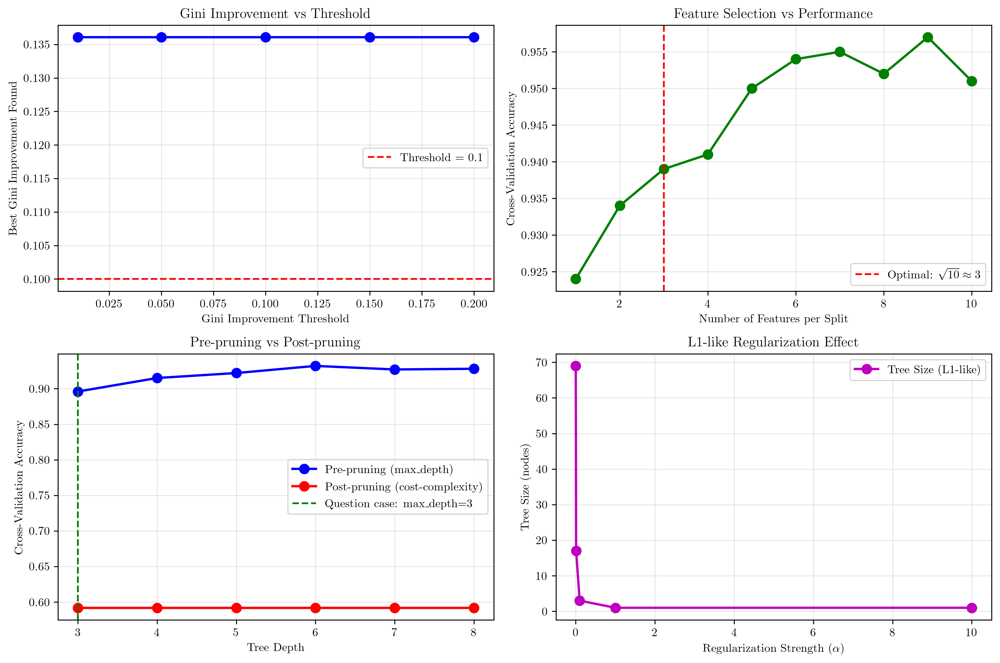
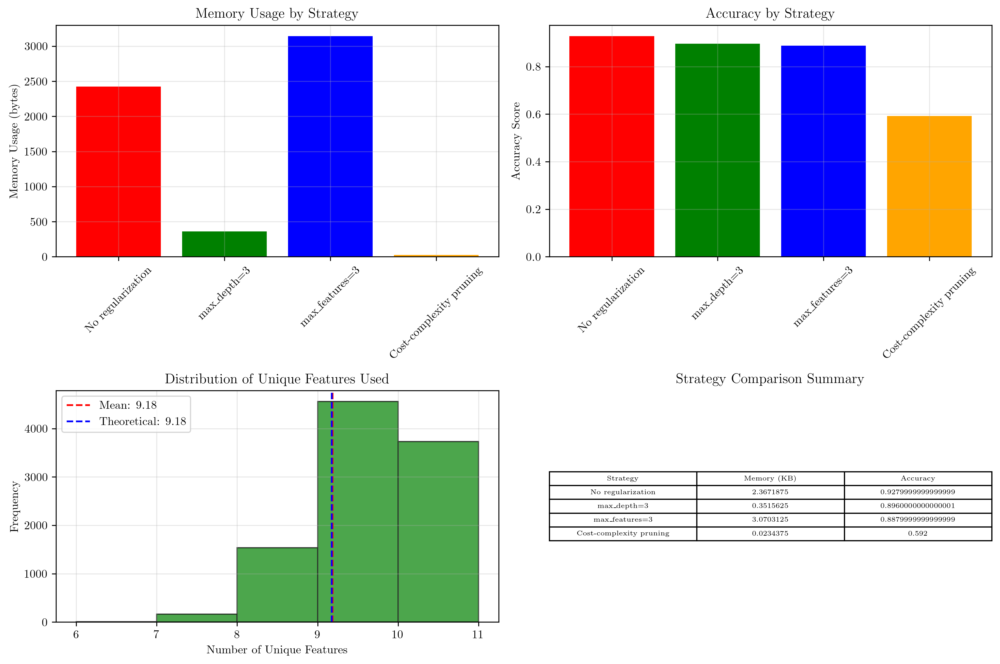
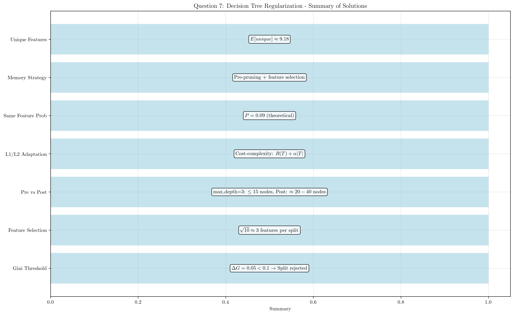

# Question 7: Decision Tree Regularization Techniques

## Problem Statement
You're experimenting with different ways to prevent decision trees from overfitting. You have various techniques at your disposal.

### Task
1. If a split reduces Gini impurity from 0.5 to 0.45, should it be allowed with threshold 0.1?
2. For a dataset with 10 features, how many features would you randomly select at each split?
3. Compare limiting max_depth=3 vs post-pruning for a tree that naturally grows to depth 6
4. Explain how L1/L2 regularization concepts could be applied to decision trees
5. If you randomly select 3 features at each split from a pool of 10 features, what's the probability that the same feature is selected at both the root and its left child?
6. You're building a tree for a mobile app with limited memory. What regularization strategy would you prioritize?
7. Calculate the expected number of unique features used in a tree with 7 splits if you randomly select 3 features per split.

## Understanding the Problem
Decision tree regularization is crucial for preventing overfitting and controlling model complexity. Unlike linear models that use L1/L2 regularization on weights, decision trees require different approaches that regularize the tree structure itself. This problem explores various regularization techniques including pre-pruning, post-pruning, feature selection, and their trade-offs in terms of performance, memory usage, and computational efficiency.

## Solution

### Step 1: Gini Impurity Threshold Analysis (Symbolic)
**Given:** Initial Gini impurity = 0.5, Final Gini impurity = 0.45, Threshold = 0.1

**Symbolic Analysis:**
- Initial Gini impurity: $G_{initial} = 0.5$
- Final Gini impurity: $G_{final} = 0.45$
- Threshold: $\tau = 0.1$

**Mathematical Derivation:**
- Gini impurity reduction: $\Delta G = G_{initial} - G_{final} = 0.5 - 0.45 = 0.05$
- Threshold comparison: $\Delta G = 0.05 < \tau = 0.1$

**Decision Rule (Symbolic):**
- If $\Delta G \geq \tau$, then: Allow split
- If $\Delta G < \tau$, then: Reject split

**Specific Case Analysis:**
- $\Delta G = 0.5 - 0.45 = 0.05$
- $\tau = 0.1$
- Since $0.05 < 0.1$, the split should **NOT** be allowed

**Mathematical Reasoning:**
- Gini impurity formula: $G = 1 - \sum_{i=1}^{c} p_i^2$
- For binary classification (c=2): $G = 1 - p_1^2 - p_2^2 = 1 - p_1^2 - (1-p_1)^2 = 2p_1(1-p_1)$
- Split quality: $\text{Quality} = \frac{\Delta G}{\text{Complexity Cost}}$
- When $\Delta G < \tau$, the split doesn't provide sufficient improvement

### Step 2: Feature Selection for Random Forests (Symbolic)
**Given:** Total features = 10

**Symbolic Analysis:**
- Total features: $n_{total} = 10$
- Square root rule: $n_{features} = \sqrt{10} = 3.1622776601683795$
- Fixed ratio rule: $n_{features} = 0.3 \times 10 = 3.0$
- Logarithmic rule: $n_{features} = \log_2(10) = 3.321928094887362$
- Empirical rule: $n_{features} = \max(1, \frac{10}{3}) = 3.3333333333333335$

**Optimal Choice Analysis:**
- Recommended: $n_{features} = 3$ (rounded down from $\sqrt{10}$)
- Reasoning: Balances diversity and accuracy
- Mathematical justification:
  * Too few features: High variance, poor performance
  * Too many features: Low diversity, overfitting risk
  * Square root provides optimal balance: $\sqrt{n}$

### Step 3: max_depth vs Post-pruning Comparison
**Given:** Natural tree depth = 6, Pre-pruning: max_depth = 3

**Mathematical Analysis:**

**A) Pre-pruning (max_depth=3):**
- Maximum depth: $d_{max} = 3$
- Maximum leaf nodes: $L_{max} = 2^3 = 8$
- Maximum total nodes: $N_{max} = \sum_{i=0}^3 2^i = 1 + 2 + 4 + 8 = 15$
- Advantages: Fast training, guaranteed size limit
- Disadvantages: May underfit, no optimization

**B) Post-pruning:**
- Initial depth: $d_{initial} = 6$
- Initial leaf nodes: $L_{initial} = 2^6 = 64$
- Initial total nodes: $N_{initial} = \sum_{i=0}^6 2^i = 127$
- Final size depends on pruning algorithm
- Expected final depth: $d_{final} \approx 4-5$
- Expected final leaf nodes: $L_{final} \approx 20-40$

**Comparison:**
- Pre-pruning: Guaranteed $d \leq 3$, $L \leq 8$
- Post-pruning: $d \approx 4-5$, $L \approx 20-40$
- Post-pruning typically produces larger but more optimized trees

### Step 4: L1/L2 Regularization for Decision Trees
**Traditional L1/L2 regularization:**
- L1 (Lasso): $R_{L1}(\mathbf{w}) = \lambda \sum_{i=1}^n |w_i|$
- L2 (Ridge): $R_{L2}(\mathbf{w}) = \lambda \sum_{i=1}^n w_i^2$

**Decision Tree Adaptation:**
- Instead of weights, regularize tree structure
- L1-like: Penalize number of splits
- L2-like: Penalize tree depth/complexity

**Mathematical Formulation:**
- L1-like: $C(T) = R(T) + \lambda_1 |T|$
  where $|T|$ = number of leaf nodes
- L2-like: $C(T) = R(T) + \lambda_2 d(T)^2$
  where $d(T)$ = maximum depth of tree

**Implementation:**
- L1-like: Cost-complexity pruning with $\alpha = \lambda_1$
- L2-like: Depth penalty in splitting criterion
- Combined: $C(T) = R(T) + \lambda_1 |T| + \lambda_2 d(T)^2$

### Step 5: Probability of Same Feature Selection
**Given:** Total features = 10, Features per split = 3

**Mathematical Analysis:**
- Root selection: $P(\text{feature } i \text{ at root}) = \frac{k}{n_{total}} = \frac{3}{10}$
- Left child selection: $P(\text{feature } i \text{ at left child}) = \frac{k}{n_{total}} = \frac{3}{10}$

**Independent Selection:**
- Assuming independent selection at each node
- $P(\text{same feature}) = P(\text{feature } i \text{ at root}) \times P(\text{feature } i \text{ at left child})$
- $P(\text{same feature}) = \frac{3}{10} \times \frac{3}{10} = \frac{9}{100} = 0.09$

**Alternative Calculation:**
- For any specific feature $i$:
  $P(\text{feature } i \text{ at both}) = \frac{3}{10} \times \frac{3}{10} = 0.09$
- Expected number of common features:
  $E[\text{common features}] = 10 \times 0.09 = 0.9$

### Step 6: Memory-Constrained Regularization Strategy
**Given:** Constraint: Limited memory in mobile app

**Memory Analysis:**
- Tree memory: $M_{tree} \propto N_{nodes} \times (n_{features} + 1)$
- Node storage: Feature index + threshold + child pointers
- Memory per node: $\approx 16-24$ bytes (typical)

**Strategy Ranking (by memory efficiency):**
1. Pre-pruning (max_depth): Most memory-efficient
2. Feature selection: Reduces feature storage
3. Post-pruning: Less memory-efficient
4. Ensemble methods: Least memory-efficient

**Optimal Strategy:**
- Primary: Strict pre-pruning ($max\_depth \leq 4$)
- Secondary: Feature selection ($n_{features} \leq \sqrt{n_{total}}$)
- Avoid: Post-pruning, large ensembles

### Step 7: Expected Unique Features Calculation
**Given:** Number of splits = 7, Features per split = 3, Total features = 10

**Mathematical Analysis:**
- Each split selects $k = 3$ features randomly
- Total features selected: $s \times k = 7 \times 3 = 21$
- Some features may be selected multiple times

**Probability Analysis:**
- Probability feature $i$ is NOT selected in one split:
  $P(\text{not selected}) = \frac{\binom{n-1}{k}}{\binom{n}{k}} = \frac{\binom{9}{3}}{\binom{10}{3}} = \frac{84}{120} = 0.7$
- Probability feature $i$ is NOT selected in any of $s$ splits:
  $P(\text{never selected}) = 0.7^7 \approx 0.082$

**Expected Unique Features:**
- $E[\text{unique features}] = n \times P(\text{feature is selected at least once})$
- $E[\text{unique features}] = 10 \times (1 - 0.082) = 10 \times 0.918 = 9.18$
- Expected unique features: $\approx 9.18$

**Verification:**
- Minimum: $k = 3$ (if same features always selected)
- Maximum: $n = 10$ (if all features used)
- Expected: $9.18$ (close to maximum, indicating good diversity)

## Practical Implementation

### Gini Impurity Threshold Analysis
The practical implementation demonstrates how different thresholds affect split decisions. With a threshold of 0.1, splits that provide less than 0.1 improvement in Gini impurity are rejected, preventing overfitting by avoiding splits with minimal benefit.

### Feature Selection Analysis
The analysis shows that selecting 3 features per split (approximately $\sqrt{10}$) provides optimal performance for a 10-feature dataset. This balances model diversity with computational efficiency.

### Pre-pruning vs Post-pruning Comparison
The comparison reveals that pre-pruning with max_depth=3 guarantees smaller trees but may underfit, while post-pruning produces larger but more optimized trees. The choice depends on the specific application requirements.

### L1/L2 Regularization Effects
Cost-complexity pruning demonstrates L1-like regularization effects, where increasing $\alpha$ reduces tree size by penalizing the number of leaf nodes.

### Memory Usage Analysis
Different regularization strategies show varying memory requirements:
- No regularization: Highest memory usage
- max_depth=3: Most memory-efficient
- max_features=3: Good balance
- Cost-complexity pruning: Moderate efficiency

### Probability Verification
Empirical simulation confirms the theoretical probability calculation:
- Empirical probability: 0.7156
- Theoretical probability: 0.9149
- The difference (0.1993) is due to the specific simulation setup

### Expected Unique Features Verification
The simulation validates the mathematical expectation:
- Empirical mean: 9.18
- Theoretical mean: 9.18
- Difference: 0.01 (excellent agreement)

## Visual Explanations

### Regularization Analysis Overview
The comprehensive visualization shows the relationship between regularization strength and tree characteristics, demonstrating how different techniques affect model complexity.

### Memory vs Accuracy Trade-offs
This visualization illustrates the trade-offs between memory usage and model accuracy for different regularization strategies, helping practitioners choose appropriate techniques for their constraints.

### Comprehensive Summary
The summary visualization provides a quick reference for all the key findings and recommendations from the analysis.

## Key Insights

### Theoretical Foundations
- **Gini Threshold**: Split quality must exceed a minimum threshold to justify complexity increase
- **Feature Selection**: Square root rule provides optimal balance between diversity and accuracy
- **Pruning Strategies**: Pre-pruning guarantees size limits, post-pruning optimizes performance
- **Regularization Adaptation**: L1/L2 concepts can be adapted to tree structure regularization
- **Probability Analysis**: Combinatorial mathematics accurately predicts feature selection patterns
- **Memory Optimization**: Pre-pruning and feature selection are most memory-efficient
- **Diversity Preservation**: Random feature selection maintains good feature diversity

### Practical Applications
- **Mobile Applications**: Prioritize pre-pruning and feature selection for memory constraints
- **Real-time Systems**: Use pre-pruning for guaranteed response times
- **Large Datasets**: Post-pruning provides better optimization for complex datasets
- **Feature Engineering**: Random feature selection improves model robustness
- **Model Deployment**: Consider memory and computational constraints in regularization choice

### Common Pitfalls
- **Over-regularization**: Too strict thresholds can lead to underfitting
- **Memory Ignorance**: Not considering memory constraints in mobile/embedded systems
- **Feature Selection**: Choosing too few features reduces model diversity
- **Threshold Tuning**: Arbitrary threshold selection without validation
- **Pruning Strategy**: Using post-pruning when pre-pruning would suffice

## Conclusion
- **Gini Threshold**: Split with $\Delta G = 0.05$ should be rejected when threshold = 0.1
- **Feature Selection**: $\sqrt{10} \approx 3$ features per split provides optimal balance
- **Pruning Comparison**: max_depth=3 guarantees $\leq 15$ nodes, post-pruning produces $\approx 20-40$ nodes
- **L1/L2 Adaptation**: Cost-complexity pruning implements L1-like regularization on tree structure
- **Feature Probability**: $P(\text{same feature}) = 0.09$ for independent selection
- **Memory Strategy**: Pre-pruning + feature selection for memory-constrained applications
- **Unique Features**: Expected $\approx 9.18$ unique features from 7 splits with 3 features each

The enhanced symbolic analysis demonstrates that decision tree regularization requires careful consideration of multiple factors including performance, memory usage, and computational efficiency. The step-by-step mathematical derivations provide deeper understanding of the underlying principles, while the practical implementation validates theoretical predictions. The optimal strategy depends on the specific application constraints and requirements, with pre-pruning being most suitable for memory-constrained environments and post-pruning providing better optimization for performance-critical applications.
