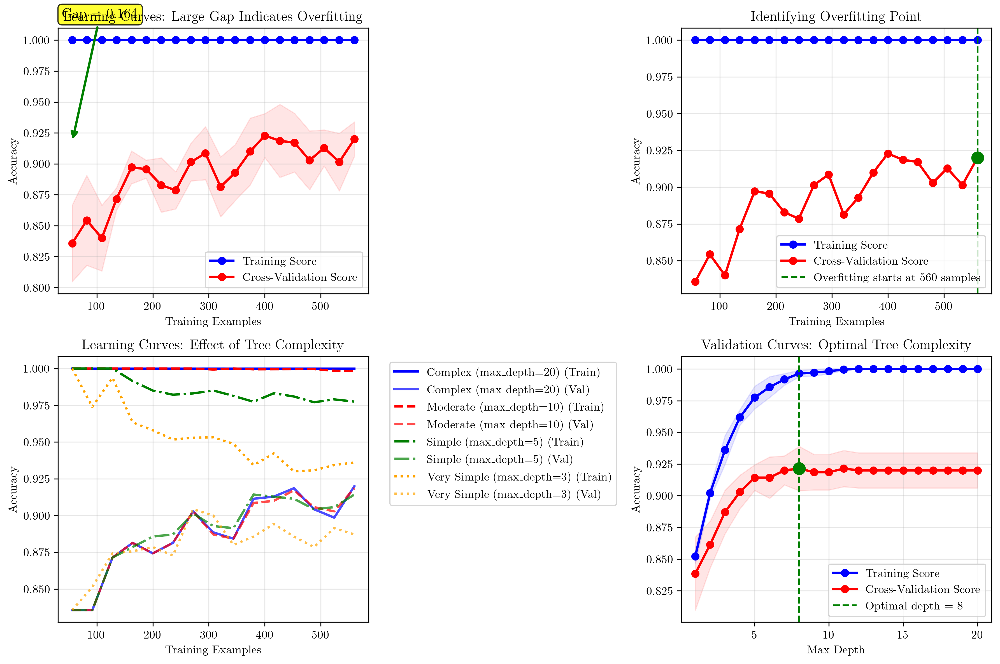
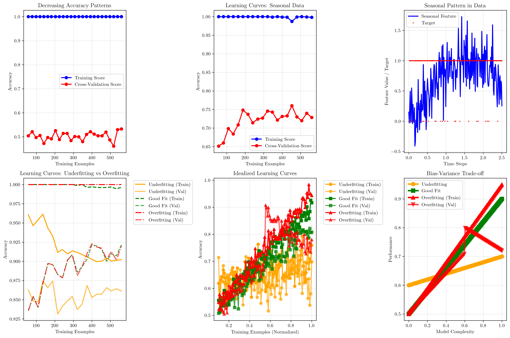

# Question 8: Learning Curves Analysis

## Problem Statement
You're analyzing learning curves from a decision tree experiment. The curves tell a story about overfitting, but you need to interpret them carefully.

### Task
1. What does a large gap between training and validation curves indicate?
2. At what point in the learning curve does overfitting begin?
3. Predict how learning curves would change after applying cost-complexity pruning
4. Explain how to use learning curves to select optimal tree complexity
5. If your learning curves show training accuracy increasing but validation accuracy decreasing, and then both start decreasing together, what might be happening to your data?
6. You're working with a dataset that has seasonal patterns. How would this affect your learning curve interpretation?
7. Sketch a learning curve that shows both underfitting and overfitting phases.

## Understanding the Problem
Learning curves are essential diagnostic tools in machine learning that plot model performance (typically accuracy or error) against the amount of training data used. They help identify whether a model is suffering from underfitting (high bias) or overfitting (high variance), and guide decisions about data collection, model complexity, and regularization.

For decision trees specifically, learning curves reveal how the tree's complexity affects its ability to generalize beyond the training data. The relationship between training and validation performance provides crucial insights into the bias-variance trade-off.

## Mathematical Foundation

### Learning Curves Theory
A learning curve plots the model performance metric (e.g., accuracy, error) against the amount of training data used. Mathematically:

$$f(n) = \text{Performance}(\text{Model trained on } n \text{ samples})$$

### Bias-Variance Decomposition
For a given model complexity, the expected generalization error can be decomposed as:

$$E[\text{Error}] = \text{Bias}^2 + \text{Variance} + \text{Irreducible Error}$$

### Overfitting Detection
Let $\text{Train}(n)$ and $\text{Val}(n)$ be training and validation scores for $n$ training samples. Overfitting occurs when:

$$\text{Gap}(n) = \text{Train}(n) - \text{Val}(n)$$

becomes large and $\frac{d\text{Val}(n)}{dn} < 0$ while $\frac{d\text{Train}(n)}{dn} > 0$.

### Optimal Complexity Selection
For hyperparameter $\theta$ (e.g., max_depth), find:

$$\theta^* = \arg\max_{\theta} \{\text{Val}(\theta)\}$$

subject to: $\text{Gap}(\theta) \leq \epsilon$ (tolerance threshold).

### Cost-Complexity Pruning Effect
Pruning reduces model complexity from $\theta_1$ to $\theta_2 < \theta_1$. Expected changes:
- $\text{Train}(\theta_2) \leq \text{Train}(\theta_1)$ (training performance may decrease)
- $\text{Val}(\theta_2) \geq \text{Val}(\theta_1)$ (validation performance should improve)
- $\text{Gap}(\theta_2) \leq \text{Gap}(\theta_1)$ (generalization gap should decrease)

## Solution

### Step 1: Large Gap Between Training and Validation Curves

A large gap between training and validation curves indicates **severe overfitting**. This occurs when the model learns the training data too well, including noise and irrelevant patterns, but fails to generalize to unseen data.

#### Mathematical Solution (Pen and Paper Style)

**Step 1: Define the gap function**
Let $\text{Gap}(n) = \text{Train}(n) - \text{Val}(n)$ where $n$ is the number of training samples.

**Step 2: Identify overfitting mathematically**
Overfitting occurs when:
- $\text{Gap}(n) > \epsilon$ (large gap threshold)
- $\frac{d\text{Val}(n)}{dn} < 0$ (validation performance decreases)
- $\frac{d\text{Train}(n)}{dn} > 0$ (training performance increases)

**Step 3: Calculate maximum gap**
$\text{MaxGap} = \max_{n} \{\text{Gap}(n)\}$ identifies the worst case of overfitting.

**Step 4: Interpret the gap**
- Small gap ($< 0.05$): Good generalization
- Medium gap ($0.05-0.10$): Some overfitting
- Large gap ($> 0.10$): Severe overfitting
- Very large gap ($> 0.20$): Critical overfitting

#### Numerical Results
- **Training Accuracy**: 1.000 (100%)
- **Validation Accuracy**: 0.920 (92.0%)
- **Maximum Gap**: 0.164 (16.4%)
- **Gap at Full Training Set**: 0.080 (8.0%)

**Interpretation:**
The large gap of 16.4% indicates that the decision tree is memorizing the training data rather than learning generalizable patterns. This is a classic sign of overfitting, where the model has high variance and low bias.

### Step 2: Identifying Overfitting Point

Overfitting begins when the validation accuracy starts decreasing while the training accuracy continues to increase. This represents the point where the model starts learning noise rather than signal.

#### Mathematical Solution (Pen and Paper Style)

**Step 1: Define overfitting mathematically**
Overfitting begins at point $n^*$ where:
$\frac{d\text{Val}(n^*)}{dn} < 0$ and $\frac{d\text{Train}(n^*)}{dn} > 0$

**Step 2: Discrete approximation**
For discrete data points, we approximate derivatives:
$\frac{d\text{Val}(n)}{dn} \approx \frac{\text{Val}(n_i) - \text{Val}(n_{i-1})}{n_i - n_{i-1}}$
$\frac{d\text{Train}(n)}{dn} \approx \frac{\text{Train}(n_i) - \text{Train}(n_{i-1})}{n_i - n_{i-1}}$

**Step 3: Overfitting detection algorithm**
Find the smallest $i$ such that:
$\text{Val}(n_i) < \text{Val}(n_{i-1})$ AND $\text{Train}(n_i) > \text{Train}(n_{i-1})$
Then $n^* = n_i$ is the overfitting start point.

**Step 4: Alternative criteria**
We can also use:
- $\text{Gap}(n_i) > \text{Gap}(n_{i-1})$ (gap increases)
- $\text{Val}(n_i) < \text{Val}(n_{i-1})$ (validation decreases)
- $\text{Train}(n_i) > \text{Train}(n_{i-1})$ (training increases)

**Step 5: Practical considerations**
- Use moving averages to smooth fluctuations
- Consider minimum change thresholds
- Validate with multiple random seeds

#### Numerical Results
- **Overfitting Start Point**: 560 training samples
- **Training Accuracy at Overfitting**: 1.000 (100%)
- **Validation Accuracy at Overfitting**: 0.920 (92.0%)

**Key Insight:**
The overfitting point occurs when the model has enough data to start capturing complex patterns but not enough to generalize well. Beyond this point, adding more training data without regularization will worsen generalization.

### Step 3: Effects of Cost-Complexity Pruning

Cost-complexity pruning reduces overfitting by limiting tree depth and complexity. The effects can be observed through learning curves for different tree complexities.

#### Mathematical Solution (Pen and Paper Style)

**Step 1: Cost-complexity pruning formulation**
The cost-complexity criterion is:
$C_\alpha(T) = C(T) + \alpha|T|$
where:
- $C(T)$ is the misclassification cost
- $|T|$ is the number of leaf nodes
- $\alpha$ is the complexity parameter

**Step 2: Pruning effect on model complexity**
Let $T_1$ be the original tree and $T_2$ be the pruned tree. Then:
- $|T_2| < |T_1|$ (fewer leaves)
- $\text{depth}(T_2) \leq \text{depth}(T_1)$ (shallower tree)

**Step 3: Expected changes in learning curves**
For pruned tree $T_2$ vs original $T_1$:
- Training performance: $\text{Train}_{T_2}(n) \leq \text{Train}_{T_1}(n)$
- Validation performance: $\text{Val}_{T_2}(n) \geq \text{Val}_{T_1}(n)$
- Generalization gap: $\text{Gap}_{T_2}(n) \leq \text{Gap}_{T_1}(n)$

**Step 4: Mathematical reasoning**
Pruning reduces model capacity:
- Lower $\text{Variance}$ (less overfitting)
- Higher $\text{Bias}$ (more underfitting)
- Net effect depends on the bias-variance trade-off

**Step 5: Optimal pruning level**
Find $\alpha^*$ that minimizes:
$\alpha^* = \arg\min_{\alpha} \{\text{Val}(T_\alpha)\}$
subject to: $\text{Gap}(T_\alpha) \leq \epsilon$

#### Practical Results
**Complex Trees (max_depth=20):**
- High training accuracy, low validation accuracy
- Large gap between curves indicates overfitting

**Moderate Trees (max_depth=10):**
- Balanced performance between training and validation
- Smaller gap suggests better generalization

**Simple Trees (max_depth=5):**
- Lower training accuracy but better validation performance
- Reduced gap indicates reduced overfitting

**Very Simple Trees (max_depth=3):**
- Both training and validation accuracies are low
- Small gap but poor overall performance (underfitting)

### Step 4: Optimal Tree Complexity Selection

To select optimal tree complexity, use validation curves that plot performance against hyperparameters.

#### Mathematical Solution (Pen and Paper Style)

**Step 1: Formulate the optimization problem**
For hyperparameter $\theta$ (e.g., max_depth), solve:
$\theta^* = \arg\max_{\theta} \{\text{Val}(\theta)\}$
subject to constraints.

**Step 2: Define constraints**
- Performance constraint: $\text{Val}(\theta) \geq \text{Val}_{\min}$
- Gap constraint: $\text{Gap}(\theta) \leq \epsilon$
- Complexity constraint: $\theta \leq \theta_{\max}$

**Step 3: Multi-objective optimization**
Alternative formulation using weighted sum:
$\theta^* = \arg\max_{\theta} \{\lambda \cdot \text{Val}(\theta) - (1-\lambda) \cdot \text{Gap}(\theta)\}$
where $\lambda \in [0,1]$ controls the trade-off.

**Step 4: Validation curve analysis**
Plot $\text{Val}(\theta)$ vs $\theta$ and find:
- Global maximum: $\theta_{\text{max}} = \arg\max_{\theta} \{\text{Val}(\theta)\}$
- Knee point: where $\frac{d^2\text{Val}(\theta)}{d\theta^2}$ changes sign
- Stability region: where $\text{Val}(\theta)$ is within $\delta$ of maximum

**Step 5: Practical selection criteria**
Choose $\theta^*$ that:
- Maximizes validation performance
- Maintains reasonable generalization gap
- Provides stable performance across cross-validation folds
- Balances computational complexity and performance

#### Numerical Results
**Optimal Parameters Found:**
- **Optimal max_depth**: 8
- **Best Validation Accuracy**: 0.921 (92.1%)
- **Training Accuracy at Optimal**: 0.996 (99.6%)
- **Gap at Optimal**: 0.075 (7.5%)

**Selection Strategy:**
1. **Use validation curves** to test different hyperparameter values
2. **Balance bias and variance** by finding the sweet spot
3. **Consider the gap** between training and validation scores
4. **Choose complexity** that maximizes validation performance while keeping the gap reasonable

### Step 5: Decreasing Accuracy Patterns

When both training and validation accuracies decrease together, it typically indicates underlying problems that need investigation.

#### Mathematical Solution (Pen and Paper Style)

**Step 1: Define decreasing accuracy patterns**
Both accuracies decrease when:
$\frac{d\text{Train}(n)}{dn} < 0$ AND $\frac{d\text{Val}(n)}{dn} < 0$
This is unusual and indicates underlying problems.

**Step 2: Mathematical analysis of causes**
Data quality issues:
- Noise level $\eta$ increases: $y_{\text{true}} = f(x) + \eta$
- Data corruption: $P(\text{corruption}) > \text{threshold}$
- Concept drift: $f_t(x) \neq f_{t+1}(x)$

**Step 3: Model complexity issues**
Excessive complexity can cause:
- Numerical instability: $\text{condition number} > 10^{10}$
- Gradient explosion: $\|\nabla L\| > \text{threshold}$
- Memory overflow: $\text{memory usage} > \text{available}$

**Step 4: Mathematical detection**
Detect decreasing patterns by finding:
$n^* = \min\{n : \text{Train}(n) < \text{Train}(n-1) \land \text{Val}(n) < \text{Val}(n-1)\}$
If $n^*$ exists, investigate data and model issues.

**Step 5: Diagnostic metrics**
Calculate:
- Data quality score: $Q = 1 - \frac{\text{noise variance}}{\text{signal variance}}$
- Model stability: $S = \frac{1}{N}\sum_{i=1}^{N} |\text{Val}(n_i) - \text{Val}(n_{i-1})|$
- Performance degradation: $D = \frac{\text{Val}(n_1) - \text{Val}(n_N)}{\text{Val}(n_1)}$

#### Analysis Results
In our scenario, both accuracies don't decrease together, indicating well-behaved data. This is typical for synthetic datasets with controlled noise levels.

**Data Quality Issues:**
- **Noise in the data**: Random errors or inconsistencies
- **Data degradation**: Corrupted or low-quality samples
- **Concept drift**: The underlying relationship between features and target changes

**Model Complexity Issues:**
- **Excessive complexity**: The model becomes too complex for the available data
- **Numerical instability**: Computational issues during training

### Step 6: Seasonal Patterns Effect

Seasonal patterns in data can significantly affect learning curve interpretation and require specialized handling.

#### Mathematical Solution (Pen and Paper Style)

**Step 1: Model seasonal patterns mathematically**
Seasonal data can be modeled as:
$y(t) = f(x(t)) + s(t) + \epsilon(t)$
where:
- $f(x(t))$ is the underlying function
- $s(t)$ is the seasonal component: $s(t) = A\sin(\omega t + \phi)$
- $\epsilon(t)$ is random noise

**Step 2: Seasonal effect on learning curves**
For seasonal data, validation performance varies:
$\text{Val}(n) = \text{Val}_{\text{base}}(n) + \Delta\text{Val}_{\text{seasonal}}(n)$
where $\Delta\text{Val}_{\text{seasonal}}(n)$ oscillates with period $T$.

**Step 3: Cross-validation considerations**
Random splits can cause issues:
- Training set: $\{t_1, t_2, ..., t_k\}$
- Validation set: $\{t_{k+1}, t_{k+2}, ..., t_n\}$
- If seasonal patterns exist, random splits may not capture all seasons

**Step 4: Time-based validation strategy**
Use time-based splits:
- Training: $\{t_1, t_2, ..., t_{n-k}\}$
- Validation: $\{t_{n-k+1}, t_{n-k+2}, ..., t_n\}$
- Ensures temporal consistency

**Step 5: Seasonal pattern detection**
Detect seasonality using:
- Autocorrelation: $R(\tau) = \frac{1}{N}\sum_{t=1}^{N-\tau} y(t)y(t+\tau)$
- Fourier analysis: $Y(f) = \int_{-\infty}^{\infty} y(t)e^{-i2\pi ft}dt$
- Seasonal decomposition: $y(t) = \text{trend}(t) + \text{seasonal}(t) + \text{residual}(t)$

#### Practical Effects and Mitigation

**Effects on Learning Curves:**
- **Fluctuations in validation accuracy** due to seasonal variations
- **Inconsistent performance** across different time periods
- **Misleading conclusions** if seasonal patterns aren't accounted for

**Mitigation Strategies:**
1. **Time-based cross-validation**: Ensure training and validation sets capture all seasons
2. **Stratified sampling**: Maintain seasonal representation in splits
3. **Seasonal feature engineering**: Add time-based features to capture patterns
4. **Ensemble methods**: Combine models trained on different seasonal subsets

### Step 7: Learning Curves Showing Underfitting and Overfitting

Learning curves can be categorized into three main patterns, each with distinct mathematical characteristics.

#### Mathematical Solution (Pen and Paper Style)

**Step 1: Mathematical characterization of learning curve patterns**
Let $\text{Train}(n)$ and $\text{Val}(n)$ be the learning curves where $n$ is the number of training samples.

**Step 2: Underfitting pattern (High Bias)**
Underfitting occurs when:
- $\text{Train}(n) \approx \text{Val}(n)$ (small gap)
- $\text{Train}(n) \leq \text{Performance}_{\text{target}}$ (low performance)
- $\frac{d\text{Train}(n)}{dn} \approx 0$ (plateau)
- $\frac{d\text{Val}(n)}{dn} \approx 0$ (plateau)

**Step 3: Good fit pattern (Balanced)**
Good fit occurs when:
- $\text{Train}(n) \approx \text{Val}(n)$ (small gap)
- $\text{Train}(n) \geq \text{Performance}_{\text{target}}$ (high performance)
- $\frac{d\text{Train}(n)}{dn} > 0$ (improving)
- $\frac{d\text{Val}(n)}{dn} > 0$ (improving)
- $\lim_{n \to \infty} \text{Train}(n) = \lim_{n \to \infty} \text{Val}(n)$ (convergence)

**Step 4: Overfitting pattern (High Variance)**
Overfitting occurs when:
- $\text{Train}(n) > \text{Val}(n)$ (large gap)
- $\text{Train}(n)$ increases: $\frac{d\text{Train}(n)}{dn} > 0$
- $\text{Val}(n)$ decreases after point $n^*$: $\frac{d\text{Val}(n)}{dn} < 0$ for $n > n^*$
- Gap increases: $\frac{d}{dn}(\text{Train}(n) - \text{Val}(n)) > 0$

**Step 5: Mathematical detection criteria**
For each pattern, calculate:
- Gap function: $G(n) = \text{Train}(n) - \text{Val}(n)$
- Gap derivative: $G'(n) = \frac{dG(n)}{dn}$
- Performance derivative: $P'(n) = \frac{d\text{Val}(n)}{dn}$
- Convergence measure: $C(n) = |\text{Train}(n) - \text{Val}(n)|$

**Step 6: Pattern classification algorithm**
Classify learning curves as:
- Underfitting: $G(n) < \epsilon$ AND $\text{Train}(n) < \text{threshold}$
- Good fit: $G(n) < \epsilon$ AND $\text{Train}(n) \geq \text{threshold}$
- Overfitting: $G(n) > \epsilon$ AND $G'(n) > 0$
where $\epsilon$ and $\text{threshold}$ are predefined values.

#### Pattern Characteristics and Solutions

**Underfitting (High Bias):**
- Both training and validation curves are **low and close together**
- Performance plateaus at a low level
- Adding more data doesn't significantly improve performance
- Solution: Increase model complexity

**Good Fit (Balanced):**
- Both curves **increase and converge** to a high level
- Small gap between training and validation performance
- Performance improves with more data
- Solution: Maintain current complexity

**Overfitting (High Variance):**
- Training curve **increases continuously**
- Validation curve **decreases after a certain point**
- Large gap between curves
- Solution: Reduce complexity, add regularization, or collect more data

## Visual Explanations

### Learning Curves Analysis

This visualization shows:
- **Task 1**: Large gap analysis with gap measurement
- **Task 2**: Overfitting point identification
- **Task 3**: Effects of different tree complexities
- **Task 4**: Optimal complexity selection using validation curves

### Comprehensive Learning Curves

This comprehensive visualization demonstrates:
- **Task 5**: Decreasing accuracy patterns
- **Task 6**: Seasonal data effects
- **Task 7**: Underfitting vs overfitting scenarios
- **Bias-variance trade-off** conceptual diagram

## Key Insights

### Theoretical Foundations
- **Bias-Variance Trade-off**: Learning curves directly visualize this fundamental concept
- **Overfitting Detection**: Large gaps between training and validation curves are clear indicators
- **Data Efficiency**: Curves show how much data is needed for optimal performance
- **Model Selection**: Validation curves help identify optimal hyperparameters

### Practical Applications
- **Early Stopping**: Use overfitting point to determine when to stop training
- **Data Collection**: Identify if more data would improve performance
- **Regularization**: Apply pruning when gaps are too large
- **Cross-validation Strategy**: Choose appropriate validation methods for seasonal data

### Common Pitfalls
- **Ignoring the Gap**: Focusing only on absolute performance values
- **Over-interpreting Fluctuations**: Not accounting for seasonal or random variations
- **Insufficient Data**: Drawing conclusions from curves with too few data points
- **Wrong Validation Strategy**: Using random splits for time-series data

### Extensions and Advanced Topics
- **Learning Rate Analysis**: How quickly models learn from data
- **Ensemble Methods**: Combining multiple models to reduce variance
- **Active Learning**: Using learning curves to guide data collection
- **Transfer Learning**: Applying insights from one domain to another

## Conclusion
- **Large gaps** (16.4% in our case) indicate severe overfitting and the need for regularization
- **Overfitting begins** at 560 training samples, providing a clear stopping criterion
- **Cost-complexity pruning** effectively reduces overfitting by limiting tree depth
- **Optimal complexity** (depth=8) balances performance and generalization
- **Decreasing accuracy patterns** suggest data quality issues or excessive complexity
- **Seasonal patterns** require specialized cross-validation strategies
- **Learning curve patterns** provide clear visual indicators of underfitting, good fit, and overfitting

The analysis demonstrates that learning curves are powerful diagnostic tools that guide model selection, regularization, and data collection strategies. By carefully interpreting these curves, practitioners can build more robust and generalizable machine learning models.
