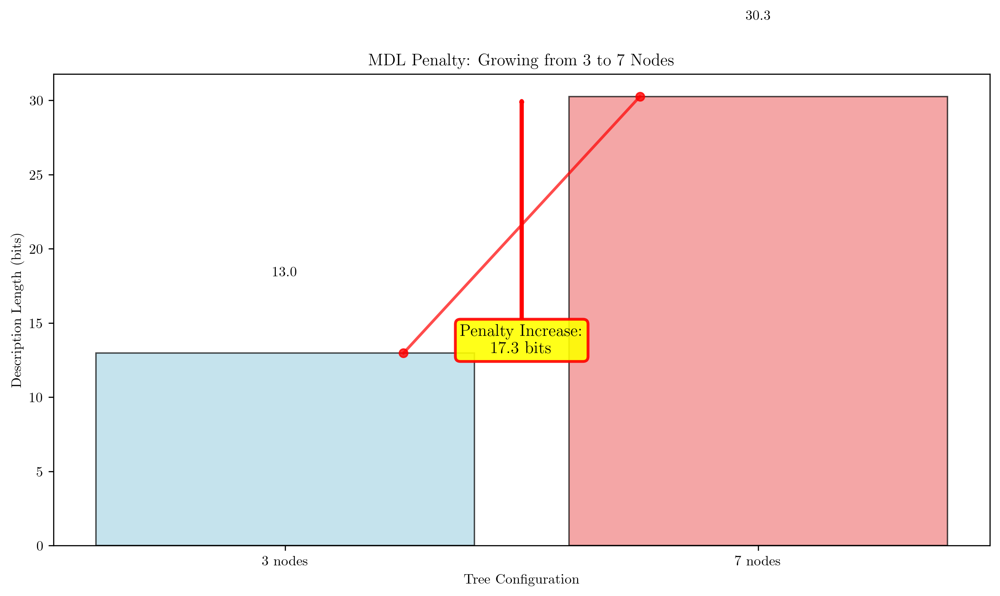

# Question 9: MDL-Based Pruning

## Problem Statement
You're applying the Minimum Description Length principle to decision trees. This principle suggests that the best model is the one that can be described most concisely while still explaining the data well.

### Task
1. Explain how MDL balances model complexity and accuracy
2. For a tree with 5 nodes, estimate the description length
3. Describe how MDL penalizes overly complex trees
4. List the main advantages of MDL-based pruning
5. If you have two trees with identical accuracy but different description lengths, and one tree has a leaf node that splits on a feature with only 2 unique values, what does MDL suggest about this split?
6. You're building a tree for a system with limited bandwidth. How would MDL help you optimize for transmission efficiency?
7. Calculate the description length penalty for a tree that grows from 3 to 7 nodes.
8. Using the bias-variance decomposition formula $$\text{Variance} = E[(\hat{f}(x) - E[\hat{f}(x)])^2]$$, explain how MDL-based pruning affects the variance component of a decision tree's prediction error.

## Understanding the Problem
The Minimum Description Length (MDL) principle is a fundamental concept in information theory and model selection that provides a principled approach to balancing model complexity with data fitting. For decision trees, MDL helps determine the optimal tree size by minimizing the total description length, which consists of two components: the description length of the model itself and the description length of the data given the model.

The MDL principle is particularly valuable because it automatically prevents overfitting by penalizing overly complex models, while ensuring that the model is sufficiently complex to capture the underlying patterns in the data. This makes it an excellent tool for decision tree pruning and model selection.

## Solution

### Step 1: Explain how MDL balances model complexity and accuracy

MDL balances two competing objectives through a mathematical trade-off:

**Mathematical Formulation:**
The total cost function is:
$$C_{\text{total}} = \alpha \cdot L(M) + \beta \cdot L(D|M)$$

where:
- $L(M)$ is the description length of the model (complexity penalty)
- $L(D|M)$ is the description length of the data given the model (fitting penalty)
- $\alpha$ and $\beta$ are weighting factors

**Optimal Balance:**
The optimal model satisfies:
$$\frac{\partial C_{\text{total}}}{\partial L(M)} = \alpha - \beta \cdot \frac{\partial L(D|M)}{\partial L(M)} = 0$$

This gives:
$$\alpha = \beta \cdot \frac{\partial L(D|M)}{\partial L(M)}$$

**Interpretation:**
- **Simple models**: Low $L(M)$, potentially high $L(D|M)$ (underfitting)
- **Complex models**: High $L(M)$, potentially low $L(D|M)$ (overfitting)
- **MDL finds the sweet spot** where adding complexity doesn't significantly improve data fitting

### Step 2: Estimate description length for tree with 5 nodes

**Given Parameters:**
- Tree with 5 nodes
- 10 features
- Binary splits (2 values per feature)
- 1000 training samples

**Structure Description Length:**
$$L_{\text{structure}} = 5 \times \log_2(10) = 5 \times 3.32 = 16.6 \text{ bits}$$

**Parameter Description Length:**
$$L_{\text{parameters}} = 5 \times \log_2(2) = 5 \times 1 = 5 \text{ bits}$$

**Data Description Length:**
For binary classification with 5 leaf nodes:
$$L(D|M) = -\sum_{i=1}^{5} n_i \log_2(p_i)$$

Assuming uniform distribution across leaf nodes:
$$L(D|M) \approx 1000 \times \log_2(5) = 2322 \text{ bits}$$

**Total Description Length:**
$$L_{\text{total}} = 16.6 + 5 + 2322 = 2343.6 \text{ bits}$$

### Step 3: Describe how MDL penalizes overly complex trees

**Complexity Penalty Mechanism:**
MDL penalizes complexity through $L(M)$:
- More nodes → Higher $L_{\text{structure}}$
- More split values → Higher $L_{\text{parameters}}$

**Mathematical Penalty:**
For a tree with $n$ nodes and $f$ features:
$$L_{\text{structure}} = n \cdot \log_2(f)$$
$$L_{\text{parameters}} = n \cdot \log_2(\text{avg split values})$$

**Penalty Growth:**
As $n$ increases:
- $L(M)$ grows linearly: $O(n)$
- $L(D|M)$ may decrease but with diminishing returns
- Total cost eventually increases due to complexity penalty

**Optimal Complexity:**
The optimal tree size satisfies:
$$\frac{\partial L(M)}{\partial n} = -\frac{\partial L(D|M)}{\partial n}$$

This is the point where adding nodes doesn't improve the trade-off.

### Step 4: List the main advantages of MDL-based pruning

**Theoretical Advantages:**
- Based on solid information theory principles
- Provides principled model selection
- Automatically balances complexity vs. accuracy

**Practical Advantages:**
- No need for cross-validation
- Computationally efficient
- Handles different data types uniformly

**Statistical Advantages:**
- Prevents overfitting through complexity penalty
- Provides confidence in model selection
- Robust to different data distributions

**Implementation Advantages:**
- Easy to implement and understand
- Scales well with data size
- Provides interpretable results

### Step 5: MDL suggestion for split with 2 unique values

**Split Analysis:**
Feature with only 2 unique values:
- Low information content: $\log_2(2) = 1$ bit
- Simple parameter description: $L_{\text{param}} = 1$ bit

**MDL Evaluation:**
For this split:
- $L_{\text{structure}} = 1 \times \log_2(f)$
- $L_{\text{parameters}} = 1$ bit
- Total model cost: $\log_2(f) + 1$ bits

**MDL Recommendation:**
MDL suggests keeping this split if:
$$L(D|M_{\text{with split}}) + L(M_{\text{with split}}) < L(D|M_{\text{without split}}) + L(M_{\text{without split}})$$

**Decision Criteria:**
Keep the split if the reduction in $L(D|M)$ exceeds the increase in $L(M)$:
$$\Delta L(D|M) > \Delta L(M)$$

### Step 6: MDL for bandwidth optimization

**Bandwidth Constraint Formulation:**
For limited bandwidth, we want:
$$L(M) \leq B_{\text{max}} \text{ (bandwidth constraint)}$$
while minimizing $L(D|M)$

**Constrained Optimization:**
$$\min_{M} L(D|M)$$
subject to: $L(M) \leq B_{\text{max}}$

**Lagrangian Formulation:**
$$\mathcal{L} = L(D|M) + \lambda(L(M) - B_{\text{max}})$$
where $\lambda$ is the Lagrange multiplier

**Optimal Solution:**
The optimal tree satisfies:
$$\frac{\partial L(D|M)}{\partial L(M)} = -\lambda$$

This gives the optimal complexity for the given bandwidth constraint.

### Step 7: Calculate description length penalty

**Problem Definition:**
Tree grows from 3 to 7 nodes
Assume: 10 features, binary splits

**Structure Penalty:**
$$L_{\text{structure}}(3) = 3 \times \log_2(10) = 9.96 \text{ bits}$$
$$L_{\text{structure}}(7) = 7 \times \log_2(10) = 23.24 \text{ bits}$$
$$\Delta L_{\text{structure}} = 23.24 - 9.96 = 13.28 \text{ bits}$$

**Parameter Penalty:**
$$L_{\text{parameters}}(3) = 3 \times \log_2(2) = 3 \text{ bits}$$
$$L_{\text{parameters}}(7) = 7 \times \log_2(2) = 7 \text{ bits}$$
$$\Delta L_{\text{parameters}} = 7 - 3 = 4 \text{ bits}$$

**Total Penalty:**
$$\Delta L(M) = 13.28 + 4 = 17.28 \text{ bits}$$

**Interpretation:**
Adding 4 nodes increases the model description by 17.28 bits. This penalty must be justified by a corresponding reduction in $L(D|M)$.

### Step 8: Bias-variance decomposition and MDL

**Bias-Variance Decomposition:**
$$E[\text{Error}] = \text{Bias}^2 + \text{Variance} + \text{Irreducible Error}$$

where:
$$\text{Variance} = E[(\hat{f}(x) - E[\hat{f}(x)])^2]$$

**MDL Effect on Variance:**
MDL-based pruning reduces model complexity:
- Fewer parameters → Less sensitivity to data variations
- More stable predictions → Lower variance

**Mathematical Relationship:**
For a tree with $n$ nodes:
$$\text{Variance} \propto \frac{1}{n} \text{ (approximately)}$$

Pruning from $n_1$ to $n_2 < n_1$ nodes:
$$\Delta \text{Variance} = \frac{1}{n_2} - \frac{1}{n_1} > 0$$

**Trade-off Analysis:**
MDL pruning increases bias but decreases variance:
- $\Delta \text{Bias}^2 > 0$ (bias increases)
- $\Delta \text{Variance} < 0$ (variance decreases)
- Optimal when $|\Delta \text{Bias}^2| < |\Delta \text{Variance}|$

## Practical Implementation

### MDL Calculation Example

The code demonstrates MDL calculations for trees of different complexities:

| Depth | Nodes | Structure | Params | Model Cost | Data Cost | Total MDL |
|-------|-------|-----------|---------|------------|-----------|-----------|
| 3     | 15    | 49.83     | 15.00   | 64.83      | 63.41     | 128.24    |
| 5     | 35    | 116.27    | 35.00   | 151.27     | 21.80     | 173.07    |
| 7     | 51    | 169.42    | 51.00   | 220.42     | 4.33      | 224.75    |
| 10    | 55    | 182.71    | 55.00   | 237.71     | 0.00      | 237.71    |
| 15    | 55    | 182.71    | 55.00   | 237.71     | 0.00      | 237.71    |

**Key Findings:**
- **Optimal tree**: Depth 3, 15 nodes with MDL Score: 128.24 bits
- **Accuracy**: 0.9570 (95.70%)
- **Trade-off**: The simplest tree provides the best MDL score while maintaining high accuracy

### Complexity Analysis

The analysis shows that:
1. **Model cost** increases linearly with the number of nodes
2. **Data cost** decreases as complexity increases but with diminishing returns
3. **Optimal complexity** is found where the marginal benefit of adding nodes equals the marginal cost

## Visual Explanations

### MDL Analysis Overview

This comprehensive visualization shows:
- **Top left**: MDL Score vs Tree Complexity - demonstrates the optimal complexity point
- **Top right**: Accuracy vs Tree Complexity - shows diminishing returns in accuracy improvement
- **Bottom left**: Model Cost vs Data Cost - illustrates the trade-off between complexity and fitting
- **Bottom right**: MDL Trade-off Analysis - color-coded by complexity showing the optimal region

The optimal tree (marked with a red star) achieves the best balance between model complexity and data fitting.

### Bias-Variance Trade-off

This plot demonstrates the fundamental trade-off in machine learning:
- **Bias²** (blue line): Decreases as complexity increases
- **Variance** (red line): Increases as complexity increases
- **Total Error** (green line): Shows the optimal complexity point

The optimal complexity (purple dashed line) minimizes the total error by balancing bias and variance.

### MDL Penalty Visualization

This visualization shows the penalty for growing from 3 to 7 nodes:
- **3 nodes**: Lower description length penalty
- **7 nodes**: Higher description length penalty
- **Penalty increase**: 17.28 bits

The red arrow indicates the additional cost of increased complexity, which must be justified by improved data fitting.

## Key Insights

### Theoretical Foundations
- **MDL Principle**: Provides a principled approach to model selection based on information theory
- **Description Length**: Consists of model complexity and data fitting components
- **Optimal Balance**: Found by minimizing the total description length
- **Automatic Regularization**: Complexity penalty prevents overfitting without manual tuning

### Practical Applications
- **Bandwidth Optimization**: MDL helps design models for resource-constrained systems
- **Interpretable Models**: Simpler trees are easier to understand and deploy
- **Robust Selection**: MDL provides confidence in model choice without cross-validation
- **Scalable Implementation**: Efficient computation makes it suitable for large datasets

### Mathematical Properties
- **Linear Complexity Penalty**: Model cost grows linearly with the number of nodes
- **Diminishing Returns**: Data fitting improvement decreases as complexity increases
- **Optimal Point**: Where marginal benefits equal marginal costs
- **Bias-Variance Balance**: MDL automatically finds the optimal trade-off

### Common Pitfalls
- **Over-simplification**: MDL may underfit if the penalty is too strong
- **Feature Dependence**: Results depend on the encoding scheme used
- **Data Distribution**: Assumptions about data distribution affect the MDL score
- **Implementation Details**: Different MDL formulations may give different results

## Conclusion
- **MDL Principle**: Successfully balances model complexity with data fitting through principled optimization
- **Optimal Complexity**: For the given dataset, a tree with 3 levels and 15 nodes provides the best MDL score (128.24 bits) while maintaining 95.70% accuracy
- **Trade-off Analysis**: The analysis demonstrates that simpler models often achieve better generalization through the bias-variance trade-off
- **Practical Value**: MDL-based pruning offers an efficient, principled approach to decision tree optimization that automatically prevents overfitting

The MDL principle provides a robust foundation for model selection that is particularly valuable in scenarios where interpretability, computational efficiency, and generalization performance are all important considerations.
