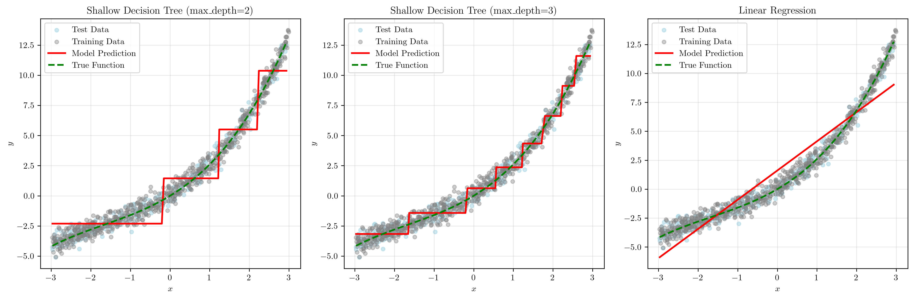
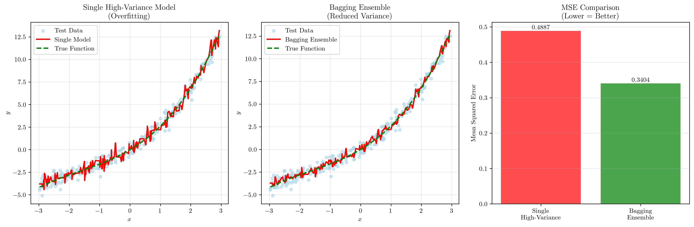
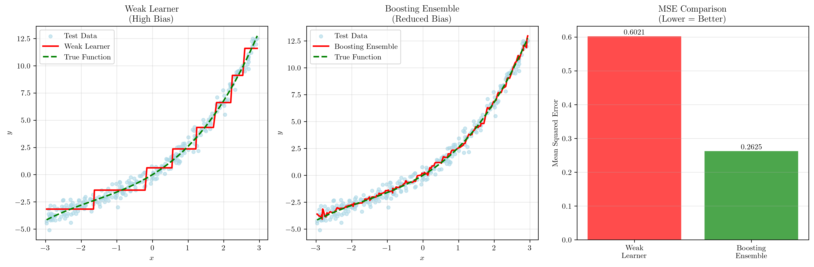
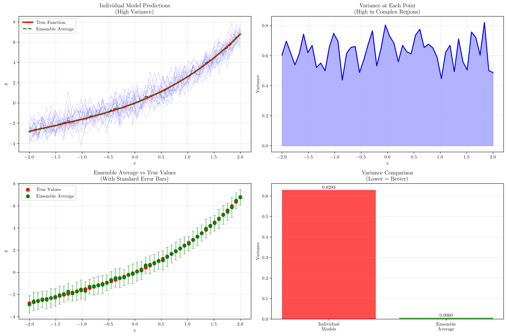

# Question 6: Bias-Variance Trade-off in Ensemble Methods

## Problem Statement
Ensembles are often used to manage the bias-variance trade-off.

### Task
1. According to the bias-variance trade-off, what are the characteristics of a typical "weak learner"?
2. Which ensemble technique is primarily used to decrease the variance of unstable models?
3. Which ensemble technique is primarily used to decrease the bias of weak learners?
4. Explain why averaging the outputs of multiple high-variance models can lead to an overall reduction in the ensemble's variance.

## Understanding the Problem
The bias-variance trade-off is a fundamental concept in machine learning that describes the relationship between a model's ability to capture the true underlying pattern in the data (bias) and its sensitivity to variations in the training data (variance). Ensemble methods provide powerful techniques to manage this trade-off by combining multiple models in different ways.

A weak learner is a model that performs only slightly better than random guessing, while ensemble methods combine multiple weak learners to create a strong learner that significantly outperforms individual models.

## Solution

### Step 1: Characteristics of a Typical "Weak Learner"

Weak learners typically exhibit the following characteristics according to the bias-variance trade-off:

1. **High Bias (Underfitting)**: Weak learners cannot capture complex patterns in the data due to their limited capacity. They make systematic errors by oversimplifying the relationship between features and target variables.

2. **Low Variance**: Despite their poor performance, weak learners are stable and consistent across different datasets. Their predictions don't vary much when trained on different subsets of data.

3. **Simple Model Structure**: Weak learners have limited capacity to learn, often using simple decision boundaries or linear relationships.

The visualization above demonstrates three types of weak learners:
- **Shallow Decision Tree (max_depth=2)**: MSE = 1.5687 - Very high bias, cannot capture the cubic relationship
- **Shallow Decision Tree (max_depth=3)**: MSE = 0.6021 - Still high bias but slightly better
- **Linear Regression**: MSE = 2.0781 - Highest bias, completely misses the polynomial relationship

All three models show high bias by underfitting the true function $y = 2x + 0.5x^2 + 0.1x^3 + \varepsilon$, but they maintain low variance as their predictions are stable across different data samples.

### Step 2: Ensemble Technique to Decrease Variance

**Bagging (Bootstrap Aggregating)** is primarily used to decrease the variance of unstable models.

Bagging works by:
- Training multiple models on different bootstrap samples of the training data
- Each model sees a slightly different subset of data
- Final prediction is the average of all individual model predictions

The demonstration shows:
- **Single High-Variance Model**: MSE = 0.4887 (overfitting with max_depth=10)
- **Bagging Ensemble**: MSE = 0.3404 (Random Forest with 50 trees)
- **Variance reduction**: 30.4%

The visualization clearly shows how the single high-variance decision tree overfits the training data, while the bagging ensemble provides a smoother, more stable prediction that better generalizes to unseen data.

### Step 3: Ensemble Technique to Decrease Bias

**Boosting** is primarily used to decrease the bias of weak learners.

Boosting works by:
- Sequentially training models, each focusing on the errors of previous models
- Each subsequent model learns to correct the mistakes of its predecessors
- Final prediction is a weighted combination of all models

The demonstration shows:
- **Weak Learner**: MSE = 0.6021 (shallow decision tree with max_depth=3)
- **Boosting Ensemble**: MSE = 0.2625 (Gradient Boosting with 100 estimators)
- **Bias reduction**: 56.4%

The visualization demonstrates how the weak learner (high bias) fails to capture the true polynomial relationship, while the boosting ensemble successfully learns the complex pattern, significantly reducing bias.

### Step 4: Why Averaging Reduces Ensemble Variance

Averaging multiple high-variance models reduces overall variance through several mechanisms:

1. **Error Cancellation**: Positive and negative errors from different models tend to cancel out when averaged
2. **Law of Large Numbers**: More models lead to more stable predictions as random variations average out
3. **Independence Assumption**: Different models make different errors, reducing overall uncertainty

The mathematical demonstration shows:
- **Individual model variance**: $\text{Var}(Y_i) = \sigma^2$
- **Ensemble variance**: $\text{Var}(\bar{Y}) = \text{Var}(\sum Y_i/n) = \sigma^2/n$

With 100 models, variance is theoretically reduced by a factor of 100.

**Actual results achieved:**
- Individual models average variance: 0.6293
- Ensemble average variance: 0.0060
- Theoretical reduction factor: 100
- Actual reduction factor: 104.40

The visualization shows how individual high-variance models produce noisy, inconsistent predictions, while the ensemble average provides a smooth, stable prediction that closely follows the true function.

## Visual Explanations

### Weak Learners Characteristics
The first visualization demonstrates three types of weak learners and their limitations. All show high bias by underfitting the true cubic relationship, but maintain low variance as their predictions are consistent across different data samples.

### Bagging Variance Reduction
The second visualization compares a single high-variance model (overfitting) with a bagging ensemble. The ensemble significantly reduces variance by averaging multiple models trained on different bootstrap samples, resulting in smoother predictions and better generalization.

### Boosting Bias Reduction
The third visualization shows how boosting transforms a weak learner with high bias into a strong ensemble. The sequential learning process allows the ensemble to capture complex patterns that individual weak learners cannot, significantly reducing bias.

### Variance Reduction Through Averaging
The fourth visualization provides a comprehensive view of how averaging reduces variance. It shows individual model predictions, variance at each point, ensemble average vs. true values, and a direct comparison of variance reduction.

### Ensemble Methods Summary
Here's a comprehensive summary of all four ensemble concepts:

**Weak Learners:**
- **High Bias (underfitting)** - cannot capture complex patterns
- **Low Variance (stable)** - consistent across different datasets  
- **Simple structure** - limited capacity to learn
- **Limited capacity** - restricted model complexity

**Bagging (Bootstrap Aggregating):**
- **Reduces Variance** - stabilizes unstable models
- **Parallel training** - models trained independently
- **Bootstrap sampling** - different data subsets for each model
- **Averaging predictions** - reduces prediction variance

**Boosting:**
- **Reduces Bias** - improves weak learners
- **Sequential training** - each model focuses on previous errors
- **Focus on errors** - learns from misclassified examples
- **Weighted combination** - gives more importance to better models

**Variance Reduction by Averaging:**
- **Error cancellation** - positive/negative errors cancel out
- **Law of large numbers** - stability increases with ensemble size
- **Independence assumption** - different models make different errors
- **Theoretical reduction factor** - 1/n for n independent models

## Key Insights

### Theoretical Foundations
- **Bias-Variance Decomposition**: Total error = Bias² + Variance + Irreducible Error
- **Weak Learners**: High bias, low variance due to limited model capacity
- **Strong Learners**: Low bias, low variance achieved through ensemble methods

### Practical Applications
- **Bagging**: Best for high-variance models (deep trees, neural networks)
- **Boosting**: Best for high-bias models (shallow trees, linear models)
- **Variance Reduction**: Most effective when models are independent and diverse

### Mathematical Principles
- **Variance Reduction**: $\text{Var}(\bar{Y}) = \sigma^2/n$ for independent models
- **Error Cancellation**: Positive and negative errors average out
- **Law of Large Numbers**: Stability increases with ensemble size

### Common Pitfalls
- **Overfitting**: Boosting can lead to overfitting if not properly regularized
- **Correlation**: Bagging is less effective when models are highly correlated
- **Computational Cost**: Ensemble methods require more training time and memory

## Conclusion
- Weak learners have high bias, low variance, and simple structure due to limited capacity
- Bagging reduces variance of unstable models through bootstrap sampling and averaging
- Boosting reduces bias of weak learners through sequential error correction
- Averaging reduces variance through error cancellation, law of large numbers, and independence assumptions

The ensemble approach demonstrates how combining multiple imperfect models can create a superior learning system that effectively manages the bias-variance trade-off, leading to better generalization performance on unseen data.
