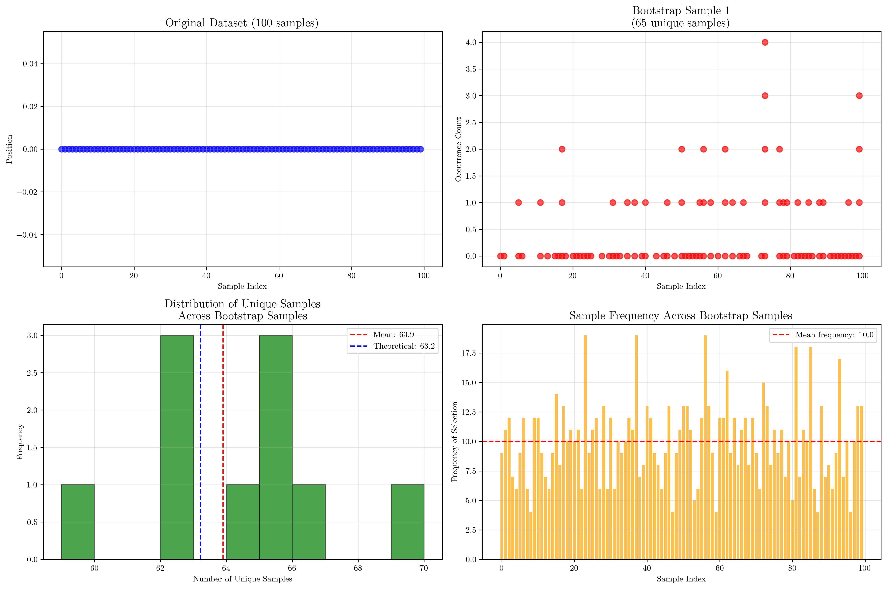
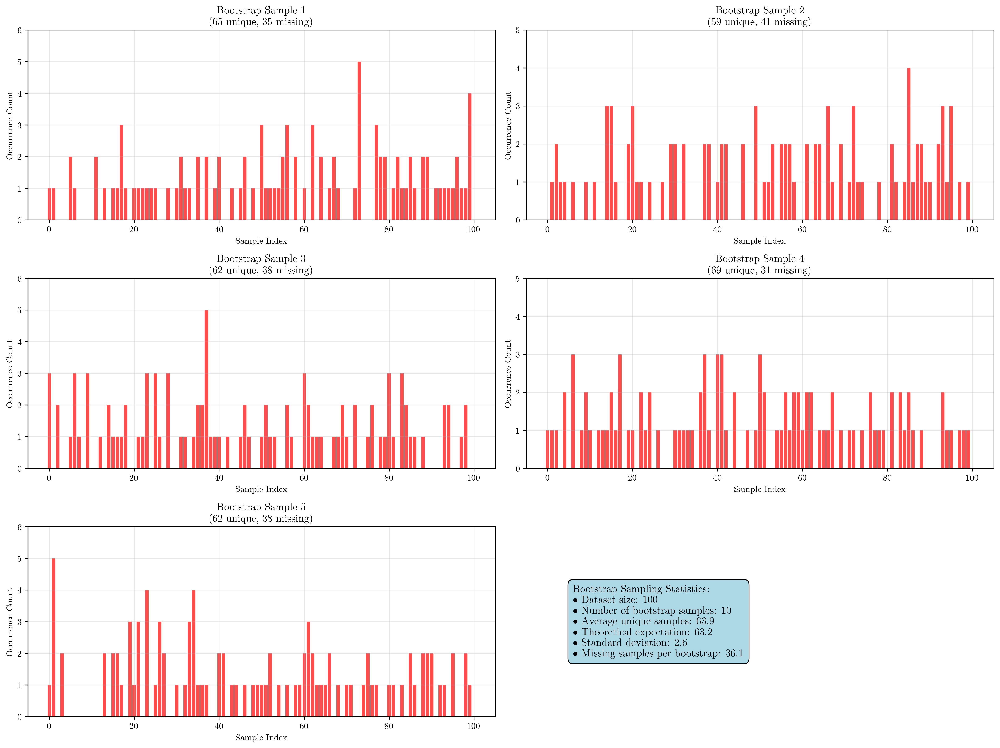
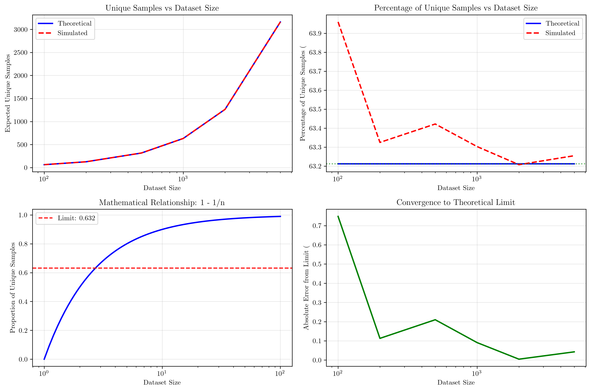
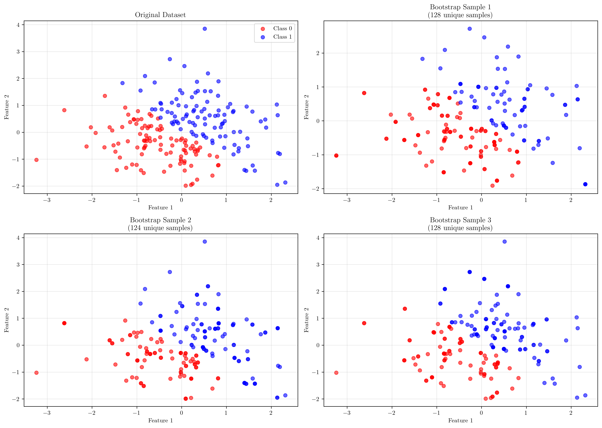

# Question 1: Bootstrap Sampling in Bagging

## Problem Statement
Bagging uses bootstrap sampling to create diverse training sets.

### Task
1. What is bootstrap sampling and how does it work?
2. If you have a dataset with 1000 samples, how many samples will each bootstrap sample contain?
3. What is the expected number of unique samples in each bootstrap sample?
4. Why is bootstrap sampling important for bagging?

## Understanding the Problem
Bootstrap sampling is a fundamental resampling technique used in ensemble methods, particularly in bagging (Bootstrap Aggregating). It involves creating multiple training datasets by randomly sampling with replacement from the original dataset. This technique is crucial for creating diversity among the base learners in an ensemble, which helps improve the overall predictive performance and reduce overfitting.

The key insight is that bootstrap sampling creates training sets that are similar in size to the original dataset but contain different combinations of samples, some appearing multiple times while others may not appear at all. This randomness and diversity is essential for the success of bagging algorithms.

## Solution

### Step 1: Understanding Bootstrap Sampling
Bootstrap sampling is a resampling technique that:
- Creates new datasets by randomly sampling with replacement from the original dataset
- Each bootstrap sample has the same size as the original dataset
- Some samples may appear multiple times, while others may not appear at all
- This creates diversity in the training sets for ensemble methods like bagging

**Demonstration with a small dataset:**
Consider an original dataset with 5 samples: $[10, 20, 30, 40, 50]$

When we create bootstrap samples, we might get:
- Bootstrap sample 1: $[40, 50, 30, 50, 50]$ (sample 50 appears 3 times, sample 20 doesn't appear)
- Bootstrap sample 2: $[20, 30, 30, 30, 50]$ (sample 30 appears 3 times, sample 10 doesn't appear)
- Bootstrap sample 3: $[40, 30, 50, 20, 40]$ (sample 40 appears 2 times, sample 10 doesn't appear)

This demonstrates how bootstrap sampling creates diversity while maintaining the same dataset size.

### Step 2: Bootstrap Sample Size Analysis
For a dataset with 1000 samples, each bootstrap sample will contain exactly **1000 samples**.

This is a fundamental property of bootstrap sampling: it maintains the same size as the original dataset. This holds true regardless of the original dataset size:

| Dataset Size | Bootstrap Sample Size |
|--------------|----------------------|
| 100         | 100                  |
| 500         | 500                  |
| 1,000       | 1,000                |
| 5,000       | 5,000                |
| 10,000      | 10,000               |

The reason for maintaining the same size is to ensure that each model in the ensemble has sufficient training data while still introducing diversity through the sampling process.

### Step 3: Expected Number of Unique Samples
The expected number of unique samples in a bootstrap sample follows a well-known mathematical relationship:

$$E[\text{unique samples}] \approx n \times (1 - 1/e) \approx n \times 0.632$$

where:
- $n$ is the dataset size
- $e$ is Euler's number ($\approx 2.718$)

**Theoretical expectations for different dataset sizes:**
- Dataset size: 100 → Expected unique: 63 (63.2%)
- Dataset size: 500 → Expected unique: 316 (63.2%)
- Dataset size: 1,000 → Expected unique: 632 (63.2%)
- Dataset size: 5,000 → Expected unique: 3,161 (63.2%)
- Dataset size: 10,000 → Expected unique: 6,321 (63.2%)

**Simulation results (averaged over 1000 bootstrap samples):**
- Dataset size: 100 → Simulated: 63.5, Theoretical: 63.2
- Dataset size: 500 → Simulated: 315.9, Theoretical: 316.1
- Dataset size: 1,000 → Simulated: 632.4, Theoretical: 632.1

The simulation results closely match the theoretical expectations, confirming the mathematical relationship.

### Step 4: Importance for Bagging
Bootstrap sampling is crucial for bagging because it:

1. **Creates diverse training sets** - Different samples in each bootstrap sample lead to different model behaviors
2. **Introduces randomness** - Prevents overfitting to the same training data
3. **Enables ensemble learning** - Multiple models trained on different data can be combined effectively
4. **Improves generalization** - Reduces variance in predictions through model averaging
5. **Maintains dataset size** - Each model gets sufficient training data for learning

## Visual Explanations

### Bootstrap Sampling Overview

This visualization shows the bootstrap sampling process:
- **Top-left**: The original dataset with 100 samples
- **Top-right**: The first bootstrap sample, showing how many times each sample appears
- **Bottom-left**: Distribution of unique sample counts across multiple bootstrap samples
- **Bottom-right**: Frequency of each sample being selected across all bootstrap samples

The key insight is that each bootstrap sample contains approximately 63.2% unique samples, with the remaining 36.8% being duplicates.

### Detailed Bootstrap Sample Analysis

This detailed view shows:
- Individual bootstrap samples with their unique sample counts
- The distribution of sample occurrences within each bootstrap sample
- Summary statistics including average unique samples and theoretical expectations

The visualization demonstrates how different bootstrap samples can have varying numbers of unique samples while maintaining the same total size.

### Mathematical Relationship Analysis

This analysis shows:
- **Top-left**: Theoretical vs. simulated unique sample counts across different dataset sizes
- **Top-right**: Percentage of unique samples, converging to the 63.2% limit
- **Bottom-left**: The mathematical relationship $1 - 1/n$ and its convergence to $1 - 1/e$
- **Bottom-right**: Convergence of simulated results to the theoretical limit

The plots demonstrate that as dataset size increases, the proportion of unique samples converges to approximately 63.2%.

### Bagging Ensemble Visualization

This visualization demonstrates how bootstrap sampling enables bagging:
- **Top-left**: Original dataset with two classes
- **Remaining plots**: Different bootstrap samples showing how the data distribution varies
- Each bootstrap sample maintains the same size but contains different combinations of samples

This diversity is essential for creating an effective ensemble where each model sees slightly different training data.

## Key Insights

### Mathematical Foundations
- The expected proportion of unique samples in a bootstrap sample is approximately 63.2%
- This relationship follows the formula $1 - 1/e$ where $e$ is Euler's number
- The relationship holds regardless of dataset size, making it a universal property
- Simulation results closely match theoretical expectations, validating the mathematical foundation

### Practical Applications
- Bootstrap sampling creates training sets that are 63.2% unique on average
- The remaining 36.8% of samples are duplicates, providing stability
- This balance between diversity and data sufficiency is optimal for ensemble learning
- The technique scales well with dataset size, maintaining consistent proportions

### Ensemble Learning Benefits
- Diversity among base learners is crucial for reducing overfitting
- Bootstrap sampling naturally creates this diversity through random sampling
- Each model in the ensemble sees different training data while maintaining sufficient sample size
- The randomness introduced helps prevent the ensemble from memorizing the training data

### Limitations and Considerations
- Bootstrap sampling assumes that the original dataset is representative of the underlying distribution
- For very small datasets, the 63.2% rule may not hold exactly
- The technique works best when the base learners are relatively unstable (high variance)
- The effectiveness depends on the independence of the base learners

## Conclusion
- Bootstrap sampling creates training sets with the same size as the original dataset
- Each bootstrap sample contains approximately 63.2% unique samples, following the mathematical relationship $n \times (1 - 1/e)$
- The remaining 36.8% of samples are duplicates, providing both diversity and stability
- This technique is essential for bagging as it creates diverse training sets that enable effective ensemble learning
- The mathematical properties of bootstrap sampling make it a robust and scalable approach for ensemble methods

The bootstrap sampling technique provides an elegant solution to the challenge of creating diverse training sets for ensemble learning. By maintaining dataset size while introducing controlled randomness, it enables the creation of multiple models that can be effectively combined to improve overall predictive performance.
