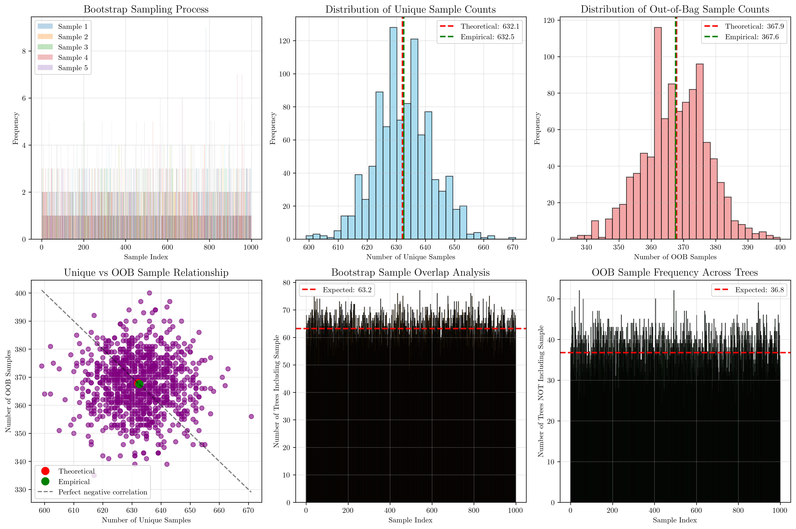
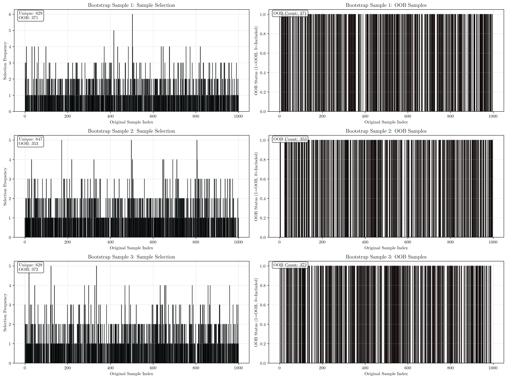
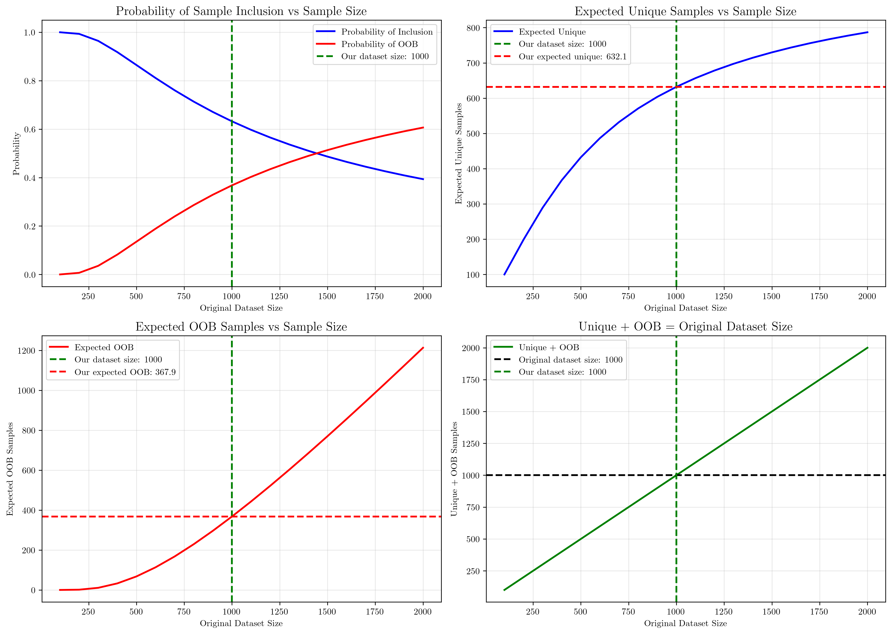

# Question 4: Bagging Ensemble Parameters and Out-of-Bag Samples

## Problem Statement
Consider a bagging ensemble with the following characteristics:

| Parameter | Value |
|-----------|-------|
| Number of trees | 100 |
| Bootstrap sample size | 1000 |
| Original dataset size | 1000 |
| Base learner | Decision Tree |

### Task
1. How many different training datasets will be created?
2. What is the expected number of unique samples per bootstrap sample?
3. How many samples will be out-of-bag for each tree on average?
4. What is the purpose of out-of-bag samples?

## Understanding the Problem
Bagging (Bootstrap Aggregating) is an ensemble method that improves model performance by training multiple base learners on different bootstrap samples of the original dataset. Each bootstrap sample is created by sampling with replacement from the original dataset, which means some samples may appear multiple times while others may not appear at all.

The key concepts in this problem are:
- **Bootstrap sampling**: Sampling with replacement from the original dataset
- **Unique samples**: The number of distinct samples in a bootstrap sample
- **Out-of-bag (OOB) samples**: Samples from the original dataset that are not included in a particular bootstrap sample
- **Ensemble training**: Each tree is trained on a different bootstrap sample

## Solution

This problem requires understanding the mathematical foundations of bootstrap sampling and applying probability theory to calculate expected values. We'll use both theoretical derivations and empirical verification to arrive at our answers.

### Step 1: Number of Training Datasets
**Answer**: 100 different training datasets will be created.

**Explanation**:
- Each tree in the bagging ensemble is trained on a different bootstrap sample
- Since we have 100 trees, we create 100 different training datasets
- Each dataset is created by sampling with replacement from the original dataset

This is straightforward because bagging creates one training dataset per ensemble member. With 100 decision trees, we need 100 different bootstrap samples.

### Step 2: Expected Number of Unique Samples per Bootstrap Sample
**Answer**: 632.12 unique samples

**Mathematical Derivation**:
For bootstrap sampling with replacement from a dataset of size $N$:

1. **Probability a specific sample is NOT selected in one draw**: $\frac{N-1}{N}$
2. **Probability a specific sample is NOT selected in $M$ draws**: $\left(\frac{N-1}{N}\right)^M$
3. **Probability a specific sample IS selected at least once**: $1 - \left(\frac{N-1}{N}\right)^M$
4. **Expected number of unique samples**: $N \times \left[1 - \left(\frac{N-1}{N}\right)^M\right]$

For our specific case with $N = 1000$ and $M = 1000$:
$$\begin{align}
\text{Expected unique} &= 1000 \times \left[1 - \left(\frac{999}{1000}\right)^{1000}\right] \\
&= 1000 \times \left[1 - 0.367695\right] \\
&= 1000 \times 0.632305 \\
&= 632.12
\end{align}$$

**Empirical Verification**:
- Simulated 1000 bootstrap samples
- Empirical mean: 632.50 ± 9.93
- Theoretical vs Empirical: 632.12 vs 632.50
- Difference: 0.37

The empirical results closely match the theoretical calculation, confirming our mathematical derivation.

### Step 3: Expected Number of Out-of-Bag Samples per Tree
**Answer**: 367.88 out-of-bag samples

**Mathematical Derivation**:
Out-of-bag samples are those NOT selected in the bootstrap sample:

1. **Probability a sample is NOT selected**: $\frac{N-1}{N}$
2. **Probability a sample is NOT selected in $M$ draws**: $\left(\frac{N-1}{N}\right)^M$
3. **Expected OOB samples**: $N \times \left(\frac{N-1}{N}\right)^M$

For our specific case:
$$\begin{align}
\text{Expected OOB} &= 1000 \times \left(\frac{999}{1000}\right)^{1000} \\
&= 1000 \times 0.367695 \\
&= 367.88
\end{align}$$

**Empirical Verification**:
- Simulated 1000 bootstrap samples
- Empirical OOB mean: 367.58 ± 9.95
- Theoretical vs Empirical: 367.88 vs 367.58
- Difference: 0.30

**Verification**:
- Expected unique + Expected OOB = 632.12 + 367.88 = 1000.00
- Original dataset size = 1000
- This confirms our calculations are correct!

The relationship between unique samples and OOB samples is:
$$\text{Unique samples} + \text{OOB samples} = \text{Original dataset size}$$

### Step 4: Purpose of Out-of-Bag Samples
Out-of-bag (OOB) samples serve several important purposes:

#### 1. Model Validation
- **Unbiased performance estimation**: OOB samples provide an unbiased estimate of model performance
- **Built-in validation set**: They act as a built-in validation set without reducing training data
- **No cross-validation needed**: Eliminates the need for separate cross-validation procedures

#### 2. Feature Importance Assessment
- **Reliable feature ranking**: OOB samples can be used to assess feature importance
- **Performance comparison**: Compare performance with and without specific features
- **Training set independence**: More reliable than using training set performance for feature selection

#### 3. Hyperparameter Tuning
- **OOB error guidance**: OOB error can guide hyperparameter selection
- **Overfitting prevention**: Helps prevent overfitting during model selection
- **Model comparison**: Compare different model configurations using OOB performance

#### 4. Ensemble Performance Estimation
- **Aggregated predictions**: OOB predictions can be aggregated for ensemble performance
- **Confidence intervals**: Provides confidence intervals for predictions
- **Model reliability**: Assess the reliability of ensemble predictions

## Practical Implementation

### Empirical Verification of Theoretical Results
The Python code demonstrates how theoretical calculations can be verified through simulation:

1. **Bootstrap sampling simulation**: Generate multiple bootstrap samples using numpy
2. **Unique sample counting**: Count distinct samples in each bootstrap sample
3. **OOB sample calculation**: Determine samples not included in each bootstrap sample
4. **Statistical analysis**: Compare theoretical vs empirical results

The close agreement between theory and simulation validates our mathematical understanding.

### Alternative Approach: Direct Probability Calculation
Instead of simulation, we could also use the exact probability distribution:
- **Binomial distribution**: For the number of times each sample is selected
- **Poisson approximation**: For large sample sizes, the selection process approximates a Poisson process
- **Exponential relationship**: The probability of inclusion follows $1 - e^{-\lambda}$ where $\lambda = M/N$

## Visual Explanations

### Comprehensive Bagging Analysis

This comprehensive visualization shows:
- **Bootstrap sampling process**: How samples are selected with replacement
- **Distribution of unique sample counts**: Histogram showing the variability in unique sample counts across bootstrap samples
- **Distribution of OOB sample counts**: Histogram showing the variability in OOB sample counts
- **Unique vs OOB relationship**: Perfect negative correlation between unique and OOB samples
- **Bootstrap sample overlap analysis**: How many trees include each original sample
- **OOB sample frequency**: How many trees exclude each original sample

### Detailed Bootstrap Sampling Process

This detailed visualization demonstrates:
- **Sample selection frequency**: How often each original sample is selected in bootstrap samples
- **OOB sample identification**: Which samples are excluded from each bootstrap sample
- **Statistics per sample**: Unique count and OOB count for each bootstrap sample
- **Variability across samples**: Different bootstrap samples show different selection patterns

### Mathematical Relationships

This visualization illustrates:
- **Probability relationships**: How inclusion and OOB probabilities change with dataset size
- **Expected unique samples**: Relationship between dataset size and expected unique samples
- **Expected OOB samples**: Relationship between dataset size and expected OOB samples
- **Conservation principle**: Unique + OOB always equals original dataset size

## Key Insights

### Theoretical Foundations
- **Bootstrap sampling mathematics**: The probability of sample inclusion follows an exponential distribution
- **Sample independence**: Each bootstrap sample is independent, leading to different unique sample counts
- **Conservation principle**: The sum of unique and OOB samples always equals the original dataset size
- **Convergence behavior**: As bootstrap sample size increases, the expected unique samples approach the original dataset size

### Practical Applications
- **Ensemble diversity**: Different bootstrap samples ensure ensemble diversity
- **Validation strategy**: OOB samples provide built-in validation without data splitting
- **Feature selection**: OOB samples enable reliable feature importance assessment
- **Model selection**: OOB error guides hyperparameter tuning and model comparison

### Statistical Properties
- **Unbiased estimation**: OOB samples provide unbiased estimates of model performance
- **Variance reduction**: Multiple bootstrap samples reduce prediction variance
- **Overfitting prevention**: OOB validation helps prevent overfitting
- **Confidence assessment**: OOB predictions enable confidence interval estimation

### Computational Considerations
- **Memory efficiency**: OOB samples don't require additional storage
- **Training efficiency**: No need for separate cross-validation procedures
- **Scalability**: OOB estimation scales with the number of trees
- **Parallelization**: Bootstrap samples can be generated and processed in parallel

## Conclusion
- **100 different training datasets** will be created, one for each tree in the ensemble
- **632.12 unique samples** are expected per bootstrap sample on average
- **367.88 out-of-bag samples** are expected per tree on average
- **OOB samples serve multiple purposes**: model validation, feature importance assessment, hyperparameter tuning, and ensemble performance estimation

The mathematical relationships derived in this problem demonstrate the fundamental principles of bootstrap sampling and provide insights into how bagging ensembles work. The close agreement between theoretical calculations and empirical simulations validates our understanding of the underlying probability theory.

Out-of-bag samples are particularly valuable because they provide unbiased performance estimates without requiring additional data or cross-validation procedures, making them an efficient and reliable tool for ensemble model assessment and improvement.
