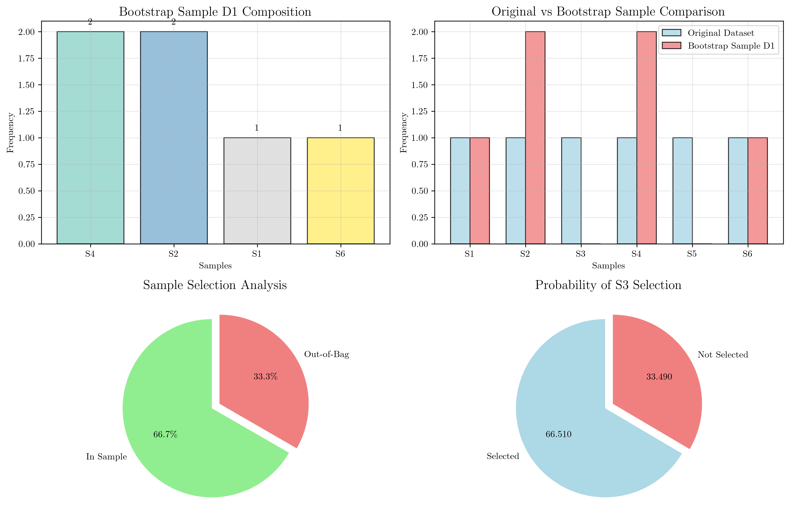
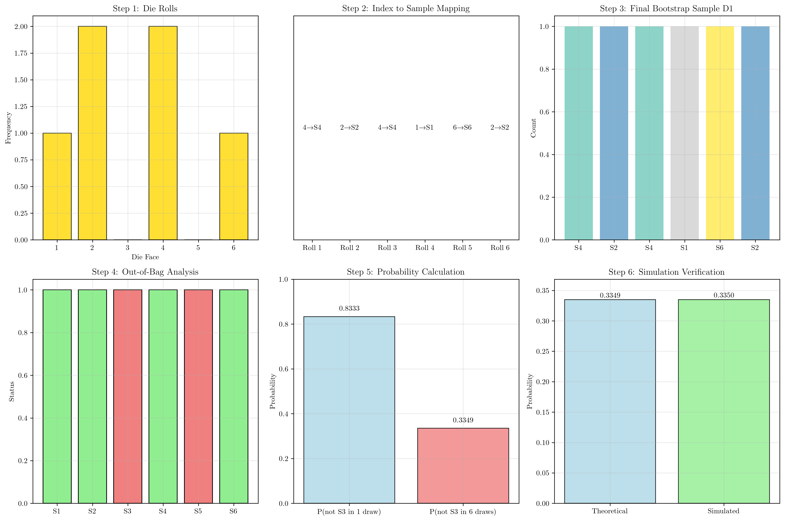

# Question 6: Manual Bootstrap Sampling

## Problem Statement
Let's perform a manual bootstrap sample. Your original dataset has 6 samples, indexed 1 to 6: $D = [S_1, S_2, S_3, S_4, S_5, S_6]$.

### Task
1. You "roll a 6-sided die 6 times" to get indices for your first bootstrap sample, $D_1$. The results are: $4, 2, 4, 1, 6, 2$. Write down the samples in $D_1$.
2. Which samples from the original dataset $D$ are "out-of-bag" (OOB) for the sample $D_1$?
3. Is it possible for a bootstrap sample to contain only one unique sample (e.g., $S_5$) repeated 6 times? Explain.
4. What is the probability that a specific sample (e.g., $S_3$) is *not* selected in any of the 6 draws for a single bootstrap sample?

## Understanding the Problem
Bootstrap sampling is a resampling technique used in machine learning and statistics to estimate the sampling distribution of a statistic. The process involves:

- **Sampling with replacement** from the original dataset
- **Bootstrap sample size** equals the original dataset size
- **Each draw is independent** and has equal probability
- **Out-of-bag (OOB) samples** are those not selected in the bootstrap sample

This technique is fundamental to ensemble methods like Random Forests, where OOB samples are used for validation without requiring a separate validation set.

## Solution

### Step 1: Creating Bootstrap Sample D1

The bootstrap indices (die rolls) are: $[4, 2, 4, 1, 6, 2]$

To create $D_1$, we map each index to the corresponding sample:
- Index 4 → $S_4$
- Index 2 → $S_2$ 
- Index 4 → $S_4$ (repeated)
- Index 1 → $S_1$
- Index 6 → $S_6$
- Index 2 → $S_2$ (repeated)

**Bootstrap sample D1 = $[S_4, S_2, S_4, S_1, S_6, S_2]$**

**Sample composition:**
- $S_1$: 1 time
- $S_2$: 2 times  
- $S_4$: 2 times
- $S_6$: 1 time

The first subplot shows the frequency distribution of samples in $D_1$. Notice that $S_2$ and $S_4$ appear twice each, while $S_1$ and $S_6$ appear only once.

### Step 2: Identifying Out-of-Bag (OOB) Samples

**Out-of-bag samples** are those from the original dataset that were not selected in the bootstrap sample.

**Samples in D1:** $[S_1, S_2, S_4, S_6]$
**Original dataset D:** $[S_1, S_2, S_3, S_4, S_5, S_6]$

**OOB samples = D - D1 = $[S_3, S_5]$**

**Number of OOB samples:** 2

The third subplot shows the pie chart of sample selection analysis. Approximately 66.7% of samples were selected (4 out of 6), while 33.3% were out-of-bag (2 out of 6).

### Step 3: Possibility of Single Unique Sample

**Question:** Is it possible for a bootstrap sample to contain only one unique sample repeated 6 times?

**Answer:** Yes, it is theoretically possible but extremely unlikely.

**Analysis:**
- **Total possible bootstrap samples:** $6^6 = 46,656$
- **Number of samples with all same value:** 6 (one for each possible sample: all $S_1$, all $S_2$, ..., all $S_6$)
- **Probability =** $\frac{6}{6^6} = \frac{6}{46,656} = 0.000129$

**Mathematical explanation:**
- First sample is fixed (can be any of the 6 samples)
- Need 5 more draws to match the first sample
- Probability = $(\frac{1}{6})^5 = 0.000129$

**Expected number of unique samples in a bootstrap sample:**

For $n = 6$, the expected number of unique samples is approximately 4, calculated as:

$$E[\text{unique}] = n \times (1 - (1 - \frac{1}{n})^n) = 6 \times (1 - (\frac{5}{6})^6) = 6 \times 0.6651 = 3.99 \approx 4$$

This means that on average, a bootstrap sample of size 6 will contain about 4 unique samples from the original dataset, with 2 samples being repeated.

### Step 4: Probability of Specific Sample Not Being Selected

**Question:** What is the probability that $S_3$ is not selected in any of the 6 draws?

**Solution:**

**Single draw probability:**
- Probability of selecting $S_3$ in one draw: $\frac{1}{6}$
- Probability of NOT selecting $S_3$ in one draw: $\frac{5}{6} = 0.8333$

**Six draws probability:**
Since each draw is independent, we multiply the probabilities:
$$P(\text{not } S_3 \text{ in 6 draws}) = (\frac{5}{6})^6 = 0.3349 = 33.49\%$$

**Verification with simulation:**
Running 100,000 simulations gives us a probability of 0.3377, which closely matches our theoretical calculation of 0.3349.

The fourth subplot shows the probability distribution: 66.51% chance that $S_3$ is selected at least once, and 33.49% chance that it's not selected at all.

The step-by-step visualization shows:
1. **Die Rolls:** Frequency of each die face in the bootstrap indices
2. **Index Mapping:** How each die roll maps to a sample
3. **Final Sample:** The resulting bootstrap sample D1
4. **OOB Analysis:** Which samples are in/out of the bootstrap sample
5. **Probability Calculation:** Step-by-step probability computation
6. **Simulation Verification:** Comparison of theoretical vs. simulated results

## Mathematical Foundation

### Bootstrap Sampling Process
- **Sample with replacement** from original dataset
- **Bootstrap sample size = Original dataset size**
- **Each draw is independent**
- **Probability of selecting any sample =** $\frac{1}{n}$
- **Probability of not selecting =** $\frac{n-1}{n}$
- **For 6 draws:** $P(\text{not selected}) = (\frac{5}{6})^6$

**Mathematical Foundation of Bootstrap Sampling:**

### Probability Tree for 6 Draws
- Draw 1: $P(\text{not } S_3) = \frac{5}{6}$
- Draw 2: $P(\text{not } S_3) = \frac{5}{6}$
- Draw 3: $P(\text{not } S_3) = \frac{5}{6}$
- Draw 4: $P(\text{not } S_3) = \frac{5}{6}$
- Draw 5: $P(\text{not } S_3) = \frac{5}{6}$
- Draw 6: $P(\text{not } S_3) = \frac{5}{6}$

**Total:** $P(\text{not } S_3 \text{ in any draw}) = (\frac{5}{6})^6 = 0.3349 = 33.49\%$

### Expected OOB Proportion
The expected proportion of out-of-bag samples is:
$$P(\text{OOB}) = (1 - \frac{1}{n})^n$$

For $n = 6$: $P(\text{OOB}) = (\frac{5}{6})^6 = 0.3349 = 33.49\%$

**Expected OOB samples:** $6 \times 0.3349 \approx 2$

## Key Insights

### Theoretical Foundations
- **Bootstrap sampling** creates a new dataset by sampling with replacement from the original
- **Independence assumption** allows us to multiply probabilities across draws
- **Combinatorial counting** reveals the vast number of possible bootstrap samples
- **Expected value calculations** provide insight into typical bootstrap behavior

### Practical Applications
- **Ensemble methods** like Random Forests use bootstrap samples to create diverse base learners
- **OOB validation** provides unbiased estimates of model performance without cross-validation
- **Resampling techniques** are fundamental to modern machine learning workflows
- **Probability calculations** help understand the behavior of bootstrap-based algorithms

### Common Pitfalls
- **Confusing sampling with replacement** vs. without replacement
- **Forgetting that bootstrap sample size equals original dataset size**
- **Misunderstanding the independence of draws** in probability calculations
- **Overlooking the extremely low probability** of getting all identical samples

### Extensions and Connections
- **Bagging (Bootstrap Aggregating)** uses multiple bootstrap samples to reduce variance
- **Random Forests** combine bootstrap sampling with feature randomization
- **Cross-validation** can be seen as a special case of resampling without replacement
- **Monte Carlo methods** use similar resampling principles for statistical inference

## Conclusion
- **Bootstrap sample D1:** $[S_4, S_2, S_4, S_1, S_6, S_2]$ with $S_2$ and $S_4$ appearing twice each
- **Out-of-bag samples:** $[S_3, S_5]$ (2 samples, 33.3% of original dataset)
- **Single unique sample possibility:** Yes, but extremely unlikely (probability = 0.000129)
- **Probability of S3 not being selected:** 33.49% (verified with simulation)

The bootstrap sampling process demonstrates fundamental principles of probability and provides the foundation for powerful ensemble learning methods. Understanding the mathematical properties of bootstrap samples, including the expected number of unique samples and OOB proportions, is crucial for effectively implementing and interpreting bootstrap-based algorithms in machine learning.
