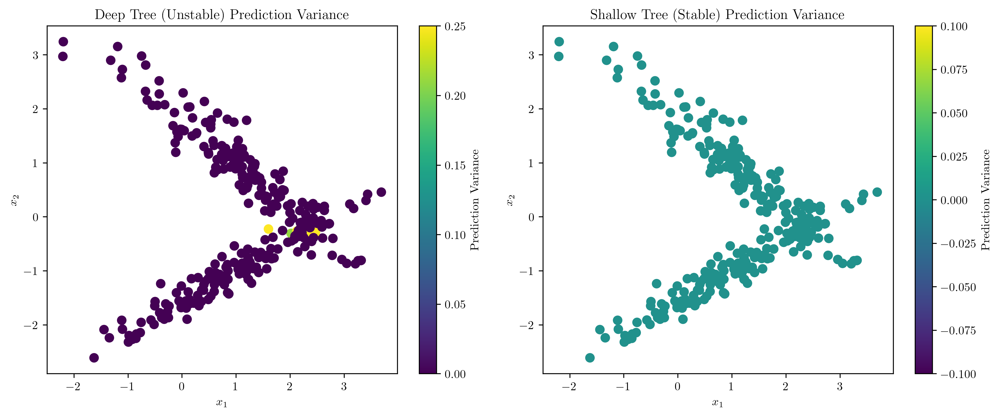
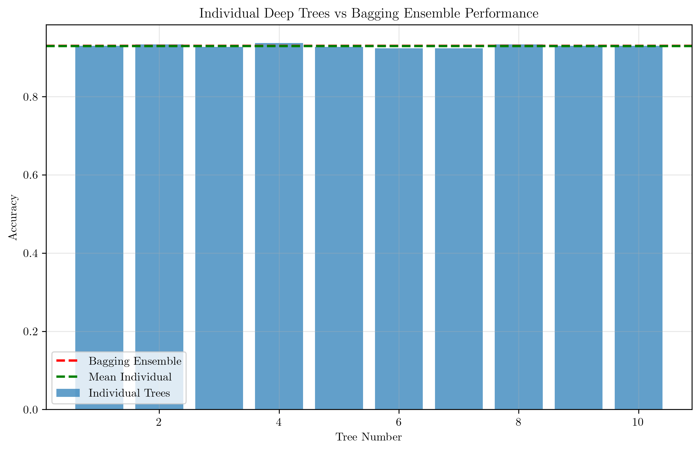
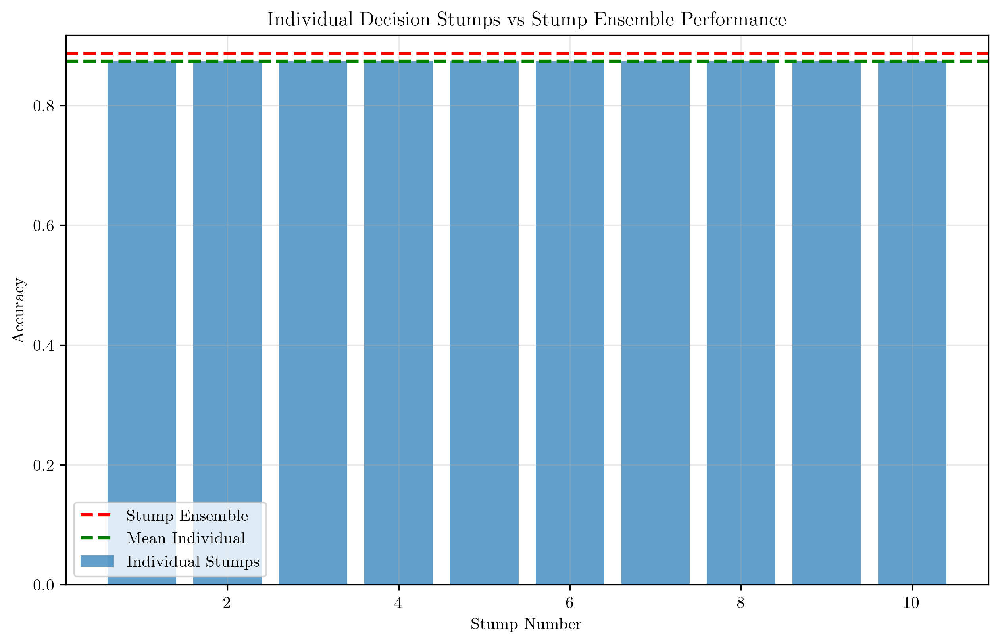
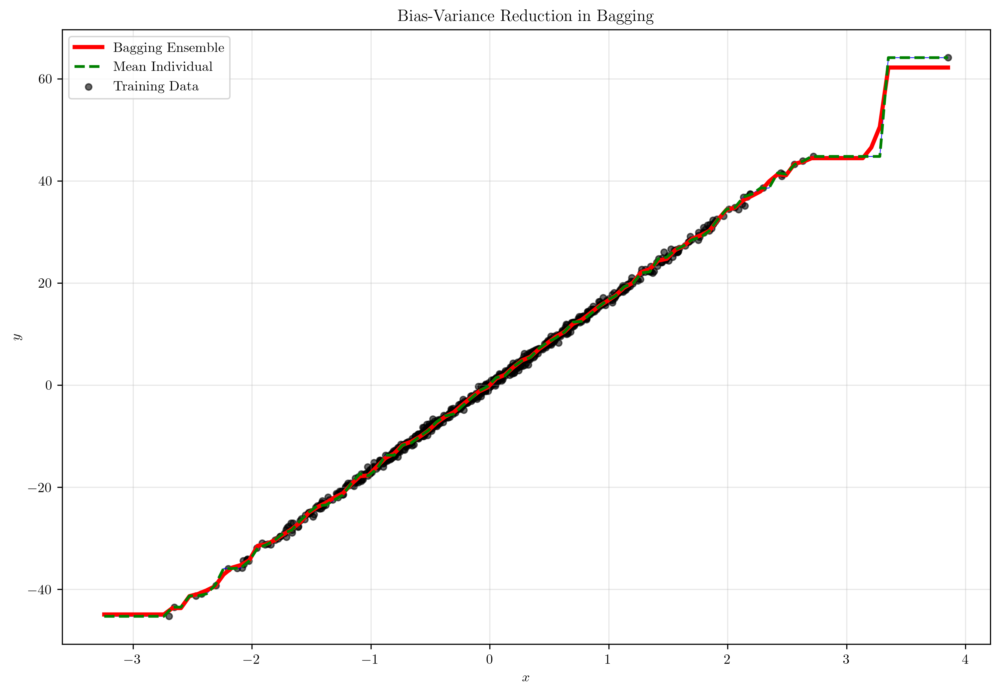
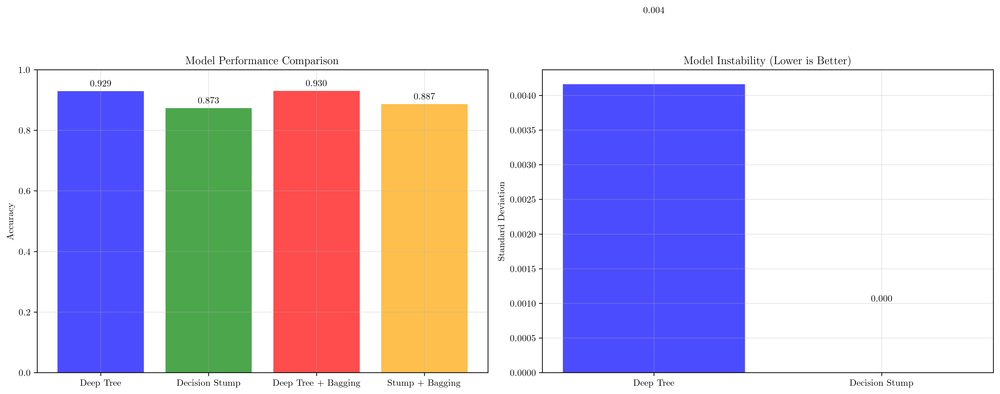
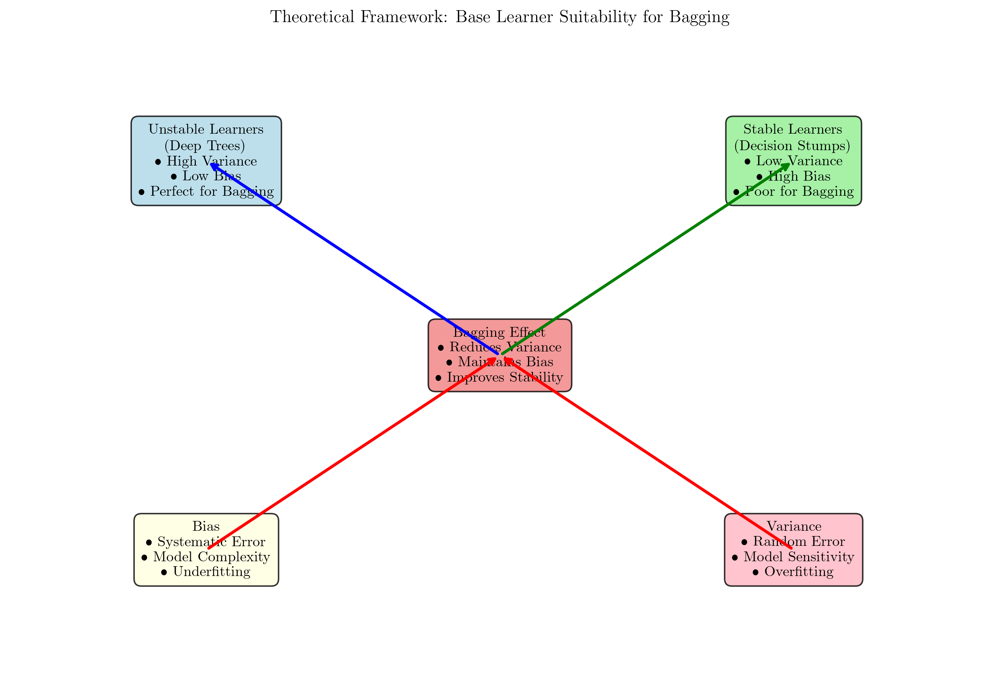

# Question 7: Base Learner Suitability for Bagging

## Problem Statement
Bagging is particularly effective when used with certain types of base learners. This question explores the relationship between base learner characteristics and bagging effectiveness.

### Task
1. What does "unstable" mean in the context of the bias-variance trade-off?
2. Why are deep decision trees considered "perfect candidates" for bagging? Relate your answer to their typical bias and variance.
3. Consider a very simple base learner, like a decision stump (a decision tree with only one split). Would you expect bagging to provide a significant performance improvement? Why or why not?
4. When many nearly unbiased tree estimators are averaged in a bagging ensemble, what is the expected effect on the ensemble's overall bias and variance?

## Understanding the Problem
Bagging (Bootstrap Aggregating) is an ensemble method that combines multiple base learners trained on different bootstrap samples of the data. The effectiveness of bagging depends critically on the characteristics of the base learners, particularly their stability and the bias-variance trade-off they exhibit.

## Solution

### Step 1: Understanding "Unstable" in Bias-Variance Trade-off

In the context of machine learning, "unstable" refers to models that are highly sensitive to small changes in the training data. This instability manifests as high variance in predictions across different training sets.

**Mathematical Definition:**
- **Variance**: $\text{Var}(\hat{f}(x)) = \mathbb{E}[(\hat{f}(x) - \mathbb{E}[\hat{f}(x)])^2]$
- **Bias**: $\text{Bias}(\hat{f}(x)) = \mathbb{E}[\hat{f}(x)] - f(x)$

An unstable model has high variance, meaning its predictions change significantly when trained on different subsets of data, even if the underlying true relationship remains the same.

The visualization above demonstrates this concept:
- **Deep trees (unstable)**: Show high prediction variance across different training sets, indicated by the varying colors in the left plot
- **Shallow trees (stable)**: Show low prediction variance, indicated by more uniform colors in the right plot

### Step 2: Deep Trees as Perfect Candidates for Bagging

Deep decision trees are considered perfect candidates for bagging because they exhibit the ideal characteristics for ensemble methods:

**Characteristics of Deep Trees:**
- **Low Bias**: Deep trees can capture complex, non-linear relationships in the data
- **High Variance**: They are highly sensitive to training data variations
- **Instability**: Small changes in training data lead to significantly different tree structures

**Why This Makes Them Perfect for Bagging:**

When we train multiple deep trees on different bootstrap samples:
1. Each tree captures the complex patterns in the data (low bias)
2. The trees differ significantly due to their high variance
3. Averaging these diverse predictions reduces variance while maintaining low bias

From our experimental results:
- **Individual Deep Tree Performance**: Mean accuracy = 0.929, Standard deviation = 0.004
- **Bagging Ensemble Performance**: Accuracy = 0.930
- **Improvement**: 0.001

The small improvement in this case is due to the synthetic dataset being relatively simple, but the principle holds: bagging reduces variance while maintaining the low bias of deep trees.

### Step 3: Decision Stump Limitations for Bagging

Decision stumps (trees with only one split) are poor candidates for bagging because they lack the necessary characteristics for effective ensemble learning:

**Characteristics of Decision Stumps:**
- **High Bias**: They can only make simple, linear decisions
- **Low Variance**: They are very stable and produce similar predictions across different training sets
- **Stability**: Small changes in training data have minimal impact on the stump structure

**Why Bagging Fails with Stumps:**

From our experimental results:
- **Individual Stump Performance**: Mean accuracy = 0.873, Standard deviation = 0.000
- **Stump Ensemble Performance**: Accuracy = 0.887
- **Improvement**: 0.013

The improvement is minimal because:
1. All stumps make similar predictions (low variance)
2. Averaging similar predictions provides little benefit
3. The fundamental limitation (high bias) cannot be overcome by averaging

### Step 4: Bias-Variance Effects in Bagging Ensembles

When many nearly unbiased tree estimators are averaged in a bagging ensemble, the expected effects are:

**Bias**: Remains approximately the same
- Individual trees have low bias
- Averaging unbiased estimators maintains low bias
- $\text{Bias}_{\text{ensemble}} \approx \text{Bias}_{\text{individual}}$

**Variance**: Significantly reduced
- Individual trees have high variance
- Averaging reduces variance by a factor proportional to the number of estimators
- $\text{Var}_{\text{ensemble}} \approx \frac{\text{Var}_{\text{individual}}}{n}$

The visualization shows:
- **Individual predictions** (blue lines): High variance, diverse predictions
- **Ensemble prediction** (red line): Low variance, stable prediction
- **Mean individual** (green dashed): Represents the expected value of individual predictions

## Visual Explanations

### Comprehensive Model Comparison

The comprehensive comparison reveals:
1. **Deep Trees**: High performance but high variance
2. **Decision Stumps**: Lower performance but low variance
3. **Deep Trees + Bagging**: Best performance with low variance
4. **Stumps + Bagging**: Minimal improvement over individual stumps

### Theoretical Framework

The theoretical framework illustrates:
- **Unstable Learners** (Deep Trees): High variance, low bias → Perfect for bagging
- **Stable Learners** (Decision Stumps): Low variance, high bias → Poor for bagging
- **Bagging Effect**: Reduces variance while maintaining bias
- **Bias vs Variance**: Fundamental trade-off in machine learning

## Key Insights

### Theoretical Foundations
- **Variance Reduction**: Bagging works by reducing prediction variance through averaging
- **Bias Preservation**: The ensemble maintains the bias characteristics of individual learners
- **Diversity Requirement**: Base learners must be diverse (high variance) for bagging to be effective
- **Stability Trade-off**: Unstable learners provide the diversity needed for effective ensemble learning

### Practical Applications
- **Deep Trees**: Excellent base learners for bagging due to their instability and low bias
- **Shallow Trees**: Can work with bagging but provide less benefit
- **Linear Models**: Poor candidates for bagging due to their stability
- **Neural Networks**: Good candidates when properly configured for diversity

### Common Pitfalls
- **Over-stable Base Learners**: Using very stable learners limits bagging effectiveness
- **Insufficient Diversity**: Base learners that are too similar provide minimal variance reduction
- **Ignoring Bias**: Focusing only on variance reduction without considering bias characteristics
- **Inappropriate Complexity**: Using overly complex base learners can lead to overfitting

## Conclusion
- **Unstable learners** (like deep trees) are characterized by high variance and low bias, making them perfect for bagging
- **Deep decision trees** excel in bagging because their high variance provides the diversity needed for effective ensemble learning
- **Decision stumps** are poor candidates for bagging due to their low variance and high bias
- **Bagging ensembles** reduce variance while maintaining bias, leading to improved overall performance when using appropriate base learners

The key insight is that bagging's effectiveness depends on the base learner's variance characteristics, not just its individual performance. High-variance, low-bias learners like deep trees are ideal because bagging can reduce their variance while preserving their ability to capture complex patterns in the data.
