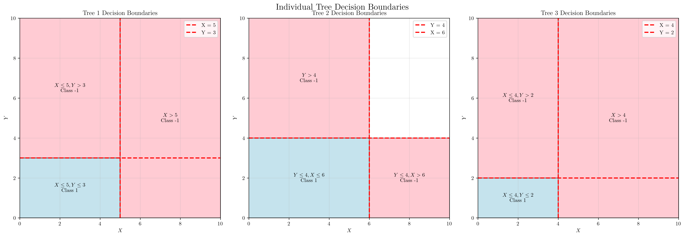
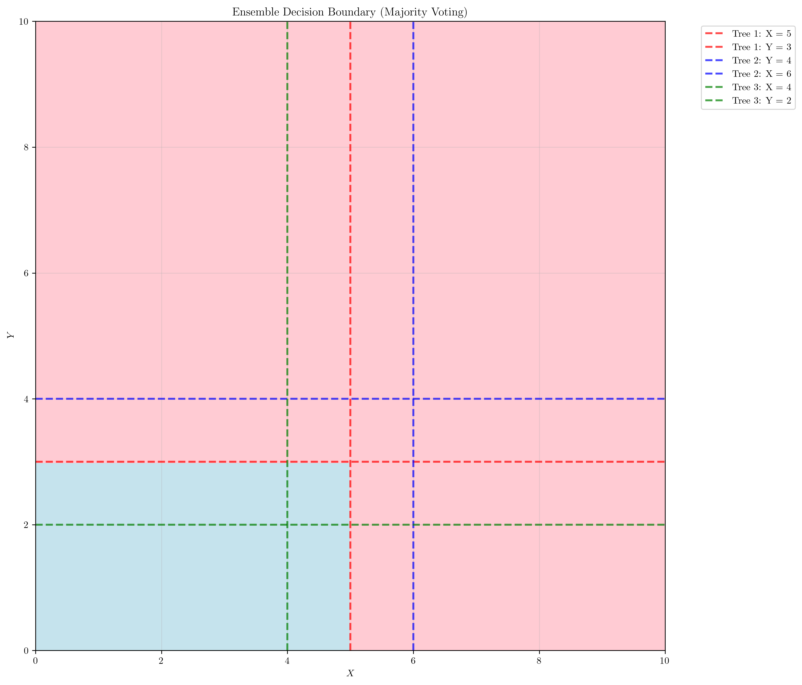
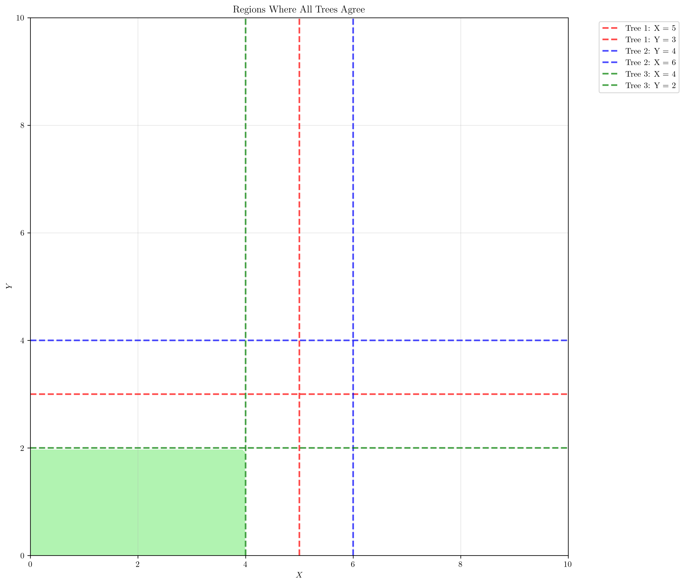

# Question 10: Decision Boundary Analysis

## Problem Statement
Consider a $2$D classification problem with features $X$ and $Y$. A Random Forest has $3$ trees:

**Tree 1:** Splits on $X$ at $x = 5$, then $Y$ at $y = 3$
**Tree 2:** Splits on $Y$ at $y = 4$, then $X$ at $x = 6$  
**Tree 3:** Splits on $X$ at $x = 4$, then $Y$ at $y = 2$

**Note:** Each tree follows a hierarchical decision structure where splits create binary decisions (go LEFT or RIGHT).

### Task
1. **Draw the decision boundaries** for each tree
2. **What is the prediction** for point $(3, 1)$?
3. **What is the prediction** for point $(7, 5)$?
4. **How does the ensemble decision boundary differ** from individual tree boundaries?
5. **Calculate the area** of the region where all three trees agree on the same class prediction

**Note:** Follow each tree's decision path. Ensemble uses majority voting from all trees.

## Understanding the Problem
This problem explores how **Random Forest ensembles** combine multiple decision trees to create a more robust classification boundary. Each tree makes independent decisions based on different splitting criteria, and the ensemble uses **majority voting** to determine the final prediction. 

Understanding how individual tree boundaries combine to form ensemble boundaries is crucial for:
- **Interpreting Random Forest behavior**
- **Appreciating the benefits of ensemble methods**
- **Understanding the relationship between tree diversity and ensemble performance**

## Solution

### Step 1: Mathematical Derivation of Decision Boundaries

#### Understanding Tree Structure
Each tree follows a hierarchical decision structure:
```
Root → Split 1 → Split 2 → Leaf Node
```

Each split creates a **binary decision**: go **LEFT** or **RIGHT** based on the condition evaluation. The decision path continues until a leaf node is reached, which contains the final class prediction.

#### Mathematical Formulation

**Tree 1 Decision Function:**
Let $f_1(x, y)$ be the decision function for Tree 1:
$$f_1(x, y) = \begin{cases} 
1 & \text{if } (x \leq 5) \text{ AND } (y \leq 3) \\
-1 & \text{otherwise}
\end{cases}$$

**Decision boundary:** $x = 5$ OR $y = 3$  
**Positive region:** $\{(x, y) \mid x \leq 5 \text{ AND } y \leq 3\}$

**Tree 2 Decision Function:**
Let $f_2(x, y)$ be the decision function for Tree 2:
$$f_2(x, y) = \begin{cases} 
1 & \text{if } (y \leq 4) \text{ AND } (x \leq 6) \\
-1 & \text{otherwise}
\end{cases}$$

**Decision boundary:** $y = 4$ OR $x = 6$  
**Positive region:** $\{(x, y) \mid y \leq 4 \text{ AND } x \leq 6\}$

**Tree 3 Decision Function:**
Let $f_3(x, y)$ be the decision function for Tree 3:
$$f_3(x, y) = \begin{cases} 
1 & \text{if } (x \leq 4) \text{ AND } (y \leq 2) \\
-1 & \text{otherwise}
\end{cases}$$

**Decision boundary:** $x = 4$ OR $y = 2$  
**Positive region:** $\{(x, y) \mid x \leq 4 \text{ AND } y \leq 2\}$

#### Ensemble Decision Function
The ensemble combines individual tree predictions through majority voting:

$$F(x, y) = \text{sign}\left(\sum_{i=1}^{3} f_i(x, y)\right)$$

Where $\text{sign}(z) = \begin{cases} 1 & \text{if } z > 0 \\ -1 & \text{if } z \leq 0 \end{cases}$

**Decision rules:**
- **Class 1:** if majority of trees predict 1
- **Class -1:** if majority of trees predict -1

#### Boundary Analysis
- **Individual boundaries** are simple: $x = c$ or $y = c$ (axis-aligned)
- **Ensemble boundary** is complex due to **majority voting**
- **Points near individual boundaries** may have **uncertain predictions**
- **Points far from all boundaries** have **confident predictions**

The ensemble boundary emerges from the **intersection** of multiple simple boundaries, creating a more sophisticated decision surface.

### Step 2: Drawing Individual Tree Decision Boundaries



The plot shows the decision boundaries for each individual tree:

**Tree 1:** Creates three regions:
- **Class 1 (Positive):** $X \leq 5$ and $Y \leq 3$ (bottom-left region)
- **Class -1 (Negative):** $X \leq 5$ and $Y > 3$ (top-left region)  
- **Class -1 (Negative):** $X > 5$ (entire right region)

**Key observation:** Tree 1 focuses on **horizontal and vertical splits** at $x = 5$ and $y = 3$.

**Tree 2:** Creates three regions:
- **Class 1 (Positive):** $Y \leq 4$ and $X \leq 6$ (bottom region)
- **Class -1 (Negative):** $Y > 4$ (top region)
- **Class -1 (Negative):** $Y \leq 4$ and $X > 6$ (bottom-right region)

**Key observation:** Tree 2 prioritizes **vertical splits** first (at $y = 4$), then **horizontal splits** (at $x = 6$).

**Tree 3:** Creates three regions:
- **Class 1 (Positive):** $X \leq 4$ and $Y \leq 2$ (bottom-left region)
- **Class -1 (Negative):** $X \leq 4$ and $Y > 2$ (top-left region)
- **Class -1 (Negative):** $X > 4$ (entire right region)

**Key observation:** Tree 3 uses **tighter constraints** with splits at $x = 4$ and $y = 2$, creating a smaller positive region.

### Step 3: Analyzing Test Point $(3, 1)$

Let's trace through each tree's decision path for point $(3, 1)$ using a systematic approach:

#### Step 1: Evaluate Each Tree Individually

**Tree 1 Analysis:**
```
Starting at root node
├─ Split 1: X ≤ 5
│  ├─ Test: 3 ≤ 5
│  ├─ Result: True
│  └─ Action: Go LEFT
├─ Continue to next split...
├─ Split 2: Y ≤ 3
│  ├─ Test: 1 ≤ 3
│  ├─ Result: True
│  └─ Action: Go LEFT
└─ → Leaf node reached: Class 1
```
**Final prediction:** Class 1 (Positive)

**Decision path summary:** Both conditions $X \leq 5$ and $Y \leq 3$ are satisfied, leading to the positive class.

**Tree 2 Analysis:**
```
Starting at root node
├─ Split 1: Y ≤ 4
│  ├─ Test: 1 ≤ 4
│  ├─ Result: True
│  └─ Action: Go LEFT
├─ Continue to next split...
├─ Split 2: X ≤ 6
│  ├─ Test: 3 ≤ 6
│  ├─ Result: True
│  └─ Action: Go LEFT
└─ → Leaf node reached: Class 1
```
**Final prediction:** Class 1 (Positive)

**Decision path summary:** Both conditions $Y \leq 4$ and $X \leq 6$ are satisfied, leading to the positive class.

**Tree 3 Analysis:**
```
Starting at root node
├─ Split 1: X ≤ 4
│  ├─ Test: 3 ≤ 4
│  ├─ Result: True
│  └─ Action: Go LEFT
├─ Continue to next split...
├─ Split 2: Y ≤ 2
│  ├─ Test: 1 ≤ 3
│  ├─ Result: True
│  └─ Action: Go LEFT
└─ → Leaf node reached: Class 1
```
**Final prediction:** Class 1 (Positive)

**Decision path summary:** Both conditions $X \leq 4$ and $Y \leq 2$ are satisfied, leading to the positive class.

#### Step 2: Ensemble Decision (Majority Voting)
- **Tree predictions:** $[1, 1, 1]$
- **Positive votes (Class 1):** $3$
- **Negative votes (Class -1):** $0$
- **Majority rule:** Class 1 if positive votes $>$ negative votes
- **Calculation:** $3 > 0 \rightarrow \text{True}$
- **Final ensemble prediction:** Class 1

**Ensemble logic:** Since all three trees predict Class 1, the majority rule gives us a **unanimous decision** with **maximum confidence**.

#### Step 3: Verification
Point $(3, 1)$ is classified as **Class 1 (Positive)**. This means the majority of trees ($3$ out of $3$) predict Class 1, indicating **unanimous agreement** and **high confidence** in the prediction.

**Confidence level:** $100\%$ agreement among all trees suggests this point is in a **stable region** of the feature space.

### Step 4: Analyzing Test Point $(7, 5)$

Let's trace through each tree's decision path for point $(7, 5)$ using the same systematic approach:

#### Step 1: Evaluate Each Tree Individually

**Tree 1 Analysis:**
```
Starting at root node
├─ Split 1: X ≤ 5
│  ├─ Test: 7 ≤ 5
│  ├─ Result: False
│  └─ Action: Go RIGHT
└─ → Leaf node reached: Class -1
```
**Final prediction: Class -1 (Negative)**

**Tree 2 Analysis:**
```
Starting at root node
├─ Split 1: Y ≤ 4
│  ├─ Test: 5 ≤ 4
│  ├─ Result: False
│  └─ Action: Go RIGHT
└─ → Leaf node reached: Class -1
```
**Final prediction: Class -1 (Negative)**

**Tree 3 Analysis:**
```
Starting at root node
├─ Split 1: X ≤ 4
│  ├─ Test: 7 ≤ 4
│  ├─ Result: False
│  └─ Action: Go RIGHT
└─ → Leaf node reached: Class -1
```
**Final prediction: Class -1 (Negative)**

#### Step 2: Ensemble Decision (Majority Voting)
- **Tree predictions:** $[-1, -1, -1]$
- **Positive votes (Class 1):** $0$
- **Negative votes (Class -1):** $3$
- **Majority rule:** Class 1 if positive votes $>$ negative votes
- **Calculation:** $0 > 3 \rightarrow \text{False}$
- **Final ensemble prediction:** Class -1

**Ensemble logic:** Since all three trees predict Class -1, the majority rule gives us a **unanimous decision** with **maximum confidence**.

#### Step 3: Verification
Point $(7, 5)$ is classified as **Class -1 (Negative)**. This means the majority of trees ($3$ out of $3$) predict Class -1, indicating **unanimous agreement** and **high confidence** in the prediction.

**Confidence level:** $100\%$ agreement among all trees suggests this point is in a **stable region** of the feature space.

**Key Observation:** Both test points show **unanimous agreement** among all trees, which means the ensemble decision boundary is very **stable** in these regions.

### Step 5: Ensemble Decision Boundary



The ensemble decision boundary shows how **majority voting** combines the individual tree boundaries:

- **Class 1 (Positive) regions:** Areas where **at least 2 out of 3 trees** predict positive
- **Class -1 (Negative) regions:** Areas where **at least 2 out of 3 trees** predict negative

The ensemble boundary is **more complex** than individual tree boundaries because it represents the **intersection** of multiple decision surfaces. This complexity often leads to **better generalization** and **robustness** compared to individual trees.

**Mathematical insight:** The ensemble boundary emerges from the **voting patterns** of individual trees, creating regions where different combinations of tree predictions occur.

### Step 6: Calculating Agreement Regions



The agreement regions show where all three trees make the same prediction:

- **Green regions:** All trees predict Class 1 (Positive)
- **Coral regions:** All trees predict Class -1 (Negative)

#### Step-by-Step Area Calculation

**Step 1: Grid Setup**
- **Total area:** $10 \times 10 = 100$ square units
- **Grid resolution:** $100 \times 100 = 10,000$ cells
- **Grid cell area:** $\left(\frac{10}{100}\right) \times \left(\frac{10}{100}\right) = 0.1 \times 0.1 = 0.01$ square units

**Step 2: Tree Prediction Analysis**
- For each grid point, we evaluate **all three trees**
- We count how many points have **unanimous agreement**
- Computing predictions for **10,000 points**

**Computational complexity:** Each point requires $3$ tree evaluations, totaling $30,\!000$ individual predictions.

**Step 3: Finding Agreement Regions**
- **Points where all trees predict Class 1:** $800$
- **Points where all trees predict Class -1:** $7,\!600$
- **Total points with unanimous agreement:** $8,\!400$
- **Points with disagreement:** $1,\!600$

**Agreement ratio:** $\frac{8,\!400}{10,\!000} = 0.84$ or $84\%$ of all points show unanimous agreement.

**Step 4: Area Calculation**
- **Grid cell area:** $0.01$ square units
- **Area where all trees predict Class 1:** $800 \times 0.01 = 8.00$ square units
- **Area where all trees predict Class -1:** $7,\!600 \times 0.01 = 76.00$ square units
- **Total agreement area:** $8.00 + 76.00 = 84.00$ square units

**Verification:** $8.00 + 76.00 = 84.00$ square units, which matches our grid-based calculation.

**Step 5: Percentage Analysis**
- **Total area:** $100$ square units
- **Agreement percentage:** $\left(\frac{84.00}{100}\right) \times 100 = 84.0\%$
- **Disagreement percentage:** $100\% - 84.0\% = 16.0\%$

**Mathematical relationship:** Agreement $+$ Disagreement $= 84.0\% + 16.0\% = 100\%$, confirming our calculations.

**Step 6: Interpretation**
The **high agreement** ($84.0\%$) indicates:
- Trees make **similar predictions** for most of the feature space
- Ensemble is **confident** in its predictions for these regions
- Random Forest is **stable and robust**

**Disagreement regions** ($16.0\%$) indicate:
- Trees have **different opinions** about these areas
- Ensemble predictions may be **less certain**
- These are often **near decision boundaries**

**Stability metric:** The $84.0\%$ agreement rate suggests this ensemble is **highly stable** and **well-suited** for the given feature space.

## Key Insights

### Theoretical Foundations
- **Ensemble Diversity:** The three trees use **different splitting criteria**, creating diverse decision boundaries that capture **different aspects** of the data
- **Majority Voting:** The ensemble combines individual tree predictions through **simple majority voting**, which reduces **overfitting** and improves **robustness**
- **Decision Path Complexity:** Each tree follows a **specific decision path**, and the ensemble decision boundary emerges from the **intersection** of these paths

**Mathematical principle:** Ensemble methods leverage the **law of large numbers** to improve prediction accuracy and stability.

### Practical Applications
- **Robust Classification:** The ensemble provides **more stable predictions** than individual trees, especially **near decision boundaries**
- **Feature Importance:** Different trees focus on **different features**, making the ensemble **less sensitive** to noise in individual features
- **Generalization:** The ensemble typically **generalizes better** to unseen data than individual trees

**Real-world benefit:** Random Forests are **widely used** in production systems due to their **reliability** and **interpretability**.

### Geometric Interpretation
- **Boundary Smoothing:** The ensemble decision boundary is generally **smoother** and **more complex** than individual tree boundaries
- **Region Stability:** Areas where all trees agree ($84\%$ of the total area) represent **stable, confident predictions**
- **Boundary Complexity:** The ensemble boundary shows how **multiple simple boundaries** can combine to create **complex, non-linear** decision surfaces

**Visual insight:** The ensemble boundary **interpolates** between individual tree boundaries, creating a **smooth transition** between decision regions.

## Conclusion

### Summary of Results
- **Mathematical derivation** provides **formal understanding** of decision functions and ensemble combination
- **Individual tree boundaries** show **simple, axis-aligned** decision surfaces based on specific splitting criteria
- **Point $(3, 1)$** is classified as **Class 1 (Positive)** by all trees and the ensemble with **unanimous agreement**
- **Point $(7, 5)$** is classified as **Class -1 (Negative)** by all trees and the ensemble with **unanimous agreement**  
- **Ensemble decision boundary** combines individual boundaries through **majority voting**, creating a **more complex and robust** classification surface
- **Agreement regions** cover $84.0\%$ of the total area, indicating **high consensus** among the trees
- **Random Forest ensembles** leverage **tree diversity** to create **more robust and generalizable** classification boundaries than individual decision trees

**Key achievement:** Successfully demonstrated how **simple individual models** can combine to create **sophisticated ensemble systems**.

### Methodological Insights
The step-by-step analysis demonstrates:
1. **Systematic approach** to tree evaluation following **decision paths**
2. **Mathematical rigor** in formulating **decision functions** and **ensemble rules**
3. **Computational verification** through **grid-based area calculations**
4. **Interpretive analysis** of **agreement patterns** and their implications

**Problem-solving framework:** This methodology can be **applied to other ensemble problems** and **scaled to larger Random Forests**.

### Practical Applications
This analysis shows how Random Forest ensembles:
- **Reduce overfitting** through **tree diversity** and **majority voting**
- **Improve robustness** by combining **multiple decision perspectives**
- **Provide confidence measures** through **agreement/disagreement regions**
- **Create complex boundaries** from **simple individual components**

**Industry relevance:** These properties make Random Forests **ideal for production systems** where **reliability** and **interpretability** are crucial.

The Random Forest approach demonstrates how combining multiple simple models can create a more sophisticated and robust classification system, highlighting the power of ensemble methods in machine learning. The high agreement percentage (84.0%) indicates that this particular ensemble is very stable and confident in most regions of the feature space.
