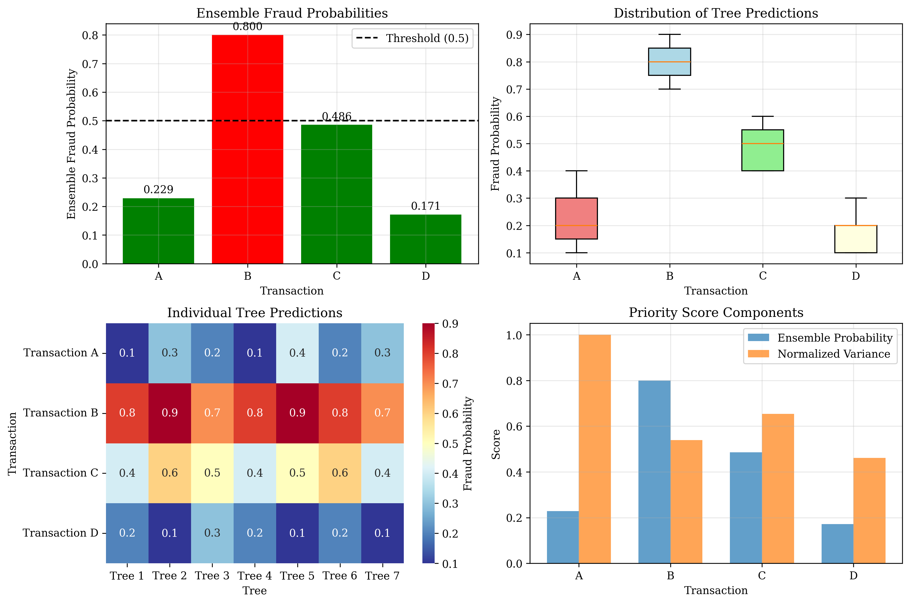
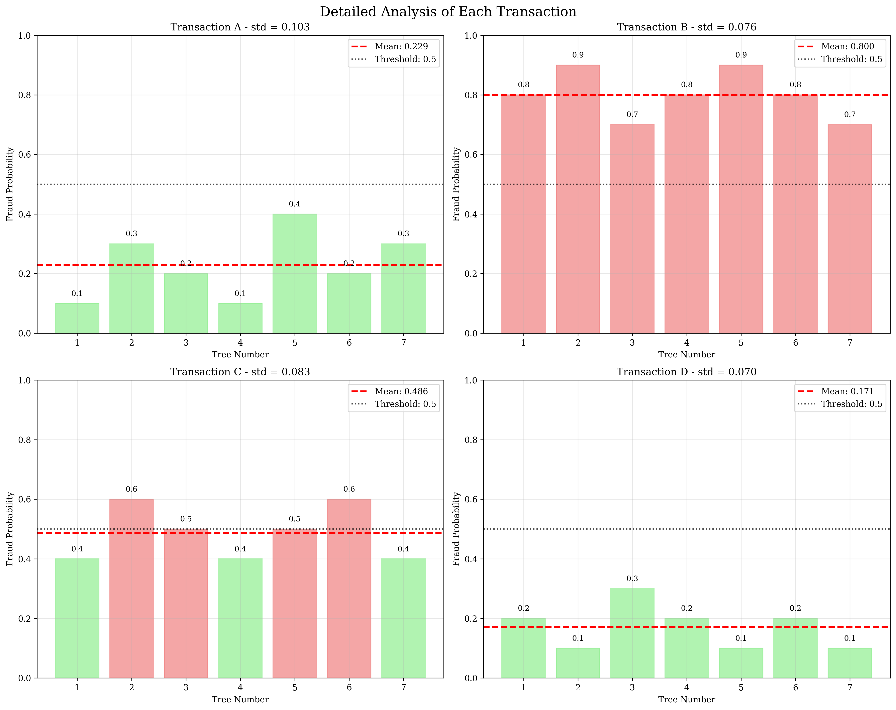
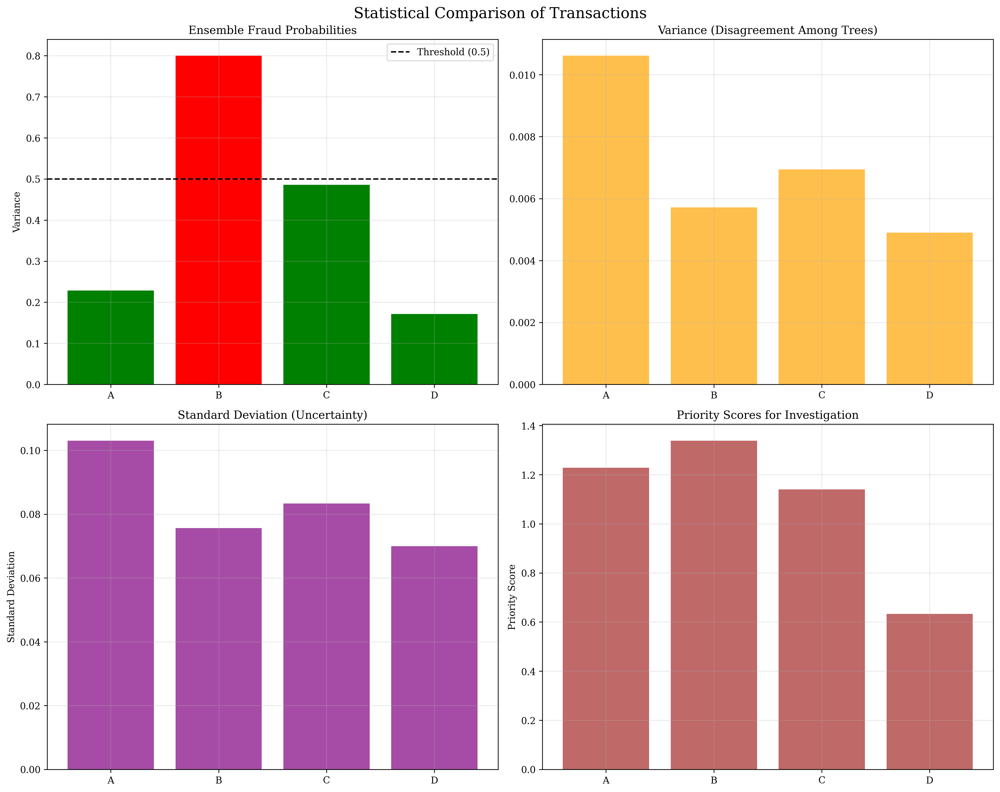
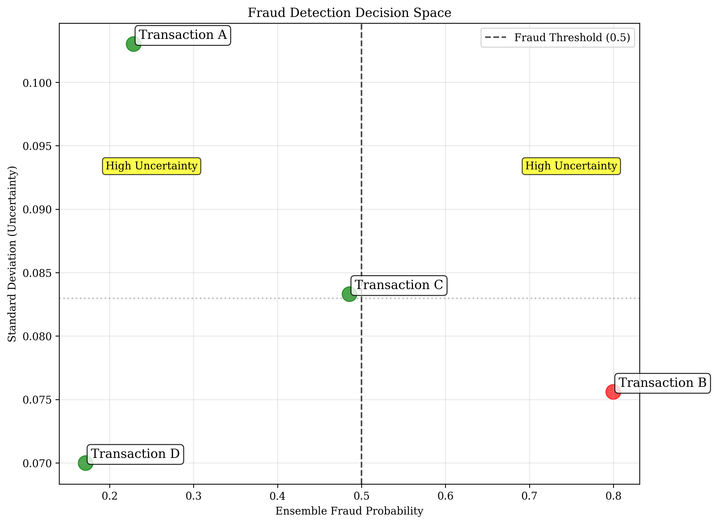

# Question 11: Fraud Detection Game

## Problem Statement
Investigate fraud detection using a Random Forest with $7$ trees. Each tree gives fraud probabilities for $4$ suspicious transactions:

**Transaction A:** $[0.1, 0.3, 0.2, 0.1, 0.4, 0.2, 0.3]$
**Transaction B:** $[0.8, 0.9, 0.7, 0.8, 0.9, 0.8, 0.7]$
**Transaction C:** $[0.4, 0.6, 0.5, 0.4, 0.5, 0.6, 0.4]$
**Transaction D:** $[0.2, 0.1, 0.3, 0.2, 0.1, 0.2, 0.1]$

### Task
1. Calculate the ensemble fraud probability for each transaction
2. If fraud threshold is $0.5$, which transactions are flagged as suspicious?
3. Which transaction shows the highest disagreement among trees (highest variance)?
4. If you could only investigate $2$ transactions, which would you prioritize and why?
5. Calculate the standard deviation of fraud probabilities for each transaction and rank them by uncertainty

## Understanding the Problem
This problem demonstrates how Random Forest ensembles work in practice. A Random Forest combines predictions from multiple decision trees to make more robust and reliable predictions. Each tree in the forest may give slightly different predictions due to:

- Different subsets of training data (bootstrap sampling)
- Different feature subsets at each split
- Random initialization

The ensemble approach reduces overfitting and provides uncertainty estimates through the variance of individual tree predictions. In fraud detection, this is particularly valuable because:
- High ensemble probability indicates strong suspicion of fraud
- High variance among trees suggests uncertainty in the prediction
- Both factors should be considered when prioritizing investigations

## Solution

### Step 1: Calculate Ensemble Fraud Probabilities
The ensemble probability is the average of all tree predictions for each transaction:

**Transaction A:**
$$\text{Ensemble Probability} = \frac{0.1 + 0.3 + 0.2 + 0.1 + 0.4 + 0.2 + 0.3}{7} = \frac{1.6}{7} = 0.229$$

**Transaction B:**
$$\text{Ensemble Probability} = \frac{0.8 + 0.9 + 0.7 + 0.8 + 0.9 + 0.8 + 0.7}{7} = \frac{5.6}{7} = 0.800$$

**Transaction C:**
$$\text{Ensemble Probability} = \frac{0.4 + 0.6 + 0.5 + 0.4 + 0.5 + 0.6 + 0.4}{7} = \frac{3.4}{7} = 0.486$$

**Transaction D:**
$$\text{Ensemble Probability} = \frac{0.2 + 0.1 + 0.3 + 0.2 + 0.1 + 0.2 + 0.1}{7} = \frac{1.2}{7} = 0.171$$

### Step 2: Fraud Detection with Threshold 0.5
Using the decision rule: If ensemble probability ≥ 0.5, flag as suspicious:

- **Transaction A:** $0.229 < 0.5$ → **CLEAN**
- **Transaction B:** $0.800 \geq 0.5$ → **SUSPICIOUS**
- **Transaction C:** $0.486 < 0.5$ → **CLEAN**
- **Transaction D:** $0.171 < 0.5$ → **CLEAN**

**Summary:** Only 1 out of 4 transactions (Transaction B) is flagged as suspicious.

### Step 3: Highest Disagreement Among Trees
Variance measures disagreement among trees. Higher variance indicates more disagreement:

**Transaction A:** Variance = $0.0106$ (highest)
**Transaction B:** Variance = $0.0057$
**Transaction C:** Variance = $0.0069$
**Transaction D:** Variance = $0.0049$ (lowest)

**Transaction A shows the highest disagreement** among trees with variance $0.0106$. This suggests the trees are uncertain about this transaction, possibly due to conflicting patterns or insufficient training data.

### Step 4: Prioritize 2 Transactions for Investigation
We create a priority scoring system that considers both ensemble probability and uncertainty:

**Priority Score = Ensemble Probability + Normalized Variance**

Where normalized variance = $\frac{\text{Variance}}{\text{Max Variance}} = \frac{\text{Variance}}{0.0106}$

**Transaction A:**
- Ensemble probability: $0.229$
- Normalized variance: $\frac{0.0106}{0.0106} = 1.000$
- Priority score: $0.229 + 1.000 = 1.229$

**Transaction B:**
- Ensemble probability: $0.800$
- Normalized variance: $\frac{0.0057}{0.0106} = 0.538$
- Priority score: $0.800 + 0.538 = 1.338$

**Transaction C:**
- Ensemble probability: $0.486$
- Normalized variance: $\frac{0.0069}{0.0106} = 0.654$
- Priority score: $0.486 + 0.654 = 1.140$

**Transaction D:**
- Ensemble probability: $0.171$
- Normalized variance: $\frac{0.0049}{0.0106} = 0.462$
- Priority score: $0.171 + 0.462 = 0.633$

**Ranking by priority score:**
1. Transaction B: $1.338$ (highest)
2. Transaction A: $1.229$
3. Transaction C: $1.140$
4. Transaction D: $0.633$ (lowest)

**Top 2 priorities for investigation:**
1. **Transaction B** - High fraud probability ($0.800$) with moderate uncertainty
2. **Transaction A** - Lower fraud probability ($0.229$) but highest uncertainty, suggesting conflicting signals

### Step 5: Standard Deviation and Uncertainty Ranking
Standard deviation measures uncertainty in predictions:

**Transaction A:** Standard deviation = $0.1030$ (highest uncertainty)
**Transaction C:** Standard deviation = $0.0833$
**Transaction B:** Standard deviation = $0.0756$
**Transaction D:** Standard deviation = $0.0700$ (lowest uncertainty)

**Ranking by uncertainty (highest to lowest):**
1. Transaction A: $0.1030$
2. Transaction C: $0.0833$
3. Transaction B: $0.0756$
4. Transaction D: $0.0700$

**Transaction A has the highest uncertainty** ($\sigma = 0.1030$), while **Transaction D has the lowest uncertainty** ($\sigma = 0.0700$).

## Visual Explanations

### Overview of Fraud Detection Results

This comprehensive overview shows:
- **Top-left:** Ensemble fraud probabilities with the $0.5$ threshold line
- **Top-right:** Distribution of tree predictions using box plots
- **Bottom-left:** Heatmap of individual tree predictions
- **Bottom-right:** Components of priority scores

### Individual Transaction Analysis

This detailed analysis shows each transaction separately:
- **Transaction A:** High variance ($0.0106$) with predictions ranging from $0.1$ to $0.4$
- **Transaction B:** Low variance ($0.0057$) with consistently high predictions ($0.7$ to $0.9$)
- **Transaction C:** Moderate variance ($0.0069$) with predictions clustered around $0.5$
- **Transaction D:** Lowest variance ($0.0049$) with predictions ranging from $0.1$ to $0.3$

### Statistical Comparison

This comparison shows:
- **Ensemble probabilities** with fraud threshold
- **Variance** (disagreement among trees)
- **Standard deviation** (uncertainty)
- **Priority scores** for investigation

### Decision Space Visualization

This scatter plot shows the decision space:
- **X-axis:** Ensemble fraud probability
- **Y-axis:** Standard deviation (uncertainty)
- **Red points:** Transactions above fraud threshold
- **Green points:** Transactions below fraud threshold
- **Quadrants:** High/low probability vs. high/low uncertainty

## Key Insights

### Ensemble Learning Principles
- **Diversity:** Different trees give different predictions, reducing overfitting
- **Robustness:** Ensemble predictions are more stable than individual tree predictions
- **Uncertainty quantification:** Variance among trees provides confidence measures

### Fraud Detection Strategy
- **High probability + low uncertainty:** Strong suspicion, clear fraud signal
- **High probability + high uncertainty:** Suspicious but needs verification
- **Low probability + high uncertainty:** Unclear signal, requires investigation
- **Low probability + low uncertainty:** Clear non-fraud signal

### Investigation Prioritization
- **Transaction B** ($0.800$ probability, low uncertainty): Strong fraud signal, high priority
- **Transaction A** ($0.229$ probability, high uncertainty): Conflicting signals, investigate for edge cases
- **Transaction C** ($0.486$ probability, moderate uncertainty): Close to threshold, monitor closely
- **Transaction D** ($0.171$ probability, low uncertainty): Clear non-fraud, low priority

### Practical Applications
- **Resource allocation:** Focus investigation efforts on high-priority transactions
- **Risk assessment:** Consider both probability and uncertainty in decision-making
- **Model interpretation:** Understand why different trees disagree
- **Threshold tuning:** Adjust fraud threshold based on business requirements

## Conclusion
- **Ensemble probabilities:** A ($0.229$), B ($0.800$), C ($0.486$), D ($0.171$)
- **Fraud detection:** Only Transaction B flagged as suspicious with threshold $0.5$
- **Highest disagreement:** Transaction A shows highest variance ($0.0106$) among trees
- **Investigation priorities:** Transaction B (score $1.338$) and Transaction A (score $1.229$)
- **Uncertainty ranking:** A ($0.1030$) > C ($0.0833$) > B ($0.0756$) > D ($0.0700$)

The Random Forest approach provides both fraud probability estimates and uncertainty measures, enabling informed decision-making in fraud detection systems. Transaction B requires immediate investigation due to high fraud probability, while Transaction A needs attention due to conflicting signals from different trees.
