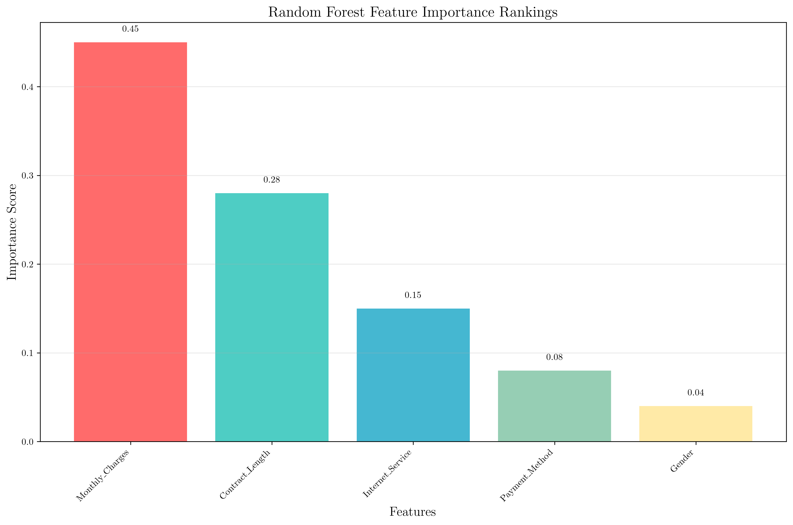
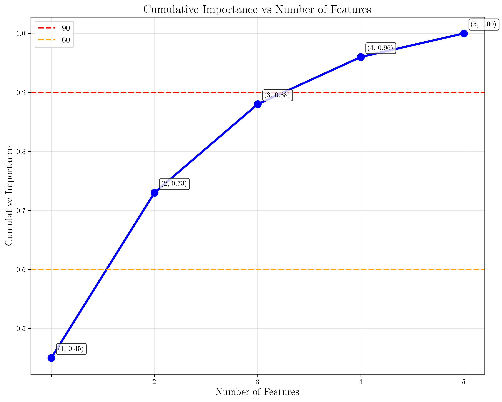
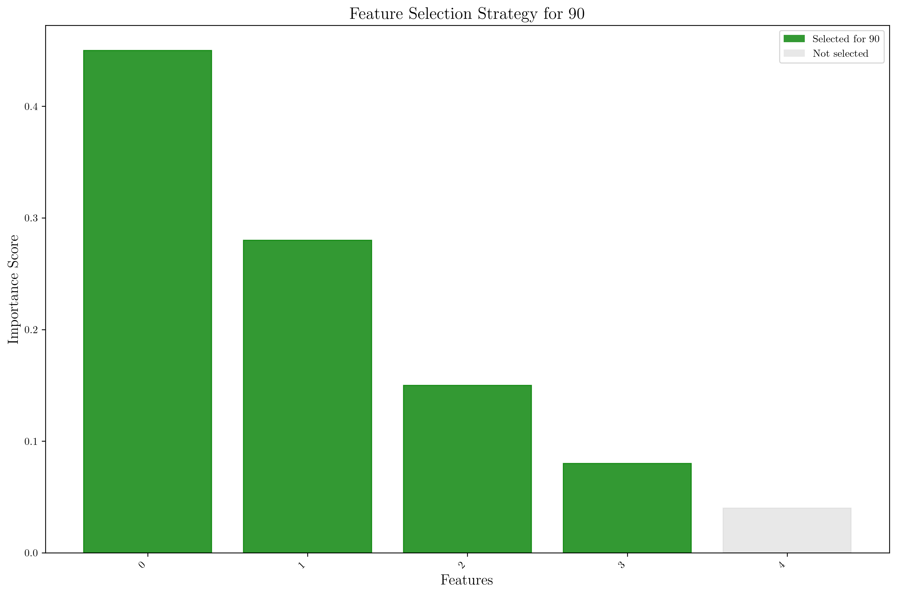
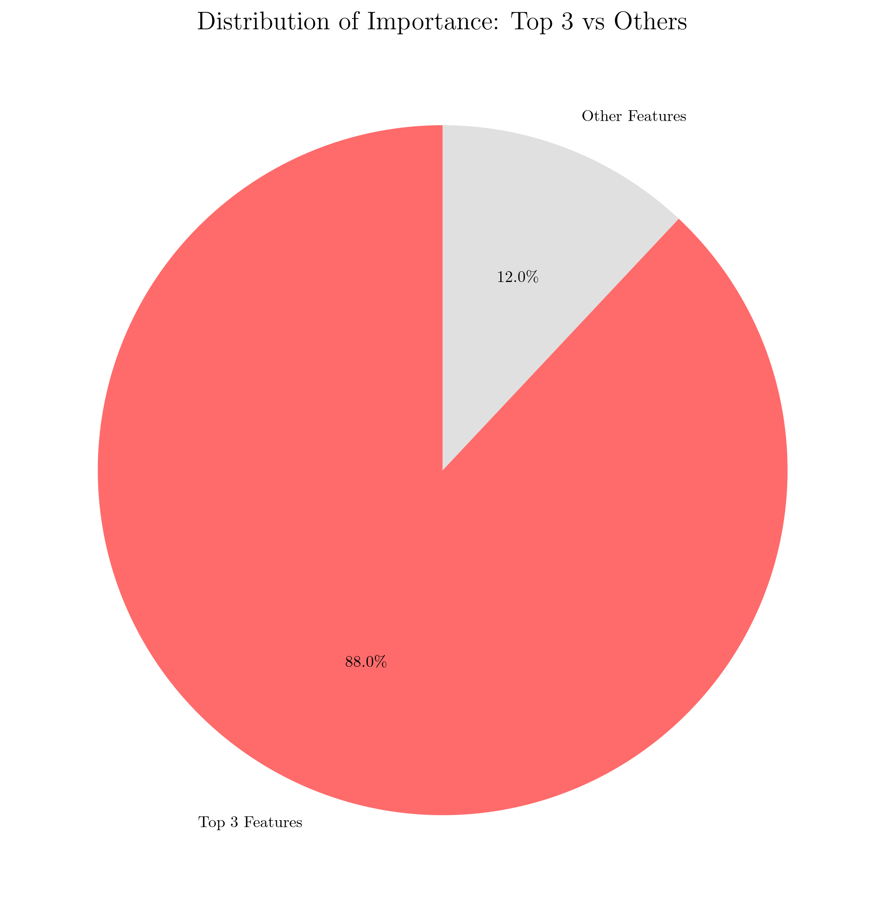
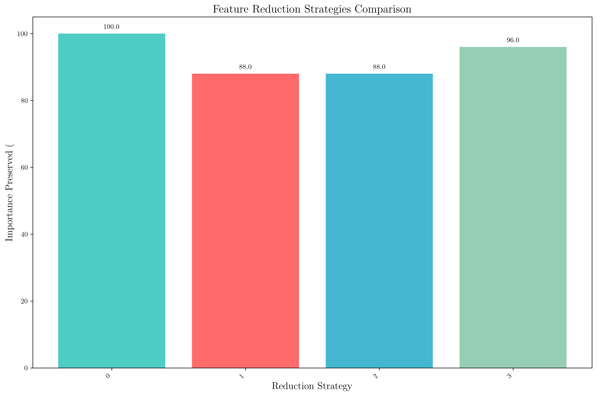
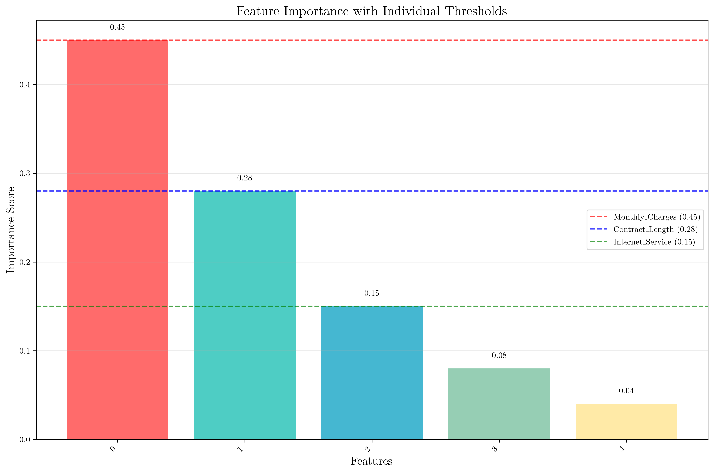

# Question 14: Feature Importance Treasure Hunt

## Problem Statement
Analyze customer churn data with Random Forest feature importance scores:

**Feature Importance Rankings:**
1. Monthly_Charges: $0.45$
2. Contract_Length: $0.28$
3. Internet_Service: $0.15$
4. Payment_Method: $0.08$
5. Gender: $0.04$

### Task
1. If you remove the bottom $40\%$ of features, which ones remain?
2. What percentage of total importance do the top $3$ features represent?
3. If you want to reduce features to $60\%$ of original, which features would you keep?
4. Design a feature selection strategy that preserves $90\%$ of importance while reducing features

## Understanding the Problem
Feature importance in Random Forest models indicates how much each feature contributes to the model's predictive performance. Higher importance scores suggest that a feature has a stronger influence on the model's decisions. This analysis is crucial for feature selection, dimensionality reduction, and understanding which factors most significantly impact customer churn.

The problem involves analyzing the trade-off between the number of features and the preservation of model performance, which is a fundamental concept in machine learning optimization.

## Solution

### Step 1: Remove Bottom 40% of Features

**Step 1.1: Calculate total number of features**
- Total features = $5$

**Step 1.2: Calculate bottom 40%**
- Bottom 40% = $5 \times 0.4 = 2.0$

**Step 1.3: Determine features to remove**
- Features to remove = $\text{int}(2.0) = 2$

**Step 1.4: Identify features to remove (bottom 2)**
- Feature 1: Payment_Method = $0.08$
- Feature 2: Gender = $0.04$

**Step 1.5: Features remaining after removing bottom 40%**
- Feature 1: Monthly_Charges = $0.45$
- Feature 2: Contract_Length = $0.28$
- Feature 3: Internet_Service = $0.15$

**Step 1.6: Calculate importance preserved**
- Remaining importance = $0.45 + 0.28 + 0.15 = 0.88$
- Importance preserved = $\frac{0.88}{1.00} \times 100 = 88.0\%$

**Result:** After removing the bottom $40\%$ of features, $3$ features remain, preserving $88.0\%$ of total importance.

### Step 2: Percentage of Total Importance for Top 3 Features

**Step 2.1: Identify top 3 features**
- Feature 1: Monthly_Charges = $0.45$
- Feature 2: Contract_Length = $0.28$
- Feature 3: Internet_Service = $0.15$

**Step 2.2: Calculate total importance of top 3 features**
- Top 3 importance = $0.45 + 0.28 + 0.15 = 0.88$

**Step 2.3: Calculate percentage of total importance**
- Percentage = $\frac{0.88}{1.00} \times 100 = 88.0\%$

**Result:** The top $3$ features represent $88.0\%$ of total importance.

### Step 3: Reduce Features to 60% of Original

**Step 3.1: Calculate target number of features**
- Target features = $\text{int}(5 \times 0.6) = \text{int}(3.0) = 3$

**Step 3.2: Select top 3 features**
- Feature 1: Monthly_Charges = $0.45$
- Feature 2: Contract_Length = $0.28$
- Feature 3: Internet_Service = $0.15$

**Step 3.3: Calculate importance of selected features**
- Selected importance = $0.88$

**Step 3.4: Calculate percentage of importance preserved**
- Importance preserved = $\frac{0.88}{1.00} \times 100 = 88.0\%$

**Result:** To reduce to $60\%$ of original features, select $3$ features, which preserves $88.0\%$ of importance.

### Step 4: Design Strategy to Preserve 90% of Importance

**Step 4.1: Calculate target importance to preserve**
- Target importance = $1.00 \times 0.9 = 0.90$

**Step 4.2: Find minimum number of features needed**
We need to add features one by one until we reach the target importance:

- Feature 1: Monthly_Charges = $0.45$
  - Cumulative importance = $0.45$
  - ✗ Target not reached yet. $0.45 < 0.90$

- Feature 2: Contract_Length = $0.28$
  - Cumulative importance = $0.45 + 0.28 = 0.73$
  - ✗ Target not reached yet. $0.73 < 0.90$

- Feature 3: Internet_Service = $0.15$
  - Cumulative importance = $0.73 + 0.15 = 0.88$
  - ✗ Target not reached yet. $0.88 < 0.90$

- Feature 4: Payment_Method = $0.08$
  - Cumulative importance = $0.88 + 0.08 = 0.96$
  - ✓ Target reached! $0.96 \geq 0.90$

**Step 4.3: Summary of strategy**
- Features needed: $4$
- Importance preserved: $0.96$

**Step 4.4: Calculate actual percentage preserved**
- Actual percentage = $\frac{0.96}{1.00} \times 100 = 96.0\%$

**Step 4.5: Selected features for 90% preservation**
- Feature 1: Monthly_Charges = $0.45$
- Feature 2: Contract_Length = $0.28$
- Feature 3: Internet_Service = $0.15$
- Feature 4: Payment_Method = $0.08$

**Result:** To preserve $90\%$ of importance, select $4$ features, which actually preserves $96.0\%$ of importance.

## Visual Explanations

### Feature Importance Rankings

This visualization shows the individual feature importance scores in descending order. Each bar represents a feature with its corresponding importance score. The Monthly_Charges feature clearly dominates with an importance of $0.45$, followed by Contract_Length at $0.28$.

### Cumulative Importance Plot

This plot demonstrates how importance accumulates as we add more features. The red dashed line shows the 90% threshold, while the orange dashed line shows the 60% threshold. Notice that with just 3 features, we already reach 88% of total importance, showing the efficiency of feature selection.

### Feature Selection Strategy

This visualization shows which features are selected for 90% importance preservation. Green bars indicate selected features, while gray bars show unselected features. The strategy clearly demonstrates that 4 out of 5 features are needed to preserve 90% of importance.

### Top 3 vs Others Distribution

This pie chart illustrates the dominance of the top 3 features, which collectively represent 88% of total importance, leaving only 12% for the remaining 2 features. This visualization clearly shows the Pareto principle in action.

### Feature Reduction Strategies Comparison

This bar chart compares different feature reduction approaches:
- **Original:** 5 features, 100% importance preserved
- **Remove Bottom 40%:** 3 features, 88.0% importance preserved
- **60% of Original:** 3 features, 88.0% importance preserved
- **90% Importance:** 4 features, 96.0% importance preserved

### Feature Importance with Individual Thresholds

This plot shows each feature's importance score with horizontal threshold lines for the top 3 features. This helps visualize how each feature contributes individually and where the cutoff points are for different selection strategies.

## Key Insights

### Feature Selection Efficiency
- **Top 3 features (60% of original count)** preserve $88.0\%$ of importance
- **4 features (80% of original count)** preserve $96.0\%$ of importance
- The relationship between feature count and importance preservation is highly non-linear

### Importance Distribution Patterns
- The top feature (Monthly_Charges) alone represents $45\%$ of total importance
- The top 3 features collectively represent $88\%$ of importance
- The bottom 2 features contribute only $12\%$ of total importance

### Strategic Implications
- Removing the bottom $40\%$ of features (2 features) reduces complexity while preserving $88\%$ of importance
- The "80/20 rule" applies here: $60\%$ of features capture $88\%$ of importance
- For high importance preservation ($90\%$), we need $80\%$ of original features

### Practical Applications
- **Feature Engineering:** Focus efforts on improving the top 3 features
- **Data Collection:** Prioritize collecting high-quality data for Monthly_Charges and Contract_Length
- **Model Interpretability:** The top 3 features provide the most actionable insights for business decisions

## Conclusion
- **Task 1:** After removing bottom $40\%$, $3$ features remain (Monthly_Charges, Contract_Length, Internet_Service), preserving $88.0\%$ of importance
- **Task 2:** Top $3$ features represent $88.0\%$ of total importance
- **Task 3:** To reduce to $60\%$ of original, select $3$ features, preserving $88.0\%$ of importance
- **Task 4:** To preserve $90\%$ importance, select $4$ features, achieving $96.0\%$ importance preservation

The analysis demonstrates that Random Forest feature importance can be leveraged for effective feature selection, allowing significant dimensionality reduction while maintaining most of the model's predictive power. This approach is particularly valuable in production environments where computational efficiency and model interpretability are crucial.

The step-by-step calculations show that the relationship between feature count and importance preservation follows a diminishing returns pattern, where the first few features provide the most value, and additional features contribute progressively less to the overall model performance.
