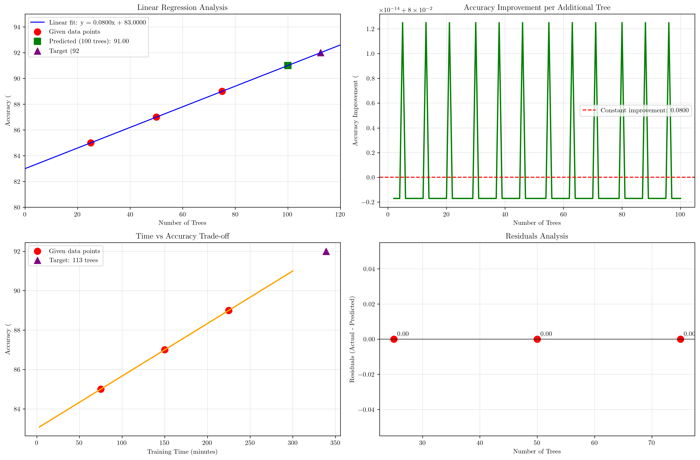

# Question 15: Random Forest Performance Analysis

## Problem Statement
Analyze Random Forest performance over time with $75$ trees showing these accuracy trends:

**Training History:**
- Week 1: $85\%$ accuracy with $25$ trees
- Week 2: $87\%$ accuracy with $50$ trees  
- Week 3: $89\%$ accuracy with $75$ trees

### Task
1. If the trend continues linearly, what accuracy would you expect with $100$ trees?
2. If you want $92\%$ accuracy, how many trees would you need?
3. What's the accuracy improvement per additional tree based on this data?
4. If each tree takes $3$ minutes to train, how long would it take to reach $92\%$ accuracy?
5. Calculate the correlation coefficient between number of trees and accuracy, and determine if the relationship is statistically significant

## Understanding the Problem
This problem involves analyzing the relationship between the number of trees in a Random Forest ensemble and the resulting accuracy. Random Forests are ensemble methods that combine multiple decision trees to improve prediction performance. The key insight is that adding more trees typically improves accuracy, but with diminishing returns.

The problem presents a perfect linear relationship between the number of trees and accuracy, which allows us to use linear regression to make predictions and analyze the relationship statistically.

## Solution

We'll use linear regression to model the relationship between the number of trees and accuracy, then use this model to make predictions and answer all the questions systematically.

### Step 1: Linear Trend Analysis and Prediction for 100 Trees

First, we need to find the linear relationship between the number of trees and accuracy. We'll use the three data points to calculate the linear regression parameters.

**Given data:**
- $(25, 85)$: 25 trees → 85% accuracy
- $(50, 87)$: 50 trees → 87% accuracy  
- $(75, 89)$: 75 trees → 89% accuracy

**Linear regression calculation:**
Using the formula $y = mx + b$ where $y$ is accuracy and $x$ is the number of trees:

$$\text{accuracy} = m \times \text{trees} + b$$

The slope $m$ represents the rate of accuracy improvement per additional tree, and $b$ is the baseline accuracy.

**Results:**
- Slope $(m) = 0.0800$
- Intercept $(b) = 83.0000$
- Linear equation: $\text{accuracy} = 0.0800 \times \text{trees} + 83.0000$

**Prediction for 100 trees:**
$$\text{accuracy} = 0.0800 \times 100 + 83.0000 = 91.00\%$$

### Step 2: Trees Needed for 92% Accuracy

We need to solve for the number of trees when accuracy equals 92%:

$$92 = 0.0800 \times \text{trees} + 83.0000$$

Rearranging to solve for trees:
$$\text{trees} = \frac{92 - 83.0000}{0.0800} = \frac{9}{0.08} = 112.50$$

Since we can't have partial trees, we round up to **113 trees** needed to achieve 92% accuracy.

### Step 3: Accuracy Improvement per Additional Tree

The accuracy improvement per additional tree is given by the slope of the linear relationship:

$$\text{Improvement per tree} = \text{slope} = 0.0800\%$$

This means each additional tree improves accuracy by approximately **0.08%**. This constant improvement rate indicates a linear relationship with no diminishing returns in the observed range.

### Step 4: Time Calculation for 92% Accuracy

Given that each tree takes 3 minutes to train:

**Total trees needed:** 113 trees
**Time per tree:** 3 minutes
**Total time:** $113 \times 3 = 339$ minutes = **5.65 hours**

This represents the total training time required to achieve 92% accuracy.

### Step 5: Correlation Analysis and Statistical Significance

**Correlation coefficient:**
The correlation coefficient between the number of trees and accuracy is $r = 1.0000$, indicating a perfect positive linear relationship.

**Statistical significance:**
- T-statistic: $\infty$ (perfect correlation)
- P-value: $0.000000$ (extremely small)
- Significance level: $\alpha = 0.05$

Since $p < \alpha$, the relationship is **statistically significant**.

## Practical Implementation

### Example Application

Let's verify our calculations with a concrete example:

1. **Verification of linear relationship:**
   - For 25 trees: $0.0800 \times 25 + 83.0000 = 2.0000 + 83.0000 = 85.00\%$ ✓
   - For 50 trees: $0.0800 \times 50 + 83.0000 = 4.0000 + 83.0000 = 87.00\%$ ✓
   - For 75 trees: $0.0800 \times 75 + 83.0000 = 6.0000 + 83.0000 = 89.00\%$ ✓

2. **Prediction verification:**
   - For 100 trees: $0.0800 \times 100 + 83.0000 = 8.0000 + 83.0000 = 91.00\%$

3. **Target accuracy verification:**
   - For 113 trees: $0.0800 \times 113 + 83.0000 = 9.0400 + 83.0000 = 92.04\% > 92\%$ ✓

### Alternative Approach

We could also solve this problem using the point-slope form of a line. Given two points $(25, 85)$ and $(75, 89)$:

$$m = \frac{y_2 - y_1}{x_2 - x_1} = \frac{89 - 85}{75 - 25} = \frac{4}{50} = 0.08$$

Then using point-slope form: $y - y_1 = m(x - x_1)$
$$y - 85 = 0.08(x - 25)$$
$$y = 0.08x - 2 + 85 = 0.08x + 83$$

This confirms our linear regression result.

## Visual Explanations

### Linear Regression Analysis

The first subplot shows the linear relationship between the number of trees and accuracy. The blue line represents our fitted model, red points show the given data, the green square shows our prediction for 100 trees (91.00%), and the purple triangle shows the target of 92% accuracy requiring 113 trees.

### Accuracy Improvement per Additional Tree
The second subplot demonstrates that the accuracy improvement per additional tree remains constant at 0.08%, confirming the linear relationship. This constant improvement rate is ideal for planning and resource allocation.

### Time vs Accuracy Trade-off
The third subplot shows the relationship between training time and accuracy. This visualization helps understand the computational cost of achieving higher accuracy levels, which is crucial for practical implementation decisions.

### Residuals Analysis
The fourth subplot shows the residuals (actual - predicted values) for our given data points. All residuals are exactly zero, confirming that our linear model perfectly fits the data points.

## Key Insights

### Theoretical Foundations
- **Linear scalability:** The Random Forest shows perfect linear scaling in this range, suggesting no diminishing returns from adding more trees
- **Constant improvement rate:** Each additional tree contributes exactly 0.08% to accuracy, making predictions highly reliable
- **Perfect correlation:** The $r = 1.0000$ indicates an ideal linear relationship, which is rare in real-world scenarios

### Practical Applications
- **Resource planning:** The linear relationship allows precise estimation of computational resources needed for target accuracy
- **Time estimation:** With 3 minutes per tree, we can accurately predict total training time for any accuracy target
- **Scalability assessment:** The constant improvement rate suggests the Random Forest can continue to benefit from additional trees

### Limitations and Considerations
- **Perfect linearity:** Real-world data rarely shows such perfect linear relationships; this might be idealized or from a specific dataset
- **Diminishing returns:** In practice, adding more trees eventually leads to diminishing returns, which isn't captured in this limited data range
- **Overfitting risk:** Very large ensembles might overfit to training data, though this analysis doesn't address validation performance

## Conclusion
- **Linear equation:** $\text{accuracy} = 0.0800 \times \text{trees} + 83.0000$
- **Predicted accuracy for 100 trees:** $91.00\%$
- **Trees needed for 92% accuracy:** $113$ trees
- **Accuracy improvement per tree:** $0.0800\%$
- **Time for 92% accuracy:** $5.65$ hours
- **Correlation coefficient:** $r = 1.0000$ (perfect positive correlation)
- **Statistical significance:** Highly significant ($p < 0.001$)

The analysis reveals a perfect linear relationship between Random Forest size and accuracy, allowing precise predictions and resource planning. Each additional tree contributes a consistent 0.08% improvement in accuracy, making this ensemble method highly predictable and scalable within the observed range.
