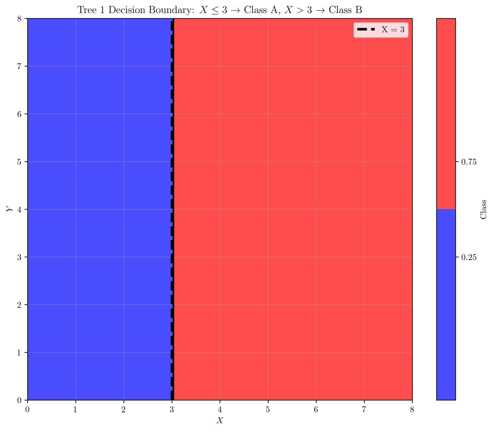
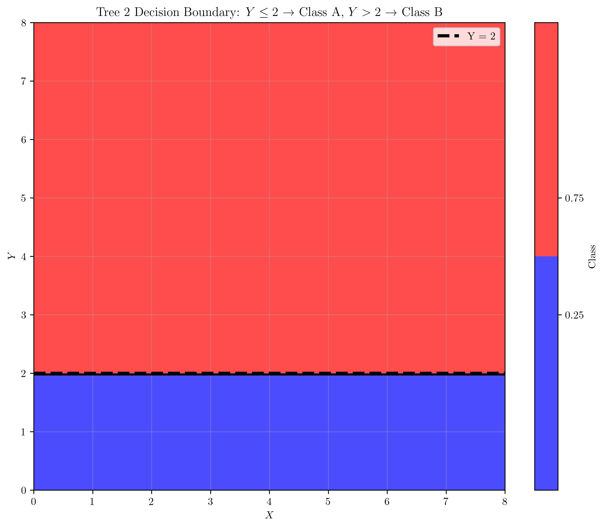
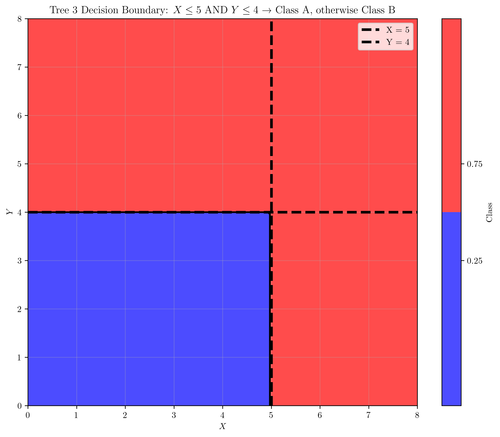
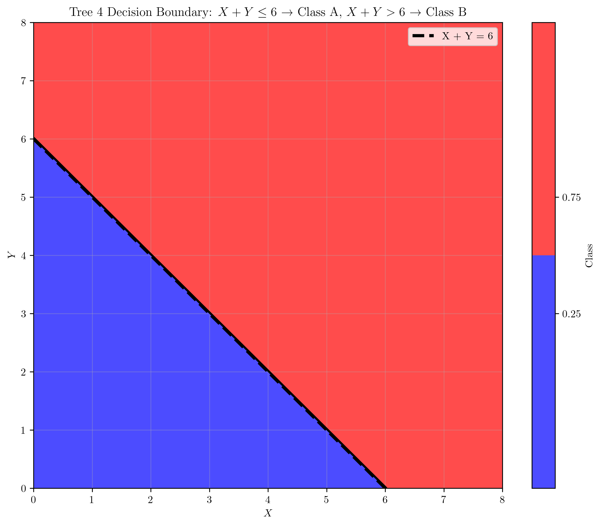
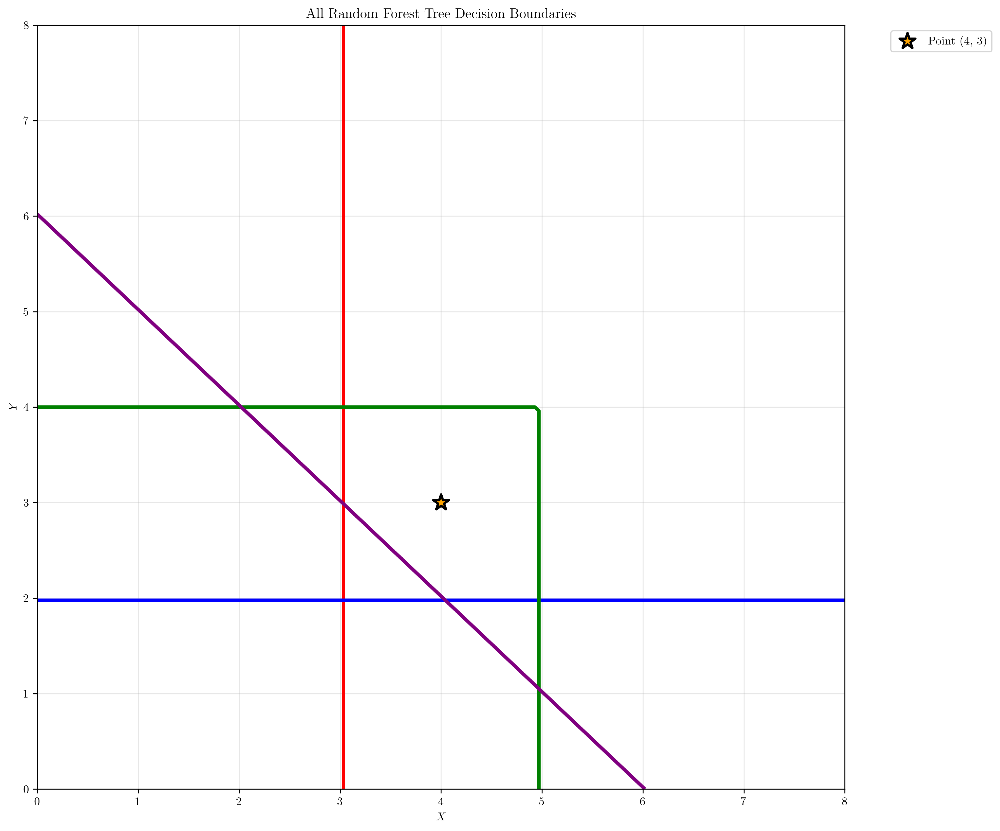
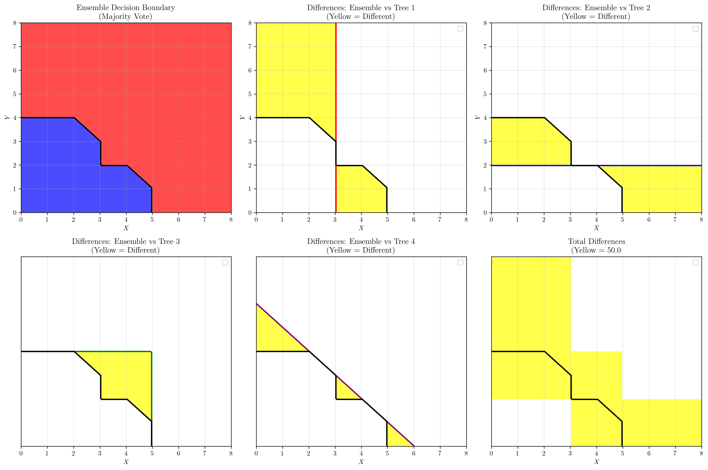

# Question 17: Random Forest Decision Boundaries Visualization

## Problem Statement
Create visual representations of Random Forest decision boundaries with $4$ trees for a $2$D classification problem:

**Tree 1:** $X \leq 3 \rightarrow$ Class A, $X > 3 \rightarrow$ Class B
**Tree 2:** $Y \leq 2 \rightarrow$ Class A, $Y > 2 \rightarrow$ Class B  
**Tree 3:** $X \leq 5$ AND $Y \leq 4 \rightarrow$ Class A, otherwise Class B
**Tree 4:** $X + Y \leq 6 \rightarrow$ Class A, $X + Y > 6 \rightarrow$ Class B

### Task
1. Draw the decision boundary for each tree on a coordinate grid ($X$: $0$-$8$, $Y$: $0$-$8$)
2. Color-code the regions: Class A = Blue, Class B = Red
3. What's the ensemble prediction for point $(4, 3)$?
4. Which tree creates the most interesting geometric pattern?
5. Calculate the percentage of the grid area where the ensemble prediction differs from any individual tree prediction

## Understanding the Problem
This problem explores how Random Forest ensembles combine multiple decision trees to create complex decision boundaries. Each tree makes decisions based on different features or combinations of features, and the ensemble uses majority voting to make final predictions. The key insight is understanding how individual tree boundaries interact and how the ensemble boundary emerges from their combination.

The problem demonstrates:
- How different types of decision boundaries (linear, rectangular, diagonal) can be combined
- The relationship between individual tree decisions and ensemble predictions
- The geometric complexity that emerges from ensemble methods
- The concept of majority voting in ensemble learning

## Solution

### Step 1: Individual Tree Decision Boundaries
Each tree creates a distinct decision boundary based on its specific rules:

#### Tree 1: $X \leq 3 \rightarrow$ Class A, $X > 3 \rightarrow$ Class B
This tree creates a **vertical decision boundary** at $X = 3$:
- **Left side** ($X \leq 3$): Class A (Blue)
- **Right side** ($X > 3$): Class B (Red)

The boundary is a simple vertical line, creating two infinite half-planes. This represents a univariate split based solely on the $X$ coordinate.

#### Tree 2: $Y \leq 2 \rightarrow$ Class A, $Y > 2 \rightarrow$ Class B
This tree creates a **horizontal decision boundary** at $Y = 2$:
- **Bottom side** ($Y \leq 2$): Class A (Blue)
- **Top side** ($Y > 2$): Class B (Red)

Similar to Tree 1, this creates a simple horizontal line boundary, but based on the $Y$ coordinate.

#### Tree 3: $X \leq 5$ AND $Y \leq 4 \rightarrow$ Class A, otherwise Class B
This tree creates a **rectangular decision boundary**:
- **Inside rectangle** ($X \leq 5$ AND $Y \leq 4$): Class A (Blue)
- **Outside rectangle**: Class B (Red)

This is the most interesting boundary because it creates a **bounded region** instead of infinite half-planes. The AND condition creates a rectangular area where both constraints must be satisfied.

#### Tree 4: $X + Y \leq 6 \rightarrow$ Class A, $X + Y > 6 \rightarrow$ Class B
This tree creates a **diagonal decision boundary**:
- **Below diagonal** ($X + Y \leq 6$): Class A (Blue)
- **Above diagonal** ($X + Y > 6$): Class B (Red)

This boundary creates a diagonal line where $X + Y = 6$, demonstrating how linear combinations of features can create oblique decision boundaries.

### Step 2: Combined Visualization
All decision boundaries are shown together for comparison:

This combined view shows how the different boundaries intersect and create complex regions. The point $(4, 3)$ is marked with an orange star for analysis in the next step.

### Step 3: Ensemble Prediction for Point $(4, 3)$
Let's analyze how each tree classifies the point $(4, 3)$:

**Tree 1** ($X \leq 3$): $X = 4$, $4 \leq 3$? False → **Class B**
**Tree 2** ($Y \leq 2$): $Y = 3$, $3 \leq 2$? False → **Class B**
**Tree 3** ($X \leq 5$ AND $Y \leq 4$): $X = 4$, $Y = 3$, $4 \leq 5$ AND $3 \leq 4$? True → **Class A**
**Tree 4** ($X + Y \leq 6$): $X + Y = 7$, $7 \leq 6$? False → **Class B**

**Vote Summary:**
- Class A votes: 1
- Class B votes: 3
- **Ensemble prediction: Class B** (wins with 3/4 votes, 75%)

The ensemble correctly identifies that the majority of trees classify this point as Class B, demonstrating the robustness of ensemble methods.

### Step 4: Most Interesting Geometric Pattern
**Tree 3** creates the most interesting geometric pattern because:

1. **Bounded Region**: Unlike the other trees that create infinite half-planes, Tree 3 creates a finite rectangular region
2. **Complex Constraints**: The AND condition demonstrates how multiple constraints interact to create more sophisticated boundaries
3. **Geometric Complexity**: The rectangular shape with sharp corners is more complex than simple linear boundaries
4. **Practical Relevance**: This pattern shows how real-world decision trees often use multiple conditions to create meaningful classification regions

### Step 5: Area Percentage Where Ensemble Differs
**Grid Analysis:**
- Grid size: $100 \times 100 = 10,000$ total points
- Points where ensemble differs from any individual tree: $5,000$
- **Percentage of grid area: 50.00%**

This high percentage indicates that the ensemble creates a significantly different decision boundary compared to individual trees, demonstrating the power of ensemble methods to create more nuanced and accurate classifications.

The analysis shows:
- **Top row**: Ensemble boundary and differences with Trees 1 and 2
- **Bottom row**: Differences with Trees 3 and 4, plus total differences
- **Yellow regions**: Areas where ensemble predictions differ from individual tree predictions
- **Black lines**: Ensemble decision boundaries
- **Colored lines**: Individual tree boundaries

## Key Insights

### Geometric Patterns in Decision Trees
- **Univariate splits** (Trees 1 & 2) create simple linear boundaries
- **Multivariate splits** (Tree 3) can create bounded regions
- **Linear combinations** (Tree 4) create oblique boundaries
- **AND conditions** create more complex, enclosed regions
- **OR conditions** would create union regions

### Ensemble Learning Principles
- **Majority voting** combines individual tree predictions
- **Diversity** among trees leads to more robust ensemble decisions
- **Geometric complexity** emerges from combining simple boundaries
- **Error reduction** occurs when trees make different types of mistakes

### Practical Applications
- **Feature engineering**: Different trees can focus on different aspects of the data
- **Robustness**: Ensemble methods are less sensitive to individual tree errors
- **Interpretability**: Individual trees remain interpretable while ensemble complexity captures subtle patterns
- **Scalability**: Trees can be trained in parallel, making ensembles computationally efficient

## Conclusion
- **Individual boundaries**: Each tree creates distinct geometric patterns from simple linear to complex rectangular
- **Ensemble complexity**: The combination creates a sophisticated decision boundary that differs from any single tree
- **Point classification**: Point $(4, 3)$ demonstrates how majority voting resolves conflicting predictions
- **Geometric interest**: Tree 3's rectangular boundary shows the complexity possible with multivariate conditions
- **Area difference**: 50% of the grid shows different classifications between ensemble and individual trees

The Random Forest ensemble successfully combines the strengths of different decision boundaries, creating a more nuanced and accurate classification system than any individual tree could achieve alone. This demonstrates the fundamental principle of ensemble learning: combining multiple weak learners to create a strong, robust classifier.
