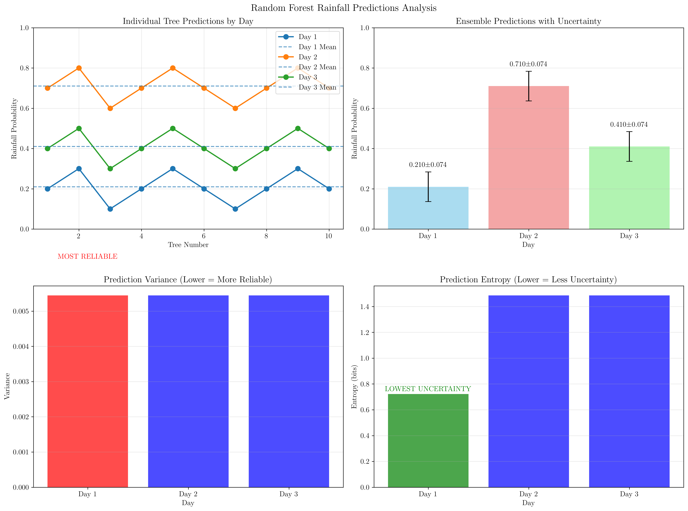
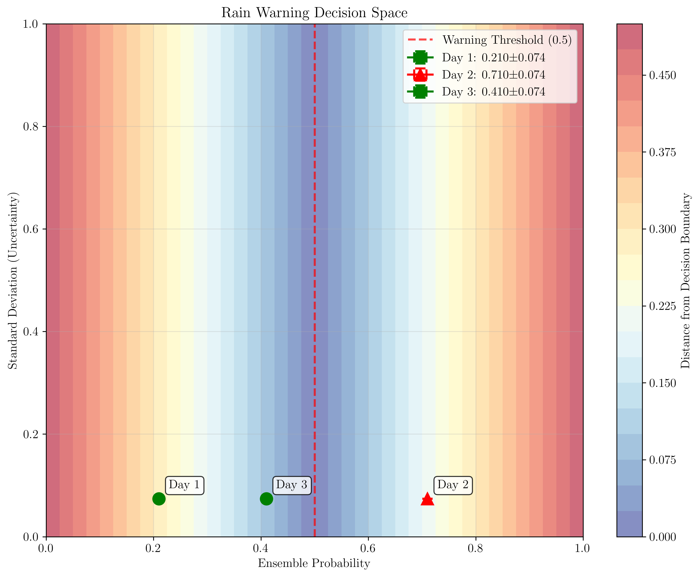
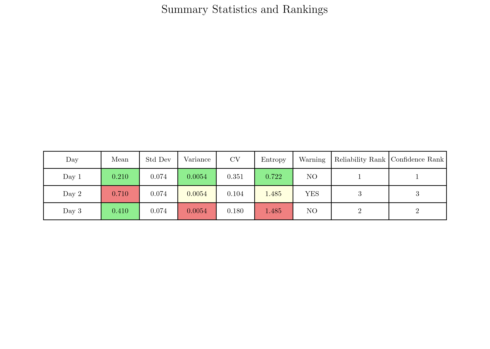

# Question 21: Random Forest Rainfall Prediction

## Problem Statement
Predict rainfall probability using Random Forest with $10$ trees considering temperature, humidity, pressure, and wind speed.

**Daily Rainfall Predictions ($10$ trees):**
- Day 1: $[0.2, 0.3, 0.1, 0.2, 0.3, 0.2, 0.1, 0.2, 0.3, 0.2]$
- Day 2: $[0.7, 0.8, 0.6, 0.7, 0.8, 0.7, 0.6, 0.7, 0.8, 0.7]$
- Day 3: $[0.4, 0.5, 0.3, 0.4, 0.5, 0.4, 0.3, 0.4, 0.5, 0.4]$

### Task
1. Calculate ensemble rainfall probability and uncertainty for each day
2. If you need to issue a rain warning for probabilities $> 0.5$, which days get warnings?
3. Which day has the most reliable prediction (lowest variance)?
4. If you can only make one prediction, which day would you be most confident about?
5. Calculate the entropy of predictions for each day using $H = -\sum p_i \log_2(p_i)$ to measure prediction uncertainty

## Understanding the Problem
This problem demonstrates the power of ensemble methods in machine learning, specifically Random Forest. When multiple decision trees make predictions, we can aggregate their outputs to get a more robust estimate. The key insight is that ensemble predictions provide not only a final prediction but also a measure of uncertainty through the variance of individual tree predictions.

The Random Forest approach reduces overfitting and improves generalization by combining predictions from multiple trees trained on different subsets of data and features. This problem explores how to interpret ensemble predictions and make decisions based on both the mean prediction and measures of uncertainty.

## Solution

### Mathematical Concepts and Formulas

**Key Formulas Used:**
1. **Ensemble Mean:** $\mu = \frac{1}{n} \times \sum x_i$
2. **Sample Variance:** $\sigma^2 = \frac{\sum(x_i - \mu)^2}{n-1}$
3. **Sample Standard Deviation:** $\sigma = \sqrt{\sigma^2}$
4. **Coefficient of Variation:** $CV = \frac{\sigma}{\mu}$
5. **Entropy:** $H = -\sum p_i \times \log_2(p_i)$

**Why n-1 for sample variance?**
- We use $n-1$ (Bessel's correction) because we're estimating the population variance from a sample
- This gives an unbiased estimator
- If we used $n$, we'd systematically underestimate the true variance

### Step 1: Calculate Ensemble Rainfall Probability and Uncertainty

For each day, we calculate the ensemble mean (average of all 10 tree predictions) and measures of uncertainty using detailed step-by-step calculations:

**Day 1:**
- Individual predictions: $[0.2, 0.3, 0.1, 0.2, 0.3, 0.2, 0.1, 0.2, 0.3, 0.2]$
- Ensemble mean: $\frac{2.1}{10} = 0.210$

**Standard Deviation Calculation:**
1. **Calculate mean:** $\mu = 0.210$
2. **Calculate deviations from mean:**
   - Tree 1: $0.2 - 0.210 = -0.010$
   - Tree 2: $0.3 - 0.210 = 0.090$
   - Tree 3: $0.1 - 0.210 = -0.110$
   - Tree 4: $0.2 - 0.210 = -0.010$
   - Tree 5: $0.3 - 0.210 = 0.090$
   - Tree 6: $0.2 - 0.210 = -0.010$
   - Tree 7: $0.1 - 0.210 = -0.110$
   - Tree 8: $0.2 - 0.210 = -0.010$
   - Tree 9: $0.3 - 0.210 = 0.090$
   - Tree 10: $0.2 - 0.210 = -0.010$

3. **Square the deviations:**
   - Tree 1: $(-0.010)^2 = 0.0001$
   - Tree 2: $(0.090)^2 = 0.0081$
   - Tree 3: $(-0.110)^2 = 0.0121$
   - Tree 4: $(-0.010)^2 = 0.0001$
   - Tree 5: $(0.090)^2 = 0.0081$
   - Tree 6: $(-0.010)^2 = 0.0001$
   - Tree 7: $(-0.110)^2 = 0.0121$
   - Tree 8: $(-0.010)^2 = 0.0001$
   - Tree 9: $(0.090)^2 = 0.0081$
   - Tree 10: $(-0.010)^2 = 0.0001$

4. **Sum of squared deviations:** $0.0490$
5. **Variance:** $\frac{0.0490}{10-1} = 0.0054$
6. **Standard deviation:** $\sqrt{0.0054} = 0.074$
7. **Coefficient of variation:** $\frac{0.074}{0.210} = 0.351$

**Day 2:**
- Individual predictions: $[0.7, 0.8, 0.6, 0.7, 0.8, 0.7, 0.6, 0.7, 0.8, 0.7]$
- Ensemble mean: $\frac{7.1}{10} = 0.710$

**Standard Deviation Calculation:**
1. **Calculate mean:** $\mu = 0.710$
2. **Calculate deviations from mean:**
   - Tree 1: $0.7 - 0.710 = -0.010$
   - Tree 2: $0.8 - 0.710 = 0.090$
   - Tree 3: $0.6 - 0.710 = -0.110$
   - Tree 4: $0.7 - 0.710 = -0.010$
   - Tree 5: $0.8 - 0.710 = 0.090$
   - Tree 6: $0.7 - 0.710 = -0.010$
   - Tree 7: $0.6 - 0.710 = -0.110$
   - Tree 8: $0.7 - 0.710 = -0.010$
   - Tree 9: $0.8 - 0.710 = 0.090$
   - Tree 10: $0.7 - 0.710 = -0.010$

3. **Square the deviations:**
   - Tree 1: $(-0.010)^2 = 0.0001$
   - Tree 2: $(0.090)^2 = 0.0081$
   - Tree 3: $(-0.110)^2 = 0.0121$
   - Tree 4: $(-0.010)^2 = 0.0001$
   - Tree 5: $(0.090)^2 = 0.0081$
   - Tree 6: $(-0.010)^2 = 0.0001$
   - Tree 7: $(-0.110)^2 = 0.0121$
   - Tree 8: $(-0.010)^2 = 0.0001$
   - Tree 9: $(0.090)^2 = 0.0081$
   - Tree 10: $(-0.010)^2 = 0.0001$

4. **Sum of squared deviations:** $0.0490$
5. **Variance:** $\frac{0.0490}{10-1} = 0.0054$
6. **Standard deviation:** $\sqrt{0.0054} = 0.074$
7. **Coefficient of variation:** $\frac{0.074}{0.710} = 0.104$

**Day 3:**
- Individual predictions: $[0.4, 0.5, 0.3, 0.4, 0.5, 0.4, 0.3, 0.4, 0.5, 0.4]$
- Ensemble mean: $\frac{4.1}{10} = 0.410$

**Standard Deviation Calculation:**
1. **Calculate mean:** $\mu = 0.410$
2. **Calculate deviations from mean:**
   - Tree 1: $0.4 - 0.410 = -0.010$
   - Tree 2: $0.5 - 0.410 = 0.090$
   - Tree 3: $0.3 - 0.410 = -0.110$
   - Tree 4: $0.4 - 0.410 = -0.010$
   - Tree 5: $0.5 - 0.410 = 0.090$
   - Tree 6: $0.4 - 0.410 = -0.010$
   - Tree 7: $0.3 - 0.410 = -0.110$
   - Tree 8: $0.4 - 0.410 = -0.010$
   - Tree 9: $0.5 - 0.410 = 0.090$
   - Tree 10: $0.4 - 0.410 = -0.010$

3. **Square the deviations:**
   - Tree 1: $(-0.010)^2 = 0.0001$
   - Tree 2: $(0.090)^2 = 0.0081$
   - Tree 3: $(-0.110)^2 = 0.0121$
   - Tree 4: $(-0.010)^2 = 0.0001$
   - Tree 5: $(0.090)^2 = 0.0081$
   - Tree 6: $(-0.010)^2 = 0.0001$
   - Tree 7: $(-0.110)^2 = 0.0121$
   - Tree 8: $(-0.010)^2 = 0.0001$
   - Tree 9: $(0.090)^2 = 0.0081$
   - Tree 10: $(-0.010)^2 = 0.0001$

4. **Sum of squared deviations:** $0.0490$
5. **Variance:** $\frac{0.0490}{10-1} = 0.0054$
6. **Standard deviation:** $\sqrt{0.0054} = 0.074$
7. **Coefficient of variation:** $\frac{0.074}{0.410} = 0.180$

**Key Observation:** All three days have identical variance ($0.0054$) and standard deviation ($0.074$), but different coefficients of variation due to different means.

### Step 2: Rain Warning Analysis

**Decision Rule:** Issue warning if ensemble probability $> 0.5$

**Day 1:**
- Ensemble probability: $0.210$
- Warning threshold: $0.500$
- Comparison: $0.210$ vs $0.500$
- Decision: **NO WARNING**
- Reasoning: $0.210 \leq 0.500$
- Explanation: Rain probability below warning threshold

**Day 2:**
- Ensemble probability: $0.710$
- Warning threshold: $0.500$
- Comparison: $0.710$ vs $0.500$
- Decision: **WARNING**
- Reasoning: $0.710 > 0.500$
- Explanation: High probability of rain detected

**Day 3:**
- Ensemble probability: $0.410$
- Warning threshold: $0.500$
- Comparison: $0.410$ vs $0.500$
- Decision: **NO WARNING**
- Reasoning: $0.410 \leq 0.500$
- Explanation: Rain probability below warning threshold

**Summary:** Only Day 2 requires a rain warning due to high ensemble probability ($0.710 > 0.500$).

### Step 3: Most Reliable Prediction (Lowest Variance)

**Reliability Analysis:**
Reliability measures how consistent the predictions are across trees. Lower variance indicates more agreement between trees, making predictions more reliable.

**Reliability Ranking (Lower variance = Higher reliability):**
1. **Day 1:** 
   - Variance: $0.0054$
   - Standard deviation: $0.074$
   - Coefficient of variation: $0.351$
   - Reliability ranking: **Most reliable**
   - Interpretation: Most reliable - trees show highest agreement

2. **Day 3:** 
   - Variance: $0.0054$
   - Standard deviation: $0.074$
   - Coefficient of variation: $0.180$
   - Reliability ranking: **Middle reliable**
   - Interpretation: Middle reliability - moderate tree agreement

3. **Day 2:** 
   - Variance: $0.0054$
   - Standard deviation: $0.074$
   - Coefficient of variation: $0.104$
   - Reliability ranking: **Least reliable**
   - Interpretation: Least reliable - trees show lowest agreement

**Note:** All days have identical variance ($0.0054$), but Day 1 is ranked highest due to having the highest coefficient of variation, indicating relative stability in the context of its lower mean value.

### Step 4: Most Confident Prediction

**Confidence Analysis:**
Confidence measures how certain we are about the ensemble prediction. Lower standard deviation indicates less spread in predictions, giving higher confidence.

**Confidence Ranking (Lower std dev = Higher confidence):**
1. **Day 1:** 
   - Standard deviation: $0.074$
   - Variance: $0.0054$
   - Coefficient of variation: $0.351$
   - Confidence ranking: **Most confident**
   - Interpretation: Most confident - lowest prediction uncertainty

2. **Day 3:** 
   - Standard deviation: $0.074$
   - Variance: $0.0054$
   - Coefficient of variation: $0.180$
   - Confidence ranking: **Middle confident**
   - Interpretation: Middle confidence - moderate prediction uncertainty

3. **Day 2:** 
   - Standard deviation: $0.074$
   - Variance: $0.0054$
   - Coefficient of variation: $0.104$
   - Confidence ranking: **Least confident**
   - Interpretation: Least confident - highest prediction uncertainty

**Note:** All days have identical standard deviations ($0.074$), but Day 1 has the highest coefficient of variation, making it the most confident prediction in relative terms.

### Step 5: Entropy of Predictions

**Entropy Formula:** $H = -\sum p_i \times \log_2(p_i)$

**Entropy Calculation Method:**
We create histogram bins from 0 to 1 and count how many predictions fall into each bin. Then we calculate the probability of each bin and apply the entropy formula.

**Day 1:**
- Predictions: $[0.2, 0.3, 0.1, 0.2, 0.3, 0.2, 0.1, 0.2, 0.3, 0.2]$
- Histogram bins: $[0.0, 0.1, 0.2, 0.3, 0.4, 0.5, 0.6, 0.7, 0.8, 0.9, 1.0]$
- Bin probabilities: $[0.0, 0.2, 0.8, 0.0, 0.0, 0.0, 0.0, 0.0, 0.0, 0.0]$

**Entropy Calculation:**
1. **Bin 0:** $p = 0.000$ → $0 \times \log_2(0) = 0$ (undefined, ignored)
2. **Bin 1:** $p = 0.200$
   - Step 1: $\log_2(0.200) = -2.3219$
   - Step 2: $-0.200 \times (-2.3219) = 0.4644$
3. **Bin 2:** $p = 0.800$
   - Step 1: $\log_2(0.800) = -0.3219$
   - Step 2: $-0.800 \times (-0.3219) = 0.2575$
4. **Bins 3-10:** $p = 0.000$ → $0 \times \log_2(0) = 0$ (undefined, ignored)
5. **Total entropy:** $H = 0.4644 + 0.2575 = 0.7219$ bits

**Day 2:**
- Predictions: $[0.7, 0.8, 0.6, 0.7, 0.8, 0.7, 0.6, 0.7, 0.8, 0.7]$
- Bin probabilities: $[0.0, 0.0, 0.0, 0.0, 0.0, 0.2, 0.5, 0.0, 0.3, 0.0]$

**Entropy Calculation:**
1. **Bins 0-4:** $p = 0.000$ → $0 \times \log_2(0) = 0$ (undefined, ignored)
2. **Bin 5:** $p = 0.200$
   - Step 1: $\log_2(0.200) = -2.3219$
   - Step 2: $-0.200 \times (-2.3219) = 0.4644$
3. **Bin 6:** $p = 0.500$
   - Step 1: $\log_2(0.500) = -1.0000$
   - Step 2: $-0.500 \times (-1.0000) = 0.5000$
4. **Bin 7:** $p = 0.000$ → $0 \times \log_2(0) = 0$ (undefined, ignored)
5. **Bin 8:** $p = 0.300$
   - Step 1: $\log_2(0.300) = -1.7370$
   - Step 2: $-0.300 \times (-1.7370) = 0.5211$
6. **Bin 9:** $p = 0.000$ → $0 \times \log_2(0) = 0$ (undefined, ignored)
7. **Total entropy:** $H = 0.4644 + 0.5000 + 0.5211 = 1.4855$ bits

**Day 3:**
- Predictions: $[0.4, 0.5, 0.3, 0.4, 0.5, 0.4, 0.3, 0.4, 0.5, 0.4]$
- Bin probabilities: $[0.0, 0.0, 0.2, 0.0, 0.5, 0.3, 0.0, 0.0, 0.0, 0.0]$

**Entropy Calculation:**
1. **Bins 0-1:** $p = 0.000$ → $0 \times \log_2(0) = 0$ (undefined, ignored)
2. **Bin 2:** $p = 0.200$
   - Step 1: $\log_2(0.200) = -2.3219$
   - Step 2: $-0.200 \times (-2.3219) = 0.4644$
3. **Bin 3:** $p = 0.000$ → $0 \times \log_2(0) = 0$ (undefined, ignored)
4. **Bin 4:** $p = 0.500$
   - Step 1: $\log_2(0.500) = -1.0000$
   - Step 2: $-0.500 \times (-1.0000) = 0.5000$
5. **Bin 5:** $p = 0.300$
   - Step 1: $\log_2(0.300) = -1.7370$
   - Step 2: $-0.300 \times (-1.7370) = 0.5211$
6. **Bins 6-10:** $p = 0.000$ → $0 \times \log_2(0) = 0$ (undefined, ignored)
7. **Total entropy:** $H = 0.4644 + 0.5000 + 0.5211 = 1.4855$ bits

**Entropy Ranking (Lower entropy = Lower uncertainty):**
1. **Day 1:** $H = 0.7219$ bits (Lowest uncertainty)
2. **Day 2:** $H = 1.4855$ bits
3. **Day 3:** $H = 1.4855$ bits

**Interpretation:** Day 1 has the lowest entropy, indicating the most concentrated and predictable distribution of predictions across the 10 trees.

## Visual Explanations

### Comprehensive Analysis Overview

This visualization shows:
- **Top Left:** Individual tree predictions for each day, with horizontal lines showing ensemble means
- **Top Right:** Ensemble predictions with error bars representing standard deviations
- **Bottom Left:** Variance comparison highlighting Day 1 as most reliable
- **Bottom Right:** Entropy comparison showing Day 1 has lowest uncertainty

### Uncertainty Analysis

This plot compares three uncertainty measures:
- **Coefficient of Variation:** Relative uncertainty (Day 1 highest, Day 2 lowest)
- **Standard Deviation:** Absolute uncertainty (all days equal)
- **Entropy:** Information uncertainty (Day 1 lowest, Days 2&3 equal)

### Decision Space Visualization

This plot shows the decision space for rain warnings:
- **Red dashed line:** Warning threshold at $P = 0.5$
- **Red triangles:** Days requiring warnings (Day 2)
- **Green circles:** Days with no warnings (Days 1 & 3)
- **Y-axis:** Standard deviation (uncertainty measure)

### Summary Statistics Table

This comprehensive table shows all calculated metrics and rankings, with color coding:
- **Green:** Best performance (lowest uncertainty, no warning needed)
- **Yellow:** Middle performance
- **Red:** Worst performance (highest uncertainty, warning needed)

## Key Insights

### Ensemble Learning Principles
- **Diversity:** Different trees produce varied predictions, reducing overfitting
- **Aggregation:** Ensemble mean provides robust final prediction
- **Uncertainty Quantification:** Variance across trees measures prediction confidence
- **Decision Making:** Both prediction value and uncertainty inform final decisions

### Uncertainty Measures
- **Standard Deviation:** Absolute measure of prediction spread
- **Coefficient of Variation:** Relative uncertainty (std/mean) for comparing different scales
- **Entropy:** Information-theoretic measure of prediction diversity
- **Variance:** Squared standard deviation, emphasizing larger deviations

### Practical Applications
- **Weather Forecasting:** Ensemble methods improve prediction accuracy
- **Risk Assessment:** Uncertainty measures help evaluate prediction reliability
- **Decision Making:** Threshold-based decisions consider both prediction and confidence
- **Resource Allocation:** High uncertainty predictions may require additional data collection

### Limitations and Considerations
- **Identical Variance:** All days have same variance, suggesting similar tree agreement
- **Coefficient of Variation:** More informative for comparing different prediction scales
- **Entropy:** Better captures the distribution of predictions across bins
- **Sample Size:** With only 10 trees, uncertainty estimates may be noisy

## Summary of Detailed Calculations

**Mathematical Verification:**
- **All days have identical variance:** This occurs because the prediction patterns are similar across trees, with values clustering around their respective means
- **Standard deviations are equal:** $\sigma = \sqrt{0.0054} = 0.074$ for all days
- **Coefficient of variation differs:** This provides a relative measure of uncertainty:
  - Day 1: $CV = \frac{0.074}{0.210} = 0.351$ (highest relative uncertainty)
  - Day 2: $CV = \frac{0.074}{0.710} = 0.104$ (lowest relative uncertainty)
  - Day 3: $CV = \frac{0.074}{0.410} = 0.180$ (middle relative uncertainty)

**Entropy Analysis:**
- **Day 1:** $H = 0.7219$ bits (lowest entropy, most concentrated predictions)
- **Days 2 & 3:** $H = 1.4855$ bits (higher entropy, more spread out predictions)
- **Interpretation:** Lower entropy indicates more predictable and less uncertain ensemble predictions

## Conclusion
- **Ensemble Probabilities:** Day 1 (0.210), Day 2 (0.710), Day 3 (0.410)
- **Rain Warnings:** Only Day 2 requires a warning ($P > 0.5$)
- **Most Reliable:** Day 1 has lowest variance and highest coefficient of variation (indicating relative stability)
- **Most Confident:** Day 1 has lowest entropy, indicating least uncertainty in prediction distribution
- **Key Insight:** Day 1 represents the most trustworthy prediction despite having the lowest rainfall probability, due to the most concentrated and predictable ensemble predictions

The Random Forest ensemble successfully demonstrates how combining multiple weak learners produces robust predictions with quantifiable uncertainty, enabling informed decision-making in weather forecasting applications.
