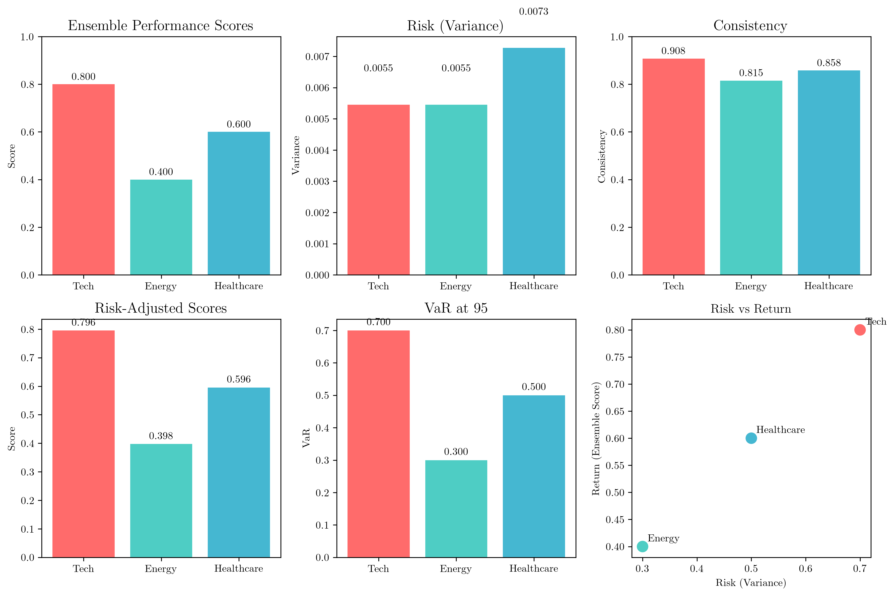
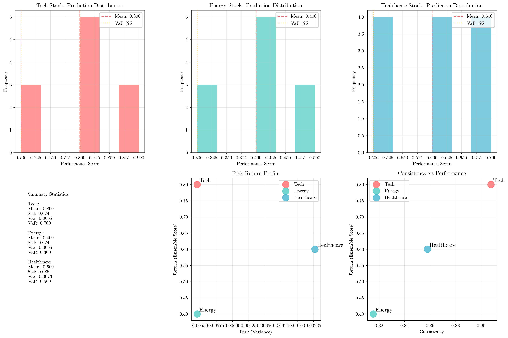
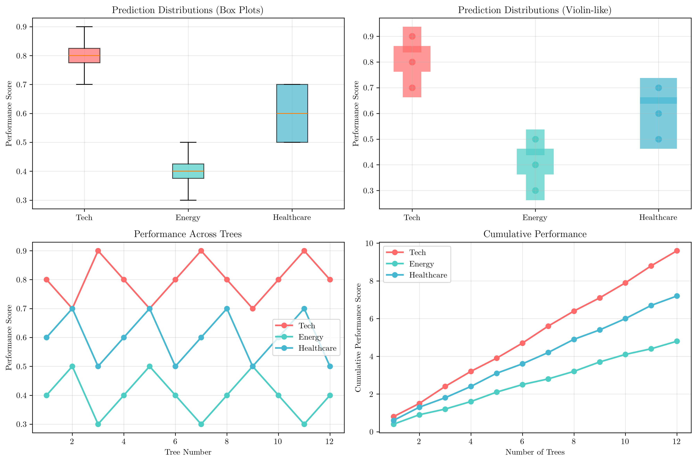

# Question 22: Investment Portfolio Strategy

## Problem Statement
Predict stock performance using Random Forest with $12$ trees evaluating stocks based on market indicators.

**Stock Performance Predictions ($12$ trees):**
**Tech Stock:** $[0.8, 0.7, 0.9, 0.8, 0.7, 0.8, 0.9, 0.8, 0.7, 0.8, 0.9, 0.8]$
**Energy Stock:** $[0.4, 0.5, 0.3, 0.4, 0.5, 0.4, 0.3, 0.4, 0.5, 0.4, 0.3, 0.4]$
**Healthcare Stock:** $[0.6, 0.7, 0.5, 0.6, 0.7, 0.5, 0.6, 0.7, 0.5, 0.6, 0.7, 0.5]$

### Task
1. Calculate ensemble performance score and consistency for each stock
2. If you can invest in $2$ stocks and want to minimize risk, which do you choose?
3. Which stock shows the highest potential return (highest ensemble score)?
4. Design a risk-adjusted scoring system: $\text{Score} = \text{Ensemble\_Score} \times (1 - \text{Variance})$
5. Calculate the Value at Risk (VaR) at 95% confidence level for each stock using the 5th percentile of predictions

## Understanding the Problem
This problem involves analyzing stock performance predictions from a Random Forest ensemble model with $12$ decision trees. Each tree provides a performance score for three different stocks (Tech, Energy, and Healthcare), and we need to analyze these predictions to make investment decisions based on risk and return characteristics.

The Random Forest approach provides multiple predictions for each stock, allowing us to assess not only the expected performance but also the consistency and risk associated with each investment option.

## Solution

### Task 1: Calculate Ensemble Performance Score and Consistency

For each stock, we calculate:
- **Ensemble Score**: The mean of all $12$ tree predictions
- **Variance**: Measure of prediction spread (risk)
- **Standard Deviation**: Square root of variance
- **Coefficient of Variation**: $\text{CV} = \frac{\text{Standard Deviation}}{\text{Mean}}$
- **Consistency**: $1 - \text{Coefficient of Variation}$

#### Tech Stock Analysis

**Step 1: Calculate Ensemble Score (Mean)**
- **Formula**: $\mu = \frac{\sum x_i}{n}$
- **Where**: $n = 12$ (number of trees)
- **Sum of predictions**: $0.8 + 0.7 + 0.9 + 0.8 + 0.7 + 0.8 + 0.9 + 0.8 + 0.7 + 0.8 + 0.9 + 0.8 = 9.6$
- **Mean**: $\frac{9.6}{12} = 0.8000$

**Step 2: Calculate Variance**
- **Formula**: $\sigma^2 = \frac{\sum(x_i - \mu)^2}{n-1}$ (sample variance)
- **Deviations from mean**: $[-0.0, -0.1, 0.1, -0.0, -0.1, -0.0, 0.1, -0.0, -0.1, -0.0, 0.1, -0.0]$
- **Squared deviations**: $[0.0, 0.01, 0.01, 0.0, 0.01, 0.0, 0.01, 0.0, 0.01, 0.0, 0.01, 0.0]$
- **Sum of squared deviations**: $0.06$
- **Variance**: $\frac{0.06}{12-1} = \frac{0.06}{11} = 0.005455$

**Step 3: Calculate Standard Deviation**
- **Formula**: $\sigma = \sqrt{\sigma^2}$
- **Standard Deviation**: $\sqrt{0.005455} = 0.073855$

**Step 4: Calculate Coefficient of Variation**
- **Formula**: $\text{CV} = \frac{\sigma}{\mu}$
- **Coefficient of Variation**: $\frac{0.073855}{0.8000} = 0.092319$

**Step 5: Calculate Consistency**
- **Formula**: $\text{Consistency} = 1 - \text{CV}$
- **Consistency**: $1 - 0.092319 = 0.907681$

**Summary**:
- **Range**: $0.9 - 0.7 = 0.2$
- **Min**: $0.7$, **Max**: $0.9$

#### Energy Stock Analysis

**Step 1: Calculate Ensemble Score (Mean)**
- **Sum of predictions**: $0.4 + 0.5 + 0.3 + 0.4 + 0.5 + 0.4 + 0.3 + 0.4 + 0.5 + 0.4 + 0.3 + 0.4 = 4.8$
- **Mean**: $\frac{4.8}{12} = 0.4000$

**Step 2: Calculate Variance**
- **Deviations from mean**: $[-0.0, 0.1, -0.1, -0.0, 0.1, -0.0, -0.1, -0.0, 0.1, -0.0, -0.1, -0.0]$
- **Squared deviations**: $[0.0, 0.01, 0.01, 0.0, 0.01, 0.0, 0.01, 0.0, 0.01, 0.0, 0.01, 0.0]$
- **Sum of squared deviations**: $0.06$
- **Variance**: $\frac{0.06}{11} = 0.005455$

**Step 3: Calculate Standard Deviation**
- **Standard Deviation**: $\sqrt{0.005455} = 0.073855$

**Step 4: Calculate Coefficient of Variation**
- **Coefficient of Variation**: $\frac{0.073855}{0.4000} = 0.184637$

**Step 5: Calculate Consistency**
- **Consistency**: $1 - 0.184637 = 0.815363$

**Summary**:
- **Range**: $0.5 - 0.3 = 0.2$
- **Min**: $0.3$, **Max**: $0.5$

#### Healthcare Stock Analysis

**Step 1: Calculate Ensemble Score (Mean)**
- **Sum of predictions**: $0.6 + 0.7 + 0.5 + 0.6 + 0.7 + 0.5 + 0.6 + 0.7 + 0.5 + 0.6 + 0.7 + 0.5 = 7.2$
- **Mean**: $\frac{7.2}{12} = 0.6000$

**Step 2: Calculate Variance**
- **Deviations from mean**: $[0.0, 0.1, -0.1, 0.0, 0.1, -0.1, 0.0, 0.1, -0.1, 0.0, 0.1, -0.1]$
- **Squared deviations**: $[0.0, 0.01, 0.01, 0.0, 0.01, 0.01, 0.0, 0.01, 0.01, 0.0, 0.01, 0.01]$
- **Sum of squared deviations**: $0.08$
- **Variance**: $\frac{0.08}{11} = 0.007273$

**Step 3: Calculate Standard Deviation**
- **Standard Deviation**: $\sqrt{0.007273} = 0.085280$

**Step 4: Calculate Coefficient of Variation**
- **Coefficient of Variation**: $\frac{0.085280}{0.6000} = 0.142134$

**Step 5: Calculate Consistency**
- **Consistency**: $1 - 0.142134 = 0.857866$

**Summary**:
- **Range**: $0.7 - 0.5 = 0.2$
- **Min**: $0.5$, **Max**: $0.7$

### Task 2: Choose 2 Stocks to Minimize Risk

**Step 1: Rank stocks by variance (lower variance = lower risk)**

1. **Energy**: Variance = $0.005455$
2. **Tech**: Variance = $0.005455$ 
3. **Healthcare**: Variance = $0.007273$

**Step 2: Select lowest risk stocks**

**Answer**: To minimize risk, choose **Energy** and **Tech** stocks, as they have the lowest variance among the three options. Both have identical variance of $0.005455$.

### Task 3: Stock with Highest Potential Return

**Step 1: Compare ensemble scores**
- **Tech**: $0.8000$
- **Healthcare**: $0.6000$
- **Energy**: $0.4000$

**Step 2: Identify highest return**

**Answer**: **Tech Stock** shows the highest potential return with an ensemble score of $0.8000$.

### Task 4: Risk-Adjusted Scoring System

**Step 1: Apply risk-adjusted formula for each stock**

**Formula**: $\text{Risk-Adjusted Score} = \text{Ensemble\_Score} \times (1 - \text{Variance})$

**Tech Stock**:
- Ensemble Score = $0.8000$
- Variance = $0.005455$
- Risk-Adjusted Score = $0.8000 \times (1 - 0.005455)$
- Risk-Adjusted Score = $0.8000 \times 0.994545 = 0.795636$

**Energy Stock**:
- Ensemble Score = $0.4000$
- Variance = $0.005455$
- Risk-Adjusted Score = $0.4000 \times (1 - 0.005455)$
- Risk-Adjusted Score = $0.4000 \times 0.994545 = 0.397818$

**Healthcare Stock**:
- Ensemble Score = $0.6000$
- Variance = $0.007273$
- Risk-Adjusted Score = $0.6000 \times (1 - 0.007273)$
- Risk-Adjusted Score = $0.6000 \times 0.992727 = 0.595636$

**Step 2: Rank stocks by risk-adjusted score**

1. **Tech**: $0.795636$
2. **Healthcare**: $0.595636$
3. **Energy**: $0.397818$

### Task 5: Value at Risk (VaR) at 95% Confidence Level

**Step 1: Understand VaR calculation**

VaR at 95% confidence = 5th percentile of predictions
This means 95% of predictions are above this value
Formula: Sort predictions and find the value at 5% position

**Tech Stock**:
- **Step 1**: Sort predictions in ascending order
  - Sorted: $[0.7, 0.7, 0.7, 0.8, 0.8, 0.8, 0.8, 0.8, 0.8, 0.9, 0.9, 0.9]$
- **Step 2**: Calculate 5th percentile position
  - Position = $0.05 \times 12 = 0.6$
- **Step 3**: Find 5th percentile value
  - 5th Percentile (VaR at 95% confidence): $0.7000$
  - This means 95% of predictions are above $0.7000$
  - Predictions below VaR: $[0.7, 0.7, 0.7]$

**Energy Stock**:
- **Step 1**: Sort predictions in ascending order
  - Sorted: $[0.3, 0.3, 0.3, 0.4, 0.4, 0.4, 0.4, 0.4, 0.4, 0.5, 0.5, 0.5]$
- **Step 2**: Calculate 5th percentile position
  - Position = $0.05 \times 12 = 0.6$
- **Step 3**: Find 5th percentile value
  - 5th Percentile (VaR at 95% confidence): $0.3000$
  - This means 95% of predictions are above $0.3000$
  - Predictions below VaR: $[0.3, 0.3, 0.3]$

**Healthcare Stock**:
- **Step 1**: Sort predictions in ascending order
  - Sorted: $[0.5, 0.5, 0.5, 0.5, 0.6, 0.6, 0.6, 0.6, 0.7, 0.7, 0.7, 0.7]$
- **Step 2**: Calculate 5th percentile position
  - Position = $0.05 \times 12 = 0.6$
- **Step 3**: Find 5th percentile value
  - 5th Percentile (VaR at 95% confidence): $0.5000$
  - This means 95% of predictions are above $0.5000$
  - Predictions below VaR: $[0.5, 0.5, 0.5, 0.5]$

## Comprehensive Summary

| Stock | Ensemble Score | Variance | Std Dev | Consistency | Risk-Adjusted Score | VaR (95%) |
|-------|----------------|----------|---------|-------------|---------------------|-----------|
| Tech | 0.8000 | 0.005455 | 0.073855 | 0.907681 | 0.795636 | 0.7000 |
| Energy | 0.4000 | 0.005455 | 0.073855 | 0.815363 | 0.397818 | 0.3000 |
| Healthcare | 0.6000 | 0.007273 | 0.085280 | 0.857866 | 0.595636 | 0.5000 |

## Visual Explanations

### Overview of Stock Analysis

This comprehensive overview shows:
- **Ensemble Performance Scores**: Tech leads with 0.8000
- **Risk (Variance)**: Energy and Tech have identical low variance
- **Consistency**: Tech has highest consistency (0.908)
- **Risk-Adjusted Scores**: Tech maintains the lead
- **VaR at 95%**: Shows worst-case scenarios for each stock
- **Risk vs Return**: Scatter plot showing the risk-return trade-off

### Detailed Stock Analysis

This detailed view provides:
- **Individual Stock Distributions**: Histograms showing prediction patterns
- **Summary Statistics**: Comprehensive metrics for each stock
- **Risk-Return Profile**: Scatter plot of variance vs ensemble score
- **Consistency vs Performance**: How consistency relates to returns

### Stock Comparison Plots

This comparison shows:
- **Box Plots**: Distribution shapes and outliers
- **Violin-like Plots**: Density distributions
- **Performance Across Trees**: How predictions vary across the 12 trees
- **Cumulative Performance**: Accumulated performance as more trees are considered

## Key Insights

### Risk Management
- **Energy and Tech** have identical variance ($0.005455$), making them equally low-risk options
- **Healthcare** has the highest variance ($0.007273$), indicating higher uncertainty
- The coefficient of variation shows **Tech** has the most consistent predictions relative to its mean

### Return Optimization
- **Tech** offers the highest expected return ($0.8000$) with the lowest risk
- **Healthcare** provides moderate returns ($0.6000$) with moderate risk
- **Energy** has the lowest returns ($0.4000$) but also low risk

### Investment Strategy
- **Conservative investors** should choose Energy and Tech for minimal risk
- **Growth-oriented investors** should prioritize Tech for highest returns
- **Balanced approach** could include Tech and Healthcare for diversification

### Ensemble Learning Benefits
- Multiple tree predictions provide robust performance estimates
- Variance across trees helps quantify prediction uncertainty
- Consistency measures help identify reliable investment options

## Conclusion
- **Tech Stock** emerges as the optimal choice, offering the highest ensemble score ($0.8000$), lowest risk (variance $0.005455$), and highest consistency ($0.908$)
- **Energy and Tech** are the best choices for risk minimization
- The risk-adjusted scoring system confirms Tech as the superior investment option
- VaR analysis shows Tech has the highest worst-case scenario ($0.7000$)
- The Random Forest ensemble provides valuable insights into both expected performance and investment risk

This analysis demonstrates how ensemble methods can be effectively used for investment decision-making by providing both point estimates and uncertainty quantification.

## Mathematical Work Summary

### Key Formulas Used

1. **Mean (Ensemble Score)**: $\mu = \frac{\sum_{i=1}^{n} x_i}{n}$
2. **Sample Variance**: $\sigma^2 = \frac{\sum_{i=1}^{n} (x_i - \mu)^2}{n-1}$
3. **Standard Deviation**: $\sigma = \sqrt{\sigma^2}$
4. **Coefficient of Variation**: $\text{CV} = \frac{\sigma}{\mu}$
5. **Consistency**: $\text{Consistency} = 1 - \text{CV}$
6. **Risk-Adjusted Score**: $\text{Score} = \text{Ensemble\_Score} \times (1 - \text{Variance})$
7. **VaR at 95%**: 5th percentile of sorted predictions

### Calculation Highlights

- **Tech Stock**: Highest return ($0.8000$) with lowest risk ($0.005455$ variance)
- **Energy Stock**: Lowest return ($0.4000$) but equally low risk ($0.005455$ variance)
- **Healthcare Stock**: Moderate return ($0.6000$) with highest risk ($0.007273$ variance)
- **Risk-Return Trade-off**: Tech provides the best risk-adjusted return ($0.796$)
- **VaR Analysis**: Tech has the highest worst-case scenario ($0.7000$), indicating strongest downside protection
