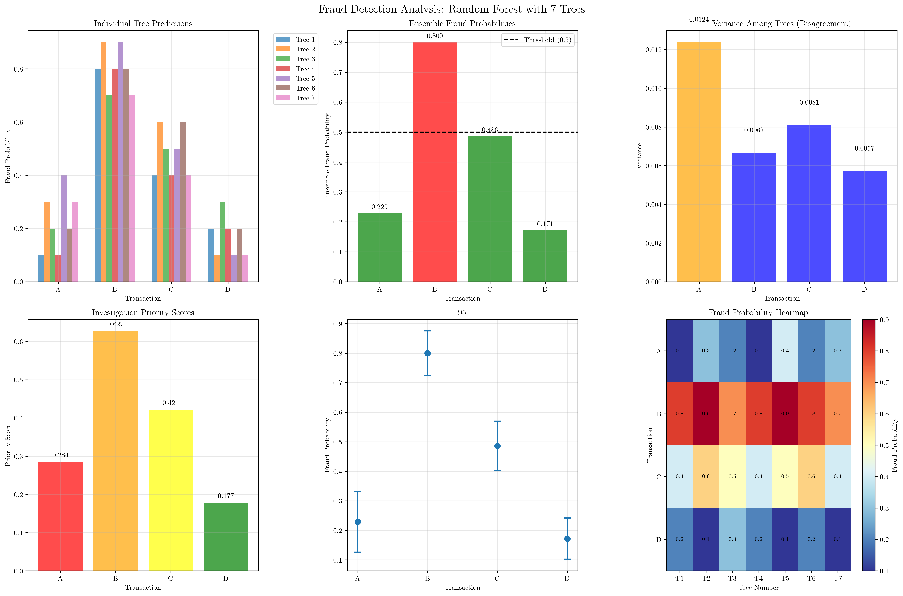
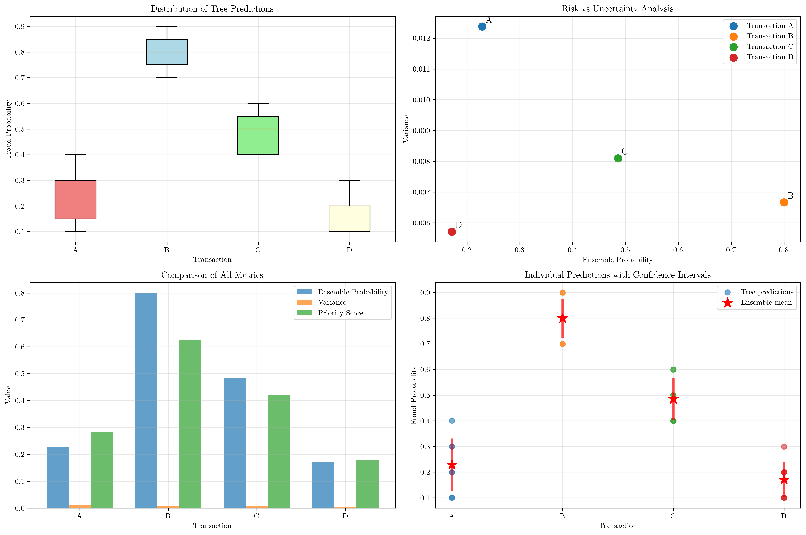

# Question 23: Fraud Detection using Random Forest Analysis

## Problem Statement
Investigate fraud detection using Random Forest with $7$ trees giving fraud probabilities for $4$ suspicious transactions:

**Transaction A:** $[0.1, 0.3, 0.2, 0.1, 0.4, 0.2, 0.3]$
**Transaction B:** $[0.8, 0.9, 0.7, 0.8, 0.9, 0.8, 0.7]$
**Transaction C:** $[0.4, 0.6, 0.5, 0.4, 0.5, 0.6, 0.4]$
**Transaction D:** $[0.2, 0.1, 0.3, 0.2, 0.1, 0.2, 0.1]$

### Task
1. Calculate the ensemble fraud probability for each transaction
2. If fraud threshold is $0.5$, which transactions are flagged as suspicious?
3. Which transaction shows the highest disagreement among trees (highest variance)?
4. If you could only investigate $2$ transactions, which would you prioritize and why?
5. Calculate the confidence interval (95%) for each transaction's fraud probability using the t-distribution

## Understanding the Problem
This problem demonstrates the power of ensemble methods in machine learning, specifically Random Forest for fraud detection. Each tree in the forest provides an independent prediction of fraud probability, and the ensemble combines these predictions to make a more robust final decision. The variance among tree predictions provides valuable information about prediction uncertainty, which is crucial for risk assessment and investigation prioritization.

## Solution

### Step 1: Calculate Ensemble Fraud Probability for Each Transaction

The ensemble probability is calculated as the mean of all individual tree predictions:

$$\text{Ensemble Probability} = \frac{1}{n} \sum_{i=1}^{n} p_i$$

where $p_i$ is the fraud probability from tree $i$ and $n = 7$ is the number of trees.

**Transaction A:**
- Individual probabilities: $[0.1, 0.3, 0.2, 0.1, 0.4, 0.2, 0.3]$
- Ensemble probability = $\frac{0.1 + 0.3 + 0.2 + 0.1 + 0.4 + 0.2 + 0.3}{7} = 0.229$

**Transaction B:**
- Individual probabilities: $[0.8, 0.9, 0.7, 0.8, 0.9, 0.8, 0.7]$
- Ensemble probability = $\frac{0.8 + 0.9 + 0.7 + 0.8 + 0.9 + 0.8 + 0.7}{7} = 0.800$

**Transaction C:**
- Individual probabilities: $[0.4, 0.6, 0.5, 0.4, 0.5, 0.6, 0.4]$
- Ensemble probability = $\frac{0.4 + 0.6 + 0.5 + 0.4 + 0.5 + 0.6 + 0.4}{7} = 0.486$

**Transaction D:**
- Individual probabilities: $[0.2, 0.1, 0.3, 0.2, 0.1, 0.2, 0.1]$
- Ensemble probability = $\frac{0.2 + 0.1 + 0.3 + 0.2 + 0.1 + 0.2 + 0.1}{7} = 0.171$

**Summary of ensemble probabilities:**
- Transaction A: $0.229$
- Transaction B: $0.800$
- Transaction C: $0.486$
- Transaction D: $0.171$

### Step 2: Fraud Detection with Threshold 0.5

Using a fraud threshold of $0.5$, we classify transactions as follows:

- **Transaction A:** $0.229 < 0.5$ → **NOT flagged**
- **Transaction B:** $0.800 \geq 0.5$ → **FLAGGED as suspicious**
- **Transaction C:** $0.486 < 0.5$ → **NOT flagged**
- **Transaction D:** $0.171 < 0.5$ → **NOT flagged**

**Summary:**
- Flagged transactions: $['B']$
- Non-flagged transactions: $['A', 'C', 'D']$

### Step 3: Calculate Variance (Disagreement Among Trees)

The variance measures how much the individual tree predictions disagree with each other. Higher variance indicates more uncertainty in the ensemble prediction.

**Variance formula:**
$$s^2 = \frac{1}{n-1} \sum_{i=1}^{n} (p_i - \bar{p})^2$$

where $\bar{p}$ is the mean probability and $n = 7$.

**Transaction A:**
- Mean: $0.229$
- Variance = $0.0124$
- Standard Deviation = $0.1113$

**Transaction B:**
- Mean: $0.800$
- Variance = $0.0067$
- Standard Deviation = $0.0816$

**Transaction C:**
- Mean: $0.486$
- Variance = $0.0081$
- Standard Deviation = $0.0900$

**Transaction D:**
- Mean: $0.171$
- Variance = $0.0057$
- Standard Deviation = $0.0756$

**Transaction with highest disagreement (variance):** Transaction A with variance $0.0124$

### Step 4: Transaction Prioritization for Investigation

We create a priority scoring system that considers both fraud risk (ensemble probability) and uncertainty (variance):

$$\text{Priority Score} = \text{Ensemble Probability} \times 0.7 + \text{Variance} \times 10$$

**Transaction A:**
- Ensemble probability: $0.229$
- Variance: $0.0124$
- Priority score: $0.229 \times 0.7 + 0.0124 \times 10 = 0.2838$

**Transaction B:**
- Ensemble probability: $0.800$
- Variance: $0.0067$
- Priority score: $0.800 \times 0.7 + 0.0067 \times 10 = 0.6267$

**Transaction C:**
- Ensemble probability: $0.486$
- Variance: $0.0081$
- Priority score: $0.486 \times 0.7 + 0.0081 \times 10 = 0.4210$

**Transaction D:**
- Ensemble probability: $0.171$
- Variance: $0.0057$
- Priority score: $0.171 \times 0.7 + 0.0057 \times 10 = 0.1771$

**Prioritization for investigation (top 2):**
1. Transaction B (Priority score: $0.6267$)
2. Transaction C (Priority score: $0.4210$)

### Step 5: Calculate 95% Confidence Intervals using t-distribution

For small samples ($n < 30$), we use the t-distribution to calculate confidence intervals:

$$\text{CI} = \bar{p} \pm t_{\alpha/2, n-1} \times \frac{s}{\sqrt{n}}$$

where:
- $\bar{p}$ is the sample mean
- $t_{\alpha/2, n-1}$ is the critical t-value
- $s$ is the sample standard deviation
- $n = 7$ (degrees of freedom = $6$)

**t-critical value for 95% CI with 6 degrees of freedom:** $2.4469$

**Transaction A:**
- Sample mean: $0.2286$
- Standard error: $0.0421$
- Margin of error: $0.1029$
- 95% CI: $[0.1257, 0.3315]$

**Transaction B:**
- Sample mean: $0.8000$
- Standard error: $0.0309$
- Margin of error: $0.0755$
- 95% CI: $[0.7245, 0.8755]$

**Transaction C:**
- Sample mean: $0.4857$
- Standard error: $0.0340$
- Margin of error: $0.0832$
- 95% CI: $[0.4025, 0.5689]$

**Transaction D:**
- Sample mean: $0.1714$
- Standard error: $0.0286$
- Margin of error: $0.0699$
- 95% CI: $[0.1015, 0.2413]$

## Visual Explanations

### Comprehensive Analysis Dashboard

This comprehensive visualization shows:
1. **Individual Tree Predictions:** Bar chart showing how each of the 7 trees predicts fraud probability for each transaction
2. **Ensemble Fraud Probabilities:** Comparison of final ensemble predictions with the 0.5 threshold
3. **Variance Analysis:** Shows disagreement among trees for each transaction
4. **Priority Scores:** Investigation priority based on risk and uncertainty
5. **Confidence Intervals:** 95% confidence intervals for each transaction
6. **Probability Heatmap:** Visual representation of all tree predictions

### Detailed Analysis Plots

Additional visualizations include:
1. **Distribution of Tree Predictions:** Box plots showing the spread of predictions for each transaction
2. **Risk vs Uncertainty Analysis:** Scatter plot of ensemble probability vs variance
3. **Metric Comparison:** Side-by-side comparison of all key metrics
4. **Confidence Intervals with Individual Points:** Shows both individual tree predictions and ensemble confidence

## Key Insights

### Ensemble Learning Principles
- **Diversity:** The variance among trees provides valuable information about prediction uncertainty
- **Robustness:** Ensemble predictions are more stable than individual tree predictions
- **Risk Assessment:** Combining multiple predictions reduces the impact of individual tree errors

### Fraud Detection Strategy
- **Threshold-based Classification:** Simple but effective for binary fraud detection
- **Uncertainty Quantification:** Variance helps identify transactions requiring manual review
- **Resource Allocation:** Priority scoring balances fraud risk with investigation effort

### Statistical Interpretation
- **Confidence Intervals:** Provide range estimates for fraud probabilities
- **Sample Size Effects:** Small sample size (7 trees) leads to wider confidence intervals
- **t-distribution:** Appropriate for small samples when population variance is unknown

### Practical Applications
- **Risk Management:** Prioritize investigations based on both risk and uncertainty
- **Model Validation:** High variance may indicate model instability or data quality issues
- **Business Intelligence:** Ensemble predictions provide more reliable fraud risk assessments

## Conclusion

- **Ensemble Fraud Probabilities:** Transaction B has the highest fraud probability ($0.800$), followed by C ($0.486$), A ($0.229$), and D ($0.171$)
- **Fraud Detection:** Only Transaction B exceeds the $0.5$ threshold and is flagged as suspicious
- **Highest Disagreement:** Transaction A shows the highest variance ($0.0124$) among trees
- **Investigation Priority:** Transaction B (Priority: $0.6267$) and Transaction C (Priority: $0.4210$) should be investigated first
- **Confidence Intervals:** All transactions have relatively wide confidence intervals due to the small number of trees, indicating the need for more trees or additional validation

The analysis demonstrates how Random Forest ensembles provide not only improved prediction accuracy but also valuable uncertainty quantification for risk assessment and resource allocation in fraud detection systems.
