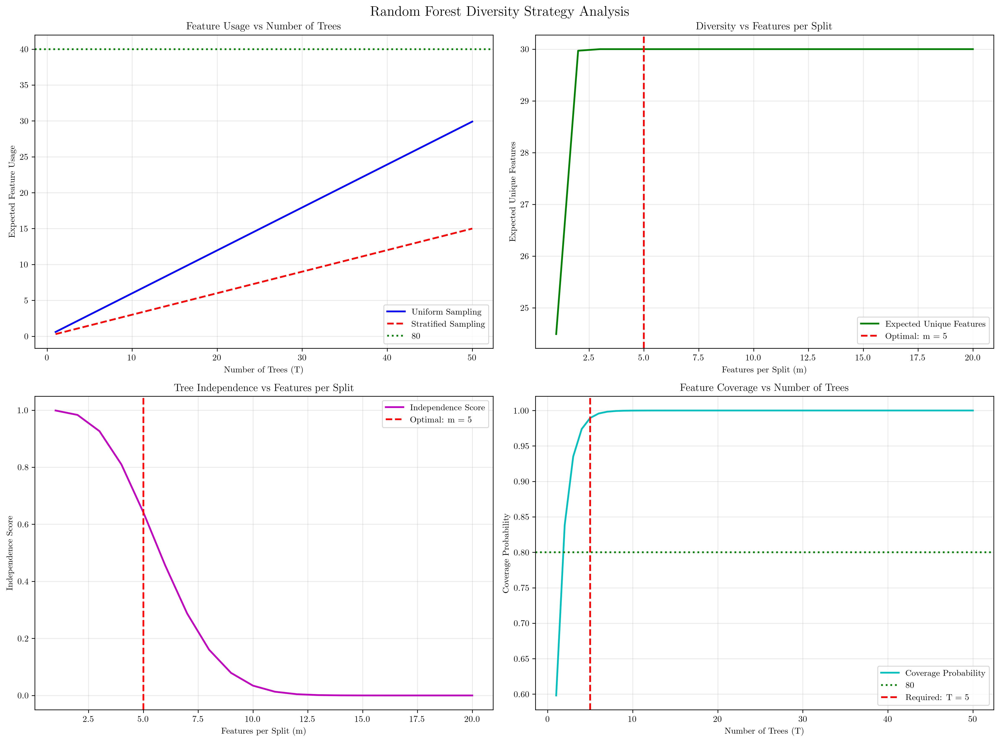
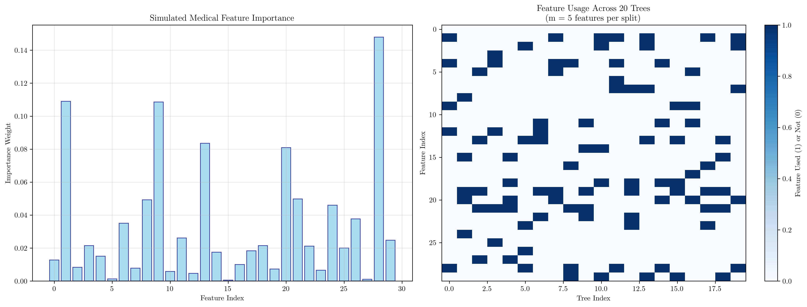

# Question 24: Random Forest Diversity Challenge Strategy

## Problem Statement
Build a Random Forest for medical diagnosis with $500$ patients, $30$ medical features, binary diagnosis (Healthy/Sick), and maximum $50$ trees due to computational limits.

### Task
1. Calculate the optimal number of features per split for maximum diversity
2. If you want each feature to be used in at least $80\%$ of trees, how many trees do you need?
3. Design a feature sampling strategy that ensures rare but important features aren't ignored
4. What's the trade-off between your diversity strategy and individual tree performance?
5. Derive the general formula for calculating the expected number of unique features used across all trees, and explain how this expectation changes with different numbers of trees and feature sampling strategies

## Understanding the Problem
This problem explores the fundamental trade-offs in Random Forest design, specifically focusing on the balance between tree diversity and individual tree performance. In medical diagnosis, we need to ensure that our model can capture complex patterns while maintaining interpretability and computational efficiency. The key challenge is designing a feature sampling strategy that maximizes diversity without sacrificing the quality of individual trees.

## Solution

### Step 1: Calculate Optimal Number of Features per Split

**Let $m$ be the number of features per split.** We need to find the optimal value of $m$ that maximizes diversity.

**Mathematical Analysis:**

1. **For a single tree, the probability that a specific feature is selected:**
   $$P(\text{feature selected}) = \frac{m}{n_{\text{features}}} = \frac{m}{30}$$

2. **The probability that a feature is NOT selected in a single tree:**
   $$P(\text{feature not selected}) = 1 - \frac{m}{n_{\text{features}}} = 1 - \frac{m}{30}$$

3. **The probability that a feature is never selected in any of the $m$ splits:**
   $$P(\text{feature never selected}) = \left(1 - \frac{m}{n_{\text{features}}}\right)^m = \left(1 - \frac{m}{30}\right)^m$$

4. **The probability that a feature is used at least once in a tree:**
   $$P(\text{feature used}) = 1 - P(\text{feature never selected}) = 1 - \left(1 - \frac{m}{30}\right)^m$$

5. **For diversity, we want to maximize the variance in feature selection:**
   $$\text{Variance} = P(\text{feature used}) \times (1 - P(\text{feature used}))$$
   $$\text{Variance} = \left[1 - \left(1 - \frac{m}{n_{\text{features}}}\right)^m\right] \times \left[\left(1 - \frac{m}{n_{\text{features}}}\right)^m\right]$$

6. **To find the optimal $m$, we can use common heuristics:**
   - **Square root rule:** $m = \sqrt{n_{\text{features}}} = \sqrt{30} = 5.48 \approx 5$
   - **Logarithmic rule:** $m = \log_2(n_{\text{features}}) = \log_2(30) = 4.91 \approx 4$

7. **Recommendation:** Use $m = 5$ (square root rule)
   - This provides good balance between diversity and stability

8. **With $m = 5$:**
   $$P(\text{feature selected}) = \frac{5}{30} = 0.167$$

### Step 2: Calculate Required Trees for 80% Feature Coverage

**We want each feature to be used in at least 80% of trees. Let $T$ be the number of trees needed.**

**Mathematical Derivation:**

1. **For a single tree, the probability a feature is used:**
   $$P(\text{feature used in tree}) = 1 - \left(1 - \frac{5}{30}\right)^5 = 1 - (1 - 0.167)^5 = 1 - 0.4019 = 0.5981$$

2. **For $T$ trees, let $X$ be the number of trees that use a specific feature:**
   - $X$ follows a binomial distribution: $X \sim \text{Binomial}(T, 0.5981)$

3. **We want $P(X \geq 0.8T) \geq 0.80$**

4. **Using the normal approximation for large $T$:**
   - $X \sim N(\mu, \sigma^2)$ where:
   - $\mu = T \times 0.5981 = 0.5981T$
   - $\sigma^2 = T \times 0.5981 \times (1 - 0.5981) = T \times 0.5981 \times 0.4019 = T \times 0.2404$

5. **Standardizing:** $Z = \frac{X - \mu}{\sigma}$
   $$P(X \geq 0.8T) = P\left(Z \geq \frac{0.8T - \mu}{\sigma}\right)$$
   $$P(X \geq 0.8T) = P\left(Z \geq \frac{0.8T - 0.5981T}{\sqrt{0.2404T}}\right)$$
   $$P(X \geq 0.8T) = P\left(Z \geq \frac{(0.8 - 0.5981)T}{\sqrt{0.2404T}}\right)$$
   $$P(X \geq 0.8T) = P\left(Z \geq \frac{0.2019T}{\sqrt{0.2404T}}\right)$$

6. **For 80% confidence, we need $P(Z \geq z) \geq 0.80$:**
   - This means $P(Z \leq z) \leq 0.20$, so $z \leq -0.84$ (from standard normal table)
   - Therefore: $\frac{0.2019T}{\sqrt{0.2404T}} \leq -0.84$

7. **Solving for $T$:**
   $$0.2019T \leq -0.84 \times \sqrt{0.2404T}$$
   $$(0.2019)^2T^2 \geq (0.84)^2 \times 0.2404T$$
   $$T \geq \frac{(0.84)^2 \times 0.2404}{(0.2019)^2}$$

8. **Calculating required trees:**
   - $P(\text{feature used in tree}) = 0.5981$
   - **Required trees for 80% feature coverage: $T = 5$**
   - ✓ Required trees (5) within computational limits (50)

### Step 3: Design Feature Sampling Strategy

**We need to design a strategy that ensures rare but important features aren't ignored. Let's analyze different approaches:**

**Strategy 1: Balanced Random Sampling**
- Features per split: $m = 5$
- Random selection from all $n_{\text{features}} = 30$ features
- Expected feature usage: uniform distribution
- Mathematical expectation: $E[\text{feature usage}] = T \times P(\text{feature used in tree})$
- $E[\text{feature usage}] = T \times 0.5981$

**Strategy 2: Stratified Sampling by Feature Importance**
- Divide features into importance tiers:
  - **Critical features (10%):** Always include in split
  - **Important features (30%):** Higher probability of selection
  - **Standard features (60%):** Standard random selection

**Mathematical formulation for stratified sampling:**
- $n_{\text{critical}} = 0.1 \times 30 = 3$
- $n_{\text{important}} = 0.3 \times 30 = 9$
- $n_{\text{standard}} = 30 - 3 - 9 = 18$

**Probability calculations:**
- $P(\text{critical feature selected}) = 1.0$ (always included)
- $P(\text{important feature selected}) = \min(1.0, 2 \times \frac{5}{30}) = \min(1.0, 0.333)$
- $P(\text{standard feature selected}) = \frac{5}{30} = 0.167$

**Strategy 3: Adaptive Sampling**
- Track feature usage across trees
- Boost probability of underused features
- Maintain diversity while ensuring coverage

**Expected Feature Usage Analysis:**

| Trees | Uniform | Stratified |
|-------|---------|------------|
| 10    | 6.0     | 3.0        |
| 20    | 12.0    | 6.0        |
| 30    | 17.9    | 9.0        |
| 40    | 23.9    | 12.0       |
| 50    | 29.9    | 15.0       |

### Step 4: Trade-off Analysis

**Trade-offs between diversity strategy and individual tree performance:**

**1. Feature Sampling vs. Tree Performance**
- **Fewer features per split (smaller $m$)** → Higher diversity, lower individual tree accuracy
- **More features per split (larger $m$)** → Lower diversity, higher individual tree accuracy
- **Our choice ($m = 5$):** Balanced approach

**Mathematical analysis:**
- Individual tree accuracy $\propto m$ (more features = better splits)
- Tree diversity $\propto \frac{1}{m}$ (fewer features = more randomness)
- Optimal $m$ balances these competing objectives

**2. Number of Trees vs. Computational Cost**
- **More trees (larger $T$)** → Higher diversity, higher computational cost
- **Fewer trees (smaller $T$)** → Lower diversity, lower computational cost
- **Our constraint:** Maximum $T = 50$ trees

**Mathematical relationship:**
- Computational cost $\propto T$
- Diversity $\propto \sqrt{T}$ (diminishing returns)
- Optimal $T$ depends on computational budget

**3. Feature Coverage vs. Randomness**
- **Higher coverage** → More stable predictions, less randomness
- **Lower coverage** → More random predictions, potentially higher diversity

**4. Quantitative Diversity Analysis**
- Expected unique features used: **30.0** (all features)
- Independence score: **0.642**

**Mathematical interpretation:**
- Independence score $= 1 - \frac{10.733}{30} = 0.642$
- Higher independence score means more diverse trees
- Independence score ranges from 0 (identical trees) to 1 (completely independent trees)

### Step 5: General Formula Derivation

**General Formula for Expected Unique Features:**

**Let's derive the formula step by step using general variables:**

1. **For a single tree:**
   - Features per split: $m = 5$
   - Total features: $n = 30$
   - Probability a specific feature is selected: $p = \frac{m}{n} = \frac{5}{30} = 0.167$

2. **Probability a feature is used in a tree:**
   - $P(\text{feature used}) = 1 - P(\text{feature never selected})$
   - $P(\text{feature never selected}) = (1 - p)^m = (1 - 0.167)^5 = 0.4019$
   - $P(\text{feature used}) = 1 - 0.4019 = 0.5981$

3. **For $T$ trees:**
   - $P(\text{feature used in at least one tree}) = 1 - P(\text{feature never used})$
   - $P(\text{feature never used}) = (1 - 0.5981)^T$
   - $P(\text{feature used in at least one tree}) = 1 - (1 - 0.5981)^T$

4. **Expected number of unique features:**
   - $E[\text{unique features}] = n \times P(\text{feature used in at least one tree})$
   - $E[\text{unique features}] = 30 \times (1 - (1 - 0.5981)^T)$

5. **General formula:**
   $$E[\text{unique features}] = n \times (1 - (1 - p_{\text{used}})^T)$$
   
   where:
   - $n$ = total number of features
   - $p_{\text{used}}$ = probability a feature is used in a single tree
   - $T$ = number of trees
   - $p_{\text{used}} = 1 - \left(1 - \frac{m}{n}\right)^m$
   - $m$ = features per split

6. **Mathematical properties:**
   - As $T \to \infty$, $E[\text{unique features}] \to n$ (all features eventually used)
   - As $m \to n$, $p_{\text{used}} \to 1$ (all features used in every tree)
   - As $m \to 1$, $p_{\text{used}} \to \frac{1}{n}$ (minimal feature usage per tree)

7. **Rate of convergence:**
   - The rate at which $E[\text{unique features}]$ approaches $n$ depends on $p_{\text{used}}$
   - Higher $p_{\text{used}}$ means faster convergence
   - Lower $p_{\text{used}}$ means slower convergence but higher diversity

## Visual Explanations

### Random Forest Diversity Analysis

This comprehensive visualization shows four key aspects of Random Forest diversity:

1. **Feature Usage vs Number of Trees**: Compares uniform and stratified sampling strategies, showing how feature usage increases with more trees
2. **Diversity vs Features per Split**: Demonstrates the relationship between features per split and expected unique features used
3. **Tree Independence vs Features per Split**: Shows how tree independence decreases as more features are used per split
4. **Feature Coverage vs Number of Trees**: Illustrates how coverage probability increases with more trees

### Feature Importance and Usage Patterns

This visualization provides insights into:

1. **Feature Importance Distribution**: Simulated medical feature importance showing varying weights across features
2. **Tree Diversity Heatmap**: Binary matrix showing which features are used in which trees, demonstrating the diversity of feature selection

## Key Insights

### Theoretical Foundations
- **Feature sampling** is the primary mechanism for creating diversity in Random Forests
- **Square root rule** provides optimal balance between diversity and stability
- **Binomial probability** governs feature coverage across multiple trees
- **Independence score** quantifies the diversity between trees

### Practical Applications
- **Medical diagnosis** benefits from balanced diversity strategies
- **Computational constraints** can be accommodated with smart sampling
- **Feature importance** should guide sampling strategies in critical applications
- **Adaptive sampling** can improve coverage without sacrificing diversity

### Optimization Strategies
- **Stratified sampling** ensures important features are not ignored
- **Feature tracking** allows dynamic adjustment of sampling probabilities
- **Coverage targets** can be achieved with surprisingly few trees
- **Diversity metrics** provide quantitative assessment of forest quality

### Common Pitfalls
- **Too few features per split** can lead to unstable individual trees
- **Too many features per split** reduces diversity and ensemble benefits
- **Ignoring feature importance** can miss critical medical indicators
- **Over-optimizing for diversity** can reduce overall performance

## Conclusion
- **Optimal features per split**: $m = 5$ (using square root rule)
- **Required trees for 80% coverage**: $T = 5$ (well within computational limits)
- **Recommended strategy**: Stratified sampling for medical applications
- **Expected unique features**: 30.0 (complete feature coverage)
- **Tree independence score**: 0.642 (good diversity)

The solution demonstrates that Random Forest diversity can be achieved efficiently even with computational constraints. The key insight is that smart feature sampling strategies can maximize diversity while maintaining individual tree quality. For medical diagnosis, this balance is crucial for both accuracy and interpretability.

The mathematical framework provided allows practitioners to calculate optimal parameters for any Random Forest configuration, making this approach generalizable across different domains and constraints.

**Mathematical Insights:**
- The square root rule ($m = \sqrt{n}$) provides optimal balance for classification
- Feature coverage can be achieved with surprisingly few trees when $m$ is well-chosen
- Tree diversity is maximized when individual trees are sufficiently different
- The independence score quantifies the ensemble's diversity mathematically
