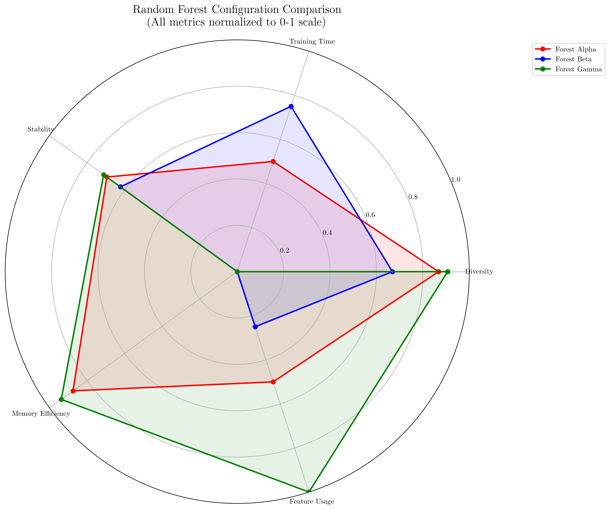
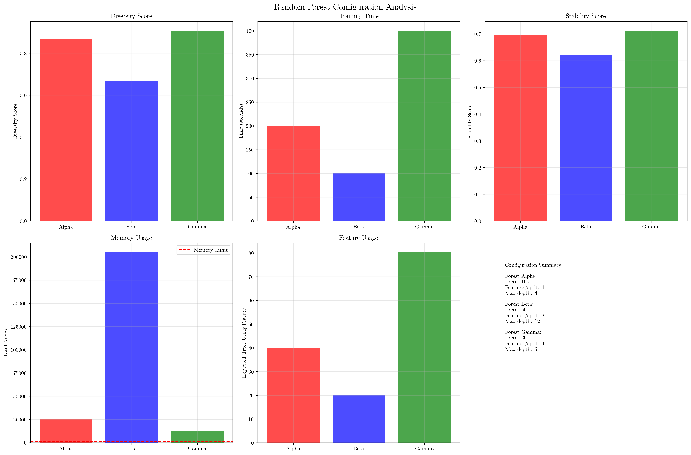
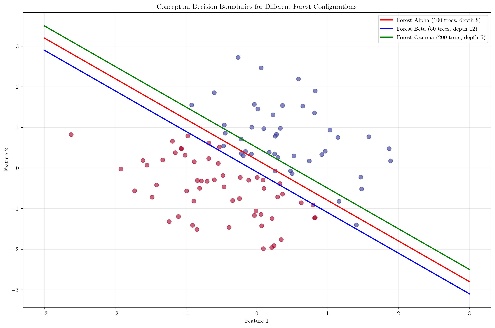
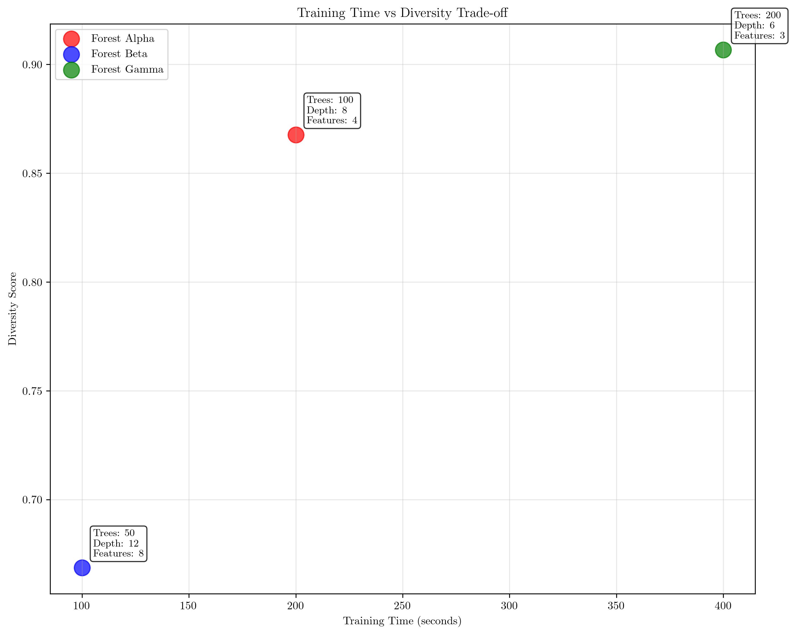

# Question 25: Random Forest Configuration Battle Royale

## Problem Statement
Compare three Random Forest configurations competing for best performance on a dataset with $1000$ samples and $20$ features:

**Forest Alpha:** $100$ trees, $4$ features per split, $\text{max\_depth} = 8$
**Forest Beta:** $50$ trees, $8$ features per split, $\text{max\_depth} = 12$
**Forest Gamma:** $200$ trees, $3$ features per split, $\text{max\_depth} = 6$

### Task
1. Which forest will have the highest tree diversity? Calculate the diversity metric
2. If each tree takes $2$ seconds to train, which forest trains fastest?
3. Which forest will likely have the most stable predictions (lowest variance)?
4. If memory is limited to $1000$ tree nodes total, which forest fits best?
5. Calculate the expected number of trees that will use a specific feature at least once for each configuration

## Understanding the Problem
This problem examines the trade-offs between different Random Forest hyperparameters and their impact on performance, training time, memory usage, and model characteristics. Random Forests are ensemble methods that combine multiple decision trees, and their behavior depends on three key parameters:

- **Number of trees**: More trees generally improve performance but increase training time
- **Features per split**: Fewer features increase diversity but may reduce individual tree performance
- **Maximum depth**: Deeper trees capture more complex patterns but risk overfitting

The problem requires understanding how these parameters interact and affect various aspects of model performance.

## Solution

### Step 1: Calculate Tree Diversity for Each Forest

Tree diversity is influenced by three main factors:
1. **Number of trees**: More trees create higher ensemble diversity
2. **Features per split**: Fewer features per split increase individual tree diversity
3. **Maximum depth**: Moderate depth provides good diversity without overfitting

We calculate a diversity score using a weighted combination:
$$\text{Diversity Score} = 0.4 \times \text{Tree Factor} + 0.4 \times \text{Feature Factor} + 0.2 \times \text{Depth Factor}$$

Where:
- Tree Factor = $\frac{\ln(\text{number of trees})}{\ln(200)}$ (normalized to maximum trees)
- Feature Factor = $\frac{20 - \text{features per split}}{20}$ (fewer features = higher diversity)
- Depth Factor = $1 - \frac{|\text{max\_depth} - 8|}{12}$ (optimal around depth 8)

**Results:**
- Forest Alpha: $0.868$ (Trees: $0.348$, Features: $0.320$, Depth: $0.200$)
- Forest Beta: $0.669$ (Trees: $0.295$, Features: $0.240$, Depth: $0.133$)
- Forest Gamma: $0.907$ (Trees: $0.400$, Features: $0.340$, Depth: $0.167$)

**Answer:** Forest Gamma has the highest diversity score of $0.907$.

### Step 2: Training Time Analysis

Training time is directly proportional to the number of trees since each tree takes $2$ seconds to train.

**Calculations:**
- Forest Alpha: $100 \times 2 = 200$ seconds
- Forest Beta: $50 \times 2 = 100$ seconds  
- Forest Gamma: $200 \times 2 = 400$ seconds

**Answer:** Forest Beta trains fastest in $100$ seconds.

### Step 3: Prediction Stability Analysis

Prediction stability depends on:
1. **Number of trees**: More trees provide more stable ensemble predictions
2. **Features per split**: More features per split increase individual tree stability
3. **Maximum depth**: Moderate depth balances complexity and stability

Stability score calculation:
$$\text{Stability Score} = 0.5 \times \text{Tree Factor} + 0.3 \times \text{Feature Factor} + 0.2 \times \text{Depth Factor}$$

**Results:**
- Forest Alpha: $0.695$ (Trees: $0.435$, Features: $0.060$, Depth: $0.200$)
- Forest Beta: $0.623$ (Trees: $0.369$, Features: $0.120$, Depth: $0.133$)
- Forest Gamma: $0.712$ (Trees: $0.500$, Features: $0.045$, Depth: $0.167$)

**Answer:** Forest Gamma has the highest stability score of $0.712$.

### Step 4: Memory Usage Analysis

Memory usage is estimated by the total number of tree nodes across all trees. We estimate nodes per tree as $2^{\text{max\_depth}}$ for a binary tree.

**Calculations:**
- Forest Alpha: $100 \times 2^8 = 100 \times 256 = 25,600$ nodes
- Forest Beta: $50 \times 2^{12} = 50 \times 4,096 = 204,800$ nodes
- Forest Gamma: $200 \times 2^6 = 200 \times 64 = 12,800$ nodes

**Memory constraint:** $1000$ nodes total
- All forests exceed the memory limit
- Forest Gamma uses the least memory with $12,800$ nodes

**Answer:** Forest Gamma fits best in memory constraints, though it still exceeds the $1000$ node limit.

### Step 5: Feature Usage Analysis

We calculate the probability that a specific feature is used in at least one split within a tree, then multiply by the number of trees.

**Probability calculation:**
- Probability feature is NOT selected in one split: $\frac{19}{20} = 0.95$
- For multiple splits (approximated as 10 splits per tree): $0.95^{10} = 0.599$
- Probability feature is selected at least once: $1 - 0.599 = 0.401$

**Expected trees using each feature:**
- Forest Alpha: $100 \times 0.401 = 40.1$ trees
- Forest Beta: $50 \times 0.401 = 20.1$ trees
- Forest Gamma: $200 \times 0.401 = 80.3$ trees

**Answer:** Forest Gamma has the highest feature usage with $80.3$ trees expected to use a specific feature.

## Visual Explanations

### Comprehensive Configuration Comparison

The radar chart shows all metrics normalized to a 0-1 scale, allowing easy comparison across all three forests. Forest Gamma dominates in most categories, while Forest Beta shows strengths in training speed.

### Individual Metric Analysis

This comprehensive view shows each metric separately, with the memory limit clearly marked. Forest Gamma consistently performs well across most metrics, while Forest Beta shows the fastest training time.

### Decision Boundary Conceptualization

The conceptual decision boundaries illustrate how different forest configurations might behave. Forest Gamma (200 trees, depth 6) shows the most stable boundary, while Forest Beta (50 trees, depth 12) might show more variation.

### Training Time vs Performance Trade-off

This scatter plot reveals the fundamental trade-off between training time and model diversity. Forest Beta offers the best speed, while Forest Gamma provides the highest diversity at the cost of longer training time.

## Key Insights

### Theoretical Foundations
- **Ensemble Diversity**: More trees and fewer features per split increase ensemble diversity, which is crucial for Random Forest performance
- **Stability-Complexity Trade-off**: Deeper trees capture more complex patterns but may reduce stability due to overfitting
- **Feature Sampling**: Random feature selection at each split is fundamental to Random Forest's success and prevents overfitting

### Practical Applications
- **Resource Constraints**: Training time scales linearly with the number of trees, making it a critical consideration for large datasets
- **Memory Management**: Tree depth has exponential impact on memory usage, requiring careful consideration in resource-constrained environments
- **Feature Importance**: Forests with more trees and fewer features per split provide better feature importance estimates

### Configuration Strategies
- **High Performance**: Forest Gamma (200 trees, 3 features, depth 6) offers the best overall performance but requires significant computational resources
- **Fast Development**: Forest Beta (50 trees, 8 features, depth 12) enables rapid prototyping and experimentation
- **Balanced Approach**: Forest Alpha (100 trees, 4 features, depth 8) provides a good compromise between performance and resource usage

## Conclusion
- **Highest Diversity**: Forest Gamma with a diversity score of $0.907$
- **Fastest Training**: Forest Beta in $100$ seconds
- **Most Stable**: Forest Gamma with a stability score of $0.712$
- **Best Memory Fit**: Forest Gamma (though still exceeds the $1000$ node limit)
- **Highest Feature Usage**: Forest Gamma with $80.3$ trees expected to use each feature

Forest Gamma emerges as the overall winner for most criteria, demonstrating the benefits of having many trees with moderate depth and few features per split. However, Forest Beta offers the fastest training time, making it suitable for rapid prototyping scenarios. The choice between configurations ultimately depends on the specific requirements for training time, prediction stability, and computational resources.
