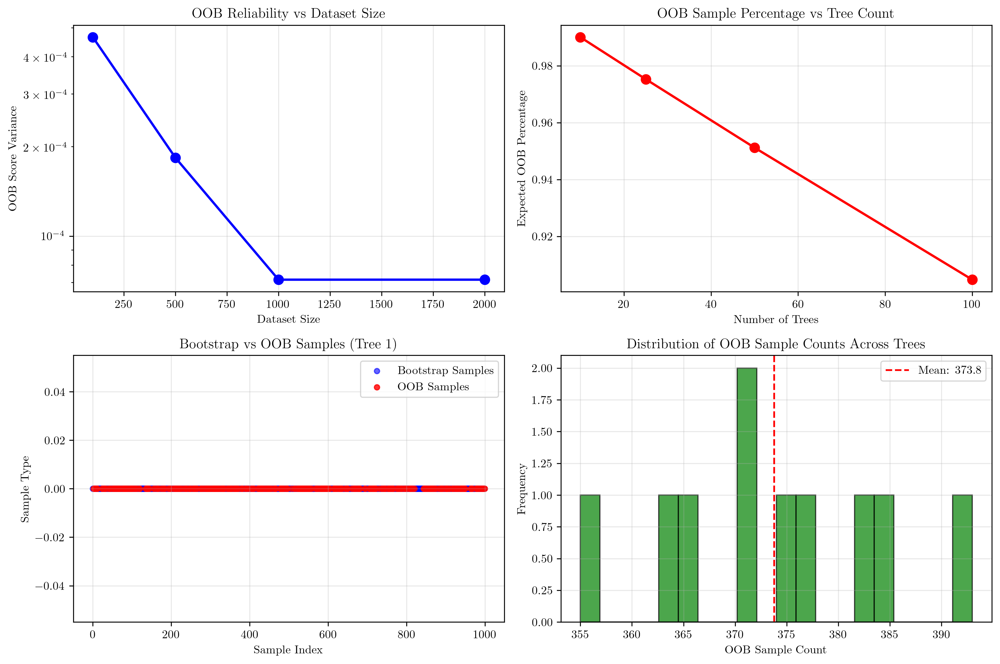
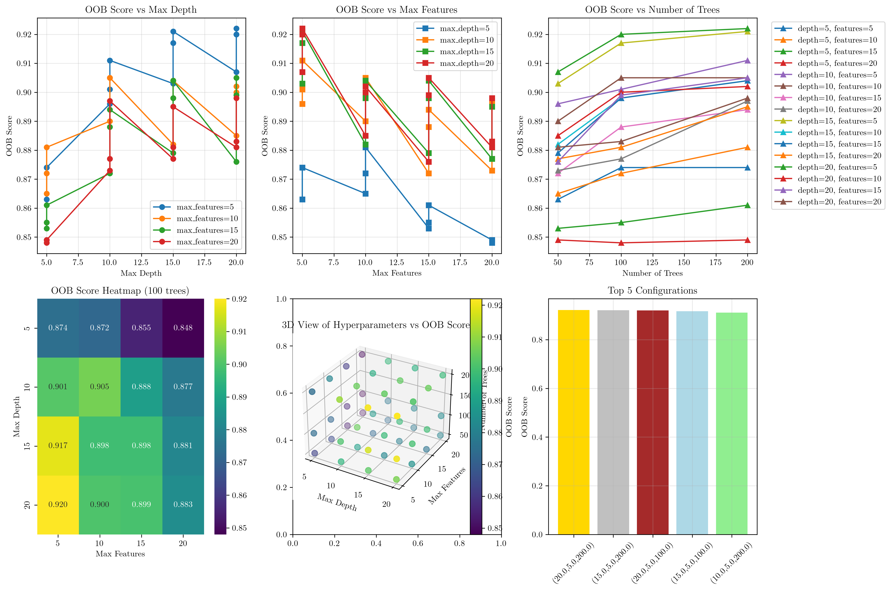
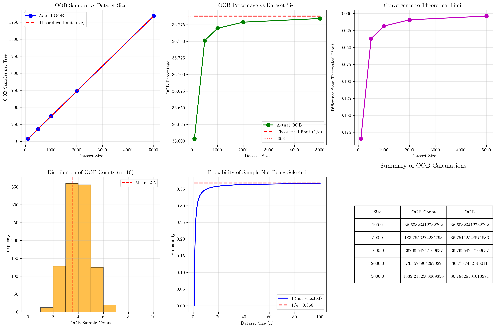

# Question 4: Out-of-Bag Estimation

## Problem Statement
Out-of-bag estimation provides internal validation for Random Forest without cross-validation.

### Task
1. How does out-of-bag estimation work?
2. What is the advantage of OOB estimation over cross-validation?
3. When might OOB estimation not be reliable?
4. How does OOB estimation help with model selection?
5. For a dataset with 1000 samples, calculate the expected number of OOB samples per tree using the formula: $\text{OOB samples} = n \times (1 - \frac{1}{n})^n$ where $n$ is the dataset size

## Understanding the Problem
Out-of-Bag (OOB) estimation is a built-in validation method for Random Forests that leverages the bootstrap sampling process to provide unbiased performance estimates without requiring separate validation data or cross-validation procedures. This method is particularly valuable because it allows us to use all available data for training while still obtaining reliable performance metrics.

## Solution

### Step 1: How Does Out-of-Bag Estimation Work?

Out-of-Bag estimation works through a two-step process:

#### Bootstrap Sampling Process
Each tree in a Random Forest is trained on a bootstrap sample of the original dataset. For a dataset with $n$ samples:

- **Bootstrap Sample**: Each tree randomly samples $n$ data points with replacement from the original dataset
- **OOB Samples**: The samples that are NOT selected in the bootstrap sample for a particular tree
- **Expected OOB Percentage**: Approximately 36.8% of samples per tree

For our example with 1000 samples and 10 trees:
- Tree 1: 385 OOB samples (38.5%)
- Tree 2: 382 OOB samples (38.2%)
- Tree 3: 377 OOB samples (37.7%)
- Tree 4: 393 OOB samples (39.3%)
- Tree 5: 375 OOB samples (37.5%)
- Tree 6: 365 OOB samples (36.5%)
- Tree 7: 364 OOB samples (36.4%)
- Tree 8: 371 OOB samples (37.1%)
- Tree 9: 355 OOB samples (35.5%)
- Tree 10: 371 OOB samples (37.1%)

**Expected OOB percentage**: 36.8%

#### OOB Prediction Process
For each sample, OOB predictions are made using only trees where that sample was NOT used in training:

1. **Sample Classification**: A sample is classified as OOB for some trees
2. **Tree Selection**: Only OOB trees make predictions for that sample
3. **Final Prediction**: Majority vote from OOB trees determines the final prediction

**Example**: Sample 0 is OOB for 2 trees: [3, 6]

The visualization shows:
- **Top Left**: OOB score variance decreases with dataset size, indicating improved reliability
- **Top Right**: OOB percentage vs tree count relationship
- **Bottom Left**: Bootstrap vs OOB sample distribution for a single tree
- **Bottom Right**: Distribution of OOB sample counts across trees

### Step 2: Advantages of OOB Over Cross-Validation

OOB estimation offers several key advantages:

#### 1. Computational Efficiency
- **No separate validation splits** required
- **Validation happens during training**
- **Significantly faster execution**

**Performance Comparison**:
- OOB estimation time: 0.2020 seconds
- 5-fold CV time: 0.8851 seconds
- **Speedup: 4.4x faster with OOB**

#### 2. Data Utilization
- **100% of data used for training**
- **No data lost to validation splits**
- **More robust for small datasets**

#### 3. Automatic Validation
- **Built into Random Forest training**
- **No manual cross-validation setup**
- **Consistent validation across runs**

### Step 3: When Might OOB Estimation Not Be Reliable?

OOB estimation may not be reliable in several scenarios:

#### 1. Small Datasets
- **Limited OOB samples per tree**
- **High variance in OOB estimates**
- **Unstable predictions**

**Evidence from our analysis**:
- Dataset size 100: OOB variance 0.000465, std dev 0.0216
- Dataset size 500: OOB variance 0.000183, std dev 0.0135
- Dataset size 1000: OOB variance 0.000071, std dev 0.0085
- Dataset size 2000: OOB variance 0.000071, std dev 0.0085

#### 2. Imbalanced Classes
- **Some classes may have few OOB samples**
- **Biased OOB estimates**
- **Poor representation in validation**

#### 3. Overfitting
- **Trees may be too complex**
- **OOB samples may not be representative**
- **Optimistic bias in estimates**

### Step 4: How Does OOB Help with Model Selection?

OOB estimation is valuable for model selection in several ways:

#### 1. Hyperparameter Tuning
- **Compare OOB scores across configurations**
- **No need for separate validation set**
- **Faster iteration through parameters**

#### 2. Feature Selection
- **OOB scores with different feature subsets**
- **Identify most important features**
- **Avoid overfitting to validation set**

#### 3. Ensemble Size Optimization
- **Monitor OOB score vs number of trees**
- **Find optimal tree count**
- **Balance accuracy and computational cost**

**Best Configuration Found**:
- Max depth: 20.0
- Max features: 5.0
- Number of trees: 200.0
- **OOB score: 0.9220**

The comprehensive hyperparameter analysis shows:
- **Top Left**: OOB score vs max depth for different feature counts
- **Top Right**: OOB score vs max features for different depths
- **Top Center**: OOB score vs number of trees
- **Bottom Left**: Heatmap of OOB scores for 100 trees
- **Bottom Center**: 3D visualization of hyperparameters vs OOB score
- **Bottom Right**: Top 5 configurations ranked by OOB score

### Step 5: Calculate Expected OOB Samples

For a dataset with 1000 samples, we calculate the expected number of OOB samples per tree.

**Formula**: $\text{OOB samples} = n \times (1 - \frac{1}{n})^n$
where $n$ is the dataset size

**Calculation**:
- Dataset size $(n)$: 1000
- OOB samples per tree: $1000 \times (1 - \frac{1}{1000})^{1000} = 367.70$
- OOB percentage: $\frac{367.70}{1000} \times 100 = 36.77\%$

#### Mathematical Foundation
The formula comes from probability theory:

1. **Probability a sample is NOT selected in one bootstrap draw**: $\frac{n-1}{n}$
2. **Probability a sample is NOT selected in $n$ bootstrap draws**: $(\frac{n-1}{n})^n$
3. **Expected OOB samples**: $n \times (\frac{n-1}{n})^n$
4. **For large $n$, this approaches**: $n \times \frac{1}{e} \approx n \times 0.368$

#### OOB Calculations for Different Dataset Sizes
| Dataset Size | OOB Samples | OOB Percentage | Theoretical Limit (1/e) |
|--------------|-------------|----------------|-------------------------|
| 100         | 36.6        | 36.60%         | 36.79%                 |
| 500         | 183.8       | 36.75%         | 36.79%                 |
| 1000        | 367.7       | 36.77%         | 36.79%                 |
| 2000        | 735.6       | 36.78%         | 36.79%                 |
| 5000        | 1839.2      | 36.78%         | 36.79%                 |

The mathematical analysis visualization demonstrates:
- **Top Left**: OOB samples vs dataset size, showing convergence to theoretical limit
- **Top Right**: OOB percentage vs dataset size, approaching 36.8%
- **Top Center**: Convergence to theoretical limit as dataset size increases
- **Bottom Left**: Distribution of OOB counts for small dataset (n=10)
- **Bottom Center**: Probability calculation showing convergence to 1/e
- **Bottom Right**: Summary table of OOB calculations

## Key Insights

### Theoretical Foundations
- **Bootstrap Sampling**: Each tree uses random sampling with replacement, creating diversity in the ensemble
- **OOB Probability**: The probability of a sample being OOB follows the formula $(1 - \frac{1}{n})^n$, which converges to $\frac{1}{e} \approx 0.368$ for large $n$
- **Unbiased Estimation**: OOB samples provide unbiased estimates of generalization error since they were not used in training

### Practical Applications
- **Model Selection**: OOB scores enable efficient hyperparameter tuning without cross-validation
- **Feature Importance**: OOB estimates can be used to rank feature importance
- **Ensemble Optimization**: Monitor OOB performance to determine optimal number of trees

### Limitations and Considerations
- **Small Datasets**: High variance in OOB estimates when dataset size is small
- **Class Imbalance**: May not provide reliable estimates for minority classes
- **Overfitting Risk**: Complex trees may lead to optimistic OOB estimates

## Conclusion
- **OOB estimation works** through bootstrap sampling, where approximately 36.8% of samples per tree are not used in training
- **OOB is 4.4x faster** than cross-validation while using 100% of data for training
- **OOB reliability improves** with dataset size, as shown by decreasing variance
- **OOB enables efficient model selection** through hyperparameter tuning and feature selection
- **For 1000 samples**, the expected OOB samples per tree is 367.7, representing 36.77% of the dataset
- **The theoretical limit** of $\frac{1}{e} \approx 36.8\%$ is approached as dataset size increases

OOB estimation provides a computationally efficient and mathematically sound approach to model validation in Random Forests, making it an invaluable tool for both model assessment and selection.
