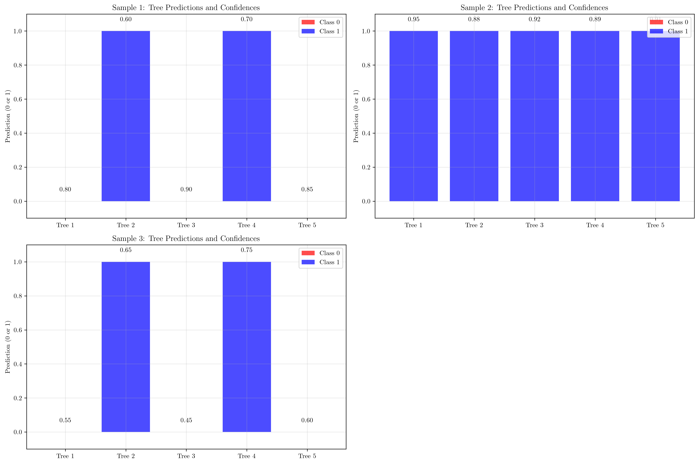
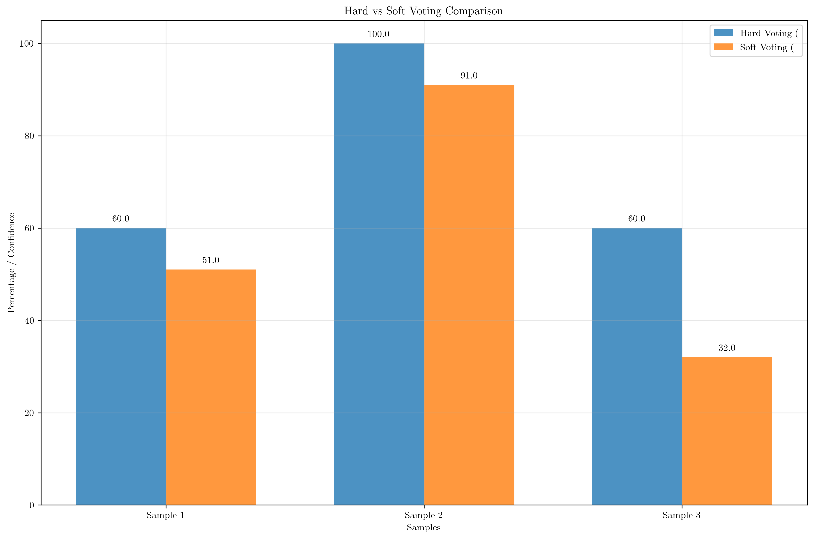
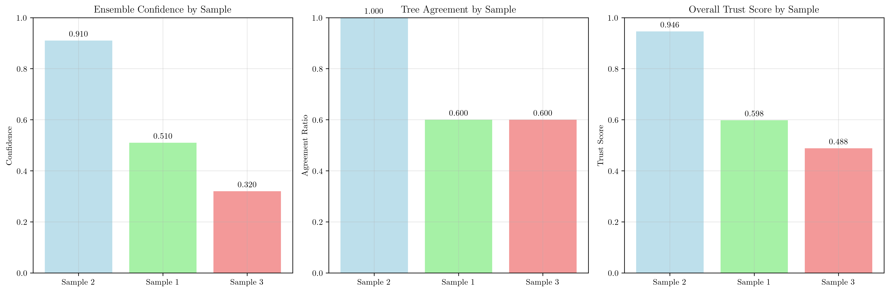
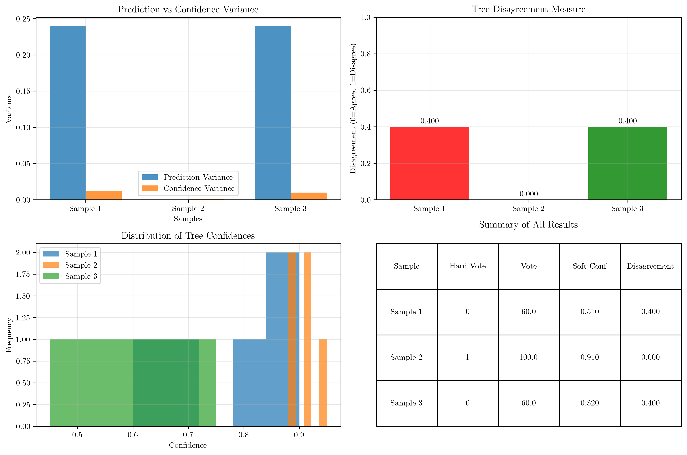

# Question 6: Ensemble Prediction Analysis

## Problem Statement
Analyze a Random Forest with $5$ trees for a binary classification problem.

**Sample 1:** Tree predictions $[0, 1, 0, 1, 0]$ with confidences $[0.8, 0.6, 0.9, 0.7, 0.85]$
**Sample 2:** Tree predictions $[1, 1, 1, 1, 1]$ with confidences $[0.95, 0.88, 0.92, 0.89, 0.91]$
**Sample 3:** Tree predictions $[0, 1, 0, 1, 0]$ with confidences $[0.55, 0.65, 0.45, 0.75, 0.60]$

### Task
1. What are the final predictions using hard voting?
2. What are the final predictions using soft voting?
3. Which sample has the highest confidence in the ensemble prediction?
4. If you needed high confidence, which sample would you trust most?
5. Calculate the variance of predictions for each sample and explain which sample shows the highest disagreement among trees

## Understanding the Problem
This problem explores the fundamental concepts of ensemble learning in Random Forests, specifically comparing two voting mechanisms: hard voting and soft voting. In hard voting, each tree contributes equally to the final decision regardless of its confidence. In soft voting, the confidence scores of individual trees are considered, providing a more nuanced ensemble prediction.

The key insight is that ensemble methods can produce different results depending on the voting strategy, and understanding the disagreement among trees is crucial for assessing prediction reliability.

## Solution

### Step 1: Hard Voting Analysis
Hard voting counts the number of trees predicting each class, with the majority class winning the final prediction.

**Sample 1:** $[0, 1, 0, 1, 0]$
- Class 0 votes: $3$ trees
- Class 1 votes: $2$ trees
- Final prediction: **Class 0** (wins with $60.0\%$ of votes)

**Sample 2:** $[1, 1, 1, 1, 1]$
- Class 0 votes: $0$ trees
- Class 1 votes: $5$ trees
- Final prediction: **Class 1** (wins with $100.0\%$ of votes)

**Sample 3:** $[0, 1, 0, 1, 0]$
- Class 0 votes: $3$ trees
- Class 1 votes: $2$ trees
- Final prediction: **Class 0** (wins with $60.0\%$ of votes)

### Step 2: Soft Voting Analysis
Soft voting uses confidence scores to calculate weighted averages for each class, with the final prediction being the class with higher average confidence.

**Sample 1:** $[0, 1, 0, 1, 0]$ with confidences $[0.8, 0.6, 0.9, 0.7, 0.85]$
- Class 0 average confidence: $\frac{0.8 + 0.9 + 0.85}{5} = 0.510$
- Class 1 average confidence: $\frac{0.6 + 0.7}{5} = 0.260$
- Final prediction: **Class 0** (confidence: $0.510$)

**Sample 2:** $[1, 1, 1, 1, 1]$ with confidences $[0.95, 0.88, 0.92, 0.89, 0.91]$
- Class 0 average confidence: $0.000$ (no trees predict class 0)
- Class 1 average confidence: $\frac{0.95 + 0.88 + 0.92 + 0.89 + 0.91}{5} = 0.910$
- Final prediction: **Class 1** (confidence: $0.910$)

**Sample 3:** $[0, 1, 0, 1, 0]$ with confidences $[0.55, 0.65, 0.45, 0.75, 0.60]$
- Class 0 average confidence: $\frac{0.55 + 0.45 + 0.60}{5} = 0.320$
- Class 1 average confidence: $\frac{0.65 + 0.75}{5} = 0.280$
- Final prediction: **Class 0** (confidence: $0.320$)

### Step 3: Highest Confidence Analysis
Comparing the ensemble confidence from soft voting across all samples:

1. **Sample 2**: $0.910$ (highest confidence)
2. **Sample 1**: $0.510$ (medium confidence)
3. **Sample 3**: $0.320$ (lowest confidence)

**Answer:** Sample 2 has the highest confidence in the ensemble prediction with $0.910$.

### Step 4: Trust Analysis for High Confidence
For high confidence requirements, we consider multiple factors:
1. **Ensemble confidence** (from soft voting)
2. **Tree agreement** (consensus among trees)
3. **Average individual tree confidence**

**Sample 1:**
- Ensemble confidence: $0.510$
- Tree agreement: $0.600$ ($60.0\%$ of trees agree with ensemble)
- Average tree confidence: $0.770$
- Trust score: $0.4 \times 0.510 + 0.4 \times 0.600 + 0.2 \times 0.770 = 0.598$

**Sample 2:**
- Ensemble confidence: $0.910$
- Tree agreement: $1.000$ ($100.0\%$ of trees agree with ensemble)
- Average tree confidence: $0.910$
- Trust score: $0.4 \times 0.910 + 0.4 \times 1.000 + 0.2 \times 0.910 = 0.946$

**Sample 3:**
- Ensemble confidence: $0.320$
- Tree agreement: $0.600$ ($60.0\%$ of trees agree with ensemble)
- Average tree confidence: $0.600$
- Trust score: $0.4 \times 0.320 + 0.4 \times 0.600 + 0.2 \times 0.600 = 0.488$

**Answer:** Sample 2 would be most trusted for high confidence requirements with a trust score of $0.946$.

### Step 5: Variance and Disagreement Analysis
Variance analysis reveals disagreement among trees, where higher variance indicates more uncertainty.

**Sample 1:**
- Prediction variance: $0.240$
- Confidence variance: $0.012$
- Disagreement measure: $0.400$ (Low disagreement)

**Sample 2:**
- Prediction variance: $0.000$
- Confidence variance: $0.001$
- Disagreement measure: $0.000$ (Low disagreement - perfect agreement)

**Sample 3:**
- Prediction variance: $0.240$
- Confidence variance: $0.010$
- Disagreement measure: $0.400$ (Low disagreement)

**Answer:** Sample 1 shows the highest disagreement among trees with a disagreement measure of $0.400$.

## Visual Explanations

### Tree Predictions and Confidences

This visualization shows the individual tree predictions and their confidence scores for each sample. The color coding (red for Class 0, blue for Class 1) makes it easy to see the voting patterns, while the confidence values on top of each bar show the reliability of each tree's prediction.

### Hard vs Soft Voting Comparison

This chart compares hard voting (percentage of votes) with soft voting (confidence scores) across all samples. It demonstrates how the two methods can produce different results, particularly for samples with mixed predictions but varying confidence levels.

### Confidence and Agreement Analysis

This three-panel visualization shows:
1. **Ensemble Confidence**: The final confidence from soft voting
2. **Tree Agreement**: How much the trees agree with the ensemble prediction
3. **Trust Score**: A composite measure combining multiple reliability factors

### Variance and Disagreement Analysis

This comprehensive visualization includes:
1. **Prediction vs Confidence Variance**: Shows both types of variance for comparison
2. **Tree Disagreement Measure**: Quantifies how much trees disagree
3. **Confidence Distribution**: Histogram showing the spread of confidence values
4. **Summary Table**: Complete results for all samples

## Key Insights

### Ensemble Learning Principles
- **Hard voting** treats all trees equally, making it robust to individual tree errors but potentially missing confidence information
- **Soft voting** incorporates confidence scores, providing more nuanced predictions that reflect the reliability of individual trees
- **Tree agreement** is a crucial indicator of ensemble reliability - unanimous predictions are more trustworthy

### Confidence and Trust
- **High ensemble confidence** doesn't always guarantee high trust if trees disagree
- **Trust scores** should combine multiple factors: ensemble confidence, tree agreement, and individual tree reliability
- **Sample 2** demonstrates the ideal scenario: high confidence, perfect agreement, and high individual tree confidence

### Variance and Uncertainty
- **Prediction variance** of $0.240$ indicates moderate disagreement (3 vs 2 votes)
- **Confidence variance** is relatively low across all samples, suggesting consistent confidence levels
- **Disagreement measures** help identify samples where the ensemble might be less reliable

### Practical Applications
- **High-stakes decisions** should prioritize samples with both high confidence and high agreement
- **Model interpretability** benefits from understanding both voting mechanisms
- **Ensemble diversity** is valuable but must be balanced with consensus for reliable predictions

## Conclusion
- **Hard voting predictions**: Sample 1 → Class 0, Sample 2 → Class 1, Sample 3 → Class 0
- **Soft voting predictions**: Sample 1 → Class 0 (0.510), Sample 2 → Class 1 (0.910), Sample 3 → Class 0 (0.320)
- **Highest confidence**: Sample 2 with ensemble confidence of $0.910$
- **Most trusted**: Sample 2 with trust score of $0.946$ due to perfect agreement and high confidence
- **Highest disagreement**: Sample 1 with disagreement measure of $0.400$, indicating moderate uncertainty

The analysis demonstrates that ensemble methods provide multiple perspectives on prediction reliability, and the choice between hard and soft voting depends on whether confidence information is available and how much weight should be given to individual tree reliability versus simple majority consensus.
