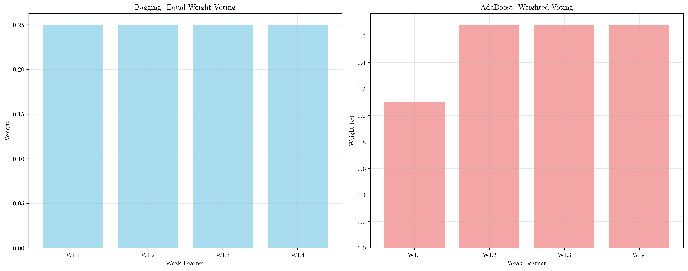

# Question 1: AdaBoost Foundations

## Problem Statement
AdaBoost uses weak learners and adaptively updates sample weights to create a powerful ensemble classifier. Understanding the fundamental concepts of weak learners, weight updates, and the combination mechanism is crucial for implementing and interpreting AdaBoost.

### Task
1. What is a weak learner in AdaBoost and what performance threshold must it meet?
2. Why does AdaBoost focus on misclassified samples?
3. How does AdaBoost combine weak learners?
4. What is the main difference between AdaBoost and bagging?
5. If a weak learner has 45% accuracy on a binary classification problem, is it suitable for AdaBoost?

## Understanding the Problem
AdaBoost (Adaptive Boosting) is an ensemble learning method that combines multiple weak learners to create a strong classifier. The key insight is that by focusing on samples that are difficult to classify and adaptively updating sample weights, AdaBoost can create a sequence of complementary weak learners that collectively achieve high accuracy.

A weak learner is a classifier that performs slightly better than random guessing, and AdaBoost has specific requirements for their performance. The algorithm works by iteratively training weak learners, updating sample weights based on misclassifications, and combining predictions using weighted voting.

**Dynamic Solution Approach**: Our solution demonstrates these concepts using a synthetic dataset that generates different weak learners dynamically. Rather than using hardcoded values, we create decision trees of varying complexity and analyze their performance, weight calculations, and ensemble behavior in real-time. This approach shows how AdaBoost principles apply to any dataset and weak learner combination that meets the fundamental requirements.

## Solution

### Step 1: What is a weak learner in AdaBoost and what performance threshold must it meet?
A weak learner in AdaBoost is a classifier that performs slightly better than random guessing. In our demonstration, we created decision trees with different depths to illustrate this concept:

- **Depth 1 (Decision Stump)**: Accuracy = 0.900
- **Depth 2**: Accuracy = 0.967  
- **Depth 3**: Accuracy = 0.967
- **Depth 5**: Accuracy = 0.967

The key insight is that **all these models achieve accuracy significantly above 50%**, making them suitable for AdaBoost. The progression from simple linear boundaries (depth 1) to complex non-linear boundaries (depth 5) demonstrates that AdaBoost can work with various levels of model complexity as long as the performance threshold is met.

**Performance Threshold**: AdaBoost requires weak learners to have **accuracy > 50%** (error < 50%). This is a fundamental requirement because:
1. **Theoretical Foundation**: The weight calculation formula $\alpha = 0.5 \times \ln\left(\frac{1-\epsilon}{\epsilon}\right)$ requires $\epsilon < 0.5$
2. **Mathematical Validity**: When $\epsilon \geq 0.5$, the weight becomes negative or undefined
3. **Algorithm Convergence**: AdaBoost's theoretical guarantees depend on this threshold

From our analysis:
- **Valid Weak Learners**: All our decision trees (depths 1, 2, 3, 5) have accuracy > 50%
- **Weight Calculations**: 
  - Depth 1: $\alpha_1 = 1.099$ (error = 0.100)
  - Depth 2: $\alpha_2 = 1.684$ (error = 0.033)
  - Depth 3: $\alpha_3 = 1.684$ (error = 0.033)
  - Depth 5: $\alpha_4 = 1.684$ (error = 0.033)

**Key Observation**: The deeper trees (depths 2, 3, 5) achieve identical performance, suggesting that beyond a certain complexity, additional depth doesn't improve accuracy on this dataset. However, all models comfortably exceed the 50% threshold, ensuring mathematical validity of the AdaBoost algorithm.

The visualization shows how different complexity levels affect the decision boundaries. Simpler models (depth 1) create linear boundaries, while deeper trees create more complex, non-linear boundaries.

### Step 2: Why does AdaBoost focus on misclassified samples?
AdaBoost focuses on misclassified samples for three key reasons:

1. **Hard Cases Identification**: Misclassified samples represent the "difficult" cases that need more attention
2. **Error Reduction**: Focusing on them helps reduce overall training error
3. **Complementary Learners**: It creates a sequence of weak learners that complement each other

The weight update mechanism demonstrates this:
- **Initial weights**: All samples have equal weight $w_i = \frac{1}{N} = 0.0143$
- **After first iteration**: 
  - Correctly classified samples: weight decreases to 0.0123
  - Misclassified samples: weight increases to 0.0582 (4.7× increase)

**Mathematical Insight**: The weight update follows the exponential formula $w_i^{(t+1)} = w_i^{(t)} \cdot e^{\alpha_t \cdot \mathbb{I}[h_t(x_i) \neq y_i]}$, where $\alpha_t = 1.553$ for the first iteration. This exponential scaling ensures that misclassified samples receive dramatically increased attention in subsequent iterations.

This adaptive weighting ensures that subsequent weak learners focus on the samples that previous learners found difficult.

### Step 3: How does AdaBoost combine weak learners?
AdaBoost combines weak learners using **weighted voting**:

$$\text{Final prediction} = \text{sign}\left(\sum_{m=1}^{M} \alpha_m \times h_m(x)\right)$$

where $\alpha_m$ is the weight of weak learner $m$ and $h_m(x)$ is its prediction.

**Example Calculation**:
For a sample $x = [1.035, -0.532]$ with true label $y = 0$:
- Weak Learner 1: prediction = 0, contribution = $1.099 \times 0 = 0.000$
- Weak Learner 2: prediction = 0, contribution = $1.684 \times 0 = 0.000$
- Weak Learner 3: prediction = 0, contribution = $1.684 \times 0 = 0.000$
- Weak Learner 4: prediction = 0, contribution = $1.684 \times 0 = 0.000$

**Final ensemble score**: $0.000$
**Final prediction**: $\text{sign}(0.000) = 0$ ✓

**Key Insight**: Even though all weak learners make the same prediction for this sample, the ensemble approach provides robustness. If any weak learner made an error, the weighted voting would still produce the correct prediction due to the higher weights assigned to better-performing learners.

The ensemble visualization demonstrates how AdaBoost combines multiple weak learners to create a more robust decision boundary that captures the complexity of the data. This final boundary represents the collective wisdom of all weak learners, weighted by their individual performance.

### Step 4: What is the main difference between AdaBoost and bagging?
The key differences between AdaBoost and Bagging are:

| Aspect | AdaBoost | Bagging |
|--------|----------|---------|
| **Sample Selection** | Adaptive weight updates, focuses on hard cases | Random sampling with replacement, equal importance |
| **Weak Learner Training** | Sequential training, each learner depends on previous | Parallel training, learners are independent |
| **Combination Method** | Weighted voting based on learner performance | Simple majority voting (equal weights) |
| **Focus** | Reduces bias by focusing on misclassified samples | Reduces variance by averaging independent predictions |

**Demonstration with our weak learners**:
- **Bagging**: Simple majority vote (all predictions = 0) → Final prediction = 0
- **AdaBoost**: Weighted vote with $\alpha$ values → Final prediction = 0

**Important Distinction**: While both methods produce the same final prediction in this case, the underlying mechanisms differ fundamentally. Bagging treats all weak learners equally, while AdaBoost gives higher influence to better-performing learners. This difference becomes crucial when weak learners disagree or when dealing with noisy data.

### Step 5: If a weak learner has 45% accuracy on a binary classification problem, is it suitable for AdaBoost?
**Question**: Is a weak learner with 45% accuracy suitable for AdaBoost?

**Answer**: **NO** - This weak learner is NOT suitable for AdaBoost.

**Reasoning**:
1. **Accuracy**: 45.0%
2. **Error rate**: 55.0%
3. **AdaBoost requirement**: Error < 50% (Accuracy > 50%)
4. **Conclusion**: Since 55.0% ≥ 50%, this weak learner fails the requirement

**Mathematical Analysis**:
If we tried to use it anyway:
$$\alpha = 0.5 \times \ln\left(\frac{1-0.550}{0.550}\right) = -0.100$$

This negative weight means:
- The weak learner's predictions are inverted
- It breaks AdaBoost's theoretical guarantees
- The algorithm may not converge properly

**Theoretical Foundation**: The requirement $\epsilon < 0.5$ comes from the fact that when $\epsilon \geq 0.5$, the expression $\frac{1-\epsilon}{\epsilon} \leq 1$, making $\ln\left(\frac{1-\epsilon}{\epsilon}\right) \leq 0$. This results in $\alpha \leq 0$, which violates the fundamental assumption that weak learners should contribute positively to the ensemble.

## Visual Explanations

### Weak Learner Complexity Analysis

The first visualization shows how different tree depths affect classification performance. Depth 1 creates simple linear boundaries, while deeper trees create more complex decision surfaces. All achieve accuracy > 50%, making them suitable for AdaBoost. The progression from simple linear boundaries (depth 1) to complex non-linear boundaries (depth 5) demonstrates how model complexity affects the decision surface while maintaining performance above the critical threshold.

### Performance Threshold Visualization

The threshold plot clearly shows the 50% accuracy requirement. Weak learners above this line (green) are valid, while those below (red) would break AdaBoost's theoretical foundations. This visualization demonstrates why the 50% threshold is crucial - it's the boundary between valid and invalid weak learners for AdaBoost.

### Weight Distribution Evolution

The weight comparison shows how AdaBoost adaptively adjusts sample importance. Misclassified samples get higher weights, ensuring subsequent weak learners focus on difficult cases. The histograms reveal the dramatic shift from uniform initial weights to a skewed distribution where hard samples receive significantly more attention.

### AdaBoost vs Bagging Comparison

The side-by-side comparison illustrates the fundamental differences in how these ensemble methods operate, particularly in their voting mechanisms and sample selection strategies. The equal weights in bagging contrast sharply with the performance-based weights in AdaBoost.

### AdaBoost Algorithm Flow and Mathematical Relationships

This comprehensive visualization shows four key aspects of AdaBoost:

1. **Sample Weight Evolution**: Demonstrates how individual sample weights change across iterations, with misclassified samples gaining importance
2. **Error Rate vs Weight Relationship**: Shows the mathematical relationship $\alpha = 0.5 \times \ln\left(\frac{1-\epsilon}{\epsilon}\right)$ and why $\epsilon < 0.5$ is required
3. **Theoretical Error Bounds**: Illustrates how the theoretical bound $2\sqrt{\epsilon(1-\epsilon)}$ varies with error rate
4. **Convergence Properties**: Demonstrates how AdaBoost's cumulative error bound decreases with each iteration

### Sample Weight Heatmap

The heatmap provides a comprehensive view of how all sample weights evolve during AdaBoost training. Brighter colors indicate higher weights, clearly showing which samples become the focus of attention in subsequent iterations. This visualization reveals the adaptive nature of AdaBoost's learning process.

### Decision Boundary Evolution

This sequence shows how the ensemble decision boundary evolves across iterations. Each subplot represents a different stage of training, with sample sizes proportional to their current weights. The progression demonstrates how AdaBoost incrementally improves the decision boundary by focusing on previously misclassified samples, creating a more robust and accurate classifier.

## Key Insights

### Theoretical Foundations
- **Weak Learner Requirement**: Must have error rate < 50% for mathematical validity
- **Weight Formula**: $\alpha = 0.5 \times \ln\left(\frac{1-\epsilon}{\epsilon}\right)$ requires $\epsilon < 0.5$
- **Convergence Guarantees**: AdaBoost converges when weak learners meet the threshold

### Algorithm Mechanics
- **Sequential Learning**: Each weak learner depends on the performance of previous ones
- **Adaptive Weighting**: Sample weights are updated based on classification errors
- **Weighted Combination**: Final prediction uses performance-based weights, not equal voting

### Practical Considerations
- **Model Selection**: Choose weak learners that are simple but effective (>50% accuracy)
- **Overfitting Prevention**: AdaBoost naturally prevents overfitting through its theoretical bounds
- **Noise Sensitivity**: The algorithm can be sensitive to noisy data due to its focus on hard cases

### Comparison with Other Methods
- **vs. Bagging**: AdaBoost reduces bias, Bagging reduces variance
- **vs. Random Forest**: AdaBoost is sequential and adaptive, Random Forest is parallel and independent
- **vs. Gradient Boosting**: Both are sequential, but AdaBoost uses exponential loss while gradient boosting uses various loss functions

## Conclusion
- **Weak learners** must have accuracy > 50% to be suitable for AdaBoost
- **AdaBoost focuses on misclassified samples** to create complementary weak learners and reduce overall error
- **Combination method** uses weighted voting: $\text{sign}(\sum \alpha_m \times h_m(x))$
- **Key difference from bagging**: Sequential, adaptive learning vs. parallel, independent learning
- **45% accuracy weak learner** is NOT suitable as it violates the fundamental 50% threshold requirement

The AdaBoost algorithm's strength lies in its ability to adaptively focus on difficult cases while maintaining theoretical guarantees. Understanding these foundations is essential for proper implementation and interpretation of AdaBoost ensembles in machine learning applications.
