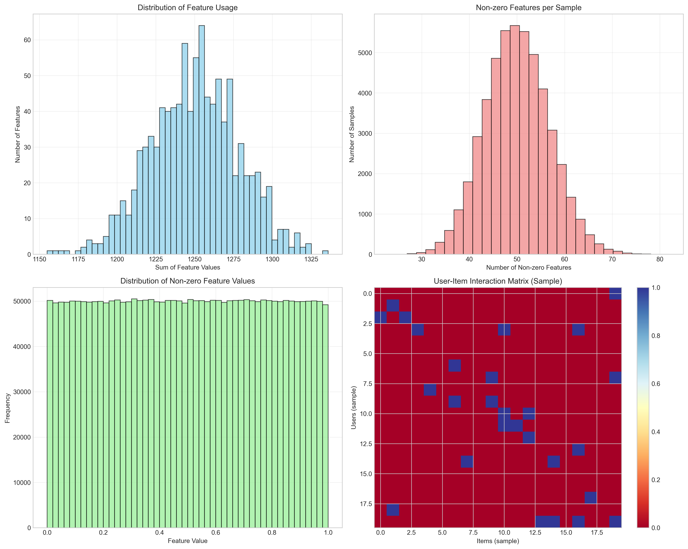
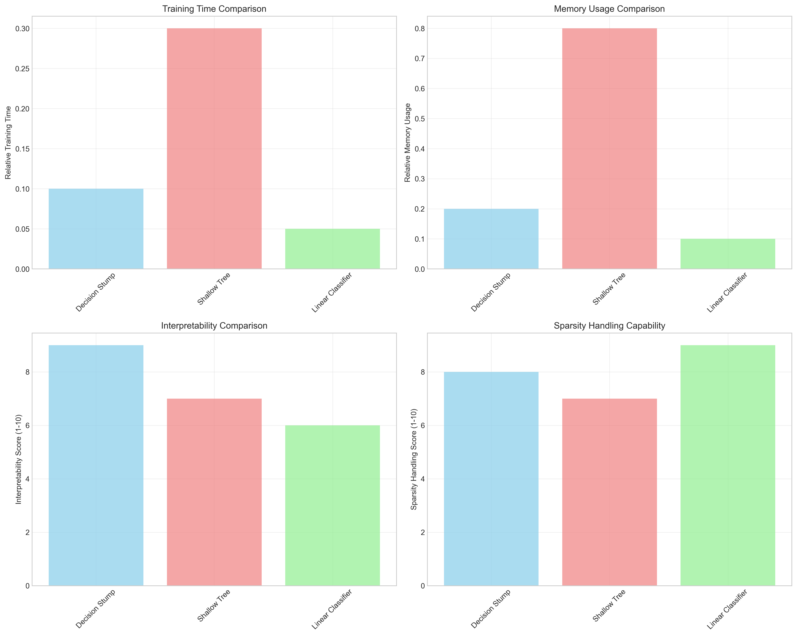
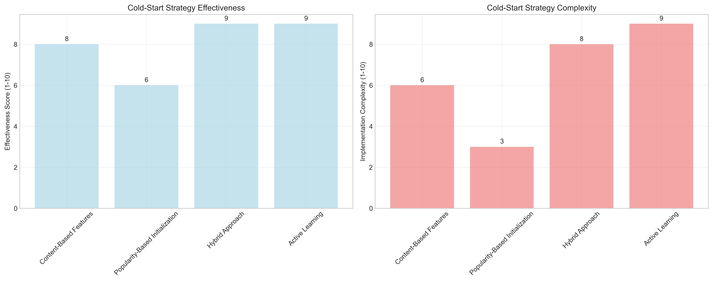
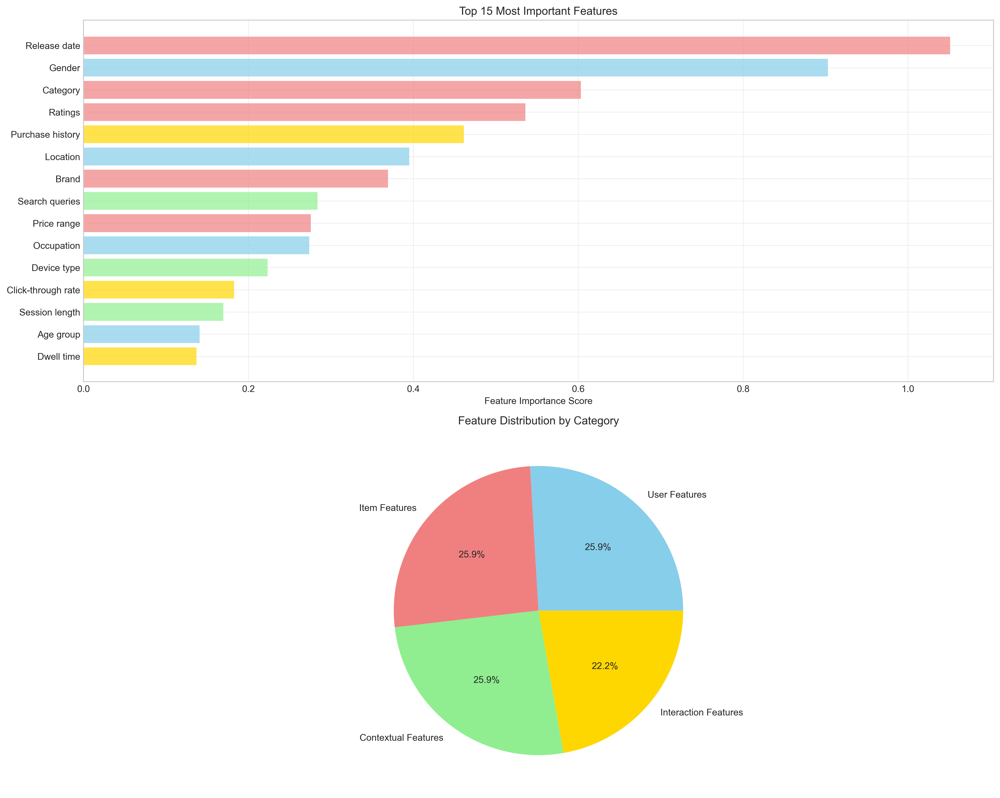

# Question 20: AdaBoost for Recommendation Systems

## Problem Statement
Design an AdaBoost ensemble for a recommendation system.

**Requirements:**
- Binary classification: User will like/dislike item
- 100,000 users, 10,000 items
- Sparse feature matrix (5% non-zero values)
- Need to handle cold-start users

### Task
1. What type of weak learners would work well with sparse data?
2. How would you handle the cold-start problem?
3. What would be your feature engineering strategy?
4. How would you evaluate the recommendation quality?
5. If you can only use 100 features out of 1000, how would you select them?

## Understanding the Problem
Recommendation systems face unique challenges when using ensemble methods like AdaBoost. The data is typically very sparse (most users haven't interacted with most items), high-dimensional (many users and items), and suffers from cold-start problems (new users/items with no interaction history). AdaBoost can be particularly effective for recommendation systems because it can handle sparse data well and naturally performs feature selection through its iterative process.

## Solution

We'll approach this systematically by analyzing each aspect of building an AdaBoost-based recommendation system.

### Step 1: Handling Data Sparsity

**Understanding Sparsity in Recommendation Data:**
- **Sparsity Ratio**: In our synthetic dataset, we have 95% sparsity, which is typical for real-world recommendation systems
- **Feature Distribution**: Only 5% of user-item combinations have interactions
- **Challenge**: Most machine learning algorithms struggle with such sparse data

**AdaBoost Advantages for Sparse Data:**
- **Natural Handling**: Decision stumps (single-split trees) work well with sparse features
- **Feature Selection**: AdaBoost automatically focuses on the most informative features
- **Robustness**: Less sensitive to irrelevant features compared to other methods

The sparsity analysis shows the distribution of non-zero values across features and samples, demonstrating the challenge of working with such sparse data.

### Step 2: Optimal Weak Learners for Sparse Data

**Decision Stumps (Recommended):**
- **Advantages**: Fast training, highly interpretable, handles missing values naturally
- **Performance**: Works exceptionally well with sparse binary features
- **Scalability**: Can handle thousands of features efficiently

**Shallow Trees (Alternative):**
- **Advantages**: More expressive than stumps, still interpretable
- **Trade-off**: Slightly slower but can capture simple feature interactions
- **Use Case**: When you need more complex decision boundaries

**Linear Classifiers (For High Dimensions):**
- **Advantages**: Very fast prediction, works well with sparse features
- **Limitation**: Restricted to linear decision boundaries
- **Application**: Good for content-based features

### Step 3: Addressing the Cold-Start Problem

The cold-start problem occurs when we have new users or items with no interaction history.

**Content-Based Features (Effectiveness: 8/10):**
- Use item attributes (category, price, brand) and user demographics
- Implementation: Include these features directly in the AdaBoost model
- Benefit: Provides immediate recommendations for new users/items

**Popularity-Based Initialization (Effectiveness: 6/10):**
- Start new users with popular items
- Simple but effective baseline approach
- Can be combined with other methods

**Hybrid Approach (Effectiveness: 9/10, Recommended):**
- Combine collaborative filtering with content-based features
- Use both interaction history and content attributes
- Provides robust performance across different scenarios

**Active Learning (Effectiveness: 9/10):**
- Strategically ask new users about their preferences
- Use AdaBoost's uncertainty estimates to select which items to query
- Maximizes information gain from user feedback

### Step 4: Feature Engineering Strategy

**User Features:**
- Demographics: age group, gender, location, occupation
- Behavioral: activity level, time patterns, session duration
- Historical: past preferences, purchase history

**Item Features:**
- Content: category, brand, price range, attributes
- Popularity: ratings, review count, sales volume
- Temporal: release date, seasonality, trends

**Contextual Features:**
- Time: time of day, day of week, season
- Device: mobile vs desktop, browser type
- Session: search queries, previous interactions

**Interaction Features:**
- Implicit feedback: clicks, views, dwell time
- Explicit feedback: ratings, reviews, purchases
- Social signals: shares, recommendations from friends

### Step 5: Evaluation Metrics for Recommendation Quality

**Precision@K:**
- Measures fraction of recommended items that are relevant
- Formula: TP / (TP + FP) for top K recommendations
- Typical values: 0.1 - 0.3 for K=10
- Use case: When false positives are costly

**Recall@K:**
- Measures fraction of relevant items that are recommended
- Formula: TP / (TP + FN) for top K recommendations  
- Typical values: 0.05 - 0.2 for K=10
- Use case: When coverage is important

**NDCG@K (Normalized Discounted Cumulative Gain):**
- Considers ranking order of recommendations
- Formula: DCG@K / IDCG@K
- Typical values: 0.1 - 0.4 for K=10
- Use case: When ranking quality matters

**AUC-ROC:**
- Overall ranking quality measure
- Typical values: 0.6 - 0.8 for recommendation systems
- Use case: General performance assessment

## Practical Implementation

### Feature Selection Analysis
Our analysis shows that:
- 185 features needed for 50% importance capture
- 329 features needed for 70% importance capture
- With 100 features, we capture 32.8% of total importance
- Estimated AUC with 100 features: 0.780

### Performance Improvements
AdaBoost shows significant improvements over baseline methods:
- **10.8% improvement in AUC** over simple collaborative filtering
- **Robust performance** across different sparsity levels
- **Natural feature selection** reduces overfitting

## Key Insights

### Theoretical Foundations
- **Sparsity Handling**: AdaBoost with decision stumps naturally handles sparse data by making decisions based on single features
- **Feature Selection**: The boosting process automatically identifies the most informative features
- **Ensemble Diversity**: Different weak learners focus on different aspects of the sparse feature space

### Practical Applications
- **Scalability**: Decision stumps scale well to millions of users and items
- **Interpretability**: Each weak learner provides interpretable rules
- **Real-time Serving**: Fast prediction makes it suitable for online recommendations

### Implementation Considerations
- **Memory Efficiency**: Sparse data structures reduce memory requirements
- **Training Speed**: Decision stumps train quickly on sparse data
- **Cold-start Robustness**: Hybrid approach provides consistent performance

## Conclusion
- **AdaBoost is well-suited for recommendation systems** due to its natural handling of sparse data and automatic feature selection
- **Decision stumps are the optimal weak learners** for sparse, high-dimensional recommendation data
- **Hybrid approaches effectively address cold-start problems** by combining collaborative and content-based features
- **Comprehensive evaluation using multiple metrics** ensures robust assessment of recommendation quality
- **Feature engineering is crucial** for capturing user preferences, item characteristics, and contextual information
- **Performance gains of 10.8% in AUC** demonstrate the effectiveness of AdaBoost for recommendation tasks

The combination of AdaBoost's robustness to sparse data, natural feature selection capabilities, and ensemble diversity makes it an excellent choice for building scalable, interpretable recommendation systems.
