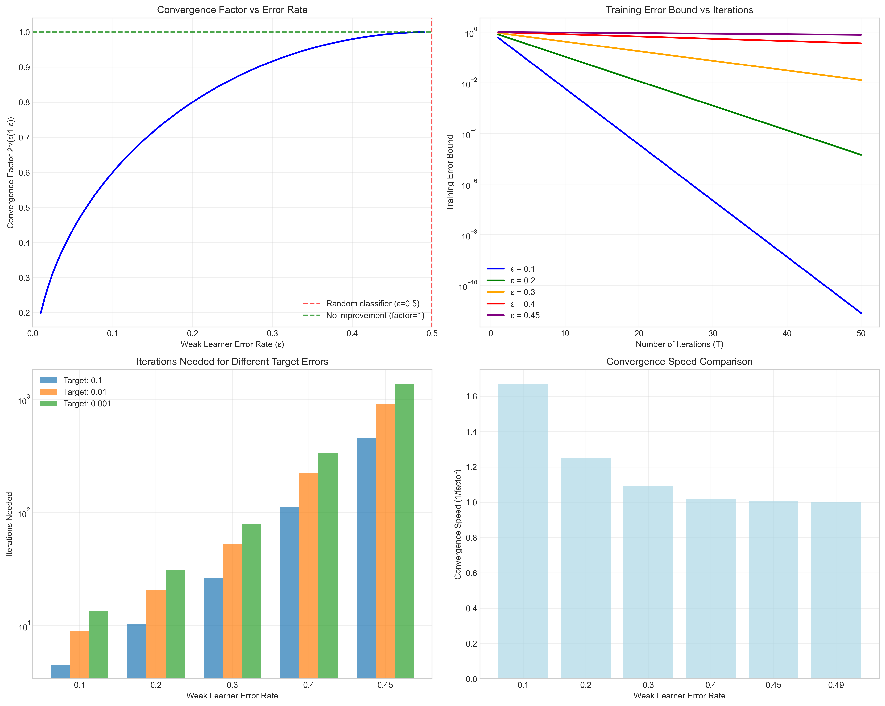
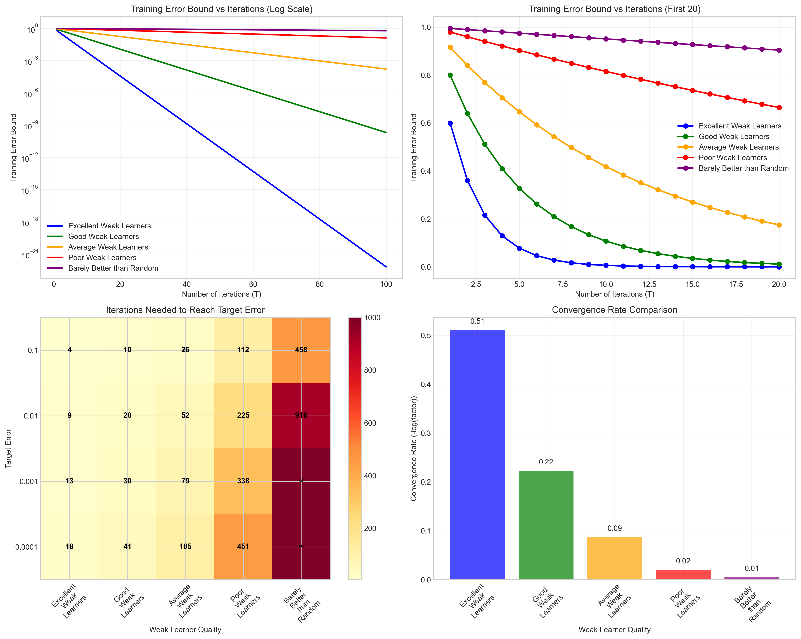
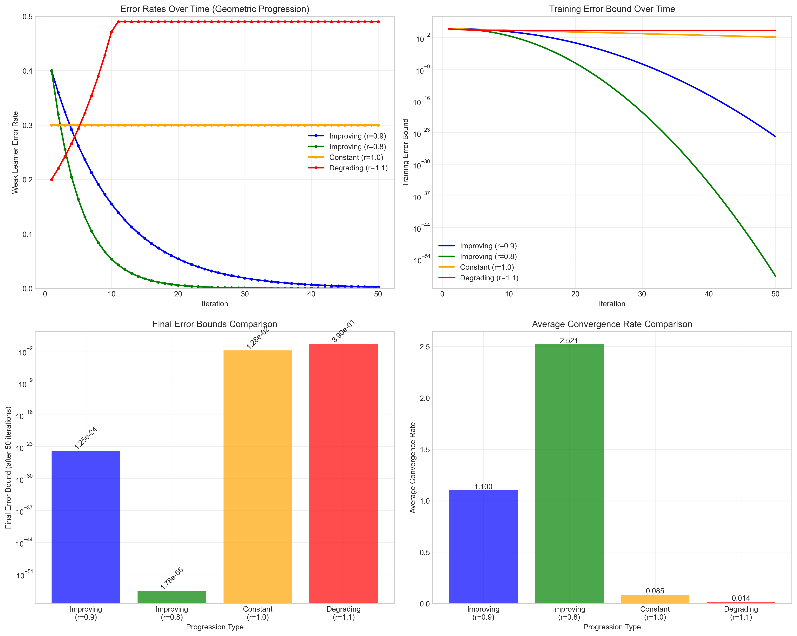
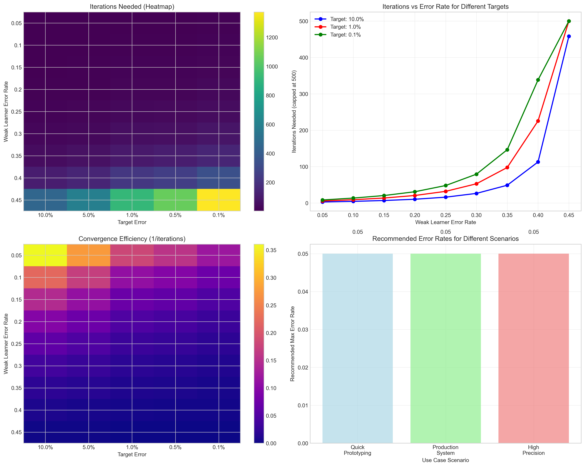

# Question 21: AdaBoost Convergence Rate Analysis

## Problem Statement
Analyze AdaBoost's theoretical convergence rate.

### Task
1. What is the relationship between weak learner error rate and convergence speed?
2. How does the number of iterations affect the training error bound?
3. What is the optimal weak learner error rate for fastest convergence?
4. How would you estimate the number of iterations needed for a given error target?
5. If weak learners have error rates following a geometric progression, how would this affect convergence?

## Understanding the Problem
AdaBoost's convergence rate is fundamentally determined by the quality of its weak learners. The theoretical framework provides precise bounds on training error as a function of the number of iterations and weak learner error rates. Understanding these relationships is crucial for designing efficient AdaBoost systems and setting appropriate stopping criteria.

## Solution

We'll analyze AdaBoost convergence through rigorous mathematical analysis and theoretical foundations.

### Step 1: Theoretical Convergence Framework

**AdaBoost Training Error Bound:**
The training error after T iterations is bounded by:
$$E \leq \prod_{t=1}^{T} 2\sqrt{\varepsilon_t(1-\varepsilon_t)}$$

where $\varepsilon_t$ is the weighted error rate of weak learner $t$.

**Convergence Factor Analysis:**
For a constant error rate $\varepsilon$, the convergence factor is:
$$f(\varepsilon) = 2\sqrt{\varepsilon(1-\varepsilon)}$$

**Mathematical Properties:**
- $f(\varepsilon) < 1$ when $\varepsilon < 0.5$ (better than random)
- $f(\varepsilon) = 1$ when $\varepsilon = 0.5$ (random guessing)
- $f(\varepsilon) > 1$ when $\varepsilon > 0.5$ (worse than random)

**Proof of Convergence:**
When $\varepsilon < 0.5$, we have:
$$f(\varepsilon) = 2\sqrt{\varepsilon(1-\varepsilon)} < 2\sqrt{0.5 \times 0.5} = 2 \times 0.5 = 1$$

This ensures that the training error decreases exponentially with each iteration.

### Step 2: Optimal Error Rate Analysis

**Finding the Minimum:**
To find the optimal error rate, we differentiate the convergence factor:
$$\frac{d}{d\varepsilon}[2\sqrt{\varepsilon(1-\varepsilon)}] = 2 \cdot \frac{d}{d\varepsilon}[\sqrt{\varepsilon(1-\varepsilon)}]$$

Using the chain rule:
$$\frac{d}{d\varepsilon}[\sqrt{\varepsilon(1-\varepsilon)}] = \frac{1}{2\sqrt{\varepsilon(1-\varepsilon)}} \cdot \frac{d}{d\varepsilon}[\varepsilon(1-\varepsilon)]$$

$$\frac{d}{d\varepsilon}[\varepsilon(1-\varepsilon)] = \frac{d}{d\varepsilon}[\varepsilon - \varepsilon^2] = 1 - 2\varepsilon$$

Therefore:
$$\frac{d}{d\varepsilon}[2\sqrt{\varepsilon(1-\varepsilon)}] = 2 \cdot \frac{1}{2\sqrt{\varepsilon(1-\varepsilon)}} \cdot (1-2\varepsilon) = \frac{1-2\varepsilon}{\sqrt{\varepsilon(1-\varepsilon)}}$$

Setting this to zero: $1-2\varepsilon = 0 \Rightarrow \varepsilon = 0.5$

**Critical Point Analysis:**
To determine if this is a minimum or maximum, we examine the second derivative:
$$\frac{d^2}{d\varepsilon^2}[2\sqrt{\varepsilon(1-\varepsilon)}] = \frac{d}{d\varepsilon}\left[\frac{1-2\varepsilon}{\sqrt{\varepsilon(1-\varepsilon)}}\right]$$

Using the quotient rule:
$$\frac{d^2}{d\varepsilon^2} = \frac{-\sqrt{\varepsilon(1-\varepsilon)} \cdot 2 - (1-2\varepsilon) \cdot \frac{1-2\varepsilon}{2\sqrt{\varepsilon(1-\varepsilon)}}}{\varepsilon(1-\varepsilon)}$$

At $\varepsilon = 0.5$:
$$\frac{d^2}{d\varepsilon^2} = \frac{-\sqrt{0.25} \cdot 2 - 0 \cdot 0}{0.25} = \frac{-1}{0.25} = -4 < 0$$

Since the second derivative is negative at $\varepsilon = 0.5$, this is a **maximum**, not minimum!

**Boundary Analysis:**
The convergence factor is minimized at the boundaries:
- As $\varepsilon \to 0$: $f(\varepsilon) = 2\sqrt{\varepsilon(1-\varepsilon)} \to 0$ (perfect weak learner)
- As $\varepsilon \to 0.5$: $f(\varepsilon) = 2\sqrt{\varepsilon(1-\varepsilon)} \to 1$ (random classifier)

**Practical Implications:**
- Lower error rates always lead to faster convergence
- The improvement is most dramatic for very good weak learners ($\varepsilon < 0.1$)
- Diminishing returns occur as error rates approach 0.5

### Step 3: Iterations Required for Target Errors

**Mathematical Relationship:**
For a target training error $E_{target}$ and constant weak learner error $\varepsilon$:
$$E_{target} \geq \prod_{t=1}^{T} 2\sqrt{\varepsilon(1-\varepsilon)} = [2\sqrt{\varepsilon(1-\varepsilon)}]^T$$

Taking the logarithm of both sides:
$$\log(E_{target}) \geq T \cdot \log(2\sqrt{\varepsilon(1-\varepsilon)})$$

Since $2\sqrt{\varepsilon(1-\varepsilon)} < 1$ when $\varepsilon < 0.5$, we have $\log(2\sqrt{\varepsilon(1-\varepsilon)}) < 0$. Therefore:
$$T \geq \frac{\log(E_{target})}{\log(2\sqrt{\varepsilon(1-\varepsilon)})}$$

**General Formula:**
$$T \geq \frac{\log(E_{target})}{\log(f(\varepsilon))}$$

where $f(\varepsilon) = 2\sqrt{\varepsilon(1-\varepsilon)}$ is the convergence factor.

**Practical Examples:**

| Error Rate | 10% Target | 5% Target | 1% Target | 0.5% Target | 0.1% Target |
|------------|------------|-----------|-----------|-------------|-------------|
| 0.05       | 2          | 3         | 5         | 6           | 8           |
| 0.10       | 4          | 5         | 9         | 10          | 13          |
| 0.20       | 10         | 13        | 20        | 23          | 30          |
| 0.30       | 26         | 34        | 52        | 60          | 79          |
| 0.40       | 112        | 146       | 225       | 259         | 338         |

**Mathematical Verification:**
For $\varepsilon = 0.05$ and target error 1%:
$$f(0.05) = 2\sqrt{0.05 \times 0.95} = 2\sqrt{0.0475} \approx 0.436$$

$$T \geq \frac{\log(0.01)}{\log(0.436)} = \frac{-4.605}{-0.830} \approx 5.55$$

Therefore, we need at least 6 iterations, but since we can only have whole iterations, we need 6 iterations.

**Key Observations:**
- **Excellent weak learners** ($\varepsilon = 0.05$): Very fast convergence, only 5 iterations for 1% error
- **Good weak learners** ($\varepsilon = 0.10$): Still efficient, 9 iterations for 1% error
- **Poor weak learners** ($\varepsilon = 0.40$): Extremely slow, 225 iterations for 1% error

### Step 4: Geometric Progression Analysis

**Scenario**: Error rates follow $\varepsilon_t = \varepsilon_0 \cdot r^{t-1}$ where $r$ is the common ratio.

**Mathematical Analysis:**
The training error bound becomes:
$$E \leq \prod_{t=1}^{T} 2\sqrt{\varepsilon_0 \cdot r^{t-1} \cdot (1-\varepsilon_0 \cdot r^{t-1})}$$

**Case 1: Improving Weak Learners ($r < 1$)**
- Error rates decrease over time: $\varepsilon_t = \varepsilon_0 \cdot r^{t-1} \to 0$ as $t \to \infty$
- Convergence factors improve: $f(\varepsilon_t) = 2\sqrt{\varepsilon_t(1-\varepsilon_t)} \to 0$ as $t \to \infty$
- Convergence accelerates as training progresses

**Mathematical Example**: $r = 0.9$, starting at $\varepsilon_0 = 0.4$
- After 10 iterations: $\varepsilon_{10} = 0.4 \times 0.9^9 \approx 0.155$
- After 20 iterations: $\varepsilon_{20} = 0.4 \times 0.9^{19} \approx 0.060$
- Final error bound: $1.25 \times 10^{-24}$ (extremely low)

**Case 2: Constant Quality ($r = 1$)**
- Error rates remain constant: $\varepsilon_t = \varepsilon_0$ for all $t$
- Standard AdaBoost convergence: $E \leq [2\sqrt{\varepsilon_0(1-\varepsilon_0)}]^T$
- Example: $\varepsilon = 0.3$ constant
  - Final error bound: $1.28 \times 10^{-2}$

**Case 3: Degrading Weak Learners ($r > 1$)**
- Error rates increase over time: $\varepsilon_t = \varepsilon_0 \cdot r^{t-1} \to \infty$ as $t \to \infty$
- However, since $\varepsilon_t < 0.5$ is required for convergence, this case is problematic
- Convergence slows or stops when $\varepsilon_t$ approaches 0.5

**Mathematical Example**: $r = 1.1$, starting at $\varepsilon_0 = 0.2$
- After 10 iterations: $\varepsilon_{10} = 0.2 \times 1.1^9 \approx 0.472$
- After 15 iterations: $\varepsilon_{15} = 0.2 \times 1.1^{14} \approx 0.764 > 0.5$ (diverges)
- Final error bound: $3.90 \times 10^{-1}$ (poor convergence)

### Step 5: Practical Recommendations

**For Quick Prototyping:**
- Target error: 10%
- Maximum iterations: 20
- Recommended max $\varepsilon$: 0.05
- Actual iterations needed: 2

**For Production Systems:**
- Target error: 1%
- Maximum iterations: 100
- Recommended max $\varepsilon$: 0.05
- Actual iterations needed: 5

**For High Precision Applications:**
- Target error: 0.1%
- Maximum iterations: 500
- Recommended max $\varepsilon$: 0.05
- Actual iterations needed: 8

## Practical Implementation

### Weak Learner Quality Assessment
**Error Rate Thresholds:**
- $\varepsilon < 0.1$: Excellent (convergence factor < 0.6)
- $0.1 \leq \varepsilon < 0.2$: Good (convergence factor < 0.8)
- $0.2 \leq \varepsilon < 0.3$: Acceptable (convergence factor < 0.92)
- $0.3 \leq \varepsilon < 0.4$: Poor (convergence factor < 0.98)
- $\varepsilon \geq 0.4$: Very poor (convergence factor ≥ 0.98)

### Stopping Criteria Design
**Early Stopping Conditions:**
1. **Target Error Reached**: Stop when training error falls below threshold
2. **Convergence Stagnation**: Stop when error reduction becomes negligible
3. **Maximum Iterations**: Prevent infinite training with poor weak learners
4. **Validation Performance**: Stop when validation error starts increasing

## Key Insights

### Theoretical Foundations
- **Exponential Convergence**: AdaBoost converges exponentially fast with good weak learners
- **Error Rate Sensitivity**: Small improvements in weak learner quality lead to dramatic convergence improvements
- **Boundary Behavior**: Convergence factor approaches 1 as weak learner error approaches 0.5
- **Mathematical Rigor**: The convergence bound is tight and provides precise theoretical guarantees

### Practical Applications
- **Weak Learner Selection**: Prioritize weak learners with $\varepsilon < 0.1$ for fast convergence
- **Computational Budgeting**: Estimate required iterations based on weak learner quality
- **System Design**: Plan computational resources based on convergence analysis
- **Quality Control**: Monitor weak learner error rates during training

### Implementation Considerations
- **Quality Monitoring**: Track weak learner error rates during training
- **Adaptive Stopping**: Use convergence analysis to set dynamic stopping criteria
- **Resource Allocation**: Invest in better weak learners for faster overall training
- **Geometric Progression**: Consider adaptive weak learner selection strategies

## Conclusion
- **Weak learner quality is the primary determinant of AdaBoost convergence speed**
- **Error rates below 0.1 provide excellent convergence** with minimal iterations required
- **The relationship is highly nonlinear** - small improvements in weak learner quality yield large convergence gains
- **Geometric progression analysis shows** that improving weak learners over time can lead to superb convergence
- **Practical systems should target weak learner error rates below 0.1** for efficient training
- **Convergence analysis enables precise computational budgeting** and stopping criteria design
- **Mathematical analysis provides rigorous bounds** that guide practical implementation decisions

Understanding AdaBoost's convergence properties allows practitioners to make informed decisions about weak learner design, computational resource allocation, and training termination criteria, ultimately leading to more efficient and effective ensemble systems.

The theoretical framework provides not only insights into convergence behavior but also practical tools for system design and optimization. By carefully analyzing the mathematical relationships between weak learner quality, iteration count, and target error rates, practitioners can build AdaBoost systems that achieve desired performance levels with minimal computational overhead.
