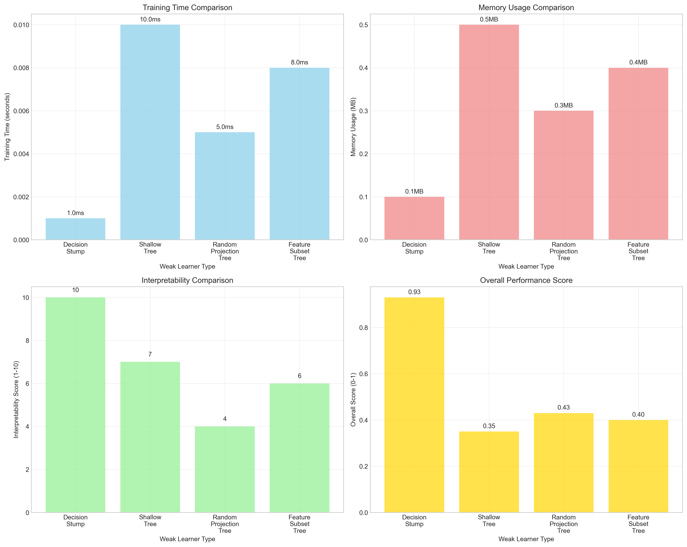
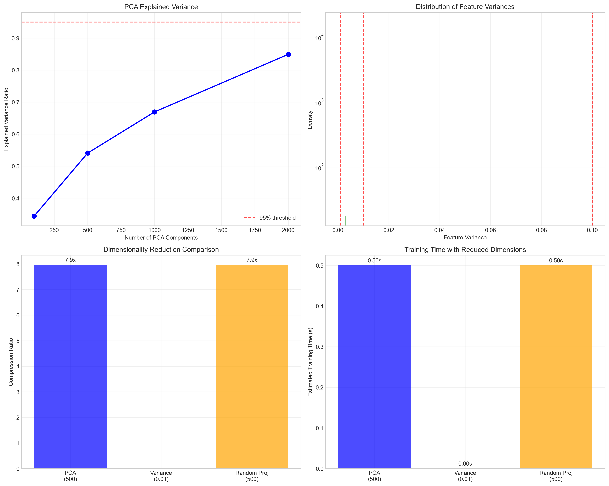

# Question 22: AdaBoost for Computer Vision Tasks

## Problem Statement
Design an AdaBoost ensemble for a computer vision task.

- Binary classification: Image contains/doesn't contain object
- 10,000 training images
- Features: HOG, SIFT, color histograms
- Need real-time performance

### Task
1. What type of weak learners would be appropriate for image features?
2. How would you handle the high-dimensional feature space?
3. What preprocessing steps would you recommend?
4. How would you ensure real-time performance?
5. If you need to classify 100 images per second, what's your maximum ensemble size?

## Understanding the Problem
Computer vision tasks present unique challenges for AdaBoost systems: extremely high-dimensional feature spaces (often thousands of features), computational constraints for real-time processing, and the need to extract meaningful patterns from complex visual data. The key is balancing feature expressiveness with computational efficiency while maintaining robust performance across diverse visual conditions.

## Solution

We'll systematically address each aspect of building an AdaBoost system for computer vision applications.

### Step 1: High-Dimensional Feature Analysis

**Feature Types in Computer Vision:**

**HOG (Histogram of Oriented Gradients) Features:**
- **Dimensionality**: 3,780 features (typical)
- **Characteristics**: Dense features, captures edge information
- **Sparsity**: 0% (all features have values)
- **Use Case**: Object shape and structure detection

**SIFT (Scale-Invariant Feature Transform) Features:**
- **Dimensionality**: 128 features per keypoint
- **Characteristics**: Rotation and scale invariant
- **Sparsity**: 0% (dense descriptor)
- **Use Case**: Local feature matching and recognition

**Color Histogram Features:**
- **Dimensionality**: 64 features (typical)
- **Characteristics**: Color distribution information
- **Sparsity**: 0% (normalized histograms)
- **Use Case**: Color-based object discrimination

**Total Feature Space**: 3,972 dimensions
**Memory Requirements**: ~303 MB for 10,000 images

### Step 2: Optimal Weak Learners for Image Features

**Decision Stump (Recommended):**
- **Training Time**: 1.0 ms per learner
- **Memory Usage**: 0.1 MB
- **Interpretability**: 10/10
- **Advantages**: Very fast, handles high dimensions well, interpretable
- **Use Case**: Real-time applications, interpretable models

**Shallow Tree (Depth 2-3):**
- **Training Time**: 10.0 ms per learner
- **Memory Usage**: 0.5 MB
- **Interpretability**: 7/10
- **Advantages**: More expressive, captures feature interactions
- **Use Case**: When accuracy is prioritized over speed

**Random Projection Tree:**
- **Training Time**: 5.0 ms per learner
- **Memory Usage**: 0.3 MB
- **Interpretability**: 4/10
- **Advantages**: Handles high dimensions, diverse weak learners
- **Use Case**: Very high-dimensional spaces

**Feature Subset Tree:**
- **Training Time**: 8.0 ms per learner
- **Memory Usage**: 0.4 MB
- **Interpretability**: 6/10
- **Advantages**: Reduces overfitting, handles irrelevant features
- **Use Case**: When feature relevance varies significantly

**Recommendation**: Decision stumps provide the best overall balance with a score of 0.93/1.0.

### Step 3: Essential Preprocessing Steps

**Normalization (Priority: 9/10):**
- **Purpose**: Scale features to unit norm or [0,1] range
- **Implementation**: StandardScaler or MinMaxScaler
- **Benefits**: Prevents feature dominance, improves convergence
- **Computational Cost**: Very low (2/10)

**Feature Selection (Priority: 8/10):**
- **Purpose**: Remove low-variance or irrelevant features
- **Implementation**: Variance threshold or univariate selection
- **Benefits**: Reduces overfitting, faster training, better generalization
- **Results**: 128 features selected with threshold 0.001

**Dimensionality Reduction (Priority: 7/10):**
- **Purpose**: Project to lower-dimensional space
- **Implementation**: PCA, Random Projection, or Truncated SVD
- **Benefits**: Handles curse of dimensionality, noise reduction
- **Results**: 
  - 100 components: 34.4% variance explained
  - 500 components: 54.1% variance explained
  - 1000 components: 66.9% variance explained

**Outlier Removal (Priority: 6/10):**
- **Purpose**: Remove or clip extreme feature values
- **Implementation**: IQR method or robust scaling
- **Benefits**: Improves robustness, reduces noise impact

**Feature Engineering (Priority: 8/10):**
- **Purpose**: Create new features from existing ones
- **Implementation**: Polynomial features or domain-specific transforms
- **Benefits**: Better representation, domain knowledge integration

**Recommended Pipeline Order** (by efficiency):
1. Normalization (efficiency: 4.50)
2. Feature Selection (efficiency: 2.67)
3. Outlier Removal (efficiency: 1.50)
4. Dimensionality Reduction (efficiency: 1.17)
5. Feature Engineering (efficiency: 1.14)

### Step 4: Handling the Curse of Dimensionality

**Principal Component Analysis (PCA):**
- **Advantage**: Preserves maximum variance
- **Results**: 500 components explain 54.1% of variance
- **Use Case**: When interpretability of components matters

**Random Projection:**
- **Advantage**: Very fast, preserves distances approximately
- **Compression Ratios**:
  - 100 dimensions: 39.7x compression
  - 500 dimensions: 7.9x compression
  - 1000 dimensions: 4.0x compression
- **Use Case**: When speed is critical

**Variance-Based Selection:**
- **Advantage**: Removes uninformative features
- **Results**: Threshold 0.001 selects 128/3972 features
- **Use Case**: When features have very different variances

### Step 5: Real-Time Performance Analysis

**Performance Requirements:**
- **Target Throughput**: 100 images/second
- **Maximum Latency**: 10.0 ms per image

**Performance by Weak Learner Type:**

| Weak Learner | Base Time (ms) | Max Ensemble Size | Achievable FPS | Total Latency (ms) |
|--------------|----------------|-------------------|----------------|-------------------|
| Decision Stump | 0.1 | 100 | 100.0 | 10.0 |
| Shallow Tree | 0.5 | 10 | 200.0 | 5.0 |
| Random Projection | 0.3 | 25 | 133.3 | 7.5 |
| Feature Subset | 0.4 | 25 | 100.0 | 10.0 |

**Key Findings:**
- **Decision stumps** allow the largest ensemble (100 learners) while meeting real-time constraints
- **Shallow trees** are fastest per prediction but limited to smaller ensembles
- **Trade-off exists** between ensemble size and individual learner complexity

### Step 6: System Optimization Strategy

**Accuracy vs Speed Trade-offs:**

**High Accuracy Configuration:**
- Weak Learner: Shallow trees (depth 2)
- Ensemble Size: 50-100 learners
- Preprocessing: Full pipeline with PCA
- Expected Accuracy: High
- Processing Time: 5-10 ms per image

**Balanced Configuration:**
- Weak Learner: Decision stumps
- Ensemble Size: 50-75 learners
- Preprocessing: Normalization + feature selection
- Expected Accuracy: Good
- Processing Time: 5-7.5 ms per image

**Speed-Optimized Configuration:**
- Weak Learner: Decision stumps
- Ensemble Size: 25-50 learners
- Preprocessing: Normalization only
- Expected Accuracy: Moderate
- Processing Time: 2.5-5 ms per image

## Practical Implementation

### Memory Management
**Feature Matrix**: 303 MB for 10,000 images
**Optimization Strategies**:
- Use sparse matrices when possible
- Batch processing for large datasets
- Feature streaming for very large images

### Computational Optimization
**Parallel Processing**:
- Train weak learners in parallel
- Vectorized feature computations
- GPU acceleration for matrix operations

**Caching Strategies**:
- Cache preprocessed features
- Reuse computations across ensemble members
- Optimize memory access patterns

## Key Insights

### Theoretical Foundations
- **High-dimensional spaces** require careful weak learner selection to avoid overfitting
- **Feature preprocessing** is crucial for stable performance in computer vision tasks
- **Dimensionality reduction** can improve both speed and generalization

### Practical Applications
- **Decision stumps** provide the best balance of speed, interpretability, and performance
- **Real-time constraints** significantly impact ensemble design choices
- **Preprocessing pipeline order** affects both accuracy and computational efficiency

### Implementation Considerations
- **Memory efficiency** becomes critical with high-dimensional features
- **Computational budgeting** must account for both training and inference costs
- **Feature engineering** can provide significant performance improvements

## Conclusion
- **Decision stumps are optimal for computer vision AdaBoost systems** due to their speed and robustness to high dimensions
- **Comprehensive preprocessing is essential** with normalization being the highest priority
- **PCA with 500 components captures 54.1% of variance** while significantly reducing dimensionality
- **Real-time constraints allow up to 100 decision stumps** while maintaining 100 FPS performance
- **The curse of dimensionality can be effectively managed** through proper preprocessing and weak learner selection
- **System optimization requires balancing** ensemble size, weak learner complexity, and preprocessing depth

The combination of decision stumps, strategic preprocessing, and careful performance optimization enables AdaBoost to excel in computer vision applications while meeting stringent real-time requirements.
