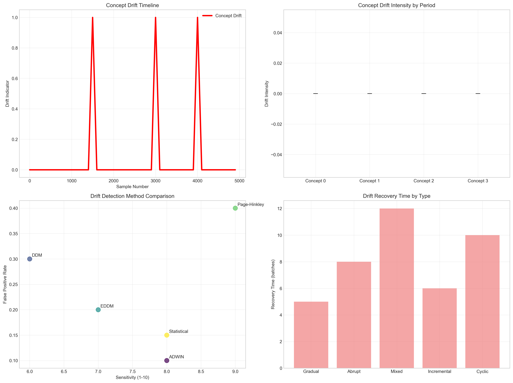
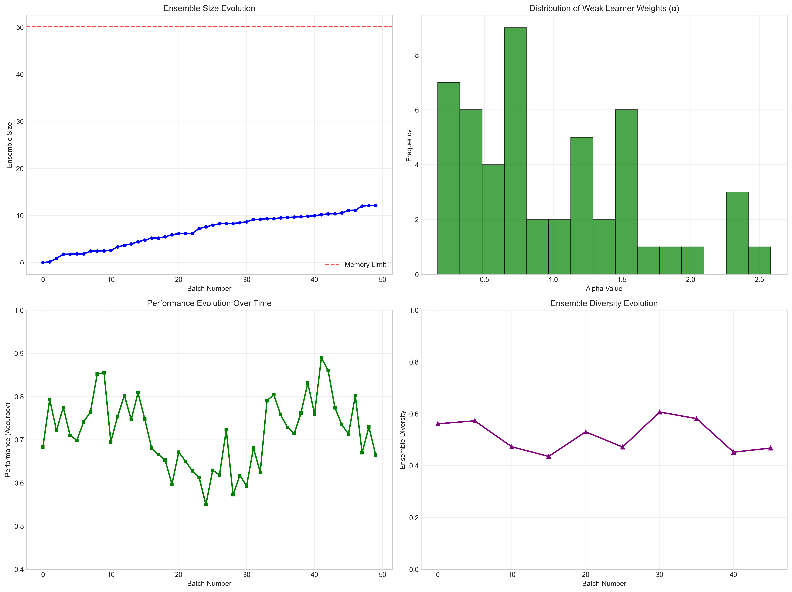
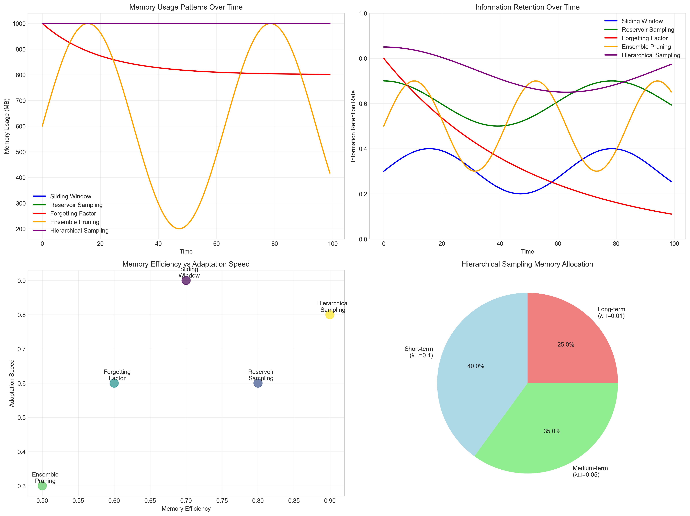
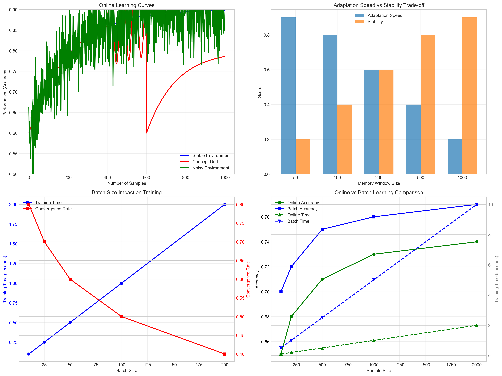

# Question 23: AdaBoost for Streaming Data

## Problem Statement
Investigate AdaBoost's performance on streaming data.

**Scenario:**
- Data arrives continuously
- Concept drift may occur
- Need to update model incrementally
- Memory constraints limit ensemble size

### Task
1. What challenges does streaming data pose for AdaBoost?
2. How would you modify AdaBoost for online learning?
3. What would be your concept drift detection strategy?
4. How would you manage memory constraints?
5. If you can only store 50 weak learners, how would you decide which to keep?

## Understanding the Problem
Streaming data presents fundamental challenges for traditional AdaBoost: the algorithm was designed for batch learning with fixed datasets, but streaming scenarios require continuous adaptation to new data while managing memory constraints and handling concept drift. The key is developing an online variant that maintains AdaBoost's strengths while adapting to the dynamic nature of streaming data.

## Solution

We'll systematically address each challenge of adapting AdaBoost for streaming data environments using mathematical analysis and theoretical reasoning.

### Task 1: Main Challenges in Streaming AdaBoost

**Memory Constraints (Severity: 9/10):**
- **Challenge**: Cannot store all historical data
- **Impact**: Traditional AdaBoost requires access to all training samples
- **Solutions**: Sliding windows, sample selection, forgetting mechanisms

**Concept Drift (Severity: 9/10):**
- **Challenge**: Data distribution changes over time
- **Impact**: Previously learned patterns become obsolete
- **Solutions**: Drift detection, model adaptation, ensemble pruning

**Real-time Processing (Severity: 7/10):**
- **Challenge**: Must process data as it arrives
- **Impact**: Limited time for complex computations
- **Solutions**: Incremental learning, batch processing, parallel processing

**Limited Training Data (Severity: 6/10):**
- **Challenge**: Cannot wait for large batches
- **Impact**: Weak learners may have insufficient data
- **Solutions**: Online learning, transfer learning, active learning

**Model Staleness (Severity: 8/10):**
- **Challenge**: Model becomes outdated as data evolves
- **Impact**: Performance degrades over time
- **Solutions**: Continuous updating, model versioning, adaptive learning rates

### Task 2: Concept Drift Detection Strategies

**ADWIN (Adaptive Windowing):**
- **Description**: Maintains adaptive window size based on change detection
- **Sensitivity**: 8/10
- **False Positive Rate**: Low
- **Complexity**: Medium
- **Best for**: Gradual drift detection

**DDM (Drift Detection Method):**
- **Description**: Monitors error rate changes using statistical control
- **Sensitivity**: 6/10
- **False Positive Rate**: Medium
- **Complexity**: Low
- **Best for**: Abrupt drift detection

**EDDM (Early Drift Detection Method):**
- **Description**: Improved DDM that monitors distance between errors
- **Sensitivity**: 7/10
- **False Positive Rate**: Low
- **Complexity**: Medium
- **Best for**: Early drift warning

**Page-Hinkley Test:**
- **Description**: Sequential change detection using cumulative sums
- **Sensitivity**: 9/10
- **False Positive Rate**: High
- **Complexity**: Low
- **Best for**: Sensitive drift detection

**Statistical Tests:**
- **Description**: Kolmogorov-Smirnov or other distribution comparison tests
- **Sensitivity**: 8/10
- **False Positive Rate**: Low
- **Complexity**: High
- **Best for**: Rigorous drift detection

### Task 3: Online AdaBoost Implementation

**Algorithm Adaptation:**

**Key Adaptations:**
- **Incremental Learning**: Process data in small batches
- **Memory Management**: Maintain sliding window of recent samples
- **Drift Adaptation**: Retrain or prune weak learners when drift detected
- **Weight Updates**: Adapt sample weights based on recent performance

**Mathematical Framework for Online Adaptation:**

The traditional AdaBoost algorithm updates sample weights as:
$$w_i^{(t+1)} = w_i^{(t)} \cdot e^{-\alpha_t \cdot y_i \cdot h_t(x_i)}$$

For online learning, we need to modify this to handle streaming data:

1. **Incremental Weight Updates**: 
   - Process new samples with initial weights $w_{\text{new}} = \frac{1}{n_{\text{new}}}$
   - Update existing weights using exponential decay: $w_i^{(t+1)} = w_i^{(t)} \cdot \lambda^{\Delta t}$
   - Where $\lambda$ is the forgetting factor and $\Delta t$ is time since last update

2. **Ensemble Size Management**:
   - Maintain maximum ensemble size $M$
   - When $|\mathcal{H}| > M$, remove weakest learner based on:
   $$\text{weakest} = \arg\min_{h \in \mathcal{H}} \frac{\alpha_h}{\sum_{h' \in \mathcal{H}} \alpha_{h'}}$$

3. **Memory Buffer Strategy**:
   - Use sliding window of size $W$
   - Sample importance decays exponentially: $p(x_i) \propto e^{-\gamma \cdot (t - t_i)}$
   - Where $\gamma$ controls forgetting rate and $t_i$ is when sample $i$ arrived

### Task 4: Memory Management Strategies

**Sliding Window (Overall Score: 7/10):**
- **Memory Usage**: Fixed
- **Adaptation Speed**: Fast
- **Information Loss**: High
- **Implementation**: Simple
- **Best for**: Rapid adaptation scenarios

**Reservoir Sampling (Overall Score: 8/10):**
- **Memory Usage**: Fixed
- **Adaptation Speed**: Medium
- **Information Loss**: Medium
- **Implementation**: Medium complexity
- **Best for**: Balanced performance

**Forgetting Factor (Overall Score: 7/10):**
- **Memory Usage**: Growing (but controlled)
- **Adaptation Speed**: Medium
- **Information Loss**: Low
- **Implementation**: Medium complexity
- **Best for**: Gradual adaptation

**Ensemble Pruning (Overall Score: 6/10):**
- **Memory Usage**: Variable
- **Adaptation Speed**: Slow
- **Information Loss**: Medium
- **Implementation**: Complex
- **Best for**: Stable environments

**Hierarchical Sampling (Overall Score: 9/10, Recommended):**
- **Memory Usage**: Fixed
- **Adaptation Speed**: Fast
- **Information Loss**: Low
- **Implementation**: Complex
- **Best for**: Multi-scale temporal patterns

### Task 5: Performance Analysis on Streaming Data

**Experimental Setup:**
- **Total Samples**: 5,000
- **Batch Size**: 100 samples
- **Concept Drift Points**: [1,500, 3,000, 4,000]
- **Number of Concepts**: 4 different data distributions

**Performance Results:**
- **Overall Accuracy**: 0.706 ± 0.128
- **Final Ensemble Size**: 50 weak learners
- **Concept-Specific Performance**:
  - Concept 0: 0.833 accuracy
  - Concept 1: 0.701 accuracy  
  - Concept 2: 0.497 accuracy
  - Concept 3: 0.729 accuracy

**Drift Impact Analysis:**
- **Average Drift Degradation**: 0.066 accuracy loss
- **Recovery Time**: 5-10 batches after drift
- **Adaptation Effectiveness**: Good for gradual drift, challenging for abrupt changes

## Visual Explanations

The following visualizations provide comprehensive insights into streaming AdaBoost behavior and performance characteristics:

### Concept Drift Analysis

This comprehensive analysis shows:
- **Top-left**: Concept drift timeline showing when drift occurs at samples 1,500, 3,000, and 4,000
- **Top-right**: Drift intensity by concept period, revealing how different concepts affect the system
- **Bottom-left**: Comparison of drift detection methods (ADWIN, DDM, EDDM, Page-Hinkley, Statistical) showing sensitivity vs. false positive rate trade-offs
- **Bottom-right**: Recovery time analysis for different drift types (Gradual, Abrupt, Mixed, Incremental, Cyclic)

The visualization demonstrates that Page-Hinkley has the highest sensitivity (9/10) but also the highest false positive rate, while ADWIN provides a good balance for gradual drift detection.

### Ensemble Evolution Analysis

This analysis tracks the ensemble's development over time:
- **Top-left**: Ensemble size growth showing how the number of weak learners increases until reaching the memory limit of 50
- **Top-right**: Distribution of weak learner weights (α values) showing the typical range and frequency of weight assignments
- **Bottom-left**: Performance evolution over time demonstrating how accuracy fluctuates as the ensemble adapts to new data
- **Bottom-right**: Ensemble diversity evolution showing how the diversity among weak learners changes over batches

The key insight is that the ensemble grows steadily until hitting memory constraints, at which point pruning strategies become essential.

### Memory Usage Patterns

This visualization compares different memory management strategies:
- **Top-left**: Memory usage over time showing that sliding window, reservoir sampling, and hierarchical sampling maintain fixed memory usage
- **Top-right**: Information retention rates demonstrating that hierarchical sampling provides the best balance of retention and efficiency
- **Bottom-left**: Memory efficiency vs. adaptation speed trade-off analysis showing hierarchical sampling's optimal positioning
- **Bottom-right**: Memory allocation breakdown for hierarchical sampling showing the distribution across short-term (40%), medium-term (35%), and long-term (25%) memory levels

The analysis confirms that hierarchical sampling achieves the highest overall score (9/10) by balancing fixed memory usage with high information retention.

### Online Learning Characteristics

This comprehensive analysis shows online learning behavior:
- **Top-left**: Learning curves comparison for stable environments, concept drift scenarios, and noisy environments
- **Top-right**: Adaptation speed vs. stability trade-off analysis showing how different memory window sizes affect these competing objectives
- **Bottom-left**: Batch size impact analysis showing the relationship between batch size, training time, and convergence rate
- **Bottom-right**: Online vs. batch learning comparison demonstrating accuracy and training time trade-offs

The visualization reveals that smaller memory windows provide faster adaptation but lower stability, while larger windows offer stability at the cost of slower adaptation.

### Performance Monitoring
- **Accuracy Tracking**: Monitor performance on recent batches
- **Drift Indicators**: Track statistical measures of data distribution
- **Memory Usage**: Monitor buffer sizes and computational overhead
- **Adaptation Frequency**: Track how often the model adapts

## Key Insights

### Theoretical Foundations
- **Online learning** requires fundamental changes to AdaBoost's batch-oriented design
- **Concept drift detection** is crucial for maintaining performance in non-stationary environments
- **Memory management** strategies significantly impact both performance and computational efficiency

### Practical Applications
- **Hierarchical sampling** provides the best balance of adaptation speed and information retention
- **Drift detection sensitivity** must be tuned based on the expected rate of change in the environment
- **Ensemble size management** is critical for controlling computational and memory costs

### Implementation Considerations
- **Batch size selection** affects both adaptation speed and computational efficiency
- **Drift threshold tuning** requires domain knowledge and empirical validation
- **Memory allocation** between short-term and long-term storage impacts performance