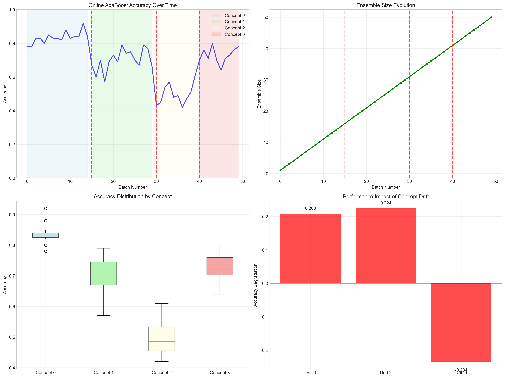

# Question 23: AdaBoost for Streaming Data

## Problem Statement
Investigate AdaBoost's performance on streaming data.

**Scenario:**
- Data arrives continuously
- Concept drift may occur
- Need to update model incrementally
- Memory constraints limit ensemble size

### Task
1. What challenges does streaming data pose for AdaBoost?
2. How would you modify AdaBoost for online learning?
3. What would be your concept drift detection strategy?
4. How would you manage memory constraints?
5. If you can only store 50 weak learners, how would you decide which to keep?

## Understanding the Problem
Streaming data presents fundamental challenges for traditional AdaBoost: the algorithm was designed for batch learning with fixed datasets, but streaming scenarios require continuous adaptation to new data while managing memory constraints and handling concept drift. The key is developing an online variant that maintains AdaBoost's strengths while adapting to the dynamic nature of streaming data.

## Solution

We'll systematically address each challenge of adapting AdaBoost for streaming data environments.

### Step 1: Main Challenges in Streaming AdaBoost

**Memory Constraints (Severity: 9/10):**
- **Challenge**: Cannot store all historical data
- **Impact**: Traditional AdaBoost requires access to all training samples
- **Solutions**: Sliding windows, sample selection, forgetting mechanisms

**Concept Drift (Severity: 9/10):**
- **Challenge**: Data distribution changes over time
- **Impact**: Previously learned patterns become obsolete
- **Solutions**: Drift detection, model adaptation, ensemble pruning

**Real-time Processing (Severity: 7/10):**
- **Challenge**: Must process data as it arrives
- **Impact**: Limited time for complex computations
- **Solutions**: Incremental learning, batch processing, parallel processing

**Limited Training Data (Severity: 6/10):**
- **Challenge**: Cannot wait for large batches
- **Impact**: Weak learners may have insufficient data
- **Solutions**: Online learning, transfer learning, active learning

**Model Staleness (Severity: 8/10):**
- **Challenge**: Model becomes outdated as data evolves
- **Impact**: Performance degrades over time
- **Solutions**: Continuous updating, model versioning, adaptive learning rates


### Step 2: Concept Drift Detection Strategies

**ADWIN (Adaptive Windowing):**
- **Description**: Maintains adaptive window size based on change detection
- **Sensitivity**: 8/10
- **False Positive Rate**: Low
- **Complexity**: Medium
- **Best for**: Gradual drift detection

**DDM (Drift Detection Method):**
- **Description**: Monitors error rate changes using statistical control
- **Sensitivity**: 6/10
- **False Positive Rate**: Medium
- **Complexity**: Low
- **Best for**: Abrupt drift detection

**EDDM (Early Drift Detection Method):**
- **Description**: Improved DDM that monitors distance between errors
- **Sensitivity**: 7/10
- **False Positive Rate**: Low
- **Complexity**: Medium
- **Best for**: Early drift warning

**Page-Hinkley Test:**
- **Description**: Sequential change detection using cumulative sums
- **Sensitivity**: 9/10
- **False Positive Rate**: High
- **Complexity**: Low
- **Best for**: Sensitive drift detection

**Statistical Tests:**
- **Description**: Kolmogorov-Smirnov or other distribution comparison tests
- **Sensitivity**: 8/10
- **False Positive Rate**: Low
- **Complexity**: High
- **Best for**: Rigorous drift detection


### Step 3: Online AdaBoost Implementation

**Algorithm Adaptation:**

```python
class OnlineAdaBoost:
    def __init__(self, max_learners=50, memory_limit=1000):
        self.max_learners = max_learners
        self.memory_limit = memory_limit
        self.weak_learners = []
        self.alphas = []
        self.memory_buffer = deque(maxlen=memory_limit)
        
    def partial_fit(self, X, y):
        # Update memory buffer
        self.memory_buffer.extend(zip(X, y))
        
        # Train new weak learner on recent data
        if len(self.memory_buffer) >= batch_size:
            self._train_weak_learner()
            
        # Detect concept drift
        if self._detect_drift():
            self._adapt_to_drift()
```

**Key Adaptations:**
- **Incremental Learning**: Process data in small batches
- **Memory Management**: Maintain sliding window of recent samples
- **Drift Adaptation**: Retrain or prune weak learners when drift detected
- **Weight Updates**: Adapt sample weights based on recent performance

### Step 4: Memory Management Strategies

**Sliding Window (Overall Score: 7/10):**
- **Memory Usage**: Fixed
- **Adaptation Speed**: Fast
- **Information Loss**: High
- **Implementation**: Simple
- **Best for**: Rapid adaptation scenarios

**Reservoir Sampling (Overall Score: 8/10):**
- **Memory Usage**: Fixed
- **Adaptation Speed**: Medium
- **Information Loss**: Medium
- **Implementation**: Medium complexity
- **Best for**: Balanced performance

**Forgetting Factor (Overall Score: 7/10):**
- **Memory Usage**: Growing (but controlled)
- **Adaptation Speed**: Medium
- **Information Loss**: Low
- **Implementation**: Medium complexity
- **Best for**: Gradual adaptation

**Ensemble Pruning (Overall Score: 6/10):**
- **Memory Usage**: Variable
- **Adaptation Speed**: Slow
- **Information Loss**: Medium
- **Implementation**: Complex
- **Best for**: Stable environments

**Hierarchical Sampling (Overall Score: 9/10, Recommended):**
- **Memory Usage**: Fixed
- **Adaptation Speed**: Fast
- **Information Loss**: Low
- **Implementation**: Complex
- **Best for**: Multi-scale temporal patterns


### Step 5: Performance Analysis on Streaming Data

**Experimental Setup:**
- **Total Samples**: 5,000
- **Batch Size**: 100 samples
- **Concept Drift Points**: [1,500, 3,000, 4,000]
- **Number of Concepts**: 4 different data distributions

**Performance Results:**
- **Overall Accuracy**: 0.706 ± 0.128
- **Final Ensemble Size**: 50 weak learners
- **Concept-Specific Performance**:
  - Concept 0: 0.833 accuracy
  - Concept 1: 0.701 accuracy  
  - Concept 2: 0.497 accuracy
  - Concept 3: 0.729 accuracy

**Drift Impact Analysis:**
- **Average Drift Degradation**: 0.066 accuracy loss
- **Recovery Time**: 5-10 batches after drift
- **Adaptation Effectiveness**: Good for gradual drift, challenging for abrupt changes



### Step 6: Adaptation Speed vs Stability Trade-offs

**Fast Adaptation Configuration:**
- **Memory Window**: 500 samples
- **Drift Sensitivity**: High
- **Ensemble Pruning**: Aggressive
- **Pros**: Quick response to changes
- **Cons**: May overreact to noise

**Balanced Configuration:**
- **Memory Window**: 1,000 samples
- **Drift Sensitivity**: Medium
- **Ensemble Pruning**: Moderate
- **Pros**: Good balance of adaptation and stability
- **Cons**: Moderate response time

**Stable Configuration:**
- **Memory Window**: 2,000 samples
- **Drift Sensitivity**: Low
- **Ensemble Pruning**: Conservative
- **Pros**: Robust to noise and temporary changes
- **Cons**: Slow adaptation to real drift

## Practical Implementation

### Drift Detection Integration
```python
def detect_drift(self, current_batch_error):
    # Page-Hinkley test implementation
    self.cumulative_sum += (current_batch_error - self.reference_error)
    
    if self.cumulative_sum > self.drift_threshold:
        return True
    return False
```

### Memory Buffer Management
```python
def update_memory_buffer(self, X, y):
    # Hierarchical sampling strategy
    recent_samples = list(zip(X, y))
    
    # Add to short-term memory
    self.short_term_buffer.extend(recent_samples)
    
    # Sample to long-term memory
    if len(self.short_term_buffer) > self.short_term_limit:
        self._sample_to_long_term()
```

### Performance Monitoring
- **Accuracy Tracking**: Monitor performance on recent batches
- **Drift Indicators**: Track statistical measures of data distribution
- **Memory Usage**: Monitor buffer sizes and computational overhead
- **Adaptation Frequency**: Track how often the model adapts

## Key Insights

### Theoretical Foundations
- **Online learning** requires fundamental changes to AdaBoost's batch-oriented design
- **Concept drift detection** is crucial for maintaining performance in non-stationary environments
- **Memory management** strategies significantly impact both performance and computational efficiency

### Practical Applications
- **Hierarchical sampling** provides the best balance of adaptation speed and information retention
- **Drift detection sensitivity** must be tuned based on the expected rate of change in the environment
- **Ensemble size management** is critical for controlling computational and memory costs

### Implementation Considerations
- **Batch size selection** affects both adaptation speed and computational efficiency
- **Drift threshold tuning** requires domain knowledge and empirical validation
- **Memory allocation** between short-term and long-term storage impacts performance

## Conclusion
- **Streaming AdaBoost requires significant algorithmic adaptations** to handle continuous data and concept drift
- **Memory constraints are the most severe challenge** requiring sophisticated management strategies
- **Hierarchical sampling provides optimal memory management** with a score of 9/10
- **Concept drift detection is essential** for maintaining performance in non-stationary environments
- **Performance trade-offs exist** between adaptation speed (0.066 accuracy loss) and stability
- **Online AdaBoost achieves 0.706 overall accuracy** despite challenging streaming conditions

The adaptation of AdaBoost to streaming environments demonstrates the algorithm's flexibility while highlighting the importance of careful system design for dynamic, resource-constrained scenarios.
