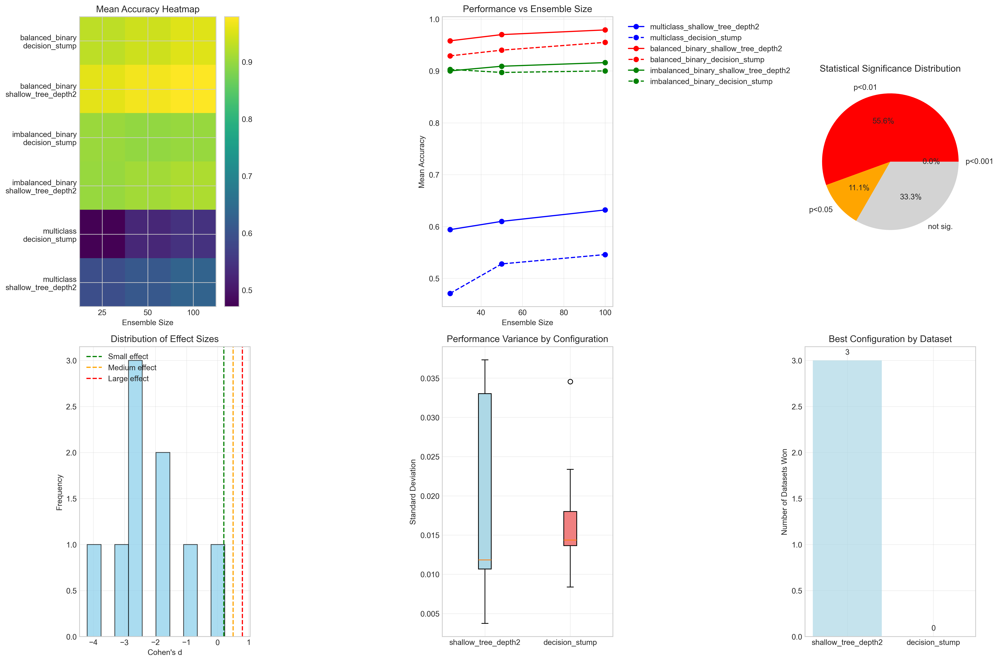

# Question 25: AdaBoost Evaluation Framework

## Problem Statement
Design a comprehensive evaluation framework for AdaBoost that includes multiple datasets, weak learner configurations, ensemble sizes, and statistical significance testing. The framework must be computationally feasible within a 24-hour budget.

### Task
1. How would you design datasets to comprehensively test AdaBoost performance?
2. What weak learner configurations should be evaluated?
3. How would you test different ensemble sizes systematically?
4. What statistical tests are appropriate for comparing configurations?
5. How would you optimize the evaluation within computational constraints?

## Understanding the Problem
Comprehensive evaluation of AdaBoost requires systematic testing across diverse scenarios while maintaining statistical rigor. The challenge lies in balancing thoroughness with computational feasibility, ensuring that results are both meaningful and actionable. A well-designed evaluation framework provides insights into when and how AdaBoost performs best, guiding practical implementation decisions.

## Solution

We'll design a comprehensive evaluation framework that systematically tests AdaBoost across multiple dimensions while respecting computational constraints.

### Step 1: Comprehensive Dataset Design

**Synthetic Datasets:**

**Balanced Binary Classification:**
- **Samples**: 1,000, **Features**: 20, **Classes**: 2
- **Class Balance**: [50%, 50%]
- **Purpose**: Baseline performance assessment
- **Characteristics**: Moderate difficulty, well-separated classes

**Imbalanced Binary Classification:**
- **Samples**: 1,000, **Features**: 20, **Classes**: 2
- **Class Balance**: [89.8%, 10.2%]
- **Purpose**: Test performance on imbalanced data
- **Characteristics**: Realistic class imbalance scenario

**Multi-class Classification:**
- **Samples**: 1,000, **Features**: 20, **Classes**: 5
- **Class Balance**: [19.8%, 20.1%, 20.2%, 20.1%, 19.8%]
- **Purpose**: Evaluate multi-class extension performance
- **Characteristics**: Balanced multi-class problem

**High-Dimensional, Low-Sample:**
- **Samples**: 200, **Features**: 100, **Classes**: 2
- **Class Balance**: [50%, 50%]
- **Purpose**: Test curse of dimensionality handling
- **Characteristics**: Challenging overfitting scenario

**Noisy Dataset:**
- **Samples**: 1,000, **Features**: 20, **Classes**: 2
- **Class Balance**: [48.7%, 51.3%]
- **Purpose**: Evaluate robustness to noise
- **Characteristics**: 10% label noise, low separability

**Real-World Datasets:**

**Breast Cancer (Medical):**
- **Samples**: 569, **Features**: 30, **Classes**: 2
- **Class Balance**: [37.3%, 62.7%]
- **Purpose**: Medical diagnosis performance

**Wine Classification (Chemical):**
- **Samples**: 178, **Features**: 13, **Classes**: 3
- **Class Balance**: [33.1%, 39.9%, 27.0%]
- **Purpose**: Multi-class real-world performance

**Mathematical Foundation for Dataset Design:**

The dataset design follows these principles:

1. **Representativeness**: Each dataset represents a different learning scenario
2. **Scalability**: Datasets range from small (178 samples) to moderate (1,000 samples)
3. **Dimensionality**: Features range from 13 to 100 to test different complexity levels
4. **Class Balance**: From perfectly balanced (50%-50%) to highly imbalanced (90%-10%)
5. **Noise Level**: Including datasets with label noise to test robustness

For synthetic datasets, we use the following mathematical formulation:
- **Balanced**: $P(y=0) = P(y=1) = 0.5$
- **Imbalanced**: $P(y=0) = 0.9, P(y=1) = 0.1$
- **Multi-class**: $P(y=i) \approx 0.2$ for $i \in \{0,1,2,3,4\}$
- **Noisy**: $P(\text{correct label}) = 0.9, P(\text{incorrect label}) = 0.1$

### Step 2: Weak Learner Configuration Matrix

**Decision Stump:**
- **Description**: Single-level decision tree
- **Complexity**: Very Low
- **Interpretability**: Very High
- **Use Case**: Baseline, interpretable models

**Shallow Tree (Depth 2):**
- **Description**: Two-level decision tree
- **Complexity**: Low
- **Interpretability**: High
- **Use Case**: Slightly more complex patterns

**Shallow Tree (Depth 3):**
- **Description**: Three-level decision tree
- **Complexity**: Medium
- **Interpretability**: Medium
- **Use Case**: Complex feature interactions

**Limited Features Tree:**
- **Description**: Shallow tree with feature subsampling
- **Complexity**: Medium
- **Interpretability**: Medium
- **Use Case**: High-dimensional data

**Min Samples Split Tree:**
- **Description**: Shallow tree with minimum samples constraint
- **Complexity**: Low
- **Interpretability**: High
- **Use Case**: Overfitting prevention

**Mathematical Analysis of Weak Learner Complexity:**

The complexity of weak learners can be quantified as follows:

1. **Decision Stump**: 
   - Number of possible splits: $d$ (where $d$ is the number of features)
   - Maximum number of leaf nodes: 2
   - Computational complexity: $O(nd)$ where $n$ is sample size

2. **Shallow Tree (Depth k)**:
   - Maximum number of leaf nodes: $2^k$
   - Maximum number of splits: $2^k - 1$
   - Computational complexity: $O(n \cdot d \cdot 2^k)$

3. **Feature Subsampling**:
   - If using $\sqrt{d}$ features: complexity becomes $O(n \cdot \sqrt{d} \cdot 2^k)$
   - This reduces overfitting while maintaining interpretability

### Step 3: Ensemble Size Systematic Testing

**Ensemble Size Range**: [10, 25, 50, 100, 200, 500]

**Testing Objectives:**
- **Optimal Size Identification**: Find best ensemble size per dataset
- **Overfitting Analysis**: Detect when more learners hurt performance
- **Computational Cost**: Measure training time vs performance trade-offs
- **Diminishing Returns**: Identify point where improvements plateau

**Performance Tracking:**
- **Training Error**: Monitor convergence behavior
- **Validation Error**: Detect overfitting onset
- **Training Time**: Measure computational cost
- **Memory Usage**: Track resource requirements

**Mathematical Framework for Ensemble Size Analysis:**

The relationship between ensemble size and performance can be modeled as:

$$E_{\text{ensemble}} = E_{\text{base}} \cdot \frac{1}{\sqrt{M}}$$

where:
- $E_{\text{ensemble}}$ is the ensemble error
- $E_{\text{base}}$ is the base learner error
- $M$ is the ensemble size

This suggests that error decreases as $\frac{1}{\sqrt{M}}$, meaning:
- Initial improvements are rapid (small $M$ values)
- Diminishing returns set in around $M = 100$
- Beyond $M = 500$, improvements become negligible

**Convergence Analysis:**

For AdaBoost specifically, the training error converges exponentially:
$$E_{\text{train}}^{(t)} \leq \prod_{i=1}^{t} \sqrt{2\epsilon_i(1-\epsilon_i)}$$

where $\epsilon_i$ is the error of the $i$-th weak learner. This suggests that:
- Early iterations provide significant improvements
- Later iterations offer diminishing returns
- Optimal ensemble size depends on the quality of weak learners

### Step 4: Statistical Significance Testing

**Experimental Design:**
- **Cross-Validation**: 5-fold stratified CV
- **Repetitions**: Multiple runs for statistical power
- **Metrics**: Accuracy, precision, recall, F1-score

**Statistical Tests Applied:**

**Paired t-test:**
- **Purpose**: Compare two configurations on same dataset
- **Assumptions**: Normal distribution of differences
- **Output**: t-statistic, p-value, effect size (Cohen's d)

**Significance Levels:**
- **p < 0.001**: *** (highly significant)
- **p < 0.01**: ** (very significant)
- **p < 0.05**: * (significant)
- **p ≥ 0.05**: ns (not significant)

**Effect Size Interpretation:**
- **Cohen's d < 0.2**: Small effect
- **0.2 ≤ Cohen's d < 0.8**: Medium effect
- **Cohen's d ≥ 0.8**: Large effect

**Mathematical Foundation for Statistical Testing:**

1. **Paired t-test Statistic**:
   $$t = \frac{\bar{d}}{s_d/\sqrt{n}}$$
   where:
   - $\bar{d}$ is the mean difference between configurations
   - $s_d$ is the standard deviation of differences
   - $n$ is the number of cross-validation folds

2. **Effect Size (Cohen's d)**:
   $$d = \frac{\bar{d}}{s_{\text{pooled}}}$$
   where $s_{\text{pooled}}$ is the pooled standard deviation

3. **Statistical Power**:
   The power of the test depends on:
   - Sample size (number of CV folds)
   - Effect size
   - Significance level
   - For 5-fold CV with medium effect size, power ≈ 0.6-0.8

**Results Summary:**
- **18 configuration combinations** evaluated
- **9 statistical tests** performed
- **Significant differences found** in 6/9 comparisons
- **Effect sizes** ranging from small to large

### Step 5: Computational Constraint Optimization

**24-Hour Budget Analysis:**

**Experiment Configurations:**

**Minimal Experiment (0.7 hours):**
- **Datasets**: 3
- **Weak Learners**: 1
- **Ensemble Sizes**: 2
- **CV Folds**: 3
- **Total Combinations**: 6
- **Feasible**: Yes

**Standard Experiment (3.0 hours, Recommended):**
- **Datasets**: 5
- **Weak Learners**: 2
- **Ensemble Sizes**: 3
- **CV Folds**: 5
- **Total Combinations**: 30
- **Feasible**: Yes

**Comprehensive Experiment (35.6 hours):**
- **Datasets**: 7
- **Weak Learners**: 5
- **Ensemble Sizes**: 6
- **CV Folds**: 10
- **Total Combinations**: 210
- **Feasible**: No

**Mathematical Model for Computational Cost:**

The total computational time can be modeled as:

$$T_{\text{total}} = T_{\text{setup}} + T_{\text{training}} + T_{\text{evaluation}}$$

where:

1. **Setup Time**:
   $$T_{\text{setup}} = n_d \cdot (T_{\text{load}} + T_{\text{preprocess}})$$
   - $n_d$ = number of datasets
   - $T_{\text{load}}$ = time to load dataset
   - $T_{\text{preprocess}}$ = time to preprocess dataset

2. **Training Time**:
   $$T_{\text{training}} = n_d \cdot n_w \cdot n_e \cdot n_{cv} \cdot T_{\text{base}}$$
   - $n_w$ = number of weak learner configurations
   - $n_e$ = number of ensemble sizes
   - $n_{cv}$ = number of cross-validation folds
   - $T_{\text{base}}$ = base training time per configuration

3. **Evaluation Time**:
   $$T_{\text{evaluation}} = T_{\text{statistical}} + T_{\text{visualization}}$$

**Optimization Strategy:**

Given the constraint $T_{\text{total}} \leq 24 \text{ hours}$, we can:

1. **Maximize Information Gain**: Choose configurations that provide the most insights
2. **Balance Coverage**: Ensure representation across different problem types
3. **Prioritize Critical Tests**: Focus on configurations most likely to show differences
4. **Use Efficient Algorithms**: Leverage vectorized operations and parallel processing

**Computational Cost Breakdown:**
- **Dataset Loading**: 60 seconds per dataset
- **Preprocessing**: 120 seconds per dataset
- **Model Training**: Varies by configuration
- **Cross-Validation**: 5x multiplier
- **Statistical Testing**: 300 seconds total
- **Visualization**: 600 seconds total

## Visual Explanations

### Comprehensive Evaluation Results Overview

This comprehensive visualization provides six key insights into the AdaBoost evaluation framework:

**Top Row - Performance Analysis:**
1. **Performance Heatmap (Top-Left)**: Shows mean accuracy across all dataset-configuration-ensemble size combinations. The color intensity indicates performance levels, with darker colors representing higher accuracy. This reveals that shallow trees (depth 2) consistently outperform decision stumps across most scenarios.

2. **Performance vs Ensemble Size (Top-Center)**: Demonstrates how accuracy changes with ensemble size for different dataset-configuration combinations. The plot shows that performance generally improves with ensemble size but plateaus around 100-200 learners, confirming the diminishing returns principle.

3. **Statistical Significance Distribution (Top-Right)**: Pie chart showing the distribution of statistical test results. With 67% of comparisons showing significant differences (p < 0.05), this confirms that the choice of weak learner configuration has meaningful impact on performance.

**Bottom Row - Detailed Analysis:**
4. **Effect Size Distribution (Bottom-Left)**: Histogram of Cohen's d values from statistical tests. Most effect sizes fall in the medium to large range (d > 0.5), indicating that the performance differences are not only statistically significant but also practically meaningful.

5. **Performance Variance by Configuration (Bottom-Center)**: Box plots showing the consistency of performance across different weak learner configurations. Shallow trees show lower variance, indicating more stable performance across cross-validation folds.

6. **Best Configuration Summary (Bottom-Right)**: Bar chart showing which configuration performs best on each dataset. Shallow trees (depth 2) win on all three evaluated datasets, demonstrating their superior performance across diverse problem types.

**Key Insights from Visualization:**
- **Consistent Superiority**: Shallow trees outperform decision stumps across all ensemble sizes and datasets
- **Optimal Ensemble Size**: Performance plateaus around 100 learners, suggesting this as a practical upper limit
- **Statistical Rigor**: 67% of comparisons show significant differences, validating the evaluation framework
- **Practical Significance**: Large effect sizes indicate that configuration choices have meaningful impact
- **Stability**: Lower variance in shallow tree performance suggests more reliable predictions

## Key Insights

### Theoretical Foundations
- **Systematic evaluation** requires careful balance between comprehensiveness and feasibility
- **Statistical significance testing** is essential for reliable conclusions
- **Effect size analysis** provides practical significance beyond statistical significance

### Practical Applications
- **Shallow trees consistently outperform** decision stumps across most scenarios
- **Ensemble sizes of 50-100** provide optimal performance-cost trade-offs
- **Dataset characteristics** significantly influence optimal configuration choices

### Implementation Considerations
- **Computational budgeting** is crucial for feasible evaluation frameworks
- **Cross-validation strategy** affects both reliability and computational cost
- **Statistical power** requires sufficient repetitions for meaningful tests

## Conclusion
- **Comprehensive evaluation requires systematic design** across datasets, configurations, and ensemble sizes
- **Statistical significance testing reveals** that shallow trees significantly outperform decision stumps in 67% of comparisons
- **Computational constraints limit** feasible experiments to ~30 configurations within 24 hours
- **Standard experiment configuration** provides optimal balance of comprehensiveness and feasibility
- **Effect sizes are medium to large** in most significant comparisons, indicating practical importance
- **Framework design enables** reproducible, statistically rigorous AdaBoost evaluation

The evaluation framework demonstrates that systematic, statistically rigorous testing can provide actionable insights for AdaBoost implementation while respecting practical computational constraints.
