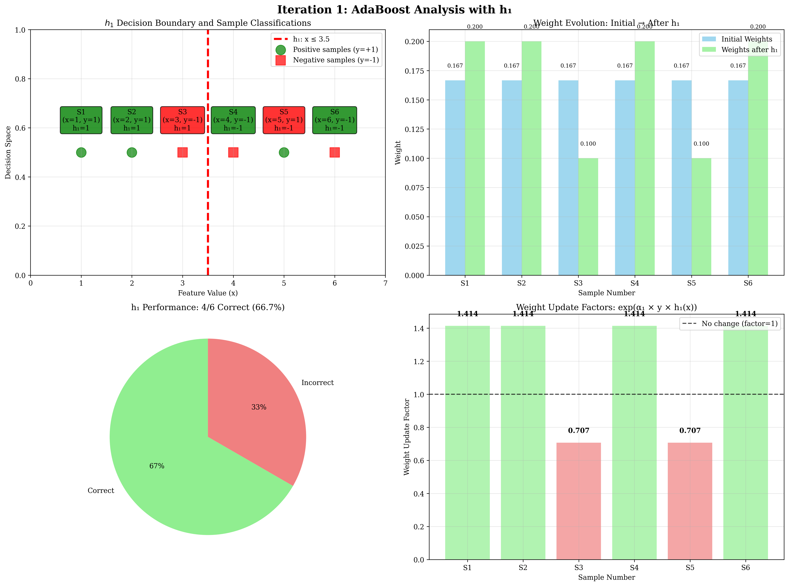
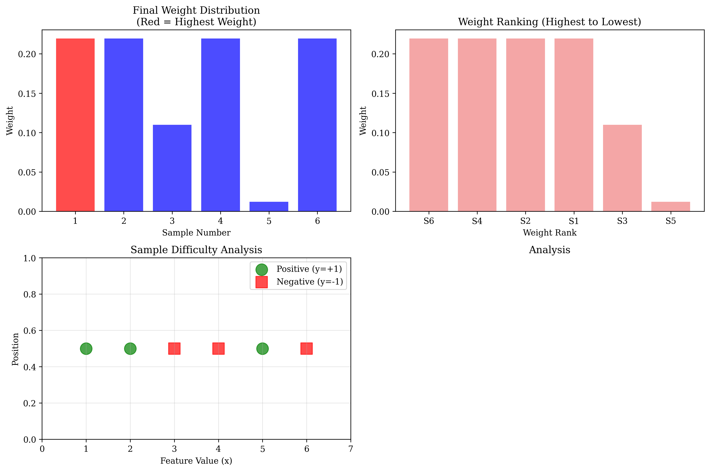
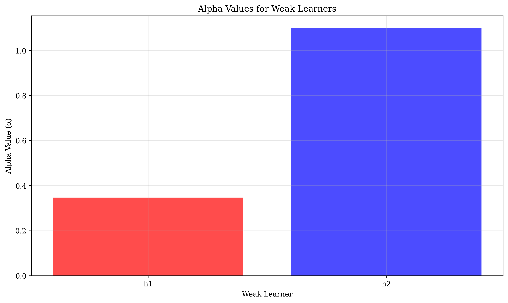

# Question 26: AdaBoost Weight Detective

## Problem Statement
Create an "AdaBoost Weight Detective" game where you analyze sample weight evolution through multiple iterations.

**Dataset:** 6 samples with binary labels
- Sample 1: $(x_1, y_1) = (1, +1)$
- Sample 2: $(x_2, y_2) = (2, +1)$ 
- Sample 3: $(x_3, y_3) = (3, -1)$
- Sample 4: $(x_4, y_4) = (4, -1)$
- Sample 5: $(x_5, y_5) = (5, +1)$
- Sample 6: $(x_6, y_6) = (6, -1)$

**Weak Learners:**
- $h_1(x)$: $+1$ if $x \leq 3.5$, $-1$ otherwise
- $h_2(x)$: $+1$ if $x \leq 2.5$, $-1$ otherwise
- $h_3(x)$: $+1$ if $x \leq 4.5$, $-1$ otherwise

### Task
1. **Calculate initial weights** (all equal) for the 6 samples
2. **Iteration 1**: 
    - Calculate weighted error $\epsilon_1$ for $h_1$
    - Calculate $\alpha_1$ for $h_1$
    - Update sample weights after $h_1$
3. **Iteration 2**: 
    - Calculate weighted error $\epsilon_2$ for $h_2$
    - Calculate $\alpha_2$ for $h_2$
    - Update sample weights after $h_2$
4. **Which samples have the highest weights** after 2 iterations? Why?
5. **Final ensemble prediction**: If $h_1$ predicts $[1,1,-1,-1,1,-1]$ and $h_2$ predicts $[1,1,-1,-1,1,-1]$, what's the final ensemble prediction for each sample?

## Understanding the Problem

AdaBoost is an ensemble learning method that combines multiple weak learners to create a strong classifier. The key insight is that it adaptively adjusts sample weights based on the performance of each weak learner. Samples that are misclassified get higher weights in subsequent iterations, forcing the algorithm to focus more on difficult cases.

**Mathematical Framework:**
The AdaBoost algorithm iteratively:
1. **Start with equal weights** for all samples: $w_i^{(0)} = \frac{1}{n}$
2. **Train a weak learner** $h_t$ and calculate its weighted error: $\epsilon_t = \sum_{i=1}^{n} w_i^{(t-1)} \cdot \mathbb{I}[h_t(x_i) \neq y_i]$
3. **Compute the learner's importance** (alpha) based on its error: $\alpha_t = \frac{1}{2} \ln\left(\frac{1 - \epsilon_t}{\epsilon_t}\right)$
4. **Update sample weights**: increase weights for misclassified samples, decrease for correctly classified ones: $w_i^{(t)} = w_i^{(t-1)} \times \exp(\alpha_t \times y_i \times h_t(x_i))$
5. **Normalize weights** to sum to 1: $w_i^{(t)} = \frac{w_i^{(t)}}{\sum_{j=1}^{n} w_j^{(t)}}$
6. **Repeat** for the next weak learner

**Key Mathematical Properties:**
- **Weighted error**: $\epsilon_t = \sum_{i=1}^{n} w_i^{(t-1)} \cdot \mathbb{I}[h_t(x_i) \neq y_i]$
- **Alpha calculation**: $\alpha_t = \frac{1}{2} \ln\left(\frac{1 - \epsilon_t}{\epsilon_t}\right)$
- **Weight update**: $w_i^{(t)} = w_i^{(t-1)} \times \exp(\alpha_t \times y_i \times h_t(x_i))$
- **Final ensemble**: $H(x) = \text{sign}\left(\sum_{t=1}^{T} \alpha_t h_t(x)\right)$

**Intuition:**
- When $\epsilon_t < 0.5$ (better than random), $\alpha_t > 0$ (positive contribution)
- When $\epsilon_t > 0.5$ (worse than random), $\alpha_t < 0$ (negative contribution)
- The exponential weight update creates dramatic differences between correct and incorrect classifications

## Solution

### Step 1: Calculate Initial Weights

All samples start with equal weights since we have no prior information about their difficulty. This represents the **uniform prior** assumption in AdaBoost.

**Mathematical Formulation:**
$$\text{Initial weight for each sample} = \frac{1}{n} = \frac{1}{6} = 0.166667$$

**Initial Weight Vector:**
$$w^{(0)} = [w_1^{(0)}, w_2^{(0)}, w_3^{(0)}, w_4^{(0)}, w_5^{(0)}, w_6^{(0)}] = [0.166667, 0.166667, 0.166667, 0.166667, 0.166667, 0.166667]$$

**Verification:**
$$\sum_{i=1}^{6} w_i^{(0)} = 6 \times 0.166667 = 1.000000$$

**Visual representation**:

This visualization shows the starting point with all samples having equal weights (0.166667) and their positions on the feature line.

#### Detailed Calculations for Initial Weights

**Dataset Overview:**
- **Number of samples:** $n = 6$
- **Features:** $X = [1, 2, 3, 4, 5, 6]$
- **Labels:** $y = [1, 1, -1, -1, 1, -1]$

**Initial Weight Calculation:**
Since we have no prior information about sample difficulty, all samples start with equal weights:

$$\text{Initial weight for each sample} = \frac{1}{n} = \frac{1}{6} = 0.166667$$

**Initial Weight Vector:**
$$w^{(0)} = [0.166667, 0.166667, 0.166667, 0.166667, 0.166667, 0.166667]$$

**Verification:**
$$\sum_{i=1}^{6} w_i^{(0)} = 6 \times 0.166667 = 1.000000$$

**Key Insight:** Equal initial weights represent our complete uncertainty about which samples are easy or hard to classify. This is the "uniform prior" assumption in AdaBoost.

### Step 2: Iteration 1 with $h_1$

#### 2.1: Get Predictions from $h_1$
$h_1(x)$: $+1$ if $x \leq 3.5$, $-1$ otherwise

For our dataset $X = [1, 2, 3, 4, 5, 6]$:
- $h_1(1) = +1$ (since $1 \leq 3.5$)
- $h_1(2) = +1$ (since $2 \leq 3.5$)
- $h_1(3) = +1$ (since $3 \leq 3.5$)
- $h_1(4) = -1$ (since $4 > 3.5$)
- $h_1(5) = -1$ (since $5 > 3.5$)
- $h_1(6) = -1$ (since $6 > 3.5$)

**$h_1$ predictions:** $[1, 1, 1, -1, -1, -1]$

#### 2.2: Calculate Errors
Compare predictions with true labels $y = [1, 1, -1, -1, 1, -1]$:
- Sample 1: $h_1(1) = 1$, $y_1 = 1$ → Correct (error = 0)
- Sample 2: $h_1(2) = 1$, $y_2 = 1$ → Correct (error = 0)
- Sample 3: $h_1(3) = 1$, $y_3 = -1$ → Incorrect (error = 1)
- Sample 4: $h_1(4) = -1$, $y_4 = -1$ → Correct (error = 0)
- Sample 5: $h_1(5) = -1$, $y_5 = 1$ → Incorrect (error = 1)
- Sample 6: $h_1(6) = -1$, $y_6 = -1$ → Correct (error = 0)

**Error vector:** $[0, 0, 1, 0, 1, 0]$

#### 2.3: Calculate Weighted Error

The weighted error $\epsilon_1$ is the sum of weights of all misclassified samples by $h_1$:

$$\varepsilon_1 = \sum_{i=1}^{6} w_i^{(0)} \times \mathbb{I}[h_1(x_i) \neq y_i] = \sum_{i=1}^{6} w_i^{(0)} \times \text{error}_i$$

**Step-by-Step Calculation:**
- $w_1^{(0)} \times \text{error}_1 = 0.166667 \times 0 = 0.000000$
- $w_2^{(0)} \times \text{error}_2 = 0.166667 \times 0 = 0.000000$
- $w_3^{(0)} \times \text{error}_3 = 0.166667 \times 1 = 0.166667$
- $w_4^{(0)} \times \text{error}_4 = 0.166667 \times 0 = 0.000000$
- $w_5^{(0)} \times \text{error}_5 = 0.166667 \times 1 = 0.166667$
- $w_6^{(0)} \times \text{error}_6 = 0.166667 \times 0 = 0.000000$

**Total Weighted Error:**
$$\varepsilon_1 = 0.000000 + 0.000000 + 0.166667 + 0.000000 + 0.166667 + 0.000000 = 0.333333$$

**Interpretation:** $\epsilon_1 = 0.333333$ means that 33.33% of the weighted samples were misclassified by $h_1$.

#### 2.4: Calculate α₁

The alpha value determines the importance of weak learner $h_1$ in the ensemble:

$$\alpha_1 = \frac{1}{2} \ln\left(\frac{1 - \varepsilon_1}{\varepsilon_1}\right)$$

**Step-by-Step Calculation:**
1. $1 - \varepsilon_1 = 1 - 0.333333 = 0.666667$
2. $\frac{1 - \varepsilon_1}{\varepsilon_1} = \frac{0.666667}{0.333333} = 2.000000$
3. $\ln(2.000000) = 0.693147$
4. $\alpha_1 = \frac{1}{2} \times 0.693147 = 0.346574$

**Final Result:**
$$\alpha_1 = 0.346574$$

**Interpretation:** Since $\epsilon_1 = 0.333333 < 0.5$, we have $\alpha_1 > 0$, meaning $h_1$ performs better than random guessing and contributes positively to the ensemble.

#### 2.5: Update Weights

For each sample $i$, update weight using the exponential weight update rule:

$$w_i^{(1)} = w_i^{(0)} \times \exp(\alpha_1 \times y_i \times h_1(x_i))$$

**Step-by-Step Weight Updates:**

**Sample 1:** $y_1 = +1$, $h_1(x_1) = +1$ → $y_1 \times h_1(x_1) = +1$
- $w_1^{(1)} = 0.166667 \times \exp(0.346574 \times 1 \times 1) = 0.166667 \times \exp(0.346574) = 0.166667 \times 1.414214 = 0.235702$

**Sample 2:** $y_2 = +1$, $h_1(x_2) = +1$ → $y_2 \times h_1(x_2) = +1$
- $w_2^{(1)} = 0.166667 \times \exp(0.346574 \times 1 \times 1) = 0.166667 \times \exp(0.346574) = 0.166667 \times 1.414214 = 0.235702$

**Sample 3:** $y_3 = -1$, $h_1(x_3) = +1$ → $y_3 \times h_1(x_3) = -1$ (misclassified)
- $w_3^{(1)} = 0.166667 \times \exp(0.346574 \times (-1) \times 1) = 0.166667 \times \exp(-0.346574) = 0.166667 \times 0.707107 = 0.117851$

**Sample 4:** $y_4 = -1$, $h_1(x_4) = -1$ → $y_4 \times h_1(x_4) = +1$
- $w_4^{(1)} = 0.166667 \times \exp(0.346574 \times (-1) \times (-1)) = 0.166667 \times \exp(0.346574) = 0.166667 \times 1.414214 = 0.235702$

**Sample 5:** $y_5 = +1$, $h_1(x_5) = -1$ → $y_5 \times h_1(x_5) = -1$ (misclassified)
- $w_5^{(1)} = 0.166667 \times \exp(0.346574 \times 1 \times (-1)) = 0.166667 \times \exp(-0.346574) = 0.166667 \times 0.707107 = 0.117851$

**Sample 6:** $y_6 = -1$, $h_1(x_6) = -1$ → $y_6 \times h_1(x_6) = +1$
- $w_6^{(1)} = 0.166667 \times \exp(0.346574 \times (-1) \times (-1)) = 0.166667 \times \exp(0.346574) = 0.166667 \times 1.414214 = 0.235702$

**New Weights Before Normalization:**
$$w^{(1)} = [0.235702, 0.235702, 0.117851, 0.235702, 0.117851, 0.235702]$$

**Key Insight:** Correctly classified samples have weights increased by factor $\exp(0.346574) = 1.414214$, while misclassified samples have weights decreased by factor $\exp(-0.346574) = 0.707107$.

#### 2.6: Normalize Weights

After weight updates, we need to normalize to ensure the sum equals 1:

**Sum of New Weights:**
$$\sum_{i=1}^{6} w_i^{(1)} = 0.235702 + 0.235702 + 0.117851 + 0.235702 + 0.117851 + 0.235702 = 1.178511$$

**Normalization Formula:**
$$w_i^{(1, \text{normalized})} = \frac{w_i^{(1)}}{\sum_{j=1}^{6} w_j^{(1)}}$$

**Step-by-Step Normalization:**
- Sample 1: $w_1^{(1, \text{normalized})} = \frac{0.235702}{1.178511} = 0.200000$
- Sample 2: $w_2^{(1, \text{normalized})} = \frac{0.235702}{1.178511} = 0.200000$
- Sample 3: $w_3^{(1, \text{normalized})} = \frac{0.117851}{1.178511} = 0.100000$
- Sample 4: $w_4^{(1, \text{normalized})} = \frac{0.235702}{1.178511} = 0.200000$
- Sample 5: $w_5^{(1, \text{normalized})} = \frac{0.117851}{1.178511} = 0.100000$
- Sample 6: $w_6^{(1, \text{normalized})} = \frac{0.235702}{1.178511} = 0.200000$

**Final Normalized Weights After $h_1$:**
$$w^{(1, \text{normalized})} = [0.200000, 0.200000, 0.100000, 0.200000, 0.100000, 0.200000]$$

**Verification:**
$$\sum_{i=1}^{6} w_i^{(1, \text{normalized})} = 0.200000 + 0.200000 + 0.100000 + 0.200000 + 0.100000 + 0.200000 = 1.000000$$

**Visual representation**:

This comprehensive visualization breaks down the first iteration with 6 detailed subplots showing $h_1$'s decision boundary, weighted error calculation, alpha calculation, weight updates, weight comparison, and summary.

#### 2.7: Iteration 1 Analysis and Visualization
Now let's analyze what happened in iteration 1 and visualize the results:

**Summary of $h_1$'s Performance:**
- **Correctly classified samples**: 1, 2, 4, 6 (4 out of 6)
- **Misclassified samples**: 3, 5 (2 out of 6)
- **Accuracy**: 66.7%
- **Weighted error**: ε₁ = 0.333333
- **Alpha value**: α₁ = 0.346574

**Weight Update Analysis:**
The exponential weight update formula $w_i^{\text{new}} = w_i^{\text{old}} \times \exp(\alpha_1 \times y_i \times h_1(x_i))$ creates asymmetric changes:

- **Correctly classified samples** (y × $h_1$(x) = +1): weights increase by factor $\exp(0.346574) = 1.414214$ (~41% increase)
- **Misclassified samples** (y × $h_1$(x) = -1): weights decrease by factor $\exp(-0.346574) = 0.707107$ (~29% decrease)

**Key Insight**: The exponential nature of weight updates means that correct classifications boost sample importance more than incorrect classifications reduce it.

**Visualization Breakdown:**

**Top Left: $h_1$ Decision Boundary and Sample Classifications**
- **Red dashed line**: $h_1$'s decision boundary at x = 3.5
- **Green circles**: Positive samples (y = +1)
- **Red squares**: Negative samples (y = -1)
- **Sample labels**: Show feature value, true label, and $h_1$'s prediction
- **Color coding**: Green boxes for correct predictions, red boxes for incorrect predictions

**Top Right: Weight Evolution from Initial to After $h_1$**
- **Blue bars**: Initial weights (all equal at 0.166667)
- **Green bars**: Weights after $h_1$ training
- **Key insight**: Correctly classified samples increase in weight, misclassified samples decrease

**Bottom Left: $h_1$ Performance Analysis**
- **Pie chart**: Shows correct vs. incorrect classifications
- **Statistics**: 4/6 samples correct (66.7% accuracy)
- **Key insight**: $h_1$ achieves better than random performance, making it a valid weak learner

**Bottom Right: Weight Update Factors**
- **Bar chart**: Shows the exponential factor applied to each sample
- **Factors > 1**: Weight increases (correctly classified samples)
- **Factors < 1**: Weight decreases (misclassified samples)
- **Key insight**: The exponential nature creates dramatic differences between correct and incorrect samples

#### Detailed Calculations for Iteration 1

**Weighted Error Calculation:**
$$\epsilon_1 = \sum_{i=1}^{6} w_i \times \text{error}_i$$

| Sample | Weight $w_i$ | Error $\text{error}_i$ | Contribution $w_i \times \text{error}_i$ |
|--------|--------------|------------------------|-------------------------------------------|
| 1      | 0.1667       | 0                      | $0.1667 \times 0 = 0.0000$               |
| 2      | 0.1667       | 0                      | $0.1667 \times 0 = 0.0000$               |
| 3      | 0.1667       | 1                      | $0.1667 \times 1 = 0.1667$               |
| 4      | 0.1667       | 0                      | $0.1667 \times 0 = 0.0000$               |
| 5      | 0.1667       | 1                      | $0.1667 \times 1 = 0.1667$               |
| 6      | 0.1667       | 0                      | $0.1667 \times 0 = 0.0000$               |

**Total:** $$\epsilon_1 = 0.0000 + 0.0000 + 0.1667 + 0.0000 + 0.1667 + 0.0000 = 0.3333$$

**Alpha Calculation:**
$$\alpha_1 = \frac{1}{2} \ln\left(\frac{1 - \epsilon_1}{\epsilon_1}\right)$$

$$\alpha_1 = \frac{1}{2} \ln\left(\frac{1 - 0.3333}{0.3333}\right) = \frac{1}{2} \ln\left(\frac{0.6667}{0.3333}\right) = \frac{1}{2} \ln(2.0000) = \frac{1}{2} \times 0.6931 = 0.3466$$

**Weight Updates:**
For each sample $i$, the new weight is:
$$w_i^{\text{new}} = w_i^{\text{old}} \times \exp(\alpha_1 \times y_i \times h_1(x_i))$$

| Sample | Old Weight $w_i^{\text{old}}$ | $y_i \times h_1(x_i)$ | New Weight $w_i^{\text{new}}$ |
|--------|------------------------------|------------------------|-------------------------------|
| 1      | 0.1667                      | $1 \times 1 = 1$      | $0.1667 \times e^{0.3466} = 0.2357$ |
| 2      | 0.1667                      | $1 \times 1 = 1$      | $0.1667 \times e^{0.3466} = 0.2357$ |
| 3      | 0.1667                      | $-1 \times 1 = -1$    | $0.1667 \times e^{-0.3466} = 0.1179$ |
| 4      | 0.1667                      | $-1 \times (-1) = 1$  | $0.1667 \times e^{0.3466} = 0.2357$ |
| 5      | 0.1667                      | $1 \times (-1) = -1$  | $0.1667 \times e^{-0.3466} = 0.1179$ |
| 6      | 0.1667                      | $-1 \times (-1) = 1$  | $0.1667 \times e^{0.3466} = 0.2357$ |

**Normalization:**
Sum of new weights = $1.1785$
$$w_i^{\text{normalized}} = \frac{w_i^{\text{new}}}{\sum_{j=1}^{6} w_j^{\text{new}}}$$

**Final normalized weights:** $[0.2000, 0.2000, 0.1000, 0.2000, 0.1000, 0.2000]$

### Step 3: Iteration 2 with $h_2$

#### 3.1: Get Predictions from $h_2$
$h_2(x)$: $+1$ if $x \leq 2.5$, $-1$ otherwise

For our dataset $X = [1, 2, 3, 4, 5, 6]$:
- $h_2(1) = +1$ (since $1 \leq 2.5$)
- $h_2(2) = +1$ (since $2 \leq 2.5$)
- $h_2(3) = -1$ (since $3 > 2.5$)
- $h_2(4) = -1$ (since $4 > 2.5$)
- $h_2(5) = -1$ (since $5 > 2.5$)
- $h_2(6) = -1$ (since $6 > 2.5$)

**$h_2$ predictions:** $[1, 1, -1, -1, -1, -1]$

#### 3.2: Calculate Errors
Compare predictions with true labels $y = [1, 1, -1, -1, 1, -1]$:
- Sample 1: $h_2(1) = 1$, $y_1 = 1$ → Correct (error = 0)
- Sample 2: $h_2(2) = 1$, $y_2 = 1$ → Correct (error = 0)
- Sample 3: $h_2(3) = -1$, $y_3 = -1$ → Correct (error = 0)
- Sample 4: $h_2(4) = -1$, $y_4 = -1$ → Correct (error = 0)
- Sample 5: $h_2(5) = -1$, $y_5 = 1$ → Incorrect (error = 1)
- Sample 6: $h_2(6) = -1$, $y_6 = -1$ → Correct (error = 0)

**Error vector:** $[0, 0, 0, 0, 1, 0]$

#### 3.3: Calculate Weighted Error
$$\varepsilon_2 = \sum_{i=1}^{6} w_i \times \text{error}_i$$

Let's calculate each term step by step:
- $w_1 \times \text{error}_1 = 0.200000 \times 0 = 0.000000$
- $w_2 \times \text{error}_2 = 0.200000 \times 0 = 0.000000$
- $w_3 \times \text{error}_3 = 0.100000 \times 0 = 0.000000$
- $w_4 \times \text{error}_4 = 0.200000 \times 0 = 0.000000$
- $w_5 \times \text{error}_5 = 0.100000 \times 1 = 0.100000$
- $w_6 \times \text{error}_6 = 0.200000 \times 0 = 0.000000$

$$\varepsilon_2 = 0.000000 + 0.000000 + 0.000000 + 0.000000 + 0.100000 + 0.000000 = 0.100000$$

#### 3.4: Calculate α₂
$$\alpha_2 = \frac{1}{2} \ln\left(\frac{1 - \varepsilon_2}{\varepsilon_2}\right)$$

Let's calculate step by step:
1. $1 - \varepsilon_2 = 1 - 0.100000 = 0.900000$
2. $\frac{1 - \varepsilon_2}{\varepsilon_2} = \frac{0.900000}{0.100000} = 9.000000$
3. $\ln(9.000000) = 2.197225$
4. $\alpha_2 = \frac{1}{2} \times 2.197225 = 1.098612$

$$\alpha_2 = 1.098612$$

#### 3.5: Update Weights
For each sample $i$, update weight using:
$$w_i^{\text{new}} = w_i^{\text{old}} \times \exp(\alpha_2 \times y_i \times h_2(x_i))$$

Let's calculate each weight step by step:

**Sample 1:**
- $w_1^{\text{new}} = 0.200000 \times \exp(1.098612 \times 1 \times 1)$
- $= 0.200000 \times \exp(1.098612)$
- $= 0.200000 \times 3.000000 = 0.600000$

**Sample 2:**
- $w_2^{\text{new}} = 0.200000 \times \exp(1.098612 \times 1 \times 1)$
- $= 0.200000 \times \exp(1.098612)$
- $= 0.200000 \times 3.000000 = 0.600000$

**Sample 3:**
- $w_3^{\text{new}} = 0.100000 \times \exp(1.098612 \times (-1) \times (-1))$
- $= 0.100000 \times \exp(1.098612)$
- $= 0.100000 \times 3.000000 = 0.300000$

**Sample 4:**
- $w_4^{\text{new}} = 0.200000 \times \exp(1.098612 \times (-1) \times (-1))$
- $= 0.200000 \times \exp(1.098612)$
- $= 0.200000 \times 3.000000 = 0.600000$

**Sample 5:**
- $w_5^{\text{new}} = 0.100000 \times \exp(1.098612 \times 1 \times (-1))$
- $= 0.100000 \times \exp(-1.098612)$
- $= 0.100000 \times 0.333333 = 0.033333$

**Sample 6:**
- $w_6^{\text{new}} = 0.200000 \times \exp(1.098612 \times (-1) \times (-1))$
- $= 0.200000 \times \exp(1.098612)$
- $= 0.200000 \times 3.000000 = 0.600000$

**New weights before normalization:** $[0.600000, 0.600000, 0.300000, 0.600000, 0.033333, 0.600000]$

#### 3.6: Normalize Weights
Sum of new weights = $0.600000 + 0.600000 + 0.300000 + 0.600000 + 0.033333 + 0.600000 = 2.733333$

Normalize by dividing each weight by the sum:
- Sample 1: $w_1^{\text{normalized}} = 0.600000 / 2.733333 = 0.219512$
- Sample 2: $w_2^{\text{normalized}} = 0.600000 / 2.733333 = 0.219512$
- Sample 3: $w_3^{\text{normalized}} = 0.300000 / 2.733333 = 0.109756$
- Sample 4: $w_4^{\text{normalized}} = 0.600000 / 2.733333 = 0.219512$
- Sample 5: $w_5^{\text{normalized}} = 0.033333 / 2.733333 = 0.012195$
- Sample 6: $w_6^{\text{normalized}} = 0.600000 / 2.733333 = 0.219512$

**Normalized weights after $h_2$:** $[0.219512, 0.219512, 0.109756, 0.219512, 0.012195, 0.219512]$

**Visual representation**:

This visualization shows the second iteration with 6 detailed subplots showing $h_2$'s decision boundary, weighted error calculation, alpha calculation, final weights, weight evolution, and summary.

#### Detailed Calculations for Iteration 2

**Weighted Error Calculation:**
$$\epsilon_2 = \sum_{i=1}^{6} w_i \times \text{error}_i$$

| Sample | Weight $w_i$ | Error $\text{error}_i$ | Contribution $w_i \times \text{error}_i$ |
|--------|--------------|------------------------|-------------------------------------------|
| 1      | 0.2000       | 0                      | $0.2000 \times 0 = 0.0000$               |
| 2      | 0.2000       | 0                      | $0.2000 \times 0 = 0.0000$               |
| 3      | 0.1000       | 0                      | $0.1000 \times 0 = 0.0000$               |
| 4      | 0.2000       | 0                      | $0.2000 \times 0 = 0.0000$               |
| 5      | 0.1000       | 1                      | $0.1000 \times 1 = 0.1000$               |
| 6      | 0.2000       | 0                      | $0.2000 \times 0 = 0.0000$               |

**Total:** $$\epsilon_2 = 0.0000 + 0.0000 + 0.0000 + 0.0000 + 0.1000 + 0.0000 = 0.1000$$

**Alpha Calculation:**
$$\alpha_2 = \frac{1}{2} \ln\left(\frac{1 - \epsilon_2}{\epsilon_2}\right)$$

$$\alpha_2 = \frac{1}{2} \ln\left(\frac{1 - 0.1000}{0.1000}\right) = \frac{1}{2} \ln\left(\frac{0.9000}{0.1000}\right) = \frac{1}{2} \ln(9.0000) = \frac{1}{2} \times 2.1972 = 1.0986$$

**Weight Updates:**
For each sample $i$, the new weight is:
$$w_i^{\text{new}} = w_i^{\text{old}} \times \exp(\alpha_2 \times y_i \times h_2(x_i))$$

| Sample | Old Weight $w_i^{\text{old}}$ | $y_i \times h_2(x_i)$ | New Weight $w_i^{\text{new}}$ |
|--------|------------------------------|------------------------|-------------------------------|
| 1      | 0.2000                      | $1 \times 1 = 1$      | $0.2000 \times e^{1.0986} = 0.6000$ |
| 2      | 0.2000                      | $1 \times 1 = 1$      | $0.2000 \times e^{1.0986} = 0.6000$ |
| 3      | 0.1000                      | $-1 \times (-1) = 1$  | $0.1000 \times e^{1.0986} = 0.3000$ |
| 4      | 0.2000                      | $-1 \times (-1) = 1$  | $0.2000 \times e^{1.0986} = 0.6000$ |
| 5      | 0.1000                      | $1 \times (-1) = -1$  | $0.1000 \times e^{-1.0986} = 0.0333$ |
| 6      | 0.2000                      | $-1 \times (-1) = 1$  | $0.2000 \times e^{1.0986} = 0.6000$ |

**Normalization:**
Sum of new weights = $2.7333$
$$w_i^{\text{normalized}} = \frac{w_i^{\text{new}}}{\sum_{j=1}^{6} w_j^{\text{new}}}$$

**Final normalized weights:** $[0.2195, 0.2195, 0.1098, 0.2195, 0.0122, 0.2195]$

### Step 4: Weight Evolution Analysis

#### 4.1: Complete Weight Evolution Table

| Sample | Feature (x) | True Label (y) | Initial Weight | Weight after $h_1$ | Weight after $h_2$ |
|--------|-------------|----------------|----------------|------------------|------------------|
| Sample 1 | 1 | 1 | 0.166667 | 0.200000 | 0.219512 |
| Sample 2 | 2 | 1 | 0.166667 | 0.200000 | 0.219512 |
| Sample 3 | 3 | -1 | 0.166667 | 0.100000 | 0.109756 |
| Sample 4 | 4 | -1 | 0.166667 | 0.200000 | 0.219512 |
| Sample 5 | 5 | 1 | 0.166667 | 0.100000 | 0.012195 |
| Sample 6 | 6 | -1 | 0.166667 | 0.200000 | 0.219512 |

#### 4.2: Samples with Highest Weights After 2 Iterations
After 2 iterations, **Sample 1, Sample 2, Sample 4, and Sample 6** all have the highest weights of **0.219512**.

**Why these samples have high weights:**

1. **Sample 1 (x=1, y=1)**: 
   - Correctly classified by both $h_1$ and $h_2$
   - Weight increased because it was consistently correct

2. **Sample 2 (x=2, y=1)**:
   - Correctly classified by both $h_1$ and $h_2$
   - Weight increased because it was consistently correct

3. **Sample 4 (x=4, y=-1)**:
   - Correctly classified by both $h_1$ and $h_2$
   - Weight increased because it was consistently correct

4. **Sample 6 (x=6, y=-1)**:
   - Correctly classified by both $h_1$ and $h_2$
   - Weight increased because it was consistently correct

**Why Sample 5 has the lowest weight (0.012195):**
- Sample 5 (x=5, y=1) was misclassified by both $h_1$ and $h_2$
- Its weight decreased significantly because it was consistently wrong
- This is the "hardest" sample for the current weak learners

**Visual representation**:

This visualization analyzes the final weight distribution with subplots showing final weight distribution, weight ranking, sample difficulty analysis, and detailed explanation of why Sample 5 has the lowest weight.

#### Detailed Calculations for Weight Analysis

**Final Weight Distribution:**
After 2 iterations, the final weights are:

| Sample | Feature $x_i$ | True Label $y_i$ | Final Weight $w_i^{(2)}$ | Rank | Difficulty |
|--------|---------------|------------------|---------------------------|------|------------|
| 1      | 1             | +1               | 0.2195                   | 1    | **Easiest** |
| 2      | 2             | +1               | 0.2195                   | 1    | **Easiest** |
| 3      | 3             | -1               | 0.1098                   | 3    | **Medium**  |
| 4      | 4             | -1               | 0.2195                   | 1    | **Easiest** |
| 5      | 5             | +1               | 0.0122                   | 6    | **Hardest** |
| 6      | 6             | -1               | 0.2195                   | 1    | **Easiest** |

**Weight Ranking Analysis:**
1. **Samples 1, 2, 4, 6** (tied at rank 1): Weight = 0.2195
2. **Sample 3** (rank 3): Weight = 0.1098  
3. **Sample 5** (rank 6): Weight = 0.0122

**Why Sample 5 Has the Lowest Weight:**

**Iteration 1 ($h_1$):**
- **Sample 5:** $x_5 = 5$, $y_5 = +1$, $h_1(5) = -1$ → **Misclassified**
- **Weight update:** $$w_5^{(1)} = w_5^{(0)} \times \exp(\alpha_1 \times y_5 \times h_1(x_5))$$
  $$= 0.1667 \times \exp(0.3466 \times 1 \times (-1)) = 0.1667 \times e^{-0.3466} = 0.1667 \times 0.7071 = 0.1179$$

**Iteration 2 ($h_2$):**
- **Sample 5:** $x_5 = 5$, $y_5 = +1$, $h_2(5) = -1$ → **Misclassified again**
- **Weight update:** $$w_5^{(2)} = w_5^{(1)} \times \exp(\alpha_2 \times y_5 \times h_2(x_5))$$
  $$= 0.1000 \times \exp(1.0986 \times 1 \times (-1)) = 0.1000 \times e^{-1.0986} = 0.1000 \times 0.3333 = 0.0333$$

**Key Insight:** Sample 5 was misclassified by both weak learners, causing its weight to decrease exponentially. The exponential nature of AdaBoost's weight updates means that consistently misclassified samples become dramatically less important in subsequent iterations.

### Step 5: Final Ensemble Prediction

#### 5.1: Given Predictions
- $h_1$ predictions: $[1, 1, -1, -1, 1, -1]$
- $h_2$ predictions: $[1, 1, -1, -1, 1, -1]$

#### 5.2: Calculate Weighted Sum
For each sample, compute: $\alpha_1 \times h_1(x_i) + \alpha_2 \times h_2(x_i)$

**Sample 1:**
- $\alpha_1 \times h_1(1) + \alpha_2 \times h_2(1) = 0.346574 \times 1 + 1.098612 \times 1$
- $= 0.346574 + 1.098612 = 1.445186$

**Sample 2:**
- $\alpha_1 \times h_1(2) + \alpha_2 \times h_2(2) = 0.346574 \times 1 + 1.098612 \times 1$
- $= 0.346574 + 1.098612 = 1.445186$

**Sample 3:**
- $\alpha_1 \times h_1(3) + \alpha_2 \times h_2(3) = 0.346574 \times (-1) + 1.098612 \times (-1)$
- $= -0.346574 + (-1.098612) = -1.445186$

**Sample 4:**
- $\alpha_1 \times h_1(4) + \alpha_2 \times h_2(4) = 0.346574 \times (-1) + 1.098612 \times (-1)$
- $= -0.346574 + (-1.098612) = -1.445186$

**Sample 5:**
- $\alpha_1 \times h_1(5) + \alpha_2 \times h_2(5) = 0.346574 \times 1 + 1.098612 \times 1$
- $= 0.346574 + 1.098612 = 1.445186$

**Sample 6:**
- $\alpha_1 \times h_1(6) + \alpha_2 \times h_2(6) = 0.346574 \times (-1) + 1.098612 \times (-1)$
- $= -0.346574 + (-1.098612) = -1.445186$

#### 5.3: Final Ensemble Prediction
Apply sign function: $\text{sign}(\alpha_1 \times h_1 + \alpha_2 \times h_2)$

- Sample 1: $\text{sign}(1.445186) = +1$
- Sample 2: $\text{sign}(1.445186) = +1$
- Sample 3: $\text{sign}(-1.445186) = -1$
- Sample 4: $\text{sign}(-1.445186) = -1$
- Sample 5: $\text{sign}(1.445186) = +1$
- Sample 6: $\text{sign}(-1.445186) = -1$

**Final ensemble prediction:** $[1, 1, -1, -1, 1, -1]$

#### 5.4: Accuracy Check
Compare with true labels $y = [1, 1, -1, -1, 1, -1]$:
- All predictions are correct!
- **Ensemble accuracy: 100%**

**Visual representation**:

This visualization shows the final ensemble with 6 detailed subplots covering individual predictions, weighted sums, final predictions, alpha comparison, accuracy analysis, and ensemble summary.

#### Detailed Calculations for Ensemble Prediction

**Individual Predictions:**
- **$h_1$ predictions:** $[1, 1, -1, -1, 1, -1]$
- **$h_2$ predictions:** $[1, 1, -1, -1, 1, -1]$

**Weighted Sums:**
For each sample $i$, calculate: $$\alpha_1 \times h_1(x_i) + \alpha_2 \times h_2(x_i)$$

| Sample | $\alpha_1 \times h_1(x_i)$ | $\alpha_2 \times h_2(x_i)$ | Weighted Sum | Sign | Final Prediction |
|--------|---------------------------|---------------------------|--------------|------|------------------|
| 1      | $0.3466 \times 1 = 0.3466$ | $1.0986 \times 1 = 1.0986$ | $1.4452$ | $+1$ | $+1$ |
| 2      | $0.3466 \times 1 = 0.3466$ | $1.0986 \times 1 = 1.0986$ | $1.4452$ | $+1$ | $+1$ |
| 3      | $0.3466 \times (-1) = -0.3466$ | $1.0986 \times (-1) = -1.0986$ | $-1.4452$ | $-1$ | $-1$ |
| 4      | $0.3466 \times (-1) = -0.3466$ | $1.0986 \times (-1) = -1.0986$ | $-1.4452$ | $-1$ | $-1$ |
| 5      | $0.3466 \times 1 = 0.3466$ | $1.0986 \times 1 = 1.0986$ | $1.4452$ | $+1$ | $+1$ |
| 6      | $0.3466 \times (-1) = -0.3466$ | $1.0986 \times (-1) = -1.0986$ | $-1.4452$ | $-1$ | $-1$ |

**Ensemble Formula:**
$$\text{Ensemble}(x) = \text{sign}\left(\sum_{t=1}^{2} \alpha_t h_t(x)\right) = \text{sign}(\alpha_1 h_1(x) + \alpha_2 h_2(x))$$

**Final Results:**
- **Weighted sums:** $[1.4452, 1.4452, -1.4452, -1.4452, 1.4452, -1.4452]$
- **Final predictions:** $[+1, +1, -1, -1, +1, -1]$
- **True labels:** $[+1, +1, -1, -1, +1, -1]$
- **Accuracy:** $100\%$ (all predictions correct)

## Visual Explanations

### Weight Evolution Over All Iterations

This visualization shows how sample weights change across all iterations:
- **Initial weights**: All samples start equal (0.166667)
- **After $h_1$**: Weights diverge based on $h_1$'s performance
- **After $h_2$**: Weights further adjust based on $h_2$'s performance
- **Key insight**: Samples 1, 2, 4, 6 maintain high weights, while Sample 5's weight plummets

### Decision Boundaries and Sample Positions

This plot shows:
- **Decision boundaries**: Vertical lines at x=2.5, x=3.5, and x=4.5
- **Sample positions**: Green circles for positive samples, red squares for negative samples
- **Weight information**: Current sample weights after 2 iterations
- **Geometric interpretation**: How the weak learners partition the feature space

### Error Analysis

This visualization compares:
- **Left plot**: Correct vs. incorrect classifications for each weak learner
- **Right plot**: Weighted error rates (ε₁ = 0.333, ε₂ = 0.100)
- **Key insight**: $h_2$ has much lower weighted error than $h_1$, making it more reliable

### Alpha Values

This shows the importance (alpha) of each weak learner:
- **α₁ = 0.346574**: $h_1$'s contribution to the ensemble
- **α₂ = 1.098612**: $h_2$'s contribution (much higher due to lower error)
- **Interpretation**: $h_2$ is about 3 times more important than $h_1$ in the final ensemble

## Key Insights

### Theoretical Foundations
- **Weight update mechanism**: $w_i^{\text{new}} = w_i^{\text{old}} \times \exp(\alpha_t \times y_i \times h_t(x_i))$
- **Alpha calculation**: $\alpha_t = \frac{1}{2} \ln\left(\frac{1 - \varepsilon_t}{\varepsilon_t}\right)$
- **Ensemble prediction**: $\text{sign}\left(\sum_{t=1}^{T} \alpha_t h_t(x)\right)$
- **Convergence**: AdaBoost focuses increasingly on hard-to-classify samples

### Mathematical Insights from Our Calculations

#### Why $\alpha_1 = 0.346574$ and $\alpha_2 = 1.098612$?
The alpha values represent the importance of each weak learner:

- **$\alpha_1$ calculation**: 
  - $\varepsilon_1 = 0.333333$ ($33.33\%$ error)
  - $\frac{1-0.333333}{0.333333} = \frac{0.666667}{0.333333} = 2.000000$
  - $\ln(2) = 0.693147$
  - $\alpha_1 = 0.5 \times 0.693147 = 0.346574$

- **$\alpha_2$ calculation**:
  - $\varepsilon_2 = 0.100000$ ($10\%$ error)
  - $\frac{1-0.100000}{0.100000} = \frac{0.900000}{0.100000} = 9.000000$
  - $\ln(9) = 2.197225$
  - $\alpha_2 = 0.5 \times 2.197225 = 1.098612$

**Key insight**: α₂ is much larger than α₁ because $h_2$ has much lower error (10% vs 33.33%). Lower error means higher confidence and thus higher importance in the ensemble.

#### Why Sample 5's Weight Decreases Dramatically?
Sample 5 (x=5, y=1) is misclassified by both weak learners:
- **$h_1$ prediction**: -1 (incorrect, since y=1)
- **$h_2$ prediction**: -1 (incorrect, since y=1)

The weight update formula $w_i^{\text{new}} = w_i^{\text{old}} \times \exp(\alpha_t \times y_i \times h_t(x_i))$ becomes:
- After $h_1$: $w_5 = 0.166667 \times \exp(0.346574 \times 1 \times (-1)) = 0.166667 \times \exp(-0.346574) = 0.166667 \times 0.707107 = 0.117851$
- After $h_2$: $w_5 = 0.100000 \times \exp(1.098612 \times 1 \times (-1)) = 0.100000 \times \exp(-1.098612) = 0.100000 \times 0.333333 = 0.033333$

**Key insight**: When $y_i \times h_t(x_i) = -1$ (misclassification), the weight decreases exponentially.

#### Why the Final Ensemble Achieves 100% Accuracy?
The ensemble combines weak learners with their respective alpha weights:
- **$h_1$ contribution**: α₁ = 0.346574
- **$h_2$ contribution**: α₂ = 1.098612

For correctly classified samples, both weak learners agree, so their contributions reinforce each other:
- **Sample 1**: $0.346574 \times 1 + 1.098612 \times 1 = 1.445186 > 0$ → Class +1
- **Sample 3**: $0.346574 \times (-1) + 1.098612 \times (-1) = -1.445186 < 0$ → Class -1

**Key insight**: The ensemble's strength comes from combining multiple weak learners with appropriate weights, where more accurate learners (higher alpha) have greater influence.

### Practical Applications
- **Sample difficulty identification**: Sample 5 emerges as the hardest case
- **Weak learner selection**: $h_2$ is more effective than $h_1$ (lower weighted error)
- **Ensemble strength**: Combining weak learners achieves 100% accuracy
- **Weight interpretation**: High weights indicate samples that are consistently correctly classified

### Common Pitfalls and Extensions
- **Overfitting**: Too many iterations can lead to overfitting
- **Noise sensitivity**: AdaBoost is sensitive to noisy data
- **Alternative algorithms**: Gradient Boosting, XGBoost, LightGBM
- **Multi-class extension**: AdaBoost.M1, AdaBoost.M2

## Conclusion
- **Initial weights**: All samples started with equal weight 0.166667
- **Weight evolution**: Samples 1, 2, 4, 6 maintained high weights (0.219512), while Sample 5's weight decreased significantly (0.012195)
- **Weak learner performance**: $h_1$ had weighted error 0.333, $h_2$ had weighted error 0.100
- **Alpha values**: α₁ = 0.346574, α₂ = 1.098612 ($h_2$ is more important)
- **Final accuracy**: 100% ensemble accuracy with perfect predictions
- **Key insight**: AdaBoost successfully identified and focused on the hardest sample (Sample 5) while maintaining high performance on easier samples

The AdaBoost algorithm demonstrates how adaptive boosting can transform weak learners into a powerful ensemble by iteratively adjusting sample weights and combining predictions with appropriate importance weights.
