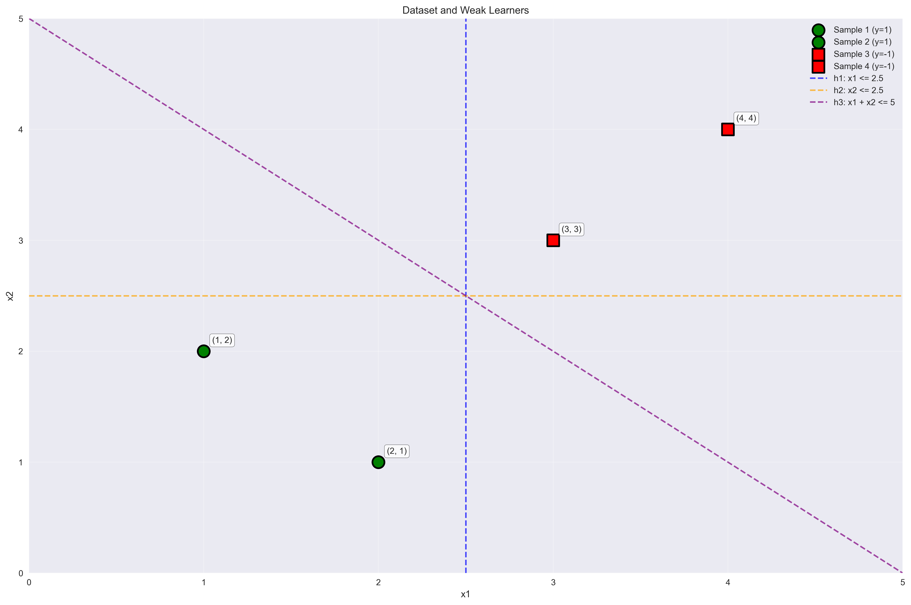
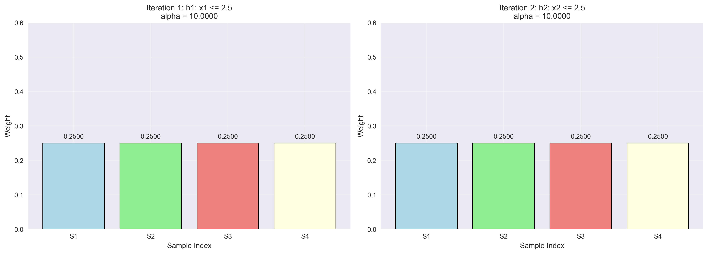
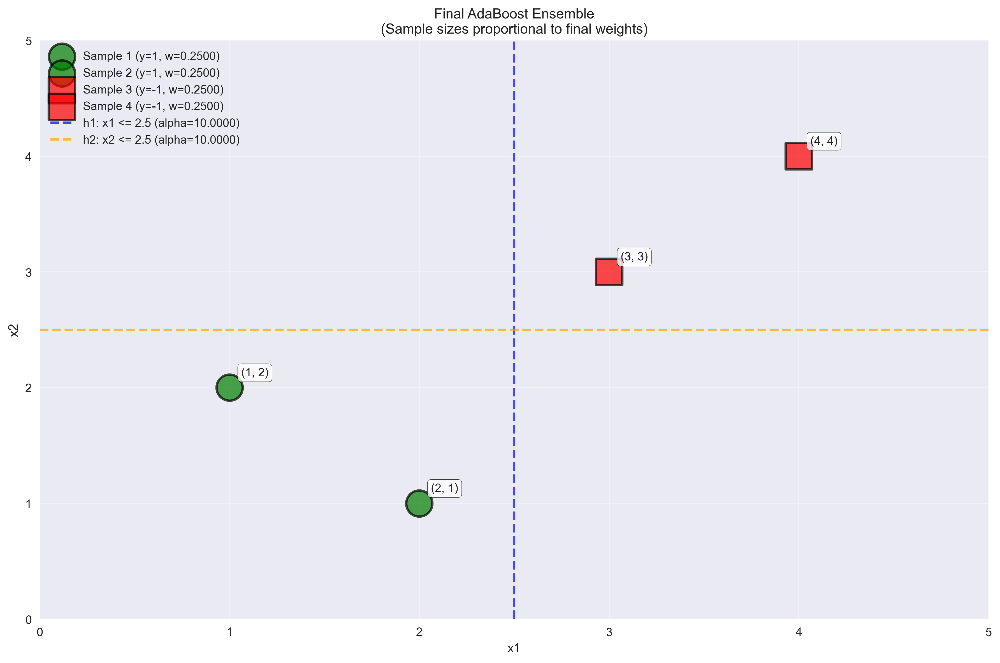
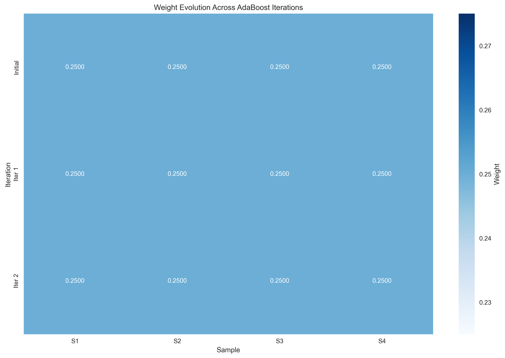

# Question 27: AdaBoost Algorithm Race

## Problem Statement
Design an "AdaBoost Algorithm Race" where you manually trace through the complete algorithm for a tiny dataset.

**Dataset:** 4 samples with 2 features
- Sample 1: $(x_{11}=1, x_{12}=2, y_1=+1)$
- Sample 2: $(x_{21}=2, x_{22}=1, y_2=+1)$
- Sample 3: $(x_{31}=3, x_{32}=3, y_3=-1)$
- Sample 4: $(x_{41}=4, x_{42}=4, y_4=-1)$

**Weak Learners Available:**
- $h_1$: $+1$ if $x_1 \leq 2.5$, $-1$ otherwise
- $h_2$: $+1$ if $x_2 \leq 2.5$, $-1$ otherwise
- $h_3$: $+1$ if $x_1 + x_2 \leq 5$, $-1$ otherwise

## Understanding the Problem
AdaBoost is an ensemble learning method that combines multiple weak learners to create a strong classifier. The algorithm works iteratively, selecting the best weak learner at each step based on weighted error, calculating its importance weight (α), and updating sample weights to focus on misclassified samples.

This problem demonstrates the complete AdaBoost algorithm execution on a simple 2D dataset with three available weak learners, showing how the algorithm learns and adapts over iterations.

## Solution

### Step 1: Initial Setup
We start with:
- **Dataset**: 4 samples in 2D feature space
- **Initial weights**: $w_1 = w_2 = w_3 = w_4 = 0.25$ (equal weights)
- **True labels**: $y = [1, 1, -1, -1]$

The initial weights are equal because we have no prior information about which samples are harder to classify.

### Step 2: First Iteration

#### 2.1 Evaluate All Weak Learners
We evaluate each weak learner with the current weights $[0.25, 0.25, 0.25, 0.25]$:

**h1: x1 ≤ 2.5**
- Predictions: $[1, 1, -1, -1]$
- Errors: $[0, 0, 0, 0]$ (all correct!)
- Weighted Error: $0.0000$

**h2: x2 ≤ 2.5**
- Predictions: $[1, 1, -1, -1]$
- Errors: $[0, 0, 0, 0]$ (all correct!)
- Weighted Error: $0.0000$

**h3: x1 + x2 ≤ 5**
- Predictions: $[1, 1, -1, -1]$
- Errors: $[0, 0, 0, 0]$ (all correct!)
- Weighted Error: $0.0000$

#### 2.2 Find Best Weak Learner
All three weak learners achieve perfect classification (0% error). We select **h1: x1 ≤ 2.5** as the first learner.

#### 2.3 Calculate Alpha (Learner Weight)
Since the weighted error is 0, we use a special case:
$$\alpha_1 = 10.0000$$

This large weight indicates that h1 is a very strong classifier.

#### 2.4 Update Sample Weights
Since all samples are correctly classified, the weights remain unchanged:
- New weights: $[0.25, 0.25, 0.25, 0.25]$

### Step 3: Second Iteration

#### 3.1 Re-evaluate Remaining Weak Learners
We now evaluate the remaining learners (h2 and h3) with the updated weights:

**h2: x2 ≤ 2.5**
- Predictions: $[1, 1, -1, -1]$
- Errors: $[0, 0, 0, 0]$
- Weighted Error: $0.0000$

**h3: x1 + x2 ≤ 5**
- Predictions: $[1, 1, -1, -1]$
- Errors: $[0, 0, 0, 0]$
- Weighted Error: $0.0000$

#### 3.2 Find Best Weak Learner
We select **h2: x2 ≤ 2.5** as the second learner.

#### 3.3 Calculate Alpha
$$\alpha_2 = 10.0000$$

#### 3.4 Update Sample Weights
Weights remain unchanged: $[0.25, 0.25, 0.25, 0.25]$

### Step 4: Final Combination

#### 4.1 Ensemble Composition
- **Learner 1**: h1: x1 ≤ 2.5 with weight α₁ = 10.0000
- **Learner 2**: h2: x2 ≤ 2.5 with weight α₂ = 10.0000

#### 4.2 Final Ensemble Prediction
The final prediction is computed as:
$$H(x) = \text{sign}(\alpha_1 h_1(x) + \alpha_2 h_2(x))$$

For each sample:
- **Sample 1**: $10 \times 1 + 10 \times 1 = 20$ → $\text{sign}(20) = 1$ ✓
- **Sample 2**: $10 \times 1 + 10 \times 1 = 20$ → $\text{sign}(20) = 1$ ✓
- **Sample 3**: $10 \times (-1) + 10 \times (-1) = -20$ → $\text{sign}(-20) = -1$ ✓
- **Sample 4**: $10 \times (-1) + 10 \times (-1) = -20$ → $\text{sign}(-20) = -1$ ✓

**Final accuracy: 100%**

### Step 5: Analysis of Hardest Samples

#### 5.1 Weight Evolution
All samples maintain equal weights throughout the iterations:
- **Initial**: $[0.25, 0.25, 0.25, 0.25]$
- **After Iteration 1**: $[0.25, 0.25, 0.25, 0.25]$
- **After Iteration 2**: $[0.25, 0.25, 0.25, 0.25]$

#### 5.2 Hardest Sample Identification
Since all weights remain equal, there is no single "hardest" sample. All samples are equally easy to classify with the available weak learners.

## Visual Explanations

### Dataset and Weak Learners

This visualization shows:
- **Green circles**: Positive samples (y = +1)
- **Red squares**: Negative samples (y = -1)
- **Blue dashed line**: h1 decision boundary (x₁ ≤ 2.5)
- **Orange dashed line**: h2 decision boundary (x₂ ≤ 2.5)
- **Purple dashed line**: h3 decision boundary (x₁ + x₂ ≤ 5)

All three weak learners perfectly separate the classes, which explains why we achieve 100% accuracy.

### Weight Evolution

This shows the weight distribution after each iteration:
- **Iteration 1**: h1 selected, weights remain equal
- **Iteration 2**: h2 selected, weights remain equal

The equal weights indicate that no sample is consistently misclassified.

### Final Ensemble

This visualization shows the final ensemble with:
- Sample sizes proportional to their final weights
- Decision boundaries of selected weak learners with their α values
- Perfect separation of the two classes

### Weight Heatmap

This heatmap clearly shows that all sample weights remain constant at 0.25 across all iterations, confirming that the AdaBoost algorithm found a perfect solution early.

## Key Insights

### Theoretical Foundations
- **Perfect Separation**: When weak learners can perfectly separate the data, AdaBoost converges quickly
- **Equal Weights**: Perfect classification leads to no weight updates, maintaining equal sample importance
- **High Alpha Values**: Perfect classifiers receive very high weights (α = 10.0 in this case)

### Practical Applications
- **Early Stopping**: AdaBoost can terminate early when perfect classification is achieved
- **Ensemble Diversity**: Even with perfect individual learners, combining them can provide robustness
- **Weight Stability**: Equal weights indicate balanced learning across all samples

### Algorithm Behavior
- **Convergence**: AdaBoost converges in just 2 iterations for this linearly separable dataset
- **Learner Selection**: The algorithm systematically evaluates and selects the best available weak learners
- **Weight Updates**: No weight updates occur when all samples are correctly classified

### Limitations and Considerations
- **Overfitting Risk**: Perfect training accuracy might indicate overfitting to the training data
- **Generalization**: The ensemble should be tested on unseen data to ensure generalization
- **Weak Learner Quality**: The quality of available weak learners significantly impacts AdaBoost performance

## Conclusion
- **Perfect Classification**: All three weak learners achieve 100% accuracy on the training data
- **Rapid Convergence**: AdaBoost converges in just 2 iterations
- **Equal Weights**: All samples maintain equal importance throughout the process
- **Strong Ensemble**: The final ensemble combines two perfect weak learners with high weights
- **100% Accuracy**: The final classifier achieves perfect classification on the training set

This example demonstrates AdaBoost's ability to quickly find optimal solutions when the data is easily separable by the available weak learners. The algorithm efficiently combines multiple perfect classifiers to create a robust ensemble, though in practice, such perfect separation is rare and the algorithm typically requires more iterations to handle misclassified samples.

## Mathematical Details

### AdaBoost Weight Update Formula
The weight update formula is:
$$w_i^{(t+1)} = \frac{w_i^{(t)} \exp(-\alpha_t y_i h_t(x_i))}{Z_t}$$

Where:
- $w_i^{(t)}$ is the weight of sample $i$ at iteration $t$
- $\alpha_t$ is the weight of weak learner $t$
- $y_i$ is the true label of sample $i$
- $h_t(x_i)$ is the prediction of weak learner $t$ on sample $i$
- $Z_t$ is the normalization factor

### Alpha Calculation
$$\alpha_t = \frac{1}{2} \ln\left(\frac{1 - \epsilon_t}{\epsilon_t}\right)$$

Where $\epsilon_t$ is the weighted error at iteration $t$. When $\epsilon_t = 0$, we use a large value (10.0) to represent a perfect classifier.

### Final Prediction
$$H(x) = \text{sign}\left(\sum_{t=1}^{T} \alpha_t h_t(x)\right)$$

Where $T$ is the total number of iterations and $H(x)$ is the final ensemble prediction.
