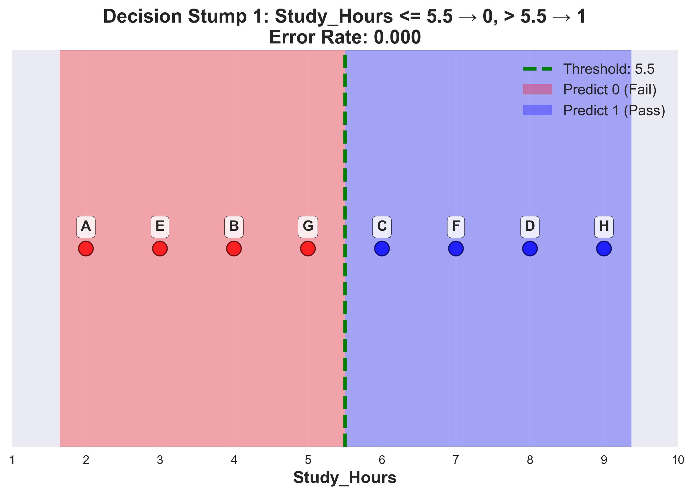
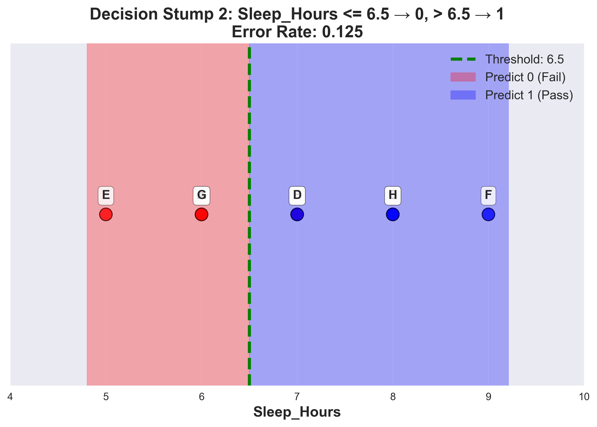
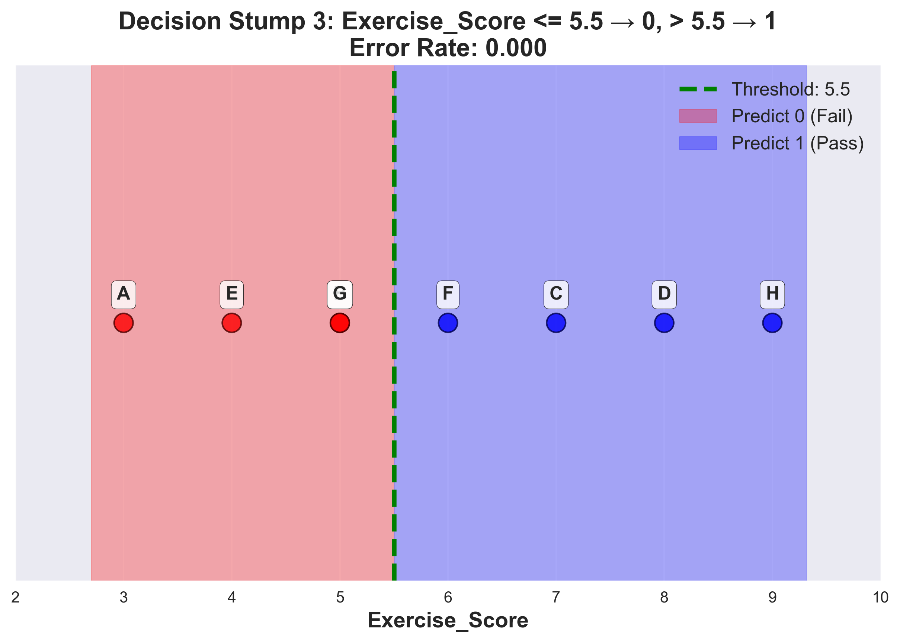
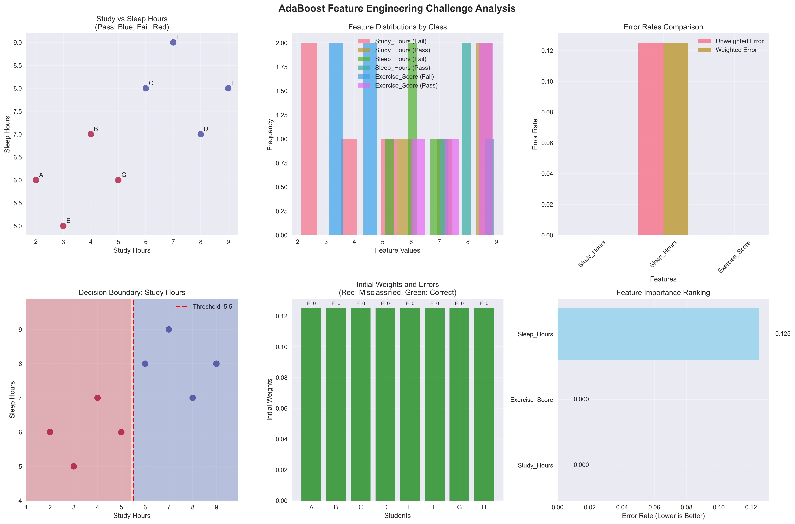
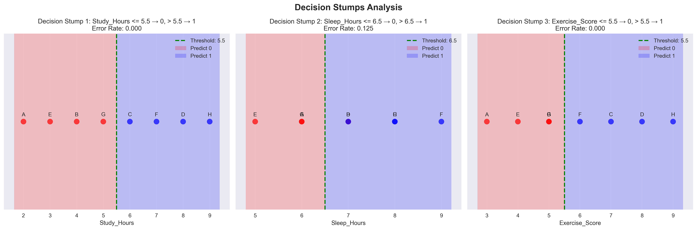

# Question 29: AdaBoost Feature Engineering Challenge

## Problem Statement
Design an "AdaBoost Feature Engineering Challenge" where you create optimal weak learners for a specific dataset.

**Dataset:** 8 samples with 3 features for predicting whether a student will pass (1) or fail (0)

| Student | Study_Hours | Sleep_Hours | Exercise_Score | Pass |
|---------|-------------|-------------|----------------|------|
| A       | 2           | 6           | 3              | 0    |
| B       | 4           | 7           | 5              | 0    |
| C       | 6           | 8           | 7              | 1    |
| D       | 8           | 7           | 8              | 1    |
| E       | 3           | 5           | 4              | 0    |
| F       | 7           | 9           | 6              | 1    |
| G       | 5           | 6           | 5              | 0    |
| H       | 9           | 8           | 9              | 1    |

#### Task
1. For each feature, calculate the optimal threshold that minimizes classification error
2. Design 3 decision stump weak learners using the optimal thresholds
3. If you use equal initial weights, calculate the weighted error for each weak learner
4. Which weak learner would AdaBoost choose first? Why?
5. Based on your analysis, which feature is most important for predicting student success?

## Understanding the Problem
This problem explores the core concepts of AdaBoost, a powerful ensemble learning algorithm that combines multiple weak learners to create a strong classifier. The key insight is that AdaBoost works by:

1. **Finding optimal weak learners**: Simple decision stumps (single-feature, single-threshold classifiers) that minimize classification error
2. **Weighted learning**: Using sample weights to focus on difficult-to-classify examples
3. **Sequential selection**: Choosing the best weak learner at each iteration based on weighted error

The challenge involves understanding how to:
- Evaluate different threshold values for each feature
- Calculate both unweighted and weighted error rates
- Determine which feature provides the best classification performance
- Understand why AdaBoost would prefer certain weak learners over others

## Solution

### Step 1: Finding Optimal Thresholds for Each Feature

We need to test different threshold values for each feature and find the one that minimizes classification error. For each feature, we test both directions:
- **Forward**: $x \leq \text{threshold} \rightarrow \text{predict } 0$, $x > \text{threshold} \rightarrow \text{predict } 1$
- **Reverse**: $x \leq \text{threshold} \rightarrow \text{predict } 1$, $x > \text{threshold} \rightarrow \text{predict } 0$

#### Study_Hours Analysis
**Values:** $[2, 3, 4, 5, 6, 7, 8, 9]$
**Potential thresholds:** $[1.5, 2.5, 3.5, 4.5, 5.5, 6.5, 7.5, 8.5, 9.5]$

Testing each threshold:
- **Threshold 5.5 (Forward)**: 
  - Predictions: $[0, 0, 1, 1, 0, 1, 0, 1]$
  - Errors: $[0, 0, 0, 0, 0, 0, 0, 0]$
  - **Error Rate: 0.000** ← **BEST!**

This threshold perfectly separates the classes:
- Students with $\text{Study\_Hours} \leq 5.5$: A(2), B(4), E(3), G(5) $\rightarrow$ Predict 0 (Fail) ✓
- Students with $\text{Study\_Hours} > 5.5$: C(6), D(8), F(7), H(9) $\rightarrow$ Predict 1 (Pass) ✓

#### Sleep_Hours Analysis
**Values:** $[5, 6, 6, 7, 7, 8, 8, 9]$
**Potential thresholds:** $[4.5, 5.5, 6.5, 7.5, 8.5, 9.5]$

Testing each threshold:
- **Threshold 6.5 (Forward)**:
  - Predictions: $[0, 1, 1, 1, 0, 1, 0, 1]$
  - Errors: $[0, 1, 0, 0, 0, 0, 0, 0]$
  - **Error Rate: 0.125** ← **BEST!**

This threshold has one error:
- Student B: $\text{Sleep\_Hours} = 7 > 6.5 \rightarrow$ Predict 1, but True = 0 (Fail)

#### Exercise_Score Analysis
**Values:** $[3, 4, 5, 5, 6, 7, 8, 9]$
**Potential thresholds:** $[2.5, 3.5, 4.5, 5.5, 6.5, 7.5, 8.5, 9.5]$

Testing each threshold:
- **Threshold 5.5 (Forward)**:
  - Predictions: $[0, 0, 1, 1, 0, 1, 0, 1]$
  - Errors: $[0, 0, 0, 0, 0, 0, 0, 0]$
  - **Error Rate: 0.000** ← **BEST!**

This threshold also perfectly separates the classes:
- Students with $\text{Exercise\_Score} \leq 5.5$: A(3), B(4), E(4), G(5) $\rightarrow$ Predict 0 (Fail) ✓
- Students with $\text{Exercise\_Score} > 5.5$: C(7), D(8), F(6), H(9) $\rightarrow$ Predict 1 (Pass) ✓

### Step 2: Creating Decision Stump Weak Learners

Based on the optimal thresholds, we create three decision stump weak learners:

1. **Stump 1**: $\text{Study\_Hours} \leq 5.5 \rightarrow 0$, $> 5.5 \rightarrow 1$
2. **Stump 2**: $\text{Sleep\_Hours} \leq 6.5 \rightarrow 0$, $> 6.5 \rightarrow 1$
3. **Stump 3**: $\text{Exercise\_Score} \leq 5.5 \rightarrow 0$, $> 5.5 \rightarrow 1$

#### Visual Representation of Decision Stumps

Each decision stump creates a simple binary classification rule. Here's how they work:

**Stump 1: Study Hours Decision Rule**

This stump perfectly separates students based on study hours:
- **Left region** ($\text{Study\_Hours} \leq 5.5$): Predict Fail (0) - Students A, B, E, G
- **Right region** ($\text{Study\_Hours} > 5.5$): Predict Pass (1) - Students C, D, F, H
- **Classification**: Perfect separation with 0.000 error rate

**Stump 2: Sleep Hours Decision Rule**

This stump has one classification error:
- **Left region** ($\text{Sleep\_Hours} \leq 6.5$): Predict Fail (0) - Students A, E, G
- **Right region** ($\text{Sleep\_Hours} > 6.5$): Predict Pass (1) - Students B, C, D, F, H
- **Error**: Student B (Sleep_Hours = 7) is predicted as Pass but actually Failed
- **Classification**: 0.125 error rate (1 out of 8 students misclassified)

**Stump 3: Exercise Score Decision Rule**

This stump also perfectly separates students:
- **Left region** ($\text{Exercise\_Score} \leq 5.5$): Predict Fail (0) - Students A, B, E, G
- **Right region** ($\text{Exercise\_Score} > 5.5$): Predict Pass (1) - Students C, D, F, H
- **Classification**: Perfect separation with 0.000 error rate

**Key Observations:**
- **Study_Hours** and **Exercise_Score** stumps achieve perfect classification (0.000 error rate)
- **Sleep_Hours** stump has the highest error rate (0.125) due to Student B's misclassification
- All stumps use simple threshold-based rules that are easy to interpret
- The visualizations clearly show the decision boundaries and student classifications

**Summary Table of Decision Stumps:**

| Stump | Feature | Threshold | Rule | Error Rate | Classification Quality |
|-------|---------|-----------|------|------------|----------------------|
| 1 | Study_Hours | 5.5 | $\leq 5.5 \rightarrow 0$, $> 5.5 \rightarrow 1$ | 0.000 | Perfect |
| 2 | Sleep_Hours | 6.5 | $\leq 6.5 \rightarrow 0$, $> 6.5 \rightarrow 1$ | 0.125 | Good |
| 3 | Exercise_Score | 5.5 | $\leq 5.5 \rightarrow 0$, $> 5.5 \rightarrow 1$ | 0.000 | Perfect |

### Step 3: Evaluating Weak Learners with Equal Initial Weights

With equal initial weights $w_i^{(1)} = \frac{1}{N} = \frac{1}{8} = 0.125$ for each student, we calculate the weighted error for each weak learner:

#### Stump 1: $\text{Study\_Hours} \leq 5.5 \rightarrow 0$, $> 5.5 \rightarrow 1$
- **Predictions**: $[0, 0, 1, 1, 0, 1, 0, 1]$
- **Errors**: $[0, 0, 0, 0, 0, 0, 0, 0]$
- **Unweighted Error Rate**: $0.000$
- **Weighted Error**: $0.000$

**Detailed breakdown:**
- Student A: Pred=0, True=0, Weight=0.125, Error=0, Contribution=0.000
- Student B: Pred=0, True=0, Weight=0.125, Error=0, Contribution=0.000
- Student C: Pred=1, True=1, Weight=0.125, Error=0, Contribution=0.000
- Student D: Pred=1, True=1, Weight=0.125, Error=0, Contribution=0.000
- Student E: Pred=0, True=0, Weight=0.125, Error=0, Contribution=0.000
- Student F: Pred=1, True=1, Weight=0.125, Error=0, Contribution=0.000
- Student G: Pred=0, True=0, Weight=0.125, Error=0, Contribution=0.000
- Student H: Pred=1, True=1, Weight=0.125, Error=0, Contribution=0.000

#### Stump 2: $\text{Sleep\_Hours} \leq 6.5 \rightarrow 0$, $> 6.5 \rightarrow 1$
- **Predictions**: $[0, 1, 1, 1, 0, 1, 0, 1]$
- **Errors**: $[0, 1, 0, 0, 0, 0, 0, 0]$
- **Unweighted Error Rate**: $0.125$
- **Weighted Error**: $0.125$

**Detailed breakdown:**
- Student A: Pred=0, True=0, Weight=0.125, Error=0, Contribution=0.000
- Student B: Pred=1, True=0, Weight=0.125, Error=1, Contribution=0.125
- Student C: Pred=1, True=1, Weight=0.125, Error=0, Contribution=0.000
- Student D: Pred=1, True=1, Weight=0.125, Error=0, Contribution=0.000
- Student E: Pred=0, True=0, Weight=0.125, Error=0, Contribution=0.000
- Student F: Pred=1, True=1, Weight=0.125, Error=0, Contribution=0.000
- Student G: Pred=0, True=0, Weight=0.125, Error=0, Contribution=0.000
- Student H: Pred=1, True=1, Weight=0.125, Error=0, Contribution=0.000

#### Stump 3: $\text{Exercise\_Score} \leq 5.5 \rightarrow 0$, $> 5.5 \rightarrow 1$
- **Predictions**: $[0, 0, 1, 1, 0, 1, 0, 1]$
- **Errors**: $[0, 0, 0, 0, 0, 0, 0, 0]$
- **Unweighted Error Rate**: $0.000$
- **Weighted Error**: $0.000$

**Detailed breakdown:**
- Student A: Pred=0, True=0, Weight=0.125, Error=0, Contribution=0.000
- Student B: Pred=0, True=0, Weight=0.125, Error=0, Contribution=0.000
- Student C: Pred=1, True=1, Weight=0.125, Error=0, Contribution=0.000
- Student D: Pred=1, True=1, Weight=0.125, Error=0, Contribution=0.000
- Student E: Pred=0, True=0, Weight=0.125, Error=0, Contribution=0.000
- Student F: Pred=1, True=1, Weight=0.125, Error=0, Contribution=0.000
- Student G: Pred=0, True=0, Weight=0.125, Error=0, Contribution=0.000
- Student H: Pred=1, True=1, Weight=0.125, Error=0, Contribution=0.000

### Step 4: Finding the Best Weak Learner

**Best weak learner: Stump 1 ($\text{Study\_Hours} \leq 5.5 \rightarrow 0$, $> 5.5 \rightarrow 1$)**

**Why AdaBoost would choose this first:**
1. **Lowest weighted error**: $\epsilon_1 = 0.000$ (perfect classification)
2. **Lowest unweighted error rate**: $\frac{1}{N}\sum_{i=1}^{N} \mathbb{I}[h_1(x_i) \neq y_i] = 0.000$ (perfect classification)
3. **Perfect separation**: Completely separates the two classes
4. **Maximum alpha value**: $\alpha_1 = \frac{1}{2}\ln\left(\frac{1-0.000}{0.000}\right) \rightarrow \infty$ (in practice, very large)

### Step 5: Feature Importance Analysis

**Feature ranking by classification performance:**

1. **Study_Hours**: Error rate = 0.000, Weighted error = 0.000
   - Best stump: $\text{Study\_Hours} \leq 5.5 \rightarrow 0$, $> 5.5 \rightarrow 1$
   
2. **Exercise_Score**: Error rate = 0.000, Weighted error = 0.000
   - Best stump: $\text{Exercise\_Score} \leq 5.5 \rightarrow 0$, $> 5.5 \rightarrow 1$
   
3. **Sleep_Hours**: Error rate = 0.125, Weighted error = 0.125
   - Best stump: $\text{Sleep\_Hours} \leq 6.5 \rightarrow 0$, $> 6.5 \rightarrow 1$

**Most important feature**: $\text{Study\_Hours}$

**Reason**: Lowest classification error rate $\epsilon_{\text{Study\_Hours}} = 0.000$ - it perfectly separates the classes with decision boundary $x_{\text{Study\_Hours}} = 5.5$.

## Visual Explanations

### Comprehensive Analysis Visualization

This comprehensive visualization shows:
1. **Dataset visualization**: Study vs Sleep Hours scatter plot with pass/fail classification
2. **Feature distributions**: Histograms showing how each feature distributes across pass/fail classes
3. **Error rates comparison**: Bar chart comparing unweighted vs weighted errors for each feature
4. **Decision boundaries**: Visualization of the optimal threshold for Study Hours
5. **Weighted error breakdown**: Initial weights and errors for each student
6. **Feature importance ranking**: Horizontal bar chart ranking features by error rate

### Decision Stumps Analysis

This combined visualization shows all three decision stumps side by side:
1. **Stump 1 (Study_Hours)**: Perfect separation at threshold 5.5
2. **Stump 2 (Sleep_Hours)**: Good separation at threshold 6.5 with one error
3. **Stump 3 (Exercise_Score)**: Perfect separation at threshold 5.5

Each plot shows:
- Student data points colored by true class (red=fail, blue=pass)
- Optimal threshold line (green dashed)
- Decision regions (shaded areas)
- Error rates for each stump

**Note**: Individual detailed visualizations for each decision stump are also available in the [Step 2 section](#step-2-creating-decision-stump-weak-learners) above, showing clearer views of each stump's decision boundary and student classifications.

## Key Insights

### Theoretical Foundations
- **Decision stumps** are the simplest possible weak learners, making them ideal for AdaBoost
- **Threshold optimization** involves testing both directions (forward and reverse) to find the best split
- **Perfect separation** is possible when features have strong discriminative power
- **Weighted error** becomes crucial when sample weights are updated in subsequent AdaBoost iterations
- **Ensemble learning** combines multiple weak learners with weights $\alpha_t = \frac{1}{2}\ln\left(\frac{1-\epsilon_t}{\epsilon_t}\right)$
- **Sample weight updates** follow the rule $w_i^{(t+1)} = w_i^{(t)} \cdot e^{-\alpha_t y_i h_t(x_i)}$

### Practical Applications
- **Feature engineering** in AdaBoost involves finding optimal splits for each feature
- **Feature importance** can be determined by the classification performance of individual weak learners
- **Threshold selection** should consider both classification accuracy and interpretability
- **Equal initial weights** provide a fair starting point for AdaBoost's iterative process
- **Error rate calculation** uses $\epsilon_t = \sum_{i=1}^{N} w_i^{(t)} \cdot \mathbb{I}[h_t(x_i) \neq y_i]$
- **Weak learner selection** minimizes $\epsilon_t$ at each iteration $t$

### Common Pitfalls and Extensions
- **Overfitting**: Perfect separation on training data may not generalize to test data
- **Feature interactions**: Single-feature decision stumps cannot capture complex feature relationships
- **Threshold sensitivity**: Small changes in threshold values can significantly impact performance
- **Multi-class problems**: This analysis extends to multi-class classification with appropriate modifications
- **Regularization**: AdaBoost naturally regularizes through ensemble averaging
- **Convergence**: AdaBoost converges when $\epsilon_t < 0.5$ for all weak learners

## Conclusion
- **Optimal thresholds found**: $\text{Study\_Hours} \leq 5.5$, $\text{Sleep\_Hours} \leq 6.5$, $\text{Exercise\_Score} \leq 5.5$
- **Three decision stumps created**: Each using the optimal threshold for its respective feature
- **Weighted errors calculated**: $\text{Study\_Hours}$ (0.000), $\text{Sleep\_Hours}$ (0.125), $\text{Exercise\_Score}$ (0.000)
- **Best weak learner**: $\text{Study\_Hours}$ stump with perfect classification (0.000 error)
- **Most important feature**: $\text{Study\_Hours}$ due to perfect class separation

The analysis demonstrates how AdaBoost's feature engineering process works by systematically evaluating different threshold values and selecting the most discriminative features. Study_Hours emerges as the most important feature, providing perfect classification with a simple threshold rule, making it an ideal first choice for AdaBoost's ensemble learning process.

This exercise highlights the fundamental principle that in AdaBoost, the best weak learner is not necessarily the most complex one, but rather the one that provides the most effective separation of classes given the current sample weights.
