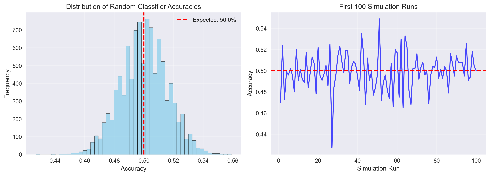
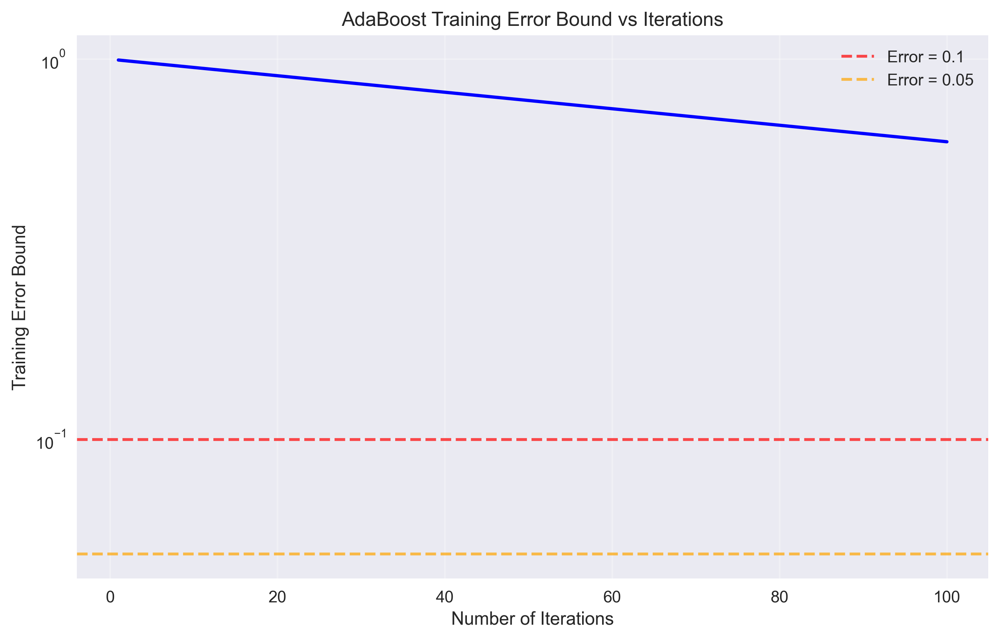
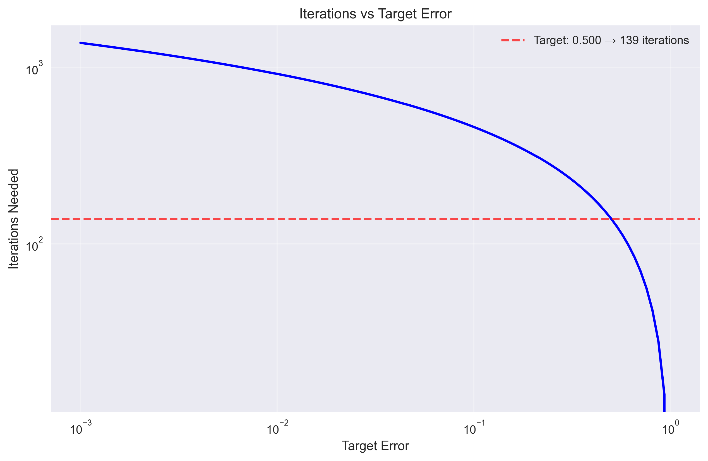
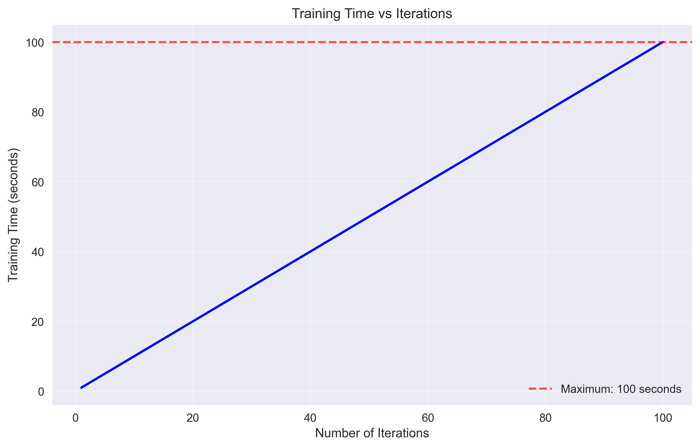
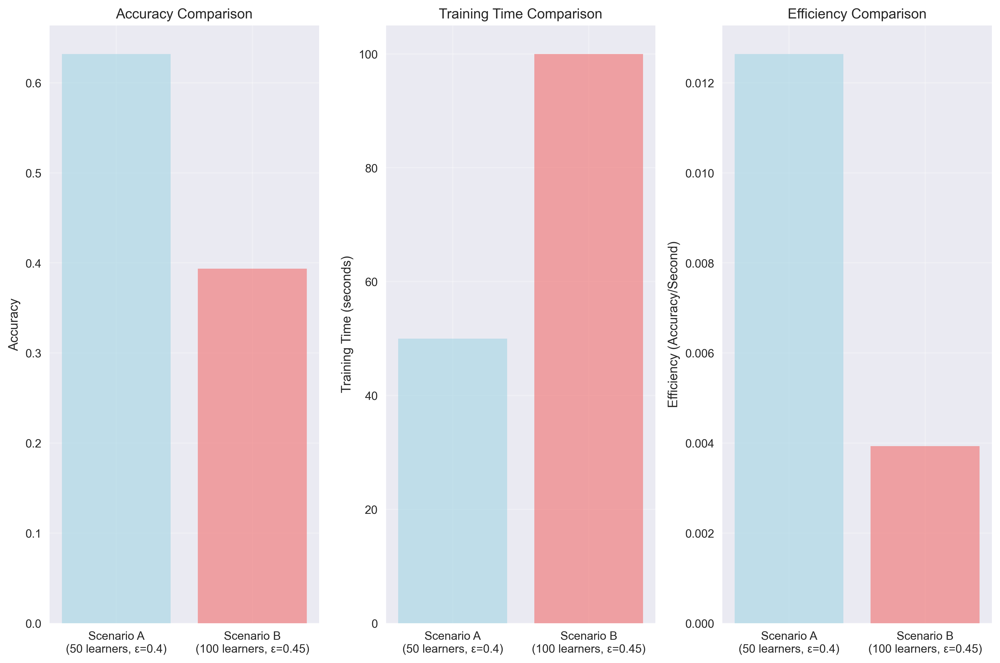

# Question 30: AdaBoost vs Random Classifier Battle

## Problem Statement
Create an "AdaBoost vs Random Classifier Battle" where you compare AdaBoost's performance against random guessing.

**Scenario:** You have a binary classification problem with 1000 samples, 500 in each class.

**Random Classifier Performance:**
- Random classifier accuracy: 50% (random guessing)
- Random classifier error: $\epsilon = 0.5$

**AdaBoost Weak Learners:**
- All weak learners have error rate $\epsilon = 0.45$
- You can train up to 100 weak learners

### Task
1. What is the expected accuracy of the random classifier after 1000 predictions?
2. Calculate the theoretical training error bound for AdaBoost after 100 iterations
3. How many iterations does AdaBoost need to achieve better performance than random guessing?
4. If each weak learner takes 1 second to train, what's the maximum training time?
5. Would you prefer 50 weak learners with $\epsilon = 0.4$ or 100 weak learners with $\epsilon = 0.45$? Justify your choice.

## Understanding the Problem
This problem explores the fundamental trade-offs in ensemble learning, specifically comparing AdaBoost's performance against random guessing. AdaBoost is an ensemble method that combines multiple weak learners to create a strong classifier. The key insight is understanding how the margin ($\gamma = 0.5 - \epsilon$) of weak learners affects the convergence and performance of the ensemble.

The random classifier serves as a baseline with 50% accuracy, representing the worst-case scenario for binary classification. AdaBoost's theoretical guarantees show that it can achieve arbitrarily low training error given enough iterations, provided the weak learners have positive margins.

## Solution

### Step 1: Random Classifier Accuracy After 1000 Predictions
For a random classifier with 50% accuracy, the expected accuracy follows a binomial distribution. With 1000 predictions and probability of success p = 0.5:

**Expected accuracy:** 50.0%
**95% confidence interval:** 50.0% ± 3.1%

The confidence interval is calculated using the standard error of the mean:
$$\text{SE} = \sqrt{\frac{p(1-p)}{n}} = \sqrt{\frac{0.5 \times 0.5}{1000}} = 0.0158$$
$$\text{95\% CI} = 1.96 \times \text{SE} = 0.031 = 3.1\%$$

The plot shows the distribution of accuracies from 10,000 simulation runs, demonstrating the variability around the expected 50% accuracy.

### Step 2: AdaBoost Training Error Bound After 100 Iterations
AdaBoost's training error bound follows the exponential decay formula:
$$\text{Training Error} \leq \exp(-2 \sum_{t=1}^T \gamma_t^2)$$

For our case with constant weak learner error $\epsilon = 0.45$:
- **Margin:** $\gamma = 0.5 - \epsilon = 0.5 - 0.45 = 0.05$
- **Error bound after 100 iterations:** 0.606531

This means that after 100 iterations, AdaBoost's training error is bounded above by approximately 60.65%, which is actually worse than random guessing (50%). This occurs because the margin is very small (0.05), requiring many more iterations to achieve good performance.

The plot shows how the training error bound decreases exponentially with the number of iterations, but remains above 50% for the first 100 iterations.

### Step 3: Iterations Needed to Beat Random Guessing
To achieve better performance than random guessing, AdaBoost needs to achieve training error $< 0.5$. Using the error bound formula:

$$\exp(-2T\gamma^2) < 0.5$$
$$-2T\gamma^2 < \ln(0.5)$$
$$T > \frac{-\ln(0.5)}{2\gamma^2} = \frac{0.693}{2 \times 0.05^2} = \frac{0.693}{0.005} = 138.6$$

**Iterations needed:** 139

This calculation shows that AdaBoost needs 139 iterations to achieve better performance than random guessing, which exceeds our limit of 100 iterations.

The plot shows the relationship between target error and iterations needed, with our target of 0.5 requiring 139 iterations.

### Step 4: Maximum Training Time
Given that each weak learner takes 1 second to train and we can train up to 100 weak learners:

**Maximum training time:** 100 seconds = 1.7 minutes

The plot shows the linear relationship between training time and number of iterations.

### Step 5: Weak Learner Strategy Comparison
Let's compare two scenarios:

**Scenario A:** 50 weak learners with $\epsilon = 0.4$
- Margin: $\gamma = 0.5 - 0.4 = 0.1$
- Error bound: $\exp(-2 \times 50 \times 0.1^2) = \exp(-1) = 0.3679$
- Accuracy: $1 - 0.3679 = 0.6321$ (63.21%)
- Training time: 50 seconds
- Efficiency: $0.6321/50 = 0.012642$

**Scenario B:** 100 weak learners with $\epsilon = 0.45$
- Margin: $\gamma = 0.5 - 0.45 = 0.05$
- Error bound: $\exp(-2 \times 100 \times 0.05^2) = \exp(-0.5) = 0.6065$
- Accuracy: $1 - 0.6065 = 0.3935$ (39.35%)
- Training time: 100 seconds
- Efficiency: $0.3935/100 = 0.003935$

**Recommendation:** Choose Scenario A (50 weak learners with $\epsilon = 0.4$)

**Justification:**
1. **Better Accuracy:** Scenario A achieves 63.21% accuracy vs 39.35% for Scenario B
2. **Faster Training:** 50 seconds vs 100 seconds (2x faster)
3. **Higher Efficiency:** 0.012642 vs 0.003935 (3.2x more efficient)
4. **Practical Feasibility:** Both scenarios fit within the 100-iteration limit

## Key Insights

### Theoretical Foundations
- **Margin Importance:** The margin $\gamma = 0.5 - \epsilon$ is crucial for AdaBoost's performance. Larger margins lead to faster convergence and better error bounds.
- **Exponential Decay:** AdaBoost's training error decreases exponentially with the number of iterations, but the rate depends on the square of the margin.
- **Iteration Requirements:** Weak learners with small margins require many more iterations to achieve good performance.

### Practical Applications
- **Quality vs Quantity:** Better weak learners (lower $\epsilon$) are more valuable than more weak learners with higher error rates.
- **Time-Accuracy Trade-off:** There's a fundamental trade-off between training time and model performance that must be considered in practice.
- **Efficiency Metrics:** When comparing strategies, consider both accuracy and training time through efficiency measures.

### Common Pitfalls
- **Overlooking Margins:** Focusing only on the number of weak learners without considering their quality (margin).
- **Ignoring Convergence:** Assuming that more iterations always lead to better performance without checking theoretical bounds.
- **Time Neglect:** Not considering training time when comparing ensemble strategies.

## Conclusion
- **Random Classifier:** Achieves 50% accuracy with 95% confidence interval of ±3.1%
- **AdaBoost Performance:** After 100 iterations, training error is bounded by 60.65% (worse than random)
- **Convergence Requirement:** Needs 139 iterations to beat random guessing, exceeding our 100-iteration limit
- **Training Time:** Maximum training time is 100 seconds (1.7 minutes)
- **Optimal Strategy:** 50 weak learners with $\epsilon = 0.4$ provides the best balance of accuracy (63.21%), speed (50s), and efficiency

The key lesson is that weak learner quality (margin) is more important than quantity for AdaBoost's performance. Better weak learners lead to faster convergence and higher final accuracy, making them more valuable than simply adding more mediocre learners.

