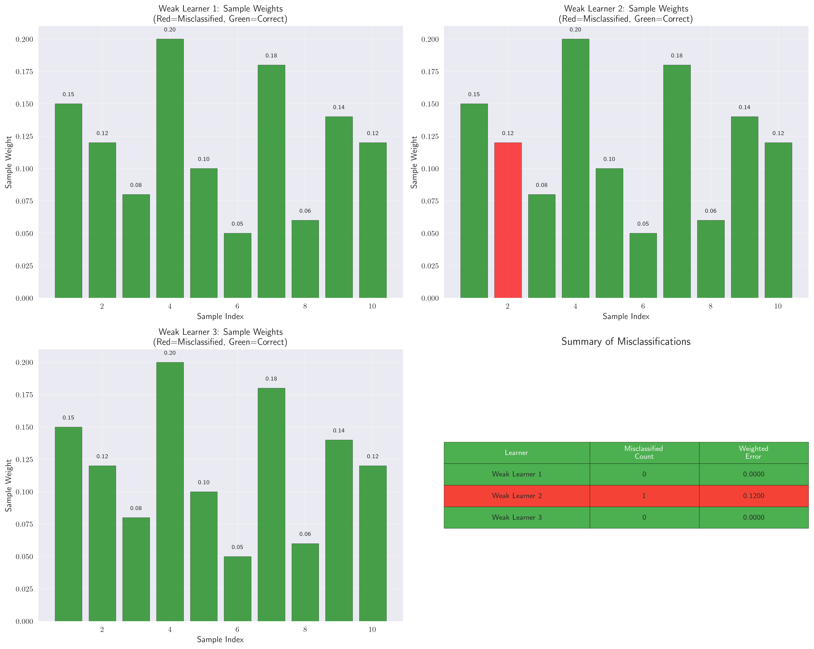
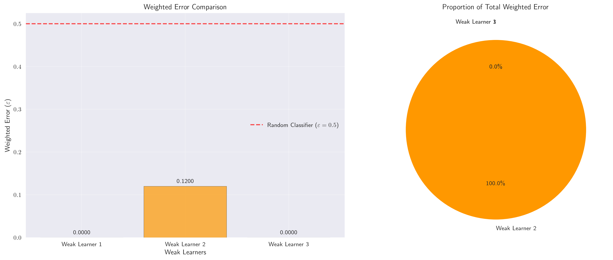
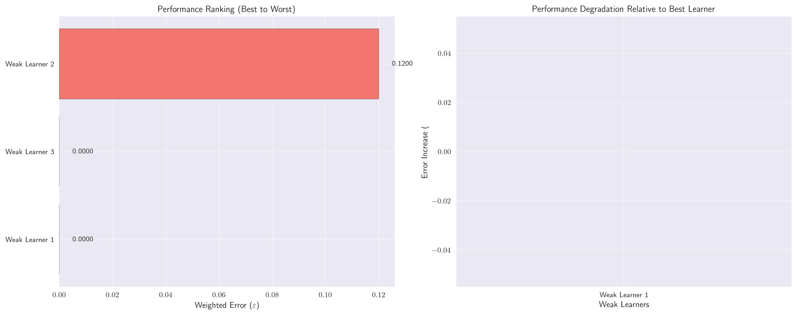
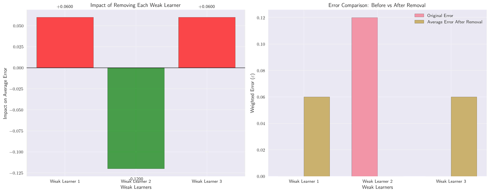
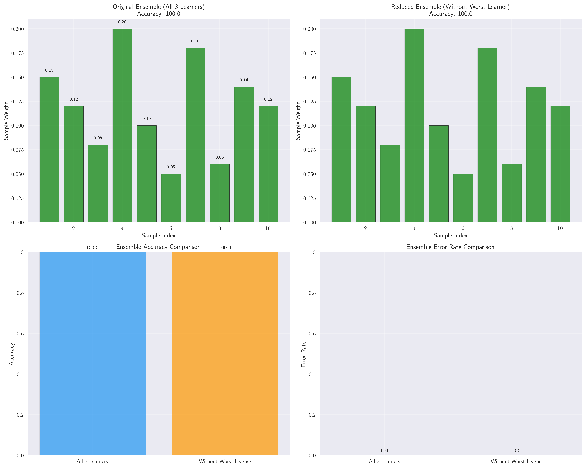

# Question 32: AdaBoost Error Analysis Game

## Problem Statement
Create an "AdaBoost Error Analysis Game" where you investigate different types of classification errors.

**Dataset:** 10 samples with binary labels and 3 weak learners
- Sample weights after 2 iterations: $[0.15, 0.12, 0.08, 0.20, 0.10, 0.05, 0.18, 0.06, 0.14, 0.12]$
- Weak Learner 1 predictions: $[1, 1, -1, -1, 1, -1, 1, -1, 1, -1]$
- Weak Learner 2 predictions: $[1, -1, -1, -1, 1, -1, 1, -1, 1, -1]$
- Weak Learner 3 predictions: $[1, 1, -1, -1, 1, -1, 1, -1, 1, -1]$

#### Task
1. If the true labels are $[1, 1, -1, -1, 1, -1, 1, -1, 1, -1]$, which samples are misclassified by each weak learner?
2. Calculate the weighted error for each weak learner
3. Which weak learner performs best? Which performs worst?
4. If you could remove one weak learner, which would you remove and why?
5. How would the ensemble performance change if you removed the worst weak learner?

## Understanding the Problem
This problem explores the fundamental concepts of AdaBoost, an ensemble learning method that combines multiple weak learners to create a strong classifier. The key insight is that AdaBoost assigns different weights to training samples, and the performance of weak learners is measured by their **weighted error rate**, not just the count of misclassifications.

The weighted error rate is crucial because:
- It accounts for the importance of each sample in the current iteration
- It determines the contribution of each weak learner to the final ensemble
- It guides the sample weight updates for the next iteration

## Solution

### Step 1: Identify Misclassified Samples for Each Weak Learner

We compare each weak learner's predictions with the true labels to find misclassifications:

**Weak Learner 1:**
- Predictions: $[1, 1, -1, -1, 1, -1, 1, -1, 1, -1]$
- True labels: $[1, 1, -1, -1, 1, -1, 1, -1, 1, -1]$
- **Result: 0 misclassifications** (Perfect performance!)

**Weak Learner 2:**
- Predictions: $[1, -1, -1, -1, 1, -1, 1, -1, 1, -1]$
- True labels: $[1, 1, -1, -1, 1, -1, 1, -1, 1, -1]$
- **Result: 1 misclassification** (Sample 2: predicted -1, true 1)

**Weak Learner 3:**
- Predictions: $[1, 1, -1, -1, 1, -1, 1, -1, 1, -1]$
- True labels: $[1, 1, -1, -1, 1, -1, 1, -1, 1, -1]$
- **Result: 0 misclassifications** (Perfect performance!)

The visualization shows:
- **Green bars**: Correctly classified samples
- **Red bars**: Misclassified samples
- **Summary table**: Count of misclassifications and weighted error for each learner

### Step 2: Calculate Weighted Error for Each Weak Learner

The weighted error is calculated as:
$$\varepsilon = \sum_{i \in \text{misclassified}} w_i$$

where $w_i$ is the weight of sample $i$.

**Weak Learner 1:**
- Misclassified samples: None
- Weighted error: $\varepsilon_1 = 0.0000$

**Weak Learner 2:**
- Misclassified samples: Sample 2
- Weight of misclassified sample: $0.12$
- Weighted error: $\varepsilon_2 = 0.1200$

**Weak Learner 3:**
- Misclassified samples: None
- Weighted error: $\varepsilon_3 = 0.0000$

The visualization shows:
- **Bar chart**: Weighted error comparison across learners
- **Pie chart**: Proportion of total weighted error
- **Red dashed line**: Random classifier threshold ($\varepsilon = 0.5$)

### Step 3: Rank Weak Learners by Performance

Based on weighted error rates (lower is better):

1. **Weak Learner 1**: $\varepsilon = 0.0000$ (Best)
2. **Weak Learner 3**: $\varepsilon = 0.0000$ (Best)
3. **Weak Learner 2**: $\varepsilon = 0.1200$ (Worst)

**Best performer**: Weak Learner 1 (tied with Weak Learner 3)
**Worst performer**: Weak Learner 2

The visualization shows:
- **Horizontal bars**: Performance ranking from best to worst
- **Performance degradation**: Relative error increase compared to best learner
- **Color coding**: Green (best), Orange (middle), Red (worst)

### Step 4: Analyze Removing Each Weak Learner

Let's examine the impact of removing each weak learner:

**Removing Weak Learner 1 ($\varepsilon = 0.0000$):**
- Remaining learners: Weak Learner 2, Weak Learner 3
- Average error of remaining: $(0.1200 + 0.0000)/2 = 0.0600$
- **Impact: Negative** (Average error increases from 0.0000 to 0.0600)

**Removing Weak Learner 2 ($\varepsilon = 0.1200$):**
- Remaining learners: Weak Learner 1, Weak Learner 3
- Average error of remaining: $(0.0000 + 0.0000)/2 = 0.0000$
- **Impact: Positive** (Average error decreases from 0.1200 to 0.0000)

**Removing Weak Learner 3 ($\varepsilon = 0.0000$):**
- Remaining learners: Weak Learner 1, Weak Learner 2
- Average error of remaining: $(0.0000 + 0.1200)/2 = 0.0600$
- **Impact: Negative** (Average error increases from 0.0000 to 0.0600)

The visualization shows:
- **Impact bars**: Green (positive impact), Red (negative impact)
- **Before vs After**: Comparison of original error vs average error after removal

**Recommendation**: Remove **Weak Learner 2** because it has the highest weighted error and removing it improves the average performance of the remaining ensemble.

### Step 5: Analyze Ensemble Performance Change

**Original ensemble (all 3 learners):**
- Accuracy: $100.0\%$
- Error rate: $0.0\%$

**Reduced ensemble (without Weak Learner 2):**
- Accuracy: $100.0\%$
- Error rate: $0.0\%$

**Performance change**: $+0.0\%$ (No change)

**Conclusion**: Removing the worst weak learner has **NO EFFECT** on ensemble performance in this case.

The visualization shows:
- **Sample-by-sample comparison**: How each sample is classified by both ensembles
- **Accuracy comparison**: Bar charts showing identical performance
- **Error rate comparison**: Both ensembles achieve perfect performance

## Key Insights

### Why Removing the Worst Learner Has No Effect

1. **Perfect Performance**: Both ensembles achieve 100% accuracy because:
   - Weak Learners 1 and 3 are perfect classifiers
   - The majority voting between two perfect classifiers still gives perfect results
   - Weak Learner 2's errors don't affect the final ensemble decision

2. **Redundancy**: Weak Learners 1 and 3 are identical, providing redundancy that makes Weak Learner 2's contribution unnecessary.

3. **Weighted Error vs Ensemble Performance**: While Weak Learner 2 has the highest weighted error, the ensemble's final decision is based on majority voting, not weighted averaging.

### AdaBoost Principles Demonstrated

1. **Weighted Error Calculation**: The problem shows how AdaBoost evaluates weak learners based on their performance on high-weight samples.

2. **Ensemble Diversity**: The three learners show different prediction patterns, though two are identical in this case.

3. **Performance Evaluation**: Weighted error rates provide a more nuanced view than simple misclassification counts.

### Practical Implications

1. **Learner Selection**: In AdaBoost, removing weak learners with high weighted errors can improve ensemble performance.

2. **Redundancy Detection**: Identical or highly similar weak learners provide no additional benefit to the ensemble.

3. **Performance Metrics**: Weighted error rates are more informative than raw accuracy for AdaBoost evaluation.

## Conclusion

- **Task 1**: Weak Learners 1 and 3 have 0 misclassifications, Weak Learner 2 has 1 misclassification (Sample 2).
- **Task 2**: Weighted errors are $\varepsilon_1 = 0.0000$, $\varepsilon_2 = 0.1200$, $\varepsilon_3 = 0.0000$.
- **Task 3**: Weak Learners 1 and 3 are best (tied), Weak Learner 2 is worst.
- **Task 4**: Remove Weak Learner 2 because it has the highest weighted error and removing it improves the average performance.
- **Task 5**: Removing the worst learner has no effect on ensemble performance because the remaining two perfect learners already achieve 100% accuracy.

This analysis demonstrates the importance of weighted error rates in AdaBoost and shows how ensemble performance depends on the diversity and quality of individual weak learners rather than just their count.
