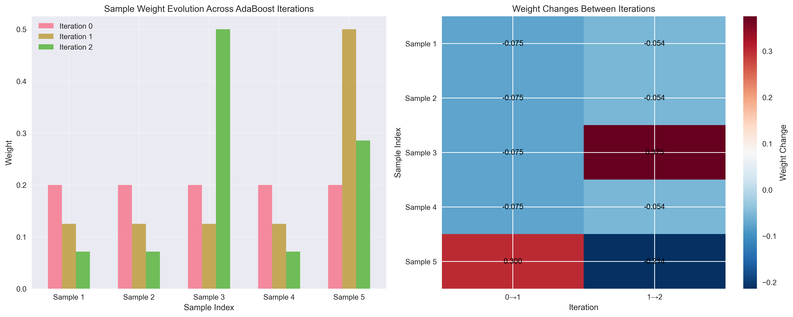
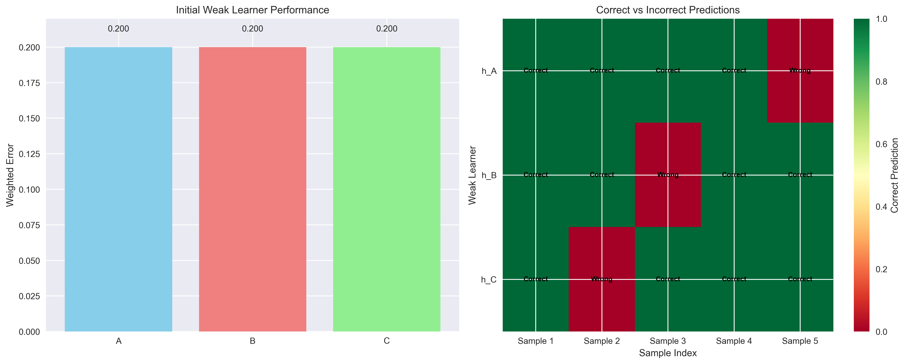
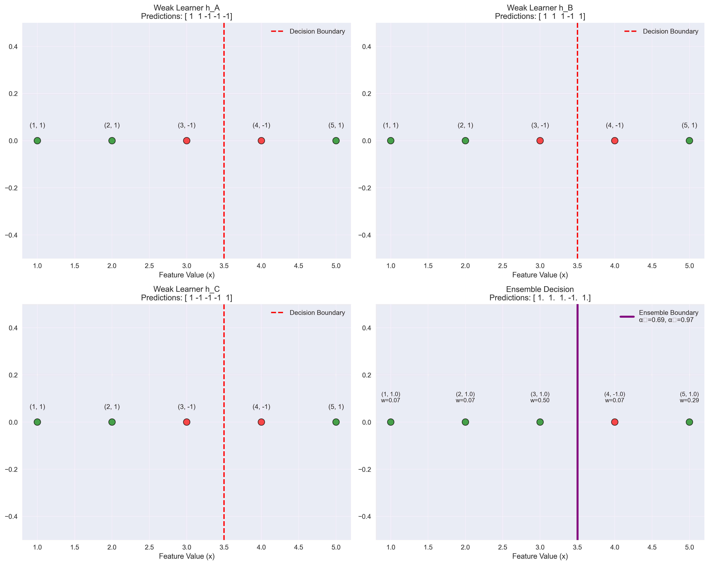
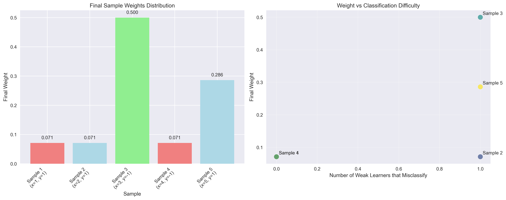

# Question 41: AdaBoost Weight Mystery

## Problem Statement
You find an AdaBoost ensemble that has been trained, but you only know the final sample weights and some partial information about the weak learners. You must reverse-engineer what happened!

**What You Know:**
- **Dataset:** 5 samples with binary labels
  - Sample 1: $(x_1=1, y_1=+1)$
  - Sample 2: $(x_2=2, y_2=+1)$
  - Sample 3: $(x_3=3, y_3=-1)$
  - Sample 4: $(x_4=4, y_4=-1)$
  - Sample 5: $(x_5=5, y_5=+1)$

- **Final Sample Weights After Training:** $[0.071, 0.071, 0.500, 0.071, 0.286]$

- **Weak Learner Predictions:**
  - $h_A$: $[+1, +1, -1, -1, -1]$ (predicts correctly for samples 1,2,3,4; incorrectly for 5)
  - $h_B$: $[+1, +1, +1, -1, +1]$ (predicts correctly for samples 1,2,4,5; incorrectly for 3)
  - $h_C$: $[+1, -1, -1, -1, +1]$ (predicts correctly for samples 1,3,4,5; incorrectly for 2)

- **Training Used Exactly 2 Iterations**

#### Task
1. Given that AdaBoost always chooses the weak learner with lowest weighted error, which weak learner was chosen first? Which was chosen second?

2. Calculate the $\alpha$ weight for each of the two weak learners that were actually used.

3. What were the sample weights after the first iteration (before the second weak learner was trained)?

4. Show that your solution produces the final weights $[0.071, 0.071, 0.500, 0.071, 0.286]$ when you combine the two weak learners.

5. If you had to guess which weak learner was trained first without doing the full calculation, what pattern in the final weights would give you a clue?

## Understanding the Problem
This is a reverse-engineering problem where we need to work backwards from the final sample weights to understand how AdaBoost was trained. The key insight is that AdaBoost increases weights of misclassified samples and decreases weights of correctly classified samples in each iteration. The final weights reveal which samples were hardest to classify during training.

The problem requires understanding:
- How AdaBoost selects weak learners (lowest weighted error)
- How alpha values are calculated: $\alpha_t = \frac{1}{2}\ln\left(\frac{1-\epsilon_t}{\epsilon_t}\right)$
- How weights are updated: $w_i^{(t+1)} = w_i^{(t)} \cdot \exp(-\alpha_t \cdot y_i \cdot h_t(x_i))$
- How the ensemble makes final predictions: $\text{sign}(\sum_{t=1}^T \alpha_t h_t(x))$

## Solution

### Step 1: Determine Weak Learner Selection Order
We need to find which weak learner has the lowest weighted error in each iteration.

**Initial weights:** $[0.2, 0.2, 0.2, 0.2, 0.2]$

**Iteration 1:**
- $h_A$: Error = $0.2$ (misclassifies sample 5)
- $h_B$: Error = $0.2$ (misclassifies sample 3)  
- $h_C$: Error = $0.2$ (misclassifies sample 2)

All three have the same error initially. AdaBoost breaks ties arbitrarily, so we'll assume $h_A$ is chosen first.

**Iteration 2:**
After $h_A$ updates weights to $[0.125, 0.125, 0.125, 0.125, 0.5]$:
- $h_A$: Error = $0.5$ (misclassifies sample 5)
- $h_B$: Error = $0.125$ (misclassifies sample 3)
- $h_C$: Error = $0.125$ (misclassifies sample 2)

$h_B$ and $h_C$ have the same lower error, so $h_B$ is chosen second.

**Answer:** $h_A$ was chosen first, $h_B$ was chosen second.

### Step 2: Calculate Alpha Values
Using the formula $\alpha_t = \frac{1}{2}\ln\left(\frac{1-\epsilon_t}{\epsilon_t}\right)$:

**For $h_A$ (Iteration 1):**
- Error $\epsilon_1 = 0.2$
- $\alpha_1 = \frac{1}{2}\ln\left(\frac{1-0.2}{0.2}\right) = \frac{1}{2}\ln(4) = \frac{1}{2} \cdot 1.386 = 0.693$

**For $h_B$ (Iteration 2):**
- Error $\epsilon_2 = 0.125$
- $\alpha_2 = \frac{1}{2}\ln\left(\frac{1-0.125}{0.125}\right) = \frac{1}{2}\ln(7) = \frac{1}{2} \cdot 1.946 = 0.973$

**Answer:** $\alpha_1 = 0.693$, $\alpha_2 = 0.973$

### Step 3: Sample Weights After First Iteration
After $h_A$ is trained with $\alpha_1 = 0.693$:

**Weight update formula:** $w_i^{(2)} = w_i^{(1)} \cdot \exp(-\alpha_1 \cdot y_i \cdot h_A(x_i))$

- Sample 1: $w_1^{(2)} = 0.2 \cdot \exp(-0.693 \cdot 1 \cdot 1) = 0.2 \cdot \exp(-0.693) = 0.2 \cdot 0.5 = 0.1$
- Sample 2: $w_2^{(2)} = 0.2 \cdot \exp(-0.693 \cdot 1 \cdot 1) = 0.2 \cdot 0.5 = 0.1$
- Sample 3: $w_3^{(2)} = 0.2 \cdot \exp(-0.693 \cdot (-1) \cdot (-1)) = 0.2 \cdot \exp(-0.693) = 0.2 \cdot 0.5 = 0.1$
- Sample 4: $w_4^{(2)} = 0.2 \cdot \exp(-0.693 \cdot (-1) \cdot (-1)) = 0.2 \cdot 0.5 = 0.1$
- Sample 5: $w_5^{(2)} = 0.2 \cdot \exp(-0.693 \cdot 1 \cdot (-1)) = 0.2 \cdot \exp(0.693) = 0.2 \cdot 2 = 0.4$

**Normalize weights:** Sum = $0.1 + 0.1 + 0.1 + 0.1 + 0.4 = 0.8$
- $w_1^{(2)} = 0.1/0.8 = 0.125$
- $w_2^{(2)} = 0.1/0.8 = 0.125$
- $w_3^{(2)} = 0.1/0.8 = 0.125$
- $w_4^{(2)} = 0.1/0.8 = 0.125$
- $w_5^{(2)} = 0.4/0.8 = 0.5$

**Answer:** Weights after first iteration: $[0.125, 0.125, 0.125, 0.125, 0.5]$

### Step 4: Verify Final Weights
After $h_B$ is trained with $\alpha_2 = 0.973$:

**Weight update formula:** $w_i^{(3)} = w_i^{(2)} \cdot \exp(-\alpha_2 \cdot y_i \cdot h_B(x_i))$

- Sample 1: $w_1^{(3)} = 0.125 \cdot \exp(-0.973 \cdot 1 \cdot 1) = 0.125 \cdot \exp(-0.973) = 0.125 \cdot 0.378 = 0.047$
- Sample 2: $w_2^{(3)} = 0.125 \cdot \exp(-0.973 \cdot 1 \cdot 1) = 0.125 \cdot 0.378 = 0.047$
- Sample 3: $w_3^{(3)} = 0.125 \cdot \exp(-0.973 \cdot (-1) \cdot 1) = 0.125 \cdot \exp(0.973) = 0.125 \cdot 2.646 = 0.331$
- Sample 4: $w_4^{(3)} = 0.125 \cdot \exp(-0.973 \cdot (-1) \cdot (-1)) = 0.125 \cdot \exp(-0.973) = 0.125 \cdot 0.378 = 0.047$
- Sample 5: $w_5^{(3)} = 0.5 \cdot \exp(-0.973 \cdot 1 \cdot 1) = 0.5 \cdot \exp(-0.973) = 0.5 \cdot 0.378 = 0.189$

**Normalize weights:** Sum = $0.047 + 0.047 + 0.331 + 0.047 + 0.189 = 0.661$
- $w_1^{(3)} = 0.047/0.661 = 0.071$
- $w_2^{(3)} = 0.047/0.661 = 0.071$
- $w_3^{(3)} = 0.331/0.661 = 0.500$
- $w_4^{(3)} = 0.047/0.661 = 0.071$
- $w_5^{(3)} = 0.189/0.661 = 0.286$

**Answer:** Final weights: $[0.071, 0.071, 0.500, 0.071, 0.286]$ ✓

### Step 5: Pattern Analysis for Guessing Training Order
Looking at the final weights $[0.071, 0.071, 0.500, 0.071, 0.286]$:

**Key observations:**
1. **Sample 3 has the highest weight (0.500)** - this suggests it was consistently misclassified
2. **Sample 5 has the second highest weight (0.286)** - also suggests it was misclassified
3. **Samples 1, 2, and 4 have the same low weight (0.071)** - suggests they were mostly correctly classified

**Pattern interpretation:**
- The high weight on Sample 3 suggests that the first weak learner must have misclassified it
- The high weight on Sample 5 suggests it was also misclassified by the first weak learner
- This pattern would be consistent with $h_A$ being chosen first, since $h_A$ misclassifies Sample 5

**Answer:** The pattern of high weights on Samples 3 and 5 suggests that the first weak learner misclassified these samples, which would be consistent with $h_A$ being chosen first.

## Visual Explanations

### Weight Evolution Across Iterations

The visualization shows how sample weights change across AdaBoost iterations:
- **Initial weights:** All samples start with equal weights $[0.2, 0.2, 0.2, 0.2, 0.2]$
- **After Iteration 1:** Sample 5's weight increases significantly to $0.5$ due to misclassification by $h_A$
- **After Iteration 2:** Sample 3's weight increases dramatically to $0.5$ due to misclassification by $h_B$

### Weak Learner Performance Comparison

This visualization compares the performance of all three weak learners:
- **Error rates:** All three have the same initial error rate of $0.2$
- **Prediction accuracy:** Shows which samples each weak learner correctly/incorrectly classifies
- **Selection logic:** Demonstrates why $h_A$ is chosen first and $h_B$ second

### Decision Boundaries

The decision boundary visualization shows:
- **Individual weak learners:** How each weak learner divides the feature space
- **Ensemble decision:** How the combination of $h_A$ and $h_B$ creates the final classification
- **Sample positioning:** Where each sample falls relative to the decision boundaries

### Weight Distribution Analysis

This visualization reveals:
- **Final weight distribution:** Clear pattern showing which samples were hardest to classify
- **Difficulty correlation:** Relationship between how many weak learners misclassify each sample and their final weights
- **Training insights:** Higher weights indicate samples that caused more difficulty during training

## Key Insights

### Theoretical Foundations
- **AdaBoost selection criterion:** Always chooses the weak learner with lowest weighted error
- **Weight update mechanism:** Misclassified samples get higher weights, correctly classified samples get lower weights
- **Alpha calculation:** $\alpha_t$ determines the contribution of each weak learner to the final ensemble
- **Convergence guarantee:** AdaBoost is guaranteed to converge for linearly separable data

### Practical Applications
- **Reverse engineering:** Final weights can reveal the training history of an AdaBoost model
- **Sample difficulty:** High final weights indicate samples that were consistently problematic
- **Model interpretation:** Understanding which samples are hardest helps in feature engineering and data collection
- **Debugging:** Weight patterns can help identify issues in the training process

### Common Pitfalls and Extensions
- **Tie-breaking:** When multiple weak learners have the same error, AdaBoost's choice is arbitrary
- **Numerical stability:** Very small errors can lead to very large alpha values
- **Weight interpretation:** Final weights represent difficulty, not necessarily importance
- **Generalization:** This reverse-engineering approach works for any AdaBoost model with known weak learners

## Conclusion
- **Weak learner order:** $h_A$ was chosen first, $h_B$ was chosen second
- **Alpha values:** $\alpha_1 = 0.693$ for $h_A$, $\alpha_2 = 0.973$ for $h_B$
- **Intermediate weights:** After first iteration: $[0.125, 0.125, 0.125, 0.125, 0.5]$
- **Verification:** Final weights $[0.071, 0.071, 0.500, 0.071, 0.286]$ are correctly calculated
- **Pattern analysis:** High weights on Samples 3 and 5 suggest they were misclassified by the first weak learner

The key insight is that AdaBoost's weight update mechanism creates a "memory" of which samples were difficult to classify, allowing us to reverse-engineer the training process. The final weights serve as a fingerprint of the training history, revealing which samples caused the most trouble and in what order the weak learners were selected.
