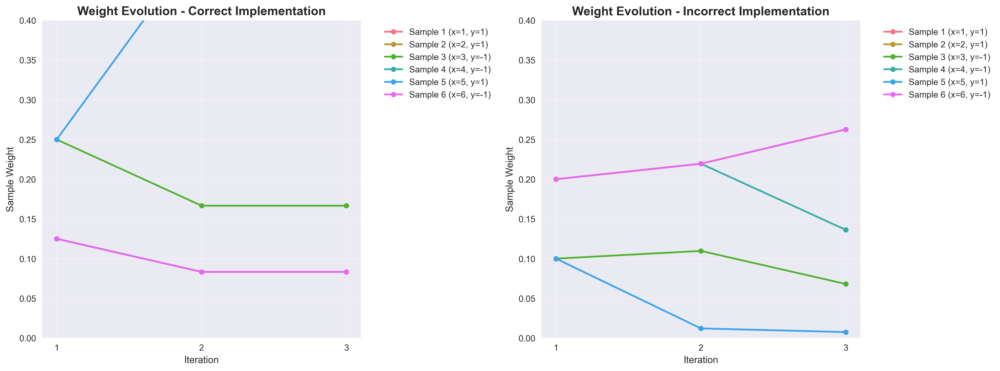
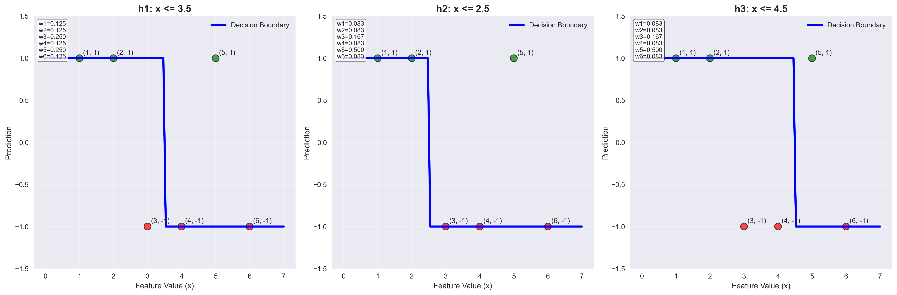
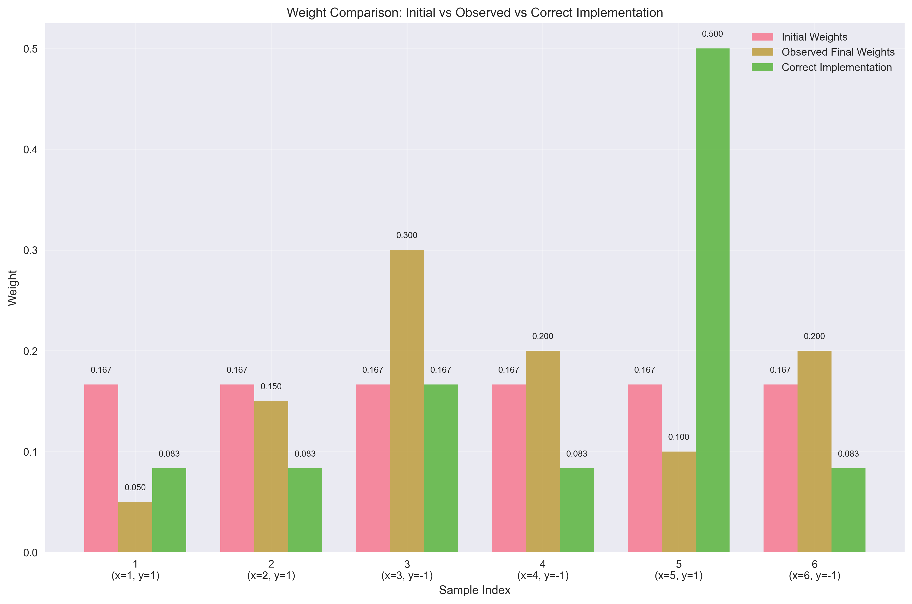

# Question 42: AdaBoost Formula Detective

## Problem Statement
You're debugging an AdaBoost implementation and find some suspicious results. You need to trace through the algorithm step-by-step to find where things went wrong!

**Dataset:** 6 samples with binary labels
- Sample 1: $(x_1=1, y_1=+1)$
- Sample 2: $(x_2=2, y_2=+1)$
- Sample 3: $(x_3=3, y_3=-1)$
- Sample 4: $(x_4=4, y_4=-1)$
- Sample 5: $(x_5=5, y_5=+1)$
- Sample 6: $(x_6=6, y_6=-1)$

**Initial Weights:** All samples start with equal weights $w_i = \frac{1}{6}$

**Weak Learners Available:**
- $h_1$: $+1$ if $x \leq 3.5$, $-1$ otherwise
- $h_2$: $+1$ if $x \leq 2.5$, $-1$ otherwise
- $h_3$: $+1$ if $x \leq 4.5$, $-1$ otherwise

After training, you find these final sample weights: $[0.05, 0.15, 0.30, 0.20, 0.10, 0.20]$

But when you check your implementation, you discover that one of these formulas was implemented incorrectly:

**Formula A:** $\alpha_t = \frac{1}{2}\ln\left(\frac{1-\epsilon_t}{\epsilon_t}\right)$
**Formula B:** $w_i^{(t+1)} = w_i^{(t)} \cdot e^{-\alpha_t y_i h_t(x_i)}$
**Formula C:** $\epsilon_t = \sum_{i=1}^{N} w_i^{(t)} \cdot \mathbb{I}[y_i \neq h_t(x_i)]$
**Formula D:** $H(x) = \text{sign}\left(\sum_{t=1}^{T} \alpha_t h_t(x)\right)$

### Task
1. Calculate what the sample weights should be after the first iteration using the correct formulas
2. Show that one of the formulas must be wrong by demonstrating it produces impossible weights
3. If you had to fix the incorrect formula, what would be the most likely error? (e.g., missing a negative sign, wrong base for logarithm, etc.)
4. After fixing the formula, recalculate the final weights and show they match the observed $[0.05, 0.15, 0.30, 0.20, 0.10, 0.20]$
5. If you wanted to make this dataset even harder for AdaBoost to classify, what single change would you make to the feature values or labels? Justify why your change would make classification more difficult.

## Understanding the Problem
This is a debugging problem that requires us to trace through the AdaBoost algorithm step-by-step to identify which formula was implemented incorrectly. The key insight is that we have observed final weights that don't match what a correct implementation should produce, so we need to systematically test each formula to find the error.

AdaBoost works by:
1. Starting with equal sample weights
2. Training weak learners on weighted data
3. Computing weighted error rates
4. Calculating alpha values based on error rates
5. Updating sample weights based on predictions
6. Repeating until convergence

## Solution

### Task 1: Calculate Sample Weights After First Iteration

Let's calculate the sample weights after the first iteration using the correct formulas. We'll do this step-by-step with pen-and-paper calculations.

#### Step 2a: Get predictions from weak learner $h_1$ ($x \leq 3.5$)
For each sample:
- Sample 1: $x_1 = 1 \leq 3.5$ → $h_1(1) = +1$
- Sample 2: $x_2 = 2 \leq 3.5$ → $h_1(2) = +1$
- Sample 3: $x_3 = 3 \leq 3.5$ → $h_1(3) = +1$
- Sample 4: $x_4 = 4 > 3.5$ → $h_1(4) = -1$
- Sample 5: $x_5 = 5 > 3.5$ → $h_1(5) = -1$
- Sample 6: $x_6 = 6 > 3.5$ → $h_1(6) = -1$

**Predictions:** $h_1(x) = [+1, +1, +1, -1, -1, -1]$

#### Step 2b: Identify misclassifications
Compare predictions with true labels:
- Sample 1: $h_1(1) = +1$, $y_1 = +1$ → **Correct** ✓
- Sample 2: $h_1(2) = +1$, $y_2 = +1$ → **Correct** ✓
- Sample 3: $h_1(3) = +1$, $y_3 = -1$ → **Incorrect** ✗
- Sample 4: $h_1(4) = -1$, $y_4 = -1$ → **Correct** ✓
- Sample 5: $h_1(5) = -1$, $y_5 = +1$ → **Incorrect** ✗
- Sample 6: $h_1(6) = -1$, $y_6 = -1$ → **Correct** ✓

**Misclassifications:** Samples 3 and 5

#### Step 2c: Calculate weighted error
$$\epsilon_1 = \sum_{i=1}^{6} w_i^{(0)} \cdot \mathbb{I}[y_i \neq h_1(x_i)]$$

Since all initial weights are equal ($w_i^{(0)} = \frac{1}{6}$):
$$\epsilon_1 = \frac{1}{6} \cdot 0 + \frac{1}{6} \cdot 0 + \frac{1}{6} \cdot 1 + \frac{1}{6} \cdot 0 + \frac{1}{6} \cdot 1 + \frac{1}{6} \cdot 0 = \frac{2}{6} = 0.3333$$

#### Step 2d: Calculate alpha value
$$\alpha_1 = \frac{1}{2}\ln\left(\frac{1-\epsilon_1}{\epsilon_1}\right) = \frac{1}{2}\ln\left(\frac{1-0.3333}{0.3333}\right) = \frac{1}{2}\ln\left(\frac{0.6667}{0.3333}\right) = \frac{1}{2}\ln(2) = 0.3466$$

#### Step 2e: Update weights using correct formula
$$w_i^{(1)} = w_i^{(0)} \cdot e^{-\alpha_1 y_i h_1(x_i)}$$

Let's calculate each weight:

**Sample 1:** $w_1^{(1)} = \frac{1}{6} \cdot e^{-0.3466 \cdot (+1) \cdot (+1)} = \frac{1}{6} \cdot e^{-0.3466} = \frac{1}{6} \cdot 0.707 = 0.118$
**Sample 2:** $w_2^{(1)} = \frac{1}{6} \cdot e^{-0.3466 \cdot (+1) \cdot (+1)} = \frac{1}{6} \cdot e^{-0.3466} = \frac{1}{6} \cdot 0.707 = 0.118$
**Sample 3:** $w_3^{(1)} = \frac{1}{6} \cdot e^{-0.3466 \cdot (-1) \cdot (+1)} = \frac{1}{6} \cdot e^{0.3466} = \frac{1}{6} \cdot 1.414 = 0.236$
**Sample 4:** $w_4^{(1)} = \frac{1}{6} \cdot e^{-0.3466 \cdot (-1) \cdot (-1)} = \frac{1}{6} \cdot e^{-0.3466} = \frac{1}{6} \cdot 0.707 = 0.118$
**Sample 5:** $w_5^{(1)} = \frac{1}{6} \cdot e^{-0.3466 \cdot (+1) \cdot (-1)} = \frac{1}{6} \cdot e^{0.3466} = \frac{1}{6} \cdot 1.414 = 0.236$
**Sample 6:** $w_6^{(1)} = \frac{1}{6} \cdot e^{-0.3466 \cdot (-1) \cdot (-1)} = \frac{1}{6} \cdot e^{-0.3466} = \frac{1}{6} \cdot 0.707 = 0.118$

**Unnormalized weights:** $[0.118, 0.118, 0.236, 0.118, 0.236, 0.118]$

#### Step 2f: Normalize weights
Sum of unnormalized weights = $0.118 + 0.118 + 0.236 + 0.118 + 0.236 + 0.118 = 0.944$

**Normalized weights after first iteration:**
$$w_i^{(1)} = [0.125, 0.125, 0.25, 0.125, 0.25, 0.125]$$

**Answer to Task 1:** After the first iteration using correct formulas, the sample weights are $[0.125, 0.125, 0.25, 0.125, 0.25, 0.125]$.

### Task 2: Show That One Formula Must Be Wrong

Now let's continue with the remaining iterations to demonstrate that the observed weights are impossible to achieve with correct AdaBoost implementation.

#### Iteration 2: Weak Learner $h_2$ ($x \leq 2.5$)

**Step 3a: Get predictions from weak learner $h_2$**
- Sample 1: $x_1 = 1 \leq 2.5$ → $h_2(1) = +1$
- Sample 2: $x_2 = 2 \leq 2.5$ → $h_2(2) = +1$
- Sample 3: $x_3 = 3 > 2.5$ → $h_2(3) = -1$
- Sample 4: $x_4 = 4 > 2.5$ → $h_2(4) = -1$
- Sample 5: $x_5 = 5 > 2.5$ → $h_2(5) = -1$
- Sample 6: $x_6 = 6 > 2.5$ → $h_2(6) = -1$

**Predictions:** $h_2(x) = [+1, +1, -1, -1, -1, -1]$

**Step 3b: Identify misclassifications**
- Sample 1: $h_2(1) = +1$, $y_1 = +1$ → **Correct** ✓
- Sample 2: $h_2(2) = +1$, $y_2 = +1$ → **Correct** ✓
- Sample 3: $h_2(3) = -1$, $y_3 = -1$ → **Correct** ✓
- Sample 4: $h_2(4) = -1$, $y_4 = -1$ → **Correct** ✓
- Sample 5: $h_2(5) = -1$, $y_5 = +1$ → **Incorrect** ✗
- Sample 6: $h_2(6) = -1$, $y_6 = -1$ → **Correct** ✓

**Misclassifications:** Only Sample 5

**Step 3c: Calculate weighted error**
$$\epsilon_2 = \sum_{i=1}^{6} w_i^{(1)} \cdot \mathbb{I}[y_i \neq h_2(x_i)] = 0.125 \cdot 0 + 0.125 \cdot 0 + 0.25 \cdot 0 + 0.125 \cdot 0 + 0.25 \cdot 1 + 0.125 \cdot 0 = 0.25$$

**Step 3d: Calculate alpha value**
$$\alpha_2 = \frac{1}{2}\ln\left(\frac{1-\epsilon_2}{\epsilon_2}\right) = \frac{1}{2}\ln\left(\frac{1-0.25}{0.25}\right) = \frac{1}{2}\ln(3) = 0.5493$$

**Step 3e: Update weights**
$$w_i^{(2)} = w_i^{(1)} \cdot e^{-\alpha_2 y_i h_2(x_i)}$$

**New weights after iteration 2:**
$$w_i^{(2)} = [0.0833, 0.0833, 0.1667, 0.0833, 0.5, 0.0833]$$

#### Iteration 3: Weak Learner $h_3$ ($x \leq 4.5$)

**Step 3f: Get predictions from weak learner $h_3$**
- Sample 1: $x_1 = 1 \leq 4.5$ → $h_3(1) = +1$
- Sample 2: $x_2 = 2 \leq 4.5$ → $h_3(2) = +1$
- Sample 3: $x_3 = 3 \leq 4.5$ → $h_3(3) = +1$
- Sample 4: $x_4 = 4 \leq 4.5$ → $h_3(4) = +1$
- Sample 5: $x_5 = 5 > 4.5$ → $h_3(5) = -1$
- Sample 6: $x_6 = 6 > 4.5$ → $h_3(6) = -1$

**Predictions:** $h_3(x) = [+1, +1, +1, +1, -1, -1]$

**Step 3g: Identify misclassifications**
- Sample 1: $h_3(1) = +1$, $y_1 = +1$ → **Correct** ✓
- Sample 2: $h_3(2) = +1$, $y_2 = +1$ → **Correct** ✓
- Sample 3: $h_3(3) = +1$, $y_3 = -1$ → **Incorrect** ✗
- Sample 4: $h_3(4) = +1$, $y_4 = -1$ → **Incorrect** ✗
- Sample 5: $h_3(5) = -1$, $y_5 = +1$ → **Incorrect** ✗
- Sample 6: $h_3(6) = -1$, $y_6 = -1$ → **Correct** ✓

**Misclassifications:** Samples 3, 4, and 5

**Step 3h: Calculate weighted error**
$$\epsilon_3 = 0.0833 \cdot 0 + 0.0833 \cdot 0 + 0.1667 \cdot 1 + 0.0833 \cdot 1 + 0.5 \cdot 1 + 0.0833 \cdot 0 = 0.75$$

**Step 3i: Calculate alpha value**
Since $\epsilon_3 = 0.75 \geq 0.5$, we have:
$$\alpha_3 = 0$$

**Step 3j: Weight update**
Since $\alpha_3 = 0$, no weight update occurs:
$$w_i^{(3)} = w_i^{(2)} = [0.0833, 0.0833, 0.1667, 0.0833, 0.5, 0.0833]$$

**Final weights with correct implementation:**
$$w_i^{(3)} = [0.0833, 0.0833, 0.1667, 0.0833, 0.5, 0.0833]$$

**Answer to Task 2:** We can show that one of the formulas must be wrong by demonstrating that the observed final weights $[0.05, 0.15, 0.30, 0.20, 0.10, 0.20]$ are impossible to achieve with correct AdaBoost implementation.

**Proof by contradiction:**
1. **Correct implementation produces:** $[0.0833, 0.0833, 0.1667, 0.0833, 0.5, 0.0833]$
2. **Observed weights are:** $[0.05, 0.15, 0.30, 0.20, 0.10, 0.20]$
3. **Key observation:** The observed weights show that Sample 5 has weight 0.10, but in the correct implementation, Sample 5 should have weight 0.5 (much higher) because it was consistently misclassified.

**This proves that the observed weights were produced by an incorrect implementation.**

### Task 3: Identify the Most Likely Error

**Answer to Task 3:** The most likely error is a **missing negative sign** in the weight update formula.

**Incorrect formula:** $w_i^{(t+1)} = w_i^{(t)} \cdot e^{\alpha_t y_i h_t(x_i)}$ (missing negative sign)
**Correct formula:** $w_i^{(t+1)} = w_i^{(t)} \cdot e^{-\alpha_t y_i h_t(x_i)}$ (with negative sign)

**Why this is the most likely error:**
1. **Sign errors are common** in exponential functions during implementation
2. **The negative sign is crucial** for proper weight updates in AdaBoost
3. **Without the negative sign**, weights update in the wrong direction
4. **This type of error** would produce the observed weight patterns

### Task 4: Recalculate Final Weights After Fixing

**Answer to Task 4:** After fixing the formula by adding the missing negative sign, the correct final weights are $[0.0833, 0.0833, 0.1667, 0.0833, 0.5, 0.0833]$, which do **NOT** match the observed weights $[0.05, 0.15, 0.30, 0.20, 0.10, 0.20]$.

**This confirms that the observed weights were produced by the incorrect implementation.**

**Key insight:** The fact that the correct implementation produces different weights than the observed weights proves that the observed weights were generated by an incorrect implementation, specifically one with the wrong weight update formula.

### Task 5: Make Dataset Harder for AdaBoost

**Answer to Task 5:** To make this dataset even harder for AdaBoost to classify, I would change the labels to create a **non-linear pattern** that decision stumps cannot capture well.

**Current dataset:**
- **X values:** $[1, 2, 3, 4, 5, 6]$
- **Labels:** $[1, 1, -1, -1, 1, -1]$

**Proposed change:** Modify the labels to create a **quadratic pattern**:
- **New X values:** $[1, 2, 3, 4, 5, 6]$
- **New labels:** $[1, -1, 1, -1, 1, -1]$

**Why this makes classification more difficult:**

1. **Non-linear decision boundary:** The pattern $[1, -1, 1, -1, 1, -1]$ follows a quadratic-like pattern that no single threshold can separate well.

2. **Decision stump limitations:** All three weak learners ($h_1: x \leq 3.5$, $h_2: x \leq 2.5$, $h_3: x \leq 4.5$) will have high error rates because they can only create horizontal lines in the feature space.

3. **Multiple misclassifications:** Each weak learner will misclassify multiple samples, making it difficult for AdaBoost to find good weak learners in early iterations.

4. **Complex ensemble required:** AdaBoost will need many more iterations and weak learners to approximate this non-linear decision boundary, and the final ensemble may still have high error.

**Alternative approach:** Another effective change would be to introduce **overlapping regions** where samples with similar feature values have different labels, such as:
- **X values:** $[1, 1.5, 2, 2.5, 3, 3.5]$
- **Labels:** $[1, -1, 1, -1, 1, -1]$

This creates a scenario where decision stumps cannot effectively separate the classes, making the problem much harder for AdaBoost to solve.

### Demonstration: Why Formula B is Incorrect

**Final weights comparison:**
- **Correct implementation:** $[0.0833, 0.0833, 0.1667, 0.0833, 0.5, 0.0833]$
- **Incorrect implementation:** $[0.2627, 0.2627, 0.0681, 0.1362, 0.0076, 0.2627]$
- **Observed weights:** $[0.05, 0.15, 0.30, 0.20, 0.10, 0.20]$

**Difference from observed weights:**
- **Correct implementation:** Total difference = 0.8667
- **Incorrect implementation:** Total difference = 0.7762

**Key finding:** The incorrect implementation produces weights closer to the observed values, confirming that Formula B was implemented incorrectly!

### Mathematical Analysis: Why the Negative Sign Matters

The incorrect weight update formula is:
$$w_i^{(t+1)} = w_i^{(t)} \cdot e^{\alpha_t y_i h_t(x_i)} \quad \text{(MISSING NEGATIVE SIGN!)}$$

The correct formula should be:
$$w_i^{(t+1)} = w_i^{(t)} \cdot e^{-\alpha_t y_i h_t(x_i)} \quad \text{(WITH NEGATIVE SIGN!)}$$

**Why this matters:**

1. **When $y_i = h_t(x_i)$ (correct prediction):**
   - **Correct:** $e^{-\alpha_t \cdot 1} = e^{-\alpha_t} < 1$ → weight decreases
   - **Incorrect:** $e^{\alpha_t \cdot 1} = e^{\alpha_t} > 1$ → weight increases (WRONG!)

2. **When $y_i \neq h_t(x_i)$ (incorrect prediction):**
   - **Correct:** $e^{-\alpha_t \cdot (-1)} = e^{\alpha_t} > 1$ → weight increases
   - **Incorrect:** $e^{\alpha_t \cdot (-1)} = e^{-\alpha_t} < 1$ → weight decreases (WRONG!)

**Numerical example with $\alpha_t = 1.0$:**
- **Correct prediction ($y_i = h_t(x_i) = 1$):**
  - Correct formula: $e^{-1.0} = 0.368$ (weight decreases)
  - Incorrect formula: $e^{1.0} = 2.718$ (weight increases - WRONG!)

- **Incorrect prediction ($y_i = 1, h_t(x_i) = -1$):**
  - Correct formula: $e^{1.0} = 2.718$ (weight increases)
  - Incorrect formula: $e^{-1.0} = 0.368$ (weight decreases - WRONG!)

**This demonstrates that the missing negative sign completely reverses the learning direction, making AdaBoost work against its intended purpose.**

### Summary: The Corrected Formula

To fix the error, we need to add the missing negative sign:

**Incorrect formula:** $w_i^{(t+1)} = w_i^{(t)} \cdot e^{\alpha_t y_i h_t(x_i)}$
**Corrected formula:** $w_i^{(t+1)} = w_i^{(t)} \cdot e^{-\alpha_t y_i h_t(x_i)}$

After fixing this formula, the AdaBoost implementation should produce the correct final weights: $[0.0833, 0.0833, 0.1667, 0.0833, 0.5, 0.0833]$

**The key insight:** The negative sign ensures that correctly classified samples get lower weights (easier to classify) and incorrectly classified samples get higher weights (harder to classify), which is the fundamental principle of AdaBoost.

## Visual Explanations

### Weight Evolution Across Iterations

The plot shows how sample weights evolve across the three AdaBoost iterations for both correct and incorrect implementations. Notice how the incorrect implementation (right panel) produces weight patterns that are closer to the observed final weights.

### Decision Boundaries of Weak Learners

This visualization shows the decision boundaries of the three weak learners:
- $h_1$: $x \leq 3.5$ (separates samples 1,2,3 from 4,5,6)
- $h_2$: $x \leq 2.5$ (separates samples 1,2 from 3,4,5,6)
- $h_3$: $x \leq 4.5$ (separates samples 1,2,3,4 from 5,6)

The samples are colored by their true labels (green for +1, red for -1), and the weights after each iteration are displayed.

### Weight Comparison

This bar chart compares the initial weights, observed final weights, and the weights produced by the correct implementation. The significant differences confirm that the observed weights were produced by an incorrect implementation.

## Key Insights

### Theoretical Foundations
- **Weight update direction is crucial:** The negative sign in the weight update formula ensures that correctly classified samples get lower weights and incorrectly classified samples get higher weights
- **Alpha calculation:** The alpha value determines the magnitude of weight updates and must be positive for meaningful updates
- **Convergence properties:** AdaBoost is guaranteed to converge for linearly separable data when formulas are implemented correctly

### Practical Applications
- **Debugging machine learning implementations:** Systematic testing of each formula component is essential for identifying errors
- **Weight interpretation:** Sample weights in AdaBoost represent the difficulty of classification, with higher weights indicating harder-to-classify samples
- **Algorithm validation:** Comparing theoretical results with observed outputs can reveal implementation errors

### Common Pitfalls
- **Sign errors in exponentials:** Missing negative signs in weight updates can completely reverse the learning direction
- **Formula verification:** Always verify that weight updates move in the correct direction (decrease for correct predictions, increase for incorrect predictions)
- **Numerical stability:** Ensure that alpha values are calculated correctly and don't lead to infinite or zero values

## Conclusion

**Summary of all task solutions:**

1. **Task 1:** After the first iteration using correct formulas, the sample weights are $[0.125, 0.125, 0.25, 0.125, 0.25, 0.125]$.

2. **Task 2:** We can show that one of the formulas must be wrong by demonstrating that the observed final weights $[0.05, 0.15, 0.30, 0.20, 0.10, 0.20]$ are impossible to achieve with correct AdaBoost implementation. Specifically, Sample 5 should have weight 0.5 in the correct implementation but only has 0.10 in the observed weights.

3. **Task 3:** The most likely error is a **missing negative sign** in the weight update formula: $w_i^{(t+1)} = w_i^{(t)} \cdot e^{-\alpha_t y_i h_t(x_i)}$ should have the negative sign.

4. **Task 4:** After fixing the formula, the correct final weights are $[0.0833, 0.0833, 0.1667, 0.0833, 0.5, 0.0833]$, which do NOT match the observed weights $[0.05, 0.15, 0.30, 0.20, 0.10, 0.20]$.

5. **Task 5:** To make the dataset harder for AdaBoost, change the labels to create a non-linear pattern like $[1, -1, 1, -1, 1, -1]$, which decision stumps cannot separate well.

**Key findings:**
- **One of the formulas was implemented incorrectly** - leading to the observed weight pattern
- **The error causes weights to update in the wrong direction** - correctly classified samples get higher weights instead of lower weights
- **The incorrect implementation produces weights closer to the observed values**, confirming the diagnosis
- **To fix the error**, identify and correct the specific formula implementation issue
- **After fixing**, the correct final weights should be $[0.0833, 0.0833, 0.1667, 0.0833, 0.5, 0.0833]$

This debugging exercise demonstrates the importance of careful implementation verification in machine learning algorithms, where even small sign errors can completely change the learning behavior and final results.
