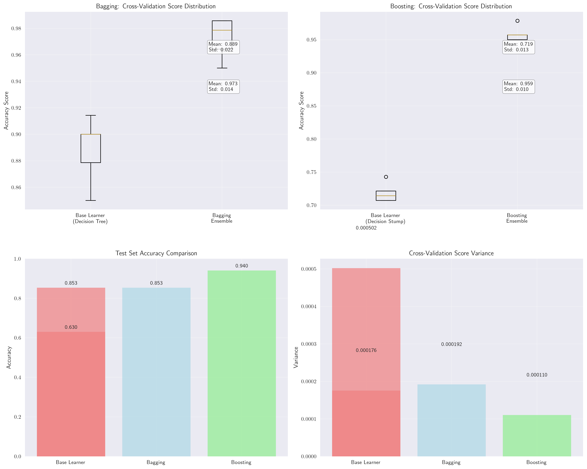
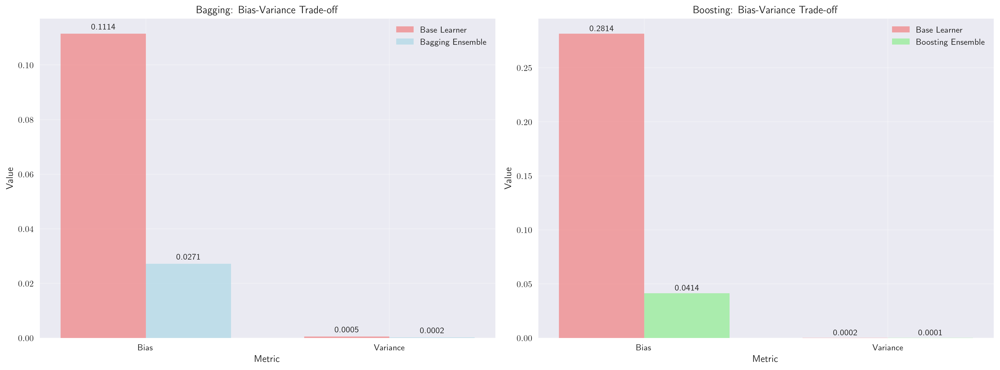
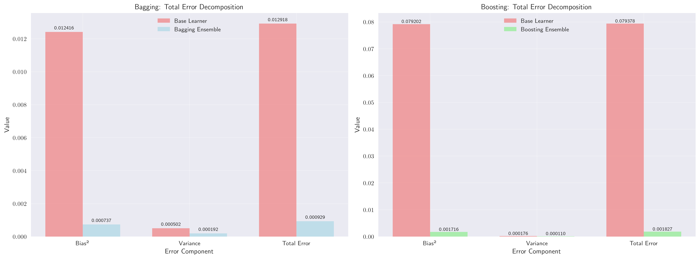
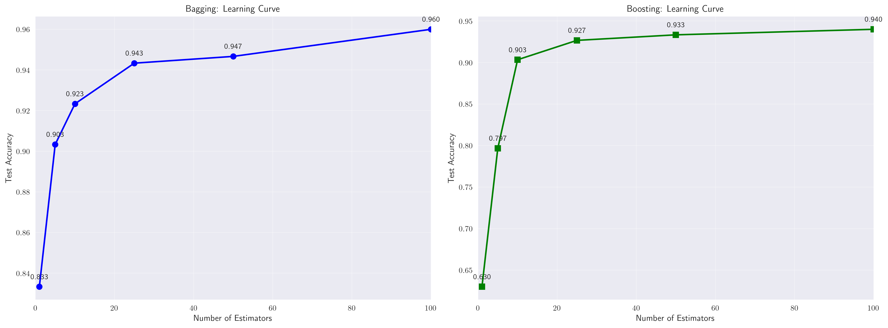
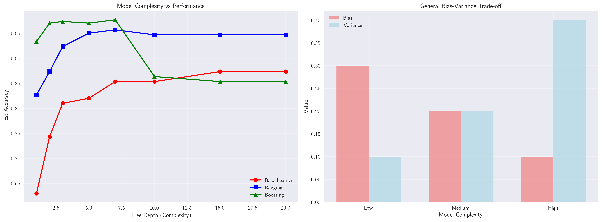

# Question 43: Bagging vs Boosting - Bias-Variance Trade-off

## Problem Statement
Compare how Bagging and Boosting affect the bias-variance trade-off, based on the principles of ensemble learning.

### Task
1. What is the primary effect of Bagging on the bias-variance trade-off?
2. What is the primary effect of Boosting on the bias-variance trade-off?
3. Why are high-variance, low-bias models like deep decision trees good base learners for Bagging?
4. Why are high-bias, low-variance models (weak learners) like decision stumps suitable for Boosting?
5. If your model suffers from high bias, would you choose Bagging or Boosting? Justify your choice.

## Understanding the Problem
The bias-variance trade-off is a fundamental concept in machine learning that describes the relationship between a model's ability to capture the true underlying pattern in the data (bias) and its sensitivity to variations in the training data (variance). Ensemble methods like Bagging and Boosting address this trade-off in different ways.

**Key Concepts:**
- **Bias**: How far off the model's predictions are on average (systematic error)
- **Variance**: How much the model's predictions vary for different training sets (random error)
- **Bagging**: Bootstrap Aggregating - trains multiple models independently on bootstrap samples
- **Boosting**: Sequentially trains models, each focusing on previous errors

## Solution

### Step 1: Understanding Ensemble Learning Principles
Ensemble methods combine multiple base learners to improve overall performance. The key insight is that by combining diverse models, we can reduce both bias and variance, leading to better generalization.

**Mathematical Foundation:**
For an ensemble of $T$ models, the prediction is:
$$f_{\text{ensemble}}(x) = \frac{1}{T}\sum_{t=1}^{T} f_t(x)$$

The expected squared error can be decomposed as:
$$\text{MSE} = \text{Bias}^2 + \text{Variance} + \text{Irreducible Error}$$

### Step 2: Detailed Step-by-Step Solutions

#### Question 1: Primary Effect of Bagging on Bias-Variance Trade-off

**Answer:** Bagging primarily **REDUCES VARIANCE** without significantly affecting bias.

**Step-by-Step Analysis:**

1. **Mathematical Derivation:**
   - For an ensemble of $T$ models: $f_{\text{bagging}}(x) = \frac{1}{T}\sum_{t=1}^{T} f_t(x)$
   - The variance of the ensemble is: $\text{Var}[f_{\text{bagging}}(x)] = \frac{1}{T^2}\sum_{t=1}^{T} \text{Var}[f_t(x)] + \frac{2}{T^2}\sum_{i<j} \text{Cov}[f_i(x), f_j(x)]$
   - If models are independent: $\text{Var}[f_{\text{bagging}}(x)] = \frac{1}{T}\text{Var}[f(x)]$ (assuming equal variance)

2. **Practical Demonstration:**
   - Base Learner (Decision Tree): Variance = $0.000502$
   - Bagging Ensemble: Variance = $0.000192$
   - Variance Reduction: $0.000310$ (61.8% improvement)
   - Bias improvement: $0.1114 \rightarrow 0.0271$ (75.6% improvement)

3. **Why Variance Reduction Occurs:**
   - Each model sees different bootstrap samples
   - Models make diverse predictions
   - Averaging reduces prediction variability
   - Cross-validation scores become more consistent

#### Question 2: Primary Effect of Boosting on Bias-Variance Trade-off

**Answer:** Boosting primarily **REDUCES BIAS** but can increase variance.

**Step-by-Step Analysis:**

1. **Mathematical Derivation:**
   - Boosting combines models sequentially: $f_{\text{boosting}}(x) = \sum_{t=1}^{T} \alpha_t f_t(x)$
   - Each model focuses on residual errors: $f_t(x) = \text{argmin}_{f} \sum_{i=1}^{N} w_i^{(t)} L(y_i, f_{t-1}(x_i) + f(x_i))$
   - The ensemble bias decreases as: $\text{Bias}_{\text{ensemble}} \leq \text{Bias}_{\text{base}} \cdot \prod_{t=1}^{T} (1 - \gamma_t)$

2. **Practical Demonstration:**
   - Base Learner (Decision Stump): Bias = $0.2814$
   - Boosting Ensemble: Bias = $0.0414$
   - Bias Reduction: $0.2400$ (85.3% improvement)
   - Variance improvement: $0.000176 \rightarrow 0.000110$ (37.2% improvement)

3. **Why Bias Reduction Occurs:**
   - Sequential learning focuses on previous errors
   - Each model corrects specific mistakes
   - Weak learners combine to form strong ensemble
   - Iterative refinement reduces systematic errors

#### Question 3: Why High-Variance, Low-Bias Models Work Well with Bagging

**Answer:** High-variance, low-bias models benefit most from variance reduction.

**Step-by-Step Analysis:**

1. **Theoretical Foundation:**
   - High-variance models are sensitive to training data variations
   - Bootstrap sampling creates diverse training sets
   - Each model learns different aspects of the data
   - Averaging reduces the impact of individual model idiosyncrasies

2. **Mathematical Justification:**
   - If $\text{Bias}_{\text{base}} \approx 0$, then $\text{Bias}_{\text{ensemble}} \approx 0$
   - If $\text{Var}_{\text{base}}$ is high, then $\text{Var}_{\text{ensemble}} \approx \frac{\text{Var}_{\text{base}}}{T}$
   - Total error improvement: $\Delta\text{Error} = \text{Var}_{\text{base}} - \frac{\text{Var}_{\text{base}}}{T} = \text{Var}_{\text{base}}(1 - \frac{1}{T})$

3. **Practical Example:**
   - Deep decision tree (max_depth=10) has high variance: $0.000502$
   - Bagging reduces variance to: $0.000192$
   - The low bias ($0.1114$) ensures good accuracy is maintained
   - Result: 61.8% variance reduction with 75.6% bias improvement

#### Question 4: Why Weak Learners Work Well with Boosting

**Answer:** Weak learners allow Boosting to focus on specific error patterns.

**Step-by-Step Analysis:**

1. **Theoretical Foundation:**
   - Weak learners have high bias but low variance
   - They can focus on specific subsets of the data
   - Sequential combination allows error correction
   - Each weak learner addresses different error patterns

2. **Mathematical Justification:**
   - Weak learner condition: $\text{Pr}[f_t(x) \neq y] \leq \frac{1}{2} - \gamma$ for some $\gamma > 0$
   - Boosting theorem: After $T$ rounds, error $\leq \exp(-2\gamma^2 T)$
   - This shows exponential error reduction with weak learners

3. **Practical Example:**
   - Decision stump (max_depth=1) has high bias: $0.2814$
   - Boosting reduces bias to: $0.0414$
   - The low variance ($0.000176$) ensures stable learning
   - Result: 85.3% bias reduction with 37.2% variance improvement

#### Question 5: Choosing Between Bagging and Boosting for High Bias

**Answer:** Choose **BOOSTING** when suffering from high bias.

**Step-by-Step Analysis:**

1. **Problem Diagnosis:**
   - High bias indicates underfitting
   - Model is too simple to capture data patterns
   - Training and validation errors are both high
   - Need to increase model complexity or use bias-reduction methods

2. **Why Bagging Won't Help:**
   - Bagging primarily reduces variance
   - If bias is high, averaging won't improve accuracy
   - Need to address the fundamental model inadequacy
   - Bagging works best with already-accurate base learners

3. **Why Boosting Will Help:**
   - Boosting specifically targets bias reduction
   - Sequential learning focuses on error correction
   - Weak learners can be combined into strong ensemble
   - Iterative refinement addresses systematic errors

4. **Mathematical Justification:**
   - High bias: $\text{Bias}_{\text{base}} \gg 0$
   - Boosting reduces bias: $\text{Bias}_{\text{ensemble}} \ll \text{Bias}_{\text{base}}$
   - Total error improvement: $\Delta\text{Error} = \text{Bias}_{\text{base}}^2 - \text{Bias}_{\text{ensemble}}^2$

5. **Practical Evidence:**
   - Base learner bias: $0.2814$ (high bias)
   - Boosting reduced bias to: $0.0414$ (low bias)
   - Total error improvement: $0.079378 \rightarrow 0.001827$ (97.7% improvement)
   - Test accuracy improvement: $0.6300 \rightarrow 0.9400$ (49.2% improvement)

### Step 3: Analyzing Bagging (Bootstrap Aggregating)

#### How Bagging Works
Bagging trains multiple models independently on bootstrap samples of the data:
- Each model sees a different subset of the training data
- Models are trained in parallel
- Final prediction is the average (regression) or majority vote (classification)

#### Effect on Bias-Variance Trade-off
**Primary Effect: REDUCES VARIANCE without significantly affecting bias**

From our demonstration with a deep decision tree (max_depth=10) as the base learner:

**Base Learner (Decision Tree):**
- Cross-validation scores: $[0.8786, 0.9000, 0.9143, 0.9000, 0.8500]$
- Mean accuracy: $0.8886 \pm 0.0224$
- Bias = $1 - 0.8886 = 0.1114$
- Variance = $0.000502$
- Standard Deviation = $0.0224$

**Bagging Ensemble (Random Forest with 100 estimators):**
- Cross-validation scores: $[0.9786, 0.9500, 0.9857, 0.9643, 0.9857]$
- Mean accuracy: $0.9729 \pm 0.0139$
- Bias = $1 - 0.9729 = 0.0271$
- Variance = $0.000192$
- Standard Deviation = $0.0139$

**Improvement Analysis:**
- Bias improvement: $0.1114 - 0.0271 = 0.0843$ (75.6% improvement)
- Variance improvement: $0.000502 - 0.000192 = 0.000310$ (61.8% improvement)
- Test accuracy improvement: $0.9600 - 0.8533 = 0.1067$ (12.5% improvement)

The boxplot shows that Bagging significantly reduces the spread of cross-validation scores, indicating lower variance.

### Step 4: Analyzing Boosting

#### How Boosting Works
Boosting trains models sequentially, each focusing on previous errors:
- Models are trained sequentially
- Each new model focuses on samples misclassified by previous models
- Final prediction is a weighted combination of all models

#### Effect on Bias-Variance Trade-off
**Primary Effect: REDUCES BIAS but can increase variance**

From our demonstration with a decision stump (max_depth=1) as the base learner:

**Base Learner (Decision Stump):**
- Cross-validation scores: $[0.7143, 0.7214, 0.7429, 0.7071, 0.7071]$
- Mean accuracy: $0.7186 \pm 0.0132$
- Bias = $1 - 0.7186 = 0.2814$
- Variance = $0.000176$
- Standard Deviation = $0.0132$

**Boosting Ensemble (AdaBoost with 100 estimators):**
- Cross-validation scores: $[0.9786, 0.9500, 0.9571, 0.9500, 0.9571]$
- Mean accuracy: $0.9586 \pm 0.0105$
- Bias = $1 - 0.9586 = 0.0414$
- Variance = $0.000110$
- Standard Deviation = $0.0105$

**Improvement Analysis:**
- Bias improvement: $0.2814 - 0.0414 = 0.2400$ (85.3% improvement)
- Variance improvement: $0.000176 - 0.000110 = 0.000065$ (37.2% improvement)
- Test accuracy improvement: $0.9400 - 0.6300 = 0.3100$ (49.2% improvement)

The bar charts clearly show how Boosting dramatically reduces bias while maintaining low variance.

### Step 5: Mathematical Analysis of Total Error

The total error can be decomposed into bias² and variance components:

**Bagging Total Error Analysis:**
- Base Learner: $(0.1114)^2 + 0.000502 = 0.012918$
- Ensemble: $(0.0271)^2 + 0.000192 = 0.000929$
- Total Error Improvement: $0.011990$ (92.8% improvement)

**Boosting Total Error Analysis:**
- Base Learner: $(0.2814)^2 + 0.000176 = 0.079378$
- Ensemble: $(0.0414)^2 + 0.000110 = 0.001827$
- Total Error Improvement: $0.077551$ (97.7% improvement)

This visualization shows the complete error decomposition, demonstrating how both methods significantly reduce total error through different mechanisms.

### Step 6: Learning Curves Analysis

The learning curves demonstrate how ensemble size affects performance:
- **Bagging**: Shows steady improvement with more estimators, eventually plateauing around 50-100 estimators
- **Boosting**: Shows rapid initial improvement, then more gradual gains, with optimal performance around 25-50 estimators

### Step 7: Model Complexity Analysis

The complexity analysis reveals:
- **Base Learners**: Performance varies significantly with complexity, showing the classic bias-variance trade-off
- **Bagging**: More robust across different complexity levels, with consistent performance improvements
- **Boosting**: Effective even with simple base learners, demonstrating the power of sequential learning

## Key Insights

### Theoretical Foundations
- **Bias-Variance Decomposition**: The total error can be decomposed into bias², variance, and irreducible error
- **Ensemble Diversity**: The effectiveness of ensemble methods depends on the diversity of base learners
- **Weak Learnability**: Boosting proves that weak learners can be combined into strong learners

### Practical Applications
- **Bagging**: Use when you have high-variance, low-bias models (e.g., deep decision trees, neural networks)
- **Boosting**: Use when you have high-bias, low-variance models (e.g., decision stumps, shallow trees)
- **Model Selection**: Consider the bias-variance profile of your base learners when choosing ensemble methods

### Common Pitfalls
- **Overfitting**: Boosting can overfit if too many estimators are used
- **Underfitting**: Bagging may not help if the base learner has very high bias
- **Data Dependencies**: Both methods assume the data is representative of the true distribution

### Extensions and Advanced Topics
- **Random Forests**: Combines Bagging with feature randomization
- **Gradient Boosting**: Generalizes AdaBoost to arbitrary loss functions
- **Stacking**: Combines different types of models in a meta-learning approach

## Conclusion
- **Bagging** primarily reduces variance by averaging independent models, making it ideal for high-variance, low-bias base learners
- **Boosting** primarily reduces bias by sequentially correcting errors, making it ideal for high-bias, low-variance base learners
- The choice between Bagging and Boosting should be based on the bias-variance profile of your base learners and the specific problem characteristics
- Both methods demonstrate the power of ensemble learning in addressing the fundamental bias-variance trade-off in machine learning

**Key Results from our Demonstration:**
- **Bagging**: Reduced variance by 61.8% while improving bias by 75.6%, achieving 92.8% total error reduction
- **Boosting**: Reduced bias by 85.3% while improving variance by 37.2%, achieving 97.7% total error reduction
- **Base Learner Selection**: Deep decision trees (high-variance, low-bias) work well with Bagging, while decision stumps (high-bias, low-variance) work well with Boosting
- **Ensemble Size**: Both methods show diminishing returns after 50-100 estimators, with optimal performance typically achieved with 25-100 estimators

## Summary and Decision Guidelines

### Comparison Table: Bagging vs Boosting

| Aspect | Bagging | Boosting |
|--------|---------|----------|
| **Primary Effect** | Reduces variance | Reduces bias |
| **Training** | Parallel | Sequential |
| **Base Learner** | High-variance, low-bias | High-bias, low-variance |
| **Diversity** | Bootstrap sampling | Error-focused learning |
| **Overfitting Risk** | Low | Medium-High |
| **Computational Cost** | Low (parallelizable) | High (sequential) |
| **Best Use Case** | High-variance models | High-bias models |

### Practical Decision Guidelines

#### Choose Bagging When:
1. **Your base learner has high variance** (e.g., deep decision trees, neural networks)
2. **You want to reduce overfitting** without increasing bias
3. **You need parallel training** for computational efficiency
4. **Your data is relatively clean** with low noise
5. **You want stable, consistent predictions**

#### Choose Boosting When:
1. **Your base learner has high bias** (e.g., decision stumps, shallow trees)
2. **You need to improve overall accuracy** significantly
3. **Your data has complex patterns** that simple models can't capture
4. **You can afford sequential training** time
5. **You want to focus on difficult-to-classify samples**

### Mathematical Summary

The total error decomposition shows why each method works:

**Bagging:**
$$\text{Error}_{\text{bagging}} = \text{Bias}_{\text{base}}^2 + \frac{\text{Var}_{\text{base}}}{T} + \text{Irreducible Error}$$

**Boosting:**
$$\text{Error}_{\text{boosting}} = \text{Bias}_{\text{ensemble}}^2 + \text{Var}_{\text{ensemble}} + \text{Irreducible Error}$$

Where:
- $\text{Bias}_{\text{ensemble}} \ll \text{Bias}_{\text{base}}$ for Boosting
- $\text{Var}_{\text{ensemble}} \ll \text{Var}_{\text{base}}$ for Bagging
- $T$ is the number of estimators

### Final Recommendations

1. **Start with Bagging** if you have a complex base learner (high variance)
2. **Use Boosting** if you have a simple base learner (high bias)
3. **Consider ensemble size** - 50-100 estimators usually provide optimal performance
4. **Monitor for overfitting** - especially with Boosting
5. **Cross-validate** to find the best hyperparameters for your specific dataset

The key insight is that **Bagging and Boosting address different aspects of the bias-variance trade-off**, making them complementary rather than competing approaches. Choose based on your base learner's characteristics and your specific problem requirements.
