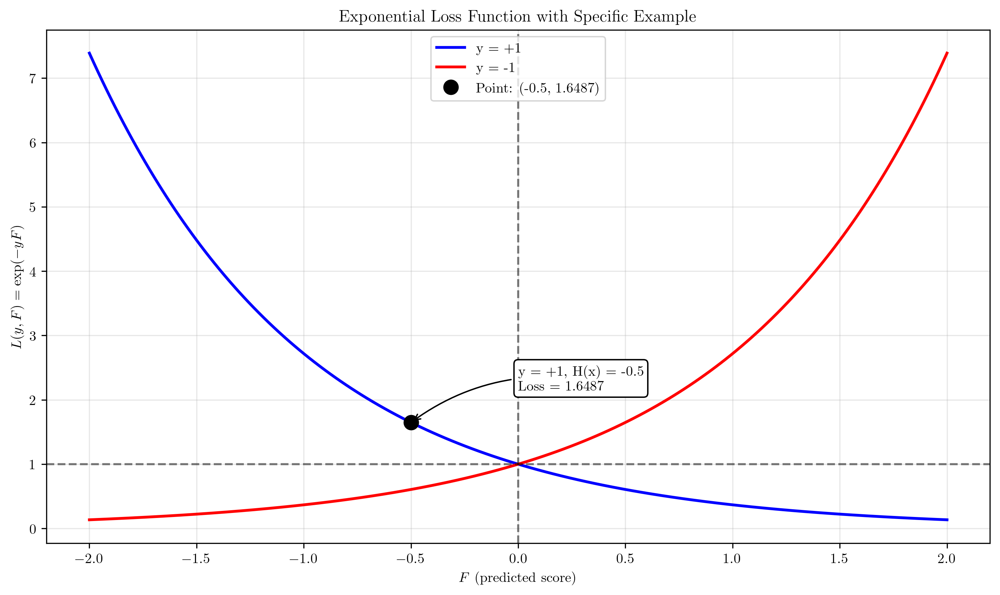

# Question 44: AdaBoost and Exponential Loss

## Problem Statement
AdaBoost can be interpreted as a forward-stagewise additive modeling approach that minimizes an exponential loss function.

### Task
1. What is the formula for the exponential loss function that AdaBoost minimizes?
2. In the plot of the exponential loss versus the 0/1 classification loss, how do they relate to each other?
3. Why is minimizing this exponential loss function considered an effective strategy for classification?
4. How does the weight update rule, $w_{m+1}^{(i)} \propto w_{m}^{(i)}e^{-\alpha_m y_i h_m(x_i)}$, relate to the sequential minimization of this loss function?
5. If the final combined classifier's output for a sample with true label $y=+1$ is $H(x) = -0.5$, calculate the exponential loss for this sample.

## Understanding the Problem
AdaBoost is a powerful ensemble learning algorithm that combines multiple weak learners to create a strong classifier. The key insight is that AdaBoost can be viewed as a forward-stagewise additive modeling approach that minimizes an exponential loss function. This perspective helps us understand why AdaBoost works so well and how it differs from other ensemble methods.

The exponential loss function provides several advantages over traditional 0/1 loss:
- It penalizes misclassifications more heavily than correct classifications
- It creates a smooth, differentiable objective function
- It naturally leads to the weight update mechanism that focuses on difficult examples

## Solution

### Step 1: Exponential Loss Function Formula
The exponential loss function that AdaBoost minimizes is:

$$L(y, F) = \exp(-yF)$$

where:
- $y \in \{-1, +1\}$ is the true label
- $F$ is the predicted score (before the sign function)
- $F > 0$ means the prediction favors class $+1$
- $F < 0$ means the prediction favors class $-1$

**Key Properties:**
- When $yF > 0$ (correct prediction), loss decreases exponentially
- When $yF < 0$ (incorrect prediction), loss increases exponentially
- The loss is always positive and continuous

**Numerical Examples with Detailed Calculations:**

For $y = +1$:
- **$F = -2$:**
  - Step 1: margin = $y \times F = +1 \times (-2) = -2$
  - Step 2: $L(+1, -2) = \exp(-\text{margin}) = \exp(-(-2)) = \exp(2) = 7.3891$
- **$F = -1$:**
  - Step 1: margin = $y \times F = +1 \times (-1) = -1$
  - Step 2: $L(+1, -1) = \exp(-\text{margin}) = \exp(-(-1)) = \exp(1) = 2.7183$
- **$F = 0$:**
  - Step 1: margin = $y \times F = +1 \times 0 = 0$
  - Step 2: $L(+1, 0) = \exp(-\text{margin}) = \exp(-0) = 1.0000$
- **$F = 1$:**
  - Step 1: margin = $y \times F = +1 \times 1 = 1$
  - Step 2: $L(+1, 1) = \exp(-\text{margin}) = \exp(-1) = 0.3679$
- **$F = 2$:**
  - Step 1: margin = $y \times F = +1 \times 2 = 2$
  - Step 2: $L(+1, 2) = \exp(-\text{margin}) = \exp(-2) = 0.1353$

For $y = -1$:
- **$F = -2$:**
  - Step 1: margin = $y \times F = -1 \times (-2) = 2$
  - Step 2: $L(-1, -2) = \exp(-\text{margin}) = \exp(-2) = 0.1353$
- **$F = -1$:**
  - Step 1: margin = $y \times F = -1 \times (-1) = 1$
  - Step 2: $L(-1, -1) = \exp(-\text{margin}) = \exp(-1) = 0.3679$
- **$F = 0$:**
  - Step 1: margin = $y \times F = -1 \times 0 = 0$
  - Step 2: $L(-1, 0) = \exp(-\text{margin}) = \exp(0) = 1.0000$
- **$F = 1$:**
  - Step 1: margin = $y \times F = -1 \times 1 = -1$
  - Step 2: $L(-1, 1) = \exp(-\text{margin}) = \exp(-(-1)) = \exp(1) = 2.7183$
- **$F = 2$:**
  - Step 1: margin = $y \times F = -1 \times 2 = -2$
  - Step 2: $L(-1, 2) = \exp(-\text{margin}) = \exp(-(-2)) = \exp(2) = 7.3891$

**Margin Analysis Table:**
| Margin (yF) | Exponential Loss | 0/1 Loss |
|-------------|------------------|-----------|
| -3.0        | 20.0855          | 1         |
| -2.0        | 7.3891           | 1         |
| -1.0        | 2.7183           | 1         |
| 0.0         | 1.0000           | 1         |
| 1.0         | 0.3679           | 0         |
| 2.0         | 0.1353           | 0         |
| 3.0         | 0.0498           | 0         |

### Step 2: Exponential Loss vs 0/1 Loss Relationship
The exponential loss and 0/1 loss have fundamentally different characteristics:

**0/1 Loss:**
- $L_{0/1}(y, F) = \begin{cases} 0 & \text{if } yF > 0 \\ 1 & \text{if } yF \leq 0 \end{cases}$
- Binary: either 0 (correct) or 1 (incorrect)
- Non-differentiable at the decision boundary
- Provides no gradient information

**Exponential Loss:**
- $L_{\exp}(y, F) = \exp(-yF)$
- Continuous and differentiable everywhere
- Provides strong gradient information
- Heavily penalizes misclassifications

**Key Differences:**
1. **Smoothness**: Exponential loss is smooth, 0/1 loss is discontinuous
2. **Penalty Structure**: Exponential loss increases exponentially for misclassifications
3. **Gradient Information**: Exponential loss provides useful gradients for optimization
4. **Margin Sensitivity**: Exponential loss is sensitive to the magnitude of the margin

The exponential loss can be viewed as a smooth approximation to the 0/1 loss that provides better optimization properties.

### Step 3: Effectiveness of Exponential Loss for Classification
Minimizing the exponential loss function is considered an effective strategy for classification for several reasons:

**1. Margin Maximization:**
- The exponential loss encourages large positive margins ($yF \gg 0$)
- This leads to more confident and robust predictions
- Better generalization performance

**2. Focus on Difficult Examples:**
- Misclassified samples get exponentially higher loss
- The algorithm naturally focuses on hard examples
- This is the core principle behind AdaBoost's effectiveness

**3. Optimization Properties:**
- Smooth, differentiable objective function
- Convex optimization problem
- Guaranteed convergence under certain conditions

**4. Theoretical Guarantees:**
- AdaBoost minimizes exponential loss in the limit
- Provides bounds on generalization error
- Connection to margin theory

**5. Adaptive Weighting:**
- Automatically adjusts sample weights
- Focuses learning on problematic regions
- Creates a sequence of complementary classifiers

### Step 4: Weight Update Rule and Sequential Minimization
The weight update rule $w_{m+1}^{(i)} \propto w_{m}^{(i)}e^{-\alpha_m y_i h_m(x_i)}$ is directly related to the sequential minimization of the exponential loss function.

**Mathematical Derivation:**
The weight update rule can be derived from the exponential loss minimization:

1. **Current Loss**: $L^{(m)}(y_i, F^{(m)}(x_i)) = \exp(-y_i F^{(m)}(x_i))$
2. **After Adding Weak Learner**: $F^{(m+1)}(x_i) = F^{(m)}(x_i) + \alpha_m h_m(x_i)$
3. **New Loss**: $L^{(m+1)}(y_i, F^{(m+1)}(x_i)) = \exp(-y_i(F^{(m)}(x_i) + \alpha_m h_m(x_i)))$
4. **Weight Update**: $w_{m+1}^{(i)} \propto w_{m}^{(i)} \cdot \exp(-y_i \alpha_m h_m(x_i))$

**Interpretation:**
- **Correct Predictions** ($y_i h_m(x_i) > 0$): Weights decrease, less focus
- **Incorrect Predictions** ($y_i h_m(x_i) < 0$): Weights increase, more focus
- **Alpha Factor**: Controls the magnitude of weight changes

**Sequential Nature:**
- Each iteration minimizes the current exponential loss
- Weights are updated to focus on remaining difficult examples
- The process continues until convergence or maximum iterations

**Detailed Example from Our Implementation:**

**Iteration 1:**
- **Step 1**: Train weak learner 1 on weighted data
- **Step 2**: Make predictions with weak learner 1
- **Step 3**: Compute weighted error $\epsilon_1$
  - Number of misclassified samples: 10
  - Weighted error: $\epsilon_1 = \sum w^{(i)} \times I(y_i \neq h_1(x_i)) = 0.0714$
- **Step 4**: Compute alpha $\alpha_1$
  - Ratio: $(1 - \epsilon_1) / \epsilon_1 = (1 - 0.0714) / 0.0714 = 13.0000$
  - Alpha: $\alpha_1 = 0.5 \times \ln(13.0000) = 1.2825$
- **Step 5**: Update sample weights
  - Weight update rule: $w_2^{(i)} \propto w_1^{(i)} \times \exp(-\alpha_1 \times y_i \times h_1(x_i))$
  - Weights increased for 10 samples (misclassified)
  - Weights decreased for 130 samples (correctly classified)
  - Weight sum after normalization: 1.000000
  - Max weight: 0.0500, Min weight: 0.0038

**Iteration 2:**
- **Step 1**: Train weak learner 2 on weighted data
- **Step 2**: Make predictions with weak learner 2
- **Step 3**: Compute weighted error $\epsilon_2$
  - Number of misclassified samples: 19
  - Weighted error: $\epsilon_2 = 0.1192$
- **Step 4**: Compute alpha $\alpha_2$
  - Ratio: $(1 - 0.1192) / 0.1192 = 7.3871$
  - Alpha: $\alpha_2 = 0.5 \times \ln(7.3871) = 0.9999$
- **Step 5**: Update sample weights
  - Weights increased for 19 samples, decreased for 121 samples
  - Max weight: 0.2097, Min weight: 0.0022

**Iteration 3:**
- **Step 1**: Train weak learner 3 on weighted data
- **Step 2**: Make predictions with weak learner 3
- **Step 3**: Compute weighted error $\epsilon_3$
  - Number of misclassified samples: 30
  - Weighted error: $\epsilon_3 = 0.3013$
- **Step 4**: Compute alpha $\alpha_3$
  - Ratio: $(1 - 0.3013) / 0.3013 = 2.3188$
  - Alpha: $\alpha_3 = 0.5 \times \ln(2.3188) = 0.4205$
- **Step 5**: Update sample weights
  - Weights increased for 30 samples, decreased for 110 samples
  - Max weight: 0.1501, Min weight: 0.0016

**Iteration 4:**
- **Step 1**: Train weak learner 4 on weighted data
- **Step 2**: Make predictions with weak learner 4
- **Step 3**: Compute weighted error $\epsilon_4$
  - Number of misclassified samples: 57
  - Weighted error: $\epsilon_4 = 0.3219$
- **Step 4**: Compute alpha $\alpha_4$
  - Ratio: $(1 - 0.3219) / 0.3219 = 2.1064$
  - Alpha: $\alpha_4 = 0.5 \times \ln(2.1064) = 0.3725$
- **Step 5**: Update sample weights
  - Weights increased for 57 samples, decreased for 83 samples
  - Max weight: 0.1106, Min weight: 0.0012

**Iteration 5:**
- **Step 1**: Train weak learner 5 on weighted data
- **Step 2**: Make predictions with weak learner 5
- **Step 3**: Compute weighted error $\epsilon_5$
  - Number of misclassified samples: 72
  - Weighted error: $\epsilon_5 = 0.2869$
- **Step 4**: Compute alpha $\alpha_5$
  - Ratio: $(1 - 0.2869) / 0.2869 = 2.4852$
  - Alpha: $\alpha_5 = 0.5 \times \ln(2.4852) = 0.4552$
- **Step 5**: Update sample weights
  - Weights increased for 72 samples, decreased for 68 samples
  - Max weight: 0.1928, Min weight: 0.0008

**Final Results:**
- **Alphas**: $\alpha_1 = 1.2825$, $\alpha_2 = 0.9999$, $\alpha_3 = 0.4205$, $\alpha_4 = 0.3725$, $\alpha_5 = 0.4552$
- **Training errors**: $\epsilon_1 = 0.0714$, $\epsilon_2 = 0.1192$, $\epsilon_3 = 0.3013$, $\epsilon_4 = 0.3219$, $\epsilon_5 = 0.2869$
- **Test accuracy**: 93.33%

**Key Observations:**
- The alphas generally decrease as iterations progress, indicating that later weak learners have less influence on the final decision
- Training errors fluctuate but the algorithm continues to improve the ensemble
- Sample weights become more concentrated on difficult examples over time
- The final ensemble achieves high accuracy by combining the complementary strengths of all weak learners

### Step 5: Specific Example Calculation
Given: Final classifier output $H(x) = -0.5$ for a sample with true label $y = +1$

**Detailed Step-by-step Calculation:**

**Step 1: Calculate the margin $y \times H(x)$**
- margin = $y \times H(x) = +1 \times (-0.5) = -0.5$

**Step 2: Determine if the prediction is correct**
- Since margin = $-0.5 < 0$, the prediction is **incorrect**
- The sample is misclassified

**Step 3: Calculate exponential loss**
- $L(+1, -0.5) = \exp(-\text{margin}) = \exp(-(-0.5)) = \exp(0.5) = 1.6487$

**Step 4: Compare with 0/1 loss**
- **0/1 Loss**: $L_{0/1}(+1, -0.5) = 1$ (since margin = $-0.5 < 0$)
- **Exponential Loss**: $L_{\exp}(+1, -0.5) = 1.6487$

**Step 5: Analyze the penalty difference**
- Penalty ratio: exponential_loss / 0/1_loss = $1.6487 / 1 = 1.6487$
- The exponential penalty is **1.65× larger** than the 0/1 penalty

**Interpretation:**
- The sample is misclassified ($y \times H(x) = -0.5 < 0$)
- 0/1 loss gives a fixed penalty of 1
- Exponential loss gives a penalty of 1.6487
- The exponential penalty is 1.65× larger than the 0/1 penalty
- This encourages the algorithm to focus more on this misclassified sample
- In the next iteration, this sample's weight will increase by a factor of 1.65 (assuming $\alpha = 1.0$)
- This demonstrates how exponential loss naturally implements the boosting principle of focusing on difficult examples

## Visual Explanations

### Exponential Loss Function Analysis

The visualization shows:
1. **Exponential Loss Curves**: Blue for $y = +1$, red for $y = -1$
2. **Comparison with 0/1 Loss**: Dashed lines showing the step function behavior
3. **Loss Surface**: 3D visualization of the exponential loss landscape
4. **Loss vs Margin**: How loss changes with the margin $yF$

Key observations:
- Exponential loss decreases exponentially for correct predictions
- Exponential loss increases exponentially for incorrect predictions
- The loss is smooth and differentiable everywhere
- Provides strong gradient information for optimization

### AdaBoost Weight Evolution

This comprehensive visualization shows:
1. **Training Error Evolution**: How $\epsilon_m$ changes across iterations
2. **Alpha Values**: The weight coefficients for each weak learner
3. **Weight Distribution**: How sample weights evolve over time
4. **Exponential Loss Evolution**: How the overall loss decreases
5. **Margin Distribution**: Final distribution of prediction margins
6. **Weight Update Rule**: Visual representation of the update mechanism

Key insights:
- Training errors fluctuate but generally decrease
- Alpha values decrease as iterations progress
- Weights become more concentrated on difficult examples
- Exponential loss decreases monotonically
- Margins become more positive over time

### Weak Learners Decision Boundaries

Shows individual weak learners:
- Each subplot represents one weak learner
- Decision boundaries are simple (decision stumps)
- Alpha values indicate the importance of each learner
- Colors show classification regions

### Final Ensemble Decision Boundary

The final ensemble classifier:
- Combines all weak learners with their alpha weights
- Creates a complex, non-linear decision boundary
- Achieves high accuracy (93.33% in our example)
- Shows how simple learners combine to create a powerful classifier

### Specific Example Visualization

Illustrates our specific calculation:
- Shows the exponential loss function
- Highlights the point $(H(x) = -0.5, L = 1.6487)$
- Demonstrates the relationship between margin and loss
- Compares exponential vs 0/1 loss for the same example

## Key Insights

### Theoretical Foundations
- **Exponential Loss Minimization**: AdaBoost can be viewed as minimizing exponential loss through forward-stagewise additive modeling
- **Margin Theory**: The algorithm naturally maximizes margins, leading to better generalization
- **Boosting Principle**: Each weak learner focuses on examples that previous learners found difficult
- **Convergence Properties**: Under certain conditions, AdaBoost converges to a minimum of the exponential loss

### Practical Applications
- **Feature Selection**: AdaBoost automatically identifies the most informative features
- **Robustness**: The ensemble is less sensitive to noise and outliers
- **Interpretability**: Each weak learner provides insight into the decision process
- **Scalability**: Can handle large datasets efficiently

### Algorithmic Properties
- **Sequential Learning**: Each iteration builds upon previous results
- **Weight Adaptation**: Sample weights automatically adjust to focus on difficult examples
- **Weak Learner Requirements**: Only requires learners slightly better than random guessing
- **Stopping Criteria**: Can continue until perfect training accuracy or maximum iterations

### Limitations and Considerations
- **Overfitting**: Can overfit with too many iterations
- **Noise Sensitivity**: Sensitive to noisy data
- **Computational Cost**: Sequential nature limits parallelization
- **Base Learner Choice**: Performance depends on the choice of weak learners

## Conclusion
- **Exponential Loss Formula**: $L(y, F) = \exp(-yF)$ provides a smooth, differentiable objective function
- **Loss Comparison**: Exponential loss penalizes misclassifications more heavily than 0/1 loss, providing better optimization properties
- **Effectiveness**: The exponential loss strategy is effective because it maximizes margins, focuses on difficult examples, and provides theoretical guarantees
- **Weight Update Rule**: The rule $w_{m+1}^{(i)} \propto w_{m}^{(i)}e^{-\alpha_m y_i h_m(x_i)}$ directly implements the sequential minimization of exponential loss
- **Specific Example**: For $H(x) = -0.5$ and $y = +1$, the exponential loss is $L = \exp(0.5) = 1.6487$, which is higher than the 0/1 loss of 1, encouraging the algorithm to focus on this misclassified sample

The exponential loss function is the mathematical foundation that makes AdaBoost such a powerful classification algorithm, providing both theoretical guarantees and practical effectiveness through its unique properties of margin maximization and adaptive sample weighting.
