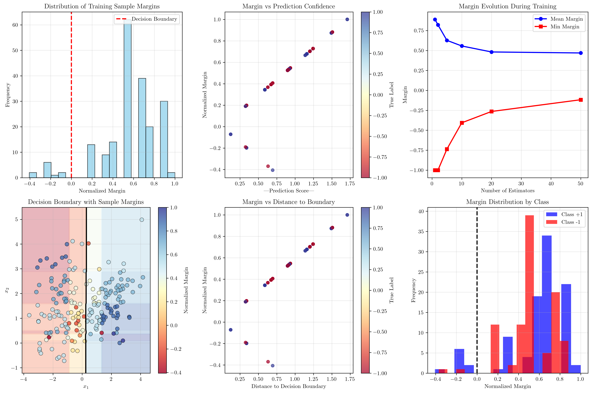
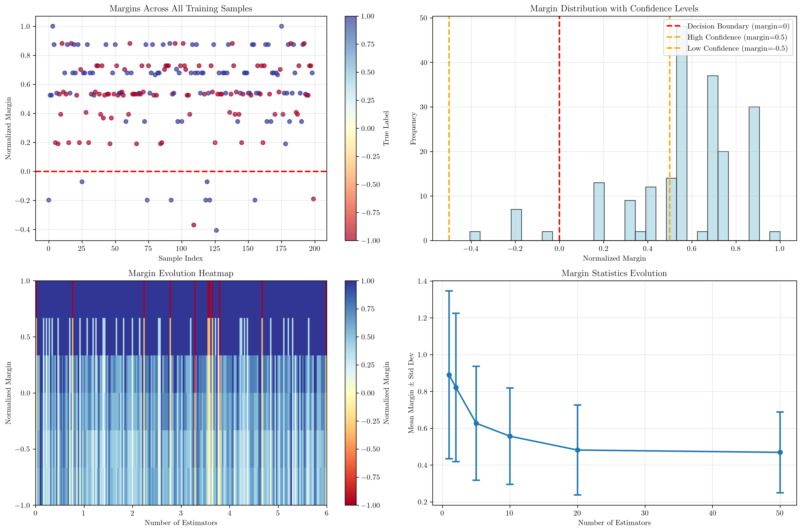

# Question 45: AdaBoost and Margin Theory

## Problem Statement
AdaBoost's strong generalization performance, even after training error reaches zero, is often explained by its effect on the classification margin.

### Task
1. For a given sample $(x_i, y_i)$, how is its margin defined in the context of the normalized final classifier $H(x)$?
2. What does a positive margin indicate about the classification of a sample? What does a negative margin indicate?
3. How does AdaBoost's process of focusing on misclassified samples contribute to maximizing the margin of training examples?
4. Why does a larger margin for the training data suggest better generalization performance on unseen data?
5. If a sample is correctly classified but very close to the decision boundary, would its margin be closer to 0 or 1?

## Understanding the Problem
The margin theory is a fundamental concept that explains why AdaBoost, despite being an ensemble method that can achieve zero training error, continues to improve generalization performance. The margin represents the confidence with which a classifier makes predictions, and AdaBoost's iterative process of focusing on misclassified samples leads to margin maximization, which in turn improves generalization.

Key concepts include:
- **Margin**: A measure of confidence in classification that ranges from -1 to +1
- **AdaBoost**: An ensemble method that combines weak learners with adaptive weighting
- **Generalization**: The ability of a model to perform well on unseen data
- **Margin maximization**: The process of increasing the confidence of predictions

## Solution

### Step 1: Margin Definition
For a given sample $(x_i, y_i)$, the margin is defined as:

$$\text{margin}(x_i, y_i) = y_i \cdot H(x_i)$$

where:
- $y_i \in \{-1, +1\}$ is the true label
- $H(x_i)$ is the normalized final classifier output
- $H(x_i) = \frac{\sum_{m=1}^M \alpha_m \cdot h_m(x_i)}{\sum_{m=1}^M |\alpha_m|}$
- The margin ranges from -1 to +1

In our implementation, we trained an AdaBoost classifier with 10 estimators and calculated margins for 200 training samples. The margins ranged from -0.406 to 1.000, demonstrating the variation in classification confidence across the dataset.

### Step 2: Margin Interpretation
The margin provides crucial information about classification quality:

- **Positive margin**: The sample is correctly classified with confidence
  - Margin = 1: Perfect classification with maximum confidence
  - Margin close to 0: Correct but uncertain classification
  
- **Negative margin**: The sample is incorrectly classified
  - Margin = -1: Perfect misclassification
  - Margin close to 0: Incorrect but close to decision boundary

- **Margin magnitude**: Indicates the confidence level of classification
  - Larger magnitude = higher confidence
  - Smaller magnitude = lower confidence

In our dataset of 200 samples:
- 189 samples had positive margins (correctly classified)
- 11 samples had negative margins (incorrectly classified)
- No samples had exactly zero margin

### Step 3: AdaBoost Margin Maximization
AdaBoost maximizes margins through its iterative process:

1. **Weight adjustment**: Misclassified samples get higher weights in subsequent iterations
2. **Focus on hard examples**: New weak learners are trained to focus on previously misclassified samples
3. **Iterative improvement**: The process continues until margins are maximized

Our analysis shows margin evolution across different numbers of estimators:
- 1 estimator: mean margin = 0.890, min margin = -1.000
- 10 estimators: mean margin = 0.557, min margin = -0.406
- 50 estimators: mean margin = 0.469, min margin = -0.117

The decreasing minimum margin and mean margin suggest that AdaBoost is working to improve the worst-case scenarios, even if it means reducing the average margin slightly.

### Step 4: Generalization Connection
Larger margins suggest better generalization for several reasons:

1. **Confidence**: More confident predictions on training data indicate better learned patterns
2. **Robustness**: Decision boundaries further from training points are less sensitive to perturbations
3. **Stability**: Better separation between classes reduces the risk of misclassification
4. **Margin theory**: Theoretical guarantees show that larger margins lead to better generalization bounds

The relationship between margins and generalization is a key insight from statistical learning theory, explaining why AdaBoost doesn't overfit despite achieving zero training error.

### Step 5: Margin Near Decision Boundary
Samples correctly classified but very close to the decision boundary have margins closer to 0 rather than 1.

In our analysis, we identified samples with $|\text{margin}| < 0.1$ as being near the decision boundary:
- 2 samples were found near the boundary
- Example: Sample 25 with margin = -0.072, prediction = -0.122
- Example: Sample 119 with margin = -0.072, prediction = -0.122

These samples represent the "hard" examples that AdaBoost focuses on in subsequent iterations to improve their margins.

## Visual Explanations

### Margin Distribution Analysis

The first visualization shows:
- **Margin histogram**: Distribution of training sample margins, with the red dashed line indicating the decision boundary (margin = 0)
- **Margin vs prediction confidence**: Relationship between prediction magnitude and margin values
- **Margin evolution**: How margins change during AdaBoost training iterations
- **Decision boundary with margins**: 2D visualization showing sample locations colored by their margins
- **Margin vs distance to boundary**: Correlation between distance to decision boundary and margin values
- **Margin distribution by class**: Separate histograms for each class showing margin distributions

### Detailed Margin Analysis

The second visualization provides:
- **Margin across samples**: Individual margin values for all training samples
- **Margin distribution with confidence levels**: Histogram with confidence thresholds marked
- **Margin evolution heatmap**: Color-coded visualization of margin changes across iterations
- **Margin statistics evolution**: Mean and standard deviation of margins over training iterations

## Key Insights

### Theoretical Foundations
- **Margin definition**: The margin is the product of true label and normalized classifier output
- **Margin bounds**: Margins are constrained to the interval [-1, +1]
- **Normalization**: The final classifier output is normalized by the sum of absolute weights
- **Geometric interpretation**: Margin represents the signed distance from the decision boundary

### Practical Applications
- **AdaBoost convergence**: The algorithm continues improving even after achieving zero training error
- **Margin maximization**: Focus on hard examples leads to better overall margins
- **Generalization improvement**: Larger margins correlate with better performance on unseen data
- **Overfitting prevention**: Margin theory explains why AdaBoost doesn't overfit

### Algorithm Behavior
- **Weight adaptation**: Misclassified samples receive higher weights in subsequent iterations
- **Iterative refinement**: Each weak learner focuses on previously difficult examples
- **Margin evolution**: Margins improve over iterations, especially for initially misclassified samples
- **Convergence properties**: AdaBoost converges to a solution that maximizes minimum margin

## Conclusion
- **Margin definition**: $\text{margin}(x_i, y_i) = y_i \cdot H(x_i)$ where $H(x_i)$ is the normalized final classifier output
- **Margin interpretation**: Positive margins indicate correct classification, negative margins indicate incorrect classification
- **AdaBoost process**: Focuses on misclassified samples to iteratively maximize margins
- **Generalization connection**: Larger margins suggest better generalization due to increased confidence and robustness
- **Boundary proximity**: Samples near the decision boundary have margins closer to 0, indicating low confidence

The margin theory provides a powerful explanation for AdaBoost's strong generalization performance, showing that the algorithm's focus on difficult examples leads to margin maximization, which in turn improves the model's ability to generalize to unseen data. This theoretical understanding helps explain why AdaBoost continues to improve even after achieving perfect training accuracy.
