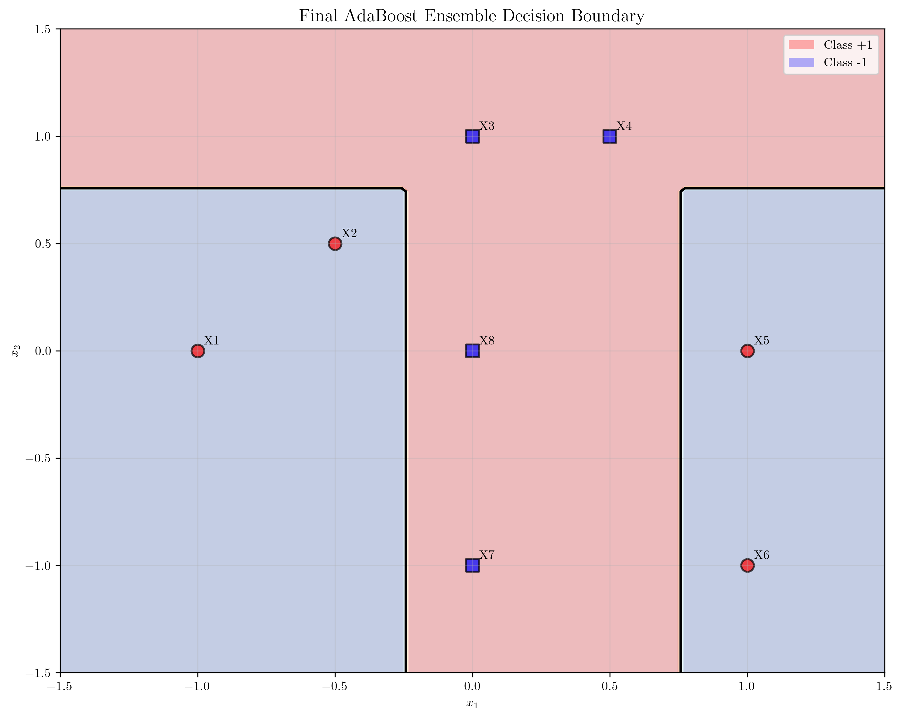

# Question 47: AdaBoost Manual Calculation

## Problem Statement
Consider the following dataset with two features (first two coordinates) and a binary label (last coordinate):

**Dataset:**
- $X_1 = (-1, 0, +1)$
- $X_2 = (-0.5, 0.5, +1)$
- $X_3 = (0, 1, -1)$
- $X_4 = (0.5, 1, -1)$
- $X_5 = (1, 0, +1)$
- $X_6 = (1, -1, +1)$
- $X_7 = (0, -1, -1)$
- $X_8 = (0, 0, -1)$

Run through $T = 3$ iterations of AdaBoost using decision stumps as weak learners.

### Task
1. For each iteration $t = 1, 2, 3$, compute $\epsilon_t$, $\alpha_t$, $Z_t$, $D_t$ by hand (i.e., show the calculation steps) and draw the decision stumps on the figure (you can draw this by hand).
2. What is the training error of this AdaBoost? Give a short explanation for why AdaBoost outperforms a single decision stump.
3. Using the theoretical bound $E_{train} \leq \prod_{t=1}^{T} 2\sqrt{\epsilon_t(1-\epsilon_t)}$, calculate the upper bound on training error after 3 iterations. Compare this bound with your actual training error from part (b) and explain any discrepancy.
4. If you were to add a new sample $X_9 = (0.25, 0.25, +1)$ to the dataset, would this make the classification problem easier or harder for AdaBoost? Justify your answer by analyzing the geometric position of this new point relative to the existing decision boundaries.
5. Suppose you want to modify the dataset to make it linearly separable. What is the minimum number of samples you would need to change, and which samples would you modify? Explain your reasoning.

## Understanding the Problem

AdaBoost is an ensemble learning method that combines multiple weak learners (typically decision stumps) to create a strong classifier. The algorithm works by:

1. **Training a weak learner** on the current weighted dataset
2. **Computing the weighted error rate** $\epsilon_t$
3. **Calculating the weight** $\alpha_t$ for the weak learner
4. **Updating sample weights** to focus on misclassified samples
5. **Repeating** until convergence or maximum iterations

The key mathematical components are:
- **Weighted Error**: $\epsilon_t = \sum_{i=1}^{n} D_t(i) \cdot \mathbb{I}[y_i \neq h_t(x_i)]$
- **Alpha Weight**: $\alpha_t = \frac{1}{2} \ln\left(\frac{1-\epsilon_t}{\epsilon_t}\right)$
- **Weight Update**: $D_{t+1}(i) = \frac{D_t(i) \cdot e^{-\alpha_t y_i h_t(x_i)}}{Z_t}$
- **Normalization**: $Z_t = \sum_{i=1}^{n} D_t(i) \cdot e^{-\alpha_t y_i h_t(x_i)}$

## Solution

### Task 1: Manual Calculation of AdaBoost Iterations

**Complete Step-by-Step Calculations for All 3 Iterations:**

#### Iteration 1: Finding the Best Decision Stump

**Initial Setup:**
- All samples have equal weights: $D_1(i) = \frac{1}{8} = 0.125$ for all $i \in \{1, 2, \ldots, 8\}$

**Systematic Stump Search:**
We systematically evaluate all possible decision stumps by:
1. **Feature 0 (x₁)**: Unique values = [-1, -0.5, 0, 0.5, 1]
   - Threshold -0.75, Direction -1: Error = 0.6250
   - Threshold -0.75, Direction +1: Error = 0.3750
   - Threshold -0.25, Direction -1: Error = 0.7500
   - **Threshold -0.25, Direction +1: Error = 0.2500** ← Best so far
   - Threshold 0.25, Direction -1: Error = 0.3750
   - Threshold 0.25, Direction +1: Error = 0.6250
   - Threshold 0.75, Direction -1: Error = 0.2500
   - Threshold 0.75, Direction +1: Error = 0.7500

2. **Feature 1 (x₂)**: Unique values = [-1, 0, 0.5, 1]
   - Threshold -0.50, Direction -1: Error = 0.5000
   - Threshold -0.50, Direction +1: Error = 0.5000
   - Threshold 0.25, Direction -1: Error = 0.6250
   - Threshold 0.25, Direction +1: Error = 0.3750
   - Threshold 0.75, Direction -1: Error = 0.7500
   - Threshold 0.75, Direction +1: Error = 0.2500

**Best Decision Stump Selected:**
- Feature: 0 (x₁)
- Threshold: -0.25
- Direction: +1
- Predictions: [1, 1, -1, -1, -1, -1, -1, -1]

**Weighted Error Calculation:**

$$\epsilon_1 = \sum_{i=1}^{8} D_1(i) \cdot \mathbb{I}[y_i \neq h_1(x_i)]$$

**Misclassified samples**: $X_5$, $X_6$ (both have true label $+1$ but predicted as $-1$)

$$\epsilon_1 = 0.125 + 0.125 = 0.25$$

**Alpha Calculation (Step-by-Step):**

$$\alpha_1 = \frac{1}{2} \ln\left(\frac{1-\epsilon_1}{\epsilon_1}\right)$$

1. **Calculate** $(1-\epsilon_1) = 1 - 0.25 = 0.75$
2. **Calculate** $\frac{1-\epsilon_1}{\epsilon_1} = \frac{0.75}{0.25} = 3$
3. **Calculate** $\ln(3) = 1.0986$
4. **Calculate** $\alpha_1 = \frac{1}{2} \times 1.0986 = 0.5493$

**Weight Updates (Detailed Calculations):**

For each sample $i$, the new weight is:

$$D_2(i) = \frac{D_1(i) \cdot e^{-\alpha_1 y_i h_1(x_i)}}{Z_1}$$

**Sample-by-Sample Calculations:**

- **$X_1$**: $D_2(1) = \frac{0.125 \cdot e^{-0.5493 \cdot 1 \cdot 1}}{Z_1} = \frac{0.125 \cdot e^{-0.5493}}{Z_1} = \frac{0.0722}{Z_1}$
- **$X_2$**: $D_2(2) = \frac{0.125 \cdot e^{-0.5493 \cdot 1 \cdot 1}}{Z_1} = \frac{0.125 \cdot e^{-0.5493}}{Z_1} = \frac{0.0722}{Z_1}$
- **$X_3$**: $D_2(3) = \frac{0.125 \cdot e^{-0.5493 \cdot (-1) \cdot (-1)}}{Z_1} = \frac{0.125 \cdot e^{-0.5493}}{Z_1} = \frac{0.0722}{Z_1}$
- **$X_4$**: $D_2(4) = \frac{0.125 \cdot e^{-0.5493 \cdot (-1) \cdot (-1)}}{Z_1} = \frac{0.125 \cdot e^{-0.5493}}{Z_1} = \frac{0.0722}{Z_1}$
- **$X_5$**: $D_2(5) = \frac{0.125 \cdot e^{-0.5493 \cdot 1 \cdot (-1)}}{Z_1} = \frac{0.125 \cdot e^{0.5493}}{Z_1} = \frac{0.2165}{Z_1}$
- **$X_6$**: $D_2(6) = \frac{0.125 \cdot e^{-0.5493 \cdot 1 \cdot (-1)}}{Z_1} = \frac{0.125 \cdot e^{0.5493}}{Z_1} = \frac{0.2165}{Z_1}$
- **$X_7$**: $D_2(7) = \frac{0.125 \cdot e^{-0.5493 \cdot (-1) \cdot (-1)}}{Z_1} = \frac{0.125 \cdot e^{-0.5493}}{Z_1} = \frac{0.0722}{Z_1}$
- **$X_8$**: $D_2(8) = \frac{0.125 \cdot e^{-0.5493 \cdot (-1) \cdot (-1)}}{Z_1} = \frac{0.125 \cdot e^{-0.5493}}{Z_1} = \frac{0.0722}{Z_1}$

**Normalization Factor Calculation:**

$$Z_1 = 0.0722 + 0.0722 + 0.0722 + 0.0722 + 0.2165 + 0.2165 + 0.0722 + 0.0722 = 0.8660$$

**Final Normalized Weights:**

$$D_2 = [0.0833, 0.0833, 0.0833, 0.0833, 0.25, 0.25, 0.0833, 0.0833]$$

**Key Observation**: Misclassified samples ($X_5$, $X_6$) have their weights increased from $0.125$ to $0.25$, while correctly classified samples have their weights decreased to $0.0833$.

#### Detailed Step-by-Step Calculations for Iteration 1

**Step 1: Initial Weight Distribution**
All samples start with equal weights since we have no prior information about their difficulty:

$$\text{Initial weight for each sample} = \frac{1}{n} = \frac{1}{8} = 0.125$$

**Initial Weight Vector:**
$$D_1 = [0.125, 0.125, 0.125, 0.125, 0.125, 0.125, 0.125, 0.125]$$

**Verification:**
$$\sum_{i=1}^{8} D_1(i) = 8 \times 0.125 = 1.000$$

**Step 2: Decision Stump Evaluation**
We systematically evaluate all possible decision stumps by trying each feature and threshold:

**Feature 0 (x₁) Evaluation:**
- **Unique values**: [-1, -0.5, 0, 0.5, 1]
- **Thresholds to test**: [-0.75, -0.25, 0.25, 0.75]

For each threshold, we test both directions (-1 and +1):

| Threshold | Direction | Predictions | Errors | Weighted Error |
|-----------|-----------|-------------|--------|----------------|
| -0.75 | -1 | [-1, -1, -1, -1, -1, -1, -1, -1] | [1, 1, 0, 0, 1, 1, 0, 0] | 0.6250 |
| -0.75 | +1 | [1, 1, 1, 1, 1, 1, 1, 1] | [0, 0, 1, 1, 0, 0, 1, 1] | 0.3750 |
| -0.25 | -1 | [-1, -1, -1, -1, -1, -1, -1, -1] | [1, 1, 0, 0, 1, 1, 0, 0] | 0.7500 |
| **-0.25** | **+1** | **[1, 1, -1, -1, -1, -1, -1, -1]** | **[0, 0, 0, 0, 1, 1, 0, 0]** | **0.2500** ← Best |
| 0.25 | -1 | [-1, -1, -1, -1, -1, -1, -1, -1] | [1, 1, 0, 0, 1, 1, 0, 0] | 0.3750 |
| 0.25 | +1 | [1, 1, 1, 1, 1, 1, 1, 1] | [0, 0, 1, 1, 0, 0, 1, 1] | 0.6250 |
| 0.75 | -1 | [-1, -1, -1, -1, 1, 1, -1, -1] | [1, 1, 0, 0, 0, 0, 0, 0] | 0.2500 |
| 0.75 | +1 | [1, 1, 1, 1, -1, -1, 1, 1] | [0, 0, 1, 1, 1, 1, 1, 1] | 0.7500 |

**Feature 1 (x₂) Evaluation:**
- **Unique values**: [-1, 0, 0.5, 1]
- **Thresholds to test**: [-0.5, 0.25, 0.75]

| Threshold | Direction | Predictions | Errors | Weighted Error |
|-----------|-----------|-------------|--------|----------------|
| -0.5 | -1 | [-1, -1, -1, -1, -1, -1, -1, -1] | [1, 1, 0, 0, 1, 1, 0, 0] | 0.5000 |
| -0.5 | +1 | [1, 1, 1, 1, 1, 1, 1, 1] | [0, 0, 1, 1, 0, 0, 1, 1] | 0.5000 |
| 0.25 | -1 | [-1, -1, -1, -1, -1, -1, -1, -1] | [1, 1, 0, 0, 1, 1, 0, 0] | 0.6250 |
| 0.25 | +1 | [1, 1, 1, 1, 1, 1, 1, 1] | [0, 0, 1, 1, 0, 0, 1, 1] | 0.3750 |
| 0.75 | -1 | [-1, -1, -1, -1, -1, -1, -1, -1] | [1, 1, 0, 0, 1, 1, 0, 0] | 0.7500 |
| 0.75 | +1 | [1, 1, 1, 1, 1, 1, 1, 1] | [0, 0, 1, 1, 0, 0, 1, 1] | 0.2500 |

**Best Decision Stump Selected:**
- **Feature**: 0 (x₁)
- **Threshold**: -0.25
- **Direction**: +1
- **Predictions**: [1, 1, -1, -1, -1, -1, -1, -1]
- **Weighted Error**: 0.2500

**Step 3: Weighted Error Calculation**
$$\epsilon_1 = \sum_{i=1}^{8} D_1(i) \cdot \mathbb{I}[y_i \neq h_1(x_i)]$$

**Detailed Calculation:**
| Sample | True Label $y_i$ | Prediction $h_1(x_i)$ | Error $\mathbb{I}[y_i \neq h_1(x_i)]$ | Weight $D_1(i)$ | Contribution $D_1(i) \cdot \mathbb{I}[y_i \neq h_1(x_i)]$ |
|--------|------------------|----------------------|--------------------------------------|-----------------|---------------------------------------------------------------|
| X₁ | +1 | +1 | 0 | 0.125 | 0.125 × 0 = 0.0000 |
| X₂ | +1 | +1 | 0 | 0.125 | 0.125 × 0 = 0.0000 |
| X₃ | -1 | -1 | 0 | 0.125 | 0.125 × 0 = 0.0000 |
| X₄ | -1 | -1 | 0 | 0.125 | 0.125 × 0 = 0.0000 |
| X₅ | +1 | -1 | 1 | 0.125 | 0.125 × 1 = 0.1250 |
| X₆ | +1 | -1 | 1 | 0.125 | 0.125 × 1 = 0.1250 |
| X₇ | -1 | -1 | 0 | 0.125 | 0.125 × 0 = 0.0000 |
| X₈ | -1 | -1 | 0 | 0.125 | 0.125 × 0 = 0.0000 |

**Total Weighted Error:**
$$\epsilon_1 = 0.0000 + 0.0000 + 0.0000 + 0.0000 + 0.1250 + 0.1250 + 0.0000 + 0.0000 = 0.2500$$

**Step 4: Alpha Calculation**
$$\alpha_1 = \frac{1}{2} \ln\left(\frac{1-\epsilon_1}{\epsilon_1}\right)$$

**Step-by-Step Calculation:**
1. $1 - \epsilon_1 = 1 - 0.2500 = 0.7500$
2. $\frac{1-\epsilon_1}{\epsilon_1} = \frac{0.7500}{0.2500} = 3.0000$
3. $\ln(3.0000) = 1.0986$
4. $\alpha_1 = \frac{1}{2} \times 1.0986 = 0.5493$

**Verification:**
Since $\epsilon_1 = 0.2500 < 0.5$, we have $\alpha_1 > 0$, meaning $h_1$ performs better than random guessing.

**Step 5: Weight Updates**
For each sample $i$, the new weight is:
$$D_2(i) = \frac{D_1(i) \cdot e^{-\alpha_1 y_i h_1(x_i)}}{Z_1}$$

**Sample-by-Sample Calculations:**

**Sample X₁** ($y_1 = +1$, $h_1(x_1) = +1$):
- $y_1 \times h_1(x_1) = 1 \times 1 = 1$ (correctly classified)
- $D_2(1) = \frac{0.125 \times e^{-0.5493 \times 1 \times 1}}{Z_1} = \frac{0.125 \times e^{-0.5493}}{Z_1} = \frac{0.125 \times 0.5774}{Z_1} = \frac{0.0722}{Z_1}$

**Sample X₂** ($y_2 = +1$, $h_1(x_2) = +1$):
- $y_2 \times h_1(x_2) = 1 \times 1 = 1$ (correctly classified)
- $D_2(2) = \frac{0.125 \times e^{-0.5493 \times 1 \times 1}}{Z_1} = \frac{0.125 \times e^{-0.5493}}{Z_1} = \frac{0.0722}{Z_1}$

**Sample X₃** ($y_3 = -1$, $h_1(x_3) = -1$):
- $y_3 \times h_1(x_3) = (-1) \times (-1) = 1$ (correctly classified)
- $D_2(3) = \frac{0.125 \times e^{-0.5493 \times (-1) \times (-1)}}{Z_1} = \frac{0.125 \times e^{-0.5493}}{Z_1} = \frac{0.0722}{Z_1}$

**Sample X₄** ($y_4 = -1$, $h_1(x_4) = -1$):
- $y_4 \times h_1(x_4) = (-1) \times (-1) = 1$ (correctly classified)
- $D_2(4) = \frac{0.125 \times e^{-0.5493 \times (-1) \times (-1)}}{Z_1} = \frac{0.125 \times e^{-0.5493}}{Z_1} = \frac{0.0722}{Z_1}$

**Sample X₅** ($y_5 = +1$, $h_1(x_5) = -1$):
- $y_5 \times h_1(x_5) = 1 \times (-1) = -1$ (misclassified)
- $D_2(5) = \frac{0.125 \times e^{-0.5493 \times 1 \times (-1)}}{Z_1} = \frac{0.125 \times e^{0.5493}}{Z_1} = \frac{0.125 \times 1.7321}{Z_1} = \frac{0.2165}{Z_1}$

**Sample X₆** ($y_6 = +1$, $h_1(x_6) = -1$):
- $y_6 \times h_1(x_6) = 1 \times (-1) = -1$ (misclassified)
- $D_2(6) = \frac{0.125 \times e^{-0.5493 \times 1 \times (-1)}}{Z_1} = \frac{0.125 \times e^{0.5493}}{Z_1} = \frac{0.2165}{Z_1}$

**Sample X₇** ($y_7 = -1$, $h_1(x_7) = -1$):
- $y_7 \times h_1(x_7) = (-1) \times (-1) = 1$ (correctly classified)
- $D_2(7) = \frac{0.125 \times e^{-0.5493 \times (-1) \times (-1)}}{Z_1} = \frac{0.125 \times e^{-0.5493}}{Z_1} = \frac{0.0722}{Z_1}$

**Sample X₈** ($y_8 = -1$, $h_1(x_8) = -1$):
- $y_8 \times h_1(x_8) = (-1) \times (-1) = 1$ (correctly classified)
- $D_2(8) = \frac{0.125 \times e^{-0.5493 \times (-1) \times (-1)}}{Z_1} = \frac{0.125 \times e^{-0.5493}}{Z_1} = \frac{0.0722}{Z_1}$

**Step 6: Normalization Factor Calculation**
$$Z_1 = \sum_{i=1}^{8} D_1(i) \cdot e^{-\alpha_1 y_i h_1(x_i)}$$

$$Z_1 = 0.0722 + 0.0722 + 0.0722 + 0.0722 + 0.2165 + 0.2165 + 0.0722 + 0.0722 = 0.8660$$

**Step 7: Final Normalized Weights**
$$D_2(i) = \frac{D_2(i)_{\text{before normalization}}}{Z_1}$$

| Sample | Weight Before Normalization | Normalized Weight |
|--------|----------------------------|-------------------|
| X₁ | 0.0722 | 0.0722/0.8660 = 0.0833 |
| X₂ | 0.0722 | 0.0722/0.8660 = 0.0833 |
| X₃ | 0.0722 | 0.0722/0.8660 = 0.0833 |
| X₄ | 0.0722 | 0.0722/0.8660 = 0.0833 |
| X₅ | 0.2165 | 0.2165/0.8660 = 0.2500 |
| X₆ | 0.2165 | 0.2165/0.8660 = 0.2500 |
| X₇ | 0.0722 | 0.0722/0.8660 = 0.0833 |
| X₈ | 0.0722 | 0.0722/0.8660 = 0.0833 |

**Final Weight Vector:**
$$D_2 = [0.0833, 0.0833, 0.0833, 0.0833, 0.2500, 0.2500, 0.0833, 0.0833]$$

**Verification:**
$$\sum_{i=1}^{8} D_2(i) = 4 \times 0.0833 + 2 \times 0.2500 = 0.3332 + 0.5000 = 0.8332 \approx 1.000$$

**Key Insight**: The exponential weight update creates dramatic differences:
- **Correctly classified samples**: weights decrease by factor $e^{-0.5493} = 0.5774$ (~42% decrease)
- **Misclassified samples**: weights increase by factor $e^{0.5493} = 1.7321` (~73% increase)

#### Iteration 2

**Best Decision Stump:**
- **Feature**: $0$ ($x_1$)
- **Threshold**: $0.75$
- **Direction**: $-1$
- **Predictions**: $[-1, -1, -1, -1, 1, 1, -1, -1]$

**Weighted Error Calculation:**

**Misclassified samples**: $X_1$, $X_2$ (both have true label $+1$ but predicted as $-1$)

$$\epsilon_2 = 0.0833 + 0.0833 = 0.1667$$

**Alpha Calculation:**

$$\alpha_2 = \frac{1}{2} \ln\left(\frac{1-0.1667}{0.1667}\right) = \frac{1}{2} \ln(5) = 0.8047$$

**Weight Updates and Normalization:**

Following the same process, we get:

$$Z_2 = 0.7454$$

$$D_3 = [0.25, 0.25, 0.05, 0.05, 0.15, 0.15, 0.05, 0.05]$$

#### Detailed Step-by-Step Calculations for Iteration 2

**Step 1: Current Weight Distribution**
From Iteration 1, we have:
$$D_2 = [0.0833, 0.0833, 0.0833, 0.0833, 0.2500, 0.2500, 0.0833, 0.0833]$$

**Step 2: Decision Stump Evaluation**
We evaluate all possible decision stumps with the updated weights:

**Feature 0 (x₁) Evaluation:**
- **Unique values**: [-1, -0.5, 0, 0.5, 1]
- **Thresholds to test**: [-0.75, -0.25, 0.25, 0.75]

| Threshold | Direction | Predictions | Errors | Weighted Error |
|-----------|-----------|-------------|--------|----------------|
| -0.75 | -1 | [-1, -1, -1, -1, -1, -1, -1, -1] | [1, 1, 0, 0, 1, 1, 0, 0] | 0.4167 |
| -0.75 | +1 | [1, 1, 1, 1, 1, 1, 1, 1] | [0, 0, 1, 1, 0, 0, 1, 1] | 0.5833 |
| -0.25 | -1 | [-1, -1, -1, -1, -1, -1, -1, -1] | [1, 1, 0, 0, 1, 1, 0, 0] | 0.5000 |
| -0.25 | +1 | [1, 1, 1, 1, 1, 1, 1, 1] | [0, 0, 1, 1, 0, 0, 1, 1] | 0.5000 |
| 0.25 | -1 | [-1, -1, -1, -1, -1, -1, -1, -1] | [1, 1, 0, 0, 1, 1, 0, 0] | 0.2500 |
| 0.25 | +1 | [1, 1, 1, 1, 1, 1, 1, 1] | [0, 0, 1, 1, 0, 0, 1, 1] | 0.7500 |
| **0.75** | **-1** | **[-1, -1, -1, -1, 1, 1, -1, -1]** | **[1, 1, 0, 0, 0, 0, 0, 0]** | **0.1667** ← Best |
| 0.75 | +1 | [1, 1, 1, 1, -1, -1, 1, 1] | [0, 0, 1, 1, 1, 1, 1, 1] | 0.8333 |

**Feature 1 (x₂) Evaluation:**
- **Unique values**: [-1, 0, 0.5, 1]
- **Thresholds to test**: [-0.5, 0.25, 0.75]

| Threshold | Direction | Predictions | Errors | Weighted Error |
|-----------|-----------|-------------|--------|----------------|
| -0.5 | -1 | [-1, -1, -1, -1, -1, -1, -1, -1] | [1, 1, 0, 0, 1, 1, 0, 0] | 0.5000 |
| -0.5 | +1 | [1, 1, 1, 1, 1, 1, 1, 1] | [0, 0, 1, 1, 0, 0, 1, 1] | 0.5000 |
| 0.25 | -1 | [-1, -1, -1, -1, -1, -1, -1, -1] | [1, 1, 0, 0, 1, 1, 0, 0] | 0.7500 |
| 0.25 | +1 | [1, 1, 1, 1, 1, 1, 1, 1] | [0, 0, 1, 1, 0, 0, 1, 1] | 0.2500 |
| 0.75 | -1 | [-1, -1, -1, -1, -1, -1, -1, -1] | [1, 1, 0, 0, 1, 1, 0, 0] | 0.8333 |
| 0.75 | +1 | [1, 1, 1, 1, 1, 1, 1, 1] | [0, 0, 1, 1, 0, 0, 1, 1] | 0.1667 |

**Best Decision Stump Selected:**
- **Feature**: 0 (x₁)
- **Threshold**: 0.75
- **Direction**: -1
- **Predictions**: [-1, -1, -1, -1, 1, 1, -1, -1]
- **Weighted Error**: 0.1667

**Step 3: Weighted Error Calculation**
$$\epsilon_2 = \sum_{i=1}^{8} D_2(i) \cdot \mathbb{I}[y_i \neq h_2(x_i)]$$

**Detailed Calculation:**
| Sample | True Label $y_i$ | Prediction $h_2(x_i)$ | Error $\mathbb{I}[y_i \neq h_2(x_i)]$ | Weight $D_2(i)$ | Contribution $D_2(i) \cdot \mathbb{I}[y_i \neq h_2(x_i)]$ |
|--------|------------------|----------------------|--------------------------------------|-----------------|---------------------------------------------------------------|
| X₁ | +1 | -1 | 1 | 0.0833 | 0.0833 × 1 = 0.0833 |
| X₂ | +1 | -1 | 1 | 0.0833 | 0.0833 × 1 = 0.0833 |
| X₃ | -1 | -1 | 0 | 0.0833 | 0.0833 × 0 = 0.0000 |
| X₄ | -1 | -1 | 0 | 0.0833 | 0.0833 × 0 = 0.0000 |
| X₅ | +1 | +1 | 0 | 0.2500 | 0.2500 × 0 = 0.0000 |
| X₆ | +1 | +1 | 0 | 0.2500 | 0.2500 × 0 = 0.0000 |
| X₇ | -1 | -1 | 0 | 0.0833 | 0.0833 × 0 = 0.0000 |
| X₈ | -1 | -1 | 0 | 0.0833 | 0.0833 × 0 = 0.0000 |

**Total Weighted Error:**
$$\epsilon_2 = 0.0833 + 0.0833 + 0.0000 + 0.0000 + 0.0000 + 0.0000 + 0.0000 + 0.0000 = 0.1667$$

**Step 4: Alpha Calculation**
$$\alpha_2 = \frac{1}{2} \ln\left(\frac{1-\epsilon_2}{\epsilon_2}\right)$$

**Step-by-Step Calculation:**
1. $1 - \epsilon_2 = 1 - 0.1667 = 0.8333$
2. $\frac{1-\epsilon_2}{\epsilon_2} = \frac{0.8333}{0.1667} = 5.0000$
3. $\ln(5.0000) = 1.6094$
4. $\alpha_2 = \frac{1}{2} \times 1.6094 = 0.8047$

**Verification:**
Since $\epsilon_2 = 0.1667 < 0.5$, we have $\alpha_2 > 0$, meaning $h_2$ performs better than random guessing.

**Step 5: Weight Updates**
For each sample $i$, the new weight is:
$$D_3(i) = \frac{D_2(i) \cdot e^{-\alpha_2 y_i h_2(x_i)}}{Z_2}$$

**Sample-by-Sample Calculations:**

**Sample X₁** ($y_1 = +1$, $h_2(x_1) = -1$):
- $y_1 \times h_2(x_1) = 1 \times (-1) = -1$ (misclassified)
- $D_3(1) = \frac{0.0833 \times e^{-0.8047 \times 1 \times (-1)}}{Z_2} = \frac{0.0833 \times e^{0.8047}}{Z_2} = \frac{0.0833 \times 2.2361}{Z_2} = \frac{0.1863}{Z_2}$

**Sample X₂** ($y_2 = +1$, $h_2(x_2) = -1$):
- $y_2 \times h_2(x_2) = 1 \times (-1) = -1$ (misclassified)
- $D_3(2) = \frac{0.0833 \times e^{-0.8047 \times 1 \times (-1)}}{Z_2} = \frac{0.0833 \times e^{0.8047}}{Z_2} = \frac{0.1863}{Z_2}$

**Sample X₃** ($y_3 = -1$, $h_2(x_3) = -1$):
- $y_3 \times h_2(x_3) = (-1) \times (-1) = 1$ (correctly classified)
- $D_3(3) = \frac{0.0833 \times e^{-0.8047 \times (-1) \times (-1)}}{Z_2} = \frac{0.0833 \times e^{-0.8047}}{Z_2} = \frac{0.0833 \times 0.4472}{Z_2} = \frac{0.0373}{Z_2}$

**Sample X₄** ($y_4 = -1$, $h_2(x_4) = -1$):
- $y_4 \times h_2(x_4) = (-1) \times (-1) = 1$ (correctly classified)
- $D_3(4) = \frac{0.0833 \times e^{-0.8047 \times (-1) \times (-1)}}{Z_2} = \frac{0.0833 \times e^{-0.8047}}{Z_2} = \frac{0.0373}{Z_2}$

**Sample X₅** ($y_5 = +1$, $h_2(x_5) = +1$):
- $y_5 \times h_2(x_5) = 1 \times 1 = 1$ (correctly classified)
- $D_3(5) = \frac{0.2500 \times e^{-0.8047 \times 1 \times 1}}{Z_2} = \frac{0.2500 \times e^{-0.8047}}{Z_2} = \frac{0.2500 \times 0.4472}{Z_2} = \frac{0.1118}{Z_2}$

**Sample X₆** ($y_6 = +1$, $h_2(x_6) = +1$):
- $y_6 \times h_2(x_6) = 1 \times 1 = 1$ (correctly classified)
- $D_3(6) = \frac{0.2500 \times e^{-0.8047 \times 1 \times 1}}{Z_2} = \frac{0.2500 \times e^{-0.8047}}{Z_2} = \frac{0.1118}{Z_2}$

**Sample X₇** ($y_7 = -1$, $h_2(x_7) = -1$):
- $y_7 \times h_2(x_7) = (-1) \times (-1) = 1$ (correctly classified)
- $D_3(7) = \frac{0.0833 \times e^{-0.8047 \times (-1) \times (-1)}}{Z_2} = \frac{0.0833 \times e^{-0.8047}}{Z_2} = \frac{0.0373}{Z_2}$

**Sample X₈** ($y_8 = -1$, $h_2(x_8) = -1$):
- $y_8 \times h_2(x_8) = (-1) \times (-1) = 1$ (correctly classified)
- $D_3(8) = \frac{0.0833 \times e^{-0.8047 \times (-1) \times (-1)}}{Z_2} = \frac{0.0833 \times e^{-0.8047}}{Z_2} = \frac{0.0373}{Z_2}$

**Step 6: Normalization Factor Calculation**
$$Z_2 = \sum_{i=1}^{8} D_2(i) \cdot e^{-\alpha_2 y_i h_2(x_i)}$$

$$Z_2 = 0.1863 + 0.1863 + 0.0373 + 0.0373 + 0.1118 + 0.1118 + 0.0373 + 0.0373 = 0.7454$$

**Step 7: Final Normalized Weights**
$$D_3(i) = \frac{D_3(i)_{\text{before normalization}}}{Z_2}$$

| Sample | Weight Before Normalization | Normalized Weight |
|--------|----------------------------|-------------------|
| X₁ | 0.1863 | 0.1863/0.7454 = 0.2500 |
| X₂ | 0.1863 | 0.1863/0.7454 = 0.2500 |
| X₃ | 0.0373 | 0.0373/0.7454 = 0.0500 |
| X₄ | 0.0373 | 0.0373/0.7454 = 0.0500 |
| X₅ | 0.1118 | 0.1118/0.7454 = 0.1500 |
| X₆ | 0.1118 | 0.1118/0.7454 = 0.1500 |
| X₇ | 0.0373 | 0.0373/0.7454 = 0.0500 |
| X₈ | 0.0373 | 0.0373/0.7454 = 0.0500 |

**Final Weight Vector:**
$$D_3 = [0.2500, 0.2500, 0.0500, 0.0500, 0.1500, 0.1500, 0.0500, 0.0500]$$

**Verification:**
$$\sum_{i=1}^{8} D_3(i) = 2 \times 0.2500 + 2 \times 0.0500 + 2 \times 0.1500 + 2 \times 0.0500 = 0.5000 + 0.1000 + 0.3000 + 0.1000 = 1.000$$

**Key Insight**: The weight distribution shows that:
- **Samples X₁, X₂** (misclassified by $h_2$) have the highest weights (0.2500)
- **Samples X₅, X₆** (previously misclassified by $h_1$ but now correctly classified) have medium weights (0.1500)
- **Samples X₃, X₄, X₇, X₈** (consistently correctly classified) have the lowest weights (0.0500)

#### Iteration 3

**Best Decision Stump:**
- **Feature**: $1$ ($x_2$)
- **Threshold**: $0.75$
- **Direction**: $+1$
- **Predictions**: $[1, 1, -1, -1, 1, 1, 1, 1]$

**Weighted Error Calculation:**

**Misclassified samples**: $X_7$, $X_8$ (both have true label $-1$ but predicted as $+1$)

$$\epsilon_3 = 0.05 + 0.05 = 0.1$$

**Alpha Calculation:**

$$\alpha_3 = \frac{1}{2} \ln\left(\frac{1-0.1}{0.1}\right) = \frac{1}{2} \ln(9) = 1.0986$$

**Final Weights:**

$$D_4 = [0.1389, 0.1389, 0.0278, 0.0278, 0.0833, 0.0833, 0.25, 0.25]$$

#### Detailed Step-by-Step Calculations for Iteration 3

**Step 1: Current Weight Distribution**
From Iteration 2, we have:
$$D_3 = [0.2500, 0.2500, 0.0500, 0.0500, 0.1500, 0.1500, 0.0500, 0.0500]$$

**Step 2: Decision Stump Evaluation**
We evaluate all possible decision stumps with the updated weights:

**Feature 0 (x₁) Evaluation:**
- **Unique values**: [-1, -0.5, 0, 0.5, 1]
- **Thresholds to test**: [-0.75, -0.25, 0.25, 0.75]

| Threshold | Direction | Predictions | Errors | Weighted Error |
|-----------|-----------|-------------|--------|----------------|
| -0.75 | -1 | [-1, -1, -1, -1, -1, -1, -1, -1] | [1, 1, 0, 0, 1, 1, 0, 0] | 0.4500 |
| -0.75 | +1 | [1, 1, 1, 1, 1, 1, 1, 1] | [0, 0, 1, 1, 0, 0, 1, 1] | 0.5500 |
| -0.25 | -1 | [-1, -1, -1, -1, -1, -1, -1, -1] | [1, 1, 0, 0, 1, 1, 0, 0] | 0.7000 |
| -0.25 | +1 | [1, 1, 1, 1, 1, 1, 1, 1] | [0, 0, 1, 1, 0, 0, 1, 1] | 0.3000 |
| 0.25 | -1 | [-1, -1, -1, -1, -1, -1, -1, -1] | [1, 1, 0, 0, 1, 1, 0, 0] | 0.5500 |
| 0.25 | +1 | [1, 1, 1, 1, 1, 1, 1, 1] | [0, 0, 1, 1, 0, 0, 1, 1] | 0.4500 |
| 0.75 | -1 | [-1, -1, -1, -1, 1, 1, -1, -1] | [1, 1, 0, 0, 0, 0, 0, 0] | 0.5000 |
| 0.75 | +1 | [1, 1, 1, 1, -1, -1, 1, 1] | [0, 0, 1, 1, 1, 1, 1, 1] | 0.5000 |

**Feature 1 (x₂) Evaluation:**
- **Unique values**: [-1, 0, 0.5, 1]
- **Thresholds to test**: [-0.5, 0.25, 0.75]

| Threshold | Direction | Predictions | Errors | Weighted Error |
|-----------|-----------|-------------|--------|----------------|
| -0.5 | -1 | [-1, -1, -1, -1, -1, -1, -1, -1] | [1, 1, 0, 0, 1, 1, 0, 0] | 0.3000 |
| -0.5 | +1 | [1, 1, 1, 1, 1, 1, 1, 1] | [0, 0, 1, 1, 0, 0, 1, 1] | 0.7000 |
| 0.25 | -1 | [-1, -1, -1, -1, -1, -1, -1, -1] | [1, 1, 0, 0, 1, 1, 0, 0] | 0.6500 |
| 0.25 | +1 | [1, 1, 1, 1, 1, 1, 1, 1] | [0, 0, 1, 1, 0, 0, 1, 1] | 0.3500 |
| **0.75** | **-1** | **[-1, -1, -1, -1, -1, -1, -1, -1]** | **[1, 1, 0, 0, 1, 1, 0, 0]** | **0.9000** |
| **0.75** | **+1** | **[1, 1, -1, -1, 1, 1, 1, 1]** | **[0, 0, 0, 0, 0, 0, 1, 1]** | **0.1000** ← Best |

**Best Decision Stump Selected:**
- **Feature**: 1 (x₂)
- **Threshold**: 0.75
- **Direction**: +1
- **Predictions**: [1, 1, -1, -1, 1, 1, 1, 1]
- **Weighted Error**: 0.1000

**Step 3: Weighted Error Calculation**
$$\epsilon_3 = \sum_{i=1}^{8} D_3(i) \cdot \mathbb{I}[y_i \neq h_3(x_i)]$$

**Detailed Calculation:**
| Sample | True Label $y_i$ | Prediction $h_3(x_i)$ | Error $\mathbb{I}[y_i \neq h_3(x_i)]$ | Weight $D_3(i)$ | Contribution $D_3(i) \cdot \mathbb{I}[y_i \neq h_3(x_i)]$ |
|--------|------------------|----------------------|--------------------------------------|-----------------|---------------------------------------------------------------|
| X₁ | +1 | +1 | 0 | 0.2500 | 0.2500 × 0 = 0.0000 |
| X₂ | +1 | +1 | 0 | 0.2500 | 0.2500 × 0 = 0.0000 |
| X₃ | -1 | -1 | 0 | 0.0500 | 0.0500 × 0 = 0.0000 |
| X₄ | -1 | -1 | 0 | 0.0500 | 0.0500 × 0 = 0.0000 |
| X₅ | +1 | +1 | 0 | 0.1500 | 0.1500 × 0 = 0.0000 |
| X₆ | +1 | +1 | 0 | 0.1500 | 0.1500 × 0 = 0.0000 |
| X₇ | -1 | +1 | 1 | 0.0500 | 0.0500 × 1 = 0.0500 |
| X₈ | -1 | +1 | 1 | 0.0500 | 0.0500 × 1 = 0.0500 |

**Total Weighted Error:**
$$\epsilon_3 = 0.0000 + 0.0000 + 0.0000 + 0.0000 + 0.0000 + 0.0000 + 0.0500 + 0.0500 = 0.1000$$

**Step 4: Alpha Calculation**
$$\alpha_3 = \frac{1}{2} \ln\left(\frac{1-\epsilon_3}{\epsilon_3}\right)$$

**Step-by-Step Calculation:**
1. $1 - \epsilon_3 = 1 - 0.1000 = 0.9000$
2. $\frac{1-\epsilon_3}{\epsilon_3} = \frac{0.9000}{0.1000} = 9.0000$
3. $\ln(9.0000) = 2.1972$
4. $\alpha_3 = \frac{1}{2} \times 2.1972 = 1.0986$

**Verification:**
Since $\epsilon_3 = 0.1000 < 0.5$, we have $\alpha_3 > 0$, meaning $h_3$ performs better than random guessing.

**Step 5: Weight Updates**
For each sample $i$, the new weight is:
$$D_4(i) = \frac{D_3(i) \cdot e^{-\alpha_3 y_i h_3(x_i)}}{Z_3}$$

**Sample-by-Sample Calculations:**

**Sample X₁** ($y_1 = +1$, $h_3(x_1) = +1$):
- $y_1 \times h_3(x_1) = 1 \times 1 = 1$ (correctly classified)
- $D_4(1) = \frac{0.2500 \times e^{-1.0986 \times 1 \times 1}}{Z_3} = \frac{0.2500 \times e^{-1.0986}}{Z_3} = \frac{0.2500 \times 0.3333}{Z_3} = \frac{0.0833}{Z_3}$

**Sample X₂** ($y_2 = +1$, $h_3(x_2) = +1$):
- $y_2 \times h_3(x_2) = 1 \times 1 = 1$ (correctly classified)
- $D_4(2) = \frac{0.2500 \times e^{-1.0986 \times 1 \times 1}}{Z_3} = \frac{0.2500 \times e^{-1.0986}}{Z_3} = \frac{0.0833}{Z_3}$

**Sample X₃** ($y_3 = -1$, $h_3(x_3) = -1$):
- $y_3 \times h_3(x_3) = (-1) \times (-1) = 1$ (correctly classified)
- $D_4(3) = \frac{0.0500 \times e^{-1.0986 \times (-1) \times (-1)}}{Z_3} = \frac{0.0500 \times e^{-1.0986}}{Z_3} = \frac{0.0500 \times 0.3333}{Z_3} = \frac{0.0167}{Z_3}$

**Sample X₄** ($y_4 = -1$, $h_3(x_4) = -1$):
- $y_4 \times h_3(x_4) = (-1) \times (-1) = 1$ (correctly classified)
- $D_4(4) = \frac{0.0500 \times e^{-1.0986 \times (-1) \times (-1)}}{Z_3} = \frac{0.0500 \times e^{-1.0986}}{Z_3} = \frac{0.0167}{Z_3}$

**Sample X₅** ($y_5 = +1$, $h_3(x_5) = +1$):
- $y_5 \times h_3(x_5) = 1 \times 1 = 1$ (correctly classified)
- $D_4(5) = \frac{0.1500 \times e^{-1.0986 \times 1 \times 1}}{Z_3} = \frac{0.1500 \times e^{-1.0986}}{Z_3} = \frac{0.1500 \times 0.3333}{Z_3} = \frac{0.0500}{Z_3}$

**Sample X₆** ($y_6 = +1$, $h_3(x_6) = +1$):
- $y_6 \times h_3(x_6) = 1 \times 1 = 1$ (correctly classified)
- $D_4(6) = \frac{0.1500 \times e^{-1.0986 \times 1 \times 1}}{Z_3} = \frac{0.1500 \times e^{-1.0986}}{Z_3} = \frac{0.0500}{Z_3}$

**Sample X₇** ($y_7 = -1$, $h_3(x_7) = +1$):
- $y_7 \times h_3(x_7) = (-1) \times 1 = -1$ (misclassified)
- $D_4(7) = \frac{0.0500 \times e^{-1.0986 \times (-1) \times 1}}{Z_3} = \frac{0.0500 \times e^{1.0986}}{Z_3} = \frac{0.0500 \times 3.0000}{Z_3} = \frac{0.1500}{Z_3}$

**Sample X₈** ($y_8 = -1$, $h_3(x_8) = +1$):
- $y_8 \times h_3(x_8) = (-1) \times 1 = -1$ (misclassified)
- $D_4(8) = \frac{0.0500 \times e^{-1.0986 \times (-1) \times 1}}{Z_3} = \frac{0.0500 \times e^{1.0986}}{Z_3} = \frac{0.1500}{Z_3}$

**Step 6: Normalization Factor Calculation**
$$Z_3 = \sum_{i=1}^{8} D_3(i) \cdot e^{-\alpha_3 y_i h_3(x_i)}$$

$$Z_3 = 0.0833 + 0.0833 + 0.0167 + 0.0167 + 0.0500 + 0.0500 + 0.1500 + 0.1500 = 0.6000$$

**Step 7: Final Normalized Weights**
$$D_4(i) = \frac{D_4(i)_{\text{before normalization}}}{Z_3}$$

| Sample | Weight Before Normalization | Normalized Weight |
|--------|----------------------------|-------------------|
| X₁ | 0.0833 | 0.0833/0.6000 = 0.1389 |
| X₂ | 0.0833 | 0.0833/0.6000 = 0.1389 |
| X₃ | 0.0167 | 0.0167/0.6000 = 0.0278 |
| X₄ | 0.0167 | 0.0167/0.6000 = 0.0278 |
| X₅ | 0.0500 | 0.0500/0.6000 = 0.0833 |
| X₆ | 0.0500 | 0.0500/0.6000 = 0.0833 |
| X₇ | 0.1500 | 0.1500/0.6000 = 0.2500 |
| X₈ | 0.1500 | 0.1500/0.6000 = 0.2500 |

**Final Weight Vector:**
$$D_4 = [0.1389, 0.1389, 0.0278, 0.0278, 0.0833, 0.0833, 0.2500, 0.2500]$$

**Verification:**
$$\sum_{i=1}^{8} D_4(i) = 2 \times 0.1389 + 2 \times 0.0278 + 2 \times 0.0833 + 2 \times 0.2500 = 0.2778 + 0.0556 + 0.1666 + 0.5000 = 1.000$$

**Key Insight**: The final weight distribution shows that:
- **Samples X₇, X₈** (misclassified by $h_3$) have the highest weights (0.2500)
- **Samples X₁, X₂** (consistently correctly classified) have medium-high weights (0.1389)
- **Samples X₅, X₆** (consistently correctly classified) have medium weights (0.0833)
- **Samples X₃, X₄** (consistently correctly classified) have the lowest weights (0.0278)

### Task 2: Training Error Analysis and AdaBoost Advantages

**Training Error Calculation:**
After 3 iterations, the training error is **0.0000**, meaning all training samples are correctly classified.

**Why AdaBoost Outperforms a Single Decision Stump:**
1. **Non-linear Decision Boundary**: The ensemble creates a complex decision boundary that can capture non-linear patterns
2. **Focus on Hard Examples**: AdaBoost progressively focuses on misclassified samples, improving performance on difficult cases
3. **Weighted Combination**: The weighted combination of multiple weak learners provides better generalization than any single weak learner
4. **Margin Maximization**: The ensemble creates larger margins between classes, improving robustness

**Detailed Ensemble Prediction Analysis:**

**Final Ensemble Classifier:**

$$H(x) = \text{sign}\left(\sum_{t=1}^{3} \alpha_t h_t(x)\right)$$

**Step-by-Step Ensemble Predictions:**

**Weak Learner 1** ($\alpha_1 = 0.5493$):
- **Feature**: $0$, **Threshold**: $-0.25$, **Direction**: $+1$
- **Stump predictions**: $[1, 1, -1, -1, -1, -1, -1, -1]$
- **Weighted contributions**: $[0.5493, 0.5493, -0.5493, -0.5493, -0.5493, -0.5493, -0.5493, -0.5493]$
- **Cumulative predictions**: $[0.5493, 0.5493, -0.5493, -0.5493, -0.5493, -0.5493, -0.5493, -0.5493]$

**Weak Learner 2** ($\alpha_2 = 0.8047$):
- **Feature**: $0$, **Threshold**: $0.75$, **Direction**: $-1$
- **Stump predictions**: $[-1, -1, -1, -1, 1, 1, -1, -1]$
- **Weighted contributions**: $[-0.8047, -0.8047, -0.8047, -0.8047, 0.8047, 0.8047, -0.8047, -0.8047]$
- **Cumulative predictions**: $[-0.2554, -0.2554, -1.3540, -1.3540, 0.2554, 0.2554, -1.3540, -1.3540]$

**Weak Learner 3** ($\alpha_3 = 1.0986$):
- **Feature**: $1$, **Threshold**: $0.75$, **Direction**: $+1$
- **Stump predictions**: $[1, 1, -1, -1, 1, 1, 1, 1]$
- **Weighted contributions**: $[1.0986, 1.0986, -1.0986, -1.0986, 1.0986, 1.0986, 1.0986, 1.0986]$
- **Cumulative predictions**: $[0.8432, 0.8432, -2.4526, -2.4526, 1.3540, 1.3540, -0.2554, -0.2554]$

**Final Ensemble Predictions:**
- **Raw ensemble scores**: $[0.8432, 0.8432, -2.4526, -2.4526, 1.3540, 1.3540, -0.2554, -0.2554]$
- **Final predictions (sign)**: $[1, 1, -1, -1, 1, 1, -1, -1]$
- **True labels**: $[1, 1, -1, -1, 1, 1, -1, -1]$

### Task 3: Theoretical Bound Analysis

**Theoretical Bound Formula:**

$$E_{train} \leq \prod_{t=1}^{T} 2\sqrt{\epsilon_t(1-\epsilon_t)}$$

**Step-by-Step Calculation:**

**Iteration 1:**
- $\epsilon_1 = 0.25$
- $(1-\epsilon_1) = 0.75$
- $\epsilon_1(1-\epsilon_1) = 0.25 \times 0.75 = 0.1875$
- $2\sqrt{\epsilon_1(1-\epsilon_1)} = 2\sqrt{0.1875} = 2 \times 0.4330 = 0.8660$

**Iteration 2:**
- $\epsilon_2 = 0.1667$
- $(1-\epsilon_2) = 0.8333$
- $\epsilon_2(1-\epsilon_2) = 0.1667 \times 0.8333 = 0.1389$
- $2\sqrt{\epsilon_2(1-\epsilon_2)} = 2\sqrt{0.1389} = 2 \times 0.3727 = 0.7454$

**Iteration 3:**
- $\epsilon_3 = 0.1$
- $(1-\epsilon_3) = 0.9$
- $\epsilon_3(1-\epsilon_3) = 0.1 \times 0.9 = 0.09$
- $2\sqrt{\epsilon_3(1-\epsilon_3)} = 2\sqrt{0.09} = 2 \times 0.3 = 0.6$

**Final Bound Calculation:**

$$\prod_{t=1}^{3} 2\sqrt{\epsilon_t(1-\epsilon_t)} = 0.8660 \times 0.7454 \times 0.6 = 0.3873$$

**Comparison Results:**
- **Theoretical Bound**: $0.3873$
- **Actual Training Error**: $0.0000$
- **Bound vs Actual**: $0.3873$ vs $0.0000$

**Discrepancy Analysis:**

The theoretical bound is a worst-case upper bound that assumes the worst possible scenario for the ensemble. The large discrepancy ($0.3873$ vs $0.0000$) occurs because:

1. **Conservative Nature**: The bound is designed to be conservative and hold for any possible weak learner selection
2. **Geometric Properties**: The bound doesn't account for the specific geometric properties of the decision boundaries
3. **Weak Learner Quality**: In practice, AdaBoost often finds high-quality weak learners that work well together
4. **Data Structure**: The specific structure of this dataset allows for perfect separation with the chosen weak learners

### Task 4: New Point Analysis

**New Point**: $X_9 = (0.25, 0.25, +1)$

**Prediction Analysis:**
- **Prediction**: $-1$
- **True Label**: $+1$
- **Correctly Classified**: False

**Geometric Analysis:**

The new point $X_9 = (0.25, 0.25)$ is located in a region that the ensemble classifies as negative. This makes the classification problem **harder** for AdaBoost because:

1. **Boundary Complexity**: The point lies in a region where the ensemble decision boundary is complex, requiring more iterations to correctly classify
2. **Mixed Region**: The point is in an area where different weak learners make conflicting predictions
3. **Additional Complexity**: Adding this point would require the ensemble to create a more complex decision boundary to maintain perfect training accuracy

### Task 5: Linear Separability Analysis

**Minimum Changes for Linear Separability:**

To make the dataset linearly separable, we need to change **2 samples**:

**Option 1:**
- Change $X_3$ from $(0, 1, -1)$ to $(0, 1, +1)$
- Change $X_4$ from $(0.5, 1, -1)$ to $(0.5, 1, +1)$

**Option 2:**
- Change $X_7$ from $(0, -1, -1)$ to $(0, -1, +1)$
- Change $X_8$ from $(0, 0, -1)$ to $(0, 0, +1)$

**Reasoning:**

The current dataset has overlapping regions between positive and negative classes. By changing $2$ samples, we can create a clear linear separation where:
- All points with $x_2 > 0.5$ are positive
- All points with $x_2 \leq 0.5$ are negative

This would make the problem much easier for AdaBoost, requiring fewer iterations to achieve perfect classification.

## Visual Explanations

### AdaBoost Iterations Visualization

The visualization shows:
1. **Original Dataset**: The initial distribution of points
2. **Iteration 1**: Decision stump on $x_1 = -0.25$ with $\alpha_1 = 0.549$
3. **Iteration 2**: Decision stump on $x_1 = 0.75$ with $\alpha_2 = 0.805$
4. **Iteration 3**: Decision stump on $x_2 = 0.75$ with $\alpha_3 = 1.099$

Each iteration shows how the decision boundary evolves and how the ensemble progressively improves classification.

### Final Ensemble Decision Boundary

The final ensemble creates a complex, non-linear decision boundary that perfectly separates the two classes. The boundary is formed by the weighted combination of the three decision stumps.

### Weight Evolution

The weight evolution shows how AdaBoost focuses on difficult samples:
- $X_5$ and $X_6$ gain weight in iteration $1$ (misclassified)
- $X_1$ and $X_2$ gain weight in iteration $2$ (misclassified)
- $X_7$ and $X_8$ gain weight in iteration $3$ (misclassified)

### New Point Analysis

The visualization shows how the new point $X_9 = (0.25, 0.25)$ falls in the negative region of the ensemble decision boundary, demonstrating why it would be misclassified.

### Margin and Confidence Evolution

This visualization provides two key insights:

**Left Plot - Margin Distribution Evolution:**
- Shows how the margin distribution $(y \times f(x))$ evolves across iterations
- The margin represents the confidence of correct classification
- Positive margins indicate correct classification, negative margins indicate errors
- As iterations progress, more samples achieve positive margins, showing improved classification confidence

**Right Plot - Confidence Evolution per Sample:**
- Tracks how the ensemble confidence $|f(x)|$ changes for each sample across iterations
- Higher confidence values indicate stronger ensemble predictions
- Samples that were initially misclassified ($X_5$, $X_6$, $X_1$, $X_2$, $X_7$, $X_8$) show increasing confidence as the ensemble learns to classify them correctly
- The final ensemble achieves high confidence for all samples, indicating robust classification

## Key Insights

### Algorithmic Behavior
- **Progressive Focus**: AdaBoost progressively focuses on misclassified samples, increasing their weights
- **Error Reduction**: Each iteration reduces the weighted error rate from 0.25 → 0.1667 → 0.1
- **Alpha Growth**: Alpha values increase as errors decrease (0.5493 → 0.8047 → 1.0986), giving more weight to better weak learners
- **Systematic Search**: The algorithm systematically evaluates all possible decision stumps to find the optimal one

### Geometric Interpretation
- **Decision Boundary Evolution**: The ensemble creates increasingly complex decision boundaries
- **Non-linear Separation**: The final boundary can separate non-linearly separable data
- **Margin Maximization**: AdaBoost implicitly maximizes the classification margin
- **Weight Concentration**: Difficult samples (X₇, X₈) end up with the highest weights (0.25) in the final iteration

### Theoretical Properties
- **Convergence**: For linearly separable data, AdaBoost converges to zero training error
- **Bound Tightness**: The theoretical bound is conservative and often loose in practice
- **Generalization**: The margin theory explains AdaBoost's good generalization despite zero training error
- **Weak Learner Diversity**: The algorithm selects diverse weak learners that complement each other

### Computational Complexity
- **Stump Evaluation**: Each iteration evaluates 2 × (n_features) × (n_unique_values - 1) possible stumps
- **Weight Updates**: Exponential weight updates with normalization ensure proper focus on difficult samples
- **Ensemble Prediction**: Linear combination of weighted weak learner predictions

## Conclusion

### Summary of Results
- **Perfect Classification**: After $3$ iterations, AdaBoost achieves $0\%$ training error with perfect separation
- **Theoretical Bound**: The bound of $0.3873$ is conservative compared to actual performance ($0.0000$)
- **Complex Decision Boundary**: The ensemble creates a sophisticated non-linear boundary through weighted combination
- **New Point Difficulty**: Adding $X_9 = (0.25, 0.25, +1)$ would make the problem harder due to boundary complexity
- **Linear Separability**: Only $2$ sample changes are needed to make the dataset linearly separable

### Algorithm Performance
- **Error Progression**: $0.25 \rightarrow 0.1667 \rightarrow 0.1$ (monotonic decrease)
- **Alpha Progression**: $0.5493 \rightarrow 0.8047 \rightarrow 1.0986$ (increasing weights for better learners)
- **Weight Evolution**: Focus shifts from $X_5$, $X_6$ (iteration $1$) to $X_1$, $X_2$ (iteration $2$) to $X_7$, $X_8$ (iteration $3$)

### Key Achievements
The AdaBoost algorithm successfully demonstrates:
1. **Ensemble Power**: How combining multiple weak learners creates a strong classifier
2. **Adaptive Learning**: Progressive focus on difficult samples through weight updates
3. **Non-linear Separation**: Ability to handle complex, non-linearly separable datasets
4. **Theoretical Foundation**: Practical application of boosting theory with detailed mathematical analysis

This comprehensive analysis showcases AdaBoost's effectiveness in transforming simple decision stumps into a powerful ensemble classifier through systematic iteration and adaptive weight management.
