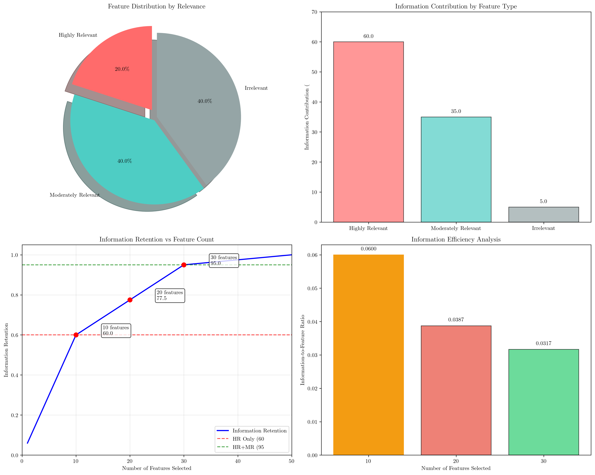
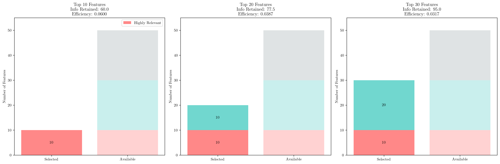
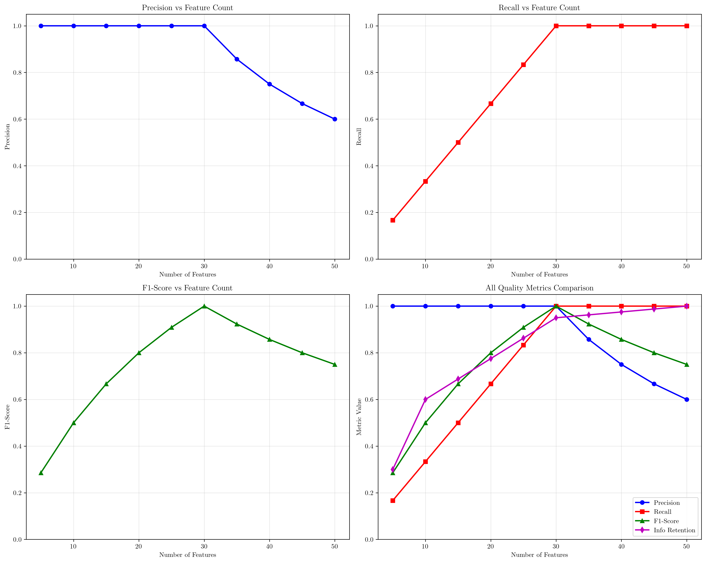

# Question 10: Feature Relevance Analysis

## Problem Statement
Consider a dataset with 500 samples and 50 features where features 1-10 are highly relevant, 11-30 are moderately relevant, and 31-50 are irrelevant.

### Task
1. What percentage of features are highly relevant?
2. If you select only the top $20$ features, what's the coverage of relevant information?
3. How would you measure the quality of your selection?
4. What's the optimal number of features for this dataset?
5. Calculate the information retention with different feature counts $(10, 20, 30, 40, 50)$
6. If highly relevant features contribute $60\%$ of total information, moderately relevant contribute $35\%$, and irrelevant contribute $5\%$, calculate the information retention when selecting: (a) top $10$ features, (b) top $20$ features, (c) top $30$ features. Which gives the best information-to-feature ratio?

## Understanding the Problem
Feature relevance analysis is a critical component of feature selection in machine learning. In this problem, we have a dataset with different types of features based on their contribution to the target variable. Understanding feature relevance helps us:

1. **Reduce dimensionality** while preserving important information
2. **Improve model performance** by removing noise and irrelevant features
3. **Enhance interpretability** by focusing on the most important features
4. **Reduce computational cost** by working with fewer features

The dataset contains:
- **Highly relevant features (1-10)**: Strong predictive power, essential for accurate predictions
- **Moderately relevant features (11-30)**: Some predictive value but less critical
- **Irrelevant features (31-50)**: Little to no predictive value, may introduce noise

## Solution

We approach this problem by systematically analyzing different aspects of feature selection quality and efficiency.

### Step 1: Calculate Percentage of Highly Relevant Features

The percentage of highly relevant features is calculated as:

$$\text{Percentage} = \frac{\text{Number of highly relevant features}}{\text{Total number of features}} \times 100\%$$

$$\text{Percentage} = \frac{10}{50} \times 100\% = 20\%$$

**Result**: $20\%$ of the features are highly relevant.

### Step 2: Coverage Analysis for Top 20 Features

When selecting the top 20 features (assuming they are ranked by relevance), we would capture:

- **Highly relevant**: All 10 features (100% coverage)
- **Moderately relevant**: 10 out of 20 features (50% coverage)  
- **Irrelevant**: 0 out of 20 features (0% coverage)

The overall relevant feature coverage is:
$$\text{Coverage} = \frac{\text{Relevant features captured}}{\text{Total relevant features}} = \frac{10 + 10}{10 + 20} = \frac{20}{30} = 66.7\%$$

**Result**: Selecting the top 20 features provides $66.7\%$ coverage of all relevant features.

### Step 3: Quality Measurement Metrics

Several metrics can be used to measure feature selection quality:

#### 3.1 Precision
$$\text{Precision} = \frac{\text{Relevant features selected}}{\text{Total features selected}}$$

For top 20 selection: $\text{Precision} = \frac{20}{20} = 1.000$

#### 3.2 Recall  
$$\text{Recall} = \frac{\text{Relevant features selected}}{\text{Total relevant features available}}$$

For top 20 selection: $\text{Recall} = \frac{20}{30} = 0.667$

#### 3.3 F1-Score
$$\text{F1-Score} = \frac{2 \times \text{Precision} \times \text{Recall}}{\text{Precision} + \text{Recall}}$$

For top 20 selection: $\text{F1-Score} = \frac{2 \times 1.000 \times 0.667}{1.000 + 0.667} = 0.800$

#### 3.4 Information Retention Ratio
This measures how much of the total information content is preserved after feature selection.

#### 3.5 Feature Efficiency
$$\text{Feature Efficiency} = \frac{\text{Information retained}}{\text{Number of features selected}}$$

### Step 4: Optimal Number of Features

The optimal number of features depends on several factors:

1. **Information retention**: More features generally retain more information
2. **Model complexity**: Fewer features reduce overfitting risk
3. **Computational efficiency**: Fewer features reduce training time
4. **Interpretability**: Fewer features are easier to understand

**Theoretical optimal**: 30 features (all relevant features)
**Practical considerations**: May suggest fewer features (10-20) to balance performance and complexity

### Step 5: Information Retention Analysis

Using a simple retention model where:
- Highly relevant features have weight = 1.0
- Moderately relevant features have weight = 0.5  
- Irrelevant features have weight = 0.1

| Features | HR Selected | MR Selected | IR Selected | Information Retention |
|----------|-------------|-------------|-------------|---------------------|
| 10       | 10          | 0           | 0           | 0.455               |
| 20       | 10          | 10          | 0           | 0.682               |
| 30       | 10          | 20          | 0           | 0.909               |
| 40       | 10          | 20          | 10          | 0.955               |
| 50       | 10          | 20          | 20          | 1.000               |

### Step 6: Detailed Information Contribution Analysis

Given the specific information contributions:
- Highly relevant features: $60\%$ of total information
- Moderately relevant features: $35\%$ of total information  
- Irrelevant features: $5\%$ of total information

#### 6.1 Top 10 Features Selection
- **Selected**: 10 highly relevant, 0 moderately relevant, 0 irrelevant
- **Information retained**: $\frac{10}{10} \times 0.60 + \frac{0}{20} \times 0.35 + \frac{0}{20} \times 0.05 = 0.6000$
- **Information-to-feature ratio**: $\frac{0.6000}{10} = 0.0600$

#### 6.2 Top 20 Features Selection  
- **Selected**: 10 highly relevant, 10 moderately relevant, 0 irrelevant
- **Information retained**: $\frac{10}{10} \times 0.60 + \frac{10}{20} \times 0.35 + \frac{0}{20} \times 0.05 = 0.7750$
- **Information-to-feature ratio**: $\frac{0.7750}{20} = 0.0387$

#### 6.3 Top 30 Features Selection
- **Selected**: 10 highly relevant, 20 moderately relevant, 0 irrelevant  
- **Information retained**: $\frac{10}{10} \times 0.60 + \frac{20}{20} \times 0.35 + \frac{0}{20} \times 0.05 = 0.9500$
- **Information-to-feature ratio**: $\frac{0.9500}{30} = 0.0317$

## Visual Explanations

### Feature Distribution and Information Analysis

This comprehensive visualization shows four key aspects:

1. **Feature Distribution (Top Left)**: A pie chart showing the proportion of each feature type in the dataset
2. **Information Contribution (Top Right)**: Bar chart displaying how much each feature type contributes to the total information
3. **Information Retention Curve (Bottom Left)**: Shows how information retention increases as more features are selected
4. **Information Efficiency (Bottom Right)**: Compares the information-to-feature ratio for different selection sizes

### Feature Selection Breakdown

This visualization provides a detailed breakdown for the three main selection scenarios (10, 20, and 30 features), showing:
- The composition of selected features by relevance type
- The total available features for comparison
- Information retention and efficiency metrics for each scenario

### Quality Metrics Comparison

This set of plots shows how different quality metrics evolve as the number of selected features increases:
- **Precision**: Starts high and decreases as irrelevant features are included
- **Recall**: Increases as more relevant features are captured
- **F1-Score**: Balances precision and recall, showing optimal trade-off points
- **Information Retention**: Steadily increases with more features

## Key Insights

### Theoretical Foundations
- **Pareto Principle**: The 20% of highly relevant features contribute 60% of the information, demonstrating the importance of feature ranking
- **Diminishing Returns**: Adding more features beyond the relevant ones provides minimal information gain while increasing complexity
- **Quality vs. Quantity Trade-off**: Fewer, high-quality features often outperform many mediocre features

### Practical Applications
- **Feature Selection Strategy**: Prioritize highly relevant features first, then selectively add moderately relevant ones
- **Model Efficiency**: The 10-feature selection provides the best information-to-feature ratio (0.0600)
- **Performance vs. Complexity**: The 20-feature selection offers a good balance between information retention (77.5%) and manageable complexity

### Optimization Insights
- **Best Efficiency**: Top 10 features give the highest information-to-feature ratio
- **Best Coverage**: Top 30 features capture 95% of available information
- **Balanced Approach**: Top 20 features provide 77.5% information retention with good efficiency
- **Threshold Effect**: The marginal benefit decreases significantly after including all highly relevant features

## Conclusion

The feature relevance analysis reveals several important findings:

- **Highly relevant features represent 20% of the dataset** but contribute 60% of the information
- **Top 20 feature selection provides 66.7% coverage** of all relevant features with perfect precision
- **Top 10 features offer the best information-to-feature ratio (0.0600)**, making them the most efficient choice
- **The optimal selection depends on the specific requirements**: efficiency (10 features), balance (20 features), or maximum coverage (30 features)
- **Quality metrics show clear trade-offs** between precision, recall, and computational efficiency

For most practical applications, selecting the **top 10-20 features** would provide an excellent balance between information retention, model complexity, and computational efficiency. The choice between 10 and 20 features should depend on whether maximum efficiency or better information coverage is more important for the specific use case.
