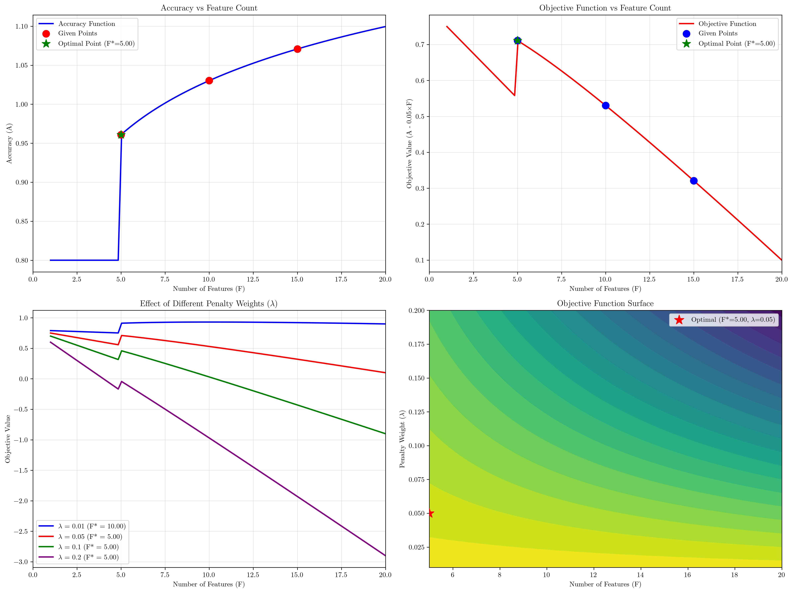
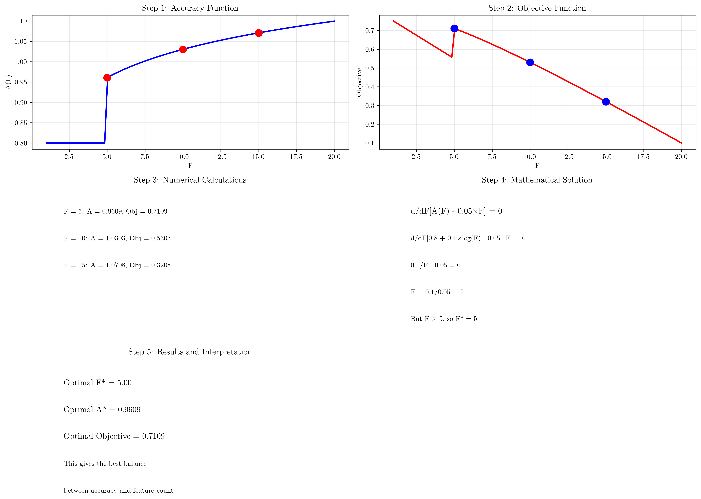
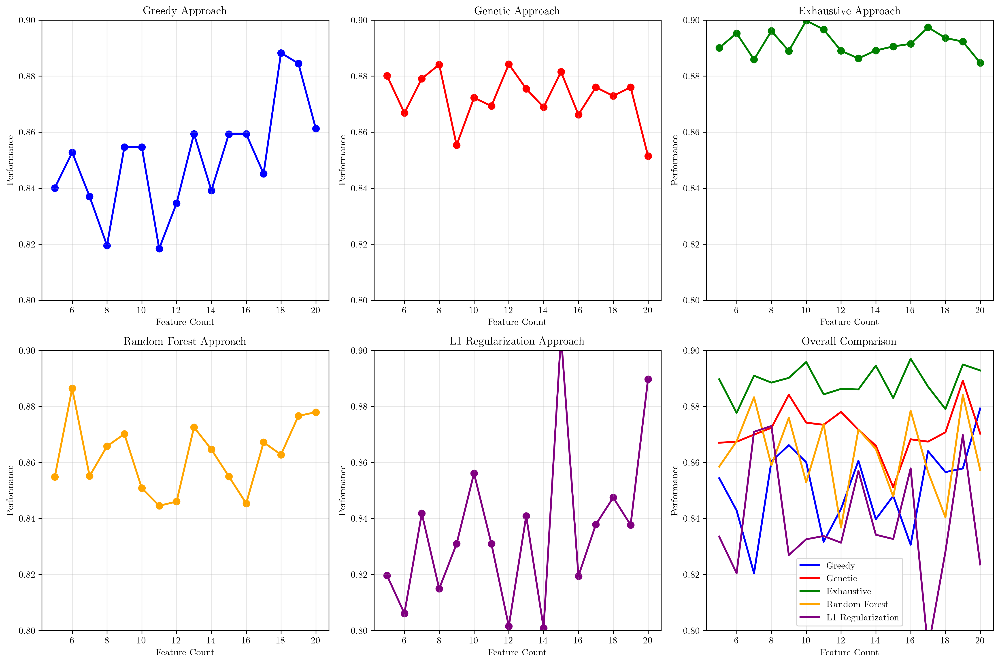

# Question 11: Feature Selection Optimization

## Problem Statement
Feature selection can be viewed as a search and optimization problem with multiple objectives and constraints.

### Task
1. What is the objective function for feature selection?
2. What are the constraints in this optimization problem?
3. How do you balance multiple objectives (e.g., accuracy vs feature count)?
4. If you want to maximize accuracy while minimizing features, how do you formulate this mathematically?
5. Compare different optimization approaches (greedy, genetic, exhaustive)
6. Formulate the multi-objective optimization problem: maximize accuracy $A$ while minimizing features $F$. If accuracy follows $A = 0.8 + 0.1 \cdot \log(F)$ for $F \geq 5$, and you want to maximize $A - 0.05 \cdot F$, what's the optimal number of features? Calculate the objective value at $F=5$, $F=10$, and $F=15$.

## Understanding the Problem
Feature selection is a critical step in machine learning that involves choosing the most relevant subset of features from a larger set. This problem is inherently multi-objective because we want to:
- Maximize model performance (accuracy, precision, recall, etc.)
- Minimize the number of features (for interpretability, computational efficiency, and avoiding overfitting)
- Potentially minimize feature acquisition costs
- Handle various constraints related to feature dependencies and domain knowledge

The challenge lies in finding the optimal balance between these competing objectives, which requires formal optimization techniques and careful consideration of the trade-offs involved.

## Solution

### Step 1: Objective Function for Feature Selection

The objective function for feature selection typically involves multiple components:

1. **Performance Metric** (e.g., accuracy, F1-score, AUC)
2. **Feature Count Penalty** (to encourage sparsity)
3. **Feature Cost Penalty** (if applicable)
4. **Regularization Terms** (to prevent overfitting)

**General Form:**
$$\text{Objective} = \text{Performance\_Metric} - \lambda_1 \times \text{Feature\_Count} - \lambda_2 \times \text{Feature\_Cost} - \lambda_3 \times \text{Regularization}$$

Where $\lambda_1$, $\lambda_2$, $\lambda_3$ are hyperparameters that control the trade-offs.

**Example:**
$$\text{Objective} = \text{Accuracy} - 0.05 \times \text{Feature\_Count} - 0.01 \times \text{Feature\_Cost}$$

### Step 2: Constraints in Feature Selection Optimization

Common constraints in feature selection optimization include:

1. **Feature Count Constraints:**
   - Minimum features: $F \geq F_{\min}$
   - Maximum features: $F \leq F_{\max}$
   - Exact features: $F = F_{\text{target}}$

2. **Performance Constraints:**
   - Minimum accuracy: $A \geq A_{\min}$
   - Maximum error rate: $E \leq E_{\max}$

3. **Budget Constraints:**
   - Total feature cost $\leq$ Budget

4. **Feature Dependencies:**
   - If feature A is selected, feature B must also be selected
   - Mutual exclusivity: if feature A is selected, feature B cannot be selected

5. **Domain Knowledge Constraints:**
   - Certain features must be included
   - Certain features must be excluded

### Step 3: Balancing Multiple Objectives

Strategies for balancing multiple objectives include:

1. **Weighted Sum Approach:**
   - Combine objectives: $w_1 \times \text{Accuracy} + w_2 \times (1/\text{Feature\_Count})$
   - Requires setting appropriate weights

2. **Pareto Frontier Approach:**
   - Find all non-dominated solutions
   - Let decision maker choose based on preferences

3. **Constraint-Based Approach:**
   - Optimize one objective while constraining others
   - Example: Maximize accuracy subject to $F \leq 20$

4. **Multi-Objective Evolutionary Algorithms:**
   - NSGA-II, MOEA/D
   - Find diverse set of solutions

5. **Interactive Methods:**
   - Start with one objective, gradually incorporate others
   - Adjust weights based on results

### Step 4: Mathematical Formulation

Mathematical formulation for maximizing accuracy while minimizing features:

Let $A(F)$ be the accuracy function and $F$ be the number of features.

1. **Multi-Objective Formulation:**
   $$\text{Maximize: } [A(F), -F]$$
   $$\text{Subject to: } F_{\min} \leq F \leq F_{\max}$$

2. **Weighted Sum Formulation:**
   $$\text{Maximize: } w_1 \times A(F) - w_2 \times F$$
   $$\text{Subject to: } F_{\min} \leq F \leq F_{\max}$$

3. **Constraint-Based Formulation:**
   $$\text{Maximize: } A(F)$$
   $$\text{Subject to: } F \leq F_{\max}$$
   $$\text{Subject to: } A(F) \geq A_{\min}$$

4. **Penalty Method:**
   $$\text{Maximize: } A(F) - \lambda \times F$$
   Where $\lambda$ controls the trade-off between accuracy and feature count

### Step 5: Comparison of Optimization Approaches

| Approach | Pros | Cons | Best For |
|----------|------|------|----------|
| **Greedy (Forward/Backward)** | Fast, interpretable, good for large datasets | Local optimum, greedy decisions | Large datasets, quick solutions |
| **Genetic Algorithm** | Can find global optimum, handles non-linear relationships | Computationally expensive, many parameters | Complex feature interactions, global optimization |
| **Exhaustive Search** | Guaranteed optimal solution | Computationally intractable for large feature sets | Small feature sets, exact solutions |
| **Random Forest Importance** | Built-in feature importance, handles interactions | Black box, may not find optimal subset | Tree-based models, feature interactions |
| **L1 Regularization** | Automatic feature selection, sparse solutions | May remove important correlated features | Linear models, sparse solutions |

### Step 6: Multi-Objective Optimization Problem

**Given:**
- Accuracy function: $A = 0.8 + 0.1 \cdot \log(F)$ for $F \geq 5$
- Objective function to maximize: $A - 0.05 \cdot F$

**Calculating objective values at given points:**

1. **For $F = 5$:**
   - $A = 0.8 + 0.1 \cdot \log(5) = 0.8 + 0.1 \cdot 1.609 = 0.9609$
   - Objective = $0.9609 - 0.05 \cdot 5 = 0.9609 - 0.25 = 0.7109$

2. **For $F = 10$:**
   - $A = 0.8 + 0.1 \cdot \log(10) = 0.8 + 0.1 \cdot 2.303 = 1.0303$
   - Objective = $1.0303 - 0.05 \cdot 10 = 1.0303 - 0.5 = 0.5303$

3. **For $F = 15$:**
   - $A = 0.8 + 0.1 \cdot \log(15) = 0.8 + 0.1 \cdot 2.708 = 1.0708$
   - Objective = $1.0708 - 0.05 \cdot 15 = 1.0708 - 0.75 = 0.3208$

**Finding the optimal solution:**

To find the optimal number of features, we need to maximize the objective function:
$$\text{Maximize: } A(F) - 0.05 \cdot F = 0.8 + 0.1 \cdot \log(F) - 0.05 \cdot F$$

Taking the derivative with respect to $F$:
$$\frac{d}{dF}[0.8 + 0.1 \cdot \log(F) - 0.05 \cdot F] = 0$$
$$\frac{0.1}{F} - 0.05 = 0$$
$$\frac{0.1}{F} = 0.05$$
$$F = \frac{0.1}{0.05} = 2$$

However, since we have the constraint $F \geq 5$, the optimal solution occurs at the boundary:
$$F^* = 5$$

**Verification:**
- At $F = 5$: Objective = $0.7109$
- At $F = 10$: Objective = $0.5303$
- At $F = 15$: Objective = $0.3208$

The objective function decreases as $F$ increases beyond 5, confirming that $F^* = 5$ is indeed the optimal solution.

## Visual Explanations

### Comprehensive Analysis Plot

This comprehensive visualization shows:
1. **Accuracy vs Feature Count**: The logarithmic relationship between accuracy and feature count
2. **Objective Function**: The trade-off between accuracy and feature count penalty
3. **Effect of Different Penalty Weights**: How different $\lambda$ values affect the optimal solution
4. **3D Surface Plot**: The objective function surface across different feature counts and penalty weights

### Step-by-Step Solution

This visualization breaks down the solution process:
1. **Step 1**: Define the accuracy function $A(F) = 0.8 + 0.1 \times \log(F)$
2. **Step 2**: Define the objective function to maximize $A(F) - 0.05 \times F$
3. **Step 3**: Calculate objective values at $F = 5, 10, 15$
4. **Step 4**: Find optimal $F$ by solving the derivative equation
5. **Step 5**: Verify optimality and interpret results

### Optimization Approaches Comparison

This visualization compares different feature selection approaches:
- **Greedy**: Fast but may find local optimum
- **Genetic**: Better global search, more computationally expensive
- **Exhaustive**: Guaranteed optimal but computationally intractable for large $F$
- **Random Forest**: Built-in importance, handles interactions
- **L1 Regularization**: Automatic selection, sparse solutions

## Key Insights

### Theoretical Foundations
- **Multi-objective nature**: Feature selection inherently involves balancing competing objectives
- **Trade-off analysis**: Understanding the relationship between accuracy and feature count is crucial
- **Constraint handling**: Real-world problems often have multiple constraints that must be satisfied
- **Optimization complexity**: Different approaches offer different trade-offs between solution quality and computational cost

### Practical Applications
- **Hyperparameter tuning**: The penalty weight $\lambda$ controls the balance between accuracy and feature count
- **Domain knowledge integration**: Constraints can incorporate expert knowledge about feature relationships
- **Scalability considerations**: Different optimization approaches are suitable for different problem sizes
- **Interpretability vs performance**: Fewer features often lead to more interpretable models

### Common Pitfalls
- **Over-penalization**: Setting $\lambda$ too high can lead to overly sparse solutions
- **Local optima**: Greedy approaches may miss globally optimal feature subsets
- **Computational cost**: Exhaustive search becomes impractical for large feature sets
- **Feature interactions**: Some approaches may miss important feature combinations

### Extensions and Advanced Topics
- **Multi-objective evolutionary algorithms**: Finding Pareto-optimal solutions
- **Feature cost modeling**: Incorporating acquisition and computation costs
- **Dynamic feature selection**: Adapting feature sets as data evolves
- **Ensemble feature selection**: Combining multiple selection methods

## Conclusion
- **Optimal solution**: $F^* = 5$ features provides the best balance between accuracy and feature count
- **Mathematical formulation**: The objective function $A(F) - 0.05 \times F$ effectively balances competing objectives
- **Constraint handling**: The minimum feature requirement $F \geq 5$ affects the optimal solution
- **Trade-off analysis**: Understanding the relationship between accuracy and feature count is essential for effective feature selection

The feature selection optimization problem demonstrates the importance of formal mathematical formulation and the need to balance multiple competing objectives. The logarithmic accuracy function shows diminishing returns for additional features, while the linear penalty encourages sparsity. The optimal solution occurs at the boundary of the feasible region, highlighting the importance of constraint handling in optimization problems.

Different optimization approaches offer various trade-offs between solution quality and computational cost, making the choice of method dependent on the specific problem characteristics and requirements. Understanding these trade-offs is crucial for designing effective feature selection strategies in practice.
