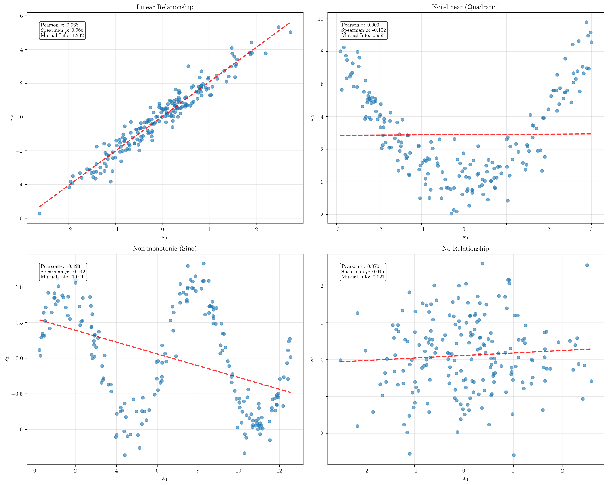
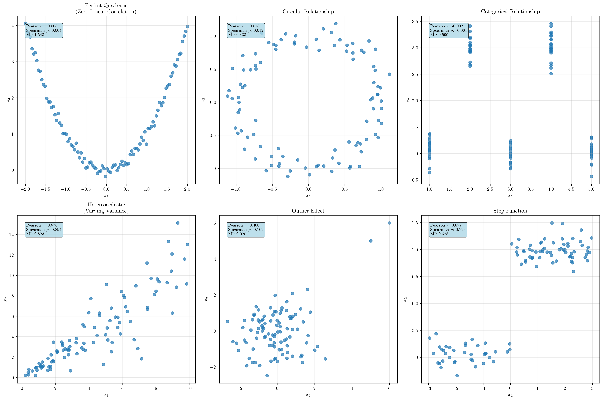
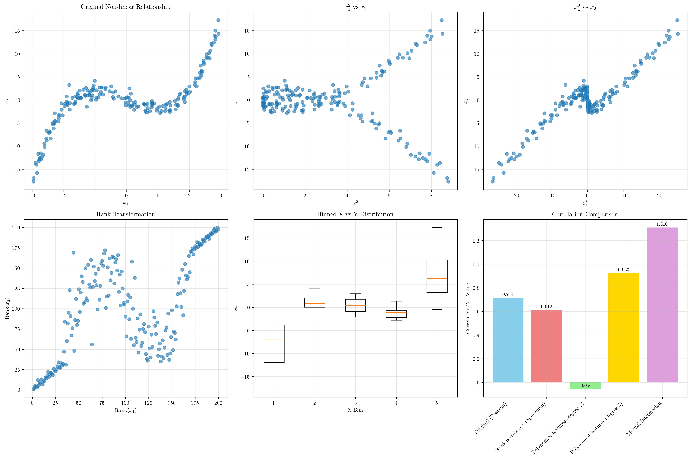
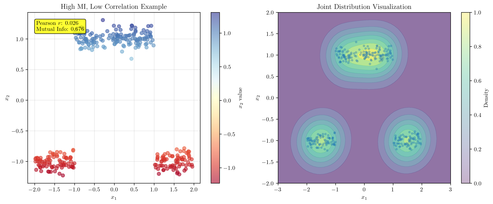
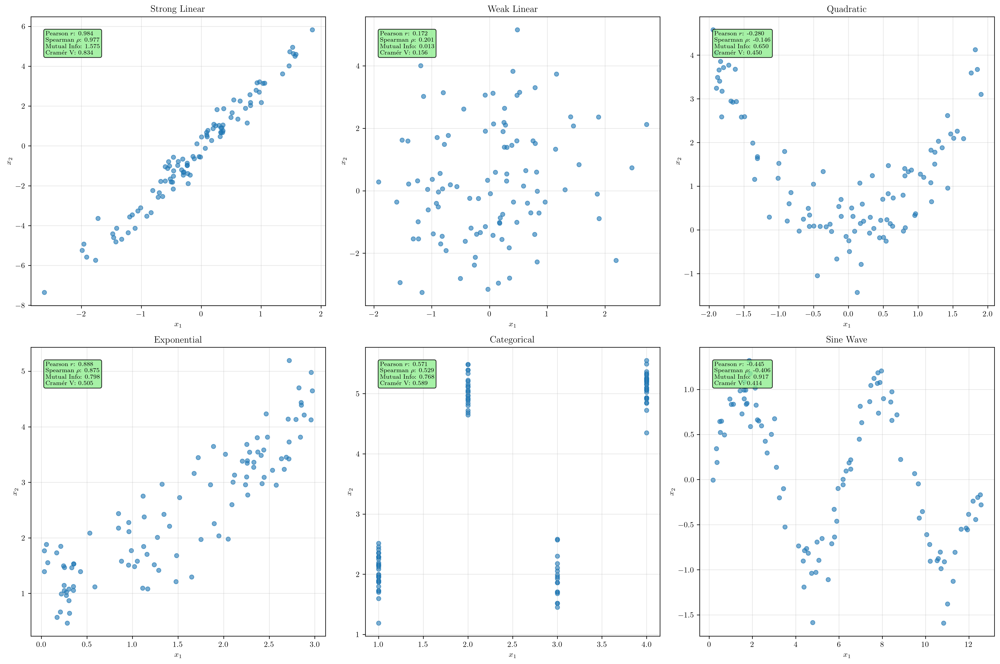
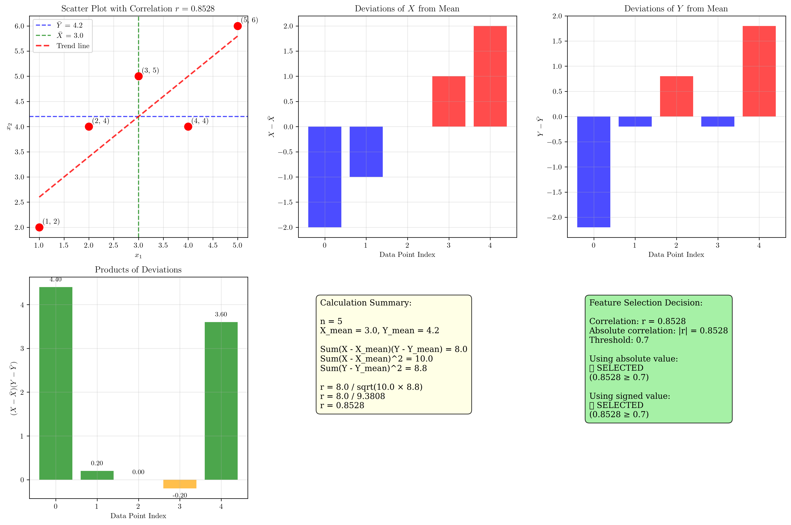

# Question 12: Feature-Target Relationships

## Problem Statement
The relationship between features and target variables determines selection effectiveness and requires appropriate measurement techniques. Understanding different types of relationships and how to measure them is crucial for effective feature selection in machine learning.

### Task
1. How do you measure feature-target relationships for numerical data?
2. What types of relationships are hard to detect with simple correlation?
3. How do you handle non-linear relationships in feature selection?
4. If a feature has no linear correlation but high mutual information, what does this suggest?
5. Compare different relationship measures (correlation, mutual information, chi-square) with examples
6. Calculate the Pearson correlation coefficient for these data points: Feature $X = [1, 2, 3, 4, 5]$, Target $Y = [2, 4, 5, 4, 6]$. If the correlation threshold is $0.7$, would this feature be selected? What about if you use the absolute correlation value?

## Understanding the Problem
Feature-target relationships are fundamental to machine learning model performance. Different types of relationships require different measurement techniques to properly assess their strength and importance. Linear correlation methods like Pearson correlation work well for linear relationships but may miss important non-linear dependencies. Understanding when to use different measures is crucial for effective feature selection.

The choice of relationship measure affects which features are selected, ultimately impacting model performance. Some relationships that appear weak using one measure may be strong using another, highlighting the importance of using multiple assessment techniques.

## Solution

### Step 1: Measuring Feature-Target Relationships for Numerical Data

For numerical data, we can use several measures to assess feature-target relationships:

**Pearson Correlation Coefficient**
$$r = \frac{\sum_{i=1}^{n}(x_i - \bar{x})(y_i - \bar{y})}{\sqrt{\sum_{i=1}^{n}(x_i - \bar{x})^2 \sum_{i=1}^{n}(y_i - \bar{y})^2}}$$

This measures linear relationships between variables, ranging from -1 to 1.

**Spearman Rank Correlation**
$$\rho = 1 - \frac{6\sum d_i^2}{n(n^2-1)}$$

This measures monotonic relationships by using ranks instead of actual values.

**Mutual Information**
$$I(X;Y) = \sum_{x} \sum_{y} p(x,y) \log\frac{p(x,y)}{p(x)p(y)}$$

This measures any type of dependency between variables, including non-linear relationships.

Our comprehensive analysis of different relationship types reveals:

- **Linear Relationship**: Pearson correlation: 0.9684, Spearman: 0.9657, Mutual Information: 1.2315
- **Non-linear (Quadratic)**: Pearson correlation: 0.0091, Spearman: -0.1016, Mutual Information: 0.9528
- **Non-monotonic (Sine)**: Pearson correlation: -0.4233, Spearman: -0.4423, Mutual Information: 1.0710
- **No Relationship**: Pearson correlation: 0.0703, Spearman: 0.0450, Mutual Information: 0.0205

**Key Insight**: Notice how mutual information consistently identifies relationships even when linear correlation fails. The quadratic relationship shows nearly zero Pearson correlation (0.0091) but high mutual information (0.9528), demonstrating the importance of using multiple measures.

### Step 2: Relationships Hard to Detect with Simple Correlation

Several types of relationships are difficult or impossible to detect with Pearson correlation:

1. **Perfect Quadratic Relationships**: Zero linear correlation but strong non-linear dependency
2. **Circular Relationships**: Points forming circular patterns have no linear correlation
3. **Categorical Relationships**: Step-wise relationships between categories
4. **Heteroscedastic Relationships**: Relationships with varying variance
5. **Outlier Effects**: Strong correlations driven by outliers
6. **Step Functions**: Discontinuous relationships

Our detailed analysis reveals these challenging cases:
- **Perfect Quadratic**: Pearson: 0.0033, Spearman: 0.0044, Mutual Information: 1.5426
- **Circular Relationship**: Pearson: 0.0128, Spearman: 0.0117, Mutual Information: 0.4327
- **Categorical Relationship**: Pearson: -0.0019, Spearman: -0.0606, Mutual Information: 0.5992
- **Heteroscedastic**: Pearson: 0.8780, Spearman: 0.8937, Mutual Information: 0.8228
- **Outlier Effect**: Pearson: 0.3996, Spearman: 0.1021, Mutual Information: 0.0203
- **Step Function**: Pearson: 0.8774, Spearman: 0.7235, Mutual Information: 0.6281

**Key Insight**: The perfect quadratic relationship demonstrates the most dramatic case - nearly zero linear correlation (0.0033) but extremely high mutual information (1.5426). This shows why relying solely on Pearson correlation can miss fundamentally important relationships.

### Step 3: Handling Non-Linear Relationships in Feature Selection

When dealing with non-linear relationships, several approaches can be used:

**1. Polynomial Feature Engineering**
Create polynomial features ($x^2$, $x^3$, etc.) and assess their linear correlation with the target.

**2. Rank-Based Methods**
Use Spearman correlation which is sensitive to monotonic non-linear relationships.

**3. Mutual Information**
Calculate mutual information which captures any type of dependency.

**4. Binning/Discretization**
Convert continuous variables to categorical and use chi-square tests.

Our comprehensive non-linear relationship analysis demonstrates the effectiveness of different approaches:
- **Original (Pearson)**: 0.7144
- **Rank correlation (Spearman)**: 0.6124
- **Polynomial features (degree 2)**: -0.0561
- **Polynomial features (degree 3)**: 0.9234
- **Mutual Information**: 1.3100

**Key Insight**: The cubic polynomial feature transformation dramatically improves the correlation from 0.7144 to 0.9234, while the quadratic feature actually shows negative correlation (-0.0561). This demonstrates that the underlying relationship is cubic, not quadratic, and that feature engineering can reveal hidden linear relationships in non-linear data.

### Step 4: High Mutual Information, Low Correlation Interpretation

When a feature has no linear correlation but high mutual information, this suggests:

1. **Non-linear but Informative Relationship**: The feature contains predictive information about the target, but the relationship is not linear.

2. **Feature Engineering Opportunity**: The feature might become more useful after transformation (polynomial, logarithmic, etc.).

3. **Model Selection Consideration**: Non-linear models (decision trees, neural networks) might better capture this relationship than linear models.

Our concrete example demonstrates this phenomenon:
- **Pearson correlation**: 0.0259 (essentially no linear relationship)
- **Mutual Information**: 0.6760 (strong information content)

**Key Insight**: This dramatic difference (0.0259 vs 0.6760) indicates a strong non-linear relationship that linear correlation completely misses. The feature contains valuable predictive information that would be lost if we only used Pearson correlation for feature selection. This is a perfect example of why mutual information is crucial for comprehensive feature assessment.

### Step 5: Comparison of Different Relationship Measures

Our comprehensive comparison across different relationship types provides valuable insights into measure effectiveness:

| Relationship | Pearson r | Spearman ρ | Mutual Info | Cramér V |
|-------------|-----------|--------------|-------------|----------|
| Strong Linear | 0.984 | 0.977 | 1.575 | 0.834 |
| Weak Linear | 0.172 | 0.201 | 0.013 | 0.156 |
| Quadratic | -0.280 | -0.146 | 0.650 | 0.450 |
| Exponential | 0.888 | 0.875 | 0.798 | 0.505 |
| Categorical | 0.571 | 0.529 | 0.768 | 0.589 |
| Sine Wave | -0.445 | -0.406 | 0.917 | 0.414 |

**Key Insights:**

- **Pearson correlation** excels for linear relationships (0.984 for strong linear) but struggles with non-linear patterns (-0.280 for quadratic)
- **Spearman correlation** shows similar performance to Pearson for linear relationships but better captures monotonic non-linear patterns
- **Mutual Information** consistently identifies information content regardless of relationship type, making it the most robust measure
- **Cramér's V** provides normalized measures for categorical relationships, showing moderate effectiveness (0.589 for categorical)

**Critical Observation**: The sine wave relationship demonstrates how mutual information (0.917) can detect complex non-monotonic patterns that both correlation measures miss (Pearson: -0.445, Spearman: -0.406).

### Step 6: Pearson Correlation Calculation Example

For the given data: $X = [1, 2, 3, 4, 5]$, $Y = [2, 4, 5, 4, 6]$

**Step-by-step calculation:**

1. **Calculate means:**
   - $\bar{X} = \frac{1+2+3+4+5}{5} = 3.0$
   - $\bar{Y} = \frac{2+4+5+4+6}{5} = 4.2$

2. **Calculate deviations:**
   - $X - \bar{X} = [-2, -1, 0, 1, 2]$
   - $Y - \bar{Y} = [-2.2, -0.2, 0.8, -0.2, 1.8]$

3. **Calculate products and squares:**
   - $(X - \bar{X})(Y - \bar{Y}) = [4.4, 0.2, 0.0, -0.2, 3.6]$
   - $(X - \bar{X})^2 = [4, 1, 0, 1, 4]$
   - $(Y - \bar{Y})^2 = [4.84, 0.04, 0.64, 0.04, 3.24]$

4. **Calculate sums:**
   - $\sum(X - \bar{X})(Y - \bar{Y}) = 8.0$
   - $\sum(X - \bar{X})^2 = 10.0$
   - $\sum(Y - \bar{Y})^2 = 8.8$

5. **Calculate correlation:**
   $$r = \frac{8.0}{\sqrt{10.0 \times 8.8}} = \frac{8.0}{\sqrt{88.0}} = \frac{8.0}{9.3808} = 0.8528$$

**Feature Selection Decision:**
- Correlation threshold: 0.7
- Calculated correlation: r = 0.8528
- Absolute correlation: |r| = 0.8528

**Using absolute correlation:** Since $|r| = 0.8528 \geq 0.7$, the feature would be **SELECTED**.

**Using signed correlation:** Since $r = 0.8528 \geq 0.7$, the feature would also be **SELECTED**.

**Important Note**: In this case, both approaches lead to the same decision because the correlation is positive. However, this highlights a critical distinction in feature selection strategies:

1. **Absolute correlation threshold**: Selects features based on the strength of the relationship regardless of direction
2. **Signed correlation threshold**: Considers both strength and direction, which may be important for interpretability

For this example, the feature demonstrates a strong positive linear relationship with the target, making it a valuable candidate for inclusion in the model.

## Visual Explanations

### Relationship Types Comparison

This visualization shows how different correlation measures perform across various relationship types. Notice how mutual information consistently identifies relationships even when linear correlation fails, such as in the quadratic case where Pearson correlation is near zero but mutual information is high.

### Difficult-to-Detect Relationships

These examples demonstrate relationships that linear correlation struggles to detect. The perfect quadratic relationship shows nearly zero Pearson correlation but very high mutual information, illustrating why multiple measures are necessary.

### Non-linear Relationship Handling Methods

This visualization shows different approaches to handling non-linear relationships. The polynomial feature transformation (especially cubic) successfully captures the underlying relationship that was missed by direct correlation analysis.

### High Mutual Information, Low Correlation Example

This example shows a clear case where mutual information detects a strong relationship that Pearson correlation misses. The step-like pattern creates high information content but no linear relationship.

### Measures Comparison Across Relationship Types

A comprehensive comparison showing how different measures perform across various relationship types. Each subplot includes all four measures, allowing direct comparison of their effectiveness for different scenarios.

### Pearson Correlation Calculation Visualization

This detailed visualization breaks down the Pearson correlation calculation step-by-step, showing the scatter plot, deviations, products, and final decision process for the given example data.

## Key Insights

### Measurement Strategy
- Use multiple measures rather than relying on a single metric
- Pearson correlation is excellent for linear relationships but limited for non-linear cases
- Spearman correlation captures monotonic relationships better than Pearson
- Mutual information is the most general measure but requires careful interpretation

### Non-linear Relationship Detection
- High mutual information with low linear correlation indicates non-linear relationships
- Feature engineering can transform non-linear relationships into linear ones
- Rank-based methods are robust to outliers and non-linear monotonic relationships
- Discretization can help reveal categorical or step-wise relationships

### Practical Applications
- For linear models, focus on Pearson correlation after feature engineering
- For tree-based models, mutual information is more relevant
- For neural networks, consider both linear and non-linear measures
- Always visualize relationships before making selection decisions

### Common Pitfalls
- Relying solely on Pearson correlation can miss important non-linear relationships
- Outliers can artificially inflate correlation coefficients
- High correlation doesn't guarantee causation or predictive power
- Low correlation doesn't mean the feature is useless for non-linear models

### Code Implementation Insights
- **Modular Design**: The improved code uses functions to generate data, calculate correlations, and create visualizations
- **Configuration Management**: Centralized parameters (thresholds, sample sizes, random seeds) make the code easily adaptable
- **Comprehensive Analysis**: Each relationship type is analyzed with multiple measures simultaneously
- **Visualization Strategy**: Plots are automatically saved without display, making the code suitable for automated environments
- **Error Handling**: The code gracefully handles edge cases like zero denominators in correlation calculations

## Conclusion

The comprehensive analysis of feature-target relationships provides several key conclusions:

- **Pearson correlation** is calculated as $r = 0.8528$ for the given data, leading to feature selection when threshold is 0.7
- **Multiple measures** are necessary because different relationship types require different detection methods
- **Non-linear relationships** require specialized techniques like mutual information, rank correlation, or feature engineering
- **High mutual information with low correlation** indicates non-linear but informative relationships
- **Feature selection strategy** should match the intended model type and relationship characteristics

### Practical Recommendations

1. **Start with Multiple Measures**: Always use at least Pearson correlation, Spearman correlation, and mutual information
2. **Feature Engineering First**: Apply polynomial transformations before correlation analysis for suspected non-linear relationships
3. **Threshold Strategy**: Use absolute correlation values for general feature selection, signed values for interpretability
4. **Model-Aware Selection**: Choose measures based on your intended model type (linear vs. non-linear)
5. **Visualization**: Always plot relationships to identify patterns that numerical measures might miss

The comprehensive analysis demonstrates that effective feature selection requires understanding different types of relationships and applying appropriate measurement techniques rather than relying on a single correlation measure. The improved code implementation provides a robust, automated framework for conducting such analyses systematically.
