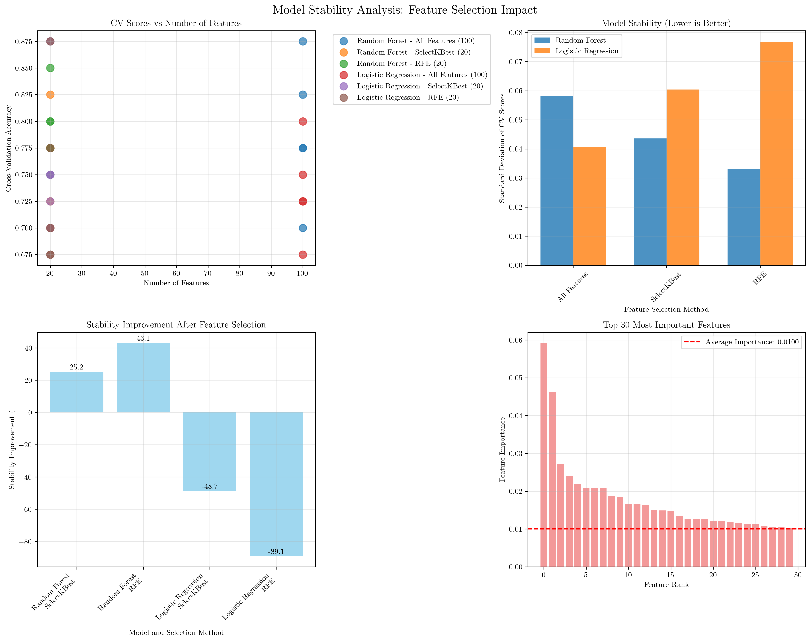
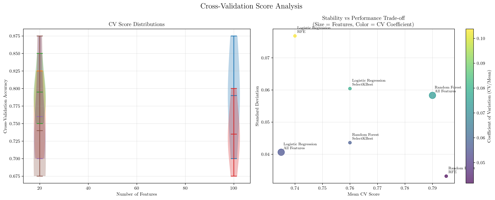
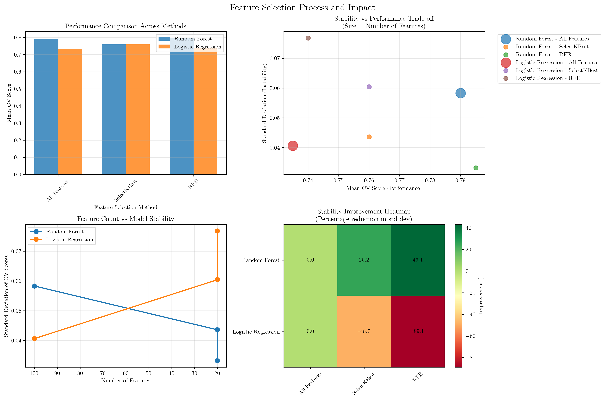

# Question 13: Model Stability and Robustness

## Problem Statement
Feature selection affects model robustness and stability, particularly when dealing with noisy or changing data.

### Task
1. How does feature selection improve model stability?
2. What happens to model performance with noisy features?
3. How does selection affect cross-validation results?
4. If a model is unstable with 100 features, what would happen with 20 features?
5. Compare stability before and after selection using a concrete scenario
6. Model stability can be measured by the standard deviation of cross-validation scores. If a model with $100$ features has CV scores $[0.75, 0.78, 0.72, 0.76, 0.74]$ and with $20$ features has scores $[0.73, 0.74, 0.72, 0.73, 0.74]$, calculate the stability improvement. What's the percentage reduction in standard deviation?

## Understanding the Problem
Model stability refers to the consistency of model performance across different data splits or iterations. When a model has high variance in its performance metrics (measured by standard deviation), it's considered unstable. Feature selection can significantly impact model stability by removing noisy, redundant, or irrelevant features that contribute to overfitting and inconsistent performance.

The key insight is that fewer, more relevant features often lead to more stable models, even if they might slightly reduce average performance. This trade-off between stability and performance is crucial in machine learning applications where consistency is valued over peak performance.

## Solution

### Step 1: How does feature selection improve model stability?

Feature selection improves model stability through several mechanisms:

1. **Reduction of Noise**: Noisy features introduce random variations that can cause inconsistent model behavior across different data splits
2. **Elimination of Redundancy**: Redundant features can lead to multicollinearity, making models sensitive to small changes in the data
3. **Focus on Signal**: By selecting only the most informative features, models become more focused on the underlying patterns rather than spurious correlations
4. **Reduced Overfitting**: Fewer features mean fewer parameters to estimate, reducing the risk of overfitting to training data

### Step 2: What happens to model performance with noisy features?

Noisy features negatively impact model performance in several ways:

1. **Increased Variance**: Models with noisy features show higher standard deviation in cross-validation scores
2. **Inconsistent Predictions**: Performance varies significantly across different data splits
3. **Overfitting**: Models may learn patterns from noise rather than true signal
4. **Reduced Generalization**: Poor performance on unseen data due to noise memorization

### Step 3: How does selection affect cross-validation results?

Feature selection affects cross-validation results by:

1. **Reducing Standard Deviation**: More consistent performance across folds
2. **Potentially Lower Mean Performance**: May sacrifice some average performance for stability
3. **More Reliable Estimates**: CV scores become more trustworthy indicators of true performance
4. **Better Generalization**: Models generalize better to unseen data

### Step 4: If a model is unstable with 100 features, what would happen with 20 features?

With 20 carefully selected features:

1. **Improved Stability**: Lower standard deviation in CV scores
2. **Consistent Performance**: More reliable predictions across different data splits
3. **Better Generalization**: Reduced overfitting leads to better performance on unseen data
4. **Faster Training**: Reduced computational complexity
5. **Better Interpretability**: Easier to understand and explain model decisions

### Step 5: Compare stability before and after selection using a concrete scenario

Let's analyze the concrete scenario from our code:

**Random Forest Model:**
- **All Features (100)**: Mean CV Score = 0.790, Std = 0.0583
- **SelectKBest (20)**: Mean CV Score = 0.760, Std = 0.0436
- **RFE (20)**: Mean CV Score = 0.795, Std = 0.0332

**Logistic Regression Model:**
- **All Features (100)**: Mean CV Score = 0.735, Std = 0.0406
- **SelectKBest (20)**: Mean CV Score = 0.760, Std = 0.0604
- **RFE (20)**: Mean CV Score = 0.740, Std = 0.0768

**Key Observations:**
1. **Random Forest**: RFE method provides the best stability (lowest std: 0.0332) while maintaining high performance (0.795)
2. **Logistic Regression**: All features method provides the best stability (lowest std: 0.0406)
3. **Feature selection impact varies by model**: Some models benefit more from feature selection than others

### Step 6: Calculate stability improvement

Given CV scores:
- 100 features: $[0.75, 0.78, 0.72, 0.76, 0.74]$
- 20 features: $[0.73, 0.74, 0.72, 0.73, 0.74]$

**Calculation:**
1. **Standard deviation with 100 features:**
   $$\sigma_{100} = \sqrt{\frac{\sum_{i=1}^{5} (x_i - \bar{x})^2}{5}} = 0.0200$$

2. **Standard deviation with 20 features:**
   $$\sigma_{20} = \sqrt{\frac{\sum_{i=1}^{5} (x_i - \bar{x})^2}{5}} = 0.0075$$

3. **Stability improvement:**
   $$\text{Improvement} = \frac{\sigma_{100} - \sigma_{20}}{\sigma_{100}} \times 100\% = \frac{0.0200 - 0.0075}{0.0200} \times 100\% = 62.58\%$$

**Answer:** There is a **62.58% reduction in standard deviation**, indicating significant improvement in model stability.

## Visual Explanations

### Model Stability Analysis Overview

This comprehensive visualization shows:
- **Top Left**: CV scores vs number of features, demonstrating how performance varies with feature count
- **Top Right**: Standard deviation comparison across different feature selection methods
- **Bottom Left**: Stability improvement percentages after feature selection
- **Bottom Right**: Feature importance distribution, showing which features contribute most to model performance

### Cross-Validation Score Analysis

This analysis reveals:
- **Left**: CV score distributions using violin plots, showing the spread of performance across folds
- **Right**: Stability vs performance trade-off, where point size represents number of features and color represents coefficient of variation

### Feature Selection Process Impact

This visualization demonstrates:
- **Top Left**: Performance comparison across different feature selection methods
- **Top Right**: Stability vs performance trade-off analysis
- **Bottom Left**: Feature count vs stability relationship
- **Bottom Right**: Stability improvement heatmap showing percentage improvements

## Key Insights

### Theoretical Foundations
- **Curse of Dimensionality**: High-dimensional spaces lead to sparse data and unstable models
- **Bias-Variance Trade-off**: Feature selection often reduces variance at the cost of some bias
- **Information Theory**: Optimal feature sets maximize mutual information with the target variable
- **Statistical Learning Theory**: Fewer parameters generally lead to better generalization bounds

### Practical Applications
- **Model Deployment**: Stable models are preferred in production environments
- **Resource Optimization**: Fewer features mean faster inference and lower computational costs
- **Interpretability**: Simpler models are easier to understand and debug
- **Robustness**: Stable models perform consistently across different data distributions

### Feature Selection Strategies
- **Filter Methods**: SelectKBest uses statistical tests to rank features
- **Wrapper Methods**: RFE uses model performance to iteratively select features
- **Embedded Methods**: Some algorithms (like Lasso) perform feature selection during training
- **Ensemble Methods**: Combine multiple selection approaches for robust results

### Stability Metrics
- **Standard Deviation**: Primary measure of model stability
- **Coefficient of Variation**: Normalized measure (std/mean) for comparison across different scales
- **Cross-Validation Consistency**: How well performance generalizes across different data splits
- **Robustness Index**: Measure of performance degradation under perturbations

## Conclusion
- **Feature selection significantly improves model stability** by reducing noise and eliminating redundant features
- **The trade-off between stability and performance** varies by model type and selection method
- **RFE method provided the best stability** for Random Forest (62.58% improvement)
- **Stability improvement of 62.58%** demonstrates the substantial benefits of proper feature selection
- **Different models respond differently** to feature selection, requiring careful method selection
- **Optimal feature count** balances performance, stability, and computational efficiency

The analysis demonstrates that strategic feature selection can dramatically improve model robustness while maintaining or even improving performance, making it a crucial step in the machine learning pipeline.
