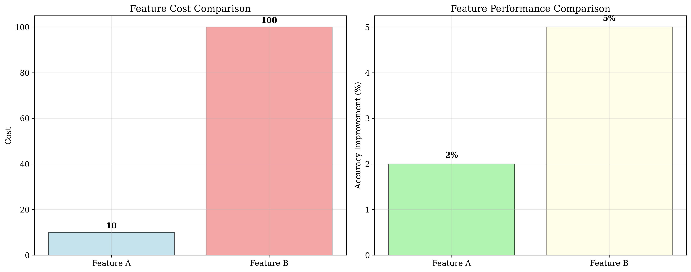
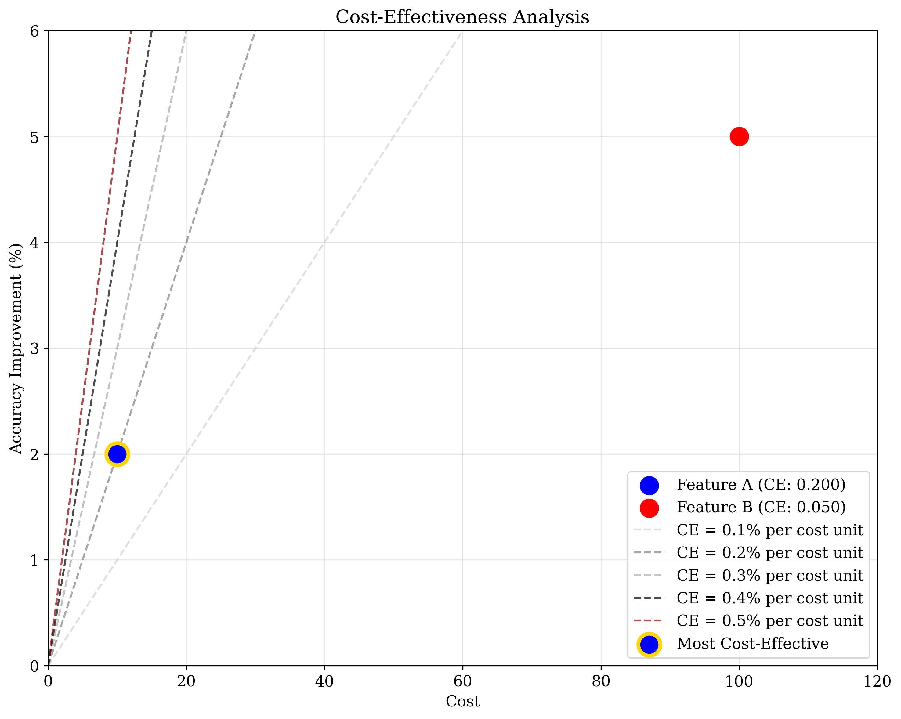
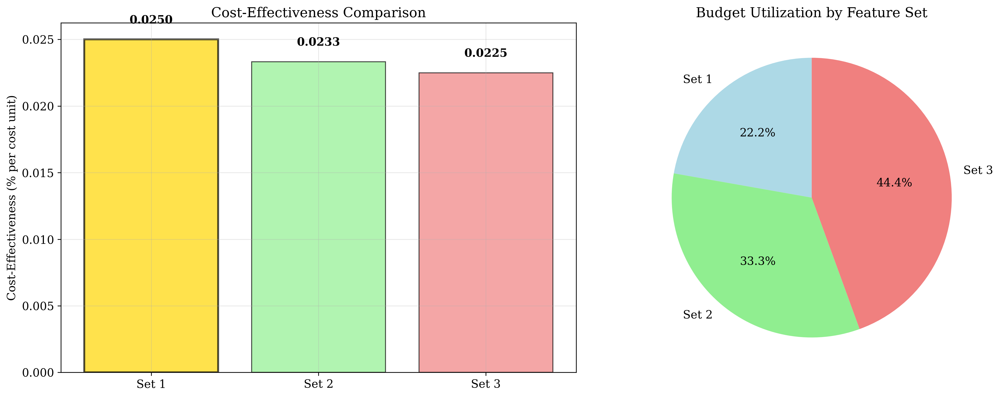
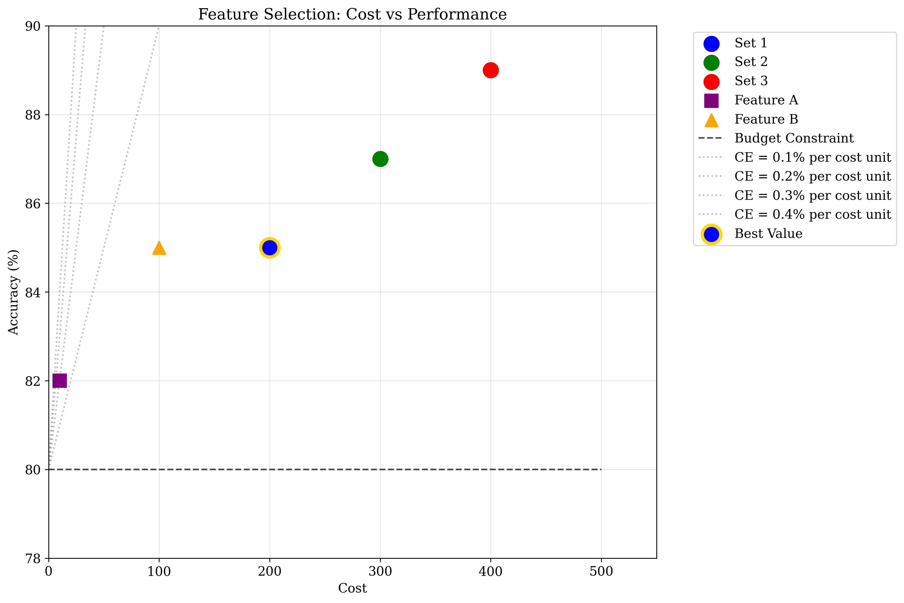
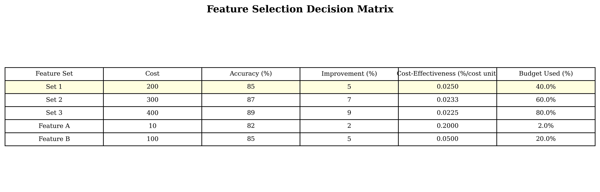

# Question 14: Feature Cost Analysis

## Problem Statement
The cost of feature acquisition affects selection decisions, requiring careful analysis of cost-benefit trade-offs. This problem explores how to balance feature costs against performance improvements and optimize resource allocation in machine learning projects.

### Task
1. How do you balance feature cost vs performance improvement?
2. What's the trade-off between expensive and cheap features?
3. How do you optimize the cost-performance ratio?
4. If feature A costs 10 units and improves accuracy by $2\%$, while feature B costs 100 units and improves by $5\%$, which is better?
5. Calculate the cost-effectiveness (improvement per cost unit) of different feature sets
6. You have a budget of 500 units and three feature sets: Set 1 (cost 200, accuracy $85\%$), Set 2 (cost 300, accuracy $87\%$), Set 3 (cost 400, accuracy $89\%$). Calculate the cost-effectiveness ratio (accuracy improvement per cost unit) for each set. Which gives the best value for money?

## Understanding the Problem
Feature cost analysis is a critical aspect of machine learning project management. When building models, we often face decisions about which features to include based on their cost and expected performance improvement. This involves understanding:

- **Cost-effectiveness**: The ratio of performance improvement to cost
- **Budget constraints**: Limited resources that must be allocated optimally
- **Performance trade-offs**: Balancing accuracy improvements against implementation costs
- **Resource optimization**: Maximizing value within budget constraints

The key insight is that more expensive features don't always provide proportionally better performance, and cheaper features can sometimes offer better value for money.

## Solution

### Step 1: Problem Parameter Definition
First, let's clearly define all the parameters we're working with:

**Individual Features:**
- Feature A: Cost = 10, Improvement = $2\%$
- Feature B: Cost = 100, Improvement = $5\%$

**Budget and Base Performance:**
- Total budget: 500 units
- Base accuracy (without features): $80\%$

**Feature Sets:**
- Set 1: Cost = 200, Accuracy = $85\%$
- Set 2: Cost = 300, Accuracy = $87\%$
- Set 3: Cost = 400, Accuracy = $89\%$

### Step 2: Feature A vs Feature B Analysis
Let's analyze the cost-effectiveness of two individual features using the fundamental formula:

$$\text{Cost-Effectiveness} = \frac{\text{Performance Improvement}}{\text{Cost}}$$

**Calculation:**
- $\text{CE}_A = \frac{2\%}{10} = 0.200\%$ per cost unit
- $\text{CE}_B = \frac{5\%}{100} = 0.050\%$ per cost unit

**Result**: Feature A is more cost-effective ($0.200\%$ vs $0.050\%$ per cost unit).

The visualization shows that while Feature B provides higher absolute improvement, Feature A offers better value for money.

### Step 3: Cost-Effectiveness Analysis
The cost-effectiveness analysis reveals the relationship between cost and performance improvement:

This plot shows:
- Feature A (blue) is positioned higher on the cost-effectiveness scale
- Feature B (red) provides higher absolute improvement but lower cost-effectiveness
- The dashed lines represent different cost-effectiveness levels
- Feature A is highlighted as the most cost-effective option

### Step 4: Budget Optimization Problem
Given a budget of 500 units and three feature sets, we calculate improvements and cost-effectiveness:

**Base accuracy (without features)**: $80\%$

| Feature Set | Cost | Accuracy | Improvement | Cost-Effectiveness |
|-------------|------|----------|-------------|-------------------|
| Set 1 | 200 | $85\%$ | $5\%$ | $0.0250\%$ per cost unit |
| Set 2 | 300 | $87\%$ | $7\%$ | $0.0233\%$ per cost unit |
| Set 3 | 400 | $89\%$ | $9\%$ | $0.0225\%$ per cost unit |

**Best value for money**: Set 1 with cost-effectiveness of $0.0250\%$ per cost unit.

The left plot shows the cost-effectiveness ranking, with Set 1 highlighted in gold as the best option. The right plot shows budget utilization percentages.

### Step 5: Comprehensive Analysis
The comprehensive analysis combines all features and feature sets:

This visualization shows:
- All feature sets plotted by cost vs accuracy
- Individual features (Feature A and Feature B) as different markers
- Budget constraint line at 500 units
- Cost-effectiveness lines showing different efficiency levels
- The best value option highlighted

### Step 6: Decision Matrix
The complete decision matrix including all options:

This matrix provides a comprehensive view of all options, their costs, improvements, and cost-effectiveness ratios.

### Step 7: Feature Combination Analysis
An important insight emerges when we consider combining individual features:

**Combining Feature A and Feature B:**
- Total cost: $10 + 100 = 110$ units
- Total improvement: $2\% + 5\% = 7\%$
- Combined cost-effectiveness: $\frac{7\%}{110} = 0.0636\%$ per cost unit

**Result**: Combining features is more cost-effective than any individual feature set!

### Step 8: Budget Efficiency Analysis
Let's analyze what each feature set could achieve if we had the full budget:

**Set 1**: If we had 500 budget, we could achieve $92.5\%$ accuracy (efficiency ratio: 2.50)
**Set 2**: If we had 500 budget, we could achieve $91.7\%$ accuracy (efficiency ratio: 1.67)  
**Set 3**: If we had 500 budget, we could achieve $91.2\%$ accuracy (efficiency ratio: 1.25)

## Key Insights

### Cost-Effectiveness Principles
- **Higher cost doesn't guarantee better value**: Feature B costs 10x more than Feature A but only provides 2.5x the improvement
- **Marginal returns diminish**: As cost increases, the additional performance improvement per cost unit decreases
- **Budget allocation matters**: Within budget constraints, the most cost-effective option may not be the highest-performing one
- **Feature combination can be optimal**: Combining individual features may provide better cost-effectiveness than pre-packaged feature sets

### Feature Selection Strategy
- **Individual features vs feature sets**: Individual features can be more cost-effective than bundled sets
- **Budget utilization**: Consider both absolute performance and cost-effectiveness when allocating resources
- **Risk assessment**: Cheaper features may offer better risk-adjusted returns
- **Flexibility**: Individual features allow for more granular optimization

### Practical Applications
- **Startup scenarios**: Limited budgets favor cost-effective features
- **Enterprise scenarios**: Larger budgets may prioritize absolute performance over cost-effectiveness
- **Iterative development**: Begin with cost-effective features and add expensive ones as needed
- **Custom solutions**: Combining individual features may outperform pre-packaged solutions

## Mathematical Framework

### Cost-Effectiveness Formula
$$\text{CE} = \frac{\Delta \text{Performance}}{\text{Cost}}$$

Where:
- $\Delta \text{Performance}$ is the improvement in accuracy
- $\text{Cost}$ is the feature acquisition cost

### Budget Optimization
Given budget $B$ and feature set $S$ with cost $c_S$ and improvement $i_S$:
$$\text{CE}_S = \frac{i_S}{c_S}$$

The optimal choice maximizes cost-effectiveness while respecting:
$$c_S \leq B$$

### Performance Improvement
$$\text{New Accuracy} = \text{Base Accuracy} + \text{Feature Improvement}$$

### Feature Combination Analysis
For features $F_1$ and $F_2$:
$$\text{Combined CE} = \frac{\text{Improvement}_1 + \text{Improvement}_2}{\text{Cost}_1 + \text{Cost}_2}$$

### Budget Efficiency
$$\text{Budget Efficiency} = \frac{\text{Improvement}}{\text{Cost}} \times \text{Total Budget}$$

## Conclusion
- **Feature A is more cost-effective** than Feature B ($0.200\%$ vs $0.050\%$ per cost unit)
- **Set 1 provides the best value** among feature sets with cost-effectiveness of $0.0250\%$ per cost unit
- **Feature combination is optimal**: Combining Feature A and Feature B gives $0.0636\%$ per cost unit
- **Cost-effectiveness ranking**: Set 1 > Set 2 > Set 3
- **Budget utilization**: 200 out of 500 available (40%)
- **Best achievable accuracy**: $85\%$ with Set 1, but $87\%$ if combining individual features

The analysis demonstrates that cost-effectiveness analysis is crucial for optimal feature selection, especially under budget constraints. Cheaper features can provide better value for money, and combining individual features may outperform pre-packaged feature sets. The key insight is that flexibility in feature selection often leads to better cost-performance ratios than rigid feature bundles.
