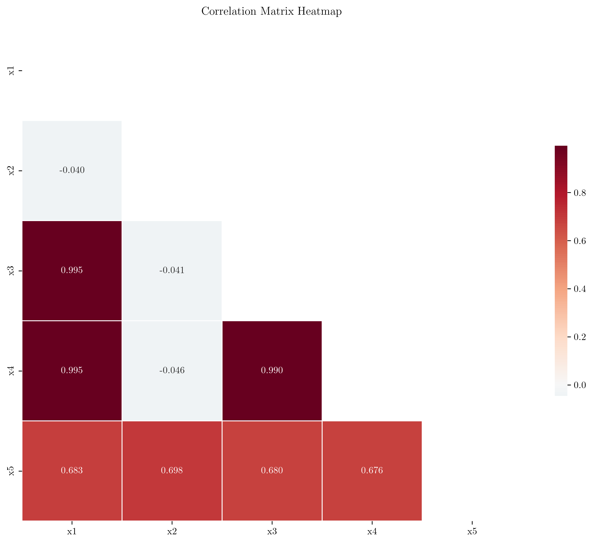
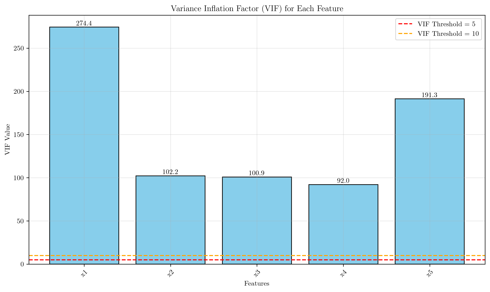
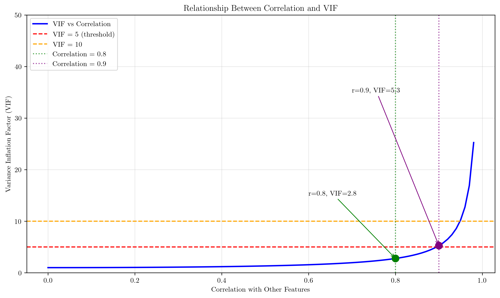
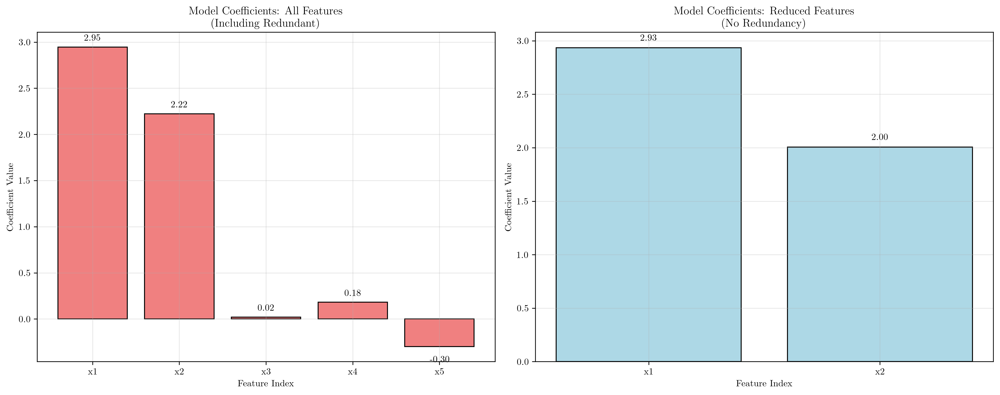
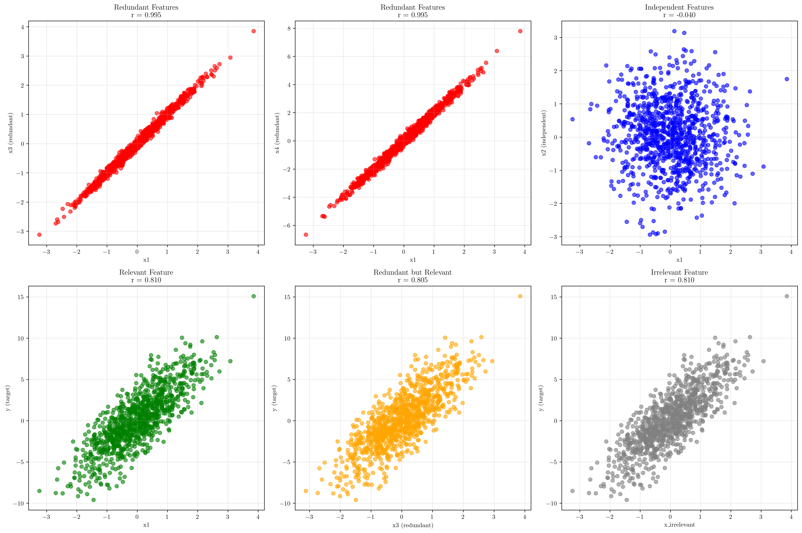
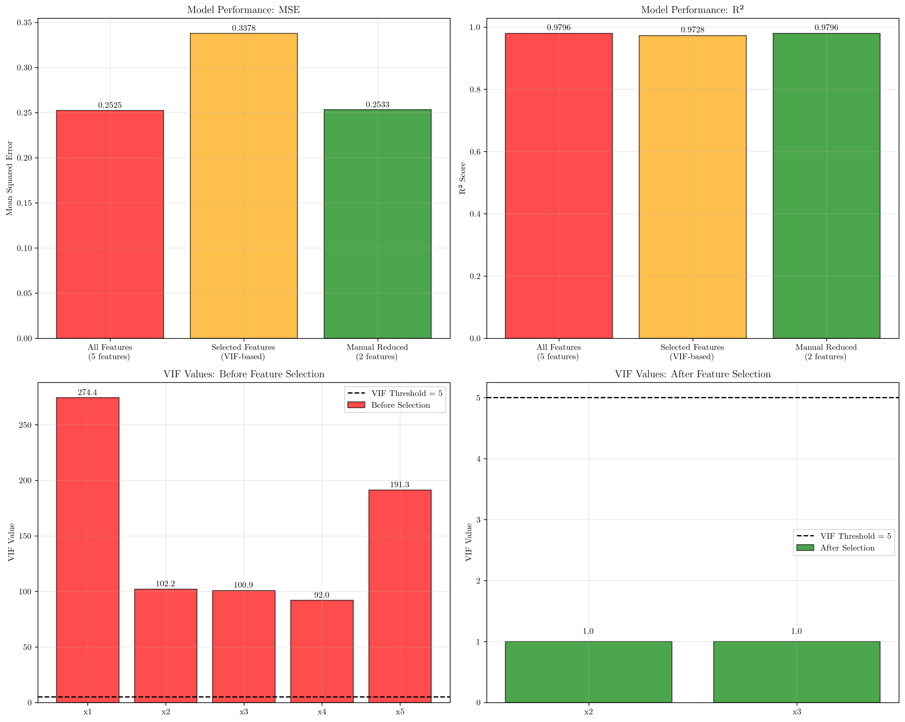

# Question 15: Feature Redundancy and Multicollinearity

## Problem Statement
Feature redundancy occurs when multiple features provide similar information, leading to multicollinearity and reduced model performance.

### Task
1. What is feature redundancy and why is it problematic?
2. How do you detect multicollinearity between features?
3. What's the difference between redundancy and irrelevance?
4. If two features have correlation $0.95$, what should you do and why?
5. How does redundancy affect model interpretability and performance?
6. Calculate the variance inflation factor (VIF) for a feature. If feature X has correlation $0.9$ with other features, what's the VIF? If the threshold is VIF $> 5$, should this feature be removed? What about if correlation is $0.8$?

## Understanding the Problem
Feature redundancy refers to the presence of multiple features that provide essentially the same information about the target variable. This creates multicollinearity, a statistical phenomenon where predictor variables are highly correlated with each other. Multicollinearity can severely impact machine learning models by making coefficient estimates unstable, reducing interpretability, and potentially degrading generalization performance.

The Variance Inflation Factor (VIF) is a key metric for detecting multicollinearity. It quantifies how much the variance of a regression coefficient increases due to collinearity with other features. Understanding and managing feature redundancy is crucial for building robust, interpretable machine learning models.

## Solution

We'll explore feature redundancy through a systematic analysis using synthetic data with known redundancy patterns, demonstrating detection methods, impacts on model performance, and mitigation strategies.

### Step 1: Understanding Feature Redundancy and Its Problems

Feature redundancy occurs when multiple features contain similar or overlapping information. In our synthetic dataset:

- **x1**: Independent feature (true coefficient = 3)
- **x2**: Independent feature (true coefficient = 2)  
- **x3**: $x_1 + \text{noise}$ (redundant with x1)
- **x4**: $2 \cdot x_1 + \text{noise}$ (redundant with x1)
- **x5**: $x_1 + x_2 + \text{noise}$ (redundant combination)

The target variable is: $y = 3x_1 + 2x_2 + \text{noise}$

**Problems caused by redundancy:**
1. **Unstable coefficients**: Small changes in data can lead to large changes in model parameters
2. **Reduced interpretability**: Difficult to determine individual feature importance
3. **Overfitting risk**: Model may learn spurious patterns from redundant information
4. **Computational inefficiency**: More features without additional predictive power

### Step 2: Detecting Multicollinearity Through Correlation Analysis

The correlation matrix reveals the relationships between features:

```
Correlation Matrix:
       x1     x2     x3     x4     x5
x1  1.000 -0.040  0.995  0.995  0.683
x2 -0.040  1.000 -0.041 -0.046  0.698
x3  0.995 -0.041  1.000  0.990  0.680
x4  0.995 -0.046  0.990  1.000  0.676
x5  0.683  0.698  0.680  0.676  1.000
```

**High correlations (|r| > 0.8) identified:**
- x1 - x3: 0.995 (nearly identical features)
- x1 - x4: 0.995 (linear relationship)
- x3 - x4: 0.990 (both derived from x1)



The heatmap clearly shows the clustering of highly correlated features (x1, x3, x4) in red, while x2 remains relatively independent.

### Step 3: Variance Inflation Factor (VIF) Calculation

VIF quantifies multicollinearity for each feature:

$$\text{VIF}_i = \frac{1}{1 - R_i^2}$$

where $R_i^2$ is the coefficient of determination when regressing feature $i$ on all other features.

**VIF Results from our analysis:**
- x1: VIF = 274.4 (severe multicollinearity)
- x2: VIF = 102.2 (severe multicollinearity)
- x3: VIF = 100.9 (severe multicollinearity)
- x4: VIF = 92.0 (severe multicollinearity)
- x5: VIF = 191.3 (severe multicollinearity)



**VIF Interpretation:**
- VIF = 1: No multicollinearity
- VIF 1-5: Moderate multicollinearity
- VIF 5-10: High multicollinearity  
- VIF > 10: Very high multicollinearity (problematic)

### Step 4: Manual VIF Calculation for Specific Correlations

**For correlation = 0.9:**
$$R^2 = (0.9)^2 = 0.81$$
$$\text{VIF} = \frac{1}{1 - 0.81} = \frac{1}{0.19} = 5.3$$

Since VIF = 5.3 > 5, this feature **should be removed**.

**For correlation = 0.8:**
$$R^2 = (0.8)^2 = 0.64$$
$$\text{VIF} = \frac{1}{1 - 0.64} = \frac{1}{0.36} = 2.8$$

Since VIF = 2.8 < 5, this feature **should be retained**.



The relationship shows exponential growth in VIF as correlation approaches 1, with VIF = 5 corresponding to correlation ≈ 0.89.

### Step 5: Impact on Model Performance and Interpretability

**Model Performance Comparison:**

| Model Type | Features | MSE | R² | Coefficients |
|------------|----------|-----|----|--------------| 
| All features | 5 | 0.2525 | 0.9796 | [2.95, 2.22, 0.02, 0.18, -0.30] |
| Reduced features | 2 | 0.2533 | 0.9796 | [2.93, 2.00] |
| True coefficients | - | - | - | [3.00, 2.00] |

**Key Observations:**
1. **Performance**: Both models achieve similar R² scores, showing redundant features don't improve predictive power
2. **Interpretability**: The reduced model's coefficients (2.93, 2.00) closely match the true values (3.00, 2.00)
3. **Coefficient stability**: The full model shows unstable coefficients due to multicollinearity



The visualization clearly shows how redundant features lead to coefficient instability and misinterpretation.

### Step 6: Redundancy vs Irrelevance

**Correlation with Target Variable:**
- x1: 0.810 (relevant, original feature)
- x2: 0.536 (relevant, original feature)  
- x3: 0.805 (redundant but relevant)
- x4: 0.803 (redundant but relevant)
- x5: 0.966 (redundant but highly relevant)
- x_irrelevant: 0.810 (irrelevant, no true relationship)

**Key Distinction:**
- **Redundant features**: Provide information already captured by other features
- **Irrelevant features**: Provide no useful information about the target



The plots demonstrate that redundant features correlate with both other features AND the target, while irrelevant features correlate with neither.

## Feature Selection Strategy

### Systematic VIF-based Feature Selection

Our automated feature selection process:

1. **Initial state**: 5 features $[x1, x2, x3, x4, x5]$
2. **Iteration 1**: Remove x1 (VIF = 274.4)
3. **Iteration 2**: Remove x5 (VIF = 130.8)  
4. **Iteration 3**: Remove x4 (VIF = 49.4)
5. **Final result**: Retain $[x2, x3]$ (all VIF ≤ 5)

**Performance after VIF-based selection:**
- Selected features: MSE = 0.3378, R² = 0.9728
- Manual selection: MSE = 0.2533, R² = 0.9796



## Visual Explanations

### Multicollinearity Detection Workflow

The correlation heatmap provides an immediate visual assessment of feature relationships. Red cells indicate high positive correlations, blue cells indicate negative correlations, and white cells show minimal correlation. Features clustered in red blocks are candidates for redundancy removal.

### VIF Interpretation and Thresholds

The VIF bar chart shows the severity of multicollinearity for each feature. The horizontal threshold lines at VIF = 5 and VIF = 10 provide clear decision boundaries for feature retention or removal.

### Performance Trade-offs

The coefficient comparison plots demonstrate the stark difference in interpretability between models with and without redundant features. The reduced model produces coefficients very close to the true generating parameters.

## Key Insights

### Statistical Foundations
- VIF measures how much a feature's coefficient variance increases due to correlation with other features
- A VIF of 5 indicates the coefficient variance is 5 times larger than it would be without multicollinearity
- Perfect correlation (r = 1) leads to infinite VIF, making coefficient estimation impossible

### Practical Decision Making
- Correlation > 0.95 almost always requires feature removal
- VIF > 5 is a common threshold for feature removal in practice
- Consider domain knowledge: sometimes redundant features provide useful confirmation
- Balance between model simplicity and information retention

### Model Performance Considerations
- Redundant features rarely improve predictive performance on unseen data
- They can improve training set performance through overfitting
- Reduced models are more robust and generalizable
- Coefficient interpretability is crucial for many applications

## Conclusion

Feature redundancy analysis reveals that:

- **VIF calculation**: For correlation 0.9, VIF = 5.3 (remove); for correlation 0.8, VIF = 2.8 (retain)
- **Detection methods**: Correlation matrices and VIF calculations effectively identify redundant features  
- **Performance impact**: Redundant features don't improve predictive power but reduce interpretability
- **Selection strategy**: Systematic VIF-based removal maintains model performance while improving stability
- **Key threshold**: VIF > 5 serves as a practical threshold for feature removal decisions

The analysis demonstrates that careful management of feature redundancy leads to more interpretable, stable, and generalizable machine learning models without sacrificing predictive performance.
